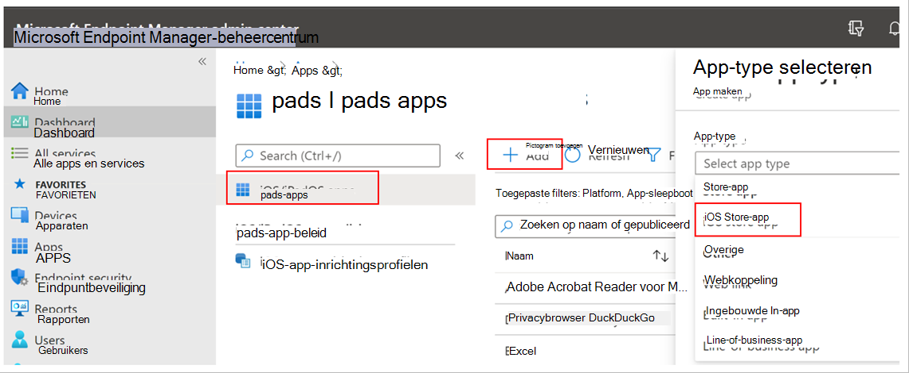
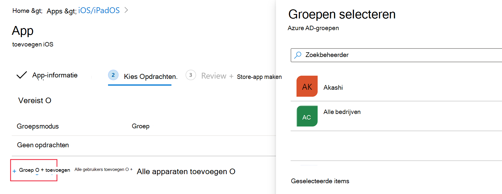
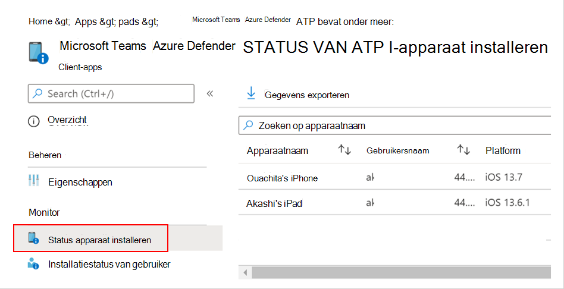
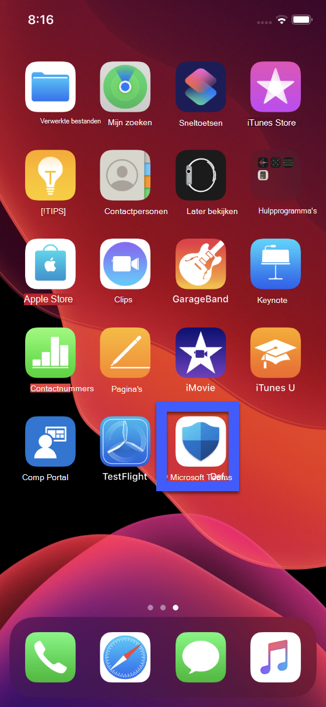
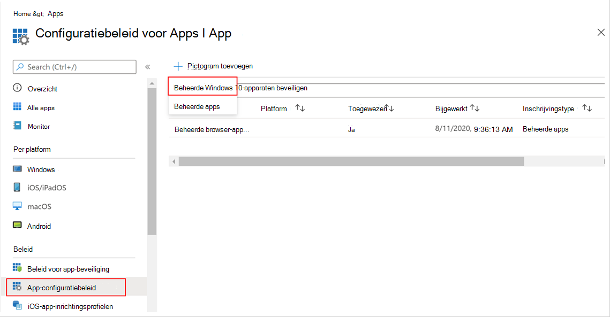
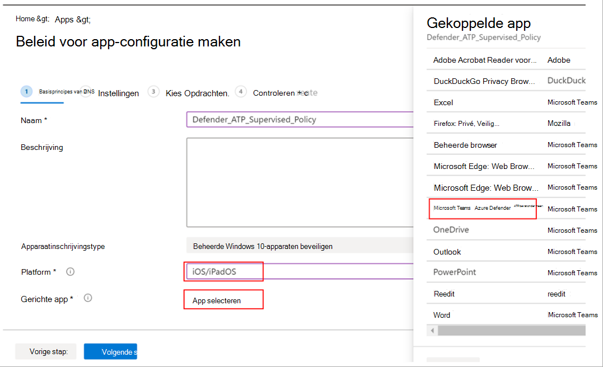

# Microsoft Defender voor eindpunt implementeren in iOSDeploy Microsoft Defender for Endpoint on iOS

[!INCLUDE [Microsoft 365 Defender rebranding](../../includes/microsoft-defender.md)]

**Van toepassing op:****Applies to:**
- [Microsoft Defender voor EindpuntMicrosoft Defender for Endpoint](https://go.microsoft.com/fwlink/p/?linkid=2154037)
- [Microsoft 365 DefenderMicrosoft 365 Defender](https://go.microsoft.com/fwlink/?linkid=2118804)

> Wilt u Defender voor Eindpunt ervaren?Want to experience Defender for Endpoint? [Meld u aan voor een gratis proefabonnement.Sign up for a free trial.](https://www.microsoft.com/microsoft-365/windows/microsoft-defender-atp?ocid=docs-wdatp-investigateip-abovefoldlink)

In dit onderwerp wordt beschreven hoe u Defender voor Eindpunt implementeert op iOS op Intune-bedrijfsportal geregistreerde apparaten.This topic describes deploying Defender for Endpoint on iOS on Intune Company Portal enrolled devices. Zie [IOS/iPadOS-apparaten registreren in Intune](/mem/intune/enrollment/ios-enroll)voor meer informatie over intune-apparaatinschrijvingen.For more information about Intune device enrollment, see [Enroll iOS/iPadOS devices in Intune](/mem/intune/enrollment/ios-enroll).

## Voordat u begintBefore you begin

- Zorg ervoor dat u toegang hebt tot [het Beheercentrum voor Microsoft Endpoint Manager.](https://go.microsoft.com/fwlink/?linkid=2109431)Ensure you have access to [Microsoft Endpoint manager admin center](https://go.microsoft.com/fwlink/?linkid=2109431).

- Zorg ervoor dat iOS-registratie is gedaan voor uw gebruikers.Ensure iOS enrollment is done for your users. Gebruikers moeten een Defender voor Eindpunt-licentie hebben toegewezen om Defender voor Eindpunt in iOS te kunnen gebruiken.Users need to have a Defender for Endpoint license assigned in order to use Defender for Endpoint on iOS. Raadpleeg [Licenties toewijzen aan gebruikers voor](/azure/active-directory/users-groups-roles/licensing-groups-assign) instructies over het toewijzen van licenties.Refer to [Assign licenses to users](/azure/active-directory/users-groups-roles/licensing-groups-assign) for instructions on how to assign licenses.

> [!NOTE]
> Microsoft Defender voor Eindpunt voor iOS is beschikbaar in de [Apple App Store.](https://aka.ms/mdatpiosappstore)Microsoft Defender for Endpoint on iOS is available in the [Apple App Store](https://aka.ms/mdatpiosappstore).

## ImplementatiestappenDeployment steps

Deploy Defender for Endpoint on iOS via Intune-bedrijfsportal.Deploy Defender for Endpoint on iOS via Intune Company Portal.

### IOS Store-app toevoegenAdd iOS store app

1. Ga [in het Microsoft Endpoint Manager-beheercentrum](https://go.microsoft.com/fwlink/?linkid=2109431)naar **Apps**  ->  **iOS/iPadOS**  ->    ->  **IOS Store-app** toevoegen en klik op **Selecteren.**In [Microsoft Endpoint manager admin center](https://go.microsoft.com/fwlink/?linkid=2109431), go to **Apps** -> **iOS/iPadOS** -> **Add** -> **iOS store app** and click **Select**.

    > [!div class="mx-imgBorder"]
    > 

1. Klik op de pagina App toevoegen op **Zoeken in de App Store** en typ Microsoft **Defender-eindpunt** in de zoekbalk.On the Add app page, click on **Search the App Store** and type **Microsoft Defender Endpoint** in the search bar. Klik in de sectie zoekresultaten op *Microsoft Defender-eindpunt en* klik op **Selecteren.**In the search results section, click on *Microsoft Defender Endpoint* and click **Select**.

1. Selecteer **iOS 11.0 als** het besturingssysteem Minimum.Select **iOS 11.0** as the Minimum operating system. Bekijk de rest van de informatie over de app en klik op **Volgende.**Review the rest of information about the app and click **Next**.

1. Ga in *de sectie Opdrachten* naar de sectie **Vereist** en selecteer **Groep toevoegen.**In the *Assignments* section, go to the **Required** section and select **Add group**. U kunt vervolgens de gebruikersgroep(s) kiezen die u wilt richten op Defender voor Eindpunt in de iOS-app.You can then choose the user group(s) that you would like to target Defender for Endpoint on iOS app. Klik **op Selecteren** en vervolgens op **Volgende.**Click **Select** and then **Next**.

    > [!NOTE]
    > De geselecteerde gebruikersgroep moet bestaan uit intune geregistreerde gebruikers.The selected user group should consist of Intune enrolled users.

    > [!div class="mx-imgBorder"]
    > 

1. Controleer in *de sectie Controleren +* maken of alle ingevoerde gegevens juist zijn en selecteer vervolgens **Maken.**In the *Review + Create* section, verify that all the information entered is correct and then select **Create**. Over een paar minuten moet de Defender voor Eindpunt-app worden gemaakt en wordt er een melding weergegeven in de rechterbovenhoek van de pagina.In a few moments, the Defender for Endpoint app should be created successfully, and a notification should show up at the top-right corner of the page.

1. Selecteer op de pagina met app-informatie die wordt weergegeven in de sectie Monitor de **status** apparaatinstallatie om te controleren of de installatie van het apparaat is voltooid. In the app information page that is displayed, in the **Monitor** section, select **Device install status** to verify that the device installation has completed successfully.

    > [!div class="mx-imgBorder"]
    > 

## Auto-Onboarding van VPN-profiel (Vereenvoudigde onboarding)Auto-Onboarding of VPN profile (Simplified Onboarding)

Beheerders kunnen de automatische installatie van VPN-profiel configureren.Admins can configure auto-setup of VPN profile. Hiermee wordt het VPN-profiel van Defender voor Eindpunt automatisch ingesteld zonder dat de gebruiker dit hoeft te doen tijdens onboarding.This will automatically setup the Defender for Endpoint VPN profile without having the user to do so while onboarding. Houd er rekening mee dat VPN wordt gebruikt om de functie Webbeveiliging te bieden.Note that VPN is used in order to provide the Web Protection feature. Dit is geen gewone VPN en is een lokale/self-looping VPN die geen verkeer buiten het apparaat neemt.This is not a regular VPN and is a local/self-looping VPN that does not take traffic outside the device.

1. Ga [in het Microsoft Endpoint Manager-beheercentrum](https://go.microsoft.com/fwlink/?linkid=2109431)naar Profiel maken van   ->    ->  **apparatenconfiguratieprofielen.**In [Microsoft Endpoint manager admin center](https://go.microsoft.com/fwlink/?linkid=2109431), go to **Devices** -> **Configuration Profiles** -> **Create Profile**.
1. Kies **Platform** als **iOS/iPadOS** en **Profieltype** als **VPN.**Choose **Platform** as **iOS/iPadOS** and **Profile type** as **VPN**. Klik op **Maken**.Click **Create**.
1. Typ een naam voor het profiel en klik op **Volgende.**Type a name for the profile and click **Next**.
1. Selecteer **Aangepaste VPN** voor verbindingstype en voer in de sectie Base **VPN** het volgende in:Select **Custom VPN** for Connection Type and in the **Base VPN** section, enter the following:
    - Naam van verbinding = Microsoft Defender voor eindpuntConnection Name = Microsoft Defender for Endpoint
    - VPN-serveradres = 127.0.0.1VPN server address = 127.0.0.1
    - Auth method = "Gebruikersnaam en wachtwoord"Auth method = "Username and password"
    - Splits tunneling = UitschakelenSplit Tunneling = Disable
    - VPN-id = com.microsoft.scmxVPN identifier = com.microsoft.scmx
    - Voer in de sleutel-waardeparen de sleutel **AutoOnboard in** en stel de waarde in op **Waar.**In the key-value pairs, enter the key **AutoOnboard** and set the value to **True**.
    - Type automatische VPN = ON-demand VPNType of Automatic VPN = On-demand VPN
    - Klik **op Toevoegen** voor **Regels** op aanvraag en selecteer Ik wil het volgende doen **= VPN** instellen, ik wil beperken tot = Alle **domeinen**.Click **Add** for **On Demand Rules** and select **I want to do the following = Establish VPN**, **I want to restrict to = All domains**.

    

1. Klik op Volgende en wijs het profiel toe aan gerichte gebruikers.Click Next and assign the profile to targeted users.
1. Controleer in *de sectie Controleren +* maken of alle ingevoerde gegevens juist zijn en selecteer vervolgens **Maken.**In the *Review + Create* section, verify that all the information entered is correct and then select **Create**.

## De onboarding- en controlestatus voltooienComplete onboarding and check status

1. Zodra Defender voor Eindpunt op iOS is geïnstalleerd op het apparaat, ziet u het app-pictogram.Once Defender for Endpoint on iOS has been installed on the device, you  will see the app icon.

    

2. Tik op het pictogram van de Defender voor eindpunt-app (MSDefender) en volg de instructies op het scherm om de onboarding-stappen uit te voeren.Tap the Defender for Endpoint app icon (MSDefender) and follow the on-screen instructions to complete the onboarding steps. De details omvatten de acceptatie door eindgebruikers van iOS-machtigingen die vereist zijn door Defender voor Eindpunt in iOS.The details include end-user acceptance of iOS permissions required by Defender for Endpoint on iOS.

3. Na succesvolle onboarding wordt het apparaat weergegeven in de lijst Apparaten in Microsoft Defender-beveiligingscentrum.Upon successful onboarding, the device will start showing up on the Devices list in Microsoft Defender Security Center.

    > [!div class="mx-imgBorder"]
    > 

## Microsoft Defender voor eindpunt configureren voor modus onder toezichtConfigure Microsoft Defender for Endpoint for Supervised Mode

De Microsoft Defender for Endpoint-app voor iOS heeft een speciale mogelijkheid op gecontroleerde iOS-/iPadOS-apparaten, gezien de verbeterde beheermogelijkheden die het platform biedt op dit type apparaten.The Microsoft Defender for Endpoint on iOS app has specialized ability on supervised iOS/iPadOS devices, given the increased management capabilities provided by the platform on these types of devices. Als u van deze mogelijkheden wilt profiteren, moet de Defender voor Eindpunt-app weten of een apparaat in de modus Onder toezicht staat.To take advantage of these capabilities, the Defender for Endpoint app needs to know if a device is in Supervised Mode.

### Modus onder toezicht configureren via IntuneConfigure Supervised Mode via Intune

Met Intune kunt u de Defender voor iOS-app configureren via een beleid voor app-configuratie.Intune allows you to configure the Defender for iOS app through an App Configuration policy.

   > [!NOTE]
   > Dit app-configuratiebeleid voor apparaten met toezicht is alleen van toepassing op beheerde apparaten en moet als beste zijn gericht op alle beheerde iOS-apparaten.This app configuration policy for supervised devices is applicable only to managed devices and should be targeted for all managed iOS devices as a best practice.

1. Meld u aan bij het [Microsoft Endpoint Manager beheercentrum](https://go.microsoft.com/fwlink/?linkid=2109431) en ga naar **Het configuratiebeleid** voor Apps  >  **App**  >  **Toevoegen.**Sign in to the [Microsoft Endpoint Manager admin center](https://go.microsoft.com/fwlink/?linkid=2109431) and go to **Apps** > **App configuration policies** > **Add**. Klik op **Beheerde apparaten.**Click on **Managed devices**.

    > [!div class="mx-imgBorder"]
    > 

1. Geef op *de pagina Configuratiebeleid voor* apps maken de volgende informatie op:In the *Create app configuration policy* page, provide the following information:
    - Naam van beleidPolicy Name
    - Platform: selecteer iOS/iPadOSPlatform: Select iOS/iPadOS
    - Targeted app: Selecteer **Microsoft Defender Endpoint** in de lijstTargeted app: Select **Microsoft Defender Endpoint** from the list

    > [!div class="mx-imgBorder"]
    > 

1. Selecteer configuratieontwerper gebruiken als **opmaak** in het volgende scherm.In the next screen, select **Use configuration designer** as the format. Geef de volgende eigenschap op:Specify the following property:
    - Configuratiesleutel: wordt onder toezichtConfiguration Key: issupervised
    - Waardetype: tekenreeksValue type: String
    - Configuratiewaarde: {{issupervised}}Configuration Value: {{issupervised}}
    
    > [!div class="mx-imgBorder"]
    > 

1. Klik **op Volgende** om de pagina **Bereiklabels te** openen.Click **Next** to open the **Scope tags** page. Bereiklabels zijn optioneel.Scope tags are optional. Klik **op Volgende om** door te gaan.Click **Next** to continue.

1. Selecteer op **de pagina** Opdrachten de groepen die dit profiel ontvangen.On the **Assignments** page, select the groups that will receive this profile. Voor dit scenario is het de beste manier om alle apparaten **te targeten.**For this scenario, it is best practice to target **All Devices**. Zie Gebruikers- en apparaatprofielen toewijzen voor meer informatie over het toewijzen [van profielen.](/mem/intune/configuration/device-profile-assign)For more information on assigning profiles, see [Assign user and device profiles](/mem/intune/configuration/device-profile-assign).

   Bij het implementeren naar gebruikersgroepen moet een gebruiker zich aanmelden bij een apparaat voordat het beleid van toepassing is.When deploying to user groups, a user must sign in to a device before the policy applies.

   Klik op **Volgende**.Click **Next**.

1. Kies op **de pagina Controleren +** maken de optie Maken als u klaar **bent.**On the **Review + create** page, when you're done, choose **Create**. Het nieuwe profiel wordt weergegeven in de lijst met configuratieprofielen.The new profile is displayed in the list of configuration profiles.

1. Vervolgens kunt u een aangepast profiel implementeren op de gecontroleerde iOS-apparaten voor uitgebreide anti-phishing-mogelijkheden.Next, for enhanced Anti-phishing capabilities, you can deploy a custom profile on the supervised iOS devices. Volg de onderstaande stappen:Follow the steps below:
    - Het config-profiel downloaden van [https://aka.ms/mdatpiossupervisedprofile](https://aka.ms/mdatpiossupervisedprofile)Download the config profile from [https://aka.ms/mdatpiossupervisedprofile](https://aka.ms/mdatpiossupervisedprofile)
    - Ga naar **Apparaten**  ->  **iOS/iPadOS-configuratieprofielen**  ->    ->  **Profiel maken**Navigate to **Devices** -> **iOS/iPadOS** -> **Configuration profiles** -> **Create Profile**

    > [!div class="mx-imgBorder"]
    > 

    - Geef een naam op van het profiel.Provide a name of the profile. Wanneer u wordt gevraagd een configuratieprofielbestand te importeren, selecteert u het profiel dat hierboven is gedownload.When prompted to import a Configuration profile file, select the one downloaded above.
    - Selecteer in **de** sectie Toewijzing de apparaatgroep waarop u dit profiel wilt toepassen.In the **Assignment** section, select the device group to which you want to apply this profile. Dit moet worden toegepast op alle beheerde iOS-apparaten.As a best practice, this should be applied to all managed iOS devices. Klik op **Volgende**.Click **Next**.
    - Kies op **de pagina Controleren +** maken de optie Maken als u klaar **bent.**On the **Review + create** page, when you're done, choose **Create**. Het nieuwe profiel wordt weergegeven in de lijst met configuratieprofielen.The new profile is displayed in the list of configuration profiles.

## Volgende stappenNext Steps

[Defender voor eindpunt configureren voor iOS-functiesConfigure Defender for Endpoint on iOS features](ios-configure-features.md)
