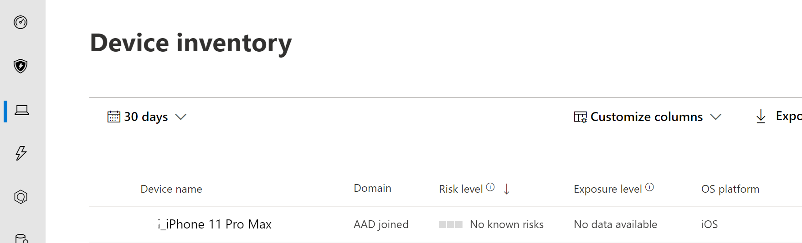

# Microsoft Defender voor eindpunt voor iOS implementerenDeploy Microsoft Defender for Endpoint for iOS

[!INCLUDE [Microsoft 365 Defender rebranding](../../includes/microsoft-defender.md)]

**Van toepassing op:****Applies to:**
- [Microsoft Defender voor EndpointMicrosoft Defender for Endpoint](https://go.microsoft.com/fwlink/p/?linkid=2146631)
- [Microsoft 365 DefenderMicrosoft 365 Defender](https://go.microsoft.com/fwlink/?linkid=2118804)

> Wilt u Defender voor Eindpunt ervaren?Want to experience Defender for Endpoint? [Meld u aan voor een gratis proefabonnement.Sign up for a free trial.](https://www.microsoft.com/microsoft-365/windows/microsoft-defender-atp?ocid=docs-wdatp-investigateip-abovefoldlink)

In dit onderwerp wordt beschreven hoe u Defender voor Eindpunt voor iOS implementeert op intune Company Portal ingeschreven apparaten.This topic describes deploying Defender for Endpoint for iOS on Intune Company Portal enrolled devices. Zie [IOS/iPadOS-apparaten registreren in Intune](https://docs.microsoft.com/mem/intune/enrollment/ios-enroll)voor meer informatie over intune-apparaatinschrijvingen.For more information about Intune device enrollment, see [Enroll iOS/iPadOS devices in Intune](https://docs.microsoft.com/mem/intune/enrollment/ios-enroll).

## Voordat u begintBefore you begin

- Zorg ervoor dat u toegang hebt tot [het Beheercentrum voor Microsoft Endpoint Manager.](https://go.microsoft.com/fwlink/?linkid=2109431)Ensure you have access to [Microsoft Endpoint manager admin center](https://go.microsoft.com/fwlink/?linkid=2109431).

- Zorg ervoor dat iOS-registratie is gedaan voor uw gebruikers.Ensure iOS enrollment is done for your users. Gebruikers moeten een Defender voor Eindpunt-licentie hebben toegewezen om Defender voor Eindpunt voor iOS te kunnen gebruiken.Users need to have a Defender for Endpoint license assigned in order to use Defender for Endpoint for iOS. Raadpleeg [Licenties toewijzen aan gebruikers voor](https://docs.microsoft.com/azure/active-directory/users-groups-roles/licensing-groups-assign) instructies over het toewijzen van licenties.Refer to [Assign licenses to users](https://docs.microsoft.com/azure/active-directory/users-groups-roles/licensing-groups-assign) for instructions on how to assign licenses.

> [!NOTE]
> Microsoft Defender ATP (Microsoft Defender voor Eindpunt) voor iOS is nu beschikbaar in de [Apple App Store.](https://aka.ms/mdatpiosappstore)Microsoft Defender ATP (Microsoft Defender for Endpoint) for iOS is now available in the [Apple App Store](https://aka.ms/mdatpiosappstore).

## ImplementatiestappenDeployment steps

Deploy Defender for Endpoint for iOS via Intune Company Portal.Deploy Defender for Endpoint for iOS via Intune Company Portal.

### IOS Store-app toevoegenAdd iOS store app

1. Ga [in het Microsoft Endpoint Manager-beheercentrum](https://go.microsoft.com/fwlink/?linkid=2109431)naar **Apps**  ->  **iOS/iPadOS**  ->    ->  **IOS Store-app** toevoegen en klik op **Selecteren.**In [Microsoft Endpoint manager admin center](https://go.microsoft.com/fwlink/?linkid=2109431), go to **Apps** -> **iOS/iPadOS** -> **Add** -> **iOS store app** and click **Select**.

    > [!div class="mx-imgBorder"]
    > 

1. Klik op de pagina App toevoegen op **Zoeken in de App Store** en typ Microsoft Defender **ATP** in de zoekbalk.On the Add app page, click on **Search the App Store** and type **Microsoft Defender ATP** in the search bar. Klik in de sectie zoekresultaten op *Microsoft Defender ATP* en klik op **Selecteren.**In the search results section, click on *Microsoft Defender ATP* and click **Select**.

1. Selecteer **iOS 11.0 als** het besturingssysteem Minimum.Select **iOS 11.0** as the Minimum operating system. Bekijk de rest van de informatie over de app en klik op **Volgende.**Review the rest of information about the app and click **Next**.

1. Ga in *de sectie Opdrachten* naar de sectie **Vereist** en selecteer **Groep toevoegen.**In the *Assignments* section, go to the **Required** section and select **Add group**. Vervolgens kunt u de gebruikersgroep(s) kiezen die u wilt richten op Defender voor Endpoint voor iOS-app.You can then choose the user group(s) that you would like to target Defender for Endpoint for iOS app. Klik **op Selecteren** en vervolgens op **Volgende.**Click **Select** and then **Next**.

    > [!NOTE]
    > De geselecteerde gebruikersgroep moet bestaan uit intune geregistreerde gebruikers.The selected user group should consist of Intune enrolled users.

    > [!div class="mx-imgBorder"]
    > 

1. Controleer in *de sectie Controleren +* maken of alle ingevoerde gegevens juist zijn en selecteer vervolgens **Maken.**In the *Review + Create* section, verify that all the information entered is correct and then select **Create**. Over een paar minuten moet de Defender voor Eindpunt-app worden gemaakt en wordt er een melding weergegeven in de rechterbovenhoek van de pagina.In a few moments, the Defender for Endpoint app should be created successfully, and a notification should show up at the top-right corner of the page.

1. Selecteer op de pagina met app-informatie die wordt weergegeven in de sectie Monitor de **status** apparaatinstallatie om te controleren of de installatie van het apparaat is voltooid. In the app information page that is displayed, in the **Monitor** section, select **Device install status** to verify that the device installation has completed successfully.

    > [!div class="mx-imgBorder"]
    > 

## De onboarding- en controlestatus voltooienComplete onboarding and check status

1. Wanneer Defender voor Eindpunt voor iOS op het apparaat is geïnstalleerd, ziet u het app-pictogram.Once Defender for Endpoint for iOS has been installed on the device, you  will see the app icon.

    

2. Tik op het pictogram van de Defender voor eindpunt-app en volg de instructies op het scherm om de onboarding-stappen uit te voeren.Tap the Defender for Endpoint app icon and follow the on-screen instructions to complete the onboarding steps. De details omvatten de acceptatie door eindgebruikers van iOS-machtigingen die vereist zijn door Defender voor Eindpunt voor iOS.The details include end-user acceptance of iOS permissions required by Defender for Endpoint for iOS.

3. Na succesvolle onboarding wordt het apparaat weergegeven in de lijst Apparaten in het Microsoft Defender-beveiligingscentrum.Upon successful onboarding, the device will start showing up on the Devices list in Microsoft Defender Security Center.

    > [!div class="mx-imgBorder"]
    > 

## Microsoft Defender voor eindpunt configureren voor modus onder toezichtConfigure Microsoft Defender for Endpoint for Supervised Mode

De Microsoft Defender voor Endpoint voor iOS-app heeft een speciale mogelijkheid op gecontroleerde iOS-/iPadOS-apparaten, gezien de verbeterde beheermogelijkheden die het platform biedt op dit type apparaten.The Microsoft Defender for Endpoint for iOS app has specialized ability on supervised iOS/iPadOS devices, given the increased management capabilities provided by the platform on these types of devices. Als u van deze mogelijkheden wilt profiteren, moet de Defender voor Eindpunt-app weten of een apparaat in de modus Onder toezicht staat.To take advantage of these capabilities, the Defender for Endpoint app needs to know if a device is in Supervised Mode.

### Modus onder toezicht configureren via IntuneConfigure Supervised Mode via Intune

Met Intune kunt u de Defender voor iOS-app configureren via een beleid voor app-configuratie.Intune allows you to configure the Defender for iOS app through an App Configuration policy.

   > [!NOTE]
   > Dit app-configuratiebeleid voor apparaten met toezicht is alleen van toepassing op beheerde apparaten en moet als beste zijn gericht op alle beheerde iOS-apparaten.This app configuration policy for supervised devices is applicable only to managed devices and should be targeted for all managed iOS devices as a best practice.

1. Meld u aan bij [het Microsoft Endpoint Manager-beheercentrum](https://go.microsoft.com/fwlink/?linkid=2109431) en ga naar **Het configuratiebeleid** voor  >  **Apps App**  >  **Toevoegen.**Sign in to the [Microsoft Endpoint Manager admin center](https://go.microsoft.com/fwlink/?linkid=2109431) and go to **Apps** > **App configuration policies** > **Add**. Klik op **Beheerde apparaten.**Click on **Managed devices**.

    > [!div class="mx-imgBorder"]
    > 

1. Geef op *de pagina Configuratiebeleid voor* apps maken de volgende informatie op:In the *Create app configuration policy* page, provide the following information:
    - Naam van beleidPolicy Name
    - Platform: selecteer iOS/iPadOSPlatform: Select iOS/iPadOS
    - Gerichte app: Microsoft **Defender ATP selecteren** in de lijstTargeted app: Select **Microsoft Defender ATP** from the list

    > [!div class="mx-imgBorder"]
    > 

1. Selecteer configuratieontwerper gebruiken als **opmaak** in het volgende scherm.In the next screen, select **Use configuration designer** as the format. Geef de volgende eigenschap op:Specify the following property:
    - Configuratiesleutel: wordt onder toezichtConfiguration Key: issupervised
    - Waardetype: tekenreeksValue type: String
    - Configuratiewaarde: {{issupervised}}Configuration Value: {{issupervised}}
    
    > [!div class="mx-imgBorder"]
    > 

1. Klik **op Volgende** om de pagina **Bereiklabels te** openen.Click **Next** to open the **Scope tags** page. Bereiklabels zijn optioneel.Scope tags are optional. Klik **op Volgende om** door te gaan.Click **Next** to continue.

1. Selecteer op **de pagina** Opdrachten de groepen die dit profiel ontvangen.On the **Assignments** page, select the groups that will receive this profile. Voor dit scenario is het de beste manier om alle apparaten **te targeten.**For this scenario, it is best practice to target **All Devices**. Zie Gebruikers- en apparaatprofielen toewijzen voor meer informatie over het toewijzen [van profielen.](https://docs.microsoft.com/mem/intune/configuration/device-profile-assign)For more information on assigning profiles, see [Assign user and device profiles](https://docs.microsoft.com/mem/intune/configuration/device-profile-assign).

   Bij het implementeren naar gebruikersgroepen moet een gebruiker zich aanmelden bij een apparaat voordat het beleid van toepassing is.When deploying to user groups, a user must sign in to a device before the policy applies.

   Klik op **Volgende**.Click **Next**.

1. Kies op **de pagina Controleren +** maken de optie Maken als u klaar **bent.**On the **Review + create** page, when you're done, choose **Create**. Het nieuwe profiel wordt weergegeven in de lijst met configuratieprofielen.The new profile is displayed in the list of configuration profiles.

1. Vervolgens kunt u een aangepast profiel implementeren op de gecontroleerde iOS-apparaten voor uitgebreide anti-phishing-mogelijkheden.Next, for enhanced Anti-phishing capabilities, you can deploy a custom profile on the supervised iOS devices. Volg de onderstaande stappen:Follow the steps below:
    - Het config-profiel downloaden van [https://aka.ms/mdatpiossupervisedprofile](https://aka.ms/mdatpiossupervisedprofile)Download the config profile from [https://aka.ms/mdatpiossupervisedprofile](https://aka.ms/mdatpiossupervisedprofile)
    - Ga naar **Apparaten**  ->  **iOS/iPadOS-configuratieprofielen**  ->    ->  **Profiel maken**Navigate to **Devices** -> **iOS/iPadOS** -> **Configuration profiles** -> **Create Profile**

    > [!div class="mx-imgBorder"]
    > 

    - Geef een naam op van het profiel.Provide a name of the profile. Wanneer u wordt gevraagd een configuratieprofielbestand te importeren, selecteert u het profiel dat hierboven is gedownload.When prompted to import a Configuration profile file, select the one downloaded above.
    - Selecteer in **de** sectie Toewijzing de apparaatgroep waarop u dit profiel wilt toepassen.In the **Assignment** section, select the device group to which you want to apply this profile. Dit moet worden toegepast op alle beheerde iOS-apparaten.As a best practice, this should be applied to all managed iOS devices. Klik op **Volgende**.Click **Next**.
    - Kies op **de pagina Controleren +** maken de optie Maken als u klaar **bent.**On the **Review + create** page, when you're done, choose **Create**. Het nieuwe profiel wordt weergegeven in de lijst met configuratieprofielen.The new profile is displayed in the list of configuration profiles.

## Volgende stappenNext Steps

[Defender configureren voor endpoint voor iOS-functiesConfigure Defender for Endpoint for iOS features](ios-configure-features.md)
