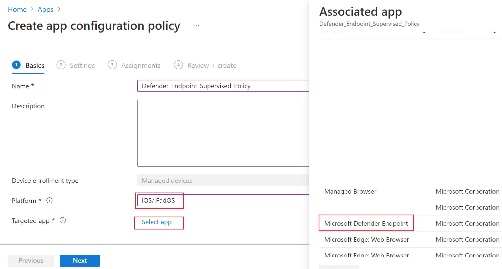

# Microsoft Defender voor eindpunt voor iOS implementeren

[!INCLUDE [Microsoft 365 Defender rebranding](../../includes/microsoft-defender.md)]

**Van toepassing op:**
- [Microsoft Defender voor Endpoint](https://go.microsoft.com/fwlink/p/?linkid=2154037)
- [Microsoft 365 Defender](https://go.microsoft.com/fwlink/?linkid=2118804)

> Wilt u Defender voor Eindpunt ervaren? [Meld u aan voor een gratis proefabonnement.](https://www.microsoft.com/microsoft-365/windows/microsoft-defender-atp?ocid=docs-wdatp-investigateip-abovefoldlink)

In dit onderwerp wordt beschreven hoe u Defender voor Eindpunt voor iOS implementeert op intune Company Portal ingeschreven apparaten. Zie [IOS/iPadOS-apparaten registreren in Intune](https://docs.microsoft.com/mem/intune/enrollment/ios-enroll)voor meer informatie over intune-apparaatinschrijvingen.

## Voordat u begint

- Zorg ervoor dat u toegang hebt tot [het Beheercentrum voor Microsoft Endpoint Manager.](https://go.microsoft.com/fwlink/?linkid=2109431)

- Zorg ervoor dat iOS-registratie is gedaan voor uw gebruikers. Gebruikers moeten een Defender voor Eindpunt-licentie hebben toegewezen om Defender voor Eindpunt voor iOS te kunnen gebruiken. Raadpleeg [Licenties toewijzen aan gebruikers voor](https://docs.microsoft.com/azure/active-directory/users-groups-roles/licensing-groups-assign) instructies over het toewijzen van licenties.

> [!NOTE]
> Microsoft Defender ATP (Microsoft Defender voor Eindpunt) voor iOS is nu beschikbaar in de [Apple App Store.](https://aka.ms/mdatpiosappstore)

## Implementatiestappen

Deploy Defender for Endpoint for iOS via Intune Company Portal.

### IOS Store-app toevoegen

1. Ga [in het Microsoft Endpoint Manager-beheercentrum](https://go.microsoft.com/fwlink/?linkid=2109431)naar **Apps**  ->  **iOS/iPadOS**  ->    ->  **IOS Store-app** toevoegen en klik op **Selecteren.**

    > [!div class="mx-imgBorder"]
    > 

1. Klik op de pagina App toevoegen op **Zoeken in de App Store** en typ Microsoft Defender **ATP** in de zoekbalk. Klik in de sectie zoekresultaten op *Microsoft Defender ATP* en klik op **Selecteren.**

1. Selecteer **iOS 11.0 als** het besturingssysteem Minimum. Bekijk de rest van de informatie over de app en klik op **Volgende.**

1. Ga in *de sectie Opdrachten* naar de sectie **Vereist** en selecteer **Groep toevoegen.** Vervolgens kunt u de gebruikersgroep(s) kiezen die u wilt richten op Defender voor Endpoint voor iOS-app. Klik **op Selecteren** en vervolgens op **Volgende.**

    > [!NOTE]
    > De geselecteerde gebruikersgroep moet bestaan uit intune geregistreerde gebruikers.

    > [!div class="mx-imgBorder"]
    > 

1. Controleer in *de sectie Controleren +* maken of alle ingevoerde gegevens juist zijn en selecteer vervolgens **Maken.** Over een paar minuten moet de Defender voor Eindpunt-app worden gemaakt en wordt er een melding weergegeven in de rechterbovenhoek van de pagina.

1. Selecteer op de pagina met app-informatie die wordt weergegeven in de sectie Monitor de **status** apparaatinstallatie om te controleren of de installatie van het apparaat is voltooid. 

    > [!div class="mx-imgBorder"]
    > 

## De onboarding- en controlestatus voltooien

1. Wanneer Defender voor Eindpunt voor iOS op het apparaat is geïnstalleerd, ziet u het app-pictogram.

    

2. Tik op het pictogram van de Defender voor eindpunt-app en volg de instructies op het scherm om de onboarding-stappen uit te voeren. De details omvatten de acceptatie door eindgebruikers van iOS-machtigingen die vereist zijn door Defender voor Eindpunt voor iOS.

3. Na succesvolle onboarding wordt het apparaat weergegeven in de lijst Apparaten in het Microsoft Defender-beveiligingscentrum.

    > [!div class="mx-imgBorder"]
    > 

## Microsoft Defender voor eindpunt configureren voor modus onder toezicht

De Microsoft Defender voor Endpoint voor iOS-app heeft een speciale mogelijkheid op gecontroleerde iOS-/iPadOS-apparaten, gezien de verbeterde beheermogelijkheden die het platform biedt op dit type apparaten. Als u van deze mogelijkheden wilt profiteren, moet de Defender voor Eindpunt-app weten of een apparaat in de modus Onder toezicht staat.

### Modus onder toezicht configureren via Intune

Met Intune kunt u de Defender voor iOS-app configureren via een beleid voor app-configuratie.

   > [!NOTE]
   > Dit app-configuratiebeleid voor apparaten met toezicht is alleen van toepassing op beheerde apparaten en moet als beste zijn gericht op alle beheerde iOS-apparaten.

1. Meld u aan bij [het Microsoft Endpoint Manager-beheercentrum](https://go.microsoft.com/fwlink/?linkid=2109431) en ga naar **Het configuratiebeleid** voor  >  **Apps App**  >  **Toevoegen.** Klik op **Beheerde apparaten.**

    > [!div class="mx-imgBorder"]
    > 

1. Geef op *de pagina Configuratiebeleid voor* apps maken de volgende informatie op:
    - Naam van beleid
    - Platform: selecteer iOS/iPadOS
    - Gerichte app: Microsoft **Defender ATP selecteren** in de lijst

    > [!div class="mx-imgBorder"]
    > 

1. Selecteer configuratieontwerper gebruiken als **opmaak** in het volgende scherm. Geef de volgende eigenschap op:
    - Configuratiesleutel: wordt onder toezicht
    - Waardetype: tekenreeks
    - Configuratiewaarde: {{issupervised}}
    
    > [!div class="mx-imgBorder"]
    > 

1. Klik **op Volgende** om de pagina **Bereiklabels te** openen. Bereiklabels zijn optioneel. Klik **op Volgende om** door te gaan.

1. Selecteer op **de pagina** Opdrachten de groepen die dit profiel ontvangen. Voor dit scenario is het de beste manier om alle apparaten **te targeten.** Zie Gebruikers- en apparaatprofielen toewijzen voor meer informatie over het toewijzen [van profielen.](https://docs.microsoft.com/mem/intune/configuration/device-profile-assign)

   Bij het implementeren naar gebruikersgroepen moet een gebruiker zich aanmelden bij een apparaat voordat het beleid van toepassing is.

   Klik op **Volgende**.

1. Kies op **de pagina Controleren +** maken de optie Maken als u klaar **bent.** Het nieuwe profiel wordt weergegeven in de lijst met configuratieprofielen.

1. Vervolgens kunt u een aangepast profiel implementeren op de gecontroleerde iOS-apparaten voor uitgebreide anti-phishing-mogelijkheden. Volg de onderstaande stappen:
    - Het config-profiel downloaden van [https://aka.ms/mdatpiossupervisedprofile](https://aka.ms/mdatpiossupervisedprofile)
    - Ga naar **Apparaten**  ->  **iOS/iPadOS-configuratieprofielen**  ->    ->  **Profiel maken**

    > [!div class="mx-imgBorder"]
    > 

    - Geef een naam op van het profiel. Wanneer u wordt gevraagd een configuratieprofielbestand te importeren, selecteert u het profiel dat hierboven is gedownload.
    - Selecteer in **de** sectie Toewijzing de apparaatgroep waarop u dit profiel wilt toepassen. Dit moet worden toegepast op alle beheerde iOS-apparaten. Klik op **Volgende**.
    - Kies op **de pagina Controleren +** maken de optie Maken als u klaar **bent.** Het nieuwe profiel wordt weergegeven in de lijst met configuratieprofielen.

## Volgende stappen

[Defender configureren voor endpoint voor iOS-functies](ios-configure-features.md)
