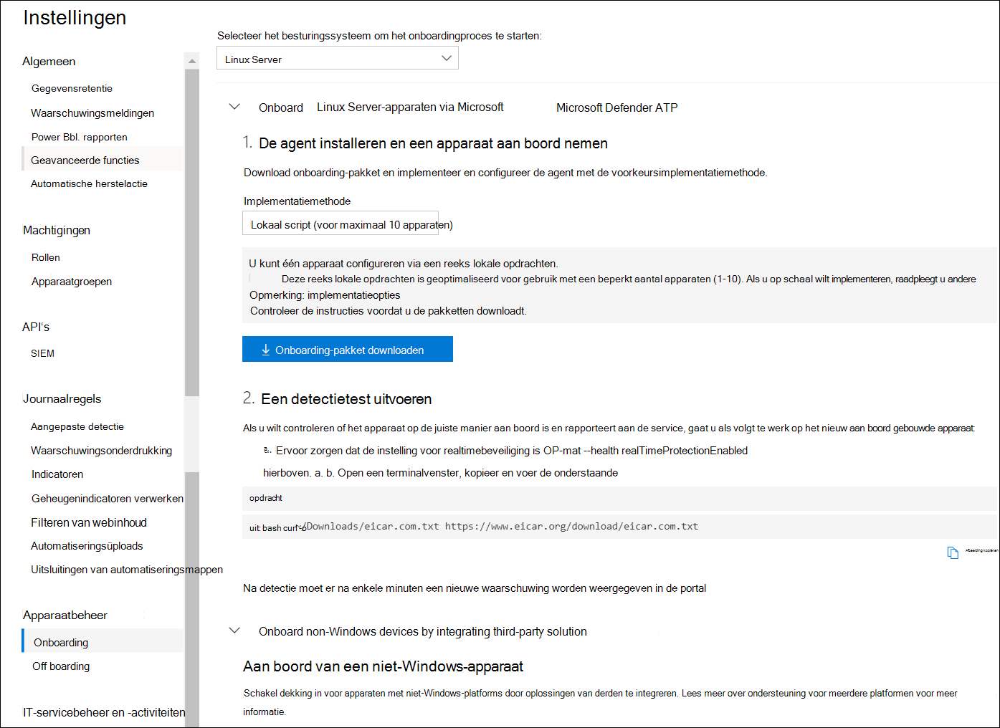

# <a name="deploy-microsoft-defender-for-endpoint-on-linux-manually"></a>Microsoft Defender voor Eindpunt handmatig implementeren op Linux

[!INCLUDE [Microsoft 365 Defender rebranding](../../includes/microsoft-defender.md)]


**Van toepassing op:**
- [Microsoft Defender voor Eindpunt](https://go.microsoft.com/fwlink/p/?linkid=2154037)
- [Microsoft 365 Defender](https://go.microsoft.com/fwlink/?linkid=2118804)

> Wilt u Defender voor Eindpunt ervaren? [Meld u aan voor een gratis proefabonnement.](https://www.microsoft.com/microsoft-365/windows/microsoft-defender-atp?ocid=docs-wdatp-investigateip-abovefoldlink)

In dit artikel wordt beschreven hoe u Microsoft Defender voor Eindpunt handmatig op Linux implementeert. Voor een geslaagde implementatie moeten alle volgende taken zijn voltooid:

- [Microsoft Defender voor Eindpunt handmatig implementeren op Linux](#deploy-microsoft-defender-for-endpoint-on-linux-manually)
  - [Vereisten en systeemvereisten](#prerequisites-and-system-requirements)
  - [De Linux-softwareopslagplaats configureren](#configure-the-linux-software-repository)
    - [RHEL en varianten (CentOS en Oracle Linux)](#rhel-and-variants-centos-and-oracle-linux)
    - [SLES en varianten](#sles-and-variants)
    - [Ubuntu- en Debian-systemen](#ubuntu-and-debian-systems)
  - [Toepassingsinstallatie](#application-installation)
  - [Het onboarding-pakket downloaden](#download-the-onboarding-package)
  - [Clientconfiguratie](#client-configuration)
  - [Installatiescript](#installer-script)
  - [Problemen met de installatie van logboeken](#log-installation-issues)
  - [Upgrades van besturingssysteem](#operating-system-upgrades)
  - [Verwijderen](#uninstallation)

## <a name="prerequisites-and-system-requirements"></a>Vereisten en systeemvereisten

Zie Microsoft Defender voor Eindpunt op [Linux](microsoft-defender-endpoint-linux.md) voordat u aan de slag gaat voor een beschrijving van vereisten en systeemvereisten voor de huidige softwareversie.

## <a name="configure-the-linux-software-repository"></a>De Linux-softwareopslagplaats configureren

Defender for Endpoint on Linux kan worden geïmplementeerd vanuit een van de volgende kanalen (hieronder aangeduid als *[kanaal]*): *insiders-fast*, *insiders-slow*, of *prod*. Elk van deze kanalen komt overeen met een Linux-softwareopslagplaats. Instructies voor het configureren van uw apparaat voor het gebruik van een van deze opslagplaatsen vindt u hieronder.

De keuze van het kanaal bepaalt het type en de frequentie van de updates die op uw apparaat worden aangeboden. Apparaten in *insiders-fast* zijn de eersten die updates en nieuwe functies ontvangen, later gevolgd door *insiders-slow* en ten laatste *door prod*.

Als u een voorbeeld van nieuwe functies wilt bekijken en vroegtijdig feedback wilt geven, wordt u aangeraden sommige apparaten in uw bedrijf te configureren om *insiders-fast* of *insiders-slow te gebruiken.*

> [!WARNING]
> Als u het kanaal na de eerste installatie overschakelt, moet het product opnieuw worden geïnstalleerd. Als u het productkanaal wilt wijzigen: verwijder het bestaande pakket, configureer het apparaat opnieuw om het nieuwe kanaal te gebruiken en volg de stappen in dit document om het pakket vanaf de nieuwe locatie te installeren.

### <a name="rhel-and-variants-centos-and-oracle-linux"></a>RHEL en varianten (CentOS en Oracle Linux)

- Installeren `yum-utils` als deze nog niet is geïnstalleerd:

    ```bash
    sudo yum install yum-utils
    ```

- Noteer uw distributie en versie en identificeer de dichtstbijzijnde vermelding (per hoofd- en vervolgens secundaire vermelding) onder `https://packages.microsoft.com/config/` . RHEL 7.9 is bijvoorbeeld dichter bij 7,4 dan bij 8.

    Vervang *[distro]* en *[versie]* in de onderstaande opdrachten door de gegevens die u hebt geïdentificeerd:

    > [!NOTE]
    > In het geval van Oracle Linux vervangt *u [distro] door* "rhel".

    ```bash
    sudo yum-config-manager --add-repo=https://packages.microsoft.com/config/[distro]/[version]/[channel].repo
    ```

    Als u bijvoorbeeld CentOS 7 gebruikt en Defender voor Eindpunt op Linux wilt implementeren via het *prod-kanaal:*

    ```bash
    sudo yum-config-manager --add-repo=https://packages.microsoft.com/config/centos/7/prod.repo
    ```

    Of als u nieuwe functies op geselecteerde apparaten wilt verkennen, kunt u MDE voor Linux implementeren voor *insiders-fast-kanaal:*

    ```bash
    sudo yum-config-manager --add-repo=https://packages.microsoft.com/config/centos/7/insiders-fast.repo
    ```

- Installeer de openbare Microsoft GPG-sleutel:

    ```bash
    sudo rpm --import http://packages.microsoft.com/keys/microsoft.asc
    ```

- Download en gebruik alle metagegevens voor de momenteel ingeschakelde yum-opslagplaatsen:

    ```bash
    yum makecache
    ```

### <a name="sles-and-variants"></a>SLES en varianten

- Noteer uw distributie en versie en identificeer de dichtstbijzijnde vermelding(per hoofd- en vervolgens secundaire) voor deze vermelding onder `https://packages.microsoft.com/config/` .

    Vervang *[distro]* en *[versie]* in de volgende opdrachten door de gegevens die u hebt geïdentificeerd:

    ```bash
    sudo zypper addrepo -c -f -n microsoft-[channel] https://packages.microsoft.com/config/[distro]/[version]/[channel].repo
    ```

    Als u bijvoorbeeld SLES 12 gebruikt en MDE voor Linux wilt implementeren vanuit het *prod-kanaal:*

    ```bash
    sudo zypper addrepo -c -f -n microsoft-prod https://packages.microsoft.com/config/sles/12/prod.repo
    ```

- Installeer de openbare Microsoft GPG-sleutel:

    ```bash
    sudo rpm --import http://packages.microsoft.com/keys/microsoft.asc
    ```

### <a name="ubuntu-and-debian-systems"></a>Ubuntu- en Debian-systemen

- Installeren `curl` als deze nog niet is geïnstalleerd:

    ```bash
    sudo apt-get install curl
    ```

- Installeren `libplist-utils` als deze nog niet is geïnstalleerd:

    ```bash
    sudo apt-get install libplist-utils
    ```

- Noteer uw distributie en versie en identificeer de dichtstbijzijnde vermelding (per hoofd- en vervolgens secundaire vermelding) onder `https://packages.microsoft.com/config` .

    Vervang *[distro]* en *[versie]* in de onderstaande opdracht door de gegevens die u hebt geïdentificeerd:

    ```bash
    curl -o microsoft.list https://packages.microsoft.com/config/[distro]/[version]/[channel].list
    ```

    Als u bijvoorbeeld Ubuntu 18.04 gebruikt en MDE voor Linux wilt implementeren vanuit het *prod-kanaal:*

    ```bash
    curl -o microsoft.list https://packages.microsoft.com/config/ubuntu/18.04/prod.list
    ```

- Installeer de configuratie van de opslagplaats:

    ```bash
    sudo mv ./microsoft.list /etc/apt/sources.list.d/microsoft-[channel].list
    ```
    Als u bijvoorbeeld *prod-kanaal kiest:*

    ```bash
    sudo mv ./microsoft.list /etc/apt/sources.list.d/microsoft-prod.list
    ```

- Installeer het `gpg` pakket als het nog niet is geïnstalleerd:

    ```bash
    sudo apt-get install gpg
    ```

  Als `gpg` deze niet beschikbaar is, installeert u `gnupg` .

- Installeer de openbare Microsoft GPG-sleutel:

    ```bash
    curl https://packages.microsoft.com/keys/microsoft.asc | sudo apt-key add -
    ```

- Installeer het https-stuurprogramma als dit nog niet aanwezig is:

    ```bash
    sudo apt-get install apt-transport-https
    ```

- De metagegevens van de opslagplaats bijwerken:

    ```bash
    sudo apt-get update
    ```

## <a name="application-installation"></a>Toepassingsinstallatie

- RHEL en varianten (CentOS en Oracle Linux):

    ```bash
    sudo yum install mdatp
    ```

    Als u meerdere Microsoft-opslagplaatsen hebt geconfigureerd op uw apparaat, kunt u specifiek zijn over welke opslagplaats u het pakket wilt installeren. In het volgende voorbeeld ziet u hoe u het pakket installeert vanuit het kanaal als u ook het `production` `insiders-fast` archiefkanaal hebt geconfigureerd op dit apparaat. Deze situatie kan zich voor doen als u meerdere Microsoft-producten op uw apparaat gebruikt. Afhankelijk van de distributie en de versie van uw server, kan de alias van de opslagplaats anders zijn dan de alias in het volgende voorbeeld.

    ```bash
    # list all repositories
    yum repolist
    ```
    ```Output
    ...
    packages-microsoft-com-prod               packages-microsoft-com-prod        316
    packages-microsoft-com-prod-insiders-fast packages-microsoft-com-prod-ins      2
    ...
    ```
    ```bash
    # install the package from the production repository
    sudo yum --enablerepo=packages-microsoft-com-prod install mdatp
    ```

- SLES en varianten:

    ```bash
    sudo zypper install mdatp
    ```

    Als u meerdere Microsoft-opslagplaatsen hebt geconfigureerd op uw apparaat, kunt u specifiek zijn over welke opslagplaats u het pakket wilt installeren. In het volgende voorbeeld ziet u hoe u het pakket installeert vanuit het kanaal als u ook het `production` `insiders-fast` archiefkanaal hebt geconfigureerd op dit apparaat. Deze situatie kan zich voor doen als u meerdere Microsoft-producten op uw apparaat gebruikt.

    ```bash
    zypper repos
    ```

    ```Output
    ...
    #  | Alias | Name | ...
    XX | packages-microsoft-com-insiders-fast | microsoft-insiders-fast | ...
    XX | packages-microsoft-com-prod | microsoft-prod | ...
    ...
    ```
    ```bash
    sudo zypper install packages-microsoft-com-prod:mdatp
    ```

- Ubuntu- en Debian-systeem:

    ```bash
    sudo apt-get install mdatp
    ```

    Als u meerdere Microsoft-opslagplaatsen hebt geconfigureerd op uw apparaat, kunt u specifiek zijn over welke opslagplaats u het pakket wilt installeren. In het volgende voorbeeld ziet u hoe u het pakket installeert vanuit het kanaal als u ook het `production` `insiders-fast` archiefkanaal hebt geconfigureerd op dit apparaat. Deze situatie kan zich voor doen als u meerdere Microsoft-producten op uw apparaat gebruikt.

    ```bash
    cat /etc/apt/sources.list.d/*
    ```
    ```Output
    deb [arch=arm64,armhf,amd64] https://packages.microsoft.com/ubuntu/18.04/prod insiders-fast main
    deb [arch=amd64] https://packages.microsoft.com/ubuntu/18.04/prod bionic main
    ```
    ```bash
    sudo apt -t bionic install mdatp
    ```

## <a name="download-the-onboarding-package"></a>Het onboarding-pakket downloaden

Download het onboarding-pakket van Microsoft Defender-beveiligingscentrum:

1. Ga Microsoft Defender-beveiligingscentrum naar Instellingen > **Device Management > Onboarding.**
2. Selecteer in de eerste vervolgkeuzelijst **Linux Server** als besturingssysteem. Selecteer in de tweede vervolgkeuzelijst Lokaal script (voor maximaal **10 apparaten)** als implementatiemethode.
3. Selecteer **Onboarding-pakket downloaden.** Sla het bestand op als WindowsDefenderATPOnboardingPackage.zip.

    

4. Controleer in een opdrachtprompt of u het bestand hebt.
    Haal de inhoud van het archief op:

    ```bash
    ls -l
    ```

    ```Output
    total 8
    -rw-r--r-- 1 test  staff  5752 Feb 18 11:22 WindowsDefenderATPOnboardingPackage.zip
    ```

    ```bash
    unzip WindowsDefenderATPOnboardingPackage.zip
    ```
    ```Output
    Archive:  WindowsDefenderATPOnboardingPackage.zip
    inflating: MicrosoftDefenderATPOnboardingLinuxServer.py
    ```


## <a name="client-configuration"></a>Clientconfiguratie

1. Kopieer MicrosoftDefenderATPOnboardingLinuxServer.py naar het doelapparaat.

    In eerste instantie is het clientapparaat niet gekoppeld aan een organisatie. Houd er rekening mee *dat het orgId-kenmerk* leeg is:

    ```bash
    mdatp health --field org_id
    ```

2. Voer MicrosoftDefenderATPOnboardingLinuxServer.py uit en houd er rekening mee dat u deze opdracht moet hebben geïnstalleerd `python` op het apparaat:

    ```bash
    python MicrosoftDefenderATPOnboardingLinuxServer.py
    ```

3. Controleer of het apparaat nu is gekoppeld aan uw organisatie en rapporteer een geldige organisatie-id:

    ```bash
    mdatp health --field org_id
    ```

4. Enkele minuten nadat u de installatie hebt voltooid, kunt u de status zien door de volgende opdracht uit te voeren. Een retourwaarde van `1` geeft aan dat het product werkt zoals verwacht:

    ```bash
    mdatp health --field healthy
    ```

    > [!IMPORTANT]
    > Wanneer het product voor het eerst wordt gestart, worden de meest recente antimalwaredefinities gedownload. Afhankelijk van uw internetverbinding kan dit enkele minuten duren. Gedurende deze periode retourneert de bovenstaande opdracht een waarde van `false` . U kunt de status van de definitie-update controleren met de volgende opdracht:
    > ```bash
    > mdatp health --field definitions_status
    > ```
    > Houd er rekening mee dat u mogelijk ook een proxy moet configureren na het voltooien van de eerste installatie. Zie [Defender voor eindpunt configureren op Linux voor statische proxydetectie: Configuratie na installatie](https://docs.microsoft.com/microsoft-365/security/defender-endpoint/linux-static-proxy-configuration#post-installation-configuration).

5. Voer een detectietest uit om te controleren of het apparaat goed is onboarded en rapporteert aan de service. Voer de volgende stappen uit op het nieuwe onboarded-apparaat:

    - Zorg ervoor dat realtimebeveiliging is ingeschakeld (aangegeven door een resultaat van het uitvoeren van `1` de volgende opdracht):

        ```bash
        mdatp health --field real_time_protection_enabled
        ```

    - Open een terminalvenster. Kopieer en voer de volgende opdracht uit:

        ``` bash
        curl -o /tmp/eicar.com.txt https://www.eicar.org/download/eicar.com.txt
        ```

    - Het bestand had in quarantaine moeten zijn geplaatst door Defender voor Eindpunt op Linux. Gebruik de volgende opdracht om alle gedetecteerde bedreigingen op te geven:

        ```bash
        mdatp threat list
        ```

## <a name="installer-script"></a>Installatiescript

U kunt ook een geautomatiseerd installatieprogramma [bash-script gebruiken](https://github.com/microsoft/mdatp-xplat/blob/master/linux/installation/mde_installer.sh) dat beschikbaar is in onze [openbare GitHub repository.](https://github.com/microsoft/mdatp-xplat/)
Het script identificeert de distributie en versie en stelt het apparaat in om het nieuwste pakket op te halen en te installeren.
U kunt ook aan boord gaan met een meegeleverd script.

```bash
❯ ./mde_installer.sh --help
usage: basename ./mde_installer.sh [OPTIONS]
Options:
-c|--channel      specify the channel from which you want to install. Default: insiders-fast
-i|--install      install the product
-r|--remove       remove the product
-u|--upgrade      upgrade the existing product
-o|--onboard      onboard/offboard the product with <onboarding_script>
-p|--passive-mode set EPP to passive mode
-t|--tag          set a tag by declaring <name> and <value>. ex: -t GROUP Coders
-m|--min_req      enforce minimum requirements
-w|--clean        remove repo from package manager for a specific channel
-v|--version      print out script version
-h|--help         display help
```

Lees hier [meer.](https://github.com/microsoft/mdatp-xplat/tree/master/linux/installation)

## <a name="log-installation-issues"></a>Problemen met de installatie van logboeken

Zie [Installatieproblemen in logboeken](linux-resources.md#log-installation-issues) voor meer informatie over het vinden van het automatisch gegenereerde logboek dat door het installatieprogramma wordt gemaakt wanneer er een fout optreedt.

## <a name="operating-system-upgrades"></a>Upgrades van besturingssysteem

Wanneer u uw besturingssysteem upgradet naar een nieuwe hoofdversie, moet u Eerst Defender voor Eindpunt op Linux verwijderen, de upgrade installeren en defender voor eindpunt opnieuw configureren op Linux op uw apparaat.

## <a name="how-to-migrate-from-insiders-fast-to-production-channel"></a>Migreren van Insiders-Fast naar productiekanaal

1. Verwijder de versie 'Insiders-Fast-kanaal' van MDE voor Linux.

    ``
    sudo yum remove mdatp
    ``

1. De MDE voor Linux-Insiders-Fast uitschakelen  ``
    sudo yum repolist
    ``

    > [!NOTE]
    > De uitvoer moet 'packages-microsoft-com-fast-prod' laten zien.

    ``
    sudo yum-config-manager --disable packages-microsoft-com-fast-prod
    ``
1. Herdeploy MDE voor Linux met behulp van het 'Productiekanaal'.


## <a name="uninstallation"></a>Verwijderen

Zie [Verwijderen voor](linux-resources.md#uninstall) meer informatie over het verwijderen van Defender voor Eindpunt op Linux van clientapparaten.
