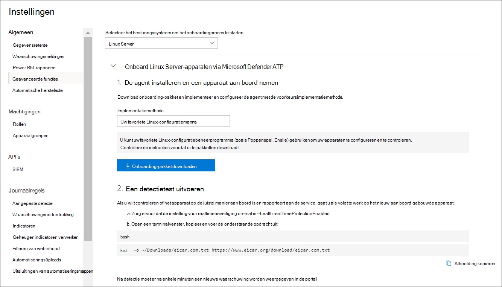

# <a name="deploy-microsoft-defender-for-endpoint-for-linux-with-ansible"></a>Microsoft Defender voor eindpunt voor Linux implementeren met Ansible

[!INCLUDE [Microsoft 365 Defender rebranding](../../includes/microsoft-defender.md)]


**Van toepassing op:**
- [Microsoft Defender voor Endpoint](https://go.microsoft.com/fwlink/p/?linkid=2146631)
- [Microsoft 365 Defender](https://go.microsoft.com/fwlink/?linkid=2118804)

> Wilt u Defender voor Eindpunt ervaren? [Meld u aan voor een gratis proefabonnement.](https://www.microsoft.com/microsoft-365/windows/microsoft-defender-atp?ocid=docs-wdatp-investigateip-abovefoldlink)

In dit artikel wordt beschreven hoe u Defender voor Eindpunt voor Linux implementeert met Ansible. Voor een geslaagde implementatie moeten alle volgende taken zijn voltooid:

- [Het onboarding-pakket downloaden](#download-the-onboarding-package)
- [Ansible YAML-bestanden maken](#create-ansible-yaml-files)
- [Implementatie](#deployment)
- [Verwijzingen](#references)

## <a name="prerequisites-and-system-requirements"></a>Vereisten en systeemvereisten

Voordat u aan de slag gaat, bekijkt u de [hoofdpagina van Defender voor Eindpunt](microsoft-defender-endpoint-linux.md) voor Linux voor een beschrijving van vereisten en systeemvereisten voor de huidige softwareversie.

Bovendien moet u voor Ansible-implementatie bekend zijn met Ansible-beheertaken, Ansible configureren en weten hoe u playbooks en taken implementeert. Ansible heeft veel manieren om dezelfde taak uit te voeren. In deze instructies wordt ervan uitgenomen dat ondersteunde Ansible-modules beschikbaar zijn, zoals *apt* en *unarchive om* het pakket te implementeren. Uw organisatie kan een andere werkstroom gebruiken. Raadpleeg de [Ansible-documentatie](https://docs.ansible.com/) voor meer informatie.

- Ansible moet op ten minste één computer zijn geïnstalleerd (we noemen het de primaire computer).
- SSH moet zijn geconfigureerd voor een beheerdersaccount tussen de primaire computer en alle clients, en het wordt aanbevolen te configureren met openbare sleutelverificatie.
- De volgende software moet op alle clients zijn geïnstalleerd:
  - krul
  - python-apt

- Alle hosts moeten worden weergegeven in de volgende indeling in het `/etc/ansible/hosts` of relevante bestand:

    ```bash
    [servers]
    host1 ansible_ssh_host=10.171.134.39
    host2 ansible_ssh_host=51.143.50.51
    ```

- Pingtest:

    ```bash
    ansible -m ping all
    ```

## <a name="download-the-onboarding-package"></a>Het onboarding-pakket downloaden

Download het onboarding-pakket van het Microsoft Defender-beveiligingscentrum:

1. Ga in het Microsoft Defender-beveiligingscentrum naar **Instellingen > Apparaatbeheer > Onboarding.**
2. Selecteer in de eerste vervolgkeuzelijst **Linux Server** als besturingssysteem. Selecteer in de tweede vervolgkeuzelijst **Uw voorkeursprogramma** voor configuratiebeheer voor Linux als implementatiemethode.
3. Selecteer **Onboarding-pakket downloaden.** Sla het bestand op als WindowsDefenderATPOnboardingPackage.zip.

    

4. Controleer in een opdrachtprompt of u het bestand hebt. Haal de inhoud van het archief op:

    ```bash
    ls -l
    ```
    ```Output
    total 8
    -rw-r--r-- 1 test  staff  4984 Feb 18 11:22 WindowsDefenderATPOnboardingPackage.zip
    ```
    ```bash
    unzip WindowsDefenderATPOnboardingPackage.zip
    ```
    ```Output
    Archive:  WindowsDefenderATPOnboardingPackage.zip
    inflating: mdatp_onboard.json
    ```

## <a name="create-ansible-yaml-files"></a>Ansible YAML-bestanden maken

Maak een subtaak of rolbestanden die bijdragen aan een speelboek of taak.

- Maak de onboarding-taak: `onboarding_setup.yml`

    ```bash
    - name: Create MDATP directories
      file:
        path: /etc/opt/microsoft/mdatp/
        recurse: true
        state: directory
        mode: 0755
        owner: root
        group: root

    - name: Register mdatp_onboard.json
      stat:
        path: /etc/opt/microsoft/mdatp/mdatp_onboard.json
      register: mdatp_onboard

    - name: Extract WindowsDefenderATPOnboardingPackage.zip into /etc/opt/microsoft/mdatp
      unarchive:
        src: WindowsDefenderATPOnboardingPackage.zip
        dest: /etc/opt/microsoft/mdatp
        mode: 0600
        owner: root
        group: root
      when: not mdatp_onboard.stat.exists
    ```

- Voeg de defender voor eindpuntopslagplaats en de sleutel toe.

    Defender voor Eindpunt voor Linux kan worden geïmplementeerd via een van de volgende kanalen (hieronder aangeduid als *[kanaal]*): *insiders-fast,* *insiders-slow* of *prod*. Elk van deze kanalen komt overeen met een Linux-softwareopslagplaats.

    De keuze van het kanaal bepaalt het type en de frequentie van de updates die op uw apparaat worden aangeboden. Apparaten in *insiders-fast* zijn de eersten die updates en nieuwe functies ontvangen, later gevolgd door *insiders-slow* en ten laatste *door prod*.

    Als u een voorbeeld van nieuwe functies wilt bekijken en vroegtijdig feedback wilt geven, wordt u aangeraden sommige apparaten in uw bedrijf te configureren om *insiders-fast* of *insiders-slow te gebruiken.*

    > [!WARNING]
    > Als u het kanaal na de eerste installatie overschakelt, moet het product opnieuw worden geïnstalleerd. Als u het productkanaal wilt wijzigen: verwijder het bestaande pakket, configureer het apparaat opnieuw om het nieuwe kanaal te gebruiken en volg de stappen in dit document om het pakket vanaf de nieuwe locatie te installeren.

    Noteer uw distributie en versie en identificeer de dichtstbijzijnde vermelding voor de versie onder `https://packages.microsoft.com/config/` .

    Vervang *[distro]* en *[versie]* in de volgende opdrachten door de gegevens die u hebt geïdentificeerd.

    > [!NOTE]
    > In het geval van Oracle Linux vervangt *u [distro] door* "rhel".

  ```bash
  - name: Add Microsoft APT key
    apt_key:
      keyserver: https://packages.microsoft.com/
      id: BC528686B50D79E339D3721CEB3E94ADBE1229CF
    when: ansible_os_family == "Debian"

  - name: Add Microsoft apt repository for MDATP
    apt_repository:
      repo: deb [arch=arm64,armhf,amd64] https://packages.microsoft.com/[distro]/[version]/prod [channel] main
      update_cache: yes
      state: present
      filename: microsoft-[channel].list
    when: ansible_os_family == "Debian"

  - name: Add Microsoft DNF/YUM key
    rpm_key:
      state: present
      key: https://packages.microsoft.com/keys/microsoft.asc
    when: ansible_os_family == "RedHat"

  - name: Add  Microsoft yum repository for MDATP
    yum_repository:
      name: packages-microsoft-com-prod-[channel]
      description: Microsoft Defender for Endpoint
      file: microsoft-[channel]
      baseurl: https://packages.microsoft.com/[distro]/[version]/[channel]/
      gpgcheck: yes
      enabled: Yes
  when: ansible_os_family == "RedHat"
  ```

- Maak de Ansible-installatie en verwijder YAML-bestanden.

    - Voor apt-gebaseerde distributies gebruikt u het volgende YAML-bestand:

        ```bash
        cat install_mdatp.yml
        ```
        ```Output
        - hosts: servers
          tasks:
            - include: ../roles/onboarding_setup.yml
            - include: ../roles/add_apt_repo.yml
            - apt:
                name: mdatp
                state: latest
                update_cache: yes
        ```

        ```bash
        cat uninstall_mdatp.yml
        ```
        ```Output
        - hosts: servers
        tasks:
            - apt:
                name: mdatp
                state: absent
        ```

    - Voor op yum gebaseerde distributies gebruikt u het volgende YAML-bestand:

        ```bash
        cat install_mdatp_yum.yml
        ```
        ```Output
        - hosts: servers
          tasks:
            - include: ../roles/onboarding_setup.yml
            - include: ../roles/add_yum_repo.yml
            - yum:
              name: mdatp
              state: latest
              enablerepo: packages-microsoft-com-prod-[channel]
        ```

        ```bash
        cat uninstall_mdatp_yum.yml
        ```
        ```Output
        - hosts: servers
        tasks:
            - yum:
               name: mdatp
                state: absent
        ```

## <a name="deployment"></a>Implementatie

Voer nu de takenbestanden uit onder `/etc/ansible/playbooks/` of relevante adreslijst.

- Installatie:

    ```bash
    ansible-playbook /etc/ansible/playbooks/install_mdatp.yml -i /etc/ansible/hosts
    ```

> [!IMPORTANT]
> Wanneer het product voor het eerst wordt gestart, worden de meest recente antimalwaredefinities gedownload. Afhankelijk van uw internetverbinding kan dit enkele minuten duren.

- Validatie/configuratie:

    ```bash
    ansible -m shell -a 'mdatp connectivity test' all
    ```
    ```bash
    ansible -m shell -a 'mdatp health' all
    ```

- Verwijderen:

    ```bash
    ansible-playbook /etc/ansible/playbooks/uninstall_mdatp.yml -i /etc/ansible/hosts
    ```

## <a name="log-installation-issues"></a>Problemen met de installatie van logboeken

Zie [Installatieproblemen in logboeken](linux-resources.md#log-installation-issues) voor meer informatie over het vinden van het automatisch gegenereerde logboek dat door het installatieprogramma wordt gemaakt wanneer er een fout optreedt.

## <a name="operating-system-upgrades"></a>Upgrades van besturingssysteem

Wanneer u een upgrade van uw besturingssysteem naar een nieuwe hoofdversie hebt uitgevoerd, moet u Eerst Defender voor Eindpunt voor Linux verwijderen, de upgrade installeren en ten slotte Defender voor Eindpunt voor Linux opnieuw configureren op uw apparaat.

## <a name="references"></a>Verwijzingen

- [YUM-opslagplaatsen toevoegen of verwijderen](https://docs.ansible.com/ansible/2.3/yum_repository_module.html)

- [Pakketten beheren met de yum package manager](https://docs.ansible.com/ansible/latest/modules/yum_module.html)

- [APT-opslagplaatsen toevoegen en verwijderen](https://docs.ansible.com/ansible/latest/modules/apt_repository_module.html)

- [Apt-pakketten beheren](https://docs.ansible.com/ansible/latest/modules/apt_module.html)
