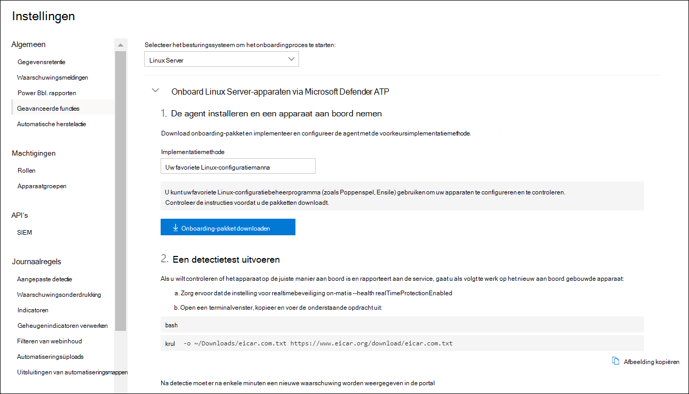

# <a name="deploy-microsoft-defender-for-endpoint-on-linux-with-puppet"></a><span data-ttu-id="8c568-104">Microsoft Defender voor eindpunt implementeren op Linux met Puppet</span><span class="sxs-lookup"><span data-stu-id="8c568-104">Deploy Microsoft Defender for Endpoint on Linux with Puppet</span></span>

[!INCLUDE [Microsoft 365 Defender rebranding](../../includes/microsoft-defender.md)]


<span data-ttu-id="8c568-105">**Van toepassing op:**</span><span class="sxs-lookup"><span data-stu-id="8c568-105">**Applies to:**</span></span>
- [<span data-ttu-id="8c568-106">Microsoft Defender voor Eindpunt</span><span class="sxs-lookup"><span data-stu-id="8c568-106">Microsoft Defender for Endpoint</span></span>](https://go.microsoft.com/fwlink/p/?linkid=2154037)
- [<span data-ttu-id="8c568-107">Microsoft 365 Defender</span><span class="sxs-lookup"><span data-stu-id="8c568-107">Microsoft 365 Defender</span></span>](https://go.microsoft.com/fwlink/?linkid=2118804)

> <span data-ttu-id="8c568-108">Wilt u Defender voor Eindpunt ervaren?</span><span class="sxs-lookup"><span data-stu-id="8c568-108">Want to experience Defender for Endpoint?</span></span> [<span data-ttu-id="8c568-109">Meld u aan voor een gratis proefabonnement.</span><span class="sxs-lookup"><span data-stu-id="8c568-109">Sign up for a free trial.</span></span>](https://www.microsoft.com/microsoft-365/windows/microsoft-defender-atp?ocid=docs-wdatp-investigateip-abovefoldlink)

<span data-ttu-id="8c568-110">In dit artikel wordt beschreven hoe u Defender voor Eindpunt op Linux implementeert met Behulp van Poppop.</span><span class="sxs-lookup"><span data-stu-id="8c568-110">This article describes how to deploy Defender for Endpoint on Linux using Puppet.</span></span> <span data-ttu-id="8c568-111">Voor een geslaagde implementatie moeten alle volgende taken zijn voltooid:</span><span class="sxs-lookup"><span data-stu-id="8c568-111">A successful deployment requires the completion of all of the following tasks:</span></span>

- [<span data-ttu-id="8c568-112">Het onboarding-pakket downloaden</span><span class="sxs-lookup"><span data-stu-id="8c568-112">Download the onboarding package</span></span>](#download-the-onboarding-package)
- [<span data-ttu-id="8c568-113">Poppopmanifest maken</span><span class="sxs-lookup"><span data-stu-id="8c568-113">Create Puppet manifest</span></span>](#create-a-puppet-manifest)
- [<span data-ttu-id="8c568-114">Implementatie</span><span class="sxs-lookup"><span data-stu-id="8c568-114">Deployment</span></span>](#deployment)
- [<span data-ttu-id="8c568-115">Onboarding-status controleren</span><span class="sxs-lookup"><span data-stu-id="8c568-115">Check onboarding status</span></span>](#check-onboarding-status)

## <a name="prerequisites-and-system-requirements"></a><span data-ttu-id="8c568-116">Vereisten en systeemvereisten</span><span class="sxs-lookup"><span data-stu-id="8c568-116">Prerequisites and system requirements</span></span>

 <span data-ttu-id="8c568-117">Zie de hoofdpagina van Defender voor Eindpunt op Linux voor een beschrijving van vereisten en systeemvereisten voor de huidige [softwareversie.](microsoft-defender-endpoint-linux.md)</span><span class="sxs-lookup"><span data-stu-id="8c568-117">For a description of prerequisites and system requirements for the current software version, see [the main Defender for Endpoint on Linux page](microsoft-defender-endpoint-linux.md).</span></span>

<span data-ttu-id="8c568-118">Daarnaast moet u voor de implementatie van Poppenspel bekend zijn met beheertaken van Poppenkast, Dat Popping is geconfigureerd en weet hoe u pakketten implementeert.</span><span class="sxs-lookup"><span data-stu-id="8c568-118">In addition, for Puppet deployment, you need to be familiar with Puppet administration tasks, have Puppet configured, and know how to deploy packages.</span></span> <span data-ttu-id="8c568-119">Poppop heeft veel manieren om dezelfde taak uit te voeren.</span><span class="sxs-lookup"><span data-stu-id="8c568-119">Puppet has many ways to complete the same task.</span></span> <span data-ttu-id="8c568-120">Deze instructies gaan uit van de beschikbaarheid van ondersteunde Poppopmodules, zoals *geschikt voor* het implementeren van het pakket.</span><span class="sxs-lookup"><span data-stu-id="8c568-120">These instructions assume availability of supported Puppet modules, such as *apt* to help deploy the package.</span></span> <span data-ttu-id="8c568-121">Uw organisatie kan een andere werkstroom gebruiken.</span><span class="sxs-lookup"><span data-stu-id="8c568-121">Your organization might use a different workflow.</span></span> <span data-ttu-id="8c568-122">Raadpleeg de [documentatie van De Poppop](https://puppet.com/docs) voor meer informatie.</span><span class="sxs-lookup"><span data-stu-id="8c568-122">Refer to the [Puppet documentation](https://puppet.com/docs) for details.</span></span>

## <a name="download-the-onboarding-package"></a><span data-ttu-id="8c568-123">Het onboarding-pakket downloaden</span><span class="sxs-lookup"><span data-stu-id="8c568-123">Download the onboarding package</span></span>

<span data-ttu-id="8c568-124">Download het onboarding-pakket van Microsoft Defender-beveiligingscentrum:</span><span class="sxs-lookup"><span data-stu-id="8c568-124">Download the onboarding package from Microsoft Defender Security Center:</span></span>

1. <span data-ttu-id="8c568-125">Ga Microsoft Defender-beveiligingscentrum naar Instellingen > **Device Management > Onboarding.**</span><span class="sxs-lookup"><span data-stu-id="8c568-125">In Microsoft Defender Security Center, go to **Settings > Device Management > Onboarding**.</span></span>
2. <span data-ttu-id="8c568-126">Selecteer in de eerste vervolgkeuzelijst **Linux Server** als besturingssysteem.</span><span class="sxs-lookup"><span data-stu-id="8c568-126">In the first drop-down menu, select **Linux Server** as the operating system.</span></span> <span data-ttu-id="8c568-127">Selecteer in de tweede vervolgkeuzelijst **Uw voorkeursprogramma** voor configuratiebeheer voor Linux als implementatiemethode.</span><span class="sxs-lookup"><span data-stu-id="8c568-127">In the second drop-down menu, select **Your preferred Linux configuration management tool** as the deployment method.</span></span>
3. <span data-ttu-id="8c568-128">Selecteer **Onboarding-pakket downloaden.**</span><span class="sxs-lookup"><span data-stu-id="8c568-128">Select **Download onboarding package**.</span></span> <span data-ttu-id="8c568-129">Sla het bestand op als WindowsDefenderATPOnboardingPackage.zip.</span><span class="sxs-lookup"><span data-stu-id="8c568-129">Save the file as WindowsDefenderATPOnboardingPackage.zip.</span></span>

    

4. <span data-ttu-id="8c568-131">Controleer in een opdrachtprompt of u het bestand hebt.</span><span class="sxs-lookup"><span data-stu-id="8c568-131">From a command prompt, verify that you have the file.</span></span> 

    ```bash
    ls -l
    ```
    ```Output
    total 8
    -rw-r--r-- 1 test  staff  4984 Feb 18 11:22 WindowsDefenderATPOnboardingPackage.zip
    ```
5. <span data-ttu-id="8c568-132">Haal de inhoud van het archief op.</span><span class="sxs-lookup"><span data-stu-id="8c568-132">Extract the contents of the archive.</span></span>
    ```bash
    unzip WindowsDefenderATPOnboardingPackage.zip
    ```
    ```Output
    Archive:  WindowsDefenderATPOnboardingPackage.zip
    inflating: mdatp_onboard.json
    ```

## <a name="create-a-puppet-manifest"></a><span data-ttu-id="8c568-133">Een pop-popmanifest maken</span><span class="sxs-lookup"><span data-stu-id="8c568-133">Create a Puppet manifest</span></span>

<span data-ttu-id="8c568-134">U moet een Poppopmanifest maken voor het implementeren van Defender voor Eindpunt op Linux op apparaten die worden beheerd door een Poppopserver.</span><span class="sxs-lookup"><span data-stu-id="8c568-134">You need to create a Puppet manifest for deploying Defender for Endpoint on Linux to devices managed by a Puppet server.</span></span> <span data-ttu-id="8c568-135">In dit voorbeeld wordt gebruik gemaakt van de *apt-* en *yumrepo-modules* die beschikbaar zijn via poppoplabs en wordt ervan uitgenomen dat de modules zijn geïnstalleerd op de Server van De Poppop.</span><span class="sxs-lookup"><span data-stu-id="8c568-135">This example makes use of the *apt* and *yumrepo* modules available from puppetlabs, and assumes that the modules have been installed on your Puppet server.</span></span>

<span data-ttu-id="8c568-136">Maak de mappen *install_mdatp/bestanden* en *install_mdatp/manifesten* onder de modulesmap van de installatie van Uw Poppenkast.</span><span class="sxs-lookup"><span data-stu-id="8c568-136">Create the folders *install_mdatp/files* and *install_mdatp/manifests* under the modules folder of your Puppet installation.</span></span> <span data-ttu-id="8c568-137">Deze map bevindt zich meestal in */etc/poppenkast/code/omgevingen/productie/modules* op uw Poppenspelserver.</span><span class="sxs-lookup"><span data-stu-id="8c568-137">This folder is typically located in */etc/puppetlabs/code/environments/production/modules* on your Puppet server.</span></span> <span data-ttu-id="8c568-138">Kopieer de mdatp_onboard.jsbestand dat hierboven is gemaakt *naar de map install_mdatp/bestanden.*</span><span class="sxs-lookup"><span data-stu-id="8c568-138">Copy the mdatp_onboard.json file created above to the *install_mdatp/files* folder.</span></span> <span data-ttu-id="8c568-139">Een *init.pp maken*</span><span class="sxs-lookup"><span data-stu-id="8c568-139">Create an *init.pp*</span></span> <span data-ttu-id="8c568-140">bestand met de implementatie-instructies:</span><span class="sxs-lookup"><span data-stu-id="8c568-140">file that contains the deployment instructions:</span></span>

```bash
pwd
```
```Output
/etc/puppetlabs/code/environments/production/modules
```

```bash
tree install_mdatp
```
```Output
install_mdatp
├── files
│   └── mdatp_onboard.json
└── manifests
    └── init.pp
```

### <a name="contents-of-install_mdatpmanifestsinitpp"></a><span data-ttu-id="8c568-141">Inhoud van `install_mdatp/manifests/init.pp`</span><span class="sxs-lookup"><span data-stu-id="8c568-141">Contents of `install_mdatp/manifests/init.pp`</span></span>

<span data-ttu-id="8c568-142">Defender for Endpoint on Linux kan worden geïmplementeerd vanuit een van de volgende kanalen (hieronder aangeduid als *[kanaal]*): *insiders-fast*, *insiders-slow*, of *prod*. Elk van deze kanalen komt overeen met een Linux-softwareopslagplaats.</span><span class="sxs-lookup"><span data-stu-id="8c568-142">Defender for Endpoint on Linux can be deployed from one of the following channels (denoted below as *[channel]*): *insiders-fast*, *insiders-slow*, or *prod*. Each of these channels corresponds to a Linux software repository.</span></span>

<span data-ttu-id="8c568-143">De keuze van het kanaal bepaalt het type en de frequentie van de updates die op uw apparaat worden aangeboden.</span><span class="sxs-lookup"><span data-stu-id="8c568-143">The choice of the channel determines the type and frequency of updates that are offered to your device.</span></span> <span data-ttu-id="8c568-144">Apparaten in *insiders-fast* zijn de eersten die updates en nieuwe functies ontvangen, later gevolgd door *insiders-slow* en ten laatste *door prod*.</span><span class="sxs-lookup"><span data-stu-id="8c568-144">Devices in *insiders-fast* are the first ones to receive updates and new features, followed later by *insiders-slow* and lastly by *prod*.</span></span>

<span data-ttu-id="8c568-145">Als u een voorbeeld van nieuwe functies wilt bekijken en vroegtijdig feedback wilt geven, wordt u aangeraden sommige apparaten in uw bedrijf te configureren om *insiders-fast* of *insiders-slow te gebruiken.*</span><span class="sxs-lookup"><span data-stu-id="8c568-145">In order to preview new features and provide early feedback, it is recommended that you configure some devices in your enterprise to use either *insiders-fast* or *insiders-slow*.</span></span>

> [!WARNING]
> <span data-ttu-id="8c568-146">Als u het kanaal na de eerste installatie overschakelt, moet het product opnieuw worden geïnstalleerd.</span><span class="sxs-lookup"><span data-stu-id="8c568-146">Switching the channel after the initial installation requires the product to be reinstalled.</span></span> <span data-ttu-id="8c568-147">Als u het productkanaal wilt wijzigen: verwijder het bestaande pakket, configureer het apparaat opnieuw om het nieuwe kanaal te gebruiken en volg de stappen in dit document om het pakket vanaf de nieuwe locatie te installeren.</span><span class="sxs-lookup"><span data-stu-id="8c568-147">To switch the product channel: uninstall the existing package, re-configure your device to use the new channel, and follow the steps in this document to install the package from the new location.</span></span>

<span data-ttu-id="8c568-148">Noteer uw distributie en versie en identificeer de dichtstbijzijnde vermelding voor de versie onder `https://packages.microsoft.com/config/` .</span><span class="sxs-lookup"><span data-stu-id="8c568-148">Note your distribution and version and identify the closest entry for it under `https://packages.microsoft.com/config/`.</span></span>

<span data-ttu-id="8c568-149">Vervang *[distro]* en *[versie]* in de onderstaande opdrachten door de gegevens die u hebt geïdentificeerd:</span><span class="sxs-lookup"><span data-stu-id="8c568-149">In the below commands, replace *[distro]* and *[version]* with the information you've identified:</span></span>

> [!NOTE]
> <span data-ttu-id="8c568-150">In het geval van RedHat, Oracle EL en CentOS 8 vervangt *u [distro] door* 'rhel'.</span><span class="sxs-lookup"><span data-stu-id="8c568-150">In case of RedHat, Oracle EL, and CentOS 8, replace *[distro]* with 'rhel'.</span></span>

```puppet
# Puppet manifest to install Microsoft Defender for Endpoint on Linux.
# @param channel The release channel based on your environment, insider-fast or prod.
# @param distro The Linux distribution in lowercase. In case of RedHat, Oracle EL, and CentOS 8, the distro variable should be 'rhel'.
# @param version The Linux distribution release number, e.g. 7.4.

class install_mdatp (
$channel = 'insiders-fast',
$distro = undef,
$version = undef
){
    case $::osfamily {
        'Debian' : {
            apt::source { 'microsoftpackages' :
                location => "https://packages.microsoft.com/${distro}/${version}/prod",
                release  => $channel,
                repos    => 'main',
                key      => {
                    'id'     => 'BC528686B50D79E339D3721CEB3E94ADBE1229CF',
                    'server' => 'keyserver.ubuntu.com',
                },
            }
        }
        'RedHat' : {
            yumrepo { 'microsoftpackages' :
                baseurl  => "https://packages.microsoft.com/${distro}/${version}/${channel}",
                descr    => "packages-microsoft-com-prod-${channel}",
                enabled  => 1,
                gpgcheck => 1,
                gpgkey   => 'https://packages.microsoft.com/keys/microsoft.asc'
            }
        }
        default : { fail("${::osfamily} is currently not supported.") }
    }

    case $::osfamily {
        /(Debian|RedHat)/: {
            file { ['/etc/opt', '/etc/opt/microsoft', '/etc/opt/microsoft/mdatp']:
                ensure => directory,
                owner  => root,
                group  => root,
                mode   => '0755'
            }

            file { '/etc/opt/microsoft/mdatp/mdatp_onboard.json':
                source  => 'puppet:///modules/install_mdatp/mdatp_onboard.json',
                owner   => root,
                group   => root,
                mode    => '0600',
                require => File['/etc/opt/microsoft/mdatp']
            }

            package { 'mdatp':
                ensure  => 'installed',
                require => File['/etc/opt/microsoft/mdatp/mdatp_onboard.json']
            }
        }
        default : { fail("${::osfamily} is currently not supported.") }
    }
}
```

## <a name="deployment"></a><span data-ttu-id="8c568-151">Implementatie</span><span class="sxs-lookup"><span data-stu-id="8c568-151">Deployment</span></span>

<span data-ttu-id="8c568-152">Neem het bovenstaande manifest op in uw site.pp</span><span class="sxs-lookup"><span data-stu-id="8c568-152">Include the above manifest in your site.pp</span></span> <span data-ttu-id="8c568-153">bestand:</span><span class="sxs-lookup"><span data-stu-id="8c568-153">file:</span></span>

```bash
cat /etc/puppetlabs/code/environments/production/manifests/site.pp
```
```Output
node "default" {
    include install_mdatp
}
```

<span data-ttu-id="8c568-154">Geregistreerde agentapparaten peilen regelmatig de Server van De Poppop en installeren nieuwe configuratieprofielen en beleid zodra ze worden gedetecteerd.</span><span class="sxs-lookup"><span data-stu-id="8c568-154">Enrolled agent devices periodically poll the Puppet Server and install new configuration profiles and policies as soon as they are detected.</span></span>

## <a name="monitor-puppet-deployment"></a><span data-ttu-id="8c568-155">Implementatie van Poppop controleren</span><span class="sxs-lookup"><span data-stu-id="8c568-155">Monitor Puppet deployment</span></span>

<span data-ttu-id="8c568-156">Op het agentapparaat kunt u ook de onboarding-status controleren door het volgende uit te werken:</span><span class="sxs-lookup"><span data-stu-id="8c568-156">On the agent device, you can also check the onboarding status by running:</span></span>

```bash
mdatp health
```
```Output
...
licensed                                : true
org_id                                  : "[your organization identifier]"
...
```

- <span data-ttu-id="8c568-157">**licentie:** Hiermee wordt bevestigd dat het apparaat is gekoppeld aan uw organisatie.</span><span class="sxs-lookup"><span data-stu-id="8c568-157">**licensed**: This confirms that the device is tied to your organization.</span></span>

- <span data-ttu-id="8c568-158">**orgId:** dit is de id van de Defender voor endpoint-organisatie.</span><span class="sxs-lookup"><span data-stu-id="8c568-158">**orgId**: This is your Defender for Endpoint organization identifier.</span></span>

## <a name="check-onboarding-status"></a><span data-ttu-id="8c568-159">Onboarding-status controleren</span><span class="sxs-lookup"><span data-stu-id="8c568-159">Check onboarding status</span></span>

<span data-ttu-id="8c568-160">U kunt controleren of apparaten correct zijn onboarded door een script te maken.</span><span class="sxs-lookup"><span data-stu-id="8c568-160">You can check that devices have been correctly onboarded by creating a script.</span></span> <span data-ttu-id="8c568-161">In het volgende script worden bijvoorbeeld geregistreerde apparaten gecontroleerd op de onboarding-status:</span><span class="sxs-lookup"><span data-stu-id="8c568-161">For example, the following script checks enrolled devices for onboarding status:</span></span>

```bash
mdatp health --field healthy
```

<span data-ttu-id="8c568-162">De bovenstaande opdracht wordt `1` afgedrukt als het product is onboarded en werkt zoals verwacht.</span><span class="sxs-lookup"><span data-stu-id="8c568-162">The above command prints `1` if the product is onboarded and functioning as expected.</span></span>

> [!IMPORTANT]
> <span data-ttu-id="8c568-163">Wanneer het product voor het eerst wordt gestart, worden de meest recente antimalwaredefinities gedownload.</span><span class="sxs-lookup"><span data-stu-id="8c568-163">When the product starts for the first time, it downloads the latest antimalware definitions.</span></span> <span data-ttu-id="8c568-164">Afhankelijk van uw internetverbinding kan dit enkele minuten duren.</span><span class="sxs-lookup"><span data-stu-id="8c568-164">Depending on your Internet connection, this can take up to a few minutes.</span></span> <span data-ttu-id="8c568-165">Gedurende deze periode retourneert de bovenstaande opdracht een waarde van `0` .</span><span class="sxs-lookup"><span data-stu-id="8c568-165">During this time the above command returns a value of `0`.</span></span>

<span data-ttu-id="8c568-166">Als het product niet gezond is, geeft de exitcode (die kan worden `echo $?` gecontroleerd) het probleem aan:</span><span class="sxs-lookup"><span data-stu-id="8c568-166">If the product is not healthy, the exit code (which can be checked through `echo $?`) indicates the problem:</span></span>

- <span data-ttu-id="8c568-167">1 als het apparaat nog niet is onboarded.</span><span class="sxs-lookup"><span data-stu-id="8c568-167">1 if the device isn't onboarded yet.</span></span>
- <span data-ttu-id="8c568-168">3 als de verbinding met de daemon niet kan worden vastgesteld.</span><span class="sxs-lookup"><span data-stu-id="8c568-168">3 if the connection to the daemon cannot be established.</span></span>

## <a name="log-installation-issues"></a><span data-ttu-id="8c568-169">Problemen met de installatie van logboeken</span><span class="sxs-lookup"><span data-stu-id="8c568-169">Log installation issues</span></span>

 <span data-ttu-id="8c568-170">Zie Installatieproblemen met logboeken voor meer informatie over het vinden van het automatisch gegenereerde logboek dat door het installatieprogramma is gemaakt wanneer er een fout [optreedt.](linux-resources.md#log-installation-issues)</span><span class="sxs-lookup"><span data-stu-id="8c568-170">For more information on how to find the automatically generated log that is created by the installer when an error occurs, see [Log installation issues](linux-resources.md#log-installation-issues).</span></span>

## <a name="operating-system-upgrades"></a><span data-ttu-id="8c568-171">Upgrades van besturingssysteem</span><span class="sxs-lookup"><span data-stu-id="8c568-171">Operating system upgrades</span></span>

<span data-ttu-id="8c568-172">Wanneer u uw besturingssysteem upgradet naar een nieuwe hoofdversie, moet u Eerst Defender voor Eindpunt op Linux verwijderen, de upgrade installeren en defender voor eindpunt opnieuw configureren op Linux op uw apparaat.</span><span class="sxs-lookup"><span data-stu-id="8c568-172">When upgrading your operating system to a new major version, you must first uninstall Defender for Endpoint on Linux, install the upgrade, and finally reconfigure Defender for Endpoint on Linux on your device.</span></span>

## <a name="uninstallation"></a><span data-ttu-id="8c568-173">Verwijderen</span><span class="sxs-lookup"><span data-stu-id="8c568-173">Uninstallation</span></span>

<span data-ttu-id="8c568-174">Maak een module *remove_mdatp* vergelijkbaar met *install_mdatp* met de volgende inhoud in *init.pp*</span><span class="sxs-lookup"><span data-stu-id="8c568-174">Create a module *remove_mdatp* similar to *install_mdatp* with the following contents in *init.pp*</span></span> <span data-ttu-id="8c568-175">bestand:</span><span class="sxs-lookup"><span data-stu-id="8c568-175">file:</span></span>

```bash
class remove_mdatp {
    package { 'mdatp':
        ensure => 'purged',
    }
}
```
