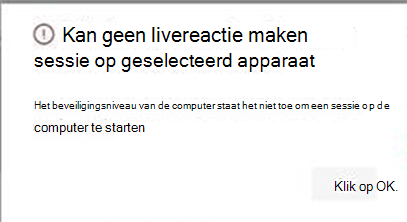

# <a name="investigate-entities-on-devices-using-live-response"></a>Entiteiten op apparaten onderzoeken met livereactie

[!INCLUDE [Microsoft 365 Defender rebranding](../../includes/microsoft-defender.md)]

**Van toepassing op:**
- [Microsoft Defender voor Endpoint](https://go.microsoft.com/fwlink/p/?linkid=2154037)
- [Microsoft 365 Defender](https://go.microsoft.com/fwlink/?linkid=2118804)


> Wilt u Defender voor Eindpunt ervaren? [Meld u aan voor een gratis proefabonnement.](https://www.microsoft.com/microsoft-365/windows/microsoft-defender-atp?ocid=docs-wdatp-investigateip-abovefoldlink)

Live response geeft beveiligingsbewerkingen teams direct toegang tot een apparaat (ook wel een computer genoemd) met behulp van een externe shell-verbinding. Dit geeft u de macht om uitgebreid onderzoek te doen en direct actie te ondernemen om snel geïdentificeerde bedreigingen in realtime te bevatten. 

Live response is ontworpen om onderzoeken te verbeteren door uw beveiligingsteam in staat te stellen om gerechtelijke gegevens te verzamelen, scripts uit te voeren, verdachte entiteiten te verzenden voor analyse, bedreigingen te corrigeren en proactief te zoeken naar nieuwe bedreigingen.<br/><br/>

> [!VIDEO https://www.microsoft.com/videoplayer/embed/RE4qLUW]

Met livereactie kunnen analisten alle volgende taken uitvoeren:
- Voer eenvoudige en geavanceerde opdrachten uit om onderzoek te doen op een apparaat.
- Download bestanden zoals malwarevoorbeelden en resultaten van PowerShell-scripts.
- Bestanden op de achtergrond downloaden (nieuw!).
- Upload een PowerShell-script of uitvoerbaar naar de bibliotheek en voer het uit op een apparaat vanaf tenantniveau.
- Herstelacties uitvoeren of ongedaan maken.

## <a name="before-you-begin"></a>Voordat u begint

Voordat u een sessie op een apparaat kunt starten, moet u aan de volgende vereisten voldoen:

- **Controleer of u een ondersteunde versie van Windows gebruikt.** <br/>
Apparaten moeten een van de volgende versies van Windows uitvoeren

  - **Windows 10**
    - [Versie 1909](https://docs.microsoft.com/windows/whats-new/whats-new-windows-10-version-1909) of hoger  
    - [Versie 1903](https://docs.microsoft.com/windows/whats-new/whats-new-windows-10-version-1903) met [KB4515384](https://support.microsoft.com/en-us/help/4515384/windows-10-update-kb4515384)
    - [Versie 1809 (RS 5)](https://docs.microsoft.com/windows/whats-new/whats-new-windows-10-version-1809) [met KB4537818](https://support.microsoft.com/help/4537818/windows-10-update-kb4537818)
    - [Versie 1803 (RS 4)](https://docs.microsoft.com/windows/whats-new/whats-new-windows-10-version-1803) met [KB4537795](https://support.microsoft.com/help/4537795/windows-10-update-kb4537795)
    - [Versie 1709 (RS 3)](https://docs.microsoft.com/windows/whats-new/whats-new-windows-10-version-1709) met [KB4537816](https://support.microsoft.com/help/4537816/windows-10-update-kb4537816)
  
  - **Windows Server 2019 - Alleen van toepassing op openbare preview**
    - Versie 1903 of (met [KB4515384](https://support.microsoft.com/en-us/help/4515384/windows-10-update-kb4515384)) later 
    - Versie 1809 (met [KB4537818](https://support.microsoft.com/en-us/help/4537818/windows-10-update-kb4537818))

- **Schakel livereactie in vanaf de pagina met geavanceerde instellingen.**<br>
U moet de mogelijkheid voor livereactie inschakelen op de [pagina Instellingen voor geavanceerde](advanced-features.md) functies.

    >[!NOTE]
    >Alleen gebruikers met beveiligings- of globale beheerdersrollen kunnen deze instellingen bewerken.

- **Schakel livereactie voor servers in vanaf de pagina met geavanceerde instellingen** (aanbevolen).<br>

    >[!NOTE]
    >Alleen gebruikers met beveiligings- of globale beheerdersrollen kunnen deze instellingen bewerken.
    
- **Controleer of aan het apparaat een automatiseringssaneringsniveau is toegewezen.**<br>
U moet ten minste het minimale herstelniveau voor een bepaalde apparaatgroep inschakelen. Anders kunt u geen livereactiesessie voor een lid van die groep opzetten.

    U krijgt de volgende foutmelding:

    

- **Live response unsigned script execution (optioneel)** inschakelen. <br>

    >[!WARNING]
    >Als u het gebruik van niet-ondertekende scripts toestaat, kunt u uw blootstelling aan bedreigingen vergroten.
 
  Het uitvoeren van niet-ondertekende scripts wordt afgeraden, omdat dit uw blootstelling aan bedreigingen kan vergroten. Als u deze echter moet gebruiken, moet u de instelling inschakelen op de pagina Geavanceerde [functiesinstellingen.](advanced-features.md)
    
- **Controleer of u de juiste machtigingen hebt.**<br>
    Alleen gebruikers die zijn ingericht met de juiste machtigingen, kunnen een sessie starten. Zie Rollen maken en beheren voor meer informatie over [roltoewijzingen.](user-roles.md) 

    > [!IMPORTANT]
    > De optie om een bestand te uploaden naar de bibliotheek is alleen beschikbaar voor personen met de juiste RBAC-machtigingen. De knop is grijs voor gebruikers met alleen gedelegeerde machtigingen.

    Afhankelijk van de rol die aan u is verleend, kunt u eenvoudige of geavanceerde opdrachten voor livereacties uitvoeren. Gebruikersmachtigingen worden bepaald door de aangepaste rol van RBAC. 

## <a name="live-response-dashboard-overview"></a>Overzicht van livereactiedashboard
Wanneer u een livereactiesessie start op een apparaat, wordt er een dashboard geopend. Het dashboard bevat informatie over de sessie, zoals de volgende: 

- Wie heeft de sessie gemaakt
- Wanneer de sessie is gestart
- De duur van de sessie

Het dashboard biedt u ook toegang tot:
- Sessie verbreken
- Bestanden uploaden naar de bibliotheek 
- Opdrachtconsole
- Opdrachtlogboek


## <a name="initiate-a-live-response-session-on-a-device"></a>Een livereactiesessie starten op een apparaat 

1. Meld u aan bij het Microsoft Defender-beveiligingscentrum.

2. Ga naar de pagina apparatenlijst en selecteer een apparaat dat u wilt onderzoeken. De pagina Apparaten wordt geopend.

3. Start de livereactiesessie door **Livereactiesessie starten te selecteren.** Er wordt een opdrachtconsole weergegeven. Wacht totdat de sessie verbinding maakt met het apparaat.

4. Gebruik de ingebouwde opdrachten om onderzoekswerk te doen. Zie [Live-antwoordopdrachten voor meer informatie.](#live-response-commands)

5. Nadat u het onderzoek hebt afgerond, **selecteert** u Sessie verbreken en selecteert u **Bevestigen**.

## <a name="live-response-commands"></a>Opdrachten voor livereacties

Afhankelijk van de rol die aan u is verleend, kunt u eenvoudige of geavanceerde opdrachten voor livereacties uitvoeren. Gebruikersmachtigingen worden beheerd door aangepaste rollen van RBAC. Zie Rollen maken en beheren voor meer informatie over [roltoewijzingen.](user-roles.md) 


>[!NOTE]
>Live response is een interactieve shell in de cloud, dus specifieke opdrachtervaring kan variëren in reactietijd, afhankelijk van de netwerkkwaliteit en de systeembelasting tussen de eindgebruiker en het doelapparaat.

### <a name="basic-commands"></a>Basisopdrachten

De volgende opdrachten zijn beschikbaar voor gebruikersrollen die de mogelijkheid krijgen om basisopdrachten **voor** livereacties uit te voeren. Zie Rollen maken en beheren voor meer informatie over [roltoewijzingen.](user-roles.md) 

| Opdracht | Beschrijving |
|---|---|--- |
|`cd` | Wijzigt de huidige adreslijst. | 
|`cls` | Het scherm van de console wordt gewed.  |
|`connect` | Start een livereactiesessie op het apparaat. |
|`connections` | Toont alle actieve verbindingen. |
|`dir` | Toont een lijst met bestanden en subdirectorieën in een adreslijst. |
|`download <file_path> &` | Hiermee downloadt u een bestand op de achtergrond. |
stuurprogramma's |  Toont alle stuurprogramma's die op het apparaat zijn geïnstalleerd. |
|`fg <command ID>` | Retourneert een bestand dat is gedownload naar de voorgrond. |
|`fileinfo` | Informatie over een bestand. |
|`findfile` | Zoekt bestanden op een bepaalde naam op het apparaat. |
|`help` | Biedt help-informatie voor opdrachten voor livereacties. |
|`persistence` | Toont alle bekende persistentiemethoden op het apparaat. |
|`processes` | Toont alle processen die op het apparaat worden uitgevoerd. |
|`registry` | Geeft registerwaarden weer. |
|`scheduledtasks` | Toont alle geplande taken op het apparaat. |
|`services` | Toont alle services op het apparaat. |
|`trace` | Hiermee stelt u de logboekregistratiemodus van de terminal in op foutopsporing. |

### <a name="advanced-commands"></a>Geavanceerde opdrachten
De volgende opdrachten zijn beschikbaar voor gebruikersrollen die de mogelijkheid krijgen om geavanceerde **opdrachten** voor livereacties uit te voeren. Zie Rollen maken en beheren voor meer informatie over [roltoewijzingen.](user-roles.md) 

| Opdracht | Beschrijving |
|---|---|
| `analyze` | Analyseert de entiteit met verschillende belastende motoren om tot een uitspraak te komen. |
| `getfile` | Haalt een bestand op van het apparaat. <br> OPMERKING: Deze opdracht heeft een vereiste opdracht. U kunt de opdracht in combinatie met de opdracht gebruiken `-auto` om de vereiste opdracht automatisch uit te `getfile` voeren. |
| `run` | Voert een PowerShell-script uit vanuit de bibliotheek op het apparaat. |
| `library` | Hiermee worden bestanden vermeld die zijn geüpload naar de live antwoordbibliotheek. |
| `putfile` | Zet een bestand uit de bibliotheek op het apparaat. Bestanden worden opgeslagen in een werkmap en worden verwijderd wanneer het apparaat standaard opnieuw wordt gestart. |
| `remediate` | Herstelt een entiteit op het apparaat. De herstelactie is afhankelijk van het entiteitstype:<br>- Bestand: verwijderen<br>- Proces: stoppen, afbeeldingsbestand verwijderen<br>- Service: stoppen, afbeeldingsbestand verwijderen<br>- Registerinvoer: verwijderen<br>- Geplande taak: verwijderen<br>- Mapitem opstarten: bestand verwijderen <br> OPMERKING: Deze opdracht heeft een vereiste opdracht. U kunt de opdracht in combinatie met de opdracht gebruiken `-auto` om de vereiste opdracht automatisch uit te `remediate` voeren. 
|`undo` | Herstelt een entiteit die is hersteld. |


## <a name="use-live-response-commands"></a>Opdrachten voor livereacties gebruiken

De opdrachten die u in de console kunt gebruiken, volgen dezelfde principes als [Windows-opdrachten.](https://docs.microsoft.com/windows-server/administration/windows-commands/windows-commands#BKMK_c)

De geavanceerde opdrachten bieden een krachtigere reeks acties waarmee u krachtigere acties kunt uitvoeren, zoals het downloaden en uploaden van een bestand, het uitvoeren van scripts op het apparaat en het uitvoeren van herstelacties voor een entiteit.

### <a name="get-a-file-from-the-device"></a>Een bestand van het apparaat downloaden

Voor scenario's wanneer u een bestand wilt downloaden van een apparaat dat u onderzoekt, kunt u de opdracht `getfile` gebruiken. Hiermee kunt u het bestand opslaan vanaf het apparaat voor verder onderzoek.

>[!NOTE]
>De volgende limieten voor bestandsgrootte zijn van toepassing:
>- `getfile` limiet: 3 GB
>- `fileinfo` limiet: 10 GB
>- `library` limiet: 250 MB

### <a name="download-a-file-in-the-background"></a>Een bestand op de achtergrond downloaden

Als u wilt dat uw beveiligingsteam een beïnvloed apparaat kan blijven onderzoeken, kunnen bestanden nu op de achtergrond worden gedownload.

- Als u een bestand op de achtergrond wilt downloaden, typt u in de opdrachtconsole voor `download <file_path> &` livereactie.
- Als u wacht totdat een bestand wordt gedownload, kunt u het naar de achtergrond verplaatsen met Ctrl+ Z.
- Als u een bestand wilt downloaden naar de voorgrond, typt u in de opdrachtconsole voor `fg <command_id>` livereactie.

Dit zijn enkele voorbeelden:


|Opdracht  |Wat het doet  |
|---------|---------|
|`Download "C:\windows\some_file.exe" &`     |Start het downloaden van een bestand met *some_file.exe* op de achtergrond.         |
|`fg 1234`     |Retourneert een download met *opdracht-id 1234* op de voorgrond.         |


### <a name="put-a-file-in-the-library"></a>Een bestand in de bibliotheek zetten

Live response heeft een bibliotheek waarin u bestanden kunt plaatsen. In de bibliotheek worden bestanden (zoals scripts) opgeslagen die kunnen worden uitgevoerd in een livereactiesessie op tenantniveau.

Met livereactie kunnen PowerShell-scripts worden uitgevoerd, maar u moet de bestanden eerst in de bibliotheek zetten voordat u ze kunt uitvoeren. 

U kunt een verzameling PowerShell-scripts hebben die kunnen worden uitgevoerd op apparaten met wie u livereactiesessies start. 

#### <a name="to-upload-a-file-in-the-library"></a>Een bestand uploaden in de bibliotheek

1. Klik **op Bestand uploaden naar bibliotheek**. 

2. Klik **op Bladeren** en selecteer het bestand.

3. Geef een korte beschrijving op.

4. Geef op of u een bestand met dezelfde naam wilt overschrijven.

5. Als u wilt weten welke parameters nodig zijn voor het script, schakelt u het selectievakje scriptparameters in. Voer in het tekstveld een voorbeeld en een beschrijving in.

6. Klik **op Bevestigen**. 

7. (Optioneel) Voer de opdracht uit om te controleren of het bestand naar de bibliotheek is `library` geüpload.


### <a name="cancel-a-command"></a>Een opdracht annuleren
Op elk gewenst moment tijdens een sessie kunt u een opdracht annuleren door op Ctrl + C te drukken.  

>[!WARNING]
>Als u deze snelkoppeling gebruikt, stopt u de opdracht niet aan de agentzijde. De opdracht in de portal wordt alleen geannuleerd. Het wijzigen van bewerkingen zoals 'herstel' kan dus doorgaan, terwijl de opdracht wordt geannuleerd. 

### <a name="automatically-run-prerequisite-commands"></a>Vereiste opdrachten automatisch uitvoeren

Sommige opdrachten hebben vereiste opdrachten om uit te voeren. Als u de vereiste opdracht niet uit te voeren, krijgt u een foutmelding. Als u bijvoorbeeld de `download` opdracht zonder uit te `fileinfo` voeren, wordt een fout weergegeven.

U kunt de automatische vlag gebruiken om automatisch vereiste opdrachten uit te voeren, bijvoorbeeld:

```console
getfile c:\Users\user\Desktop\work.txt -auto
```

## <a name="run-a-powershell-script"></a>Een PowerShell-script uitvoeren 

Voordat u een PowerShell-script kunt uitvoeren, moet u het eerst uploaden naar de bibliotheek. 

Nadat u het script naar de bibliotheek hebt geüpload, gebruikt u de `run` opdracht om het script uit te voeren.

Als u van plan bent een niet-ondertekend script te gebruiken in de sessie, moet u de instelling inschakelen op de pagina Geavanceerde [functies instellingen.](advanced-features.md)

>[!WARNING]
>Als u het gebruik van niet-ondertekende scripts toestaat, kunt u uw blootstelling aan bedreigingen vergroten.

## <a name="apply-command-parameters"></a>Opdrachtparameters toepassen

- Bekijk de help van de console voor meer informatie over opdrachtparameters. Voer het volgende uit als u meer wilt weten over een afzonderlijke opdracht:
 
    `help <command name>`

- Bij het toepassen van parameters op opdrachten, moet u er rekening mee houden dat parameters worden verwerkt op basis van een vaste volgorde:
 
    `<command name> param1 param2` 

- Wanneer u parameters opgeeft buiten de vaste volgorde, geeft u de naam van de parameter op met een afbreekstreester voordat u de waarde opgeeft:
 
    `<command name> -param2_name param2`

- Wanneer u opdrachten gebruikt met vereiste opdrachten, kunt u vlaggen gebruiken:

    `<command name> -type file -id <file path> - auto` of `remediate file <file path> - auto` .

## <a name="supported-output-types"></a>Ondersteunde uitvoertypen

Livereactie ondersteunt uitvoertypen voor tabel- en JSON-indeling. Voor elke opdracht is er een standaarduitvoergedrag. U kunt de uitvoer in de gewenste uitvoerindeling wijzigen met de volgende opdrachten:

- `-output json`
- `-output table`

>[!NOTE]
>Er worden minder velden weergegeven in tabelindeling vanwege de beperkte ruimte. Als u meer details in de uitvoer wilt zien, kunt u de opdracht JSON-uitvoer gebruiken, zodat er meer details worden weergegeven.

## <a name="supported-output-pipes"></a>Ondersteunde uitvoerpijpen

Live response ondersteunt uitvoerpijpleidingen naar CLI en bestand. CLI is het standaarduitvoergedrag. U kunt de uitvoer naar een bestand uitvoeren met de volgende opdracht: [opdracht] > [bestandsnaam].txt.  

Voorbeeld:

```console
processes > output.txt
```

## <a name="view-the-command-log"></a>Het opdrachtlogboek weergeven

Selecteer het **tabblad Opdrachtlogboek** om de opdrachten weer te geven die tijdens een sessie op het apparaat zijn gebruikt. Elke opdracht wordt bijgespoord met volledige details, zoals:
- ID
- Opdrachtregel
- Duur
- Status- en invoer- of uitvoerzijdebalk

## <a name="limitations"></a>Beperkingen

- Livereactiesessies zijn beperkt tot 10 livereactiesessies tegelijk.
- Grootschalige opdrachtuitvoering wordt niet ondersteund.
- De inactieve time-outwaarde voor livereactiesessie is 5 minuten. 
- Een gebruiker kan slechts één sessie tegelijk starten.
- Een apparaat kan slechts in één sessie tegelijk worden gebruikt.
- De volgende limieten voor bestandsgrootte zijn van toepassing:
   - `getfile` limiet: 3 GB
   - `fileinfo` limiet: 10 GB
   - `library` limiet: 250 MB

## <a name="related-article"></a>Gerelateerd artikel
- [Voorbeelden van livereactieopdracht](live-response-command-examples.md)
