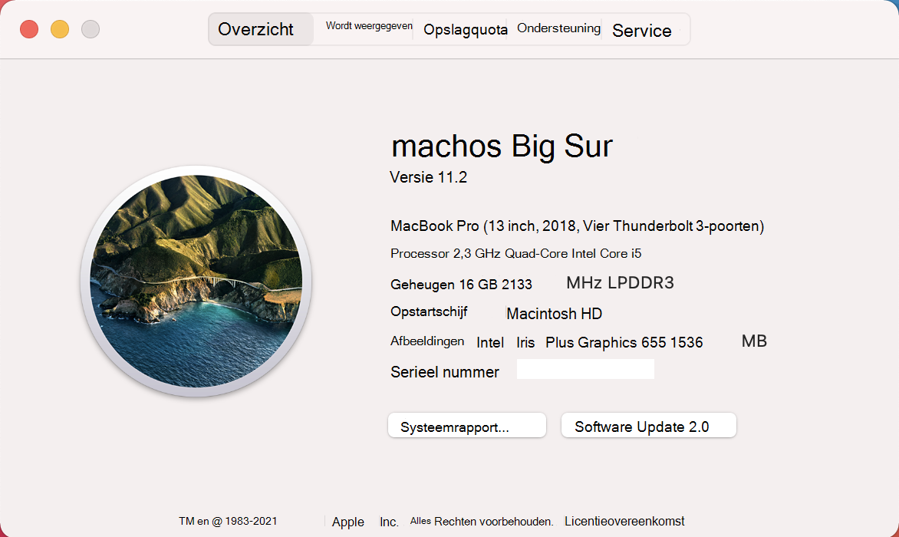

# <a name="device-control-for-macos"></a>Apparaatbesturingselement voor macOS

[!INCLUDE [Microsoft 365 Defender rebranding](../../includes/microsoft-defender.md)]

**Van toepassing op:**
- [Microsoft Defender voor Endpoint](https://go.microsoft.com/fwlink/p/?linkid=2154037)
- [Microsoft 365 Defender](https://go.microsoft.com/fwlink/?linkid=2118804)

> Wilt u Microsoft Defender voor Eindpunt ervaren? [Meld u aan voor een gratis proefabonnement.](https://www.microsoft.com/microsoft-365/windows/microsoft-defender-atp?ocid=docs-wdatp-exposedapis-abovefoldlink)

[!include[Prerelease information](../../includes/prerelease.md)]

## <a name="requirements"></a>Vereisten

Apparaatbesturingselement voor macOS heeft de volgende vereisten:

>[!div class="checklist"]
> - Microsoft Defender for Endpoint entitlement (can be trial)
> - Minimale os-versie: macOS 10.15.4 of hoger
> - Minimale productversie: 101.24.59
> - Uw apparaat moet worden uitgevoerd met systeemextensies (dit is de standaardinstelling voor macOS 11 Big Sur). 
> 
>   U kunt controleren of uw apparaat wordt uitgevoerd op systeemextensies door de volgende opdracht uit te voeren en te controleren of het wordt afgedrukt `endpoint_security_extension` op de console: 
> 
>   ```bash
>   mdatp health --field real_time_protection_subsystem 
>   ```
> - Uw apparaat moet zich in `Beta` het updatekanaal van `InsiderFast` Microsoft AutoUpdate (voorheen ) hebben. Zie Updates implementeren voor Microsoft Defender voor Eindpunt voor Mac voor meer [informatie.](mac-updates.md)
> 
>   U kunt het updatekanaal controleren met de volgende opdracht: 
> 
>    ```bash
>    mdatp health --field release_ring 
>    ```
>
>    Als de bovenstaande opdracht niet wordt afgedrukt `Beta` `InsiderFast` of, voert u de volgende opdracht uit vanaf de Terminal. De kanaalupdate wordt van kracht wanneer het product de volgende keer wordt gestart (wanneer de volgende productupdate is geïnstalleerd of wanneer het apparaat opnieuw wordt opgestart). 
> 
>    ```bash
>    defaults write com.microsoft.autoupdate2 ChannelName -string Beta
>    ```
>
>    Als u zich in een beheerde omgeving (JAMF of Intune) hebt, kunt u het updatekanaal ook op afstand configureren. Zie Updates implementeren voor Microsoft Defender voor Eindpunt voor Mac voor meer [informatie.](mac-updates.md) 

## <a name="device-control-policy"></a>Apparaatbeheerbeleid

Als u apparaatbesturingselement voor macOS wilt configureren, moet u een beleid maken waarin de beperkingen worden beschreven die u binnen uw organisatie wilt instellen.

Het apparaatbeheerbeleid is opgenomen in het configuratieprofiel dat wordt gebruikt om alle andere productinstellingen te configureren. Zie Configuratieprofielstructuur [voor meer informatie.](mac-preferences.md#configuration-profile-structure)

In het configuratieprofiel wordt het beleid voor apparaatbesturingselementen gedefinieerd in de volgende sectie:

|||
|:---|:---|
| **Domein** | `com.microsoft.wdav` |
| **Sleutel** | deviceControl |
| **Gegevenstype** | Woordenlijst (geneste voorkeur) |
| **Opmerkingen** | Zie de volgende secties voor een beschrijving van de inhoud van de woordenlijst. |

Het apparaatbesturingselementbeleid kan worden gebruikt om:

- [Het URL-doel aanpassen voor meldingen die door apparaatbesturingselementen worden opgehaald](#customize-url-target-for-notifications-raised-by-device-control)
- [Verwisselbare apparaten toestaan of blokkeren](#allow-or-block-removable-devices)

### <a name="customize-url-target-for-notifications-raised-by-device-control"></a>URL-doel aanpassen voor meldingen die door apparaatbesturingselement worden opgehaald

Wanneer het beleid voor apparaatbesturingselement dat u hebt toegepast, wordt afgedwongen op een apparaat (bijvoorbeeld de toegang tot een verwisselbaar mediaapparaat is beperkt), wordt er een melding weergegeven voor de gebruiker.


Wanneer eindgebruikers op deze melding klikken, wordt er een webpagina geopend in de standaardbrowser. U kunt de URL configureren die wordt geopend wanneer eindgebruikers op de melding klikken.

|||
|:---|:---|
| **Domein** | `com.microsoft.wdav` |
| **Sleutel** | navigatieTarget |
| **Gegevenstype** | Tekenreeks |
| **Opmerkingen** | Als het product niet is gedefinieerd, wordt een standaard-URL gebruikt die verwijst naar een algemene pagina waarin de actie van het product wordt uitgelegd. |

### <a name="allow-or-block-removable-devices"></a>Verwisselbare apparaten toestaan of blokkeren

De sectie verwisselbare media van het apparaatbesturingselementbeleid wordt gebruikt om de toegang tot verwisselbare media te beperken. 

> [!NOTE]
> De volgende typen verwisselbare media worden momenteel ondersteund en kunnen worden opgenomen in het beleid: USB-opslagapparaten.

|||
|:---|:---|
| **Domein** | `com.microsoft.wdav` |
| **Sleutel** | verwisselbaarMediaPolicy |
| **Gegevenstype** | Woordenlijst (geneste voorkeur) |
| **Opmerkingen** | Zie de volgende secties voor een beschrijving van de inhoud van de woordenlijst. |

Deze sectie van het beleid is hiërarchisch, waardoor maximale flexibiliteit mogelijk is en een groot aantal gebruiksgevallen wordt beslaat. Op het hoogste niveau zijn leveranciers, geïdentificeerd door een leverancier-id. Voor elke leverancier zijn er producten die zijn geïdentificeerd met een product-id. Ten slotte zijn er voor elk product serienummers met specifieke apparaten.

```
|-- policy top level 
    |-- vendor 1 
        |-- product 1 
            |-- serial number 1 
            ...
            |-- serial number N 
        ...
        |-- product N 
    ...
    |-- vendor N
```

Zie Apparaataanduidingen op zoeken voor informatie over het vinden van [apparaataanduidingen.](#look-up-device-identifiers)

Het beleid wordt geëvalueerd vanaf de meest specifieke vermelding tot de meest algemene. Dit betekent dat wanneer een apparaat is aangesloten, het product probeert de meest specifieke overeenkomst te vinden in het beleid voor elk verwisselbaar mediaapparaat en de machtigingen op dat niveau toe te passen. Als er geen overeenkomst is, wordt de volgende beste overeenkomst toegepast, helemaal tot aan de machtiging die is opgegeven op het hoogste niveau, wat de standaardwaarde is wanneer een apparaat niet overeen komt met een andere vermelding in het beleid.

#### <a name="policy-enforcement-level"></a>Beleidshandhavingsniveau

Onder de sectie verwisselbare media is er een optie om het afdwingingsniveau in te stellen, dat een van de volgende waarden kan bevatten:

- `audit` - Als de toegang tot een apparaat is beperkt, wordt onder dit handhavingsniveau een melding weergegeven voor de gebruiker, maar het apparaat kan nog steeds worden gebruikt. Dit handhavingsniveau kan handig zijn om de effectiviteit van een beleid te evalueren.
- `block` - Onder dit handhavingsniveau zijn de bewerkingen die de gebruiker op het apparaat kan uitvoeren, beperkt tot wat is gedefinieerd in het beleid. Bovendien wordt er een melding naar de gebruiker getrokken. 

|||
|:---|:---|
| **Domein** | `com.microsoft.wdav` |
| **Sleutel** | enforcementLevel |
| **Gegevenstype** | Tekenreeks |
| **Mogelijke waarden** | audit (standaard) <br/> blokkering |

#### <a name="default-permission-level"></a>Standaardmachtigingsniveau

Op het hoogste niveau van de sectie verwisselbare media kunt u het standaardmachtigingsniveau configureren voor apparaten die niet overeenkomen met iets anders in het beleid.

Deze instelling kan worden ingesteld op:

- `none` - Er kunnen geen bewerkingen worden uitgevoerd op het apparaat
- Een combinatie van de volgende waarden:
    - `read` - Leesbewerkingen zijn toegestaan op het apparaat
    - `write` - Schrijfbewerkingen zijn toegestaan op het apparaat
    - `execute` - Bewerkingen uitvoeren is toegestaan op het apparaat

> [!NOTE]
> Als het machtigingsniveau aanwezig is, worden andere `none` machtigingen ( `read` of ) `write` `execute` genegeerd.

> [!NOTE]
> De `execute` machtiging verwijst alleen naar de uitvoering van Binaries van Mach-O. Het omvat geen uitvoering van scripts of andere soorten payloads.

|||
|:---|:---|
| **Domein** | `com.microsoft.wdav` |
| **Sleutel** | machtiging |
| **Gegevenstype** | Matrix met tekenreeksen |
| **Mogelijke waarden** | geen <br/> gelezen <br/> schrijven <br/> uitvoeren |

#### <a name="restrict-removable-media-by-vendor-product-and-serial-number"></a>Verwisselbare media beperken op leverancier, product en serienummer

Zoals beschreven in [Verwisselbare](#allow-or-block-removable-devices)apparaten toestaan of blokkeren, kunnen verwisselbare media, zoals USB-apparaten, worden geïdentificeerd met de leverancier-id, product-id en serienummer.

Op het hoogste niveau van het verwisselbare mediabeleid kunt u desgewenst meer gedetailleerde beperkingen definiëren op leveranciersniveau. 

De `vendors` woordenlijst bevat een of meer vermeldingen, met elk item dat wordt geïdentificeerd door de leverancier-id.

|||
|:---|:---|
| **Domein** | `com.microsoft.wdav` |
| **Sleutel** | leveranciers |
| **Gegevenstype** | Woordenlijst (geneste voorkeur) |

Voor elke leverancier kunt u het gewenste machtigingsniveau opgeven voor apparaten van die leverancier.

|||
|:---|:---|
| **Domein** | `com.microsoft.wdav` |
| **Sleutel** | machtiging |
| **Gegevenstype** | Matrix met tekenreeksen |
| **Mogelijke waarden** | Hetzelfde als [standaardmachtigingsniveau](#default-permission-level) |

Bovendien kunt u desgewenst de set producten opgeven die behoren tot die leverancier waarvoor gedetailleerdere machtigingen zijn gedefinieerd. De `products` woordenlijst bevat een of meer vermeldingen, met elk item dat wordt geïdentificeerd door de product-id. 

|||
|:---|:---|
| **Domein** | `com.microsoft.wdav` |
| **Sleutel** | producten |
| **Gegevenstype** | Woordenlijst (geneste voorkeur) |

Voor elk product kunt u het gewenste machtigingsniveau voor dat product opgeven.

|||
|:---|:---|
| **Domein** | `com.microsoft.wdav` |
| **Sleutel** | machtiging |
| **Gegevenstype** | Matrix met tekenreeksen |
| **Mogelijke waarden** | Hetzelfde als [standaardmachtigingsniveau](#default-permission-level) |

Bovendien kunt u een optionele set seriële getallen opgeven waarvoor gedetailleerdere machtigingen zijn gedefinieerd.

De `serialNumbers` woordenlijst bevat een of meer vermeldingen, met elk item dat wordt geïdentificeerd door het serienummer.

|||
|:---|:---|
| **Domein** | `com.microsoft.wdav` |
| **Sleutel** | seriëlegetalen |
| **Gegevenstype** | Woordenlijst (geneste voorkeur) |

Voor elk serienummer kunt u het gewenste machtigingsniveau opgeven.

|||
|:---|:---|
| **Domein** | `com.microsoft.wdav` |
| **Sleutel** | machtiging |
| **Gegevenstype** | Matrix met tekenreeksen |
| **Mogelijke waarden** | Hetzelfde als [standaardmachtigingsniveau](#default-permission-level) |

#### <a name="example-device-control-policy"></a>Voorbeeld van apparaatbesturingselementbeleid

In het volgende voorbeeld ziet u hoe alle bovenstaande concepten kunnen worden gecombineerd tot een apparaatbesturingselementbeleid. Let in het volgende voorbeeld op de hiërarchische aard van het verwisselbare mediabeleid.

```xml
<?xml version="1.0" encoding="UTF-8"?> 
<!DOCTYPE plist PUBLIC "-//Apple//DTD PLIST 1.0//EN" "http://www.apple.com/DTDs/PropertyList-1.0.dtd"> 
<plist version="1.0"> 
<dict> 
    <key>deviceControl</key> 
    <dict> 
        <key>navigationTarget</key> 
        <string>[custom URL for notifications]</string> 
        <key>removableMediaPolicy</key> 
        <dict> 
            <key>enforcementLevel</key> 
            <string>[enforcement level]</string> <!-- audit / block --> 
            <key>permission</key> 
            <array> 
                <string>[permission]</string> <!-- none / read / write / execute --> 
                <!-- other permissions -->
            </array> 
            <key>vendors</key> 
            <dict> 
                <key>[vendor id]</key> 
                <dict>
                    <key>permission</key> 
                    <array> 
                        <string>[permission]</string> <!-- none / read / write / execute --> 
                        <!-- other permissions -->
                    </array> 
                    <key>products</key> 
                    <dict> 
                        <key>[product id]</key> 
                        <dict> 
                            <key>permission</key> 
                            <array> 
                                <string>[permission]</string> <!-- none / read / write / execute --> 
                                <!-- other permissions -->
                            </array> 
                            <key>serialNumbers</key> 
                            <dict> 
                                <key>[serial-number]</key> 
                                <array> 
                                    <string>[permission]</string> <!-- none / read / write / execute --> 
                                    <!-- other permissions -->
                                </array> 
                                <!-- other serial numbers --> 
                            </dict> 
                        </dict> 
                        <!-- other products --> 
                    </dict> 
                </dict> 
                <!-- other vendors --> 
            </dict> 
        </dict> 
    </dict> 
</dict> 
</plist> 
```

We hebben meer voorbeelden van beleidsregels voor apparaatbeheer opgenomen in de volgende documenten:

- [Voorbeelden van beleidsregels voor apparaatbesturingselementen voor Intune](mac-device-control-intune.md)
- [Voorbeelden van beleidsregels voor apparaatbeheer voor JAMF](mac-device-control-jamf.md)

#### <a name="look-up-device-identifiers"></a>Apparaat-id's zoeken

De leverancier-id, product-id en het serienummer van een USB-apparaat zoeken:

1. Meld u aan bij een Mac-apparaat.
1. Sluit het USB-apparaat aan waarvoor u de id's wilt op zoeken.
1. Selecteer In het menu op het hoogste niveau van macOS de optie **Over deze Mac.**

    

1. Selecteer **Systeemrapport**.

    

1. Selecteer USB in de **linkerkolom.**

    

1. Ga **onder USB-apparaatstructuur** naar het USB-apparaat dat u hebt aangesloten.

    

1. De leverancier-id, product-id en serienummer worden weergegeven. Wanneer u de leverancier-id en product-id toevoegt aan het verwisselbare mediabeleid, hoeft u het onderdeel alleen daarna toe te `0x` voegen. In de onderstaande afbeelding is leverancier-id bijvoorbeeld `1000` en product-id. `090c`

#### <a name="discover-usb-devices-in-your-organization"></a>USB-apparaten in uw organisatie ontdekken

U kunt gebeurtenissen in de mount, unmount en volumewijziging bekijken die afkomstig zijn van USB-apparaten in Microsoft Defender for Endpoint advanced hunting. Deze gebeurtenissen kunnen handig zijn om verdachte gebruiksactiviteiten te identificeren of interne onderzoeken uit te voeren.

```
DeviceEvents 
    | where ActionType == "UsbDriveMount" or ActionType == "UsbDriveUnmount" or ActionType == "UsbDriveDriveLetterChanged"
    | where DeviceId == "<device ID>"
```

## <a name="device-control-policy-deployment"></a>Apparaatbeheerbeleidsimplementatie

Het apparaatbesturingselementbeleid moet worden opgenomen naast de andere productinstellingen, zoals beschreven in Voorkeuren instellen voor [Microsoft Defender voor Eindpunt voor Mac.](mac-preferences.md)

Dit profiel kan worden geïmplementeerd met de instructies die worden vermeld in [configuratieprofielimplementatie.](mac-preferences.md#configuration-profile-deployment)

## <a name="troubleshooting-tips"></a>Tips voor probleemoplossing

Nadat u het configuratieprofiel door Intune of JAMF hebt gedrenkt, kunt u controleren of het is opgehaald door het product door de volgende opdracht uit te voeren vanaf de Terminal:

```bash
mdatp device-control removable-media policy list
```

Deze opdracht wordt afgedrukt op standaarduitvoer van het apparaatbesturingselementbeleid dat het product gebruikt. Als dit wordt afgedrukt, controleert u of (a) het configuratieprofiel inderdaad vanaf de beheerconsole naar uw apparaat is gedrenkt en (b) het een geldig apparaatbesturingselementbeleid is, zoals beschreven in dit `Policy is empty` document.

Op een apparaat waarop het beleid is geleverd en waar een of meer apparaten zijn aangesloten, kunt u de volgende opdracht uitvoeren om alle apparaten en de effectieve machtigingen op te geven die op deze apparaten zijn toegepast.

```bash
mdatp device-control removable-media devices list
```

Voorbeeld van uitvoer:

```Output
.Device(s)
|-o Name: Untitled 1, Permission ["read", "execute"]
| |-o Vendor: General "fff0"
| |-o Product: USB Flash Disk "1000"
| |-o Serial number: "04ZSSMHI2O7WBVOA"
| |-o Mount point: "/Volumes/TESTUSB"
```

In het bovenstaande voorbeeld is er slechts één verwisselbaar mediaapparaat aangesloten en het heeft en machtigingen, volgens het beleid voor apparaatbesturingselement dat is geleverd `read` `execute` aan het apparaat.

## <a name="related-topics"></a>Verwante onderwerpen

- [Voorbeelden van beleidsregels voor apparaatbesturingselementen voor Intune](mac-device-control-intune.md)
- [Voorbeelden van beleidsregels voor apparaatbeheer voor JAMF](mac-device-control-jamf.md)