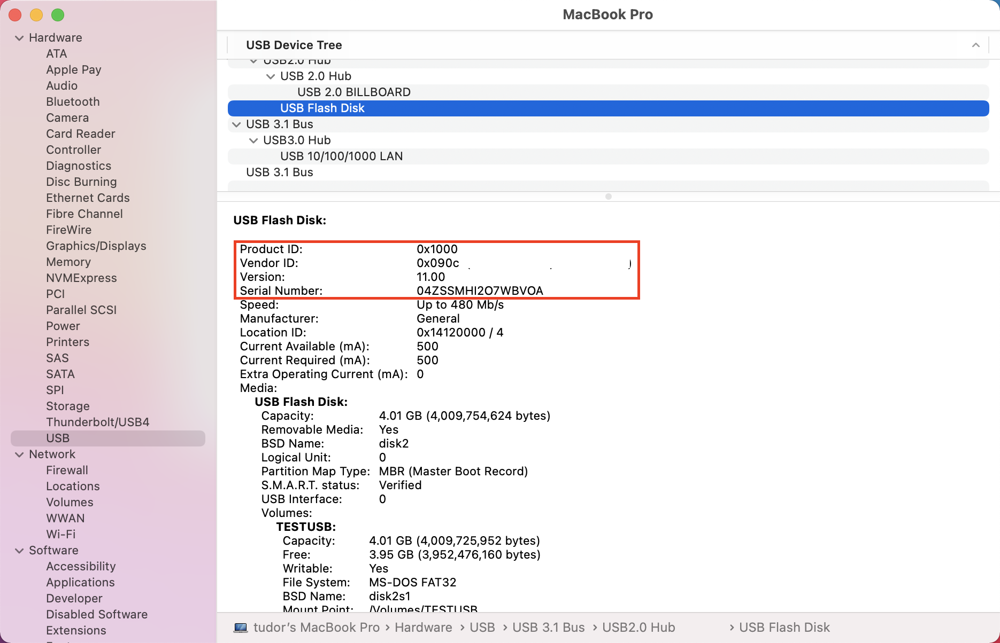

# <a name="device-control-for-macos"></a><span data-ttu-id="9ed1a-104">Apparaatbesturingselement voor macOS</span><span class="sxs-lookup"><span data-stu-id="9ed1a-104">Device control for macOS</span></span>

[!INCLUDE [Microsoft 365 Defender rebranding](../../includes/microsoft-defender.md)]

<span data-ttu-id="9ed1a-105">**Van toepassing op:**</span><span class="sxs-lookup"><span data-stu-id="9ed1a-105">**Applies to:**</span></span>
- [<span data-ttu-id="9ed1a-106">Microsoft Defender voor Endpoint</span><span class="sxs-lookup"><span data-stu-id="9ed1a-106">Microsoft Defender for Endpoint</span></span>](https://go.microsoft.com/fwlink/p/?linkid=2154037)
- [<span data-ttu-id="9ed1a-107">Microsoft 365 Defender</span><span class="sxs-lookup"><span data-stu-id="9ed1a-107">Microsoft 365 Defender</span></span>](https://go.microsoft.com/fwlink/?linkid=2118804)

> <span data-ttu-id="9ed1a-108">Wilt u Microsoft Defender voor Eindpunt ervaren?</span><span class="sxs-lookup"><span data-stu-id="9ed1a-108">Want to experience Microsoft Defender for Endpoint?</span></span> [<span data-ttu-id="9ed1a-109">Meld u aan voor een gratis proefabonnement.</span><span class="sxs-lookup"><span data-stu-id="9ed1a-109">Sign up for a free trial.</span></span>](https://www.microsoft.com/microsoft-365/windows/microsoft-defender-atp?ocid=docs-wdatp-exposedapis-abovefoldlink)

[!include[Prerelease information](../../includes/prerelease.md)]

## <a name="requirements"></a><span data-ttu-id="9ed1a-110">Vereisten</span><span class="sxs-lookup"><span data-stu-id="9ed1a-110">Requirements</span></span>

<span data-ttu-id="9ed1a-111">Apparaatbesturingselement voor macOS heeft de volgende vereisten:</span><span class="sxs-lookup"><span data-stu-id="9ed1a-111">Device control for macOS has the following prerequisites:</span></span>

>[!div class="checklist"]
> - <span data-ttu-id="9ed1a-112">Microsoft Defender for Endpoint entitlement (can be trial)</span><span class="sxs-lookup"><span data-stu-id="9ed1a-112">Microsoft Defender for Endpoint entitlement (can be trial)</span></span>
> - <span data-ttu-id="9ed1a-113">Minimale os-versie: macOS 10.15.4 of hoger</span><span class="sxs-lookup"><span data-stu-id="9ed1a-113">Minimum OS version: macOS 10.15.4 or higher</span></span>
> - <span data-ttu-id="9ed1a-114">Minimale productversie: 101.24.59</span><span class="sxs-lookup"><span data-stu-id="9ed1a-114">Minimum product version: 101.24.59</span></span>
> - <span data-ttu-id="9ed1a-115">Uw apparaat moet worden uitgevoerd met systeemextensies (dit is de standaardinstelling voor macOS 11 Big Sur).</span><span class="sxs-lookup"><span data-stu-id="9ed1a-115">Your device must be running with system extensions (this is the default on macOS 11 Big Sur).</span></span> 
> 
>   <span data-ttu-id="9ed1a-116">U kunt controleren of uw apparaat wordt uitgevoerd op systeemextensies door de volgende opdracht uit te voeren en te controleren of het wordt afgedrukt `endpoint_security_extension` op de console:</span><span class="sxs-lookup"><span data-stu-id="9ed1a-116">You can check if your device is running on system extensions by running the following command and verify that it is printing `endpoint_security_extension` to the console:</span></span> 
> 
>   ```bash
>   mdatp health --field real_time_protection_subsystem 
>   ```
> - <span data-ttu-id="9ed1a-117">Uw apparaat moet zich in `Beta` het updatekanaal van `InsiderFast` Microsoft AutoUpdate (voorheen ) hebben.</span><span class="sxs-lookup"><span data-stu-id="9ed1a-117">Your device must be in `Beta` (previously called `InsiderFast`) Microsoft AutoUpdate update channel.</span></span> <span data-ttu-id="9ed1a-118">Zie Updates implementeren voor Microsoft Defender voor Eindpunt voor Mac voor meer [informatie.](mac-updates.md)</span><span class="sxs-lookup"><span data-stu-id="9ed1a-118">For more information, see [Deploy updates for Microsoft Defender for Endpoint for Mac](mac-updates.md).</span></span>
> 
>   <span data-ttu-id="9ed1a-119">U kunt het updatekanaal controleren met de volgende opdracht:</span><span class="sxs-lookup"><span data-stu-id="9ed1a-119">You can check the update channel using the following command:</span></span> 
> 
>    ```bash
>    mdatp health --field release_ring 
>    ```
>
>    <span data-ttu-id="9ed1a-120">Als de bovenstaande opdracht niet wordt afgedrukt `Beta` `InsiderFast` of, voert u de volgende opdracht uit vanaf de Terminal.</span><span class="sxs-lookup"><span data-stu-id="9ed1a-120">If the above command does not print either `Beta` or `InsiderFast`, execute the following command from the Terminal.</span></span> <span data-ttu-id="9ed1a-121">De kanaalupdate wordt van kracht wanneer het product de volgende keer wordt gestart (wanneer de volgende productupdate is geïnstalleerd of wanneer het apparaat opnieuw wordt opgestart).</span><span class="sxs-lookup"><span data-stu-id="9ed1a-121">The channel update takes effect next time the product starts (when the next product update is installed or when the device is rebooted).</span></span> 
> 
>    ```bash
>    defaults write com.microsoft.autoupdate2 ChannelName -string Beta
>    ```
>
>    <span data-ttu-id="9ed1a-122">Als u zich in een beheerde omgeving (JAMF of Intune) hebt, kunt u het updatekanaal ook op afstand configureren.</span><span class="sxs-lookup"><span data-stu-id="9ed1a-122">Alternatively, if you are in a managed environment (JAMF or Intune), you can configure the update channel remotely.</span></span> <span data-ttu-id="9ed1a-123">Zie Updates implementeren voor Microsoft Defender voor Eindpunt voor Mac voor meer [informatie.](mac-updates.md)</span><span class="sxs-lookup"><span data-stu-id="9ed1a-123">For more information, see [Deploy updates for Microsoft Defender for Endpoint for Mac](mac-updates.md).</span></span> 

## <a name="device-control-policy"></a><span data-ttu-id="9ed1a-124">Apparaatbeheerbeleid</span><span class="sxs-lookup"><span data-stu-id="9ed1a-124">Device control policy</span></span>

<span data-ttu-id="9ed1a-125">Als u apparaatbesturingselement voor macOS wilt configureren, moet u een beleid maken waarin de beperkingen worden beschreven die u binnen uw organisatie wilt instellen.</span><span class="sxs-lookup"><span data-stu-id="9ed1a-125">To configure device control for macOS, you must create a policy that describes the restrictions you want to put in place within your organization.</span></span>

<span data-ttu-id="9ed1a-126">Het apparaatbeheerbeleid is opgenomen in het configuratieprofiel dat wordt gebruikt om alle andere productinstellingen te configureren.</span><span class="sxs-lookup"><span data-stu-id="9ed1a-126">The device control policy is included in the configuration profile used to configure all other product settings.</span></span> <span data-ttu-id="9ed1a-127">Zie Configuratieprofielstructuur [voor meer informatie.](mac-preferences.md#configuration-profile-structure)</span><span class="sxs-lookup"><span data-stu-id="9ed1a-127">For more information, see [Configuration profile structure](mac-preferences.md#configuration-profile-structure).</span></span>

<span data-ttu-id="9ed1a-128">In het configuratieprofiel wordt het beleid voor apparaatbesturingselementen gedefinieerd in de volgende sectie:</span><span class="sxs-lookup"><span data-stu-id="9ed1a-128">Within the configuration profile, the device control policy is defined in the following section:</span></span>

|||
|:---|:---|
| <span data-ttu-id="9ed1a-129">**Domein**</span><span class="sxs-lookup"><span data-stu-id="9ed1a-129">**Domain**</span></span> | `com.microsoft.wdav` |
| <span data-ttu-id="9ed1a-130">**Sleutel**</span><span class="sxs-lookup"><span data-stu-id="9ed1a-130">**Key**</span></span> | <span data-ttu-id="9ed1a-131">deviceControl</span><span class="sxs-lookup"><span data-stu-id="9ed1a-131">deviceControl</span></span> |
| <span data-ttu-id="9ed1a-132">**Gegevenstype**</span><span class="sxs-lookup"><span data-stu-id="9ed1a-132">**Data type**</span></span> | <span data-ttu-id="9ed1a-133">Woordenlijst (geneste voorkeur)</span><span class="sxs-lookup"><span data-stu-id="9ed1a-133">Dictionary (nested preference)</span></span> |
| <span data-ttu-id="9ed1a-134">**Opmerkingen**</span><span class="sxs-lookup"><span data-stu-id="9ed1a-134">**Comments**</span></span> | <span data-ttu-id="9ed1a-135">Zie de volgende secties voor een beschrijving van de inhoud van de woordenlijst.</span><span class="sxs-lookup"><span data-stu-id="9ed1a-135">See the following sections for a description of the dictionary contents.</span></span> |

<span data-ttu-id="9ed1a-136">Het apparaatbesturingselementbeleid kan worden gebruikt om:</span><span class="sxs-lookup"><span data-stu-id="9ed1a-136">The device control policy can be used to:</span></span>

- [<span data-ttu-id="9ed1a-137">Het URL-doel aanpassen voor meldingen die door apparaatbesturingselementen worden opgehaald</span><span class="sxs-lookup"><span data-stu-id="9ed1a-137">Customize the URL target for notifications raised by device control</span></span>](#customize-url-target-for-notifications-raised-by-device-control)
- [<span data-ttu-id="9ed1a-138">Verwisselbare apparaten toestaan of blokkeren</span><span class="sxs-lookup"><span data-stu-id="9ed1a-138">Allow or block removable devices</span></span>](#allow-or-block-removable-devices)

### <a name="customize-url-target-for-notifications-raised-by-device-control"></a><span data-ttu-id="9ed1a-139">URL-doel aanpassen voor meldingen die door apparaatbesturingselement worden opgehaald</span><span class="sxs-lookup"><span data-stu-id="9ed1a-139">Customize URL target for notifications raised by device control</span></span>

<span data-ttu-id="9ed1a-140">Wanneer het beleid voor apparaatbesturingselement dat u hebt toegepast, wordt afgedwongen op een apparaat (bijvoorbeeld de toegang tot een verwisselbaar mediaapparaat is beperkt), wordt er een melding weergegeven voor de gebruiker.</span><span class="sxs-lookup"><span data-stu-id="9ed1a-140">When the device control policy that you have put in place is enforced on a device (for example, access to a removable media device is restricted), a notification is displayed to the user.</span></span>


<span data-ttu-id="9ed1a-142">Wanneer eindgebruikers op deze melding klikken, wordt er een webpagina geopend in de standaardbrowser.</span><span class="sxs-lookup"><span data-stu-id="9ed1a-142">When end users click this notification, a web page is opened in the default browser.</span></span> <span data-ttu-id="9ed1a-143">U kunt de URL configureren die wordt geopend wanneer eindgebruikers op de melding klikken.</span><span class="sxs-lookup"><span data-stu-id="9ed1a-143">You can configure the URL that is opened when end users click the notification.</span></span>

|||
|:---|:---|
| <span data-ttu-id="9ed1a-144">**Domein**</span><span class="sxs-lookup"><span data-stu-id="9ed1a-144">**Domain**</span></span> | `com.microsoft.wdav` |
| <span data-ttu-id="9ed1a-145">**Sleutel**</span><span class="sxs-lookup"><span data-stu-id="9ed1a-145">**Key**</span></span> | <span data-ttu-id="9ed1a-146">navigatieTarget</span><span class="sxs-lookup"><span data-stu-id="9ed1a-146">navigationTarget</span></span> |
| <span data-ttu-id="9ed1a-147">**Gegevenstype**</span><span class="sxs-lookup"><span data-stu-id="9ed1a-147">**Data type**</span></span> | <span data-ttu-id="9ed1a-148">Tekenreeks</span><span class="sxs-lookup"><span data-stu-id="9ed1a-148">String</span></span> |
| <span data-ttu-id="9ed1a-149">**Opmerkingen**</span><span class="sxs-lookup"><span data-stu-id="9ed1a-149">**Comments**</span></span> | <span data-ttu-id="9ed1a-150">Als het product niet is gedefinieerd, wordt een standaard-URL gebruikt die verwijst naar een algemene pagina waarin de actie van het product wordt uitgelegd.</span><span class="sxs-lookup"><span data-stu-id="9ed1a-150">If not defined, the product uses a default URL pointing to a generic page explaining the action taken by the product.</span></span> |

### <a name="allow-or-block-removable-devices"></a><span data-ttu-id="9ed1a-151">Verwisselbare apparaten toestaan of blokkeren</span><span class="sxs-lookup"><span data-stu-id="9ed1a-151">Allow or block removable devices</span></span>

<span data-ttu-id="9ed1a-152">De sectie verwisselbare media van het apparaatbesturingselementbeleid wordt gebruikt om de toegang tot verwisselbare media te beperken.</span><span class="sxs-lookup"><span data-stu-id="9ed1a-152">The removable media section of the device control policy is used to restrict access to removable media.</span></span> 

> [!NOTE]
> <span data-ttu-id="9ed1a-153">De volgende typen verwisselbare media worden momenteel ondersteund en kunnen worden opgenomen in het beleid: USB-opslagapparaten.</span><span class="sxs-lookup"><span data-stu-id="9ed1a-153">The following types of removable media are currently supported and can be included in the policy: USB storage devices.</span></span>

|||
|:---|:---|
| <span data-ttu-id="9ed1a-154">**Domein**</span><span class="sxs-lookup"><span data-stu-id="9ed1a-154">**Domain**</span></span> | `com.microsoft.wdav` |
| <span data-ttu-id="9ed1a-155">**Sleutel**</span><span class="sxs-lookup"><span data-stu-id="9ed1a-155">**Key**</span></span> | <span data-ttu-id="9ed1a-156">verwisselbaarMediaPolicy</span><span class="sxs-lookup"><span data-stu-id="9ed1a-156">removableMediaPolicy</span></span> |
| <span data-ttu-id="9ed1a-157">**Gegevenstype**</span><span class="sxs-lookup"><span data-stu-id="9ed1a-157">**Data type**</span></span> | <span data-ttu-id="9ed1a-158">Woordenlijst (geneste voorkeur)</span><span class="sxs-lookup"><span data-stu-id="9ed1a-158">Dictionary (nested preference)</span></span> |
| <span data-ttu-id="9ed1a-159">**Opmerkingen**</span><span class="sxs-lookup"><span data-stu-id="9ed1a-159">**Comments**</span></span> | <span data-ttu-id="9ed1a-160">Zie de volgende secties voor een beschrijving van de inhoud van de woordenlijst.</span><span class="sxs-lookup"><span data-stu-id="9ed1a-160">See the following sections for a description of the dictionary contents.</span></span> |

<span data-ttu-id="9ed1a-161">Deze sectie van het beleid is hiërarchisch, waardoor maximale flexibiliteit mogelijk is en een groot aantal gebruiksgevallen wordt beslaat.</span><span class="sxs-lookup"><span data-stu-id="9ed1a-161">This section of the policy is hierarchical, allowing for maximum flexibility and covering a wide range of use cases.</span></span> <span data-ttu-id="9ed1a-162">Op het hoogste niveau zijn leveranciers, geïdentificeerd door een leverancier-id.</span><span class="sxs-lookup"><span data-stu-id="9ed1a-162">At the top level are vendors, identified by a vendor ID.</span></span> <span data-ttu-id="9ed1a-163">Voor elke leverancier zijn er producten die zijn geïdentificeerd met een product-id.</span><span class="sxs-lookup"><span data-stu-id="9ed1a-163">For each vendor, there are products, identified by a product ID.</span></span> <span data-ttu-id="9ed1a-164">Ten slotte zijn er voor elk product serienummers met specifieke apparaten.</span><span class="sxs-lookup"><span data-stu-id="9ed1a-164">Finally, for each product there are serial numbers denoting specific devices.</span></span>

```
|-- policy top level 
    |-- vendor 1 
        |-- product 1 
            |-- serial number 1 
            ...
            |-- serial number N 
        ...
        |-- product N 
    ...
    |-- vendor N
```

<span data-ttu-id="9ed1a-165">Zie Apparaataanduidingen op zoeken voor informatie over het vinden van [apparaataanduidingen.](#look-up-device-identifiers)</span><span class="sxs-lookup"><span data-stu-id="9ed1a-165">For information on how to find the device identifiers, see [Look up device identifiers](#look-up-device-identifiers).</span></span>

<span data-ttu-id="9ed1a-166">Het beleid wordt geëvalueerd vanaf de meest specifieke vermelding tot de meest algemene.</span><span class="sxs-lookup"><span data-stu-id="9ed1a-166">The policy is evaluated from the most specific entry to the most general one.</span></span> <span data-ttu-id="9ed1a-167">Dit betekent dat wanneer een apparaat is aangesloten, het product probeert de meest specifieke overeenkomst te vinden in het beleid voor elk verwisselbaar mediaapparaat en de machtigingen op dat niveau toe te passen.</span><span class="sxs-lookup"><span data-stu-id="9ed1a-167">Meaning, when a device is plugged in, the product tries to find the most specific match in the policy for each removable media device and apply the permissions at that level.</span></span> <span data-ttu-id="9ed1a-168">Als er geen overeenkomst is, wordt de volgende beste overeenkomst toegepast, helemaal tot aan de machtiging die is opgegeven op het hoogste niveau, wat de standaardwaarde is wanneer een apparaat niet overeen komt met een andere vermelding in het beleid.</span><span class="sxs-lookup"><span data-stu-id="9ed1a-168">If there is no match, then the next best match is applied, all the way to the permission specified at the top level, which is the default when a device does not match any other entry in the policy.</span></span>

#### <a name="policy-enforcement-level"></a><span data-ttu-id="9ed1a-169">Beleidshandhavingsniveau</span><span class="sxs-lookup"><span data-stu-id="9ed1a-169">Policy enforcement level</span></span>

<span data-ttu-id="9ed1a-170">Onder de sectie verwisselbare media is er een optie om het afdwingingsniveau in te stellen, dat een van de volgende waarden kan bevatten:</span><span class="sxs-lookup"><span data-stu-id="9ed1a-170">Under the removable media section, there is an option to set the enforcement level, which can take one of the following values:</span></span>

- <span data-ttu-id="9ed1a-171">`audit` - Als de toegang tot een apparaat is beperkt, wordt onder dit handhavingsniveau een melding weergegeven voor de gebruiker, maar het apparaat kan nog steeds worden gebruikt.</span><span class="sxs-lookup"><span data-stu-id="9ed1a-171">`audit` - Under this enforcement level, if access to a device is restricted, a notification is displayed to the user, however the device can still be used.</span></span> <span data-ttu-id="9ed1a-172">Dit handhavingsniveau kan handig zijn om de effectiviteit van een beleid te evalueren.</span><span class="sxs-lookup"><span data-stu-id="9ed1a-172">This enforcement level can be useful to evaluate the effectiveness of a policy.</span></span>
- <span data-ttu-id="9ed1a-173">`block` - Onder dit handhavingsniveau zijn de bewerkingen die de gebruiker op het apparaat kan uitvoeren, beperkt tot wat is gedefinieerd in het beleid.</span><span class="sxs-lookup"><span data-stu-id="9ed1a-173">`block` - Under this enforcement level, the operations that the user can perform on the device are limited to what is defined in the policy.</span></span> <span data-ttu-id="9ed1a-174">Bovendien wordt er een melding naar de gebruiker getrokken.</span><span class="sxs-lookup"><span data-stu-id="9ed1a-174">Furthermore, a notification is raised to the user.</span></span> 

|||
|:---|:---|
| <span data-ttu-id="9ed1a-175">**Domein**</span><span class="sxs-lookup"><span data-stu-id="9ed1a-175">**Domain**</span></span> | `com.microsoft.wdav` |
| <span data-ttu-id="9ed1a-176">**Sleutel**</span><span class="sxs-lookup"><span data-stu-id="9ed1a-176">**Key**</span></span> | <span data-ttu-id="9ed1a-177">enforcementLevel</span><span class="sxs-lookup"><span data-stu-id="9ed1a-177">enforcementLevel</span></span> |
| <span data-ttu-id="9ed1a-178">**Gegevenstype**</span><span class="sxs-lookup"><span data-stu-id="9ed1a-178">**Data type**</span></span> | <span data-ttu-id="9ed1a-179">Tekenreeks</span><span class="sxs-lookup"><span data-stu-id="9ed1a-179">String</span></span> |
| <span data-ttu-id="9ed1a-180">**Mogelijke waarden**</span><span class="sxs-lookup"><span data-stu-id="9ed1a-180">**Possible values**</span></span> | <span data-ttu-id="9ed1a-181">audit (standaard)</span><span class="sxs-lookup"><span data-stu-id="9ed1a-181">audit (default)</span></span> <br/> <span data-ttu-id="9ed1a-182">blokkering</span><span class="sxs-lookup"><span data-stu-id="9ed1a-182">block</span></span> |

#### <a name="default-permission-level"></a><span data-ttu-id="9ed1a-183">Standaardmachtigingsniveau</span><span class="sxs-lookup"><span data-stu-id="9ed1a-183">Default permission level</span></span>

<span data-ttu-id="9ed1a-184">Op het hoogste niveau van de sectie verwisselbare media kunt u het standaardmachtigingsniveau configureren voor apparaten die niet overeenkomen met iets anders in het beleid.</span><span class="sxs-lookup"><span data-stu-id="9ed1a-184">At the top level of the removable media section, you can configure the default permission level for devices that do not match anything else in the policy.</span></span>

<span data-ttu-id="9ed1a-185">Deze instelling kan worden ingesteld op:</span><span class="sxs-lookup"><span data-stu-id="9ed1a-185">This setting can be set to:</span></span>

- <span data-ttu-id="9ed1a-186">`none` - Er kunnen geen bewerkingen worden uitgevoerd op het apparaat</span><span class="sxs-lookup"><span data-stu-id="9ed1a-186">`none` - No operations can be performed on the device</span></span>
- <span data-ttu-id="9ed1a-187">Een combinatie van de volgende waarden:</span><span class="sxs-lookup"><span data-stu-id="9ed1a-187">A combination of the following values:</span></span>
    - <span data-ttu-id="9ed1a-188">`read` - Leesbewerkingen zijn toegestaan op het apparaat</span><span class="sxs-lookup"><span data-stu-id="9ed1a-188">`read` - Read operations are permitted on the device</span></span>
    - <span data-ttu-id="9ed1a-189">`write` - Schrijfbewerkingen zijn toegestaan op het apparaat</span><span class="sxs-lookup"><span data-stu-id="9ed1a-189">`write` - Write operations are permitted on the device</span></span>
    - <span data-ttu-id="9ed1a-190">`execute` - Bewerkingen uitvoeren is toegestaan op het apparaat</span><span class="sxs-lookup"><span data-stu-id="9ed1a-190">`execute` - Execute operations are permitted on the device</span></span>

> [!NOTE]
> <span data-ttu-id="9ed1a-191">Als het machtigingsniveau aanwezig is, worden andere `none` machtigingen ( `read` of ) `write` `execute` genegeerd.</span><span class="sxs-lookup"><span data-stu-id="9ed1a-191">If `none` is present in the permission level, any other permissions (`read`, `write`, or `execute`) will be ignored.</span></span>

> [!NOTE]
> <span data-ttu-id="9ed1a-192">De `execute` machtiging verwijst alleen naar de uitvoering van Binaries van Mach-O.</span><span class="sxs-lookup"><span data-stu-id="9ed1a-192">The `execute` permission only refers to execution of Mach-O binaries.</span></span> <span data-ttu-id="9ed1a-193">Het omvat geen uitvoering van scripts of andere soorten payloads.</span><span class="sxs-lookup"><span data-stu-id="9ed1a-193">It does not include execution of scripts or other types of payloads.</span></span>

|||
|:---|:---|
| <span data-ttu-id="9ed1a-194">**Domein**</span><span class="sxs-lookup"><span data-stu-id="9ed1a-194">**Domain**</span></span> | `com.microsoft.wdav` |
| <span data-ttu-id="9ed1a-195">**Sleutel**</span><span class="sxs-lookup"><span data-stu-id="9ed1a-195">**Key**</span></span> | <span data-ttu-id="9ed1a-196">machtiging</span><span class="sxs-lookup"><span data-stu-id="9ed1a-196">permission</span></span> |
| <span data-ttu-id="9ed1a-197">**Gegevenstype**</span><span class="sxs-lookup"><span data-stu-id="9ed1a-197">**Data type**</span></span> | <span data-ttu-id="9ed1a-198">Matrix met tekenreeksen</span><span class="sxs-lookup"><span data-stu-id="9ed1a-198">Array of strings</span></span> |
| <span data-ttu-id="9ed1a-199">**Mogelijke waarden**</span><span class="sxs-lookup"><span data-stu-id="9ed1a-199">**Possible values**</span></span> | <span data-ttu-id="9ed1a-200">geen</span><span class="sxs-lookup"><span data-stu-id="9ed1a-200">none</span></span> <br/> <span data-ttu-id="9ed1a-201">gelezen</span><span class="sxs-lookup"><span data-stu-id="9ed1a-201">read</span></span> <br/> <span data-ttu-id="9ed1a-202">schrijven</span><span class="sxs-lookup"><span data-stu-id="9ed1a-202">write</span></span> <br/> <span data-ttu-id="9ed1a-203">uitvoeren</span><span class="sxs-lookup"><span data-stu-id="9ed1a-203">execute</span></span> |

#### <a name="restrict-removable-media-by-vendor-product-and-serial-number"></a><span data-ttu-id="9ed1a-204">Verwisselbare media beperken op leverancier, product en serienummer</span><span class="sxs-lookup"><span data-stu-id="9ed1a-204">Restrict removable media by vendor, product, and serial number</span></span>

<span data-ttu-id="9ed1a-205">Zoals beschreven in [Verwisselbare](#allow-or-block-removable-devices)apparaten toestaan of blokkeren, kunnen verwisselbare media, zoals USB-apparaten, worden geïdentificeerd met de leverancier-id, product-id en serienummer.</span><span class="sxs-lookup"><span data-stu-id="9ed1a-205">As described in [Allow or block removable devices](#allow-or-block-removable-devices), removable media such as USB devices can be identified by the vendor ID, product ID, and serial number.</span></span>

<span data-ttu-id="9ed1a-206">Op het hoogste niveau van het verwisselbare mediabeleid kunt u desgewenst meer gedetailleerde beperkingen definiëren op leveranciersniveau.</span><span class="sxs-lookup"><span data-stu-id="9ed1a-206">At the top level of the removable media policy, you can optionally define more granular restrictions at the vendor level.</span></span> 

<span data-ttu-id="9ed1a-207">De `vendors` woordenlijst bevat een of meer vermeldingen, met elk item dat wordt geïdentificeerd door de leverancier-id.</span><span class="sxs-lookup"><span data-stu-id="9ed1a-207">The `vendors` dictionary contains one or more entries, with each entry being identified by the vendor ID.</span></span>

|||
|:---|:---|
| <span data-ttu-id="9ed1a-208">**Domein**</span><span class="sxs-lookup"><span data-stu-id="9ed1a-208">**Domain**</span></span> | `com.microsoft.wdav` |
| <span data-ttu-id="9ed1a-209">**Sleutel**</span><span class="sxs-lookup"><span data-stu-id="9ed1a-209">**Key**</span></span> | <span data-ttu-id="9ed1a-210">leveranciers</span><span class="sxs-lookup"><span data-stu-id="9ed1a-210">vendors</span></span> |
| <span data-ttu-id="9ed1a-211">**Gegevenstype**</span><span class="sxs-lookup"><span data-stu-id="9ed1a-211">**Data type**</span></span> | <span data-ttu-id="9ed1a-212">Woordenlijst (geneste voorkeur)</span><span class="sxs-lookup"><span data-stu-id="9ed1a-212">Dictionary (nested preference)</span></span> |

<span data-ttu-id="9ed1a-213">Voor elke leverancier kunt u het gewenste machtigingsniveau opgeven voor apparaten van die leverancier.</span><span class="sxs-lookup"><span data-stu-id="9ed1a-213">For each vendor, you can specify the desired permission level for devices from that vendor.</span></span>

|||
|:---|:---|
| <span data-ttu-id="9ed1a-214">**Domein**</span><span class="sxs-lookup"><span data-stu-id="9ed1a-214">**Domain**</span></span> | `com.microsoft.wdav` |
| <span data-ttu-id="9ed1a-215">**Sleutel**</span><span class="sxs-lookup"><span data-stu-id="9ed1a-215">**Key**</span></span> | <span data-ttu-id="9ed1a-216">machtiging</span><span class="sxs-lookup"><span data-stu-id="9ed1a-216">permission</span></span> |
| <span data-ttu-id="9ed1a-217">**Gegevenstype**</span><span class="sxs-lookup"><span data-stu-id="9ed1a-217">**Data type**</span></span> | <span data-ttu-id="9ed1a-218">Matrix met tekenreeksen</span><span class="sxs-lookup"><span data-stu-id="9ed1a-218">Array of strings</span></span> |
| <span data-ttu-id="9ed1a-219">**Mogelijke waarden**</span><span class="sxs-lookup"><span data-stu-id="9ed1a-219">**Possible values**</span></span> | <span data-ttu-id="9ed1a-220">Hetzelfde als [standaardmachtigingsniveau](#default-permission-level)</span><span class="sxs-lookup"><span data-stu-id="9ed1a-220">Same as [Default permission level](#default-permission-level)</span></span> |

<span data-ttu-id="9ed1a-221">Bovendien kunt u desgewenst de set producten opgeven die behoren tot die leverancier waarvoor gedetailleerdere machtigingen zijn gedefinieerd.</span><span class="sxs-lookup"><span data-stu-id="9ed1a-221">Furthermore, you can optionally specify the set of products belonging to that vendor for which more granular permissions are defined.</span></span> <span data-ttu-id="9ed1a-222">De `products` woordenlijst bevat een of meer vermeldingen, met elk item dat wordt geïdentificeerd door de product-id.</span><span class="sxs-lookup"><span data-stu-id="9ed1a-222">The `products` dictionary contains one or more entries, with each entry being identified by the product ID.</span></span> 

|||
|:---|:---|
| <span data-ttu-id="9ed1a-223">**Domein**</span><span class="sxs-lookup"><span data-stu-id="9ed1a-223">**Domain**</span></span> | `com.microsoft.wdav` |
| <span data-ttu-id="9ed1a-224">**Sleutel**</span><span class="sxs-lookup"><span data-stu-id="9ed1a-224">**Key**</span></span> | <span data-ttu-id="9ed1a-225">producten</span><span class="sxs-lookup"><span data-stu-id="9ed1a-225">products</span></span> |
| <span data-ttu-id="9ed1a-226">**Gegevenstype**</span><span class="sxs-lookup"><span data-stu-id="9ed1a-226">**Data type**</span></span> | <span data-ttu-id="9ed1a-227">Woordenlijst (geneste voorkeur)</span><span class="sxs-lookup"><span data-stu-id="9ed1a-227">Dictionary (nested preference)</span></span> |

<span data-ttu-id="9ed1a-228">Voor elk product kunt u het gewenste machtigingsniveau voor dat product opgeven.</span><span class="sxs-lookup"><span data-stu-id="9ed1a-228">For each product, you can specify the desired permission level for that product.</span></span>

|||
|:---|:---|
| <span data-ttu-id="9ed1a-229">**Domein**</span><span class="sxs-lookup"><span data-stu-id="9ed1a-229">**Domain**</span></span> | `com.microsoft.wdav` |
| <span data-ttu-id="9ed1a-230">**Sleutel**</span><span class="sxs-lookup"><span data-stu-id="9ed1a-230">**Key**</span></span> | <span data-ttu-id="9ed1a-231">machtiging</span><span class="sxs-lookup"><span data-stu-id="9ed1a-231">permission</span></span> |
| <span data-ttu-id="9ed1a-232">**Gegevenstype**</span><span class="sxs-lookup"><span data-stu-id="9ed1a-232">**Data type**</span></span> | <span data-ttu-id="9ed1a-233">Matrix met tekenreeksen</span><span class="sxs-lookup"><span data-stu-id="9ed1a-233">Array of strings</span></span> |
| <span data-ttu-id="9ed1a-234">**Mogelijke waarden**</span><span class="sxs-lookup"><span data-stu-id="9ed1a-234">**Possible values**</span></span> | <span data-ttu-id="9ed1a-235">Hetzelfde als [standaardmachtigingsniveau](#default-permission-level)</span><span class="sxs-lookup"><span data-stu-id="9ed1a-235">Same as [Default permission level](#default-permission-level)</span></span> |

<span data-ttu-id="9ed1a-236">Bovendien kunt u een optionele set seriële getallen opgeven waarvoor gedetailleerdere machtigingen zijn gedefinieerd.</span><span class="sxs-lookup"><span data-stu-id="9ed1a-236">Furthermore, you can specify an optional set of serial numbers for which more granular permissions are defined.</span></span>

<span data-ttu-id="9ed1a-237">De `serialNumbers` woordenlijst bevat een of meer vermeldingen, met elk item dat wordt geïdentificeerd door het serienummer.</span><span class="sxs-lookup"><span data-stu-id="9ed1a-237">The `serialNumbers` dictionary contains one or more entries, with each entry being identified by the serial number.</span></span>

|||
|:---|:---|
| <span data-ttu-id="9ed1a-238">**Domein**</span><span class="sxs-lookup"><span data-stu-id="9ed1a-238">**Domain**</span></span> | `com.microsoft.wdav` |
| <span data-ttu-id="9ed1a-239">**Sleutel**</span><span class="sxs-lookup"><span data-stu-id="9ed1a-239">**Key**</span></span> | <span data-ttu-id="9ed1a-240">seriëlegetalen</span><span class="sxs-lookup"><span data-stu-id="9ed1a-240">serialNumbers</span></span> |
| <span data-ttu-id="9ed1a-241">**Gegevenstype**</span><span class="sxs-lookup"><span data-stu-id="9ed1a-241">**Data type**</span></span> | <span data-ttu-id="9ed1a-242">Woordenlijst (geneste voorkeur)</span><span class="sxs-lookup"><span data-stu-id="9ed1a-242">Dictionary (nested preference)</span></span> |

<span data-ttu-id="9ed1a-243">Voor elk serienummer kunt u het gewenste machtigingsniveau opgeven.</span><span class="sxs-lookup"><span data-stu-id="9ed1a-243">For each serial number, you can specify the desired permission level.</span></span>

|||
|:---|:---|
| <span data-ttu-id="9ed1a-244">**Domein**</span><span class="sxs-lookup"><span data-stu-id="9ed1a-244">**Domain**</span></span> | `com.microsoft.wdav` |
| <span data-ttu-id="9ed1a-245">**Sleutel**</span><span class="sxs-lookup"><span data-stu-id="9ed1a-245">**Key**</span></span> | <span data-ttu-id="9ed1a-246">machtiging</span><span class="sxs-lookup"><span data-stu-id="9ed1a-246">permission</span></span> |
| <span data-ttu-id="9ed1a-247">**Gegevenstype**</span><span class="sxs-lookup"><span data-stu-id="9ed1a-247">**Data type**</span></span> | <span data-ttu-id="9ed1a-248">Matrix met tekenreeksen</span><span class="sxs-lookup"><span data-stu-id="9ed1a-248">Array of strings</span></span> |
| <span data-ttu-id="9ed1a-249">**Mogelijke waarden**</span><span class="sxs-lookup"><span data-stu-id="9ed1a-249">**Possible values**</span></span> | <span data-ttu-id="9ed1a-250">Hetzelfde als [standaardmachtigingsniveau](#default-permission-level)</span><span class="sxs-lookup"><span data-stu-id="9ed1a-250">Same as [Default permission level](#default-permission-level)</span></span> |

#### <a name="example-device-control-policy"></a><span data-ttu-id="9ed1a-251">Voorbeeld van apparaatbesturingselementbeleid</span><span class="sxs-lookup"><span data-stu-id="9ed1a-251">Example device control policy</span></span>

<span data-ttu-id="9ed1a-252">In het volgende voorbeeld ziet u hoe alle bovenstaande concepten kunnen worden gecombineerd tot een apparaatbesturingselementbeleid.</span><span class="sxs-lookup"><span data-stu-id="9ed1a-252">The following example shows how all of the above concepts can be combined into a device control policy.</span></span> <span data-ttu-id="9ed1a-253">Let in het volgende voorbeeld op de hiërarchische aard van het verwisselbare mediabeleid.</span><span class="sxs-lookup"><span data-stu-id="9ed1a-253">In the following example, note the hierarchical nature of the removable media policy.</span></span>

```xml
<?xml version="1.0" encoding="UTF-8"?> 
<!DOCTYPE plist PUBLIC "-//Apple//DTD PLIST 1.0//EN" "http://www.apple.com/DTDs/PropertyList-1.0.dtd"> 
<plist version="1.0"> 
<dict> 
    <key>deviceControl</key> 
    <dict> 
        <key>navigationTarget</key> 
        <string>[custom URL for notifications]</string> 
        <key>removableMediaPolicy</key> 
        <dict> 
            <key>enforcementLevel</key> 
            <string>[enforcement level]</string> <!-- audit / block --> 
            <key>permission</key> 
            <array> 
                <string>[permission]</string> <!-- none / read / write / execute --> 
                <!-- other permissions -->
            </array> 
            <key>vendors</key> 
            <dict> 
                <key>[vendor id]</key> 
                <dict>
                    <key>permission</key> 
                    <array> 
                        <string>[permission]</string> <!-- none / read / write / execute --> 
                        <!-- other permissions -->
                    </array> 
                    <key>products</key> 
                    <dict> 
                        <key>[product id]</key> 
                        <dict> 
                            <key>permission</key> 
                            <array> 
                                <string>[permission]</string> <!-- none / read / write / execute --> 
                                <!-- other permissions -->
                            </array> 
                            <key>serialNumbers</key> 
                            <dict> 
                                <key>[serial-number]</key> 
                                <array> 
                                    <string>[permission]</string> <!-- none / read / write / execute --> 
                                    <!-- other permissions -->
                                </array> 
                                <!-- other serial numbers --> 
                            </dict> 
                        </dict> 
                        <!-- other products --> 
                    </dict> 
                </dict> 
                <!-- other vendors --> 
            </dict> 
        </dict> 
    </dict> 
</dict> 
</plist> 
```

<span data-ttu-id="9ed1a-254">We hebben meer voorbeelden van beleidsregels voor apparaatbeheer opgenomen in de volgende documenten:</span><span class="sxs-lookup"><span data-stu-id="9ed1a-254">We have included more examples of device control policies in the following documents:</span></span>

- [<span data-ttu-id="9ed1a-255">Voorbeelden van beleidsregels voor apparaatbesturingselementen voor Intune</span><span class="sxs-lookup"><span data-stu-id="9ed1a-255">Examples of device control policies for Intune</span></span>](mac-device-control-intune.md)
- [<span data-ttu-id="9ed1a-256">Voorbeelden van beleidsregels voor apparaatbeheer voor JAMF</span><span class="sxs-lookup"><span data-stu-id="9ed1a-256">Examples of device control policies for JAMF</span></span>](mac-device-control-jamf.md)

#### <a name="look-up-device-identifiers"></a><span data-ttu-id="9ed1a-257">Apparaat-id's zoeken</span><span class="sxs-lookup"><span data-stu-id="9ed1a-257">Look up device identifiers</span></span>

<span data-ttu-id="9ed1a-258">De leverancier-id, product-id en het serienummer van een USB-apparaat zoeken:</span><span class="sxs-lookup"><span data-stu-id="9ed1a-258">To find the vendor ID, product ID, and serial number of a USB device:</span></span>

1. <span data-ttu-id="9ed1a-259">Meld u aan bij een Mac-apparaat.</span><span class="sxs-lookup"><span data-stu-id="9ed1a-259">Log into a Mac device.</span></span>
1. <span data-ttu-id="9ed1a-260">Sluit het USB-apparaat aan waarvoor u de id's wilt op zoeken.</span><span class="sxs-lookup"><span data-stu-id="9ed1a-260">Plug in the USB device for which you want to look up the identifiers.</span></span>
1. <span data-ttu-id="9ed1a-261">Selecteer In het menu op het hoogste niveau van macOS de optie **Over deze Mac.**</span><span class="sxs-lookup"><span data-stu-id="9ed1a-261">In the top-level menu of macOS, select **About This Mac**.</span></span>

    

1. <span data-ttu-id="9ed1a-263">Selecteer **Systeemrapport**.</span><span class="sxs-lookup"><span data-stu-id="9ed1a-263">Select **System Report**.</span></span>

    

1. <span data-ttu-id="9ed1a-265">Selecteer USB in de **linkerkolom.**</span><span class="sxs-lookup"><span data-stu-id="9ed1a-265">From the left column, select **USB**.</span></span>

    

1. <span data-ttu-id="9ed1a-267">Ga **onder USB-apparaatstructuur** naar het USB-apparaat dat u hebt aangesloten.</span><span class="sxs-lookup"><span data-stu-id="9ed1a-267">Under **USB Device Tree**, navigate to the USB device that you plugged in.</span></span>

    

1. <span data-ttu-id="9ed1a-269">De leverancier-id, product-id en serienummer worden weergegeven.</span><span class="sxs-lookup"><span data-stu-id="9ed1a-269">The vendor ID, product ID, and serial number are displayed.</span></span> <span data-ttu-id="9ed1a-270">Wanneer u de leverancier-id en product-id toevoegt aan het verwisselbare mediabeleid, hoeft u het onderdeel alleen daarna toe te `0x` voegen.</span><span class="sxs-lookup"><span data-stu-id="9ed1a-270">When adding the vendor ID and product ID to the removable media policy, you must only add the part after `0x`.</span></span> <span data-ttu-id="9ed1a-271">In de onderstaande afbeelding is leverancier-id bijvoorbeeld `1000` en product-id. `090c`</span><span class="sxs-lookup"><span data-stu-id="9ed1a-271">For example, in the below image, vendor ID is `1000` and product ID is `090c`.</span></span>

#### <a name="discover-usb-devices-in-your-organization"></a><span data-ttu-id="9ed1a-272">USB-apparaten in uw organisatie ontdekken</span><span class="sxs-lookup"><span data-stu-id="9ed1a-272">Discover USB devices in your organization</span></span>

<span data-ttu-id="9ed1a-273">U kunt gebeurtenissen in de mount, unmount en volumewijziging bekijken die afkomstig zijn van USB-apparaten in Microsoft Defender for Endpoint advanced hunting.</span><span class="sxs-lookup"><span data-stu-id="9ed1a-273">You can view mount, unmount, and volume change events originating from USB devices in Microsoft Defender for Endpoint advanced hunting.</span></span> <span data-ttu-id="9ed1a-274">Deze gebeurtenissen kunnen handig zijn om verdachte gebruiksactiviteiten te identificeren of interne onderzoeken uit te voeren.</span><span class="sxs-lookup"><span data-stu-id="9ed1a-274">These events can be helpful to identify suspicious usage activity or perform internal investigations.</span></span>

```
DeviceEvents 
    | where ActionType == "UsbDriveMount" or ActionType == "UsbDriveUnmount" or ActionType == "UsbDriveDriveLetterChanged"
    | where DeviceId == "<device ID>"
```

## <a name="device-control-policy-deployment"></a><span data-ttu-id="9ed1a-275">Apparaatbeheerbeleidsimplementatie</span><span class="sxs-lookup"><span data-stu-id="9ed1a-275">Device control policy deployment</span></span>

<span data-ttu-id="9ed1a-276">Het apparaatbesturingselementbeleid moet worden opgenomen naast de andere productinstellingen, zoals beschreven in Voorkeuren instellen voor [Microsoft Defender voor Eindpunt voor Mac.](mac-preferences.md)</span><span class="sxs-lookup"><span data-stu-id="9ed1a-276">The device control policy must be included next to the other product settings, as described in [Set preferences for Microsoft Defender for Endpoint for Mac](mac-preferences.md).</span></span>

<span data-ttu-id="9ed1a-277">Dit profiel kan worden geïmplementeerd met de instructies die worden vermeld in [configuratieprofielimplementatie.](mac-preferences.md#configuration-profile-deployment)</span><span class="sxs-lookup"><span data-stu-id="9ed1a-277">This profile can be deployed using the instructions listed in [Configuration profile deployment](mac-preferences.md#configuration-profile-deployment).</span></span>

## <a name="troubleshooting-tips"></a><span data-ttu-id="9ed1a-278">Tips voor probleemoplossing</span><span class="sxs-lookup"><span data-stu-id="9ed1a-278">Troubleshooting tips</span></span>

<span data-ttu-id="9ed1a-279">Nadat u het configuratieprofiel door Intune of JAMF hebt gedrenkt, kunt u controleren of het is opgehaald door het product door de volgende opdracht uit te voeren vanaf de Terminal:</span><span class="sxs-lookup"><span data-stu-id="9ed1a-279">After pushing the configuration profile through Intune or JAMF, you can check if it was successfully picked up by the product by running the following command from the Terminal:</span></span>

```bash
mdatp device-control removable-media policy list
```

<span data-ttu-id="9ed1a-280">Deze opdracht wordt afgedrukt op standaarduitvoer van het apparaatbesturingselementbeleid dat het product gebruikt.</span><span class="sxs-lookup"><span data-stu-id="9ed1a-280">This command will print to standard output the device control policy that the product is using.</span></span> <span data-ttu-id="9ed1a-281">Als dit wordt afgedrukt, controleert u of (a) het configuratieprofiel inderdaad vanaf de beheerconsole naar uw apparaat is gedrenkt en (b) het een geldig apparaatbesturingselementbeleid is, zoals beschreven in dit `Policy is empty` document.</span><span class="sxs-lookup"><span data-stu-id="9ed1a-281">In case this prints `Policy is empty`, make sure that (a) the configuration profile has indeed been pushed to your device from the management console, and (b) it is a valid device control policy, as described in this document.</span></span>

<span data-ttu-id="9ed1a-282">Op een apparaat waarop het beleid is geleverd en waar een of meer apparaten zijn aangesloten, kunt u de volgende opdracht uitvoeren om alle apparaten en de effectieve machtigingen op te geven die op deze apparaten zijn toegepast.</span><span class="sxs-lookup"><span data-stu-id="9ed1a-282">On a device where the policy has been delivered successfully and where there are one or more devices plugged in, you can run the following command to list all devices and the effective permissions applied to them.</span></span>

```bash
mdatp device-control removable-media devices list
```

<span data-ttu-id="9ed1a-283">Voorbeeld van uitvoer:</span><span class="sxs-lookup"><span data-stu-id="9ed1a-283">Example of output:</span></span>

```Output
.Device(s)
|-o Name: Untitled 1, Permission ["read", "execute"]
| |-o Vendor: General "fff0"
| |-o Product: USB Flash Disk "1000"
| |-o Serial number: "04ZSSMHI2O7WBVOA"
| |-o Mount point: "/Volumes/TESTUSB"
```

<span data-ttu-id="9ed1a-284">In het bovenstaande voorbeeld is er slechts één verwisselbaar mediaapparaat aangesloten en het heeft en machtigingen, volgens het beleid voor apparaatbesturingselement dat is geleverd `read` `execute` aan het apparaat.</span><span class="sxs-lookup"><span data-stu-id="9ed1a-284">In the above example, there is only one removable media device plugged in and it has `read` and `execute` permissions, according to the device control policy that was delivered to the device.</span></span>

## <a name="related-topics"></a><span data-ttu-id="9ed1a-285">Verwante onderwerpen</span><span class="sxs-lookup"><span data-stu-id="9ed1a-285">Related topics</span></span>

- [<span data-ttu-id="9ed1a-286">Voorbeelden van beleidsregels voor apparaatbesturingselementen voor Intune</span><span class="sxs-lookup"><span data-stu-id="9ed1a-286">Examples of device control policies for Intune</span></span>](mac-device-control-intune.md)
- [<span data-ttu-id="9ed1a-287">Voorbeelden van beleidsregels voor apparaatbeheer voor JAMF</span><span class="sxs-lookup"><span data-stu-id="9ed1a-287">Examples of device control policies for JAMF</span></span>](mac-device-control-jamf.md)