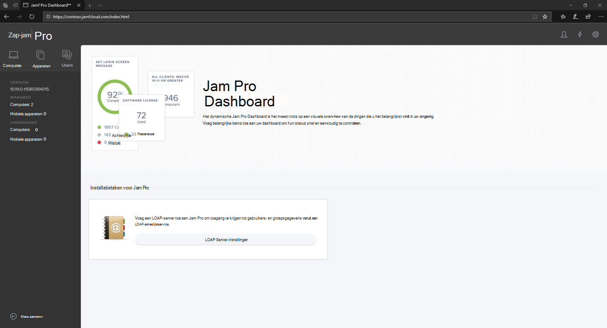

# Meld u aan bij Jamf ProLog in to Jamf Pro

[!INCLUDE [Microsoft 365 Defender rebranding](../../includes/microsoft-defender.md)]

**Van toepassing op:****Applies to:**
- [Microsoft Defender voor EindpuntMicrosoft Defender for Endpoint](https://go.microsoft.com/fwlink/p/?linkid=2154037)
- [Microsoft 365 DefenderMicrosoft 365 Defender](https://go.microsoft.com/fwlink/?linkid=2118804)

> Wilt u Defender voor Eindpunt ervaren?Want to experience Defender for Endpoint? [Meld u aan voor een gratis proefabonnement.Sign up for a free trial.](https://www.microsoft.com/microsoft-365/windows/microsoft-defender-atp?ocid=docs-wdatp-investigateip-abovefoldlink)

1. Voer uw referenties in.Enter your credentials.

    

2. Selecteer **Computers**.Select **Computers**.

    

3. U ziet de instellingen die beschikbaar zijn.You will see the settings that are available.

     

## Volgende stapNext step
[De apparaatgroepen instellen in Jamf ProSetup the device groups in Jamf Pro](mac-jamfpro-device-groups.md)

