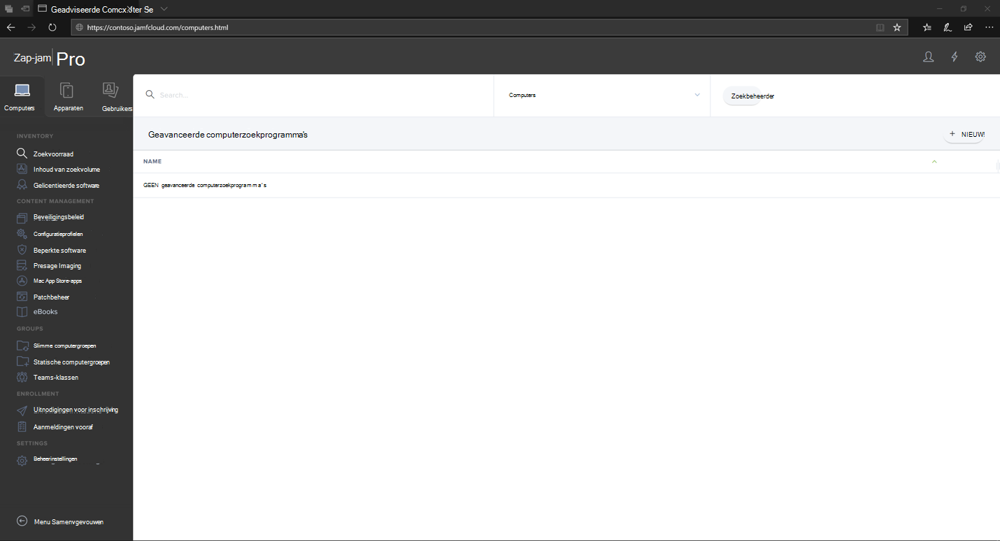

# Aanmelden bij Jamf Pro

[!INCLUDE [Microsoft 365 Defender rebranding](../../includes/microsoft-defender.md)]

**Van toepassing op:**
- [Microsoft Defender voor Endpoint](https://go.microsoft.com/fwlink/p/?linkid=2146631)
- [Microsoft 365 Defender](https://go.microsoft.com/fwlink/?linkid=2118804)

> Wilt u Defender voor Eindpunt ervaren? [Meld u aan voor een gratis proefabonnement.](https://www.microsoft.com/microsoft-365/windows/microsoft-defender-atp?ocid=docs-wdatp-investigateip-abovefoldlink)

1. Voer uw referenties in.

    

2. Selecteer **Computers**.

    

3. U ziet de instellingen die beschikbaar zijn.

     

## Volgende stap
[De apparaatgroepen instellen in Jamf Pro](mac-jamfpro-device-groups.md)

