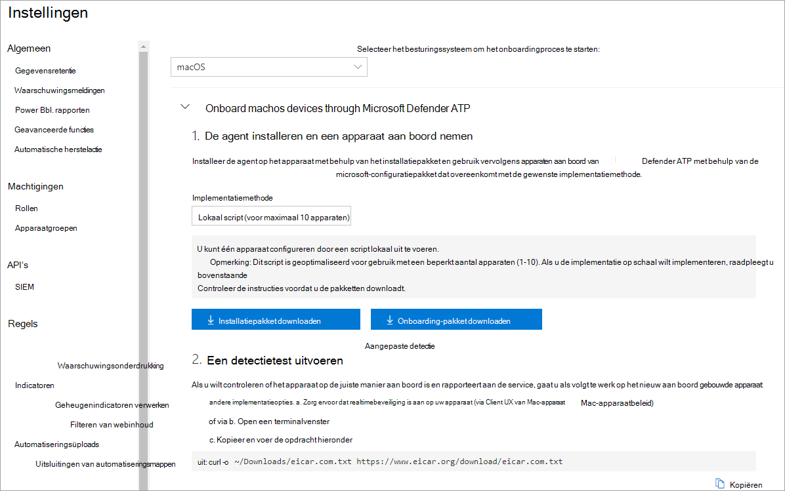
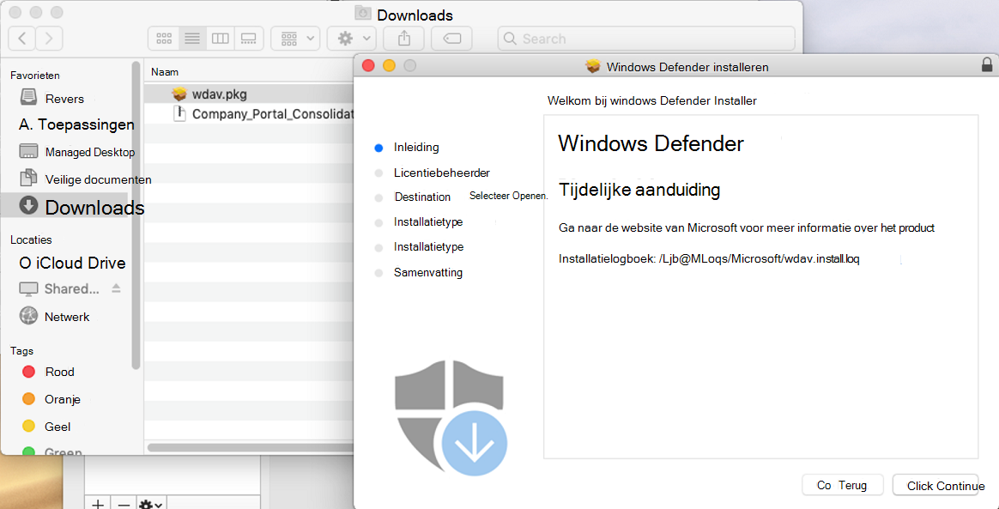
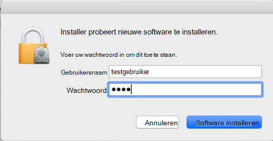
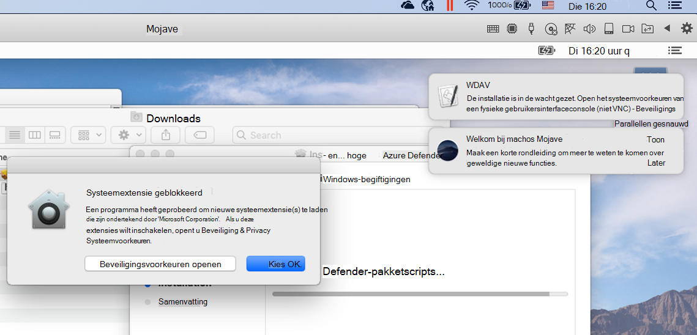
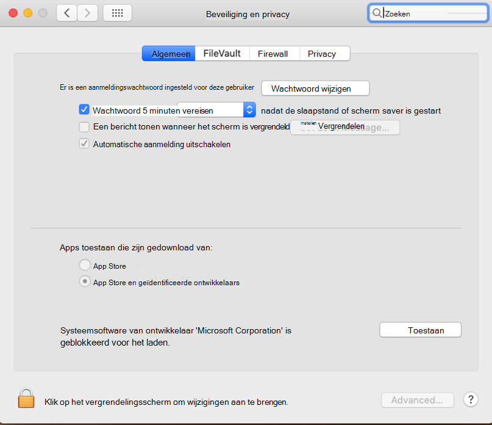
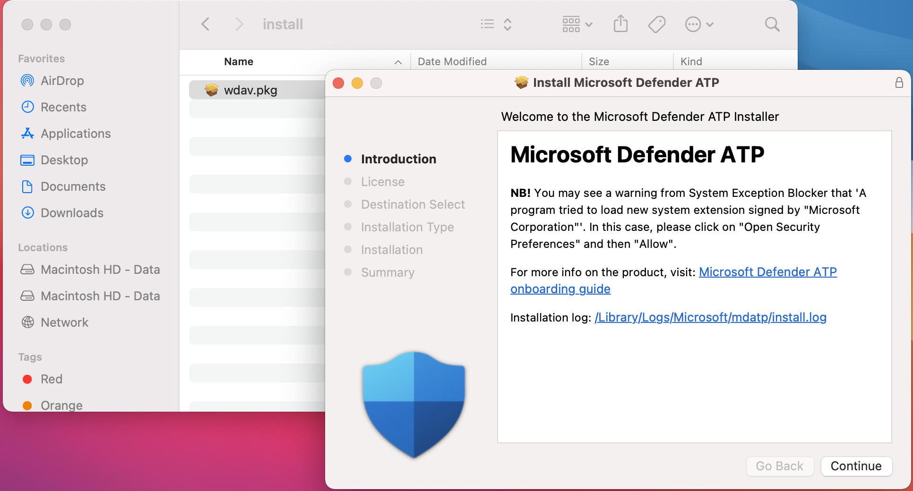
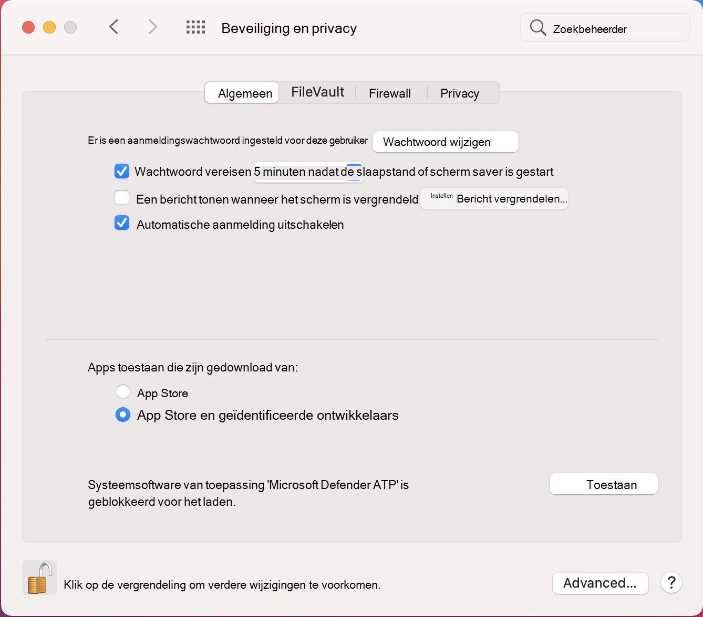
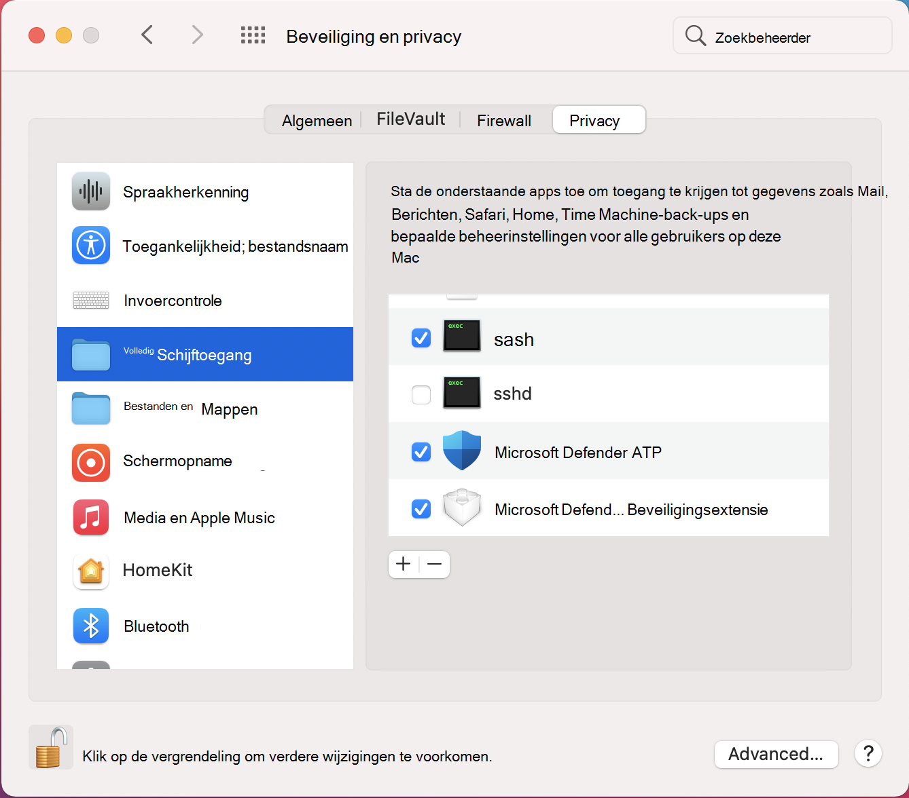

# <a name="manual-deployment-for-microsoft-defender-for-endpoint-on-macos"></a><span data-ttu-id="9bf6a-104">Handmatige implementatie voor Microsoft Defender voor Eindpunt op macOS</span><span class="sxs-lookup"><span data-stu-id="9bf6a-104">Manual deployment for Microsoft Defender for Endpoint on macOS</span></span>

[!INCLUDE [Microsoft 365 Defender rebranding](../../includes/microsoft-defender.md)]

<span data-ttu-id="9bf6a-105">**Van toepassing op:**</span><span class="sxs-lookup"><span data-stu-id="9bf6a-105">**Applies to:**</span></span>
- [<span data-ttu-id="9bf6a-106">Microsoft Defender voor Eindpunt</span><span class="sxs-lookup"><span data-stu-id="9bf6a-106">Microsoft Defender for Endpoint</span></span>](https://go.microsoft.com/fwlink/p/?linkid=2154037)
- [<span data-ttu-id="9bf6a-107">Microsoft 365 Defender</span><span class="sxs-lookup"><span data-stu-id="9bf6a-107">Microsoft 365 Defender</span></span>](https://go.microsoft.com/fwlink/?linkid=2118804)

> <span data-ttu-id="9bf6a-108">Wilt u Defender voor Eindpunt ervaren?</span><span class="sxs-lookup"><span data-stu-id="9bf6a-108">Want to experience Defender for Endpoint?</span></span> [<span data-ttu-id="9bf6a-109">Meld u aan voor een gratis proefabonnement.</span><span class="sxs-lookup"><span data-stu-id="9bf6a-109">Sign up for a free trial.</span></span>](https://www.microsoft.com/microsoft-365/windows/microsoft-defender-atp?ocid=docs-wdatp-investigateip-abovefoldlink)

<span data-ttu-id="9bf6a-110">In dit onderwerp wordt beschreven hoe u Microsoft Defender voor Eindpunt handmatig in macOS implementeert.</span><span class="sxs-lookup"><span data-stu-id="9bf6a-110">This topic describes how to deploy Microsoft Defender for Endpoint on macOS manually.</span></span> <span data-ttu-id="9bf6a-111">Voor een geslaagde implementatie moet u alle volgende stappen voltooien:</span><span class="sxs-lookup"><span data-stu-id="9bf6a-111">A successful deployment requires the completion of all of the following steps:</span></span>
- [<span data-ttu-id="9bf6a-112">Installatie- en onboarding-pakketten downloaden</span><span class="sxs-lookup"><span data-stu-id="9bf6a-112">Download installation and onboarding packages</span></span>](#download-installation-and-onboarding-packages)
- [<span data-ttu-id="9bf6a-113">Toepassingsinstallatie (macOS 10.15 en oudere versies)</span><span class="sxs-lookup"><span data-stu-id="9bf6a-113">Application installation (macOS 10.15 and older versions)</span></span>](#application-installation-macos-1015-and-older-versions)
- [<span data-ttu-id="9bf6a-114">Toepassingsinstallatie (macOS 11 en nieuwere versies)</span><span class="sxs-lookup"><span data-stu-id="9bf6a-114">Application installation (macOS 11 and newer versions)</span></span>](#application-installation-macos-11-and-newer-versions)
- [<span data-ttu-id="9bf6a-115">Clientconfiguratie</span><span class="sxs-lookup"><span data-stu-id="9bf6a-115">Client configuration</span></span>](#client-configuration)

## <a name="prerequisites-and-system-requirements"></a><span data-ttu-id="9bf6a-116">Vereisten en systeemvereisten</span><span class="sxs-lookup"><span data-stu-id="9bf6a-116">Prerequisites and system requirements</span></span>

<span data-ttu-id="9bf6a-117">Voordat u aan de slag gaat, bekijkt u de hoofdpagina van Microsoft Defender voor Eindpunt op [macOS](microsoft-defender-endpoint-mac.md) voor een beschrijving van vereisten en systeemvereisten voor de huidige softwareversie.</span><span class="sxs-lookup"><span data-stu-id="9bf6a-117">Before you get started, see [the main Microsoft Defender for Endpoint on macOS page](microsoft-defender-endpoint-mac.md) for a description of prerequisites and system requirements for the current software version.</span></span>

## <a name="download-installation-and-onboarding-packages"></a><span data-ttu-id="9bf6a-118">Installatie- en onboarding-pakketten downloaden</span><span class="sxs-lookup"><span data-stu-id="9bf6a-118">Download installation and onboarding packages</span></span>

<span data-ttu-id="9bf6a-119">Download de installatie- en onboarding-pakketten van het Microsoft Defender-beveiligingscentrum:</span><span class="sxs-lookup"><span data-stu-id="9bf6a-119">Download the installation and onboarding packages from Microsoft Defender Security Center:</span></span>

1. <span data-ttu-id="9bf6a-120">Ga in het Microsoft Defender-beveiligingscentrum naar **Instellingen > Apparaatbeheer > Onboarding.**</span><span class="sxs-lookup"><span data-stu-id="9bf6a-120">In Microsoft Defender Security Center, go to **Settings > Device Management > Onboarding**.</span></span>
2. <span data-ttu-id="9bf6a-121">Stel in sectie 1 van de pagina het besturingssysteem in op **macOS** en Implementatiemethode op **Lokaal script.**</span><span class="sxs-lookup"><span data-stu-id="9bf6a-121">In Section 1 of the page, set operating system to **macOS** and Deployment method to **Local script**.</span></span>
3. <span data-ttu-id="9bf6a-122">Selecteer installatiepakket downloaden in sectie 2 van **de pagina.**</span><span class="sxs-lookup"><span data-stu-id="9bf6a-122">In Section 2 of the page, select **Download installation package**.</span></span> <span data-ttu-id="9bf6a-123">Sla deze op als wdav.pkg in een lokale adreslijst.</span><span class="sxs-lookup"><span data-stu-id="9bf6a-123">Save it as wdav.pkg to a local directory.</span></span>
4. <span data-ttu-id="9bf6a-124">Selecteer **onboardingpakket** downloaden in sectie 2 van de pagina.</span><span class="sxs-lookup"><span data-stu-id="9bf6a-124">In Section 2 of the page, select **Download onboarding package**.</span></span> <span data-ttu-id="9bf6a-125">Sla deze op als WindowsDefenderATPOnboardingPackage.zip in dezelfde adreslijst.</span><span class="sxs-lookup"><span data-stu-id="9bf6a-125">Save it as WindowsDefenderATPOnboardingPackage.zip to the same directory.</span></span>

    

5. <span data-ttu-id="9bf6a-127">Controleer in een opdrachtprompt of u de twee bestanden hebt.</span><span class="sxs-lookup"><span data-stu-id="9bf6a-127">From a command prompt, verify that you have the two files.</span></span>
    
## <a name="application-installation-macos-1015-and-older-versions"></a><span data-ttu-id="9bf6a-128">Toepassingsinstallatie (macOS 10.15 en oudere versies)</span><span class="sxs-lookup"><span data-stu-id="9bf6a-128">Application installation (macOS 10.15 and older versions)</span></span>

<span data-ttu-id="9bf6a-129">Als u dit proces wilt voltooien, moet u beheerdersbevoegdheden hebben op het apparaat.</span><span class="sxs-lookup"><span data-stu-id="9bf6a-129">To complete this process, you must have admin privileges on the device.</span></span>

1. <span data-ttu-id="9bf6a-130">Ga naar de gedownloade wdav.pkg in Finder en open het.</span><span class="sxs-lookup"><span data-stu-id="9bf6a-130">Navigate to the downloaded wdav.pkg in Finder and open it.</span></span>

    

2. <span data-ttu-id="9bf6a-132">Selecteer **Doorgaan,** ga akkoord met de licentievoorwaarden en voer het wachtwoord in wanneer u daarom wordt gevraagd.</span><span class="sxs-lookup"><span data-stu-id="9bf6a-132">Select **Continue**, agree with the License terms, and enter the password when prompted.</span></span>

    

   > [!IMPORTANT]
   > <span data-ttu-id="9bf6a-134">U wordt gevraagd om toe te staan dat een stuurprogramma van Microsoft wordt geïnstalleerd ('Systeemextensie geblokkeerd' of 'Installatie is in de wacht gezet' of beide.</span><span class="sxs-lookup"><span data-stu-id="9bf6a-134">You will be prompted to allow a driver from Microsoft to be installed (either "System Extension Blocked" or "Installation is on hold" or both.</span></span> <span data-ttu-id="9bf6a-135">Het stuurprogramma moet zijn geïnstalleerd.</span><span class="sxs-lookup"><span data-stu-id="9bf6a-135">The driver must be allowed to be installed.</span></span>

   

3. <span data-ttu-id="9bf6a-137">Selecteer **Beveiligingsvoorkeuren openen** **of Systeemvoorkeuren openen > beveiliging & privacy**.</span><span class="sxs-lookup"><span data-stu-id="9bf6a-137">Select **Open Security Preferences** or **Open System Preferences > Security & Privacy**.</span></span> <span data-ttu-id="9bf6a-138">Selecteer **Toestaan:**</span><span class="sxs-lookup"><span data-stu-id="9bf6a-138">Select **Allow**:</span></span>

    

   <span data-ttu-id="9bf6a-140">De installatie gaat verder.</span><span class="sxs-lookup"><span data-stu-id="9bf6a-140">The installation proceeds.</span></span>

   > [!CAUTION]
   > <span data-ttu-id="9bf6a-141">Als u Toestaan niet **selecteert,** gaat de installatie na 5 minuten verder.</span><span class="sxs-lookup"><span data-stu-id="9bf6a-141">If you don't select **Allow**, the installation will proceed after 5 minutes.</span></span> <span data-ttu-id="9bf6a-142">Microsoft Defender voor Eindpunt wordt geladen, maar sommige functies, zoals realtimebeveiliging, worden uitgeschakeld.</span><span class="sxs-lookup"><span data-stu-id="9bf6a-142">Microsoft Defender for Endpoint will be loaded, but some features, such as real-time protection, will be disabled.</span></span> <span data-ttu-id="9bf6a-143">Zie [Problemen met kernelextensie oplossen](mac-support-kext.md) voor informatie over hoe u dit kunt oplossen.</span><span class="sxs-lookup"><span data-stu-id="9bf6a-143">See [Troubleshoot kernel extension issues](mac-support-kext.md) for information on how to resolve this.</span></span>

> [!NOTE]
> <span data-ttu-id="9bf6a-144">macOS kan een verzoek indienen om het apparaat opnieuw op te starten bij de eerste installatie van Microsoft Defender voor Eindpunt.</span><span class="sxs-lookup"><span data-stu-id="9bf6a-144">macOS may request to reboot the device upon the first installation of Microsoft Defender for Endpoint.</span></span> <span data-ttu-id="9bf6a-145">Realtimebeveiliging is pas beschikbaar als het apparaat opnieuw is opgestart.</span><span class="sxs-lookup"><span data-stu-id="9bf6a-145">Real-time protection will not be available until the device is rebooted.</span></span>

## <a name="application-installation-macos-11-and-newer-versions"></a><span data-ttu-id="9bf6a-146">Toepassingsinstallatie (macOS 11 en nieuwere versies)</span><span class="sxs-lookup"><span data-stu-id="9bf6a-146">Application installation (macOS 11 and newer versions)</span></span>

<span data-ttu-id="9bf6a-147">Als u dit proces wilt voltooien, moet u beheerdersbevoegdheden hebben op het apparaat.</span><span class="sxs-lookup"><span data-stu-id="9bf6a-147">To complete this process, you must have admin privileges on the device.</span></span>

1. <span data-ttu-id="9bf6a-148">Ga naar de gedownloade wdav.pkg in Finder en open het.</span><span class="sxs-lookup"><span data-stu-id="9bf6a-148">Navigate to the downloaded wdav.pkg in Finder and open it.</span></span>

    

2. <span data-ttu-id="9bf6a-150">Selecteer **Doorgaan,** ga akkoord met de licentievoorwaarden en voer het wachtwoord in wanneer u daarom wordt gevraagd.</span><span class="sxs-lookup"><span data-stu-id="9bf6a-150">Select **Continue**, agree with the License terms, and enter the password when prompted.</span></span>

3. <span data-ttu-id="9bf6a-151">Aan het einde van het installatieproces wordt u gepromoveerd om de systeemextensies goed te keuren die door het product worden gebruikt.</span><span class="sxs-lookup"><span data-stu-id="9bf6a-151">At the end of the installation process, you'll be promoted to approve the system extensions used by the product.</span></span> <span data-ttu-id="9bf6a-152">Selecteer **Beveiligingsvoorkeuren openen.**</span><span class="sxs-lookup"><span data-stu-id="9bf6a-152">Select **Open Security Preferences**.</span></span>

    

4. <span data-ttu-id="9bf6a-154">Selecteer in **het & Privacy** van beveiliging de optie **Toestaan.**</span><span class="sxs-lookup"><span data-stu-id="9bf6a-154">From the **Security & Privacy** window, select **Allow**.</span></span>

    

5. <span data-ttu-id="9bf6a-156">Herhaal stap 3 & 4 voor alle systeemextensies die zijn gedistribueerd met Microsoft Defender voor Eindpunt op Mac.</span><span class="sxs-lookup"><span data-stu-id="9bf6a-156">Repeat steps 3 & 4 for all system extensions distributed with Microsoft Defender for Endpoint on Mac.</span></span>

6. <span data-ttu-id="9bf6a-157">Als onderdeel van de mogelijkheden voor het detecteren en beantwoorden van eindpunten controleert Microsoft Defender voor Eindpunt op Mac socketverkeer en rapporteert deze informatie aan de microsoft Defender-beveiligingscentrumportal.</span><span class="sxs-lookup"><span data-stu-id="9bf6a-157">As part of the Endpoint Detection and Response capabilities, Microsoft Defender for Endpoint on Mac inspects socket traffic and reports this information to the Microsoft Defender Security Center portal.</span></span> <span data-ttu-id="9bf6a-158">Wanneer u wordt gevraagd Microsoft Defender te verlenen voor eindpuntmachtigingen voor het filteren van netwerkverkeer, selecteert u **Toestaan.**</span><span class="sxs-lookup"><span data-stu-id="9bf6a-158">When prompted to grant Microsoft Defender for Endpoint permissions to filter network traffic, select **Allow**.</span></span>

    

7. <span data-ttu-id="9bf6a-160">Open **Systeemvoorkeuren**& privacy en ga naar het tabblad Privacy. Verleen volledige schijftoegangsmachtigingen aan Microsoft Defender  >   **ATP** en Microsoft **Defender ATP-eindpuntbeveiligingsextensie**.  </span><span class="sxs-lookup"><span data-stu-id="9bf6a-160">Open **System Preferences** > **Security & Privacy** and navigate to the **Privacy** tab. Grant **Full Disk Access** permission to **Microsoft Defender ATP** and **Microsoft Defender ATP Endpoint Security Extension**.</span></span>

    

## <a name="client-configuration"></a><span data-ttu-id="9bf6a-162">Clientconfiguratie</span><span class="sxs-lookup"><span data-stu-id="9bf6a-162">Client configuration</span></span>

1. <span data-ttu-id="9bf6a-163">Kopieer wdav.pkg en MicrosoftDefenderATPOnboardingMacOs.py naar het apparaat waar u Microsoft Defender voor Eindpunt implementeert in macOS.</span><span class="sxs-lookup"><span data-stu-id="9bf6a-163">Copy wdav.pkg and MicrosoftDefenderATPOnboardingMacOs.py to the device where you deploy Microsoft Defender for Endpoint on macOS.</span></span>

    <span data-ttu-id="9bf6a-164">Het clientapparaat is niet gekoppeld aan org_id.</span><span class="sxs-lookup"><span data-stu-id="9bf6a-164">The client device isn't associated with org_id.</span></span> <span data-ttu-id="9bf6a-165">Het *kenmerk* org_id is leeg.</span><span class="sxs-lookup"><span data-stu-id="9bf6a-165">Note that the *org_id* attribute is blank.</span></span>

    ```bash
    mdatp health --field org_id
    ```

2. <span data-ttu-id="9bf6a-166">Voer het Python-script uit om het configuratiebestand te installeren:</span><span class="sxs-lookup"><span data-stu-id="9bf6a-166">Run the Python script to install the configuration file:</span></span>

    ```bash
    /usr/bin/python MicrosoftDefenderATPOnboardingMacOs.py
    ```

3. <span data-ttu-id="9bf6a-167">Controleer of het apparaat nu is gekoppeld aan uw organisatie en meldt een geldige organisatie-id:</span><span class="sxs-lookup"><span data-stu-id="9bf6a-167">Verify that the device is now associated with your organization and reports a valid org ID:</span></span>

    ```bash
    mdatp health --field org_id
    ```

    <span data-ttu-id="9bf6a-168">Na de installatie ziet u het Microsoft Defender-pictogram in de statusbalk van macOS in de rechterbovenhoek.</span><span class="sxs-lookup"><span data-stu-id="9bf6a-168">After installation, you'll see the Microsoft Defender icon in the macOS status bar in the top-right corner.</span></span>
    
    > [!div class="mx-imgBorder"]
    > <span data-ttu-id="9bf6a-169"></span><span class="sxs-lookup"><span data-stu-id="9bf6a-169"></span></span>


## <a name="how-to-allow-full-disk-access"></a><span data-ttu-id="9bf6a-170">Volledige schijftoegang toestaan</span><span class="sxs-lookup"><span data-stu-id="9bf6a-170">How to Allow Full Disk Access</span></span>

> [!CAUTION]
> <span data-ttu-id="9bf6a-171">macOS 10.15 (Catalina) bevat nieuwe beveiligings- en privacyverbeteringen.</span><span class="sxs-lookup"><span data-stu-id="9bf6a-171">macOS 10.15 (Catalina) contains new security and privacy enhancements.</span></span> <span data-ttu-id="9bf6a-172">Vanaf deze versie hebben toepassingen standaard geen toegang tot bepaalde locaties op schijf (zoals Documenten, Downloads, Bureaublad, enzovoort) zonder expliciete toestemming.</span><span class="sxs-lookup"><span data-stu-id="9bf6a-172">Beginning with this version, by default, applications are not able to access certain locations on disk (such as Documents, Downloads, Desktop, etc.) without explicit consent.</span></span> <span data-ttu-id="9bf6a-173">Bij afwezigheid van deze toestemming kan Microsoft Defender voor Eindpunt uw apparaat niet volledig beveiligen.</span><span class="sxs-lookup"><span data-stu-id="9bf6a-173">In the absence of this consent, Microsoft Defender for Endpoint is not able to fully protect your device.</span></span>

1. <span data-ttu-id="9bf6a-174">Als u toestemming wilt verlenen, opent u **Systeemvoorkeuren**  >  **Beveiliging & Privacy**  >  **Privacy** Full  >  **Disk Access**.</span><span class="sxs-lookup"><span data-stu-id="9bf6a-174">To grant consent, open **System Preferences** > **Security & Privacy** > **Privacy** > **Full Disk Access**.</span></span> <span data-ttu-id="9bf6a-175">Klik op het vergrendelingspictogram om wijzigingen aan te brengen (onder aan het dialoogvenster).</span><span class="sxs-lookup"><span data-stu-id="9bf6a-175">Click the lock icon to make changes (bottom of the dialog box).</span></span> <span data-ttu-id="9bf6a-176">Selecteer Microsoft Defender voor Eindpunt.</span><span class="sxs-lookup"><span data-stu-id="9bf6a-176">Select Microsoft Defender for Endpoint.</span></span>

2. <span data-ttu-id="9bf6a-177">Voer een AV-detectietest uit om te controleren of het apparaat correct is onboarded en rapporteert aan de service.</span><span class="sxs-lookup"><span data-stu-id="9bf6a-177">Run an AV detection test to verify that the device is properly onboarded and reporting to the service.</span></span> <span data-ttu-id="9bf6a-178">Voer de volgende stappen uit op het nieuwe onboarded-apparaat:</span><span class="sxs-lookup"><span data-stu-id="9bf6a-178">Perform the following steps on the newly onboarded device:</span></span>

    1. <span data-ttu-id="9bf6a-179">Zorg ervoor dat realtimebeveiliging is ingeschakeld (aangegeven met een resultaat van 1 als u de volgende opdracht kunt uitvoeren):</span><span class="sxs-lookup"><span data-stu-id="9bf6a-179">Ensure that real-time protection is enabled (denoted by a result of 1 from running the following command):</span></span>

        ```bash
        mdatp health --field real_time_protection_enabled
        ```

    1. <span data-ttu-id="9bf6a-180">Open een terminalvenster.</span><span class="sxs-lookup"><span data-stu-id="9bf6a-180">Open a Terminal window.</span></span> <span data-ttu-id="9bf6a-181">Kopieer en voer de volgende opdracht uit:</span><span class="sxs-lookup"><span data-stu-id="9bf6a-181">Copy and execute the following command:</span></span>

        ```bash
        curl -o ~/Downloads/eicar.com.txt https://www.eicar.org/download/eicar.com.txt
        ```

    1. <span data-ttu-id="9bf6a-182">Het bestand had in quarantaine moeten zijn geplaatst door Defender voor Eindpunt voor Mac.</span><span class="sxs-lookup"><span data-stu-id="9bf6a-182">The file should have been quarantined by Defender for Endpoint for Mac.</span></span> <span data-ttu-id="9bf6a-183">Gebruik de volgende opdracht om alle gedetecteerde bedreigingen op te geven:</span><span class="sxs-lookup"><span data-stu-id="9bf6a-183">Use the following command to list all the detected threats:</span></span>

        ```bash
        mdatp threat list
        ```

3. <span data-ttu-id="9bf6a-184">Voer een EDR-detectietest uit om te controleren of het apparaat correct is onboarded en rapporteert aan de service.</span><span class="sxs-lookup"><span data-stu-id="9bf6a-184">Run an EDR detection test to verify that the device is properly onboarded and reporting to the service.</span></span> <span data-ttu-id="9bf6a-185">Voer de volgende stappen uit op het nieuwe onboarded-apparaat:</span><span class="sxs-lookup"><span data-stu-id="9bf6a-185">Perform the following steps on the newly onboarded device:</span></span>

   1. <span data-ttu-id="9bf6a-186">In uw browser, zoals Microsoft Edge voor Mac of Safari.</span><span class="sxs-lookup"><span data-stu-id="9bf6a-186">In your browser such as Microsoft Edge for Mac or Safari.</span></span>

   1. <span data-ttu-id="9bf6a-187">Download MDATP MacOS DIY.zip en https://aka.ms/mdatpmacosdiy haal deze uit.</span><span class="sxs-lookup"><span data-stu-id="9bf6a-187">Download MDATP MacOS DIY.zip from https://aka.ms/mdatpmacosdiy and extract.</span></span>

      <span data-ttu-id="9bf6a-188">Mogelijk wordt u gevraagd:</span><span class="sxs-lookup"><span data-stu-id="9bf6a-188">You may be prompted:</span></span>

      > <span data-ttu-id="9bf6a-189">Wilt u downloads toestaan op 'mdatpclientanalyzer.blob.core.windows.net'?</span><span class="sxs-lookup"><span data-stu-id="9bf6a-189">Do you want to allow downloads on "mdatpclientanalyzer.blob.core.windows.net"?</span></span><br/>
      > <span data-ttu-id="9bf6a-190">U kunt wijzigen welke websites bestanden kunnen downloaden in Websitesvoorkeuren.</span><span class="sxs-lookup"><span data-stu-id="9bf6a-190">You can change which websites can download files in Websites Preferences.</span></span>

4. <span data-ttu-id="9bf6a-191">Klik **op Toestaan.**</span><span class="sxs-lookup"><span data-stu-id="9bf6a-191">Click **Allow**.</span></span>

5. <span data-ttu-id="9bf6a-192">Download **openen.**</span><span class="sxs-lookup"><span data-stu-id="9bf6a-192">Open **Downloads**.</span></span>

6. <span data-ttu-id="9bf6a-193">U ziet **MDATP MacOS DIY**.</span><span class="sxs-lookup"><span data-stu-id="9bf6a-193">You should see **MDATP MacOS DIY**.</span></span>

   > [!TIP]
   > <span data-ttu-id="9bf6a-194">Als u dubbelklikt, krijgt u het volgende bericht:</span><span class="sxs-lookup"><span data-stu-id="9bf6a-194">If you double-click, you will get the following message:</span></span>
   > 
   > > <span data-ttu-id="9bf6a-195">**'MDATP MacOS DIY' kan niet worden geopend omdat de ontwikkelaar niet kan worden geverifieerd.**</span><span class="sxs-lookup"><span data-stu-id="9bf6a-195">**"MDATP MacOS DIY" cannot be opened because the developer cannot be verifier.**</span></span><br/>
   > > <span data-ttu-id="9bf6a-196">macOS kan niet controleren of deze app vrij is van malware.</span><span class="sxs-lookup"><span data-stu-id="9bf6a-196">macOS cannot verify that this app is free from malware.</span></span><br/>
   > > <span data-ttu-id="9bf6a-197">**\[ Naar Prullenbak \]** **\[ annuleren gaan \]**</span><span class="sxs-lookup"><span data-stu-id="9bf6a-197">**\[Move to Trash\]** **\[Cancel\]**</span></span> 
  
7. <span data-ttu-id="9bf6a-198">Klik op **Cancel**.</span><span class="sxs-lookup"><span data-stu-id="9bf6a-198">Click **Cancel**.</span></span>

8. <span data-ttu-id="9bf6a-199">Klik met de rechtermuisknop **op MDATP MacOS DIY** en klik vervolgens op **Openen.**</span><span class="sxs-lookup"><span data-stu-id="9bf6a-199">Right-click **MDATP MacOS DIY**, and then click **Open**.</span></span> 

    <span data-ttu-id="9bf6a-200">In het systeem moet het volgende bericht worden weergegeven:</span><span class="sxs-lookup"><span data-stu-id="9bf6a-200">The system should display the following message:</span></span>

    > <span data-ttu-id="9bf6a-201">**macOS kan de ontwikkelaar van **MDATP MacOS DIY niet verifiëren.** Weet u zeker dat u het wilt openen?**</span><span class="sxs-lookup"><span data-stu-id="9bf6a-201">**macOS cannot verify the developer of **MDATP MacOS DIY**. Are you sure you want to open it?**</span></span><br/>
    > <span data-ttu-id="9bf6a-202">Door deze app te openen, overteert u de systeembeveiliging, waardoor uw computer en persoonlijke gegevens kunnen worden blootstellen aan malware die uw Mac kan schaden of uw privacy in gevaar kan brengen.</span><span class="sxs-lookup"><span data-stu-id="9bf6a-202">By opening this app, you will be overriding system security which can expose your computer and personal information to malware that may harm your Mac or compromise your privacy.</span></span>

10. <span data-ttu-id="9bf6a-203">Klik **op Openen.**</span><span class="sxs-lookup"><span data-stu-id="9bf6a-203">Click **Open**.</span></span>

    <span data-ttu-id="9bf6a-204">In het systeem moet het volgende bericht worden weergegeven:</span><span class="sxs-lookup"><span data-stu-id="9bf6a-204">The system should display the following message:</span></span>

    > <span data-ttu-id="9bf6a-205">Microsoft Defender ATP - macOS EDR DIY-testbestand</span><span class="sxs-lookup"><span data-stu-id="9bf6a-205">Microsoft Defender ATP - macOS EDR DIY test file</span></span><br/>
    > <span data-ttu-id="9bf6a-206">De bijbehorende waarschuwing is beschikbaar in de MDATP-portal.</span><span class="sxs-lookup"><span data-stu-id="9bf6a-206">Corresponding alert will be available in the MDATP portal.</span></span>

11. <span data-ttu-id="9bf6a-207">Klik **op Openen.**</span><span class="sxs-lookup"><span data-stu-id="9bf6a-207">Click **Open**.</span></span>

    <span data-ttu-id="9bf6a-208">In een paar minuten moet een waarschuwing met de naam 'macOS EDR Test Alert' worden verhoogd.</span><span class="sxs-lookup"><span data-stu-id="9bf6a-208">In a few minutes an alert named "macOS EDR Test Alert" should be raised.</span></span>

12. <span data-ttu-id="9bf6a-209">Ga naar Microsoft Defender Security Center ( https://SecurityCenter.microsoft.com) .</span><span class="sxs-lookup"><span data-stu-id="9bf6a-209">Go to Microsoft Defender Security Center (https://SecurityCenter.microsoft.com).</span></span>

13. <span data-ttu-id="9bf6a-210">Ga naar de waarschuwingswachtrij.</span><span class="sxs-lookup"><span data-stu-id="9bf6a-210">Go to the Alert Queue.</span></span>

    :::image type="content" source="images/b8db76c2-c368-49ad-970f-dcb87534d9be.png" alt-text="Voorbeeld van een macOS EDR-testmelding met ernst, categorie, detectiebron en een samengevouwen menu met acties.":::
    
    <span data-ttu-id="9bf6a-212">Bekijk de details van de waarschuwing en de tijdlijn van het apparaat en voer de normale onderzoeksstappen uit.</span><span class="sxs-lookup"><span data-stu-id="9bf6a-212">Look at the alert details and the device timeline, and perform the regular investigation steps.</span></span>

## <a name="logging-installation-issues"></a><span data-ttu-id="9bf6a-213">Installatieproblemen met logboekregistratie</span><span class="sxs-lookup"><span data-stu-id="9bf6a-213">Logging installation issues</span></span>

<span data-ttu-id="9bf6a-214">Zie [Installatieproblemen registreren](mac-resources.md#logging-installation-issues) voor meer informatie over het vinden van het automatisch gegenereerde logboek dat door het installatieprogramma wordt gemaakt wanneer er een fout optreedt.</span><span class="sxs-lookup"><span data-stu-id="9bf6a-214">See [Logging installation issues](mac-resources.md#logging-installation-issues) for more information on how to find the automatically generated log that is created by the installer when an error occurs.</span></span>

## <a name="uninstallation"></a><span data-ttu-id="9bf6a-215">Verwijderen</span><span class="sxs-lookup"><span data-stu-id="9bf6a-215">Uninstallation</span></span>

<span data-ttu-id="9bf6a-216">Zie [Verwijderen voor](mac-resources.md#uninstalling) meer informatie over het verwijderen van Microsoft Defender voor Eindpunt voor macOS van clientapparaten.</span><span class="sxs-lookup"><span data-stu-id="9bf6a-216">See [Uninstalling](mac-resources.md#uninstalling) for details on how to remove Microsoft Defender for Endpoint for macOS from client devices.</span></span>
