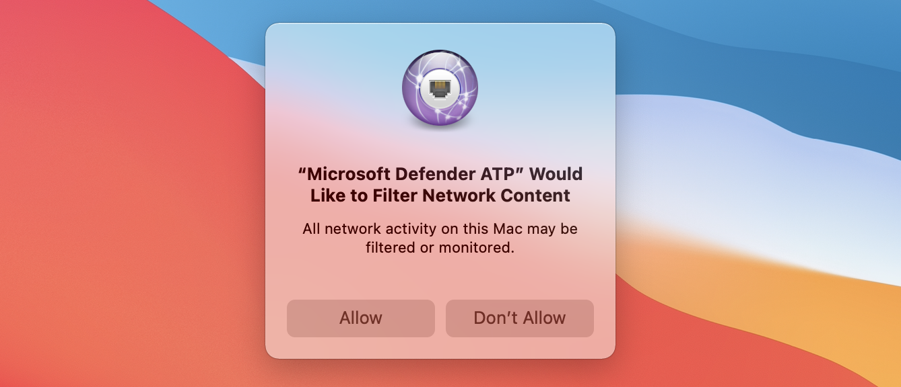

# <a name="manual-deployment-for-microsoft-defender-for-endpoint-for-macos"></a>Handmatige implementatie voor Microsoft Defender voor Eindpunt voor macOS

[!INCLUDE [Microsoft 365 Defender rebranding](../../includes/microsoft-defender.md)]

**Van toepassing op:**
- [Microsoft Defender voor Eindpunt](https://go.microsoft.com/fwlink/p/?linkid=2154037)
- [Microsoft 365 Defender](https://go.microsoft.com/fwlink/?linkid=2118804)

> Wilt u Defender voor Eindpunt ervaren? [Meld u aan voor een gratis proefabonnement.](https://www.microsoft.com/microsoft-365/windows/microsoft-defender-atp?ocid=docs-wdatp-investigateip-abovefoldlink)

In dit onderwerp wordt beschreven hoe u Microsoft Defender voor Eindpunt voor macOS handmatig implementeert. Voor een geslaagde implementatie moet u alle volgende stappen voltooien:
- [Installatie- en onboarding-pakketten downloaden](#download-installation-and-onboarding-packages)
- [Toepassingsinstallatie (macOS 10.15 en oudere versies)](#application-installation-macos-1015-and-older-versions)
- [Toepassingsinstallatie (macOS 11 en nieuwere versies)](#application-installation-macos-11-and-newer-versions)
- [Clientconfiguratie](#client-configuration)

## <a name="prerequisites-and-system-requirements"></a>Vereisten en systeemvereisten

Voordat u aan de slag gaat, bekijkt u de hoofdpagina van Microsoft Defender voor Eindpunt voor [macOS](microsoft-defender-endpoint-mac.md) voor een beschrijving van vereisten en systeemvereisten voor de huidige softwareversie.

## <a name="download-installation-and-onboarding-packages"></a>Installatie- en onboarding-pakketten downloaden

Download de installatie- en onboarding-pakketten van het Microsoft Defender-beveiligingscentrum:

1. Ga in het Microsoft Defender-beveiligingscentrum naar **Instellingen > Apparaatbeheer > Onboarding.**
2. Stel in sectie 1 van de pagina het besturingssysteem in op **macOS** en Implementatiemethode op **Lokaal script.**
3. Selecteer installatiepakket downloaden in sectie 2 van **de pagina.** Sla deze op als wdav.pkg in een lokale adreslijst.
4. Selecteer **onboardingpakket** downloaden in sectie 2 van de pagina. Sla deze op als WindowsDefenderATPOnboardingPackage.zip in dezelfde adreslijst.

    

5. Controleer in een opdrachtprompt of u de twee bestanden hebt.
    
## <a name="application-installation-macos-1015-and-older-versions"></a>Toepassingsinstallatie (macOS 10.15 en oudere versies)

Als u dit proces wilt voltooien, moet u beheerdersbevoegdheden hebben op het apparaat.

1. Ga naar de gedownloade wdav.pkg in Finder en open het.

    

2. Selecteer **Doorgaan,** ga akkoord met de licentievoorwaarden en voer het wachtwoord in wanneer u daarom wordt gevraagd.

    

   > [!IMPORTANT]
   > U wordt gevraagd om toe te staan dat een stuurprogramma van Microsoft wordt geïnstalleerd ('Systeemextensie geblokkeerd' of 'Installatie is in de wacht gezet' of beide. Het stuurprogramma moet zijn geïnstalleerd.

   

3. Selecteer **Beveiligingsvoorkeuren openen** **of Systeemvoorkeuren openen > beveiliging & privacy**. Selecteer **Toestaan:**

    

   De installatie gaat verder.

   > [!CAUTION]
   > Als u Toestaan niet **selecteert,** gaat de installatie na 5 minuten verder. Microsoft Defender voor Eindpunt wordt geladen, maar sommige functies, zoals realtimebeveiliging, worden uitgeschakeld. Zie [Problemen met kernelextensie oplossen](mac-support-kext.md) voor informatie over hoe u dit kunt oplossen.

> [!NOTE]
> macOS kan een verzoek indienen om het apparaat opnieuw op te starten bij de eerste installatie van Microsoft Defender voor Eindpunt. Realtimebeveiliging is pas beschikbaar als het apparaat opnieuw is opgestart.

## <a name="application-installation-macos-11-and-newer-versions"></a>Toepassingsinstallatie (macOS 11 en nieuwere versies)

Als u dit proces wilt voltooien, moet u beheerdersbevoegdheden hebben op het apparaat.

1. Ga naar de gedownloade wdav.pkg in Finder en open het.

    

2. Selecteer **Doorgaan,** ga akkoord met de licentievoorwaarden en voer het wachtwoord in wanneer u daarom wordt gevraagd.

3. Aan het einde van het installatieproces wordt u gepromoveerd om de systeemextensies goed te keuren die door het product worden gebruikt. Selecteer **Beveiligingsvoorkeuren openen.**

    

4. Selecteer in **het & Privacy** van beveiliging de optie **Toestaan.**

    

5. Herhaal stap 3 & 4 voor alle systeemextensies die zijn gedistribueerd met Microsoft Defender voor Eindpunt voor Mac.

6. Als onderdeel van de mogelijkheden voor endpointdetectie en -reactie controleert Microsoft Defender voor Endpoint voor Mac socketverkeer en rapporteert deze informatie aan de microsoft Defender-beveiligingscentrumportal. Wanneer u wordt gevraagd Microsoft Defender te verlenen voor eindpuntmachtigingen voor het filteren van netwerkverkeer, selecteert u **Toestaan.**

    

7. Open **Systeemvoorkeuren**& privacy en ga naar het tabblad Privacy. Verleen volledige schijftoegangsmachtigingen aan Microsoft Defender  >   **ATP** en Microsoft **Defender ATP-eindpuntbeveiligingsextensie**.  

    

## <a name="client-configuration"></a>Clientconfiguratie

1. Kopieer wdav.pkg en MicrosoftDefenderATPOnboardingMacOs.py naar het apparaat waar u Microsoft Defender voor Eindpunt voor macOS implementeert.

    Het clientapparaat is niet gekoppeld aan org_id. Het *kenmerk* org_id is leeg.

    ```bash
    mdatp health --field org_id
    ```

2. Voer het Python-script uit om het configuratiebestand te installeren:

    ```bash
    /usr/bin/python MicrosoftDefenderATPOnboardingMacOs.py
    ```

3. Controleer of het apparaat nu is gekoppeld aan uw organisatie en meldt een geldige organisatie-id:

    ```bash
    mdatp health --field org_id
    ```

    Na de installatie ziet u het Microsoft Defender-pictogram in de statusbalk van macOS in de rechterbovenhoek.
    
    > [!div class="mx-imgBorder"]
    > 


## <a name="how-to-allow-full-disk-access"></a>Volledige schijftoegang toestaan

> [!CAUTION]
> macOS 10.15 (Catalina) bevat nieuwe beveiligings- en privacyverbeteringen. Vanaf deze versie hebben toepassingen standaard geen toegang tot bepaalde locaties op schijf (zoals Documenten, Downloads, Bureaublad, enzovoort) zonder expliciete toestemming. Bij afwezigheid van deze toestemming kan Microsoft Defender voor Eindpunt uw apparaat niet volledig beveiligen.

1. Als u toestemming wilt verlenen, opent u **Systeemvoorkeuren**  >  **Beveiliging & Privacy**  >  **Privacy** Full  >  **Disk Access**. Klik op het vergrendelingspictogram om wijzigingen aan te brengen (onder aan het dialoogvenster). Selecteer Microsoft Defender voor Eindpunt.

2. Voer een AV-detectietest uit om te controleren of het apparaat correct is onboarded en rapporteert aan de service. Voer de volgende stappen uit op het nieuwe onboarded-apparaat:

    1. Zorg ervoor dat realtimebeveiliging is ingeschakeld (aangegeven met een resultaat van 1 als u de volgende opdracht kunt uitvoeren):

        ```bash
        mdatp health --field real_time_protection_enabled
        ```

    1. Open een terminalvenster. Kopieer en voer de volgende opdracht uit:

        ```bash
        curl -o ~/Downloads/eicar.com.txt https://www.eicar.org/download/eicar.com.txt
        ```

    1. Het bestand had in quarantaine moeten zijn geplaatst door Defender voor Eindpunt voor Mac. Gebruik de volgende opdracht om alle gedetecteerde bedreigingen op te geven:

        ```bash
        mdatp threat list
        ```

3. Voer een EDR-detectietest uit om te controleren of het apparaat correct is onboarded en rapporteert aan de service. Voer de volgende stappen uit op het nieuwe onboarded-apparaat:

   1. In uw browser, zoals Microsoft Edge voor Mac of Safari.

   1. Download MDATP MacOS DIY.zip en https://aka.ms/mdatpmacosdiy haal deze uit.

      Mogelijk wordt u gevraagd:

      > Wilt u downloads toestaan op 'mdatpclientanalyzer.blob.core.windows.net'?<br/>
      > U kunt wijzigen welke websites bestanden kunnen downloaden in Websitesvoorkeuren.

4. Klik **op Toestaan.**

5. Download **openen.**

6. U ziet **MDATP MacOS DIY**.

   > [!TIP]
   > Als u dubbelklikt, krijgt u het volgende bericht:
   > 
   > > **'MDATP MacOS DIY' kan niet worden geopend omdat de ontwikkelaar niet kan worden geverifieerd.**<br/>
   > > macOS kan niet controleren of deze app vrij is van malware.<br/>
   > > **\[ Naar Prullenbak \]** **\[ annuleren gaan \]** 
  
7. Klik op **Cancel**.

8. Klik met de rechtermuisknop **op MDATP MacOS DIY** en klik vervolgens op **Openen.** 

    In het systeem moet het volgende bericht worden weergegeven:

    > **macOS kan de ontwikkelaar van **MDATP MacOS DIY niet verifiëren.** Weet u zeker dat u het wilt openen?**<br/>
    > Door deze app te openen, overteert u de systeembeveiliging, waardoor uw computer en persoonlijke gegevens kunnen worden blootstellen aan malware die uw Mac kan schaden of uw privacy in gevaar kan brengen.

10. Klik **op Openen.**

    In het systeem moet het volgende bericht worden weergegeven:

    > Microsoft Defender ATP - macOS EDR DIY-testbestand<br/>
    > De bijbehorende waarschuwing is beschikbaar in de MDATP-portal.

11. Klik **op Openen.**

    In een paar minuten moet een waarschuwing met de naam 'macOS EDR Test Alert' worden verhoogd.

12. Ga naar Microsoft Defender Security Center ( https://SecurityCenter.microsoft.com) .

13. Ga naar de waarschuwingswachtrij.

    :::image type="content" source="images/b8db76c2-c368-49ad-970f-dcb87534d9be.png" alt-text="Voorbeeld van een macOS EDR-testmelding met ernst, categorie, detectiebron en een samengevouwen menu met acties.":::
    
    Bekijk de details van de waarschuwing en de tijdlijn van het apparaat en voer de normale onderzoeksstappen uit.

## <a name="logging-installation-issues"></a>Installatieproblemen met logboekregistratie

Zie [Installatieproblemen registreren](mac-resources.md#logging-installation-issues) voor meer informatie over het vinden van het automatisch gegenereerde logboek dat door het installatieprogramma wordt gemaakt wanneer er een fout optreedt.

## <a name="uninstallation"></a>Verwijderen

Zie [Verwijderen voor](mac-resources.md#uninstalling) meer informatie over het verwijderen van Microsoft Defender voor Eindpunt voor macOS van clientapparaten.
