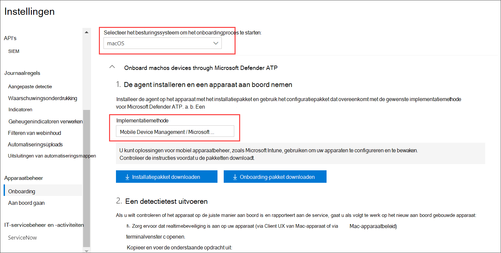

# <a name="intune-based-deployment-for-microsoft-defender-for-endpoint-for-mac"></a>Intune-implementatie voor Microsoft Defender voor Eindpunt voor Mac

[!INCLUDE [Microsoft 365 Defender rebranding](../../includes/microsoft-defender.md)]


> [!NOTE]
> In deze documentatie wordt uitgelegd wat de oudere methode is voor het implementeren en configureren van Microsoft Defender voor Eindpunt op macOS-apparaten. De native ervaring is nu beschikbaar in de MEM-console. De release van de native GEBRUIKERSINTERFACE in de MEM-console biedt beheerders een veel eenvoudigere manier om de toepassing te configureren en te implementeren en deze naar macOS-apparaten te verzenden. <br> <br>
>Het blogbericht [MEM vereenvoudigt de implementatie van Microsoft Defender voor Eindpunt voor macOS](https://techcommunity.microsoft.com/t5/microsoft-endpoint-manager-blog/microsoft-endpoint-manager-simplifies-deployment-of-microsoft/ba-p/1322995) met uitleg over de nieuwe functies. Als u de app wilt configureren, gaat u naar Instellingen voor Microsoft Defender voor Eindpunt voor [Mac in Microsoft InTune.](https://docs.microsoft.com/mem/intune/protect/antivirus-microsoft-defender-settings-macos) Als u de app wilt implementeren, gaat u naar Microsoft Defender voor Eindpunt toevoegen [aan macOS-apparaten met Microsoft Intune.](https://docs.microsoft.com/mem/intune/apps/apps-advanced-threat-protection-macos)

**Van toepassing op:**

- [Microsoft Defender voor Eindpunt voor Mac](microsoft-defender-endpoint-mac.md)

In dit onderwerp wordt beschreven hoe u Microsoft Defender voor Eindpunt voor Mac implementeert via Intune. Voor een geslaagde implementatie moet u alle volgende stappen voltooien:

1. [Installatie- en onboarding-pakketten downloaden](#download-installation-and-onboarding-packages)
1. [Installatie van clientapparaat](#client-device-setup)
1. [Systeemextensies goedkeuren](#approve-system-extensions)
1. [Systeemconfiguratieprofielen maken](#create-system-configuration-profiles)
1. [Toepassing publiceren](#publish-application)

## <a name="prerequisites-and-system-requirements"></a>Vereisten en systeemvereisten

Voordat u aan de slag gaat, bekijkt u de [hoofdpagina](microsoft-defender-endpoint-mac.md) van Microsoft Defender voor Eindpunt voor Mac voor een beschrijving van vereisten en systeemvereisten voor de huidige softwareversie.

## <a name="overview"></a>Overzicht

In de volgende tabel vindt u een overzicht van de stappen die u moet ondernemen om Microsoft Defender voor Eindpunt voor Macs te implementeren en te beheren via Intune. Hieronder vindt u meer gedetailleerde stappen.

| Stap | Voorbeeldbestandsnamen | BundleIdentifier |
|-|-|-|
| [Installatie- en onboarding-pakketten downloaden](#download-installation-and-onboarding-packages) | WindowsDefenderATPOnboarding__MDATP_wdav.atp.xml | com.microsoft.wdav.atp |
| [Systeemextensie goedkeuren voor Microsoft Defender voor Eindpunt](#approve-system-extensions) | MDATP_SysExt.xml | N.v.t. |
| [Kernel-extensie goedkeuren voor Microsoft Defender voor Eindpunt](#download-installation-and-onboarding-packages) | MDATP_KExt.xml | N.v.t. |
| [Volledige schijftoegang verlenen aan Microsoft Defender voor Eindpunt](#create-system-configuration-profiles-step-8) | MDATP_tcc_Catalina_or_newer.xml | com.microsoft.wdav.tcc |
| [Netwerkextensiebeleid](#create-system-configuration-profiles-step-9) | MDATP_NetExt.xml | N.v.t. |
| [Microsoft AutoUpdate configureren (MAU)](https://docs.microsoft.com/microsoft-365/security/defender-endpoint/mac-updates#intune) | MDATP_Microsoft_AutoUpdate.xml | com.microsoft.autoupdate2 |
| [Configuratie-instellingen voor Microsoft Defender voor eindpunt](https://docs.microsoft.com/microsoft-365/security/defender-endpoint/mac-preferences#intune-profile-1)<br/><br/> **Opmerking:** Als u van plan bent een AV van derden voor macOS uit te voeren, stelt u dit `passiveMode` in op `true` . | MDATP_WDAV_and_exclusion_settings_Preferences.xml | com.microsoft.wdav |
| [Microsoft Defender configureren voor endpoint- en MS AutoUpdate-meldingen (MAU)](#create-system-configuration-profiles-step-10) | MDATP_MDAV_Tray_and_AutoUpdate2.mobileconfig | com.microsoft.autoupdate2 of com.microsoft.wdav.tray |

## <a name="download-installation-and-onboarding-packages"></a>Installatie- en onboarding-pakketten downloaden

Download de installatie- en onboarding-pakketten van het Microsoft Defender-beveiligingscentrum:

1. Ga in het Microsoft Defender-beveiligingscentrum naar **Instellingen**  >  **Apparaatbeheer**  >  **Onboarding**.

2. Stel het besturingssysteem in op **macOS** en de implementatiemethode op **Mobile Device Management / Microsoft Intune.**

    

3. Selecteer **Installatiepakket downloaden.** Sla deze op _als wdav.pkg in_ een lokale adreslijst.

4. Selecteer **Onboarding-pakket downloaden.** Sla deze op als _WindowsDefenderATPOnboardingPackage.zip_ in dezelfde adreslijst.

5. Download **IntuneAppUtil** van [https://docs.microsoft.com/intune/lob-apps-macos](https://docs.microsoft.com/intune/lob-apps-macos) .

6. Controleer in een opdrachtprompt of u de drie bestanden hebt.
  

    ```bash
    ls -l
    ```

    ```Output
    total 721688
    -rw-r--r--  1 test  staff     269280 Mar 15 11:25 IntuneAppUtil
    -rw-r--r--  1 test  staff      11821 Mar 15 09:23 WindowsDefenderATPOnboardingPackage.zip
    -rw-r--r--  1 test  staff  354531845 Mar 13 08:57 wdav.pkg
    ```
7. Haal de inhoud van de ZIP-bestanden op:

    ```bash
    unzip WindowsDefenderATPOnboardingPackage.zip
    ```
    ```Output
    Archive:  WindowsDefenderATPOnboardingPackage.zip
    warning:  WindowsDefenderATPOnboardingPackage.zip appears to use backslashes as path separators
      inflating: intune/kext.xml
      inflating: intune/WindowsDefenderATPOnboarding.xml
      inflating: jamf/WindowsDefenderATPOnboarding.plist
    ```

8. Maak Van IntuneAppUtil een uitvoerbaar:

    ```bash
    chmod +x IntuneAppUtil
    ```

9. Maak het wdav.pkg.intunemac-pakket van wdav.pkg:

    ```bash
    ./IntuneAppUtil -c wdav.pkg -o . -i "com.microsoft.wdav" -n "1.0.0"
    ```
    ```Output
    Microsoft Intune Application Utility for Mac OS X
    Version: 1.0.0.0
    Copyright 2018 Microsoft Corporation

    Creating intunemac file for /Users/test/Downloads/wdav.pkg
    Composing the intunemac file output
    Output written to ./wdav.pkg.intunemac.

    IntuneAppUtil successfully processed "wdav.pkg",
    to deploy refer to the product documentation.
    ```

## <a name="client-device-setup"></a>Installatie van clientapparaat

U hebt geen speciale inrichting nodig voor een Mac-apparaat buiten een [standaardbedrijfsportalinstallatie.](https://docs.microsoft.com/intune-user-help/enroll-your-device-in-intune-macos-cp)

1. Bevestig apparaatbeheer.

    

    Selecteer **Systeemvoorkeuren** openen, zoek **Managementprofiel** in de lijst en selecteer **Goedkeuren...**. Uw managementprofiel wordt weergegeven als **Geverifieerd:**

    

2. Selecteer **Doorgaan** en voltooi de inschrijving.

   U kunt nu meer apparaten registreren. U kunt ze later ook registreren, nadat u klaar bent met het inrichten van systeemconfiguraties en toepassingspakketten.

3. Open in Intune **Apparaten**  >  **beheren alle**  >  **apparaten**. Hier ziet u uw apparaat tussen de weergegeven apparaten:

   > [!div class="mx-imgBorder"]
   > 

## <a name="approve-system-extensions"></a>Systeemextensies goedkeuren

De systeemextensies goedkeuren:

1. Open in Intune   >  **Apparaatconfiguratie beheren.** Selecteer **Profielen beheren**  >  **Profiel**  >  **maken.**

2. Kies een naam voor het profiel. **Platform=macOS wijzigen** in **Profieltype=Extensies**. Selecteer **Maken**. 

3. Geef op **het** tabblad Basisbeginselen een naam op voor dit nieuwe profiel.

4. Voeg op **het tabblad Configuratie-instellingen** de volgende vermeldingen toe in **de sectie Toegestane systeemextensies:**

    Bundelaanduiding         | Team-id
    --------------------------|----------------
    com.microsoft.wdav.epsext | UBF8T346G9
    com.microsoft.wdav.netext | UBF8T346G9

    > [!div class="mx-imgBorder"]
    > 

5. Wijs **dit profiel op het** tabblad Opdrachten toe aan alle gebruikers & alle **apparaten.**

6. Controleer en maak dit configuratieprofiel.

## <a name="create-system-configuration-profiles"></a>Systeemconfiguratieprofielen maken

1. Open in Intune   >  **Apparaatconfiguratie beheren.** Selecteer **Profielen beheren**  >  **Profiel**  >  **maken.**

2. Kies een naam voor het profiel. **Platform=macOS wijzigen** in **Profieltype=Aangepast**. Selecteer **Configureren**.

3. Open het configuratieprofiel en upload intune/kext.xml. Dit bestand is gemaakt in een van de voorgaande secties.

4. Kies **OK**.

    

5. Selecteer **Opdrachten**  >  **beheren.** Selecteer op **het** tabblad Opnemen de optie Toewijzen aan **alle & alle apparaten.**

6. Herhaal stap 1 tot en met 5 voor meer profielen.

7. Maak een ander profiel, geef het een naam en upload het intune/WindowsDefenderATPOnboarding.xml bestand.

8. Download **fulldisk.mobileconfig vanuit** [onze GitHub-opslagplaats](https://raw.githubusercontent.com/microsoft/mdatp-xplat/master/macos/mobileconfig/profiles/fulldisk.mobileconfig) en sla deze op **alstcc.xml.** Maak een ander profiel, geef het een naam en upload dit bestand naar het bestand.<a name="create-system-configuration-profiles-step-8" id = "create-system-configuration-profiles-step-8"></a>

   > [!CAUTION]
   > macOS 10.15 (Catalina) bevat nieuwe beveiligings- en privacyverbeteringen. Vanaf deze versie hebben toepassingen standaard geen toegang tot bepaalde locaties op schijf (zoals Documenten, Downloads, Bureaublad, enzovoort) zonder expliciete toestemming. Bij afwezigheid van deze toestemming kan Microsoft Defender voor Eindpunt uw apparaat niet volledig beveiligen.
   >
   > Dit configuratieprofiel verleent Volledige schijftoegang aan Microsoft Defender voor Eindpunt. Als u Eerder Microsoft Defender voor Eindpunt hebt geconfigureerd via Intune, raden we u aan de implementatie bij te werken met dit configuratieprofiel.

9. Als onderdeel van de mogelijkheden voor endpointdetectie en -reactie controleert Microsoft Defender voor Endpoint voor Mac socketverkeer en rapporteert deze informatie aan de microsoft Defender-beveiligingscentrumportal. Met het volgende beleid kan de netwerkextensie deze functionaliteit uitvoeren. Download **netfilter.mobileconfig** vanuit onze [GitHub-opslagplaats,](https://raw.githubusercontent.com/microsoft/mdatp-xplat/master/macos/mobileconfig/profiles/netfilter.mobileconfig)sla deze op als netext.xml en implementeer het met dezelfde stappen als in de vorige secties. <a name = "create-system-configuration-profiles-step-9" id = "create-system-configuration-profiles-step-9"></a>

10. Als u wilt toestaan dat microsoft Defender voor Eindpunt voor Mac en Microsoft Auto Update meldingen weergeven in de gebruikersinterface op macOS 10.15 (Catalina), downloadt u vanuit onze `notif.mobileconfig` [GitHub-opslagplaats](https://raw.githubusercontent.com/microsoft/mdatp-xplat/master/macos/mobileconfig/profiles/notif.mobileconfig) en importeert u deze als aangepaste payload. <a name = "create-system-configuration-profiles-step-10" id = "create-system-configuration-profiles-step-10"></a>

11. Selecteer **Opdrachten > beheren.**  Selecteer op **het** tabblad Opnemen de optie Toewijzen aan **alle & alle apparaten.**

Wanneer de wijzigingen in Intune zijn doorgevoerd naar de geregistreerde apparaten, kunt u deze weergeven onder  >  **Apparaatstatus controleren:**

> [!div class="mx-imgBorder"]
> 

## <a name="publish-application"></a>Toepassing publiceren

1. Open in Intune het **blade > Client-apps** beheren. Selecteer **Apps > Toevoegen.**

2. Selecteer **App type=Other/Line-of-business app**.

3. Selecteer **file=wdav.pkg.intunemac**. Selecteer **OK om** te uploaden.

4. Selecteer **Configureren** en voeg de vereiste informatie toe.

5. Gebruik **macOS High Sierra 10.14** als minimaal besturingssysteem.

6. Stel *App-versie negeren in* op **Ja.** Andere instellingen kunnen willekeurige waarden zijn.

    > [!CAUTION]
    > Het *instellen van App-versie negeren* op **Geen** heeft invloed op de mogelijkheid van de toepassing om updates te ontvangen via Microsoft AutoUpdate. Zie [Updates implementeren voor Microsoft Defender voor Eindpunt voor Mac](mac-updates.md) voor meer informatie over hoe het product wordt bijgewerkt.
    >
    > Als de versie die door Intune is geüpload lager is dan de versie op het apparaat, wordt de onderste versie geïnstalleerd, wat microsoft Defender voor Eindpunt effectief verlaagt. Dit kan leiden tot een niet-werkende toepassing. Zie [Updates implementeren voor Microsoft Defender voor Eindpunt voor Mac](mac-updates.md) voor meer informatie over hoe het product wordt bijgewerkt. Als u Microsoft Defender voor Eindpunt hebt geïmplementeerd met *App-versie* negeren ingesteld op **Nee,** wijzigt u deze in **Ja.** Als Microsoft Defender voor Eindpunt nog steeds niet kan worden geïnstalleerd op een clientapparaat, verwijdert u Microsoft Defender voor Eindpunt en drukt u op het bijgewerkte beleid.
     
    > [!div class="mx-imgBorder"]
    > 

7. Selecteer **OK** en **Toevoegen.**

    > [!div class="mx-imgBorder"]
    > 

8. Het kan even duren voordat u het pakket hebt geüpload. Nadat het klaar is, selecteert u het pakket in de lijst en gaat **u naar Opdrachten en** groep **Toevoegen.**

    > [!div class="mx-imgBorder"]
    > 

9. Het **type Toewijzing wijzigen** in **Vereist.**

10. Selecteer **Opgenomen groepen.** Selecteer **Deze app verplicht maken voor alle apparaten=Ja.** Selecteer **Groep selecteren om een groep** op te nemen en toe te voegen die de gebruikers bevat die u wilt targeten. Selecteer **OK** en **Opslaan.**

    > [!div class="mx-imgBorder"]
    > 

11. Na enige tijd wordt de toepassing gepubliceerd op alle geregistreerde apparaten. U kunt het weergeven **in** Monitor  >  **Device**, onder **Status apparaat installeren:**

    > [!div class="mx-imgBorder"]
    > 

## <a name="verify-client-device-state"></a>Status van clientapparaat controleren

1. Nadat de configuratieprofielen op uw apparaten zijn geïmplementeerd, opent u Systeemvoorkeurenprofielen  >   op uw Mac-apparaat.

    <br/>
    

2. Controleer of de volgende configuratieprofielen aanwezig en geïnstalleerd zijn. Het **managementprofiel** moet het Intune-systeemprofiel zijn. _Wdav-config_ en _wdav-kext_ zijn systeemconfiguratieprofielen die zijn toegevoegd in Intune: 

3. U ziet ook het Microsoft Defender-pictogram in de rechterbovenhoek:

    > [!div class="mx-imgBorder"]
    > 

## <a name="troubleshooting"></a>Problemen oplossen

Probleem: Er is geen licentie gevonden

Oplossing: Volg de bovenstaande stappen om een apparaatprofiel te maken met WindowsDefenderATPOnboarding.xml

## <a name="logging-installation-issues"></a>Installatieproblemen met logboekregistratie

Zie Installatieproblemen bij logboekregistratie voor meer informatie over het vinden van het automatisch gegenereerde logboek dat door het installatieprogramma is gemaakt wanneer er een fout [optreedt.](mac-resources.md#logging-installation-issues)

## <a name="uninstallation"></a>Verwijderen

Zie [Verwijderen voor](mac-resources.md#uninstalling) meer informatie over het verwijderen van Microsoft Defender voor Eindpunt voor Mac van clientapparaten.
