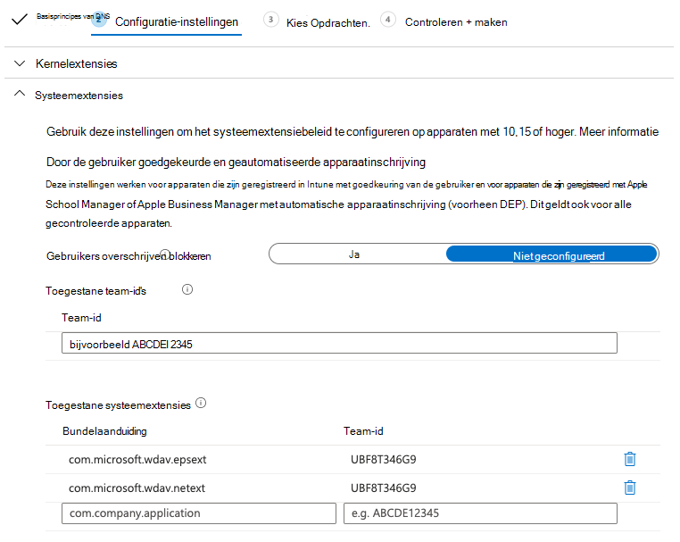

# <a name="intune-based-deployment-for-microsoft-defender-for-endpoint-on-macos"></a>Intune-implementatie voor Microsoft Defender voor Eindpunt op macOS

[!INCLUDE [Microsoft 365 Defender rebranding](../../includes/microsoft-defender.md)]

**Van toepassing op:**

- [Microsoft Defender voor Eindpunt op macOS](microsoft-defender-endpoint-mac.md)

In dit onderwerp wordt beschreven hoe u Microsoft Defender voor Eindpunt implementeert op macOS via Intune. Voor een geslaagde implementatie moet u alle volgende stappen voltooien:

1. [Het onboarding-pakket downloaden](#download-the-onboarding-package)
1. [Installatie van clientapparaat](#client-device-setup)
1. [Systeemextensies goedkeuren](#approve-system-extensions)
1. [Systeemconfiguratieprofielen maken](#create-system-configuration-profiles)
1. [Toepassing publiceren](#publish-application)

## <a name="prerequisites-and-system-requirements"></a>Vereisten en systeemvereisten

Voordat u aan de slag gaat, bekijkt u de hoofdpagina van Microsoft Defender voor Eindpunt op [macOS](microsoft-defender-endpoint-mac.md) voor een beschrijving van vereisten en systeemvereisten voor de huidige softwareversie.

## <a name="overview"></a>Overzicht

In de volgende tabel vindt u een overzicht van de stappen die u moet ondernemen om Microsoft Defender voor Eindpunt op Macs te implementeren en te beheren via Intune. Hieronder vindt u meer gedetailleerde stappen.

| Stap | Voorbeeldbestandsnamen | BundleIdentifier |
|-|-|-|
| [Het onboarding-pakket downloaden](#download-the-onboarding-package) | WindowsDefenderATPOnboarding__MDATP_wdav.atp.xml | com.microsoft.wdav.atp |
| [Systeemextensie goedkeuren voor Microsoft Defender voor Eindpunt](#approve-system-extensions) | MDATP_SysExt.xml | N.v.t. |
| [Kernel-extensie goedkeuren voor Microsoft Defender voor Eindpunt](#download-the-onboarding-package) | MDATP_KExt.xml | N.v.t. |
| [Volledige schijftoegang verlenen aan Microsoft Defender voor Eindpunt](#full-disk-access) | MDATP_tcc_Catalina_or_newer.xml | com.microsoft.wdav.tcc |
| [Netwerkextensiebeleid](#network-filter) | MDATP_NetExt.xml | N.v.t. |
| [Microsoft AutoUpdate configureren (MAU)](mac-updates.md#intune) | MDATP_Microsoft_AutoUpdate.xml | com.microsoft.autoupdate2 |
| [Configuratie-instellingen voor Microsoft Defender voor eindpunt](mac-preferences.md#intune-profile-1)<br/><br/> **Opmerking:** Als u van plan bent een AV van derden voor macOS uit te voeren, stelt u dit `passiveMode` in op `true` . | MDATP_WDAV_and_exclusion_settings_Preferences.xml | com.microsoft.wdav |
| [Microsoft Defender configureren voor endpoint- en MS AutoUpdate-meldingen (MAU)](mac-updates.md) | MDATP_MDAV_Tray_and_AutoUpdate2.mobileconfig | com.microsoft.autoupdate2 of com.microsoft.wdav.tray |


## <a name="download-the-onboarding-package"></a>Het onboarding-pakket downloaden

Download de onboarding-pakketten van Microsoft Defender-beveiligingscentrum:

1. Ga Microsoft Defender-beveiligingscentrum naar Instellingen   >  **Onboarding voor**  >  **apparaatbeheer.**

2. Stel het besturingssysteem in **op macOS** en de implementatiemethode op **Mobile Device Management /Microsoft Intune.**

    

3. Selecteer **Onboarding-pakket downloaden.** Sla deze op als _WindowsDefenderATPOnboardingPackage.zip_ in dezelfde adreslijst.

4. Haal de inhoud van het .zip op:

    ```bash
    unzip WindowsDefenderATPOnboardingPackage.zip
    ```
    ```Output
    Archive:  WindowsDefenderATPOnboardingPackage.zip
    warning:  WindowsDefenderATPOnboardingPackage.zip appears to use backslashes as path separators
      inflating: intune/kext.xml
      inflating: intune/WindowsDefenderATPOnboarding.xml
      inflating: jamf/WindowsDefenderATPOnboarding.plist
    ```

## <a name="create-system-configuration-profiles"></a>Systeemconfiguratieprofielen maken

De volgende stap is het maken van systeemconfiguratieprofielen die microsoft Defender voor Eindpunt nodig heeft.
Open in [Microsoft Endpoint Manager-beheercentrum](https://endpoint.microsoft.com/)de **profielen**  >  **Apparatenconfiguratie.**

### <a name="onboarding-blob"></a>Onboarding blob

Dit profiel bevat een licentiegegevens voor Microsoft Defender voor Eindpunt, zonder dat het rapport meldt dat het niet is gelicentieerd.

1. Selecteer **Profiel maken** onder **Configuratieprofielen.**
1. Selecteer **Platform** = **macOS**, **Profieltype** = **Sjablonen**. **Naam van sjabloon** = **Aangepast**. Klik op **Maken**.

    > [!div class="mx-imgBorder"]
    > 

1. Kies een naam voor het profiel, bijvoorbeeld 'MDE onboarding for macOS'. Klik op **Volgende**.

    > [!div class="mx-imgBorder"]
    > 

1. Kies een naam voor de naam van het configuratieprofiel, bijvoorbeeld 'MDE onboarding for macOS'.
1. Selecteer intune/WindowsDefenderATPOnboarding.xml die u hebt geëxtraheerd uit het onboarding-pakket hierboven als configuratieprofielbestand.

    > [!div class="mx-imgBorder"]
    > 

1. Klik op **Volgende**.
1. Wijs apparaten toe op **het tabblad** Toewijzing. Klik op **Volgende**.

    > [!div class="mx-imgBorder"]
    > 

1. Controleren en **maken.**
1. Open   >  **Apparaatconfiguratieprofielen,** u kunt uw gemaakte profiel daar zien.

    > [!div class="mx-imgBorder"]
    > 

### <a name="approve-system-extensions"></a>Systeemextensies goedkeuren

Dit profiel is nodig voor macOS 10.15 (Catalina) of hoger. Deze wordt genegeerd op oudere macOS.

1. Selecteer **Profiel maken** onder **Configuratieprofielen.**
1. Selecteer **Platform** = **macOS**, **Profieltype** = **Sjablonen**. **Naam van sjabloon** = **Extensies**. Klik op **Maken**.
1. Geef op **het** tabblad Basisbeginselen een naam op voor dit nieuwe profiel.
1. Vouw op **het tabblad Configuratie-instellingen** **systeemextensies** uit om de volgende vermeldingen toe te voegen in **de sectie Toegestane systeemextensies:**

    Bundelaanduiding         | Team-id
    --------------------------|----------------
    com.microsoft.wdav.epsext | UBF8T346G9
    com.microsoft.wdav.netext | UBF8T346G9

    > [!div class="mx-imgBorder"]
    > 

1. Wijs **dit profiel op het** tabblad Opdrachten toe aan alle gebruikers & alle **apparaten.**
1. Controleer en maak dit configuratieprofiel.

### <a name="kernel-extensions"></a>Kernelextensies

Dit profiel is nodig voor macOS 10.15 (Catalina) of ouder. Deze wordt genegeerd op nieuwere macOS.

> [!CAUTION]
> Apple Silicon (M1) apparaten bieden geen ondersteuning voor KEXT. De installatie van een configuratieprofiel met KEXT-beleid mislukt op deze apparaten.

1. Selecteer **Profiel maken** onder **Configuratieprofielen.**
1. Selecteer **Platform** = **macOS**, **Profieltype** = **Sjablonen**. **Naam van sjabloon** = **Extensies**. Klik op **Maken**.
1. Geef op **het** tabblad Basisbeginselen een naam op voor dit nieuwe profiel.
1. Vouw op **het tabblad Configuratie-instellingen** **kernelextensies uit.**
1. Stel **Team-id in** **op UBF8T346G9** en klik op **Volgende**.

    > [!div class="mx-imgBorder"]
    > 

1. Wijs **dit profiel op het** tabblad Opdrachten toe aan alle gebruikers & alle **apparaten.**
1. Controleer en maak dit configuratieprofiel.

### <a name="full-disk-access"></a>Volledige schijftoegang

   > [!CAUTION]
   > macOS 10.15 (Catalina) bevat nieuwe beveiligings- en privacyverbeteringen. Vanaf deze versie hebben toepassingen standaard geen toegang tot bepaalde locaties op schijf (zoals Documenten, Downloads, Bureaublad, enzovoort) zonder expliciete toestemming. Bij afwezigheid van deze toestemming kan Microsoft Defender voor Eindpunt uw apparaat niet volledig beveiligen.
   >
   > Dit configuratieprofiel verleent Volledige schijftoegang aan Microsoft Defender voor Eindpunt. Als u Eerder Microsoft Defender voor Eindpunt hebt geconfigureerd via Intune, raden we u aan de implementatie bij te werken met dit configuratieprofiel.

Download [**fulldisk.mobileconfig vanuit**](https://raw.githubusercontent.com/microsoft/mdatp-xplat/master/macos/mobileconfig/profiles/fulldisk.mobileconfig) [onze GitHub repository.](https://github.com/microsoft/mdatp-xplat/tree/master/macos/mobileconfig/profiles)

Volg de instructies voor [Onboarding blob](#onboarding-blob) van bovenaf, gebruik 'MDE Full Disk Access' als profielnaam en **downloadde fulldisk.mobileconfig** als configuratieprofielnaam.

### <a name="network-filter"></a>Netwerkfilter

Als onderdeel van de mogelijkheden voor endpointdetectie en -antwoord controleert Microsoft Defender voor Eindpunt op macOS het socketverkeer en rapporteert deze informatie aan de Microsoft Defender-beveiligingscentrum portal. Met het volgende beleid kan de netwerkextensie deze functionaliteit uitvoeren.

Download [**netfilter.mobileconfig**](https://raw.githubusercontent.com/microsoft/mdatp-xplat/master/macos/mobileconfig/profiles/netfilter.mobileconfig) vanuit [onze GitHub repository.](https://github.com/microsoft/mdatp-xplat/tree/master/macos/mobileconfig/profiles)

Volg de instructies voor [Onboarding blob](#onboarding-blob) van bovenaf, gebruik 'MDE Network Filter' als profielnaam en **downloadde netfilter.mobileconfig** als configuratieprofielnaam.

### <a name="notifications"></a>Meldingen

Dit profiel wordt gebruikt om microsoft Defender voor Eindpunt op macOS en Microsoft Auto Update toe te staan meldingen weer te geven in de gebruikersinterface op macOS 10.15 (Catalina) of hoger.

Download [**notif.mobileconfig van**](https://raw.githubusercontent.com/microsoft/mdatp-xplat/master/macos/mobileconfig/profiles/notif.mobileconfig) [onze GitHub repository.](https://github.com/microsoft/mdatp-xplat/tree/master/macos/mobileconfig/profiles)

Volg de instructies voor [Onboarding blob](#onboarding-blob) van bovenaf, gebruik 'MDE-meldingen' als profielnaam en downloadde **notif.mobileconfig** als configuratieprofielnaam.

### <a name="view-status"></a>Status weergeven

Wanneer de wijzigingen in Intune zijn doorgevoerd naar de geregistreerde apparaten, kunt u deze weergeven onder  >  **Apparaatstatus controleren:**

> [!div class="mx-imgBorder"]
> 

## <a name="publish-application"></a>Toepassing publiceren

Met deze stap kunt u Microsoft Defender voor Eindpunt implementeren op geregistreerde machines.

1. Open apps Microsoft Endpoint Manager het **beheercentrum.** [](https://endpoint.microsoft.com/)

    > [!div class="mx-imgBorder"]
    > 

1. Selecteer Per platform > macOS > Toevoegen.
1. Kies **App type** = **macOS**, klik op **Selecteren**.

    > [!div class="mx-imgBorder"]
    > 

1. Bewaar standaardwaarden en klik op **Volgende.**

    > [!div class="mx-imgBorder"]
    > 

1. Voeg opdrachten toe en klik op **Volgende.**

    > [!div class="mx-imgBorder"]
    > 

1. Controleren en **maken.**
1. U kunt naar **Apps**  >  **per platform**  >  **macOS gaan** om deze te bekijken in de lijst met alle toepassingen.

    > [!div class="mx-imgBorder"]
    > 

(U vindt gedetailleerde informatie op de [pagina van De Intune voor Defender-implementatie](/mem/intune/apps/apps-advanced-threat-protection-macos).)

   > [!CAUTION]
   > U moet alle vereiste configuratieprofielen maken en deze naar alle machines pushen, zoals hierboven wordt uitgelegd.

## <a name="client-device-setup"></a>Installatie van clientapparaat

U hebt geen speciale inrichting nodig voor een Mac-apparaat buiten een [standaardinstallatie Bedrijfsportal installeren.](/intune-user-help/enroll-your-device-in-intune-macos-cp)

1. Bevestig apparaatbeheer.

    > [!div class="mx-imgBorder"]
    > 

    Selecteer **Systeemvoorkeuren** openen, zoek **Managementprofiel** in de lijst en selecteer **Goedkeuren...**. Uw managementprofiel wordt weergegeven als **Geverifieerd:**

    

2. Selecteer **Doorgaan** en voltooi de inschrijving.

   U kunt nu meer apparaten registreren. U kunt ze later ook registreren, nadat u klaar bent met het inrichten van systeemconfiguraties en toepassingspakketten.

3. Open in Intune **Apparaten**  >  **beheren alle**  >  **apparaten**. Hier ziet u uw apparaat tussen de weergegeven apparaten:

   > [!div class="mx-imgBorder"]
   > 

## <a name="verify-client-device-state"></a>Status van clientapparaat controleren

1. Nadat de configuratieprofielen op uw apparaten zijn geïmplementeerd, opent u Systeemvoorkeurenprofielen  >   op uw Mac-apparaat.

    > [!div class="mx-imgBorder"]
    > 

    

2. Controleer of de volgende configuratieprofielen aanwezig en geïnstalleerd zijn. Het **managementprofiel** moet het Intune-systeemprofiel zijn. _Wdav-config_ en _wdav-kext_ zijn systeemconfiguratieprofielen die zijn toegevoegd in Intune:

    

3. U ziet ook het pictogram Microsoft Defender voor eindpunt in de rechterbovenhoek:

    > [!div class="mx-imgBorder"]
    > 

## <a name="troubleshooting"></a>Problemen oplossen

Probleem: Er is geen licentie gevonden.

Oplossing: Volg de bovenstaande stappen om een apparaatprofiel te maken met WindowsDefenderATPOnboarding.xml.

## <a name="logging-installation-issues"></a>Installatieproblemen met logboekregistratie

Zie Installatieproblemen bij logboekregistratie voor meer informatie over het vinden van het automatisch gegenereerde logboek dat door het installatieprogramma is gemaakt wanneer er een fout [optreedt.](mac-resources.md#logging-installation-issues)

## <a name="uninstallation"></a>Verwijderen

Zie [Verwijderen voor](mac-resources.md#uninstalling) meer informatie over het verwijderen van Microsoft Defender voor Eindpunt op macOS van clientapparaten.
