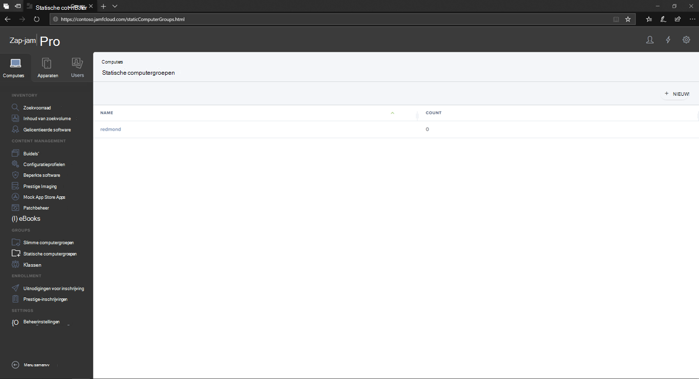
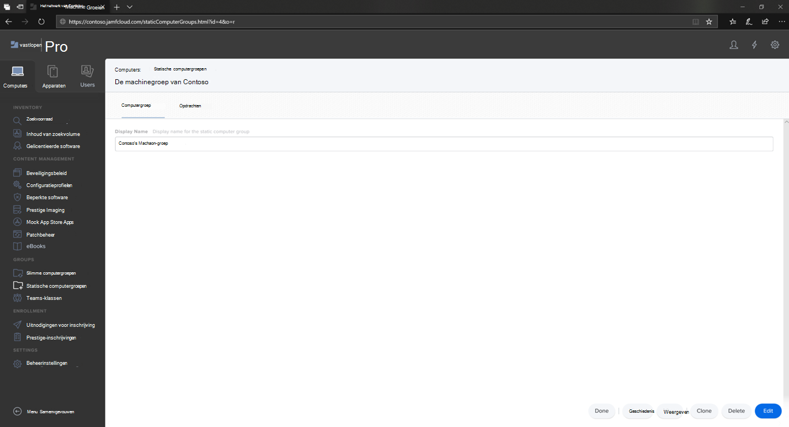
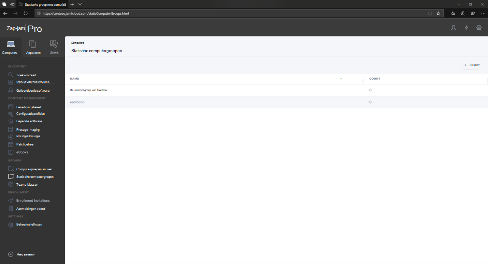

# Microsoft Defender voor Eindpunt instellen voor macOS-apparaatgroepen in Jamf ProSet up Microsoft Defender for Endpoint on macOS device groups in Jamf Pro

[!INCLUDE [Microsoft 365 Defender rebranding](../../includes/microsoft-defender.md)]

**Van toepassing op:****Applies to:**
- [Microsoft Defender voor EindpuntMicrosoft Defender for Endpoint](https://go.microsoft.com/fwlink/p/?linkid=2154037)
- [Microsoft 365 DefenderMicrosoft 365 Defender](https://go.microsoft.com/fwlink/?linkid=2118804)

> Wilt u Defender voor Eindpunt ervaren?Want to experience Defender for Endpoint? [Meld u aan voor een gratis proefabonnement.Sign up for a free trial.](https://www.microsoft.com/microsoft-365/windows/microsoft-defender-atp?ocid=docs-wdatp-investigateip-abovefoldlink)

Stel de apparaatgroepen in die lijken op OUs (Group policy organizational unite), Microsoft Endpoint Configuration Manager de apparaatverzameling van Microsoft Endpoint Configuration Manager en de apparaatgroepen van Intune.Set up the device groups similar to Group policy  organizational unite (OUs), Microsoft Endpoint Configuration Manager's device collection, and Intune's device groups.

1. **Navigeer naar statische computergroepen.**Navigate to **Static Computer Groups**.

2. Selecteer **Nieuw.**Select **New**. 

    

3. Geef een weergavenaam op en selecteer **Opslaan.**Provide a display name and select **Save**.

    

4. Nu ziet u de **contoso-machinegroep** onder **Statische computergroepen.**Now you will see the **Contoso's Machine Group** under **Static Computer Groups**.

    

## Volgende stapNext step
- [Microsoft Defender voor Eindpunt instellen voor macOS-beleid in Jamf ProSet up Microsoft Defender for Endpoint on macOS policies in Jamf Pro](mac-jamfpro-policies.md)
