# Microsoft Defender voor eindpunt op macOS-apparaten registreren bij Jamf ProEnroll Microsoft Defender for Endpoint on macOS devices into Jamf Pro 

[!INCLUDE [Microsoft 365 Defender rebranding](../../includes/microsoft-defender.md)]

**Van toepassing op:****Applies to:**
- [Microsoft Defender voor EindpuntMicrosoft Defender for Endpoint](https://go.microsoft.com/fwlink/p/?linkid=2154037)
- [Microsoft 365 DefenderMicrosoft 365 Defender](https://go.microsoft.com/fwlink/?linkid=2118804)

> Wilt u Defender voor Eindpunt ervaren?Want to experience Defender for Endpoint? [Meld u aan voor een gratis proefabonnement.Sign up for a free trial.](https://www.microsoft.com/microsoft-365/windows/microsoft-defender-atp?ocid=docs-wdatp-investigateip-abovefoldlink)

## MacOS-apparaten registrerenEnroll macOS devices

Er zijn meerdere methoden om u te laten inschrijven bij JamF.There are multiple methods of getting enrolled to JamF.

In dit artikel worden twee methoden beschreven:This article will guide you on two methods:

- [Methode 1: Uitnodigingen voor inschrijvingMethod 1:  Enrollment Invitations](#enrollment-method-1-enrollment-invitations)
- [Methode 2: Inschrijving voorafMethod 2:  Prestage Enrollments](#enrollment-method-2-prestage-enrollments)

Zie Over [computerinschrijving](https://docs.jamf.com/9.9/casper-suite/administrator-guide/About_Computer_Enrollment.html)voor een volledige lijst.For a complete list, see [About Computer Enrollment](https://docs.jamf.com/9.9/casper-suite/administrator-guide/About_Computer_Enrollment.html).

## Inschrijvingsmethode 1: Uitnodigingen voor inschrijvingEnrollment Method 1: Enrollment Invitations

1. Navigeer in het dashboard Van Jamf Pro naar **Uitnodigingen voor inschrijving.**In the Jamf Pro dashboard, navigate to **Enrollment invitations**.

    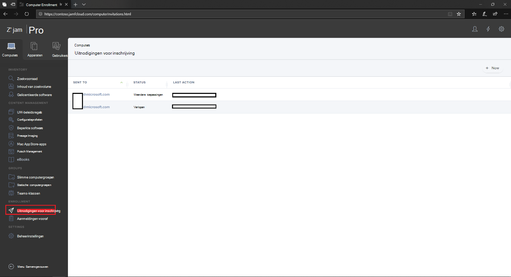

2. Selecteer **+ Nieuw**.Select **+ New**.

    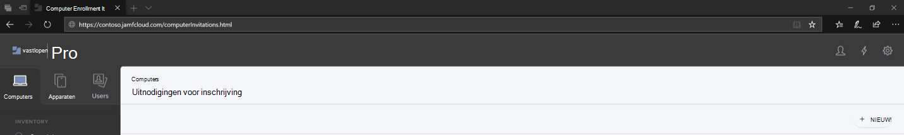

3. Voer **in Geadresseerden opgeven voor** de > onder **E-mailadressen** het e-mailadres(es) van de geadresseerden in.In **Specify Recipients for the Invitation** > under **Email Addresses** enter the e-mail address(es) of the recipients.

    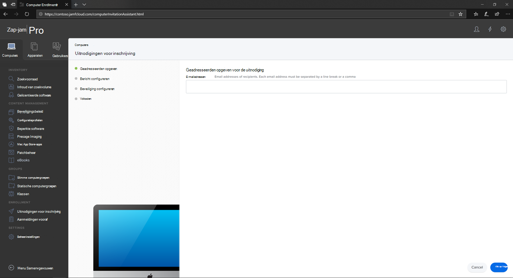

    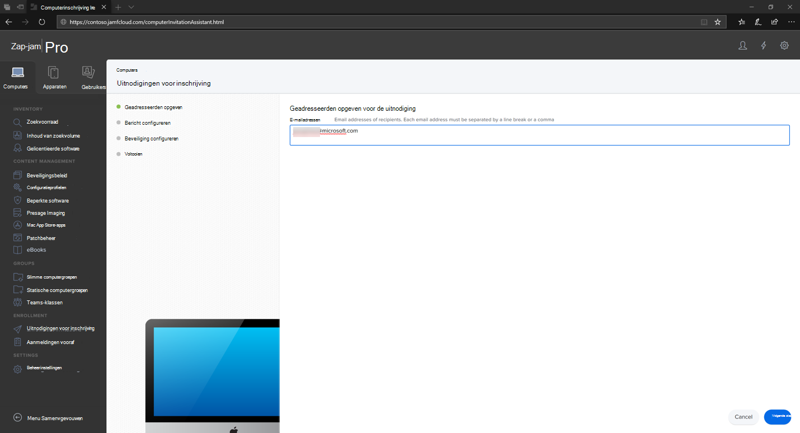

    Bijvoorbeeld: janedoe@contoso.comFor example: janedoe@contoso.com

    

4. Configureer het bericht voor de uitnodiging.Configure the message for the invitation.

    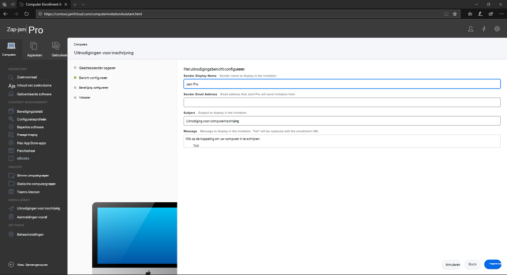

    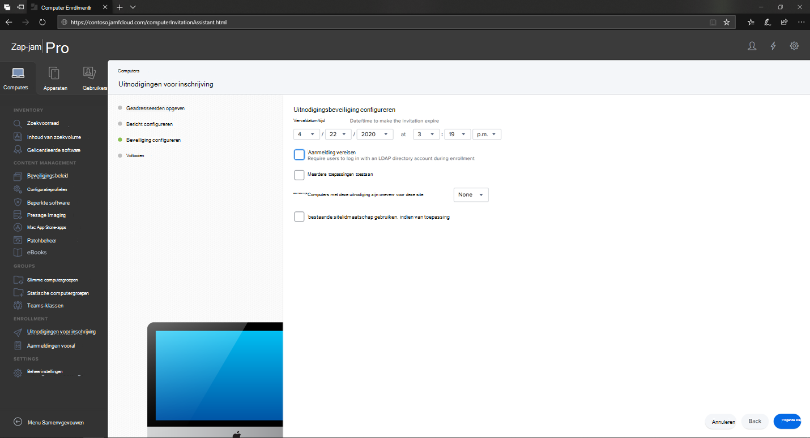

    

    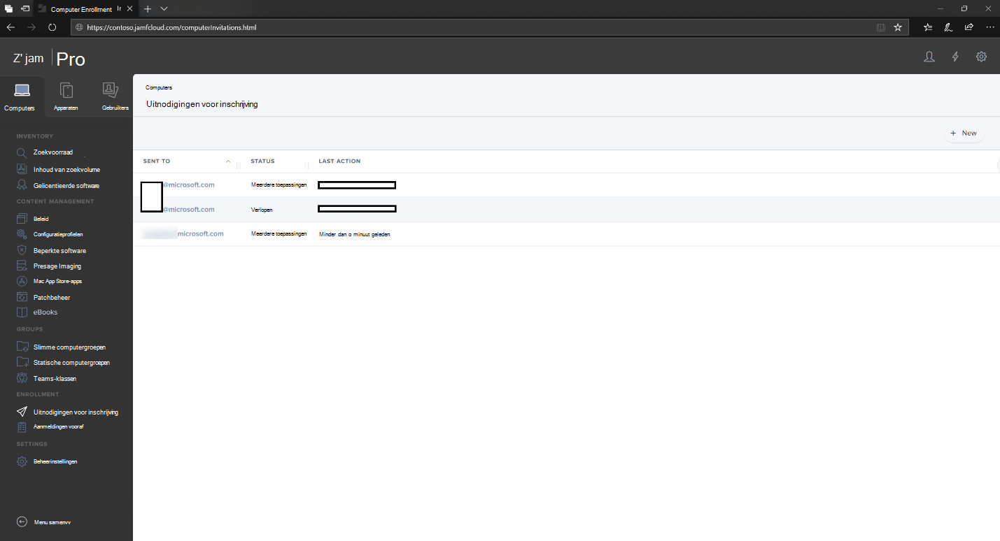

## Inschrijvingsmethode 2: Inschrijving voorafEnrollment Method 2: Prestage Enrollments

1. Navigeer in het Dashboard van Jamf Pro naar **Inschrijvingen vooraf.**In the Jamf Pro dashboard, navigate to **Prestage enrollments**.

    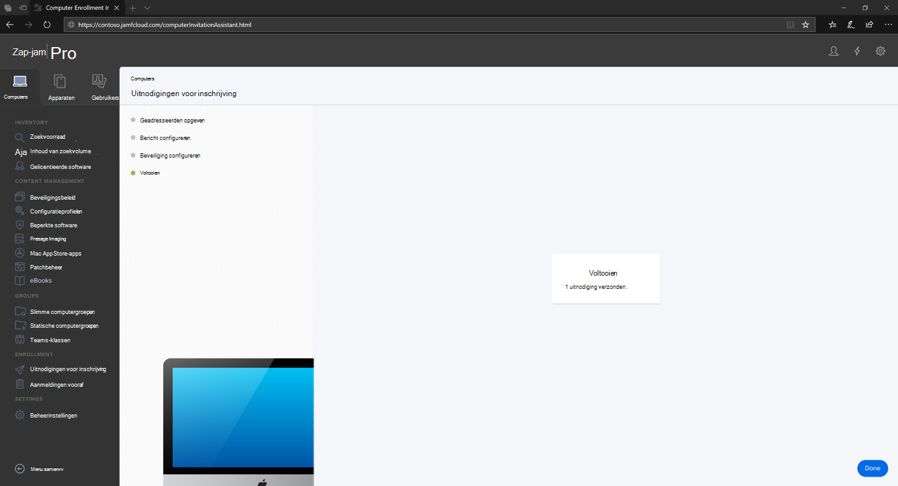

2. Volg de instructies in [Computer PreStage Enrollments](https://docs.jamf.com/9.9/casper-suite/administrator-guide/Computer_PreStage_Enrollments.html).Follow the instructions in [Computer PreStage Enrollments](https://docs.jamf.com/9.9/casper-suite/administrator-guide/Computer_PreStage_Enrollments.html).

## MacOS-apparaat registrerenEnroll macOS device

1. Selecteer **Doorgaan** en installeer het CA-certificaat in een **venster Systeemvoorkeuren.**Select **Continue** and install the CA certificate from a **System Preferences** window.

    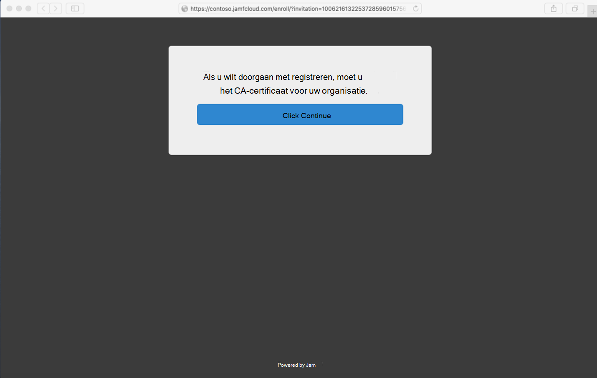

2. Nadat het CA-certificaat is geïnstalleerd, gaat u terug naar het browservenster en **selecteert u Doorgaan** en installeert u het MDM-profiel.Once CA certificate is installed, return to the browser window and select **Continue** and install the MDM profile. 

    

3. Selecteer **Toestaan** om te downloaden van JAMF.Select **Allow** to downloads from JAMF.

    

4. Selecteer **Doorgaan om** door te gaan met de installatie van het MDM-profiel.Select **Continue** to proceed with the MDM Profile installation. 

    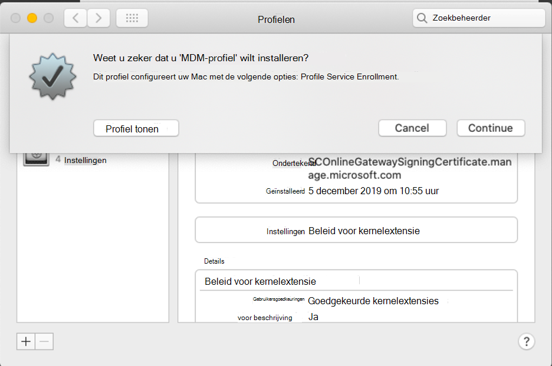

5. Selecteer **Doorgaan** om het MDM-profiel te installeren.Select **Continue** to install the MDM Profile.

    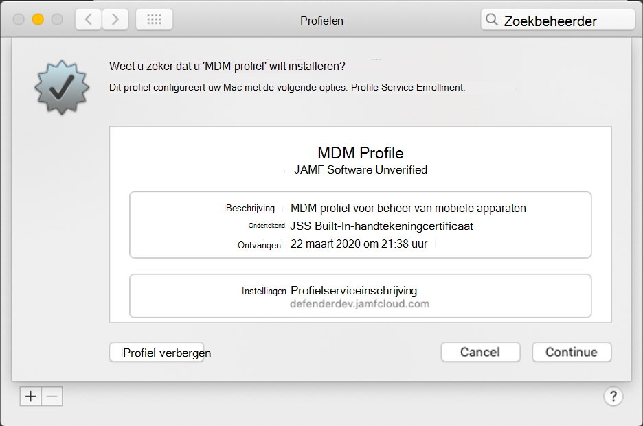

6. Selecteer **Doorgaan**  om de configuratie te voltooien.Select **Continue**  to complete the configuration. 

    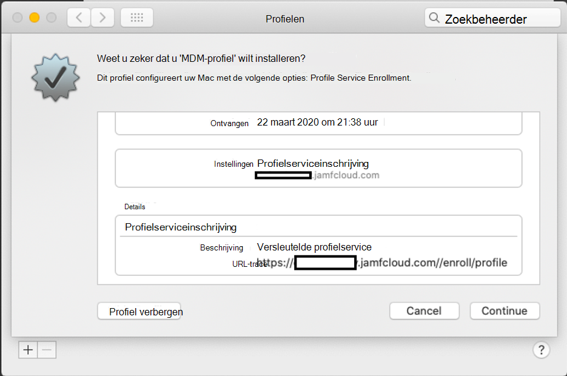
