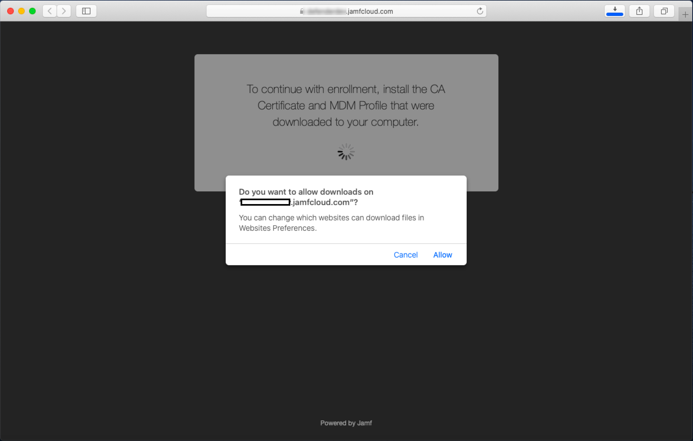

# Microsoft Defender voor eindpunt voor macOS-apparaten registreren bij Jamf Pro 

[!INCLUDE [Microsoft 365 Defender rebranding](../../includes/microsoft-defender.md)]

**Van toepassing op:**
- [Microsoft Defender voor Endpoint](https://go.microsoft.com/fwlink/p/?linkid=2146631)
- [Microsoft 365 Defender](https://go.microsoft.com/fwlink/?linkid=2118804)

> Wilt u Defender voor Eindpunt ervaren? [Meld u aan voor een gratis proefabonnement.](https://www.microsoft.com/microsoft-365/windows/microsoft-defender-atp?ocid=docs-wdatp-investigateip-abovefoldlink)

## MacOS-apparaten registreren

Er zijn meerdere methoden om u te laten inschrijven bij JamF.

In dit artikel worden twee methoden beschreven:

- [Methode 1: Uitnodigingen voor inschrijving](#enrollment-method-1-enrollment-invitations)
- [Methode 2: Inschrijving vooraf](#enrollment-method-2-prestage-enrollments)

Zie Over [computerinschrijving](https://docs.jamf.com/9.9/casper-suite/administrator-guide/About_Computer_Enrollment.html)voor een volledige lijst.

## Inschrijvingsmethode 1: Uitnodigingen voor inschrijving

1. Navigeer in het dashboard Van Jamf Pro naar **Uitnodigingen voor inschrijving.**

    

2. Selecteer **+ Nieuw**.

    

3. Voer **in Geadresseerden opgeven voor** de > onder **E-mailadressen** het e-mailadres(es) van de geadresseerden in.

    

    

    Bijvoorbeeld: janedoe@contoso.com

    

4. Configureer het bericht voor de uitnodiging.

    

    

    

    

## Inschrijvingsmethode 2: Inschrijving vooraf

1. Navigeer in het Dashboard van Jamf Pro naar **Inschrijvingen vooraf.**

    

2. Volg de instructies in [Computer PreStage Enrollments](https://docs.jamf.com/9.9/casper-suite/administrator-guide/Computer_PreStage_Enrollments.html).

## MacOS-apparaat registreren

1. Selecteer **Doorgaan** en installeer het CA-certificaat in een **venster Systeemvoorkeuren.**

    

2. Nadat het CA-certificaat is geïnstalleerd, gaat u terug naar het browservenster en **selecteert u Doorgaan** en installeert u het MDM-profiel. 

    

3. Selecteer **Toestaan** om te downloaden van JAMF.

    

4. Selecteer **Doorgaan om** door te gaan met de installatie van het MDM-profiel. 

    

5. Selecteer **Doorgaan** om het MDM-profiel te installeren.

    

6. Selecteer **Doorgaan**  om de configuratie te voltooien. 

    
