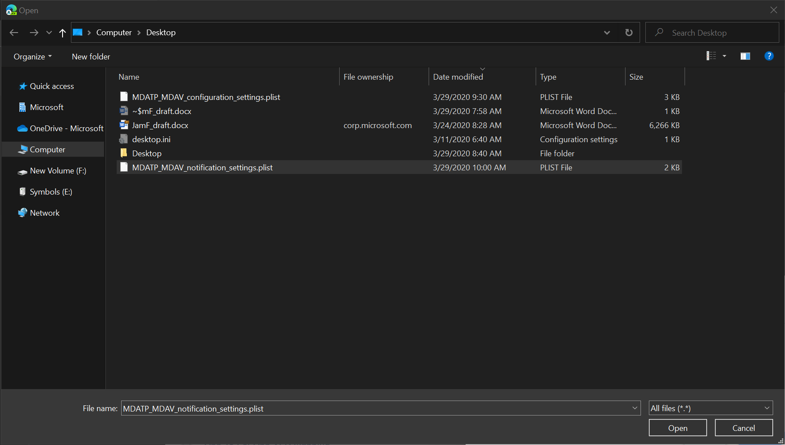
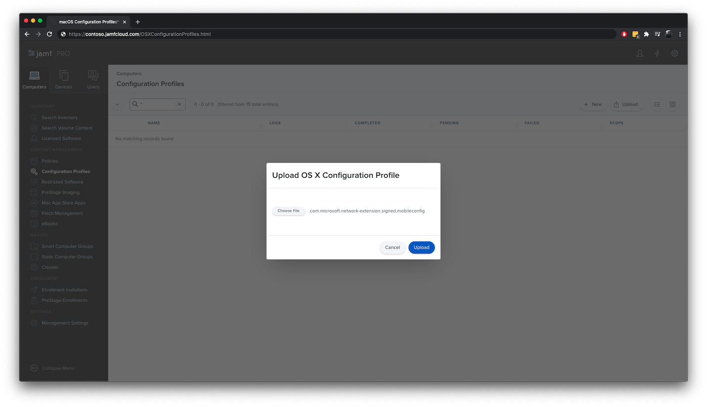

# <a name="set-up-the-microsoft-defender-for-endpoint-for-macos-policies-in-jamf-pro"></a><span data-ttu-id="cc068-104">Microsoft Defender voor eindpunt instellen voor macOS-beleid in Jamf Pro</span><span class="sxs-lookup"><span data-stu-id="cc068-104">Set up the Microsoft Defender for Endpoint for macOS policies in Jamf Pro</span></span>

[!INCLUDE [Microsoft 365 Defender rebranding](../../includes/microsoft-defender.md)]


<span data-ttu-id="cc068-105">**Van toepassing op:**</span><span class="sxs-lookup"><span data-stu-id="cc068-105">**Applies to:**</span></span>

- [<span data-ttu-id="cc068-106">Defender voor Eindpunt voor Mac</span><span class="sxs-lookup"><span data-stu-id="cc068-106">Defender for Endpoint for Mac</span></span>](microsoft-defender-endpoint-mac.md)

<span data-ttu-id="cc068-107">Deze pagina begeleidt u bij de stappen die u moet ondernemen om macOS-beleid in Te stellen in Jamf Pro.</span><span class="sxs-lookup"><span data-stu-id="cc068-107">This page will guide you through the steps you need to take to set up macOS policies in Jamf Pro.</span></span>

<span data-ttu-id="cc068-108">U moet de volgende stappen ondernemen:</span><span class="sxs-lookup"><span data-stu-id="cc068-108">You'll need to take the following steps:</span></span>

1. [<span data-ttu-id="cc068-109">Het Onboarding-pakket voor Microsoft Defender voor eindpunten kopen</span><span class="sxs-lookup"><span data-stu-id="cc068-109">Get the Microsoft Defender for Endpoint onboarding package</span></span>](#step-1-get-the-microsoft-defender-for-endpoint-onboarding-package)

2. [<span data-ttu-id="cc068-110">Een configuratieprofiel maken in Jamf Pro met behulp van het onboarding-pakket</span><span class="sxs-lookup"><span data-stu-id="cc068-110">Create a configuration profile in Jamf Pro using the onboarding package</span></span>](#step-2-create-a-configuration-profile-in-jamf-pro-using-the-onboarding-package)

3. [<span data-ttu-id="cc068-111">Microsoft Defender configureren voor eindpuntinstellingen</span><span class="sxs-lookup"><span data-stu-id="cc068-111">Configure Microsoft Defender for Endpoint settings</span></span>](#step-3-configure-microsoft-defender-for-endpoint-settings)

4. [<span data-ttu-id="cc068-112">Instellingen voor meldingen van Microsoft Defender voor eindpunt configureren</span><span class="sxs-lookup"><span data-stu-id="cc068-112">Configure Microsoft Defender for Endpoint notification settings</span></span>](#step-4-configure-notifications-settings)

5. [<span data-ttu-id="cc068-113">Microsoft AutoUpdate configureren (MAU)</span><span class="sxs-lookup"><span data-stu-id="cc068-113">Configure Microsoft AutoUpdate (MAU)</span></span>](#step-5-configure-microsoft-autoupdate-mau)

6. [<span data-ttu-id="cc068-114">Volledige schijftoegang verlenen aan Microsoft Defender voor Eindpunt</span><span class="sxs-lookup"><span data-stu-id="cc068-114">Grant full disk access to Microsoft Defender for Endpoint</span></span>](#step-6-grant-full-disk-access-to-microsoft-defender-for-endpoint)

7. [<span data-ttu-id="cc068-115">Kernel-extensie goedkeuren voor Microsoft Defender voor Eindpunt</span><span class="sxs-lookup"><span data-stu-id="cc068-115">Approve Kernel extension for Microsoft Defender for Endpoint</span></span>](#step-7-approve-kernel-extension-for-microsoft-defender-for-endpoint)

8. [<span data-ttu-id="cc068-116">Systeemextensies goedkeuren voor Microsoft Defender voor Eindpunt</span><span class="sxs-lookup"><span data-stu-id="cc068-116">Approve System extensions for Microsoft Defender for Endpoint</span></span>](#step-8-approve-system-extensions-for-microsoft-defender-for-endpoint)

9. [<span data-ttu-id="cc068-117">Netwerkextensie configureren</span><span class="sxs-lookup"><span data-stu-id="cc068-117">Configure Network Extension</span></span>](#step-9-configure-network-extension)

10. [<span data-ttu-id="cc068-118">Scans plannen met Microsoft Defender voor Eindpunt voor Mac</span><span class="sxs-lookup"><span data-stu-id="cc068-118">Schedule scans with Microsoft Defender for Endpoint for Mac</span></span>](https://docs.microsoft.com/windows/security/threat-protection/microsoft-defender-atp/mac-schedule-scan-atp)

11. [<span data-ttu-id="cc068-119">Microsoft Defender voor eindpunt voor macOS implementeren</span><span class="sxs-lookup"><span data-stu-id="cc068-119">Deploy Microsoft Defender for Endpoint for macOS</span></span>](#step-11-deploy-microsoft-defender-for-endpoint-for-macos)


## <a name="step-1-get-the-microsoft-defender-for-endpoint-onboarding-package"></a><span data-ttu-id="cc068-120">Stap 1: Het Onboarding-pakket voor Microsoft Defender voor eindpunten kopen</span><span class="sxs-lookup"><span data-stu-id="cc068-120">Step 1: Get the Microsoft Defender for Endpoint onboarding package</span></span>

1. <span data-ttu-id="cc068-121">Ga [in het Microsoft Defender-beveiligingscentrum](https://securitycenter.microsoft.com )naar Instellingen > **Onboarding.**</span><span class="sxs-lookup"><span data-stu-id="cc068-121">In [Microsoft Defender Security Center](https://securitycenter.microsoft.com ), navigate to **Settings > Onboarding**.</span></span> 

2. <span data-ttu-id="cc068-122">Selecteer macOS als besturingssysteem en Mobile Device Management / Microsoft Intune als implementatiemethode.</span><span class="sxs-lookup"><span data-stu-id="cc068-122">Select macOS as the operating system and Mobile Device Management / Microsoft Intune as the deployment method.</span></span>

    

3. <span data-ttu-id="cc068-124">Selecteer **Onboarding-pakket downloaden** (WindowsDefenderATPOnboardingPackage.zip).</span><span class="sxs-lookup"><span data-stu-id="cc068-124">Select **Download onboarding package** (WindowsDefenderATPOnboardingPackage.zip).</span></span>

4. <span data-ttu-id="cc068-125">Extract `WindowsDefenderATPOnboardingPackage.zip` .</span><span class="sxs-lookup"><span data-stu-id="cc068-125">Extract `WindowsDefenderATPOnboardingPackage.zip`.</span></span>

5. <span data-ttu-id="cc068-126">Kopieer het bestand naar de gewenste locatie.</span><span class="sxs-lookup"><span data-stu-id="cc068-126">Copy the file to your preferred location.</span></span> <span data-ttu-id="cc068-127">Bijvoorbeeld. `C:\Users\JaneDoe_or_JohnDoe.contoso\Downloads\WindowsDefenderATPOnboardingPackage_macOS_MDM_contoso\jamf\WindowsDefenderATPOnboarding.plist`</span><span class="sxs-lookup"><span data-stu-id="cc068-127">For example,  `C:\Users\JaneDoe_or_JohnDoe.contoso\Downloads\WindowsDefenderATPOnboardingPackage_macOS_MDM_contoso\jamf\WindowsDefenderATPOnboarding.plist`.</span></span>


## <a name="step-2-create-a-configuration-profile-in-jamf-pro-using-the-onboarding-package"></a><span data-ttu-id="cc068-128">Stap 2: Een configuratieprofiel maken in Jamf Pro met behulp van het onboarding-pakket</span><span class="sxs-lookup"><span data-stu-id="cc068-128">Step 2: Create a configuration profile in Jamf Pro using the onboarding package</span></span>

1. <span data-ttu-id="cc068-129">Zoek het bestand `WindowsDefenderATPOnboarding.plist` in de vorige sectie.</span><span class="sxs-lookup"><span data-stu-id="cc068-129">Locate the file `WindowsDefenderATPOnboarding.plist` from the previous section.</span></span>

   

 
2. <span data-ttu-id="cc068-131">Selecteer nieuw in het dashboard van Jamf **Pro.**</span><span class="sxs-lookup"><span data-stu-id="cc068-131">In the Jamf Pro dashboard, select **New**.</span></span>

    

3. <span data-ttu-id="cc068-133">Voer de volgende details in:</span><span class="sxs-lookup"><span data-stu-id="cc068-133">Enter the following details:</span></span>

   <span data-ttu-id="cc068-134">**Algemeen**</span><span class="sxs-lookup"><span data-stu-id="cc068-134">**General**</span></span>
   - <span data-ttu-id="cc068-135">Naam: MDATP-onboarding voor macOS</span><span class="sxs-lookup"><span data-stu-id="cc068-135">Name: MDATP onboarding for macOS</span></span>
   - <span data-ttu-id="cc068-136">Beschrijving: MDATP EDR onboarding voor macOS</span><span class="sxs-lookup"><span data-stu-id="cc068-136">Description: MDATP EDR onboarding for macOS</span></span>
   - <span data-ttu-id="cc068-137">Categorie: Geen</span><span class="sxs-lookup"><span data-stu-id="cc068-137">Category: None</span></span>
   - <span data-ttu-id="cc068-138">Distributiemethode: Automatisch installeren</span><span class="sxs-lookup"><span data-stu-id="cc068-138">Distribution Method: Install Automatically</span></span>
   - <span data-ttu-id="cc068-139">Niveau: Computerniveau</span><span class="sxs-lookup"><span data-stu-id="cc068-139">Level: Computer Level</span></span>

4. <span data-ttu-id="cc068-140">Selecteer **configureren & aangepaste instellingen** in **Toepassing.**</span><span class="sxs-lookup"><span data-stu-id="cc068-140">In **Application & Custom Settings** select **Configure**.</span></span>

    

5. <span data-ttu-id="cc068-142">Selecteer **Bestand uploaden (PLIST-bestand)** en voer in **Voorkeursdomein** in: `com.microsoft.wdav.atp` .</span><span class="sxs-lookup"><span data-stu-id="cc068-142">Select **Upload File (PLIST file)** then in **Preference Domain** enter: `com.microsoft.wdav.atp`.</span></span> 

    

    

7. <span data-ttu-id="cc068-145">Selecteer **Openen** en selecteer het onboarding-bestand.</span><span class="sxs-lookup"><span data-stu-id="cc068-145">Select **Open** and select the onboarding file.</span></span>

    

8. <span data-ttu-id="cc068-147">Selecteer **Uploaden.**</span><span class="sxs-lookup"><span data-stu-id="cc068-147">Select **Upload**.</span></span> 

    


9. <span data-ttu-id="cc068-149">Selecteer het **tabblad Bereik.**</span><span class="sxs-lookup"><span data-stu-id="cc068-149">Select the **Scope** tab.</span></span>

    

10. <span data-ttu-id="cc068-151">Selecteer de doelcomputers.</span><span class="sxs-lookup"><span data-stu-id="cc068-151">Select the target computers.</span></span>

    

     

11. <span data-ttu-id="cc068-154">Kies **Opslaan**.</span><span class="sxs-lookup"><span data-stu-id="cc068-154">Select **Save**.</span></span>

    

    

12. <span data-ttu-id="cc068-157">Selecteer **Gereed**.</span><span class="sxs-lookup"><span data-stu-id="cc068-157">Select **Done**.</span></span>

    

    

## <a name="step-3-configure-microsoft-defender-for-endpoint-settings"></a><span data-ttu-id="cc068-160">Stap 3: Microsoft Defender configureren voor eindpuntinstellingen</span><span class="sxs-lookup"><span data-stu-id="cc068-160">Step 3: Configure Microsoft Defender for Endpoint settings</span></span>

1.  <span data-ttu-id="cc068-161">Gebruik de volgende configuratie-instellingen voor Microsoft Defender voor Eindpunt:</span><span class="sxs-lookup"><span data-stu-id="cc068-161">Use the following Microsoft Defender for Endpoint configuration settings:</span></span>

    - <span data-ttu-id="cc068-162">enableRealTimeProtection</span><span class="sxs-lookup"><span data-stu-id="cc068-162">enableRealTimeProtection</span></span>
    - <span data-ttu-id="cc068-163">passiveMode</span><span class="sxs-lookup"><span data-stu-id="cc068-163">passiveMode</span></span>
    
    >[!NOTE]
    ><span data-ttu-id="cc068-164">Als u van plan bent een AV van derden voor macOS uit te voeren, is deze standaard niet `true` ingeschakeld.</span><span class="sxs-lookup"><span data-stu-id="cc068-164">Not turned on by default, if you are planning to run a third-party AV for macOS, set it to `true`.</span></span>

    - <span data-ttu-id="cc068-165">uitsluitingen</span><span class="sxs-lookup"><span data-stu-id="cc068-165">exclusions</span></span>
    - <span data-ttu-id="cc068-166">excludedPath</span><span class="sxs-lookup"><span data-stu-id="cc068-166">excludedPath</span></span>
    - <span data-ttu-id="cc068-167">uitgeslotenFileExtension</span><span class="sxs-lookup"><span data-stu-id="cc068-167">excludedFileExtension</span></span>
    - <span data-ttu-id="cc068-168">uitgeslotenFileName</span><span class="sxs-lookup"><span data-stu-id="cc068-168">excludedFileName</span></span>
    - <span data-ttu-id="cc068-169">uitsluitingenMergePolicy</span><span class="sxs-lookup"><span data-stu-id="cc068-169">exclusionsMergePolicy</span></span>
    - <span data-ttu-id="cc068-170">toegestaanThreats</span><span class="sxs-lookup"><span data-stu-id="cc068-170">allowedThreats</span></span>
    
    >[!NOTE]
    ><span data-ttu-id="cc068-171">EICAR is opgenomen in het voorbeeld, als u een proof-of-concept doormaakt, verwijdert u deze vooral als u EICAR test.</span><span class="sxs-lookup"><span data-stu-id="cc068-171">EICAR is on the sample, if you are going through a proof-of-concept, remove it especially if you are testing EICAR.</span></span>
        
    - <span data-ttu-id="cc068-172">disallowedThreatActions</span><span class="sxs-lookup"><span data-stu-id="cc068-172">disallowedThreatActions</span></span>
    - <span data-ttu-id="cc068-173">potentially_unwanted_application</span><span class="sxs-lookup"><span data-stu-id="cc068-173">potentially_unwanted_application</span></span>
    - <span data-ttu-id="cc068-174">archive_bomb</span><span class="sxs-lookup"><span data-stu-id="cc068-174">archive_bomb</span></span>
    - <span data-ttu-id="cc068-175">cloudService</span><span class="sxs-lookup"><span data-stu-id="cc068-175">cloudService</span></span>
    - <span data-ttu-id="cc068-176">automaticSampleSubmission</span><span class="sxs-lookup"><span data-stu-id="cc068-176">automaticSampleSubmission</span></span>
    - <span data-ttu-id="cc068-177">tags</span><span class="sxs-lookup"><span data-stu-id="cc068-177">tags</span></span>
    - <span data-ttu-id="cc068-178">StatusMenuIcon verbergen</span><span class="sxs-lookup"><span data-stu-id="cc068-178">hideStatusMenuIcon</span></span>
    
     <span data-ttu-id="cc068-179">Zie Eigenschappenlijst voor [configuratieprofiel Van Jamf voor meer informatie.](mac-preferences.md#property-list-for-jamf-configuration-profile)</span><span class="sxs-lookup"><span data-stu-id="cc068-179">For information, see [Property list for Jamf configuration profile](mac-preferences.md#property-list-for-jamf-configuration-profile).</span></span>

     ```XML
     <?xml version="1.0" encoding="UTF-8"?>
     <!DOCTYPE plist PUBLIC "-//Apple//DTD PLIST 1.0//EN" "http://www.apple.com/DTDs/PropertyList-1.0.dtd">
     <plist version="1.0">
     <dict>
         <key>antivirusEngine</key>
         <dict>
             <key>enableRealTimeProtection</key>
             <true/>
             <key>passiveMode</key>
             <false/>
             <key>exclusions</key>
             <array>
                 <dict>
                     <key>$type</key>
                     <string>excludedPath</string>
                     <key>isDirectory</key>
                     <false/>
                     <key>path</key>
                     <string>/var/log/system.log</string>
                 </dict>
                 <dict>
                     <key>$type</key>
                     <string>excludedPath</string>
                     <key>isDirectory</key>
                     <true/>
                     <key>path</key>
                     <string>/home</string>
                 </dict>
                 <dict>
                     <key>$type</key>
                     <string>excludedFileExtension</string>
                     <key>extension</key>
                     <string>pdf</string>
                 </dict>
                 <dict>
                     <key>$type</key>
                     <string>excludedFileName</string>
                     <key>name</key>
                     <string>cat</string>
                 </dict>
             </array>
             <key>exclusionsMergePolicy</key>
             <string>merge</string>
             <key>allowedThreats</key>
             <array>
                 <string>EICAR-Test-File (not a virus)</string>
             </array>
             <key>disallowedThreatActions</key>
             <array>
                 <string>allow</string>
                 <string>restore</string>
             </array>
             <key>threatTypeSettings</key>
             <array>
                 <dict>
                     <key>key</key>
                     <string>potentially_unwanted_application</string>
                     <key>value</key>
                     <string>block</string>
                 </dict>
                 <dict>
                     <key>key</key>
                     <string>archive_bomb</string>
                     <key>value</key>
                     <string>audit</string>
                 </dict>
             </array>
             <key>threatTypeSettingsMergePolicy</key>
             <string>merge</string>
         </dict>
         <key>cloudService</key>
         <dict>
             <key>enabled</key>
             <true/>
             <key>diagnosticLevel</key>
             <string>optional</string>
             <key>automaticSampleSubmission</key>
             <true/>
         </dict>
         <key>edr</key>
         <dict>
             <key>tags</key>
             <array>
                 <dict>
                     <key>key</key>
                     <string>GROUP</string>
                     <key>value</key>
                     <string>ExampleTag</string>
                 </dict>
             </array>
         </dict>
         <key>userInterface</key>
         <dict>
             <key>hideStatusMenuIcon</key>
             <false/>
         </dict>
     </dict>
     </plist>
     ```

2. <span data-ttu-id="cc068-180">Sla het bestand op als `MDATP_MDAV_configuration_settings.plist` .</span><span class="sxs-lookup"><span data-stu-id="cc068-180">Save the file as `MDATP_MDAV_configuration_settings.plist`.</span></span>


3.  <span data-ttu-id="cc068-181">Selecteer algemeen in het dashboard van Jamf **Pro.**</span><span class="sxs-lookup"><span data-stu-id="cc068-181">In the Jamf Pro dashboard, select **General**.</span></span>

    

4. <span data-ttu-id="cc068-183">Voer de volgende details in:</span><span class="sxs-lookup"><span data-stu-id="cc068-183">Enter the following details:</span></span>

    <span data-ttu-id="cc068-184">**Algemeen**</span><span class="sxs-lookup"><span data-stu-id="cc068-184">**General**</span></span>
    
    - <span data-ttu-id="cc068-185">Naam: MDATP MDAV-configuratie-instellingen</span><span class="sxs-lookup"><span data-stu-id="cc068-185">Name: MDATP MDAV configuration settings</span></span>
    - <span data-ttu-id="cc068-186">Beschrijving:\<blank\></span><span class="sxs-lookup"><span data-stu-id="cc068-186">Description:\<blank\></span></span>
    - <span data-ttu-id="cc068-187">Categorie: Geen (standaard)</span><span class="sxs-lookup"><span data-stu-id="cc068-187">Category: None (default)</span></span>
    - <span data-ttu-id="cc068-188">Distributiemethode: Automatisch installeren(standaard)</span><span class="sxs-lookup"><span data-stu-id="cc068-188">Distribution Method: Install Automatically(default)</span></span>
    - <span data-ttu-id="cc068-189">Niveau: Computerniveau(standaard)</span><span class="sxs-lookup"><span data-stu-id="cc068-189">Level: Computer Level(default)</span></span>

    

5. <span data-ttu-id="cc068-191">Selecteer **configureren & aangepaste instellingen** in **Toepassing.**</span><span class="sxs-lookup"><span data-stu-id="cc068-191">In **Application & Custom Settings** select **Configure**.</span></span>

    

6. <span data-ttu-id="cc068-193">Selecteer **Bestand uploaden (PLIST-bestand)**.</span><span class="sxs-lookup"><span data-stu-id="cc068-193">Select **Upload File (PLIST file)**.</span></span>

    

7. <span data-ttu-id="cc068-195">Typ **in Het domein** Voorkeuren en selecteer vervolgens `com.microsoft.wdav` **PLIST-bestand uploaden.**</span><span class="sxs-lookup"><span data-stu-id="cc068-195">In **Preferences Domain**, enter `com.microsoft.wdav`, then select  **Upload PLIST File**.</span></span>

    

8. <span data-ttu-id="cc068-197">Selecteer **Bestand kiezen.**</span><span class="sxs-lookup"><span data-stu-id="cc068-197">Select **Choose File**.</span></span>

    

9. <span data-ttu-id="cc068-199">Selecteer de **MDATP_MDAV_configuration_settings.plist** en selecteer **Openen.**</span><span class="sxs-lookup"><span data-stu-id="cc068-199">Select the **MDATP_MDAV_configuration_settings.plist**, then select **Open**.</span></span>

    

10. <span data-ttu-id="cc068-201">Selecteer **Uploaden.**</span><span class="sxs-lookup"><span data-stu-id="cc068-201">Select **Upload**.</span></span>

    

    

    >[!NOTE]
    ><span data-ttu-id="cc068-204">Als u het Intune-bestand uploadt, krijgt u de volgende foutmelding:</span><span class="sxs-lookup"><span data-stu-id="cc068-204">If you happen to upload the Intune file, you'll get the following error:</span></span><br>
    ><span data-ttu-id="cc068-205"></span><span class="sxs-lookup"><span data-stu-id="cc068-205"></span></span>


11. <span data-ttu-id="cc068-206">Kies **Opslaan**.</span><span class="sxs-lookup"><span data-stu-id="cc068-206">Select **Save**.</span></span> 

    

12. <span data-ttu-id="cc068-208">Het bestand wordt geüpload.</span><span class="sxs-lookup"><span data-stu-id="cc068-208">The file is uploaded.</span></span>

    

    

13. <span data-ttu-id="cc068-211">Selecteer het **tabblad Bereik.**</span><span class="sxs-lookup"><span data-stu-id="cc068-211">Select the **Scope** tab.</span></span>

    

14. <span data-ttu-id="cc068-213">Selecteer **De machinegroep van Contoso.**</span><span class="sxs-lookup"><span data-stu-id="cc068-213">Select **Contoso's Machine Group**.</span></span> 

15. <span data-ttu-id="cc068-214">Selecteer **Toevoegen** en selecteer **opslaan.**</span><span class="sxs-lookup"><span data-stu-id="cc068-214">Select **Add**, then select **Save**.</span></span>

    

    

16. <span data-ttu-id="cc068-217">Selecteer **Gereed**.</span><span class="sxs-lookup"><span data-stu-id="cc068-217">Select **Done**.</span></span> <span data-ttu-id="cc068-218">U ziet het nieuwe **configuratieprofiel.**</span><span class="sxs-lookup"><span data-stu-id="cc068-218">You'll see the new **Configuration profile**.</span></span>

    


## <a name="step-4-configure-notifications-settings"></a><span data-ttu-id="cc068-220">Stap 4: Instellingen voor meldingen configureren</span><span class="sxs-lookup"><span data-stu-id="cc068-220">Step 4: Configure notifications settings</span></span>

<span data-ttu-id="cc068-221">Deze stappen zijn van toepassing op macOS 10.15 (Catalina) of hoger.</span><span class="sxs-lookup"><span data-stu-id="cc068-221">These steps are applicable of macOS 10.15 (Catalina) or newer.</span></span>

1. <span data-ttu-id="cc068-222">Downloaden `notif.mobileconfig` vanuit [onze GitHub-opslagplaats](https://raw.githubusercontent.com/microsoft/mdatp-xplat/master/macos/mobileconfig/profiles/notif.mobileconfig)</span><span class="sxs-lookup"><span data-stu-id="cc068-222">Download `notif.mobileconfig` from [our GitHub repository](https://raw.githubusercontent.com/microsoft/mdatp-xplat/master/macos/mobileconfig/profiles/notif.mobileconfig)</span></span>

2. <span data-ttu-id="cc068-223">Sla het op als `MDATP_MDAV_notification_settings.plist` .</span><span class="sxs-lookup"><span data-stu-id="cc068-223">Save it as `MDATP_MDAV_notification_settings.plist`.</span></span>

3. <span data-ttu-id="cc068-224">Selecteer algemeen in het dashboard van Jamf **Pro.**</span><span class="sxs-lookup"><span data-stu-id="cc068-224">In the Jamf Pro dashboard, select **General**.</span></span> 
       
4. <span data-ttu-id="cc068-225">Voer de volgende details in:</span><span class="sxs-lookup"><span data-stu-id="cc068-225">Enter the following details:</span></span>

    <span data-ttu-id="cc068-226">**Algemeen**</span><span class="sxs-lookup"><span data-stu-id="cc068-226">**General**</span></span> 
    
    - <span data-ttu-id="cc068-227">Naam: MDATP MDAV-meldingsinstellingen</span><span class="sxs-lookup"><span data-stu-id="cc068-227">Name: MDATP MDAV Notification settings</span></span>
    - <span data-ttu-id="cc068-228">Beschrijving: macOS 10.15 (Catalina) of hoger</span><span class="sxs-lookup"><span data-stu-id="cc068-228">Description: macOS 10.15 (Catalina) or newer</span></span>
    - <span data-ttu-id="cc068-229">Categorie: Geen (standaard)</span><span class="sxs-lookup"><span data-stu-id="cc068-229">Category: None (default)</span></span>
    - <span data-ttu-id="cc068-230">Distributiemethode: Automatisch installeren(standaard)</span><span class="sxs-lookup"><span data-stu-id="cc068-230">Distribution Method: Install Automatically(default)</span></span>
    - <span data-ttu-id="cc068-231">Niveau: Computerniveau(standaard)</span><span class="sxs-lookup"><span data-stu-id="cc068-231">Level: Computer Level(default)</span></span>

    


5. <span data-ttu-id="cc068-233">Selecteer **Bestand uploaden (PLIST-bestand)**.</span><span class="sxs-lookup"><span data-stu-id="cc068-233">Select **Upload File (PLIST file)**.</span></span>

    
 

6. <span data-ttu-id="cc068-235">Selecteer **Bestand kiezen**  >  **MDATP_MDAV_Notification_Settings.plist**.</span><span class="sxs-lookup"><span data-stu-id="cc068-235">Select **Choose File** > **MDATP_MDAV_Notification_Settings.plist**.</span></span>


    


    

7. <span data-ttu-id="cc068-238">Selecteer **Uploaden**  >  **openen.**</span><span class="sxs-lookup"><span data-stu-id="cc068-238">Select **Open** > **Upload**.</span></span>

    


    

8. <span data-ttu-id="cc068-241">Selecteer het **tabblad** Bereik en selecteer **vervolgens Toevoegen.**</span><span class="sxs-lookup"><span data-stu-id="cc068-241">Select the **Scope** tab, then select **Add**.</span></span>

    


9. <span data-ttu-id="cc068-243">Selecteer **De machinegroep van Contoso.**</span><span class="sxs-lookup"><span data-stu-id="cc068-243">Select **Contoso's Machine Group**.</span></span> 

10. <span data-ttu-id="cc068-244">Selecteer **Toevoegen** en selecteer **opslaan.**</span><span class="sxs-lookup"><span data-stu-id="cc068-244">Select **Add**, then select **Save**.</span></span>
    
    

    
    

11. <span data-ttu-id="cc068-247">Selecteer **Gereed**.</span><span class="sxs-lookup"><span data-stu-id="cc068-247">Select **Done**.</span></span> <span data-ttu-id="cc068-248">U ziet het nieuwe **configuratieprofiel.**</span><span class="sxs-lookup"><span data-stu-id="cc068-248">You'll see the new **Configuration profile**.</span></span>
    <span data-ttu-id="cc068-249"></span><span class="sxs-lookup"><span data-stu-id="cc068-249"></span></span>

## <a name="step-5-configure-microsoft-autoupdate-mau"></a><span data-ttu-id="cc068-250">Stap 5: Microsoft AutoUpdate configureren (MAU)</span><span class="sxs-lookup"><span data-stu-id="cc068-250">Step 5: Configure Microsoft AutoUpdate (MAU)</span></span>

1. <span data-ttu-id="cc068-251">Gebruik de volgende configuratie-instellingen voor Microsoft Defender voor Eindpunt:</span><span class="sxs-lookup"><span data-stu-id="cc068-251">Use the following Microsoft Defender for Endpoint configuration settings:</span></span>

      ```XML
   <?xml version="1.0" encoding="UTF-8"?>
   <!DOCTYPE plist PUBLIC "-//Apple//DTD PLIST 1.0//EN" "http://www.apple.com/DTDs/PropertyList-1.0.dtd">
   <plist version="1.0">
   <dict>
    <key>ChannelName</key>
    <string>Current</string>
    <key>HowToCheck</key>
    <string>AutomaticDownload</string>
    <key>EnableCheckForUpdatesButton</key>
    <true/>
    <key>DisableInsiderCheckbox</key>
    <false/>
    <key>SendAllTelemetryEnabled</key>
    <true/>
   </dict>
   </plist>
   ```

2. <span data-ttu-id="cc068-252">Sla het op als `MDATP_MDAV_MAU_settings.plist` .</span><span class="sxs-lookup"><span data-stu-id="cc068-252">Save it as `MDATP_MDAV_MAU_settings.plist`.</span></span>

3. <span data-ttu-id="cc068-253">Selecteer algemeen in het dashboard van Jamf **Pro.**</span><span class="sxs-lookup"><span data-stu-id="cc068-253">In the Jamf Pro dashboard, select **General**.</span></span> 

    

4. <span data-ttu-id="cc068-255">Voer de volgende details in:</span><span class="sxs-lookup"><span data-stu-id="cc068-255">Enter the following details:</span></span>

    <span data-ttu-id="cc068-256">**Algemeen**</span><span class="sxs-lookup"><span data-stu-id="cc068-256">**General**</span></span> 
    
    - <span data-ttu-id="cc068-257">Naam: MDATP MDAV MAU-instellingen</span><span class="sxs-lookup"><span data-stu-id="cc068-257">Name: MDATP MDAV MAU settings</span></span>
    - <span data-ttu-id="cc068-258">Beschrijving: Microsoft AutoUpdate-instellingen voor MDATP voor macOS</span><span class="sxs-lookup"><span data-stu-id="cc068-258">Description: Microsoft AutoUpdate settings for MDATP for macOS</span></span>
    - <span data-ttu-id="cc068-259">Categorie: Geen (standaard)</span><span class="sxs-lookup"><span data-stu-id="cc068-259">Category: None (default)</span></span>
    - <span data-ttu-id="cc068-260">Distributiemethode: Automatisch installeren(standaard)</span><span class="sxs-lookup"><span data-stu-id="cc068-260">Distribution Method: Install Automatically(default)</span></span>
    - <span data-ttu-id="cc068-261">Niveau: Computerniveau(standaard)</span><span class="sxs-lookup"><span data-stu-id="cc068-261">Level: Computer Level(default)</span></span>

5. <span data-ttu-id="cc068-262">Selecteer **configureren & aangepaste instellingen** in **Toepassing.**</span><span class="sxs-lookup"><span data-stu-id="cc068-262">In **Application & Custom Settings** select **Configure**.</span></span>

    

6. <span data-ttu-id="cc068-264">Selecteer **Bestand uploaden (PLIST-bestand)**.</span><span class="sxs-lookup"><span data-stu-id="cc068-264">Select **Upload File (PLIST file)**.</span></span>

      

7. <span data-ttu-id="cc068-266">Selecteer **in Voorkeursdomein** enter: `com.microsoft.autoupdate2` en selecteer vervolgens **PLIST-bestand uploaden.**</span><span class="sxs-lookup"><span data-stu-id="cc068-266">In **Preference Domain** enter: `com.microsoft.autoupdate2`, then select **Upload PLIST File**.</span></span>

    

8. <span data-ttu-id="cc068-268">Selecteer **Bestand kiezen.**</span><span class="sxs-lookup"><span data-stu-id="cc068-268">Select **Choose File**.</span></span>

    

9. <span data-ttu-id="cc068-270">Selecteer **MDATP_MDAV_MAU_settings.plist**.</span><span class="sxs-lookup"><span data-stu-id="cc068-270">Select **MDATP_MDAV_MAU_settings.plist**.</span></span>

    

10. <span data-ttu-id="cc068-272">Selecteer **Uploaden.**</span><span class="sxs-lookup"><span data-stu-id="cc068-272">Select **Upload**.</span></span>
    <span data-ttu-id="cc068-273"></span><span class="sxs-lookup"><span data-stu-id="cc068-273"></span></span>

    

11. <span data-ttu-id="cc068-275">Kies **Opslaan**.</span><span class="sxs-lookup"><span data-stu-id="cc068-275">Select **Save**.</span></span>

    

12. <span data-ttu-id="cc068-277">Selecteer het **tabblad Bereik.**</span><span class="sxs-lookup"><span data-stu-id="cc068-277">Select the **Scope** tab.</span></span>
   
     

13. <span data-ttu-id="cc068-279">Kies **Toevoegen**.</span><span class="sxs-lookup"><span data-stu-id="cc068-279">Select **Add**.</span></span>
    
    

    

    

14. <span data-ttu-id="cc068-283">Selecteer **Gereed**.</span><span class="sxs-lookup"><span data-stu-id="cc068-283">Select **Done**.</span></span>
    
    

## <a name="step-6-grant-full-disk-access-to-microsoft-defender-for-endpoint"></a><span data-ttu-id="cc068-285">Stap 6: Volledige schijftoegang verlenen aan Microsoft Defender voor eindpunt</span><span class="sxs-lookup"><span data-stu-id="cc068-285">Step 6: Grant full disk access to Microsoft Defender for Endpoint</span></span>

1. <span data-ttu-id="cc068-286">Selecteer configuratieprofielen in het Dashboard van Jamf **Pro.**</span><span class="sxs-lookup"><span data-stu-id="cc068-286">In the Jamf Pro dashboard, select **Configuration Profiles**.</span></span>

    

2. <span data-ttu-id="cc068-288">Selecteer **+ Nieuw**.</span><span class="sxs-lookup"><span data-stu-id="cc068-288">Select **+ New**.</span></span> 

3. <span data-ttu-id="cc068-289">Voer de volgende details in:</span><span class="sxs-lookup"><span data-stu-id="cc068-289">Enter the following details:</span></span>

    <span data-ttu-id="cc068-290">**Algemeen**</span><span class="sxs-lookup"><span data-stu-id="cc068-290">**General**</span></span> 
    - <span data-ttu-id="cc068-291">Naam: MDATP MDAV - Volledige schijftoegang verlenen aan EDR en AV</span><span class="sxs-lookup"><span data-stu-id="cc068-291">Name: MDATP MDAV - grant Full Disk Access to EDR and AV</span></span>
    - <span data-ttu-id="cc068-292">Beschrijving: In macOS Catalina of nieuwer, het nieuwe beleid voor privacyvoorkeuren</span><span class="sxs-lookup"><span data-stu-id="cc068-292">Description: On macOS Catalina or newer, the new Privacy Preferences Policy Control</span></span>
    - <span data-ttu-id="cc068-293">Categorie: Geen</span><span class="sxs-lookup"><span data-stu-id="cc068-293">Category: None</span></span>
    - <span data-ttu-id="cc068-294">Distributiemethode: Automatisch installeren</span><span class="sxs-lookup"><span data-stu-id="cc068-294">Distribution method: Install Automatically</span></span>
    - <span data-ttu-id="cc068-295">Niveau: Computerniveau</span><span class="sxs-lookup"><span data-stu-id="cc068-295">Level: Computer level</span></span>


    

4. <span data-ttu-id="cc068-297">Selecteer **in Beleidsbesturingselement Privacyvoorkeuren configureren** **de optie Configureren.**</span><span class="sxs-lookup"><span data-stu-id="cc068-297">In **Configure Privacy Preferences Policy Control** select **Configure**.</span></span>

    

5. <span data-ttu-id="cc068-299">Voer **in Beleidsbeheer privacyvoorkeuren** de volgende details in:</span><span class="sxs-lookup"><span data-stu-id="cc068-299">In **Privacy Preferences Policy Control**, enter the following details:</span></span>

    - <span data-ttu-id="cc068-300">Id: `com.microsoft.wdav`</span><span class="sxs-lookup"><span data-stu-id="cc068-300">Identifier: `com.microsoft.wdav`</span></span>
    - <span data-ttu-id="cc068-301">Id-type: bundel-id</span><span class="sxs-lookup"><span data-stu-id="cc068-301">Identifier Type: Bundle ID</span></span>
    - <span data-ttu-id="cc068-302">Codevereiste: `identifier "com.microsoft.wdav" and anchor apple generic and certificate 1[field.1.2.840.113635.100.6.2.6] /* exists */ and certificate leaf[field.1.2.840.113635.100.6.1.13] /* exists */ and certificate leaf[subject.OU] = UBF8T346G9`</span><span class="sxs-lookup"><span data-stu-id="cc068-302">Code Requirement: `identifier "com.microsoft.wdav" and anchor apple generic and certificate 1[field.1.2.840.113635.100.6.2.6] /* exists */ and certificate leaf[field.1.2.840.113635.100.6.1.13] /* exists */ and certificate leaf[subject.OU] = UBF8T346G9`</span></span>


    

6. <span data-ttu-id="cc068-304">Selecteer **+ Toevoegen.**</span><span class="sxs-lookup"><span data-stu-id="cc068-304">Select **+ Add**.</span></span>

    

    - <span data-ttu-id="cc068-306">Onder App of service: Instellen op **SystemPolicyAllFiles**</span><span class="sxs-lookup"><span data-stu-id="cc068-306">Under App or service: Set to **SystemPolicyAllFiles**</span></span>

    - <span data-ttu-id="cc068-307">Onder 'toegang': Instellen op **Toestaan**</span><span class="sxs-lookup"><span data-stu-id="cc068-307">Under "access": Set to **Allow**</span></span>

7. <span data-ttu-id="cc068-308">Selecteer **Opslaan** (niet de optie rechtsonder).</span><span class="sxs-lookup"><span data-stu-id="cc068-308">Select **Save** (not the one at the bottom right).</span></span>

    

8. <span data-ttu-id="cc068-310">Klik op `+` het bord naast App Access **om** een nieuw item toe te voegen.</span><span class="sxs-lookup"><span data-stu-id="cc068-310">Click the `+` sign next to **App Access** to add a new entry.</span></span>

    

9. <span data-ttu-id="cc068-312">Voer de volgende details in:</span><span class="sxs-lookup"><span data-stu-id="cc068-312">Enter the following details:</span></span>

    - <span data-ttu-id="cc068-313">Id: `com.microsoft.wdav.epsext`</span><span class="sxs-lookup"><span data-stu-id="cc068-313">Identifier: `com.microsoft.wdav.epsext`</span></span>
    - <span data-ttu-id="cc068-314">Id-type: bundel-id</span><span class="sxs-lookup"><span data-stu-id="cc068-314">Identifier Type: Bundle ID</span></span>
    - <span data-ttu-id="cc068-315">Codevereiste: `identifier "com.microsoft.wdav.epsext" and anchor apple generic and certificate 1[field.1.2.840.113635.100.6.2.6] /* exists */ and certificate leaf[field.1.2.840.113635.100.6.1.13] /* exists */ and certificate leaf[subject.OU] = UBF8T346G9`</span><span class="sxs-lookup"><span data-stu-id="cc068-315">Code Requirement: `identifier "com.microsoft.wdav.epsext" and anchor apple generic and certificate 1[field.1.2.840.113635.100.6.2.6] /* exists */ and certificate leaf[field.1.2.840.113635.100.6.1.13] /* exists */ and certificate leaf[subject.OU] = UBF8T346G9`</span></span>

10. <span data-ttu-id="cc068-316">Selecteer **+ Toevoegen.**</span><span class="sxs-lookup"><span data-stu-id="cc068-316">Select **+ Add**.</span></span>

    

    - <span data-ttu-id="cc068-318">Onder App of service: Instellen op **SystemPolicyAllFiles**</span><span class="sxs-lookup"><span data-stu-id="cc068-318">Under App or service: Set to **SystemPolicyAllFiles**</span></span>

    - <span data-ttu-id="cc068-319">Onder 'toegang': Instellen op **Toestaan**</span><span class="sxs-lookup"><span data-stu-id="cc068-319">Under "access": Set to **Allow**</span></span>

11. <span data-ttu-id="cc068-320">Selecteer **Opslaan** (niet de optie rechtsonder).</span><span class="sxs-lookup"><span data-stu-id="cc068-320">Select **Save** (not the one at the bottom right).</span></span>

    

12. <span data-ttu-id="cc068-322">Selecteer het **tabblad Bereik.**</span><span class="sxs-lookup"><span data-stu-id="cc068-322">Select the **Scope** tab.</span></span>

    

13. <span data-ttu-id="cc068-324">Selecteer **+ Toevoegen.**</span><span class="sxs-lookup"><span data-stu-id="cc068-324">Select **+ Add**.</span></span>

    

14. <span data-ttu-id="cc068-326">Selecteer **Computergroepen >** **onder Groepsnaam** > **selecteer Contoso's MachineGroup.**</span><span class="sxs-lookup"><span data-stu-id="cc068-326">Select **Computer Groups** > under **Group Name** > select **Contoso's MachineGroup**.</span></span> 

    

15. <span data-ttu-id="cc068-328">Kies **Toevoegen**.</span><span class="sxs-lookup"><span data-stu-id="cc068-328">Select **Add**.</span></span> 

16. <span data-ttu-id="cc068-329">Kies **Opslaan**.</span><span class="sxs-lookup"><span data-stu-id="cc068-329">Select **Save**.</span></span> 
    
17. <span data-ttu-id="cc068-330">Selecteer **Gereed**.</span><span class="sxs-lookup"><span data-stu-id="cc068-330">Select **Done**.</span></span>
    
    
    
    


## <a name="step-7-approve-kernel-extension-for-microsoft-defender-for-endpoint"></a><span data-ttu-id="cc068-333">Stap 7: Kernel-extensie goedkeuren voor Microsoft Defender voor Eindpunt</span><span class="sxs-lookup"><span data-stu-id="cc068-333">Step 7: Approve Kernel extension for Microsoft Defender for Endpoint</span></span>

1. <span data-ttu-id="cc068-334">Selecteer in **de configuratieprofielen** **+ Nieuw**.</span><span class="sxs-lookup"><span data-stu-id="cc068-334">In the **Configuration Profiles**, select **+ New**.</span></span>

    

2. <span data-ttu-id="cc068-336">Voer de volgende details in:</span><span class="sxs-lookup"><span data-stu-id="cc068-336">Enter the following details:</span></span>

    <span data-ttu-id="cc068-337">**Algemeen**</span><span class="sxs-lookup"><span data-stu-id="cc068-337">**General**</span></span> 
    
    - <span data-ttu-id="cc068-338">Naam: MDATP MDAV Kernel Extension</span><span class="sxs-lookup"><span data-stu-id="cc068-338">Name: MDATP MDAV Kernel Extension</span></span>
    - <span data-ttu-id="cc068-339">Beschrijving: MDATP kernel extension (kext)</span><span class="sxs-lookup"><span data-stu-id="cc068-339">Description: MDATP kernel extension (kext)</span></span>
    - <span data-ttu-id="cc068-340">Categorie: Geen</span><span class="sxs-lookup"><span data-stu-id="cc068-340">Category: None</span></span>
    - <span data-ttu-id="cc068-341">Distributiemethode: Automatisch installeren</span><span class="sxs-lookup"><span data-stu-id="cc068-341">Distribution Method: Install Automatically</span></span>
    - <span data-ttu-id="cc068-342">Niveau: Computerniveau</span><span class="sxs-lookup"><span data-stu-id="cc068-342">Level: Computer Level</span></span>

    

3. <span data-ttu-id="cc068-344">Selecteer **configureren goedgekeurde kernelextensies** **configureren.**</span><span class="sxs-lookup"><span data-stu-id="cc068-344">In **Configure Approved Kernel Extensions** select **Configure**.</span></span>

    

   
4. <span data-ttu-id="cc068-346">Voer **in Goedgekeurde kernelextensies** de volgende details in:</span><span class="sxs-lookup"><span data-stu-id="cc068-346">In **Approved Kernel Extensions** Enter the following details:</span></span>

    - <span data-ttu-id="cc068-347">Weergavenaam: Microsoft Corp.</span><span class="sxs-lookup"><span data-stu-id="cc068-347">Display Name: Microsoft Corp.</span></span>
    - <span data-ttu-id="cc068-348">Team-id: UBF8T346G9</span><span class="sxs-lookup"><span data-stu-id="cc068-348">Team ID: UBF8T346G9</span></span>

    

5. <span data-ttu-id="cc068-350">Selecteer het **tabblad Bereik.**</span><span class="sxs-lookup"><span data-stu-id="cc068-350">Select the **Scope** tab.</span></span>

    

6. <span data-ttu-id="cc068-352">Selecteer **+ Toevoegen.**</span><span class="sxs-lookup"><span data-stu-id="cc068-352">Select **+ Add**.</span></span>

7. <span data-ttu-id="cc068-353">Selecteer **Computergroepen** > **onder Groepsnaam** > selecteer **De machinegroep van Contoso.**</span><span class="sxs-lookup"><span data-stu-id="cc068-353">Select **Computer Groups** > under **Group Name** > select **Contoso's Machine Group**.</span></span>

8. <span data-ttu-id="cc068-354">Selecteer **+ Toevoegen.**</span><span class="sxs-lookup"><span data-stu-id="cc068-354">Select **+ Add**.</span></span>

    

9. <span data-ttu-id="cc068-356">Kies **Opslaan**.</span><span class="sxs-lookup"><span data-stu-id="cc068-356">Select **Save**.</span></span>

    

10. <span data-ttu-id="cc068-358">Selecteer **Gereed**.</span><span class="sxs-lookup"><span data-stu-id="cc068-358">Select **Done**.</span></span>

    


## <a name="step-8-approve-system-extensions-for-microsoft-defender-for-endpoint"></a><span data-ttu-id="cc068-360">Stap 8: Systeemextensies goedkeuren voor Microsoft Defender voor eindpunt</span><span class="sxs-lookup"><span data-stu-id="cc068-360">Step 8: Approve System extensions for Microsoft Defender for Endpoint</span></span>

1. <span data-ttu-id="cc068-361">Selecteer in **de configuratieprofielen** **+ Nieuw**.</span><span class="sxs-lookup"><span data-stu-id="cc068-361">In the **Configuration Profiles**, select **+ New**.</span></span>

    

2. <span data-ttu-id="cc068-363">Voer de volgende details in:</span><span class="sxs-lookup"><span data-stu-id="cc068-363">Enter the following details:</span></span>

    <span data-ttu-id="cc068-364">**Algemeen**</span><span class="sxs-lookup"><span data-stu-id="cc068-364">**General**</span></span>
    
    - <span data-ttu-id="cc068-365">Naam: MDATP MDAV System Extensions</span><span class="sxs-lookup"><span data-stu-id="cc068-365">Name: MDATP MDAV System Extensions</span></span>
    - <span data-ttu-id="cc068-366">Beschrijving: MDATP-systeemextensies</span><span class="sxs-lookup"><span data-stu-id="cc068-366">Description: MDATP system extensions</span></span>
    - <span data-ttu-id="cc068-367">Categorie: Geen</span><span class="sxs-lookup"><span data-stu-id="cc068-367">Category: None</span></span>
    - <span data-ttu-id="cc068-368">Distributiemethode: Automatisch installeren</span><span class="sxs-lookup"><span data-stu-id="cc068-368">Distribution Method: Install Automatically</span></span>
    - <span data-ttu-id="cc068-369">Niveau: Computerniveau</span><span class="sxs-lookup"><span data-stu-id="cc068-369">Level: Computer Level</span></span>

    

3. <span data-ttu-id="cc068-371">Selecteer **configureren in Systeemextensies.** </span><span class="sxs-lookup"><span data-stu-id="cc068-371">In **System Extensions** select **Configure**.</span></span>

   

4. <span data-ttu-id="cc068-373">Voer **in Systeemextensies** de volgende details in:</span><span class="sxs-lookup"><span data-stu-id="cc068-373">In **System Extensions** enter the following details:</span></span>

   - <span data-ttu-id="cc068-374">Weergavenaam: Microsoft Corp. Systeemextensies</span><span class="sxs-lookup"><span data-stu-id="cc068-374">Display Name: Microsoft Corp. System Extensions</span></span>
   - <span data-ttu-id="cc068-375">Systeemextensietypen: Toegestane systeemextensies</span><span class="sxs-lookup"><span data-stu-id="cc068-375">System Extension Types: Allowed System Extensions</span></span>
   - <span data-ttu-id="cc068-376">Teamaanduiding: UBF8T346G9</span><span class="sxs-lookup"><span data-stu-id="cc068-376">Team Identifier: UBF8T346G9</span></span>
   - <span data-ttu-id="cc068-377">Toegestane systeemextensies:</span><span class="sxs-lookup"><span data-stu-id="cc068-377">Allowed System Extensions:</span></span>
     - <span data-ttu-id="cc068-378">**com.microsoft.wdav.epsext**</span><span class="sxs-lookup"><span data-stu-id="cc068-378">**com.microsoft.wdav.epsext**</span></span>
     - <span data-ttu-id="cc068-379">**com.microsoft.wdav.netext**</span><span class="sxs-lookup"><span data-stu-id="cc068-379">**com.microsoft.wdav.netext**</span></span>

    

5. <span data-ttu-id="cc068-381">Selecteer het **tabblad Bereik.**</span><span class="sxs-lookup"><span data-stu-id="cc068-381">Select the **Scope** tab.</span></span>

    

6. <span data-ttu-id="cc068-383">Selecteer **+ Toevoegen.**</span><span class="sxs-lookup"><span data-stu-id="cc068-383">Select **+ Add**.</span></span>

7. <span data-ttu-id="cc068-384">Selecteer **Computergroepen** > **onder Groepsnaam** > selecteer **De machinegroep van Contoso.**</span><span class="sxs-lookup"><span data-stu-id="cc068-384">Select **Computer Groups** > under **Group Name** > select **Contoso's Machine Group**.</span></span>

8. <span data-ttu-id="cc068-385">Selecteer **+ Toevoegen.**</span><span class="sxs-lookup"><span data-stu-id="cc068-385">Select **+ Add**.</span></span>

   

9. <span data-ttu-id="cc068-387">Kies **Opslaan**.</span><span class="sxs-lookup"><span data-stu-id="cc068-387">Select **Save**.</span></span>

   

10. <span data-ttu-id="cc068-389">Selecteer **Gereed**.</span><span class="sxs-lookup"><span data-stu-id="cc068-389">Select **Done**.</span></span>

    

## <a name="step-9-configure-network-extension"></a><span data-ttu-id="cc068-391">Stap 9: Netwerkextensie configureren</span><span class="sxs-lookup"><span data-stu-id="cc068-391">Step 9: Configure Network Extension</span></span>

<span data-ttu-id="cc068-392">Als onderdeel van de mogelijkheden voor endpointdetectie en -reactie controleert Microsoft Defender voor Endpoint voor Mac socketverkeer en rapporteert deze informatie aan de microsoft Defender-beveiligingscentrumportal.</span><span class="sxs-lookup"><span data-stu-id="cc068-392">As part of the Endpoint Detection and Response capabilities, Microsoft Defender for Endpoint for Mac inspects socket traffic and reports this information to the Microsoft Defender Security Center portal.</span></span> <span data-ttu-id="cc068-393">Met het volgende beleid kan de netwerkextensie deze functionaliteit uitvoeren.</span><span class="sxs-lookup"><span data-stu-id="cc068-393">The following policy allows the network extension to perform this functionality.</span></span>

>[!NOTE]
><span data-ttu-id="cc068-394">JAMF heeft geen ingebouwde ondersteuning voor inhoudsfilterbeleid, wat een vereiste is voor het inschakelen van de netwerkextensies die Microsoft Defender voor Eindpunt voor Mac op het apparaat installeert.</span><span class="sxs-lookup"><span data-stu-id="cc068-394">JAMF doesn’t have built-in support for content filtering policies, which are a pre-requisite for enabling the network extensions that Microsoft Defender for Endpoint for Mac installs on the device.</span></span> <span data-ttu-id="cc068-395">Bovendien verandert JAMF soms de inhoud van het beleid dat wordt geïmplementeerd.</span><span class="sxs-lookup"><span data-stu-id="cc068-395">Furthermore, JAMF sometimes changes the content of the policies being deployed.</span></span>
><span data-ttu-id="cc068-396">Als zodanig bieden de volgende stappen een tijdelijke oplossing voor het ondertekenen van het configuratieprofiel.</span><span class="sxs-lookup"><span data-stu-id="cc068-396">As such, the following steps provide a workaround that involve signing the configuration profile.</span></span>

1. <span data-ttu-id="cc068-397">Download `netfilter.mobileconfig` van [onze GitHub-opslagplaats](https://raw.githubusercontent.com/microsoft/mdatp-xplat/master/macos/mobileconfig/profiles/netfilter.mobileconfig) naar uw apparaat en sla deze op als `com.microsoft.network-extension.mobileconfig`</span><span class="sxs-lookup"><span data-stu-id="cc068-397">Download `netfilter.mobileconfig` from [our GitHub repository](https://raw.githubusercontent.com/microsoft/mdatp-xplat/master/macos/mobileconfig/profiles/netfilter.mobileconfig) to your device and save it as `com.microsoft.network-extension.mobileconfig`</span></span>

2. <span data-ttu-id="cc068-398">Volg de instructies op [deze pagina om](https://www.jamf.com/jamf-nation/articles/649/creating-a-signing-certificate-using-jamf-pro-s-built-in-certificate-authority) een handtekeningcertificaat te maken met de ingebouwde certificeringsinstantie van JAMF</span><span class="sxs-lookup"><span data-stu-id="cc068-398">Follow the instructions on [this page](https://www.jamf.com/jamf-nation/articles/649/creating-a-signing-certificate-using-jamf-pro-s-built-in-certificate-authority) to create a signing certificate using JAMF’s built-in certificate authority</span></span>

3. <span data-ttu-id="cc068-399">Nadat het certificaat is gemaakt en geïnstalleerd op uw apparaat, voer u de volgende opdracht uit vanaf de Terminal vanaf een macOS-apparaat:</span><span class="sxs-lookup"><span data-stu-id="cc068-399">After the certificate is created and installed to your device, run the following command from the Terminal from a macOS device:</span></span>

   ```bash
   $ security cms -S -N "<certificate name>" -i com.microsoft.network-extension.mobileconfig -o com.microsoft.network-extension.signed.mobileconfig
   ```

   

4. <span data-ttu-id="cc068-401">Ga vanuit de JAMF-portal naar **Configuratieprofielen** en klik op de **knop** Uploaden.</span><span class="sxs-lookup"><span data-stu-id="cc068-401">From the JAMF portal, navigate to **Configuration Profiles** and click the **Upload** button.</span></span> 

   

5. <span data-ttu-id="cc068-403">Selecteer **Bestand kiezen** en selecteer `microsoft.network-extension.signed.mobileconfig` .</span><span class="sxs-lookup"><span data-stu-id="cc068-403">Select **Choose File** and select `microsoft.network-extension.signed.mobileconfig`.</span></span>

   

6. <span data-ttu-id="cc068-405">Selecteer **Uploaden.**</span><span class="sxs-lookup"><span data-stu-id="cc068-405">Select **Upload**.</span></span>

   

7. <span data-ttu-id="cc068-407">Nadat u het bestand hebt geüpload, wordt u omgeleid naar een nieuwe pagina om het maken van dit profiel af te ronden.</span><span class="sxs-lookup"><span data-stu-id="cc068-407">After uploading the file, you are redirected to a new page to finalize the creation of this profile.</span></span>

   

8. <span data-ttu-id="cc068-409">Selecteer het **tabblad Bereik.**</span><span class="sxs-lookup"><span data-stu-id="cc068-409">Select the **Scope** tab.</span></span>

   

9. <span data-ttu-id="cc068-411">Selecteer **+ Toevoegen.**</span><span class="sxs-lookup"><span data-stu-id="cc068-411">Select **+ Add**.</span></span>

10. <span data-ttu-id="cc068-412">Selecteer **Computergroepen** > **onder Groepsnaam** > selecteer **De machinegroep van Contoso.**</span><span class="sxs-lookup"><span data-stu-id="cc068-412">Select **Computer Groups** > under **Group Name** > select **Contoso's Machine Group**.</span></span>

11. <span data-ttu-id="cc068-413">Selecteer **+ Toevoegen.**</span><span class="sxs-lookup"><span data-stu-id="cc068-413">Select **+ Add**.</span></span>

    

12. <span data-ttu-id="cc068-415">Kies **Opslaan**.</span><span class="sxs-lookup"><span data-stu-id="cc068-415">Select **Save**.</span></span>

    

13. <span data-ttu-id="cc068-417">Selecteer **Gereed**.</span><span class="sxs-lookup"><span data-stu-id="cc068-417">Select **Done**.</span></span>

    

## <a name="step-10-schedule-scans-with-microsoft-defender-for-endpoint-for-mac"></a><span data-ttu-id="cc068-419">Stap 10: Scans plannen met Microsoft Defender voor Eindpunt voor Mac</span><span class="sxs-lookup"><span data-stu-id="cc068-419">Step 10: Schedule scans with Microsoft Defender for Endpoint for Mac</span></span>
<span data-ttu-id="cc068-420">Volg de instructies over [Scans plannen met Microsoft Defender voor Eindpunt voor Mac](https://docs.microsoft.com/windows/security/threat-protection/microsoft-defender-atp/mac-schedule-scan-atp).</span><span class="sxs-lookup"><span data-stu-id="cc068-420">Follow the instructions on [Schedule scans with Microsoft Defender for Endpoint for Mac](https://docs.microsoft.com/windows/security/threat-protection/microsoft-defender-atp/mac-schedule-scan-atp).</span></span>

## <a name="step-11-deploy-microsoft-defender-for-endpoint-for-macos"></a><span data-ttu-id="cc068-421">Stap 11: Microsoft Defender implementeren voor eindpunt voor macOS</span><span class="sxs-lookup"><span data-stu-id="cc068-421">Step 11: Deploy Microsoft Defender for Endpoint for macOS</span></span>

1. <span data-ttu-id="cc068-422">Ga naar de plaats waar u hebt `wdav.pkg` opgeslagen.</span><span class="sxs-lookup"><span data-stu-id="cc068-422">Navigate to where you saved `wdav.pkg`.</span></span>

    

2. <span data-ttu-id="cc068-424">Wijzig de naam in `wdav_MDM_Contoso_200329.pkg` .</span><span class="sxs-lookup"><span data-stu-id="cc068-424">Rename it to `wdav_MDM_Contoso_200329.pkg`.</span></span>

    

3. <span data-ttu-id="cc068-426">Open het Jamf Pro-dashboard.</span><span class="sxs-lookup"><span data-stu-id="cc068-426">Open the Jamf Pro dashboard.</span></span>

    

4. <span data-ttu-id="cc068-428">Selecteer uw computer en klik op het tandwielpictogram bovenaan en selecteer **vervolgens Computerbeheer.**</span><span class="sxs-lookup"><span data-stu-id="cc068-428">Select your computer and click the gear icon at the top, then select **Computer Management**.</span></span>

    

5. <span data-ttu-id="cc068-430">Selecteer **in Pakketten**+ **Nieuw.**</span><span class="sxs-lookup"><span data-stu-id="cc068-430">In **Packages**, select **+ New**.</span></span> 
    <span data-ttu-id="cc068-431"></span><span class="sxs-lookup"><span data-stu-id="cc068-431"></span></span>

6. <span data-ttu-id="cc068-432">Voer **in Nieuw pakket** de volgende details in:</span><span class="sxs-lookup"><span data-stu-id="cc068-432">In **New Package** Enter the following details:</span></span>

    <span data-ttu-id="cc068-433">**Tabblad Algemeen**</span><span class="sxs-lookup"><span data-stu-id="cc068-433">**General tab**</span></span>
    - <span data-ttu-id="cc068-434">Weergavenaam: Laat deze nu leeg.</span><span class="sxs-lookup"><span data-stu-id="cc068-434">Display Name: Leave it blank for now.</span></span> <span data-ttu-id="cc068-435">Omdat deze opnieuw wordt ingesteld wanneer u uw pkg kiest.</span><span class="sxs-lookup"><span data-stu-id="cc068-435">Because it will be reset when you choose your pkg.</span></span>
    - <span data-ttu-id="cc068-436">Categorie: Geen (standaard)</span><span class="sxs-lookup"><span data-stu-id="cc068-436">Category: None (default)</span></span>
    - <span data-ttu-id="cc068-437">Bestandsnaam: Bestand kiezen</span><span class="sxs-lookup"><span data-stu-id="cc068-437">Filename: Choose File</span></span>

    

    <span data-ttu-id="cc068-439">Open het bestand en wijs het aan `wdav.pkg` of `wdav_MDM_Contoso_200329.pkg` .</span><span class="sxs-lookup"><span data-stu-id="cc068-439">Open the file and point it to `wdav.pkg` or `wdav_MDM_Contoso_200329.pkg`.</span></span>
    
    

7. <span data-ttu-id="cc068-441">Selecteer **Openen**.</span><span class="sxs-lookup"><span data-stu-id="cc068-441">Select **Open**.</span></span> <span data-ttu-id="cc068-442">Stel de **weergavenaam in** op **Microsoft Defender Advanced Threat Protection en Microsoft Defender Antivirus.**</span><span class="sxs-lookup"><span data-stu-id="cc068-442">Set the **Display Name** to **Microsoft Defender Advanced Threat Protection and Microsoft Defender Antivirus**.</span></span>

    <span data-ttu-id="cc068-443">**Manifestbestand** is niet vereist.</span><span class="sxs-lookup"><span data-stu-id="cc068-443">**Manifest File** is not required.</span></span> <span data-ttu-id="cc068-444">Microsoft Defender Advanced Threat Protection werkt zonder manifestbestand.</span><span class="sxs-lookup"><span data-stu-id="cc068-444">Microsoft Defender Advanced Threat Protection works without Manifest File.</span></span>
    
    <span data-ttu-id="cc068-445">**Tabblad Opties**</span><span class="sxs-lookup"><span data-stu-id="cc068-445">**Options tab**</span></span><br> <span data-ttu-id="cc068-446">Standaardwaarden behouden.</span><span class="sxs-lookup"><span data-stu-id="cc068-446">Keep default values.</span></span>

    <span data-ttu-id="cc068-447">**Tabblad Beperkingen**</span><span class="sxs-lookup"><span data-stu-id="cc068-447">**Limitations tab**</span></span><br> <span data-ttu-id="cc068-448">Standaardwaarden behouden.</span><span class="sxs-lookup"><span data-stu-id="cc068-448">Keep default values.</span></span>
    
     
   
8. <span data-ttu-id="cc068-450">Kies **Opslaan**.</span><span class="sxs-lookup"><span data-stu-id="cc068-450">Select **Save**.</span></span> <span data-ttu-id="cc068-451">Het pakket wordt geüpload naar Jamf Pro.</span><span class="sxs-lookup"><span data-stu-id="cc068-451">The package is uploaded to Jamf Pro.</span></span> 

   

   <span data-ttu-id="cc068-453">Het kan enkele minuten duren voordat het pakket beschikbaar is voor implementatie.</span><span class="sxs-lookup"><span data-stu-id="cc068-453">It can take a few minutes for the package to be available for deployment.</span></span>
   
   

9. <span data-ttu-id="cc068-455">Ga naar de **pagina Beleid.**</span><span class="sxs-lookup"><span data-stu-id="cc068-455">Navigate to the **Policies** page.</span></span>

    

10. <span data-ttu-id="cc068-457">Selecteer **+ Nieuw om** een nieuw beleid te maken.</span><span class="sxs-lookup"><span data-stu-id="cc068-457">Select **+ New** to create a new policy.</span></span>

    


11. <span data-ttu-id="cc068-459">Voer **in het** algemeen de volgende details in:</span><span class="sxs-lookup"><span data-stu-id="cc068-459">In **General** Enter the following details:</span></span>

    - <span data-ttu-id="cc068-460">Weergavenaam: MDATP Onboarding Contoso 200329 v100.86.92 of hoger</span><span class="sxs-lookup"><span data-stu-id="cc068-460">Display name: MDATP Onboarding Contoso 200329 v100.86.92 or later</span></span>

    

12. <span data-ttu-id="cc068-462">Selecteer **Terugkerend inchecken.**</span><span class="sxs-lookup"><span data-stu-id="cc068-462">Select **Recurring Check-in**.</span></span> 
    
    

  
13. <span data-ttu-id="cc068-464">Kies **Opslaan**.</span><span class="sxs-lookup"><span data-stu-id="cc068-464">Select **Save**.</span></span> 
 
14. <span data-ttu-id="cc068-465">Selecteer **Pakketten > Configureren.**</span><span class="sxs-lookup"><span data-stu-id="cc068-465">Select **Packages > Configure**.</span></span>
 
    

15. <span data-ttu-id="cc068-467">Selecteer de **knop Toevoegen** naast Microsoft Defender Advanced Threat Protection en Microsoft **Defender Antivirus.**</span><span class="sxs-lookup"><span data-stu-id="cc068-467">Select the **Add** button next to **Microsoft Defender Advanced Threat Protection and Microsoft Defender Antivirus**.</span></span>

    

16. <span data-ttu-id="cc068-469">Kies **Opslaan**.</span><span class="sxs-lookup"><span data-stu-id="cc068-469">Select **Save**.</span></span>

    

17. <span data-ttu-id="cc068-471">Selecteer het **tabblad Bereik.**</span><span class="sxs-lookup"><span data-stu-id="cc068-471">Select the **Scope** tab.</span></span>  

    

18. <span data-ttu-id="cc068-473">Selecteer de doelcomputers.</span><span class="sxs-lookup"><span data-stu-id="cc068-473">Select the target computers.</span></span>

    

    <span data-ttu-id="cc068-475">**Bereik**</span><span class="sxs-lookup"><span data-stu-id="cc068-475">**Scope**</span></span>
    
    <span data-ttu-id="cc068-476">Kies **Toevoegen**.</span><span class="sxs-lookup"><span data-stu-id="cc068-476">Select **Add**.</span></span>
    
    

    

    <span data-ttu-id="cc068-479">**SelfService**</span><span class="sxs-lookup"><span data-stu-id="cc068-479">**Self-Service**</span></span>
    
    

19. <span data-ttu-id="cc068-481">Selecteer **Gereed**.</span><span class="sxs-lookup"><span data-stu-id="cc068-481">Select **Done**.</span></span> 

    

    


