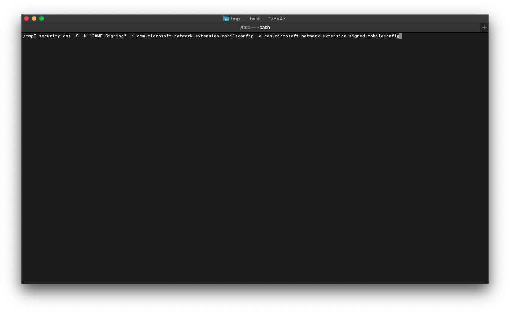

# <a name="set-up-the-microsoft-defender-for-endpoint-on-macos-policies-in-jamf-pro"></a><span data-ttu-id="f509e-104">Het Microsoft Defender voor Eindpunt instellen voor macOS-beleid in Jamf Pro</span><span class="sxs-lookup"><span data-stu-id="f509e-104">Set up the Microsoft Defender for Endpoint on macOS policies in Jamf Pro</span></span>

[!INCLUDE [Microsoft 365 Defender rebranding](../../includes/microsoft-defender.md)]


<span data-ttu-id="f509e-105">**Van toepassing op:**</span><span class="sxs-lookup"><span data-stu-id="f509e-105">**Applies to:**</span></span>

- [<span data-ttu-id="f509e-106">Defender voor Eindpunt op Mac</span><span class="sxs-lookup"><span data-stu-id="f509e-106">Defender for Endpoint on Mac</span></span>](microsoft-defender-endpoint-mac.md)

<span data-ttu-id="f509e-107">Deze pagina begeleidt u bij de stappen die u moet ondernemen om macOS-beleid in te stellen in Pro.</span><span class="sxs-lookup"><span data-stu-id="f509e-107">This page will guide you through the steps you need to take to set up macOS policies in Jamf Pro.</span></span>

<span data-ttu-id="f509e-108">U moet de volgende stappen ondernemen:</span><span class="sxs-lookup"><span data-stu-id="f509e-108">You'll need to take the following steps:</span></span>

1. [<span data-ttu-id="f509e-109">Het Onboarding-pakket voor Microsoft Defender voor eindpunten kopen</span><span class="sxs-lookup"><span data-stu-id="f509e-109">Get the Microsoft Defender for Endpoint onboarding package</span></span>](#step-1-get-the-microsoft-defender-for-endpoint-onboarding-package)

2. [<span data-ttu-id="f509e-110">Een configuratieprofiel maken in Jamf Pro met behulp van het onboarding-pakket</span><span class="sxs-lookup"><span data-stu-id="f509e-110">Create a configuration profile in Jamf Pro using the onboarding package</span></span>](#step-2-create-a-configuration-profile-in-jamf-pro-using-the-onboarding-package)

3. [<span data-ttu-id="f509e-111">Microsoft Defender configureren voor eindpuntinstellingen</span><span class="sxs-lookup"><span data-stu-id="f509e-111">Configure Microsoft Defender for Endpoint settings</span></span>](#step-3-configure-microsoft-defender-for-endpoint-settings)

4. [<span data-ttu-id="f509e-112">Instellingen voor meldingen van Microsoft Defender voor eindpunt configureren</span><span class="sxs-lookup"><span data-stu-id="f509e-112">Configure Microsoft Defender for Endpoint notification settings</span></span>](#step-4-configure-notifications-settings)

5. [<span data-ttu-id="f509e-113">Microsoft AutoUpdate configureren (MAU)</span><span class="sxs-lookup"><span data-stu-id="f509e-113">Configure Microsoft AutoUpdate (MAU)</span></span>](#step-5-configure-microsoft-autoupdate-mau)

6. [<span data-ttu-id="f509e-114">Volledige schijftoegang verlenen aan Microsoft Defender voor Eindpunt</span><span class="sxs-lookup"><span data-stu-id="f509e-114">Grant full disk access to Microsoft Defender for Endpoint</span></span>](#step-6-grant-full-disk-access-to-microsoft-defender-for-endpoint)

7. [<span data-ttu-id="f509e-115">Kernel-extensie goedkeuren voor Microsoft Defender voor Eindpunt</span><span class="sxs-lookup"><span data-stu-id="f509e-115">Approve Kernel extension for Microsoft Defender for Endpoint</span></span>](#step-7-approve-kernel-extension-for-microsoft-defender-for-endpoint)

8. [<span data-ttu-id="f509e-116">Systeemextensies goedkeuren voor Microsoft Defender voor Eindpunt</span><span class="sxs-lookup"><span data-stu-id="f509e-116">Approve System extensions for Microsoft Defender for Endpoint</span></span>](#step-8-approve-system-extensions-for-microsoft-defender-for-endpoint)

9. [<span data-ttu-id="f509e-117">Netwerkextensie configureren</span><span class="sxs-lookup"><span data-stu-id="f509e-117">Configure Network Extension</span></span>](#step-9-configure-network-extension)

10. [<span data-ttu-id="f509e-118">Scans plannen met Microsoft Defender voor Eindpunt op macOS</span><span class="sxs-lookup"><span data-stu-id="f509e-118">Schedule scans with Microsoft Defender for Endpoint on macOS</span></span>](/windows/security/threat-protection/microsoft-defender-atp/mac-schedule-scan-atp)

11. [<span data-ttu-id="f509e-119">Microsoft Defender voor eindpunt implementeren in macOS</span><span class="sxs-lookup"><span data-stu-id="f509e-119">Deploy Microsoft Defender for Endpoint on macOS</span></span>](#step-11-deploy-microsoft-defender-for-endpoint-on-macos)


## <a name="step-1-get-the-microsoft-defender-for-endpoint-onboarding-package"></a><span data-ttu-id="f509e-120">Stap 1: Het Onboarding-pakket voor Microsoft Defender voor eindpunten kopen</span><span class="sxs-lookup"><span data-stu-id="f509e-120">Step 1: Get the Microsoft Defender for Endpoint onboarding package</span></span>

1. <span data-ttu-id="f509e-121">Ga [Microsoft Defender-beveiligingscentrum](https://securitycenter.microsoft.com )naar Instellingen > **Onboarding.**</span><span class="sxs-lookup"><span data-stu-id="f509e-121">In [Microsoft Defender Security Center](https://securitycenter.microsoft.com ), navigate to **Settings > Onboarding**.</span></span> 

2. <span data-ttu-id="f509e-122">Selecteer macOS als besturingssysteem en Mobile Device Management /Microsoft Intune als implementatiemethode.</span><span class="sxs-lookup"><span data-stu-id="f509e-122">Select macOS as the operating system and Mobile Device Management / Microsoft Intune as the deployment method.</span></span>

    

3. <span data-ttu-id="f509e-124">Selecteer **Onboarding-pakket downloaden** (WindowsDefenderATPOnboardingPackage.zip).</span><span class="sxs-lookup"><span data-stu-id="f509e-124">Select **Download onboarding package** (WindowsDefenderATPOnboardingPackage.zip).</span></span>

4. <span data-ttu-id="f509e-125">Extract `WindowsDefenderATPOnboardingPackage.zip` .</span><span class="sxs-lookup"><span data-stu-id="f509e-125">Extract `WindowsDefenderATPOnboardingPackage.zip`.</span></span>

5. <span data-ttu-id="f509e-126">Kopieer het bestand naar de gewenste locatie.</span><span class="sxs-lookup"><span data-stu-id="f509e-126">Copy the file to your preferred location.</span></span> <span data-ttu-id="f509e-127">Bijvoorbeeld. `C:\Users\JaneDoe_or_JohnDoe.contoso\Downloads\WindowsDefenderATPOnboardingPackage_macOS_MDM_contoso\jamf\WindowsDefenderATPOnboarding.plist`</span><span class="sxs-lookup"><span data-stu-id="f509e-127">For example,  `C:\Users\JaneDoe_or_JohnDoe.contoso\Downloads\WindowsDefenderATPOnboardingPackage_macOS_MDM_contoso\jamf\WindowsDefenderATPOnboarding.plist`.</span></span>


## <a name="step-2-create-a-configuration-profile-in-jamf-pro-using-the-onboarding-package"></a><span data-ttu-id="f509e-128">Stap 2: Een configuratieprofiel maken in Jamf Pro met behulp van het onboarding-pakket</span><span class="sxs-lookup"><span data-stu-id="f509e-128">Step 2: Create a configuration profile in Jamf Pro using the onboarding package</span></span>

1. <span data-ttu-id="f509e-129">Zoek het bestand `WindowsDefenderATPOnboarding.plist` in de vorige sectie.</span><span class="sxs-lookup"><span data-stu-id="f509e-129">Locate the file `WindowsDefenderATPOnboarding.plist` from the previous section.</span></span>

   

 
2. <span data-ttu-id="f509e-131">Selecteer nieuw in het Pro **Jamf.**</span><span class="sxs-lookup"><span data-stu-id="f509e-131">In the Jamf Pro dashboard, select **New**.</span></span>

    

3. <span data-ttu-id="f509e-133">Voer de volgende details in:</span><span class="sxs-lookup"><span data-stu-id="f509e-133">Enter the following details:</span></span>

   <span data-ttu-id="f509e-134">**Algemeen**</span><span class="sxs-lookup"><span data-stu-id="f509e-134">**General**</span></span>
   - <span data-ttu-id="f509e-135">Naam: MDATP onboarding voor macOS</span><span class="sxs-lookup"><span data-stu-id="f509e-135">Name: MDATP onboarding for macOS</span></span>
   - <span data-ttu-id="f509e-136">Beschrijving: MDATP EDR onboarding voor macOS</span><span class="sxs-lookup"><span data-stu-id="f509e-136">Description: MDATP EDR onboarding for macOS</span></span>
   - <span data-ttu-id="f509e-137">Categorie: Geen</span><span class="sxs-lookup"><span data-stu-id="f509e-137">Category: None</span></span>
   - <span data-ttu-id="f509e-138">Distributiemethode: Automatisch installeren</span><span class="sxs-lookup"><span data-stu-id="f509e-138">Distribution Method: Install Automatically</span></span>
   - <span data-ttu-id="f509e-139">Niveau: Computerniveau</span><span class="sxs-lookup"><span data-stu-id="f509e-139">Level: Computer Level</span></span>

4. <span data-ttu-id="f509e-140">Selecteer **in & Aangepaste Instellingen** **configureren.**</span><span class="sxs-lookup"><span data-stu-id="f509e-140">In **Application & Custom Settings** select **Configure**.</span></span>

    

5. <span data-ttu-id="f509e-142">Selecteer **Upload Bestand (PLIST-bestand)** en voer in **Voorkeursdomein** de volgende opties in: `com.microsoft.wdav.atp` .</span><span class="sxs-lookup"><span data-stu-id="f509e-142">Select **Upload File (PLIST file)** then in **Preference Domain** enter: `com.microsoft.wdav.atp`.</span></span> 

    

    

7. <span data-ttu-id="f509e-145">Selecteer **Openen** en selecteer het onboarding-bestand.</span><span class="sxs-lookup"><span data-stu-id="f509e-145">Select **Open** and select the onboarding file.</span></span>

    

8. <span data-ttu-id="f509e-147">Selecteer **Upload**.</span><span class="sxs-lookup"><span data-stu-id="f509e-147">Select **Upload**.</span></span> 

    


9. <span data-ttu-id="f509e-149">Selecteer het **tabblad Bereik.**</span><span class="sxs-lookup"><span data-stu-id="f509e-149">Select the **Scope** tab.</span></span>

    

10. <span data-ttu-id="f509e-151">Selecteer de doelcomputers.</span><span class="sxs-lookup"><span data-stu-id="f509e-151">Select the target computers.</span></span>

    

     

11. <span data-ttu-id="f509e-154">Klik op **Opslaan**.</span><span class="sxs-lookup"><span data-stu-id="f509e-154">Select **Save**.</span></span>

    

    

12. <span data-ttu-id="f509e-157">Selecteer **Gereed**.</span><span class="sxs-lookup"><span data-stu-id="f509e-157">Select **Done**.</span></span>

    

    

## <a name="step-3-configure-microsoft-defender-for-endpoint-settings"></a><span data-ttu-id="f509e-160">Stap 3: Microsoft Defender configureren voor eindpuntinstellingen</span><span class="sxs-lookup"><span data-stu-id="f509e-160">Step 3: Configure Microsoft Defender for Endpoint settings</span></span>

1.  <span data-ttu-id="f509e-161">Gebruik de volgende configuratie-instellingen voor Microsoft Defender voor Eindpunt:</span><span class="sxs-lookup"><span data-stu-id="f509e-161">Use the following Microsoft Defender for Endpoint configuration settings:</span></span>

    - <span data-ttu-id="f509e-162">enableRealTimeProtection</span><span class="sxs-lookup"><span data-stu-id="f509e-162">enableRealTimeProtection</span></span>
    - <span data-ttu-id="f509e-163">passiveMode</span><span class="sxs-lookup"><span data-stu-id="f509e-163">passiveMode</span></span>
    
    >[!NOTE]
    ><span data-ttu-id="f509e-164">Als u van plan bent een AV van derden voor macOS uit te voeren, is deze standaard niet `true` ingeschakeld.</span><span class="sxs-lookup"><span data-stu-id="f509e-164">Not turned on by default, if you are planning to run a third-party AV for macOS, set it to `true`.</span></span>

    - <span data-ttu-id="f509e-165">uitsluitingen</span><span class="sxs-lookup"><span data-stu-id="f509e-165">exclusions</span></span>
    - <span data-ttu-id="f509e-166">excludedPath</span><span class="sxs-lookup"><span data-stu-id="f509e-166">excludedPath</span></span>
    - <span data-ttu-id="f509e-167">uitgeslotenFileExtension</span><span class="sxs-lookup"><span data-stu-id="f509e-167">excludedFileExtension</span></span>
    - <span data-ttu-id="f509e-168">uitgeslotenFileName</span><span class="sxs-lookup"><span data-stu-id="f509e-168">excludedFileName</span></span>
    - <span data-ttu-id="f509e-169">uitsluitingenMergePolicy</span><span class="sxs-lookup"><span data-stu-id="f509e-169">exclusionsMergePolicy</span></span>
    - <span data-ttu-id="f509e-170">toegestaanThreats</span><span class="sxs-lookup"><span data-stu-id="f509e-170">allowedThreats</span></span>
    
    >[!NOTE]
    ><span data-ttu-id="f509e-171">EICAR is opgenomen in het voorbeeld, als u een proof-of-concept doormaakt, verwijdert u deze vooral als u EICAR test.</span><span class="sxs-lookup"><span data-stu-id="f509e-171">EICAR is on the sample, if you are going through a proof-of-concept, remove it especially if you are testing EICAR.</span></span>
        
    - <span data-ttu-id="f509e-172">disallowedThreatActions</span><span class="sxs-lookup"><span data-stu-id="f509e-172">disallowedThreatActions</span></span>
    - <span data-ttu-id="f509e-173">potentially_unwanted_application</span><span class="sxs-lookup"><span data-stu-id="f509e-173">potentially_unwanted_application</span></span>
    - <span data-ttu-id="f509e-174">archive_bomb</span><span class="sxs-lookup"><span data-stu-id="f509e-174">archive_bomb</span></span>
    - <span data-ttu-id="f509e-175">cloudService</span><span class="sxs-lookup"><span data-stu-id="f509e-175">cloudService</span></span>
    - <span data-ttu-id="f509e-176">automaticSampleSubmission</span><span class="sxs-lookup"><span data-stu-id="f509e-176">automaticSampleSubmission</span></span>
    - <span data-ttu-id="f509e-177">tags</span><span class="sxs-lookup"><span data-stu-id="f509e-177">tags</span></span>
    - <span data-ttu-id="f509e-178">StatusMenuIcon verbergen</span><span class="sxs-lookup"><span data-stu-id="f509e-178">hideStatusMenuIcon</span></span>
    
     <span data-ttu-id="f509e-179">Zie Eigenschappenlijst voor [configuratieprofiel Van Jamf voor meer informatie.](mac-preferences.md#property-list-for-jamf-configuration-profile)</span><span class="sxs-lookup"><span data-stu-id="f509e-179">For information, see [Property list for Jamf configuration profile](mac-preferences.md#property-list-for-jamf-configuration-profile).</span></span>

     ```XML
     <?xml version="1.0" encoding="UTF-8"?>
     <!DOCTYPE plist PUBLIC "-//Apple//DTD PLIST 1.0//EN" "http://www.apple.com/DTDs/PropertyList-1.0.dtd">
     <plist version="1.0">
     <dict>
         <key>antivirusEngine</key>
         <dict>
             <key>enableRealTimeProtection</key>
             <true/>
             <key>passiveMode</key>
             <false/>
             <key>exclusions</key>
             <array>
                 <dict>
                     <key>$type</key>
                     <string>excludedPath</string>
                     <key>isDirectory</key>
                     <false/>
                     <key>path</key>
                     <string>/var/log/system.log</string>
                 </dict>
                 <dict>
                     <key>$type</key>
                     <string>excludedPath</string>
                     <key>isDirectory</key>
                     <true/>
                     <key>path</key>
                     <string>/home</string>
                 </dict>
                 <dict>
                     <key>$type</key>
                     <string>excludedFileExtension</string>
                     <key>extension</key>
                     <string>pdf</string>
                 </dict>
                 <dict>
                     <key>$type</key>
                     <string>excludedFileName</string>
                     <key>name</key>
                     <string>cat</string>
                 </dict>
             </array>
             <key>exclusionsMergePolicy</key>
             <string>merge</string>
             <key>allowedThreats</key>
             <array>
                 <string>EICAR-Test-File (not a virus)</string>
             </array>
             <key>disallowedThreatActions</key>
             <array>
                 <string>allow</string>
                 <string>restore</string>
             </array>
             <key>threatTypeSettings</key>
             <array>
                 <dict>
                     <key>key</key>
                     <string>potentially_unwanted_application</string>
                     <key>value</key>
                     <string>block</string>
                 </dict>
                 <dict>
                     <key>key</key>
                     <string>archive_bomb</string>
                     <key>value</key>
                     <string>audit</string>
                 </dict>
             </array>
             <key>threatTypeSettingsMergePolicy</key>
             <string>merge</string>
         </dict>
         <key>cloudService</key>
         <dict>
             <key>enabled</key>
             <true/>
             <key>diagnosticLevel</key>
             <string>optional</string>
             <key>automaticSampleSubmission</key>
             <true/>
         </dict>
         <key>edr</key>
         <dict>
             <key>tags</key>
             <array>
                 <dict>
                     <key>key</key>
                     <string>GROUP</string>
                     <key>value</key>
                     <string>ExampleTag</string>
                 </dict>
             </array>
         </dict>
         <key>userInterface</key>
         <dict>
             <key>hideStatusMenuIcon</key>
             <false/>
         </dict>
     </dict>
     </plist>
     ```

2. <span data-ttu-id="f509e-180">Sla het bestand op als `MDATP_MDAV_configuration_settings.plist` .</span><span class="sxs-lookup"><span data-stu-id="f509e-180">Save the file as `MDATP_MDAV_configuration_settings.plist`.</span></span>


3.  <span data-ttu-id="f509e-181">Selecteer algemeen in Pro **Jamf-dashboard.**</span><span class="sxs-lookup"><span data-stu-id="f509e-181">In the Jamf Pro dashboard, select **General**.</span></span>

    

4. <span data-ttu-id="f509e-183">Voer de volgende details in:</span><span class="sxs-lookup"><span data-stu-id="f509e-183">Enter the following details:</span></span>

    <span data-ttu-id="f509e-184">**Algemeen**</span><span class="sxs-lookup"><span data-stu-id="f509e-184">**General**</span></span>
    
    - <span data-ttu-id="f509e-185">Naam: MDATP MDAV-configuratie-instellingen</span><span class="sxs-lookup"><span data-stu-id="f509e-185">Name: MDATP MDAV configuration settings</span></span>
    - <span data-ttu-id="f509e-186">Beschrijving:\<blank\></span><span class="sxs-lookup"><span data-stu-id="f509e-186">Description:\<blank\></span></span>
    - <span data-ttu-id="f509e-187">Categorie: Geen (standaard)</span><span class="sxs-lookup"><span data-stu-id="f509e-187">Category: None (default)</span></span>
    - <span data-ttu-id="f509e-188">Distributiemethode: Automatisch installeren(standaard)</span><span class="sxs-lookup"><span data-stu-id="f509e-188">Distribution Method: Install Automatically(default)</span></span>
    - <span data-ttu-id="f509e-189">Niveau: Computerniveau(standaard)</span><span class="sxs-lookup"><span data-stu-id="f509e-189">Level: Computer Level(default)</span></span>

    

5. <span data-ttu-id="f509e-191">Selecteer **in & Aangepaste Instellingen** **configureren.**</span><span class="sxs-lookup"><span data-stu-id="f509e-191">In **Application & Custom Settings** select **Configure**.</span></span>

    

6. <span data-ttu-id="f509e-193">Selecteer **Upload Bestand (PLIST-bestand)**.</span><span class="sxs-lookup"><span data-stu-id="f509e-193">Select **Upload File (PLIST file)**.</span></span>

    

7. <span data-ttu-id="f509e-195">Typ **in Het domein** Voorkeuren en selecteer Upload `com.microsoft.wdav` **PLIST-bestand.**</span><span class="sxs-lookup"><span data-stu-id="f509e-195">In **Preferences Domain**, enter `com.microsoft.wdav`, then select  **Upload PLIST File**.</span></span>

    

8. <span data-ttu-id="f509e-197">Selecteer **Bestand kiezen.**</span><span class="sxs-lookup"><span data-stu-id="f509e-197">Select **Choose File**.</span></span>

    

9. <span data-ttu-id="f509e-199">Selecteer de **MDATP_MDAV_configuration_settings.plist** en selecteer **Openen.**</span><span class="sxs-lookup"><span data-stu-id="f509e-199">Select the **MDATP_MDAV_configuration_settings.plist**, then select **Open**.</span></span>

    

10. <span data-ttu-id="f509e-201">Selecteer **Upload**.</span><span class="sxs-lookup"><span data-stu-id="f509e-201">Select **Upload**.</span></span>

    

    

    >[!NOTE]
    ><span data-ttu-id="f509e-204">Als u het Intune-bestand uploadt, krijgt u de volgende foutmelding:</span><span class="sxs-lookup"><span data-stu-id="f509e-204">If you happen to upload the Intune file, you'll get the following error:</span></span><br>
    ><span data-ttu-id="f509e-205"></span><span class="sxs-lookup"><span data-stu-id="f509e-205"></span></span>


11. <span data-ttu-id="f509e-206">Klik op **Opslaan**.</span><span class="sxs-lookup"><span data-stu-id="f509e-206">Select **Save**.</span></span> 

    

12. <span data-ttu-id="f509e-208">Het bestand wordt geüpload.</span><span class="sxs-lookup"><span data-stu-id="f509e-208">The file is uploaded.</span></span>

    

    

13. <span data-ttu-id="f509e-211">Selecteer het **tabblad Bereik.**</span><span class="sxs-lookup"><span data-stu-id="f509e-211">Select the **Scope** tab.</span></span>

    

14. <span data-ttu-id="f509e-213">Selecteer **De machinegroep van Contoso.**</span><span class="sxs-lookup"><span data-stu-id="f509e-213">Select **Contoso's Machine Group**.</span></span> 

15. <span data-ttu-id="f509e-214">Selecteer **Toevoegen** en selecteer **opslaan.**</span><span class="sxs-lookup"><span data-stu-id="f509e-214">Select **Add**, then select **Save**.</span></span>

    

    

16. <span data-ttu-id="f509e-217">Selecteer **Gereed**.</span><span class="sxs-lookup"><span data-stu-id="f509e-217">Select **Done**.</span></span> <span data-ttu-id="f509e-218">U ziet het nieuwe **configuratieprofiel.**</span><span class="sxs-lookup"><span data-stu-id="f509e-218">You'll see the new **Configuration profile**.</span></span>

    


## <a name="step-4-configure-notifications-settings"></a><span data-ttu-id="f509e-220">Stap 4: Instellingen voor meldingen configureren</span><span class="sxs-lookup"><span data-stu-id="f509e-220">Step 4: Configure notifications settings</span></span>

<span data-ttu-id="f509e-221">Deze stappen zijn van toepassing op macOS 10.15 (Catalina) of hoger.</span><span class="sxs-lookup"><span data-stu-id="f509e-221">These steps are applicable of macOS 10.15 (Catalina) or newer.</span></span>

1. <span data-ttu-id="f509e-222">Selecteer in het Pro Dashboard Van Jamf de optie **Computers** en vervolgens **Configuratieprofielen.**</span><span class="sxs-lookup"><span data-stu-id="f509e-222">In the Jamf Pro dashboard, select **Computers**, then **Configuration Profiles**.</span></span>

2. <span data-ttu-id="f509e-223">Klik **op Nieuw** en voer de volgende details in voor **Opties:**</span><span class="sxs-lookup"><span data-stu-id="f509e-223">Click **New**, and enter the following details for **Options**:</span></span>
    
    - <span data-ttu-id="f509e-224">Tabblad **Algemeen**:</span><span class="sxs-lookup"><span data-stu-id="f509e-224">Tab **General**:</span></span> 
        - <span data-ttu-id="f509e-225">**Naam**: MDATP MDAV-meldingsinstellingen</span><span class="sxs-lookup"><span data-stu-id="f509e-225">**Name**: MDATP MDAV Notification settings</span></span>
        - <span data-ttu-id="f509e-226">**Beschrijving**: macOS 10.15 (Catalina) of hoger</span><span class="sxs-lookup"><span data-stu-id="f509e-226">**Description**: macOS 10.15 (Catalina) or newer</span></span>
        - <span data-ttu-id="f509e-227">**Categorie:** Geen *(standaard)*</span><span class="sxs-lookup"><span data-stu-id="f509e-227">**Category**: None *(default)*</span></span>
        - <span data-ttu-id="f509e-228">**Distributiemethode:** Automatisch installeren *(standaard)*</span><span class="sxs-lookup"><span data-stu-id="f509e-228">**Distribution Method**: Install Automatically *(default)*</span></span>
        - <span data-ttu-id="f509e-229">**Niveau:** Computerniveau *(standaard)*</span><span class="sxs-lookup"><span data-stu-id="f509e-229">**Level**: Computer Level *(default)*</span></span>

        

    - <span data-ttu-id="f509e-231">**Tabmeldingen,** klik **op Toevoegen** en voer de volgende waarden in:</span><span class="sxs-lookup"><span data-stu-id="f509e-231">Tab **Notifications**, click **Add**, and enter the following values:</span></span>
        - <span data-ttu-id="f509e-232">**Bundel-id:**`com.microsoft.wdav.tray`</span><span class="sxs-lookup"><span data-stu-id="f509e-232">**Bundle ID**: `com.microsoft.wdav.tray`</span></span>
        - <span data-ttu-id="f509e-233">**Kritieke waarschuwingen:** Klik op **Uitschakelen**</span><span class="sxs-lookup"><span data-stu-id="f509e-233">**Critical Alerts**: Click **Disable**</span></span>
        - <span data-ttu-id="f509e-234">**Meldingen:** Klik op **Inschakelen**</span><span class="sxs-lookup"><span data-stu-id="f509e-234">**Notifications**: Click **Enable**</span></span>
        - <span data-ttu-id="f509e-235">**Type bannerwaarschuwing:** Selecteer **Opnemen** en **Tijdelijk** *(standaard)*</span><span class="sxs-lookup"><span data-stu-id="f509e-235">**Banner alert type**: Select **Include** and **Temporary** *(default)*</span></span>
        - <span data-ttu-id="f509e-236">**Meldingen op vergrendelingsscherm**: Klik op **Verbergen**</span><span class="sxs-lookup"><span data-stu-id="f509e-236">**Notifications on lock screen**: Click **Hide**</span></span>
        - <span data-ttu-id="f509e-237">**Meldingen in het systeemcentrum:** klik op **Weergeven**</span><span class="sxs-lookup"><span data-stu-id="f509e-237">**Notifications in Notification Center**: Click **Display**</span></span>
        - <span data-ttu-id="f509e-238">**Pictogram badge-app:** klik op **Weergeven**</span><span class="sxs-lookup"><span data-stu-id="f509e-238">**Badge app icon**: Click **Display**</span></span>

        

    - <span data-ttu-id="f509e-240">**TabMeldingen**, klik nog **een** keer op Toevoegen, schuif omlaag naar **Nieuwe meldingen Instellingen**</span><span class="sxs-lookup"><span data-stu-id="f509e-240">Tab **Notifications**, click **Add** one more time, scroll down to **New Notifications Settings**</span></span>
        - <span data-ttu-id="f509e-241">**Bundel-id:**`com.microsoft.autoupdate2`</span><span class="sxs-lookup"><span data-stu-id="f509e-241">**Bundle ID**: `com.microsoft.autoupdate2`</span></span>
        - <span data-ttu-id="f509e-242">De rest van de instellingen configureren op dezelfde waarden als hierboven</span><span class="sxs-lookup"><span data-stu-id="f509e-242">Configure the rest of the settings to the same values as above</span></span>

        

        <span data-ttu-id="f509e-244">Houd er rekening mee dat u nu twee 'tabellen' met meldingsconfiguraties hebt, een voor **Bundel-id: com.microsoft.wdav.tray** en een voor **Bundel-id: com.microsoft.autoupdate2**.</span><span class="sxs-lookup"><span data-stu-id="f509e-244">Note that now you have two 'tables' with notification configurations, one for **Bundle ID: com.microsoft.wdav.tray**, and another for **Bundle ID: com.microsoft.autoupdate2**.</span></span> <span data-ttu-id="f509e-245">Hoewel u waarschuwingsinstellingen kunt configureren op basis van uw vereisten,  moeten bundel-1D's exact hetzelfde zijn als eerder beschreven en moet de schakelknop Opnemen zijn **aan** voor **meldingen.**</span><span class="sxs-lookup"><span data-stu-id="f509e-245">While you can configure alert settings per your requirements, Bundle IDs must be exactly the same as described before, and **Include** switch must be **On** for **Notifications**.</span></span>

3. <span data-ttu-id="f509e-246">Selecteer het **tabblad** Bereik en selecteer **vervolgens Toevoegen.**</span><span class="sxs-lookup"><span data-stu-id="f509e-246">Select the **Scope** tab, then select **Add**.</span></span>

    

4. <span data-ttu-id="f509e-248">Selecteer **De machinegroep van Contoso.**</span><span class="sxs-lookup"><span data-stu-id="f509e-248">Select **Contoso's Machine Group**.</span></span> 

5. <span data-ttu-id="f509e-249">Selecteer **Toevoegen** en selecteer **opslaan.**</span><span class="sxs-lookup"><span data-stu-id="f509e-249">Select **Add**, then select **Save**.</span></span>
    
    
    
    

6. <span data-ttu-id="f509e-252">Selecteer **Gereed**.</span><span class="sxs-lookup"><span data-stu-id="f509e-252">Select **Done**.</span></span> <span data-ttu-id="f509e-253">U ziet het nieuwe **configuratieprofiel.**</span><span class="sxs-lookup"><span data-stu-id="f509e-253">You'll see the new **Configuration profile**.</span></span>
    <span data-ttu-id="f509e-254"></span><span class="sxs-lookup"><span data-stu-id="f509e-254"></span></span>

## <a name="step-5-configure-microsoft-autoupdate-mau"></a><span data-ttu-id="f509e-255">Stap 5: Microsoft AutoUpdate configureren (MAU)</span><span class="sxs-lookup"><span data-stu-id="f509e-255">Step 5: Configure Microsoft AutoUpdate (MAU)</span></span>

1. <span data-ttu-id="f509e-256">Gebruik de volgende configuratie-instellingen voor Microsoft Defender voor Eindpunt:</span><span class="sxs-lookup"><span data-stu-id="f509e-256">Use the following Microsoft Defender for Endpoint configuration settings:</span></span>

      ```XML
   <?xml version="1.0" encoding="UTF-8"?>
   <!DOCTYPE plist PUBLIC "-//Apple//DTD PLIST 1.0//EN" "http://www.apple.com/DTDs/PropertyList-1.0.dtd">
   <plist version="1.0">
   <dict>
    <key>ChannelName</key>
    <string>Current</string>
    <key>HowToCheck</key>
    <string>AutomaticDownload</string>
    <key>EnableCheckForUpdatesButton</key>
    <true/>
    <key>DisableInsiderCheckbox</key>
    <false/>
    <key>SendAllTelemetryEnabled</key>
    <true/>
   </dict>
   </plist>
   ```

2. <span data-ttu-id="f509e-257">Sla het op als `MDATP_MDAV_MAU_settings.plist` .</span><span class="sxs-lookup"><span data-stu-id="f509e-257">Save it as `MDATP_MDAV_MAU_settings.plist`.</span></span>

3. <span data-ttu-id="f509e-258">Selecteer algemeen in Pro **Jamf-dashboard.**</span><span class="sxs-lookup"><span data-stu-id="f509e-258">In the Jamf Pro dashboard, select **General**.</span></span> 

    

4. <span data-ttu-id="f509e-260">Voer de volgende details in:</span><span class="sxs-lookup"><span data-stu-id="f509e-260">Enter the following details:</span></span>

    <span data-ttu-id="f509e-261">**Algemeen**</span><span class="sxs-lookup"><span data-stu-id="f509e-261">**General**</span></span> 
    
    - <span data-ttu-id="f509e-262">Naam: MDATP MDAV MAU-instellingen</span><span class="sxs-lookup"><span data-stu-id="f509e-262">Name: MDATP MDAV MAU settings</span></span>
    - <span data-ttu-id="f509e-263">Beschrijving: Microsoft AutoUpdate-instellingen voor MDATP voor macOS</span><span class="sxs-lookup"><span data-stu-id="f509e-263">Description: Microsoft AutoUpdate settings for MDATP for macOS</span></span>
    - <span data-ttu-id="f509e-264">Categorie: Geen (standaard)</span><span class="sxs-lookup"><span data-stu-id="f509e-264">Category: None (default)</span></span>
    - <span data-ttu-id="f509e-265">Distributiemethode: Automatisch installeren(standaard)</span><span class="sxs-lookup"><span data-stu-id="f509e-265">Distribution Method: Install Automatically(default)</span></span>
    - <span data-ttu-id="f509e-266">Niveau: Computerniveau(standaard)</span><span class="sxs-lookup"><span data-stu-id="f509e-266">Level: Computer Level(default)</span></span>

5. <span data-ttu-id="f509e-267">Selecteer **in & Aangepaste Instellingen** **configureren.**</span><span class="sxs-lookup"><span data-stu-id="f509e-267">In **Application & Custom Settings** select **Configure**.</span></span>

    

6. <span data-ttu-id="f509e-269">Selecteer **Upload Bestand (PLIST-bestand)**.</span><span class="sxs-lookup"><span data-stu-id="f509e-269">Select **Upload File (PLIST file)**.</span></span>

      

7. <span data-ttu-id="f509e-271">Selecteer **in Voorkeursdomein:** `com.microsoft.autoupdate2` en selecteer Upload **PLIST-bestand.**</span><span class="sxs-lookup"><span data-stu-id="f509e-271">In **Preference Domain** enter: `com.microsoft.autoupdate2`, then select **Upload PLIST File**.</span></span>

    

8. <span data-ttu-id="f509e-273">Selecteer **Bestand kiezen.**</span><span class="sxs-lookup"><span data-stu-id="f509e-273">Select **Choose File**.</span></span>

    

9. <span data-ttu-id="f509e-275">Selecteer **MDATP_MDAV_MAU_settings.plist**.</span><span class="sxs-lookup"><span data-stu-id="f509e-275">Select **MDATP_MDAV_MAU_settings.plist**.</span></span>

    

10. <span data-ttu-id="f509e-277">Selecteer **Upload**.</span><span class="sxs-lookup"><span data-stu-id="f509e-277">Select **Upload**.</span></span>
    <span data-ttu-id="f509e-278"></span><span class="sxs-lookup"><span data-stu-id="f509e-278"></span></span>

    

11. <span data-ttu-id="f509e-280">Klik op **Opslaan**.</span><span class="sxs-lookup"><span data-stu-id="f509e-280">Select **Save**.</span></span>

    

12. <span data-ttu-id="f509e-282">Selecteer het **tabblad Bereik.**</span><span class="sxs-lookup"><span data-stu-id="f509e-282">Select the **Scope** tab.</span></span>
   
     

13. <span data-ttu-id="f509e-284">Kies **Toevoegen**.</span><span class="sxs-lookup"><span data-stu-id="f509e-284">Select **Add**.</span></span>
    
    

    

    

14. <span data-ttu-id="f509e-288">Selecteer **Gereed**.</span><span class="sxs-lookup"><span data-stu-id="f509e-288">Select **Done**.</span></span>
    
    

## <a name="step-6-grant-full-disk-access-to-microsoft-defender-for-endpoint"></a><span data-ttu-id="f509e-290">Stap 6: Volledige schijftoegang verlenen aan Microsoft Defender voor eindpunt</span><span class="sxs-lookup"><span data-stu-id="f509e-290">Step 6: Grant full disk access to Microsoft Defender for Endpoint</span></span>

1. <span data-ttu-id="f509e-291">Selecteer configuratieprofielen in Pro Dashboard **Jamf.**</span><span class="sxs-lookup"><span data-stu-id="f509e-291">In the Jamf Pro dashboard, select **Configuration Profiles**.</span></span>

    

2. <span data-ttu-id="f509e-293">Selecteer **+ Nieuw**.</span><span class="sxs-lookup"><span data-stu-id="f509e-293">Select **+ New**.</span></span> 

3. <span data-ttu-id="f509e-294">Voer de volgende details in:</span><span class="sxs-lookup"><span data-stu-id="f509e-294">Enter the following details:</span></span>

    <span data-ttu-id="f509e-295">**Algemeen**</span><span class="sxs-lookup"><span data-stu-id="f509e-295">**General**</span></span> 
    - <span data-ttu-id="f509e-296">Naam: MDATP MDAV - Volledige schijftoegang verlenen aan EDR en AV</span><span class="sxs-lookup"><span data-stu-id="f509e-296">Name: MDATP MDAV - grant Full Disk Access to EDR and AV</span></span>
    - <span data-ttu-id="f509e-297">Beschrijving: In macOS Catalina of nieuwer, het nieuwe beleid voor privacyvoorkeuren</span><span class="sxs-lookup"><span data-stu-id="f509e-297">Description: On macOS Catalina or newer, the new Privacy Preferences Policy Control</span></span>
    - <span data-ttu-id="f509e-298">Categorie: Geen</span><span class="sxs-lookup"><span data-stu-id="f509e-298">Category: None</span></span>
    - <span data-ttu-id="f509e-299">Distributiemethode: Automatisch installeren</span><span class="sxs-lookup"><span data-stu-id="f509e-299">Distribution method: Install Automatically</span></span>
    - <span data-ttu-id="f509e-300">Niveau: Computerniveau</span><span class="sxs-lookup"><span data-stu-id="f509e-300">Level: Computer level</span></span>


    

4. <span data-ttu-id="f509e-302">Selecteer **in Beleidsbesturingselement Privacyvoorkeuren configureren** **de optie Configureren.**</span><span class="sxs-lookup"><span data-stu-id="f509e-302">In **Configure Privacy Preferences Policy Control** select **Configure**.</span></span>

    

5. <span data-ttu-id="f509e-304">Voer **in Beleidsbeheer privacyvoorkeuren** de volgende details in:</span><span class="sxs-lookup"><span data-stu-id="f509e-304">In **Privacy Preferences Policy Control**, enter the following details:</span></span>

    - <span data-ttu-id="f509e-305">Id: `com.microsoft.wdav`</span><span class="sxs-lookup"><span data-stu-id="f509e-305">Identifier: `com.microsoft.wdav`</span></span>
    - <span data-ttu-id="f509e-306">Id-type: bundel-id</span><span class="sxs-lookup"><span data-stu-id="f509e-306">Identifier Type: Bundle ID</span></span>
    - <span data-ttu-id="f509e-307">Codevereiste: `identifier "com.microsoft.wdav" and anchor apple generic and certificate 1[field.1.2.840.113635.100.6.2.6] /* exists */ and certificate leaf[field.1.2.840.113635.100.6.1.13] /* exists */ and certificate leaf[subject.OU] = UBF8T346G9`</span><span class="sxs-lookup"><span data-stu-id="f509e-307">Code Requirement: `identifier "com.microsoft.wdav" and anchor apple generic and certificate 1[field.1.2.840.113635.100.6.2.6] /* exists */ and certificate leaf[field.1.2.840.113635.100.6.1.13] /* exists */ and certificate leaf[subject.OU] = UBF8T346G9`</span></span>


    

6. <span data-ttu-id="f509e-309">Selecteer **+ Toevoegen.**</span><span class="sxs-lookup"><span data-stu-id="f509e-309">Select **+ Add**.</span></span>

    

    - <span data-ttu-id="f509e-311">Onder App of service: Instellen op **SystemPolicyAllFiles**</span><span class="sxs-lookup"><span data-stu-id="f509e-311">Under App or service: Set to **SystemPolicyAllFiles**</span></span>

    - <span data-ttu-id="f509e-312">Onder 'toegang': Instellen op **Toestaan**</span><span class="sxs-lookup"><span data-stu-id="f509e-312">Under "access": Set to **Allow**</span></span>

7. <span data-ttu-id="f509e-313">Selecteer **Opslaan** (niet de optie rechtsonder).</span><span class="sxs-lookup"><span data-stu-id="f509e-313">Select **Save** (not the one at the bottom right).</span></span>

    

8. <span data-ttu-id="f509e-315">Klik op `+` het bord naast App Access **om** een nieuw item toe te voegen.</span><span class="sxs-lookup"><span data-stu-id="f509e-315">Click the `+` sign next to **App Access** to add a new entry.</span></span>

    

9. <span data-ttu-id="f509e-317">Voer de volgende details in:</span><span class="sxs-lookup"><span data-stu-id="f509e-317">Enter the following details:</span></span>

    - <span data-ttu-id="f509e-318">Id: `com.microsoft.wdav.epsext`</span><span class="sxs-lookup"><span data-stu-id="f509e-318">Identifier: `com.microsoft.wdav.epsext`</span></span>
    - <span data-ttu-id="f509e-319">Id-type: bundel-id</span><span class="sxs-lookup"><span data-stu-id="f509e-319">Identifier Type: Bundle ID</span></span>
    - <span data-ttu-id="f509e-320">Codevereiste: `identifier "com.microsoft.wdav.epsext" and anchor apple generic and certificate 1[field.1.2.840.113635.100.6.2.6] /* exists */ and certificate leaf[field.1.2.840.113635.100.6.1.13] /* exists */ and certificate leaf[subject.OU] = UBF8T346G9`</span><span class="sxs-lookup"><span data-stu-id="f509e-320">Code Requirement: `identifier "com.microsoft.wdav.epsext" and anchor apple generic and certificate 1[field.1.2.840.113635.100.6.2.6] /* exists */ and certificate leaf[field.1.2.840.113635.100.6.1.13] /* exists */ and certificate leaf[subject.OU] = UBF8T346G9`</span></span>

10. <span data-ttu-id="f509e-321">Selecteer **+ Toevoegen.**</span><span class="sxs-lookup"><span data-stu-id="f509e-321">Select **+ Add**.</span></span>

    

    - <span data-ttu-id="f509e-323">Onder App of service: Instellen op **SystemPolicyAllFiles**</span><span class="sxs-lookup"><span data-stu-id="f509e-323">Under App or service: Set to **SystemPolicyAllFiles**</span></span>

    - <span data-ttu-id="f509e-324">Onder 'toegang': Instellen op **Toestaan**</span><span class="sxs-lookup"><span data-stu-id="f509e-324">Under "access": Set to **Allow**</span></span>

11. <span data-ttu-id="f509e-325">Selecteer **Opslaan** (niet de optie rechtsonder).</span><span class="sxs-lookup"><span data-stu-id="f509e-325">Select **Save** (not the one at the bottom right).</span></span>

    

12. <span data-ttu-id="f509e-327">Selecteer het **tabblad Bereik.**</span><span class="sxs-lookup"><span data-stu-id="f509e-327">Select the **Scope** tab.</span></span>

    

13. <span data-ttu-id="f509e-329">Selecteer **+ Toevoegen.**</span><span class="sxs-lookup"><span data-stu-id="f509e-329">Select **+ Add**.</span></span>

    

14. <span data-ttu-id="f509e-331">Selecteer **Computergroepen >** **onder Groepsnaam** > **selecteer Contoso's MachineGroup.**</span><span class="sxs-lookup"><span data-stu-id="f509e-331">Select **Computer Groups** > under **Group Name** > select **Contoso's MachineGroup**.</span></span> 

    

15. <span data-ttu-id="f509e-333">Kies **Toevoegen**.</span><span class="sxs-lookup"><span data-stu-id="f509e-333">Select **Add**.</span></span> 

16. <span data-ttu-id="f509e-334">Klik op **Opslaan**.</span><span class="sxs-lookup"><span data-stu-id="f509e-334">Select **Save**.</span></span> 
    
17. <span data-ttu-id="f509e-335">Selecteer **Gereed**.</span><span class="sxs-lookup"><span data-stu-id="f509e-335">Select **Done**.</span></span>
    
    
    
    

<span data-ttu-id="f509e-338">U kunt ook [fulldisk.mobileconfig](https://github.com/microsoft/mdatp-xplat/blob/master/macos/mobileconfig/profiles/fulldisk.mobileconfig) downloaden en uploaden naar JAMF-configuratieprofielen, zoals beschreven in Aangepaste configuratieprofielen implementeren met Behulp van [Jamf-Pro| Methode 2: Upload configuratieprofiel naar Jamf](https://www.jamf.com/jamf-nation/articles/648/deploying-custom-configuration-profiles-using-jamf-pro)Pro.</span><span class="sxs-lookup"><span data-stu-id="f509e-338">Alternatively, you can download [fulldisk.mobileconfig](https://github.com/microsoft/mdatp-xplat/blob/master/macos/mobileconfig/profiles/fulldisk.mobileconfig) and upload it to JAMF Configuration Profiles as described in [Deploying Custom Configuration Profiles using Jamf Pro|Method 2: Upload a Configuration Profile to Jamf Pro](https://www.jamf.com/jamf-nation/articles/648/deploying-custom-configuration-profiles-using-jamf-pro).</span></span>

## <a name="step-7-approve-kernel-extension-for-microsoft-defender-for-endpoint"></a><span data-ttu-id="f509e-339">Stap 7: Kernel-extensie goedkeuren voor Microsoft Defender voor Eindpunt</span><span class="sxs-lookup"><span data-stu-id="f509e-339">Step 7: Approve Kernel extension for Microsoft Defender for Endpoint</span></span>

> [!CAUTION]
> <span data-ttu-id="f509e-340">Apple Silicon (M1) apparaten bieden geen ondersteuning voor KEXT.</span><span class="sxs-lookup"><span data-stu-id="f509e-340">Apple Silicon (M1) devices do not support KEXT.</span></span> <span data-ttu-id="f509e-341">De installatie van een configuratieprofiel met KEXT-beleid mislukt op deze apparaten.</span><span class="sxs-lookup"><span data-stu-id="f509e-341">Installation of a configuration profile consisting KEXT policies will fail on these devices.</span></span>

1. <span data-ttu-id="f509e-342">Selecteer in **de configuratieprofielen** **+ Nieuw**.</span><span class="sxs-lookup"><span data-stu-id="f509e-342">In the **Configuration Profiles**, select **+ New**.</span></span>

    

2. <span data-ttu-id="f509e-344">Voer de volgende details in:</span><span class="sxs-lookup"><span data-stu-id="f509e-344">Enter the following details:</span></span>

    <span data-ttu-id="f509e-345">**Algemeen**</span><span class="sxs-lookup"><span data-stu-id="f509e-345">**General**</span></span> 
    
    - <span data-ttu-id="f509e-346">Naam: MDATP MDAV Kernel Extension</span><span class="sxs-lookup"><span data-stu-id="f509e-346">Name: MDATP MDAV Kernel Extension</span></span>
    - <span data-ttu-id="f509e-347">Beschrijving: MDATP kernel extension (kext)</span><span class="sxs-lookup"><span data-stu-id="f509e-347">Description: MDATP kernel extension (kext)</span></span>
    - <span data-ttu-id="f509e-348">Categorie: Geen</span><span class="sxs-lookup"><span data-stu-id="f509e-348">Category: None</span></span>
    - <span data-ttu-id="f509e-349">Distributiemethode: Automatisch installeren</span><span class="sxs-lookup"><span data-stu-id="f509e-349">Distribution Method: Install Automatically</span></span>
    - <span data-ttu-id="f509e-350">Niveau: Computerniveau</span><span class="sxs-lookup"><span data-stu-id="f509e-350">Level: Computer Level</span></span>

    

3. <span data-ttu-id="f509e-352">Selecteer **configureren goedgekeurde kernelextensies** **configureren.**</span><span class="sxs-lookup"><span data-stu-id="f509e-352">In **Configure Approved Kernel Extensions** select **Configure**.</span></span>

    

   
4. <span data-ttu-id="f509e-354">Voer **in Goedgekeurde kernelextensies** de volgende details in:</span><span class="sxs-lookup"><span data-stu-id="f509e-354">In **Approved Kernel Extensions** Enter the following details:</span></span>

    - <span data-ttu-id="f509e-355">Weergavenaam: Microsoft Corp.</span><span class="sxs-lookup"><span data-stu-id="f509e-355">Display Name: Microsoft Corp.</span></span>
    - <span data-ttu-id="f509e-356">Team-id: UBF8T346G9</span><span class="sxs-lookup"><span data-stu-id="f509e-356">Team ID: UBF8T346G9</span></span>

    

5. <span data-ttu-id="f509e-358">Selecteer het **tabblad Bereik.**</span><span class="sxs-lookup"><span data-stu-id="f509e-358">Select the **Scope** tab.</span></span>

    

6. <span data-ttu-id="f509e-360">Selecteer **+ Toevoegen.**</span><span class="sxs-lookup"><span data-stu-id="f509e-360">Select **+ Add**.</span></span>

7. <span data-ttu-id="f509e-361">Selecteer **Computergroepen** > **onder Groepsnaam** > selecteer **De machinegroep van Contoso.**</span><span class="sxs-lookup"><span data-stu-id="f509e-361">Select **Computer Groups** > under **Group Name** > select **Contoso's Machine Group**.</span></span>

8. <span data-ttu-id="f509e-362">Selecteer **+ Toevoegen.**</span><span class="sxs-lookup"><span data-stu-id="f509e-362">Select **+ Add**.</span></span>

    

9. <span data-ttu-id="f509e-364">Klik op **Opslaan**.</span><span class="sxs-lookup"><span data-stu-id="f509e-364">Select **Save**.</span></span>

    

10. <span data-ttu-id="f509e-366">Selecteer **Gereed**.</span><span class="sxs-lookup"><span data-stu-id="f509e-366">Select **Done**.</span></span>

    

<span data-ttu-id="f509e-368">U kunt ook [kext.mobileconfig](https://github.com/microsoft/mdatp-xplat/blob/master/macos/mobileconfig/profiles/kext.mobileconfig) downloaden en uploaden naar JAMF-configuratieprofielen, zoals beschreven in Aangepaste configuratieprofielen implementeren met Behulp van [Jamf-Pro| Methode 2: Upload configuratieprofiel naar Jamf](https://www.jamf.com/jamf-nation/articles/648/deploying-custom-configuration-profiles-using-jamf-pro)Pro.</span><span class="sxs-lookup"><span data-stu-id="f509e-368">Alternatively, you can download [kext.mobileconfig](https://github.com/microsoft/mdatp-xplat/blob/master/macos/mobileconfig/profiles/kext.mobileconfig) and upload it to JAMF Configuration Profiles as described in [Deploying Custom Configuration Profiles using Jamf Pro|Method 2: Upload a Configuration Profile to Jamf Pro](https://www.jamf.com/jamf-nation/articles/648/deploying-custom-configuration-profiles-using-jamf-pro).</span></span>

## <a name="step-8-approve-system-extensions-for-microsoft-defender-for-endpoint"></a><span data-ttu-id="f509e-369">Stap 8: Systeemextensies goedkeuren voor Microsoft Defender voor eindpunt</span><span class="sxs-lookup"><span data-stu-id="f509e-369">Step 8: Approve System extensions for Microsoft Defender for Endpoint</span></span>

1. <span data-ttu-id="f509e-370">Selecteer in **de configuratieprofielen** **+ Nieuw**.</span><span class="sxs-lookup"><span data-stu-id="f509e-370">In the **Configuration Profiles**, select **+ New**.</span></span>

    

2. <span data-ttu-id="f509e-372">Voer de volgende details in:</span><span class="sxs-lookup"><span data-stu-id="f509e-372">Enter the following details:</span></span>

    <span data-ttu-id="f509e-373">**Algemeen**</span><span class="sxs-lookup"><span data-stu-id="f509e-373">**General**</span></span>
    
    - <span data-ttu-id="f509e-374">Naam: MDATP MDAV-systeemextensies</span><span class="sxs-lookup"><span data-stu-id="f509e-374">Name: MDATP MDAV System Extensions</span></span>
    - <span data-ttu-id="f509e-375">Beschrijving: MDATP systeemextensies</span><span class="sxs-lookup"><span data-stu-id="f509e-375">Description: MDATP system extensions</span></span>
    - <span data-ttu-id="f509e-376">Categorie: Geen</span><span class="sxs-lookup"><span data-stu-id="f509e-376">Category: None</span></span>
    - <span data-ttu-id="f509e-377">Distributiemethode: Automatisch installeren</span><span class="sxs-lookup"><span data-stu-id="f509e-377">Distribution Method: Install Automatically</span></span>
    - <span data-ttu-id="f509e-378">Niveau: Computerniveau</span><span class="sxs-lookup"><span data-stu-id="f509e-378">Level: Computer Level</span></span>

    

3. <span data-ttu-id="f509e-380">Selecteer **configureren in Systeemextensies.** </span><span class="sxs-lookup"><span data-stu-id="f509e-380">In **System Extensions** select **Configure**.</span></span>

   

4. <span data-ttu-id="f509e-382">Voer **in Systeemextensies** de volgende details in:</span><span class="sxs-lookup"><span data-stu-id="f509e-382">In **System Extensions** enter the following details:</span></span>

   - <span data-ttu-id="f509e-383">Weergavenaam: Microsoft Corp. Systeemextensies</span><span class="sxs-lookup"><span data-stu-id="f509e-383">Display Name: Microsoft Corp. System Extensions</span></span>
   - <span data-ttu-id="f509e-384">Systeemextensietypen: Toegestane systeemextensies</span><span class="sxs-lookup"><span data-stu-id="f509e-384">System Extension Types: Allowed System Extensions</span></span>
   - <span data-ttu-id="f509e-385">Teamaanduiding: UBF8T346G9</span><span class="sxs-lookup"><span data-stu-id="f509e-385">Team Identifier: UBF8T346G9</span></span>
   - <span data-ttu-id="f509e-386">Toegestane systeemextensies:</span><span class="sxs-lookup"><span data-stu-id="f509e-386">Allowed System Extensions:</span></span>
     - <span data-ttu-id="f509e-387">**com.microsoft.wdav.epsext**</span><span class="sxs-lookup"><span data-stu-id="f509e-387">**com.microsoft.wdav.epsext**</span></span>
     - <span data-ttu-id="f509e-388">**com.microsoft.wdav.netext**</span><span class="sxs-lookup"><span data-stu-id="f509e-388">**com.microsoft.wdav.netext**</span></span>

    

5. <span data-ttu-id="f509e-390">Selecteer het **tabblad Bereik.**</span><span class="sxs-lookup"><span data-stu-id="f509e-390">Select the **Scope** tab.</span></span>

    

6. <span data-ttu-id="f509e-392">Selecteer **+ Toevoegen.**</span><span class="sxs-lookup"><span data-stu-id="f509e-392">Select **+ Add**.</span></span>

7. <span data-ttu-id="f509e-393">Selecteer **Computergroepen** > **onder Groepsnaam** > selecteer **De machinegroep van Contoso.**</span><span class="sxs-lookup"><span data-stu-id="f509e-393">Select **Computer Groups** > under **Group Name** > select **Contoso's Machine Group**.</span></span>

8. <span data-ttu-id="f509e-394">Selecteer **+ Toevoegen.**</span><span class="sxs-lookup"><span data-stu-id="f509e-394">Select **+ Add**.</span></span>

   

9. <span data-ttu-id="f509e-396">Klik op **Opslaan**.</span><span class="sxs-lookup"><span data-stu-id="f509e-396">Select **Save**.</span></span>

   

10. <span data-ttu-id="f509e-398">Selecteer **Gereed**.</span><span class="sxs-lookup"><span data-stu-id="f509e-398">Select **Done**.</span></span>

    

## <a name="step-9-configure-network-extension"></a><span data-ttu-id="f509e-400">Stap 9: Netwerkextensie configureren</span><span class="sxs-lookup"><span data-stu-id="f509e-400">Step 9: Configure Network Extension</span></span>

<span data-ttu-id="f509e-401">Als onderdeel van de mogelijkheden voor endpointdetectie en -antwoord controleert Microsoft Defender voor Eindpunt op macOS het socketverkeer en rapporteert deze informatie aan de Microsoft Defender-beveiligingscentrum portal.</span><span class="sxs-lookup"><span data-stu-id="f509e-401">As part of the Endpoint Detection and Response capabilities, Microsoft Defender for Endpoint on macOS inspects socket traffic and reports this information to the Microsoft Defender Security Center portal.</span></span> <span data-ttu-id="f509e-402">Met het volgende beleid kan de netwerkextensie deze functionaliteit uitvoeren.</span><span class="sxs-lookup"><span data-stu-id="f509e-402">The following policy allows the network extension to perform this functionality.</span></span>

<span data-ttu-id="f509e-403">Deze stappen zijn van toepassing op macOS 10.15 (Catalina) of hoger.</span><span class="sxs-lookup"><span data-stu-id="f509e-403">These steps are applicable of macOS 10.15 (Catalina) or newer.</span></span>

1. <span data-ttu-id="f509e-404">Selecteer in het Pro Dashboard Van Jamf de optie **Computers** en vervolgens **Configuratieprofielen.**</span><span class="sxs-lookup"><span data-stu-id="f509e-404">In the Jamf Pro dashboard, select **Computers**, then **Configuration Profiles**.</span></span>

2. <span data-ttu-id="f509e-405">Klik **op Nieuw** en voer de volgende details in voor **Opties:**</span><span class="sxs-lookup"><span data-stu-id="f509e-405">Click **New**, and enter the following details for **Options**:</span></span>

    - <span data-ttu-id="f509e-406">Tabblad **Algemeen**:</span><span class="sxs-lookup"><span data-stu-id="f509e-406">Tab **General**:</span></span> 
        - <span data-ttu-id="f509e-407">**Naam**: Microsoft Defender ATP Netwerkextensie</span><span class="sxs-lookup"><span data-stu-id="f509e-407">**Name**: Microsoft Defender ATP Network Extension</span></span>
        - <span data-ttu-id="f509e-408">**Beschrijving**: macOS 10.15 (Catalina) of hoger</span><span class="sxs-lookup"><span data-stu-id="f509e-408">**Description**: macOS 10.15 (Catalina) or newer</span></span>
        - <span data-ttu-id="f509e-409">**Categorie:** Geen *(standaard)*</span><span class="sxs-lookup"><span data-stu-id="f509e-409">**Category**: None *(default)*</span></span>
        - <span data-ttu-id="f509e-410">**Distributiemethode:** Automatisch installeren *(standaard)*</span><span class="sxs-lookup"><span data-stu-id="f509e-410">**Distribution Method**: Install Automatically *(default)*</span></span>
        - <span data-ttu-id="f509e-411">**Niveau:** Computerniveau *(standaard)*</span><span class="sxs-lookup"><span data-stu-id="f509e-411">**Level**: Computer Level *(default)*</span></span>

    - <span data-ttu-id="f509e-412">**Tab-inhoudsfilter:**</span><span class="sxs-lookup"><span data-stu-id="f509e-412">Tab **Content Filter**:</span></span>
        - <span data-ttu-id="f509e-413">**Filternaam**: Microsoft Defender ATP inhoudsfilter</span><span class="sxs-lookup"><span data-stu-id="f509e-413">**Filter Name**: Microsoft Defender ATP Content Filter</span></span>
        - <span data-ttu-id="f509e-414">**Id**: `com.microsoft.wdav`</span><span class="sxs-lookup"><span data-stu-id="f509e-414">**Identifier**: `com.microsoft.wdav`</span></span>
        - <span data-ttu-id="f509e-415">Serviceadres , **Organisatie**, **Gebruikersnaam**, **Wachtwoord**, **Certificaat** leeg laten (**Opnemen** is *niet* geselecteerd) </span><span class="sxs-lookup"><span data-stu-id="f509e-415">Leave **Service Address**, **Organization**, **User Name**, **Password**, **Certificate** blank (**Include** is *not* selected)</span></span>
        - <span data-ttu-id="f509e-416">**Filterorder**: Inspector</span><span class="sxs-lookup"><span data-stu-id="f509e-416">**Filter Order**: Inspector</span></span>
        - <span data-ttu-id="f509e-417">**Socket Filter**: `com.microsoft.wdav.netext`</span><span class="sxs-lookup"><span data-stu-id="f509e-417">**Socket Filter**: `com.microsoft.wdav.netext`</span></span>
        - <span data-ttu-id="f509e-418">**Vereiste socketfilter**: `identifier "com.microsoft.wdav.netext" and anchor apple generic and certificate 1[field.1.2.840.113635.100.6.2.6] /* exists */ and certificate leaf[field.1.2.840.113635.100.6.1.13] /* exists */ and certificate leaf[subject.OU] = UBF8T346G9`</span><span class="sxs-lookup"><span data-stu-id="f509e-418">**Socket Filter Designated Requirement**: `identifier "com.microsoft.wdav.netext" and anchor apple generic and certificate 1[field.1.2.840.113635.100.6.2.6] /* exists */ and certificate leaf[field.1.2.840.113635.100.6.1.13] /* exists */ and certificate leaf[subject.OU] = UBF8T346G9`</span></span>
        - <span data-ttu-id="f509e-419">Velden **voor netwerkfilter** leeg laten (**Opnemen** is *niet* geselecteerd)</span><span class="sxs-lookup"><span data-stu-id="f509e-419">Leave **Network Filter** fields blank (**Include** is *not* selected)</span></span>

        <span data-ttu-id="f509e-420">Houd er rekening mee dat **id,** **socketfilter** en **socketfilter de** exacte waarden vereist zijn, zoals hierboven is aangegeven.</span><span class="sxs-lookup"><span data-stu-id="f509e-420">Note that **Identifier**, **Socket Filter** and **Socket Filter Designated Requirement** exact values as specified above.</span></span>

        

3. <span data-ttu-id="f509e-422">Selecteer het **tabblad Bereik.**</span><span class="sxs-lookup"><span data-stu-id="f509e-422">Select the **Scope** tab.</span></span>

   

4. <span data-ttu-id="f509e-424">Selecteer **+ Toevoegen.**</span><span class="sxs-lookup"><span data-stu-id="f509e-424">Select **+ Add**.</span></span>

5. <span data-ttu-id="f509e-425">Selecteer **Computergroepen** > **onder Groepsnaam** > selecteer **De machinegroep van Contoso.**</span><span class="sxs-lookup"><span data-stu-id="f509e-425">Select **Computer Groups** > under **Group Name** > select **Contoso's Machine Group**.</span></span>

6. <span data-ttu-id="f509e-426">Selecteer **+ Toevoegen.**</span><span class="sxs-lookup"><span data-stu-id="f509e-426">Select **+ Add**.</span></span>

    

7. <span data-ttu-id="f509e-428">Klik op **Opslaan**.</span><span class="sxs-lookup"><span data-stu-id="f509e-428">Select **Save**.</span></span>

    

8. <span data-ttu-id="f509e-430">Selecteer **Gereed**.</span><span class="sxs-lookup"><span data-stu-id="f509e-430">Select **Done**.</span></span>

    

<span data-ttu-id="f509e-432">U kunt ook [netfilter.mobileconfig](https://github.com/microsoft/mdatp-xplat/blob/master/macos/mobileconfig/profiles/netfilter.mobileconfig) downloaden en uploaden naar JAMF-configuratieprofielen, zoals beschreven in Aangepaste configuratieprofielen implementeren met Behulp van [Jamf-Pro| Methode 2: Upload configuratieprofiel naar Jamf](https://www.jamf.com/jamf-nation/articles/648/deploying-custom-configuration-profiles-using-jamf-pro)Pro.</span><span class="sxs-lookup"><span data-stu-id="f509e-432">Alternatively, you can download [netfilter.mobileconfig](https://github.com/microsoft/mdatp-xplat/blob/master/macos/mobileconfig/profiles/netfilter.mobileconfig) and upload it to JAMF Configuration Profiles as described in [Deploying Custom Configuration Profiles using Jamf Pro|Method 2: Upload a Configuration Profile to Jamf Pro](https://www.jamf.com/jamf-nation/articles/648/deploying-custom-configuration-profiles-using-jamf-pro).</span></span>


## <a name="step-10-schedule-scans-with-microsoft-defender-for-endpoint-on-macos"></a><span data-ttu-id="f509e-433">Stap 10: Scans plannen met Microsoft Defender voor Eindpunt op macOS</span><span class="sxs-lookup"><span data-stu-id="f509e-433">Step 10: Schedule scans with Microsoft Defender for Endpoint on macOS</span></span>
<span data-ttu-id="f509e-434">Volg de instructies over [Scans plannen met Microsoft Defender voor Eindpunt op macOS](/windows/security/threat-protection/microsoft-defender-atp/mac-schedule-scan-atp).</span><span class="sxs-lookup"><span data-stu-id="f509e-434">Follow the instructions on [Schedule scans with Microsoft Defender for Endpoint on macOS](/windows/security/threat-protection/microsoft-defender-atp/mac-schedule-scan-atp).</span></span>


## <a name="step-11-deploy-microsoft-defender-for-endpoint-on-macos"></a><span data-ttu-id="f509e-435">Stap 11: Microsoft Defender voor eindpunt implementeren in macOS</span><span class="sxs-lookup"><span data-stu-id="f509e-435">Step 11: Deploy Microsoft Defender for Endpoint on macOS</span></span>

1. <span data-ttu-id="f509e-436">Ga naar de plaats waar u hebt `wdav.pkg` opgeslagen.</span><span class="sxs-lookup"><span data-stu-id="f509e-436">Navigate to where you saved `wdav.pkg`.</span></span>

    

2. <span data-ttu-id="f509e-438">Wijzig de naam in `wdav_MDM_Contoso_200329.pkg` .</span><span class="sxs-lookup"><span data-stu-id="f509e-438">Rename it to `wdav_MDM_Contoso_200329.pkg`.</span></span>

    

3. <span data-ttu-id="f509e-440">Open het jamf-Pro dashboard.</span><span class="sxs-lookup"><span data-stu-id="f509e-440">Open the Jamf Pro dashboard.</span></span>

    

4. <span data-ttu-id="f509e-442">Selecteer uw computer en klik op het tandwielpictogram bovenaan en selecteer **vervolgens Computerbeheer.**</span><span class="sxs-lookup"><span data-stu-id="f509e-442">Select your computer and click the gear icon at the top, then select **Computer Management**.</span></span>

    

5. <span data-ttu-id="f509e-444">Selecteer **in Pakketten**+ **Nieuw.**</span><span class="sxs-lookup"><span data-stu-id="f509e-444">In **Packages**, select **+ New**.</span></span> 
    <span data-ttu-id="f509e-445"></span><span class="sxs-lookup"><span data-stu-id="f509e-445"></span></span>

6. <span data-ttu-id="f509e-446">Voer **in Nieuw pakket** de volgende details in:</span><span class="sxs-lookup"><span data-stu-id="f509e-446">In **New Package** Enter the following details:</span></span>

    <span data-ttu-id="f509e-447">**Tabblad Algemeen**</span><span class="sxs-lookup"><span data-stu-id="f509e-447">**General tab**</span></span>
    - <span data-ttu-id="f509e-448">Weergavenaam: Laat deze nu leeg.</span><span class="sxs-lookup"><span data-stu-id="f509e-448">Display Name: Leave it blank for now.</span></span> <span data-ttu-id="f509e-449">Omdat deze opnieuw wordt ingesteld wanneer u uw pkg kiest.</span><span class="sxs-lookup"><span data-stu-id="f509e-449">Because it will be reset when you choose your pkg.</span></span>
    - <span data-ttu-id="f509e-450">Categorie: Geen (standaard)</span><span class="sxs-lookup"><span data-stu-id="f509e-450">Category: None (default)</span></span>
    - <span data-ttu-id="f509e-451">Bestandsnaam: Bestand kiezen</span><span class="sxs-lookup"><span data-stu-id="f509e-451">Filename: Choose File</span></span>

    

    <span data-ttu-id="f509e-453">Open het bestand en wijs het aan `wdav.pkg` of `wdav_MDM_Contoso_200329.pkg` .</span><span class="sxs-lookup"><span data-stu-id="f509e-453">Open the file and point it to `wdav.pkg` or `wdav_MDM_Contoso_200329.pkg`.</span></span>
    
    

7. <span data-ttu-id="f509e-455">Selecteer **Openen**.</span><span class="sxs-lookup"><span data-stu-id="f509e-455">Select **Open**.</span></span> <span data-ttu-id="f509e-456">Stel de **weergavenaam in** **op Microsoft Defender Advanced Threat Protection en Microsoft Defender Antivirus.**</span><span class="sxs-lookup"><span data-stu-id="f509e-456">Set the **Display Name** to **Microsoft Defender Advanced Threat Protection and Microsoft Defender Antivirus**.</span></span>

    <span data-ttu-id="f509e-457">**Manifestbestand** is niet vereist.</span><span class="sxs-lookup"><span data-stu-id="f509e-457">**Manifest File** is not required.</span></span> <span data-ttu-id="f509e-458">Microsoft Defender voor Eindpunt werkt zonder Manifestbestand.</span><span class="sxs-lookup"><span data-stu-id="f509e-458">Microsoft Defender for Endpoint works without Manifest File.</span></span>
    
    <span data-ttu-id="f509e-459">**Tabblad Opties**</span><span class="sxs-lookup"><span data-stu-id="f509e-459">**Options tab**</span></span><br> <span data-ttu-id="f509e-460">Standaardwaarden behouden.</span><span class="sxs-lookup"><span data-stu-id="f509e-460">Keep default values.</span></span>

    <span data-ttu-id="f509e-461">**Tabblad Beperkingen**</span><span class="sxs-lookup"><span data-stu-id="f509e-461">**Limitations tab**</span></span><br> <span data-ttu-id="f509e-462">Standaardwaarden behouden.</span><span class="sxs-lookup"><span data-stu-id="f509e-462">Keep default values.</span></span>
    
     
   
8. <span data-ttu-id="f509e-464">Klik op **Opslaan**.</span><span class="sxs-lookup"><span data-stu-id="f509e-464">Select **Save**.</span></span> <span data-ttu-id="f509e-465">Het pakket wordt geüpload naar Pro.</span><span class="sxs-lookup"><span data-stu-id="f509e-465">The package is uploaded to Jamf Pro.</span></span> 

   

   <span data-ttu-id="f509e-467">Het kan enkele minuten duren voordat het pakket beschikbaar is voor implementatie.</span><span class="sxs-lookup"><span data-stu-id="f509e-467">It can take a few minutes for the package to be available for deployment.</span></span>
   
   

9. <span data-ttu-id="f509e-469">Ga naar de **pagina Beleid.**</span><span class="sxs-lookup"><span data-stu-id="f509e-469">Navigate to the **Policies** page.</span></span>

    

10. <span data-ttu-id="f509e-471">Selecteer **+ Nieuw om** een nieuw beleid te maken.</span><span class="sxs-lookup"><span data-stu-id="f509e-471">Select **+ New** to create a new policy.</span></span>

    


11. <span data-ttu-id="f509e-473">Voer **in het** algemeen de volgende details in:</span><span class="sxs-lookup"><span data-stu-id="f509e-473">In **General** Enter the following details:</span></span>

    - <span data-ttu-id="f509e-474">Weergavenaam: MDATP Onboarding Contoso 200329 v100.86.92 of hoger</span><span class="sxs-lookup"><span data-stu-id="f509e-474">Display name: MDATP Onboarding Contoso 200329 v100.86.92 or later</span></span>

    

12. <span data-ttu-id="f509e-476">Selecteer **Terugkerend inchecken.**</span><span class="sxs-lookup"><span data-stu-id="f509e-476">Select **Recurring Check-in**.</span></span> 
    
    

  
13. <span data-ttu-id="f509e-478">Klik op **Opslaan**.</span><span class="sxs-lookup"><span data-stu-id="f509e-478">Select **Save**.</span></span> 
 
14. <span data-ttu-id="f509e-479">Selecteer **Pakketten > Configureren.**</span><span class="sxs-lookup"><span data-stu-id="f509e-479">Select **Packages > Configure**.</span></span>
 
    

15. <span data-ttu-id="f509e-481">Selecteer de **knop** Toevoegen naast Microsoft Defender Advanced Threat Protection **en Microsoft Defender Antivirus.**</span><span class="sxs-lookup"><span data-stu-id="f509e-481">Select the **Add** button next to **Microsoft Defender Advanced Threat Protection and Microsoft Defender Antivirus**.</span></span>

    

16. <span data-ttu-id="f509e-483">Klik op **Opslaan**.</span><span class="sxs-lookup"><span data-stu-id="f509e-483">Select **Save**.</span></span>

    

17. <span data-ttu-id="f509e-485">Selecteer het **tabblad Bereik.**</span><span class="sxs-lookup"><span data-stu-id="f509e-485">Select the **Scope** tab.</span></span>  

    

18. <span data-ttu-id="f509e-487">Selecteer de doelcomputers.</span><span class="sxs-lookup"><span data-stu-id="f509e-487">Select the target computers.</span></span>

    

    <span data-ttu-id="f509e-489">**Bereik**</span><span class="sxs-lookup"><span data-stu-id="f509e-489">**Scope**</span></span>
    
    <span data-ttu-id="f509e-490">Kies **Toevoegen**.</span><span class="sxs-lookup"><span data-stu-id="f509e-490">Select **Add**.</span></span>
    
    

    

    <span data-ttu-id="f509e-493">**SelfService**</span><span class="sxs-lookup"><span data-stu-id="f509e-493">**Self-Service**</span></span>
    
    

19. <span data-ttu-id="f509e-495">Selecteer **Gereed**.</span><span class="sxs-lookup"><span data-stu-id="f509e-495">Select **Done**.</span></span> 

    

    


