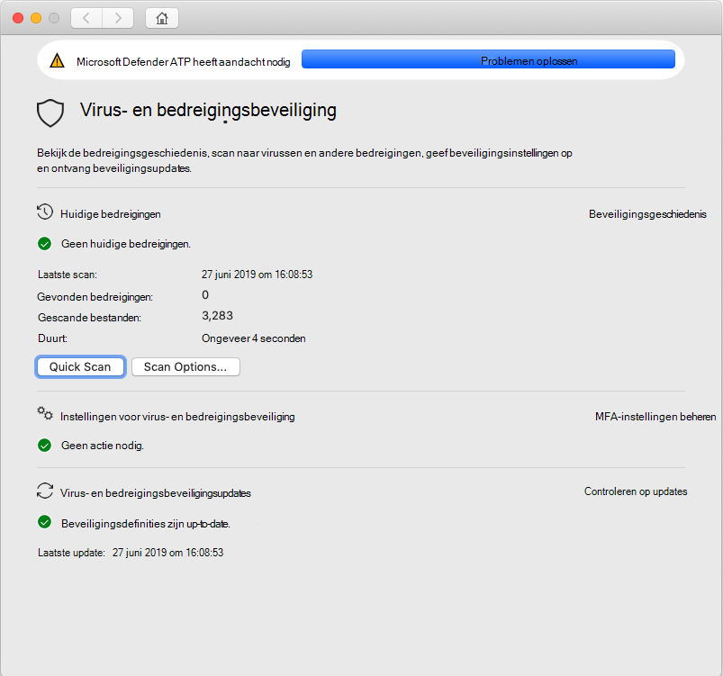
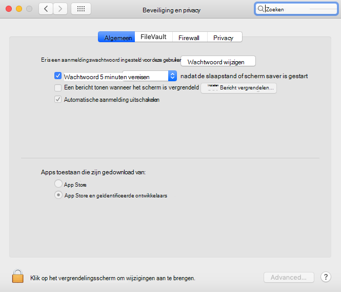

# <a name="troubleshoot-kernel-extension-issues-in-microsoft-defender-for-endpoint-for-mac"></a><span data-ttu-id="ee8f4-104">Problemen met kernelextensie oplossen in Microsoft Defender voor Eindpunt voor Mac</span><span class="sxs-lookup"><span data-stu-id="ee8f4-104">Troubleshoot kernel extension issues in Microsoft Defender for Endpoint for Mac</span></span>

[!INCLUDE [Microsoft 365 Defender rebranding](../../includes/microsoft-defender.md)]


<span data-ttu-id="ee8f4-105">**Van toepassing op:**</span><span class="sxs-lookup"><span data-stu-id="ee8f4-105">**Applies to:**</span></span>

- [<span data-ttu-id="ee8f4-106">Microsoft Defender voor Eindpunt voor Mac</span><span class="sxs-lookup"><span data-stu-id="ee8f4-106">Microsoft Defender for Endpoint for Mac</span></span>](microsoft-defender-endpoint-mac.md)
- [<span data-ttu-id="ee8f4-107">Microsoft Defender voor Endpoint</span><span class="sxs-lookup"><span data-stu-id="ee8f4-107">Microsoft Defender for Endpoint</span></span>](https://go.microsoft.com/fwlink/p/?linkid=2154037)
- [<span data-ttu-id="ee8f4-108">Microsoft 365 Defender</span><span class="sxs-lookup"><span data-stu-id="ee8f4-108">Microsoft 365 Defender</span></span>](https://go.microsoft.com/fwlink/?linkid=2118804)

> <span data-ttu-id="ee8f4-109">Wilt u Microsoft Defender voor Eindpunt ervaren?</span><span class="sxs-lookup"><span data-stu-id="ee8f4-109">Want to experience Microsoft Defender for Endpoint?</span></span> [<span data-ttu-id="ee8f4-110">Meld u aan voor een gratis proefabonnement.</span><span class="sxs-lookup"><span data-stu-id="ee8f4-110">Sign up for a free trial.</span></span>](https://www.microsoft.com/microsoft-365/windows/microsoft-defender-atp?ocid=docs-wdatp-exposedapis-abovefoldlink)

<span data-ttu-id="ee8f4-111">In dit artikel vindt u informatie over het oplossen van problemen met de kernelextensie die is geïnstalleerd als onderdeel van Microsoft Defender voor Eindpunt voor Mac.</span><span class="sxs-lookup"><span data-stu-id="ee8f4-111">This article provides information on how to troubleshoot issues with the kernel extension that is installed as part of Microsoft Defender for Endpoint for Mac.</span></span>

<span data-ttu-id="ee8f4-112">Vanaf macOS High Sierra (10.13) moeten alle kernelextensies expliciet worden goedgekeurd voordat ze op het apparaat mogen worden uitgevoerd.</span><span class="sxs-lookup"><span data-stu-id="ee8f4-112">Starting with macOS High Sierra (10.13), macOS requires all kernel extensions to be explicitly approved before they're allowed to run on the device.</span></span>

<span data-ttu-id="ee8f4-113">Als u de kernelextensie niet hebt goedgekeurd tijdens de implementatie/installatie van Microsoft Defender voor Eindpunt voor Mac, wordt in de toepassing een banner weergegeven waarin u wordt gevraagd deze in te stellen:</span><span class="sxs-lookup"><span data-stu-id="ee8f4-113">If you didn't approve the kernel extension during the deployment/installation of Microsoft Defender for Endpoint for Mac, the application displays a banner prompting you to enable it:</span></span>

   

<span data-ttu-id="ee8f4-115">U kunt ook ```mdatp health``` uitvoeren.</span><span class="sxs-lookup"><span data-stu-id="ee8f4-115">You can also run ```mdatp health```.</span></span> <span data-ttu-id="ee8f4-116">Er wordt melding gemaakt als realtimebeveiliging is ingeschakeld, maar niet beschikbaar is.</span><span class="sxs-lookup"><span data-stu-id="ee8f4-116">It reports if real-time protection is enabled but not available.</span></span> <span data-ttu-id="ee8f4-117">Dit geeft aan dat de kernelextensie niet is goedgekeurd voor gebruik op uw apparaat.</span><span class="sxs-lookup"><span data-stu-id="ee8f4-117">This indicates that the kernel extension isn't approved to run on your device.</span></span>

```bash
mdatp health
```
```Output
...
real_time_protection_enabled                : false
real_time_protection_available              : true
...
```

<span data-ttu-id="ee8f4-118">In de volgende secties vindt u richtlijnen voor het oplossen van dit probleem, afhankelijk van de methode die u hebt gebruikt om Microsoft Defender voor Eindpunt voor Mac te implementeren.</span><span class="sxs-lookup"><span data-stu-id="ee8f4-118">The following sections provide guidance on how to address this issue, depending on the method that you used to deploy Microsoft Defender for Endpoint for Mac.</span></span>

## <a name="managed-deployment"></a><span data-ttu-id="ee8f4-119">Beheerde implementatie</span><span class="sxs-lookup"><span data-stu-id="ee8f4-119">Managed deployment</span></span>

<span data-ttu-id="ee8f4-120">Zie de instructies die overeenkomen met het beheerprogramma dat u hebt gebruikt om het product te implementeren:</span><span class="sxs-lookup"><span data-stu-id="ee8f4-120">See the instructions corresponding to the management tool that you used to deploy the product:</span></span>

- [<span data-ttu-id="ee8f4-121">IMPLEMENTATIE OP BASIS VAN JAMF</span><span class="sxs-lookup"><span data-stu-id="ee8f4-121">JAMF-based deployment</span></span>](mac-install-with-jamf.md)
- [<span data-ttu-id="ee8f4-122">Microsoft Intune-implementatie</span><span class="sxs-lookup"><span data-stu-id="ee8f4-122">Microsoft Intune-based deployment</span></span>](mac-install-with-intune.md#create-system-configuration-profiles)

## <a name="manual-deployment"></a><span data-ttu-id="ee8f4-123">Handmatige implementatie</span><span class="sxs-lookup"><span data-stu-id="ee8f4-123">Manual deployment</span></span>

<span data-ttu-id="ee8f4-124">Als er minder dan 30 minuten zijn verstreken sinds het product is geïnstalleerd, gaat u naar Systeemvoorkeuren Beveiliging & Privacy, waar u systeemsoftware van ontwikkelaars   >  'Microsoft **Corporation'** moet toestaan. </span><span class="sxs-lookup"><span data-stu-id="ee8f4-124">If less than 30 minutes have passed since the product was installed, navigate to **System Preferences** > **Security & Privacy**, where you have to **Allow** system software from developers "Microsoft Corporation".</span></span>

<span data-ttu-id="ee8f4-125">Als u deze prompt niet ziet, betekent dit dat er 30 of meer minuten zijn verstreken en dat de kernelextensie nog steeds niet is goedgekeurd voor gebruik op uw apparaat:</span><span class="sxs-lookup"><span data-stu-id="ee8f4-125">If you don't see this prompt, it means that 30 or more minutes have passed, and the kernel extension still not been approved to run on your device:</span></span>



<span data-ttu-id="ee8f4-127">In dit geval moet u de volgende stappen uitvoeren om de goedkeuringsstroom opnieuw te activeren.</span><span class="sxs-lookup"><span data-stu-id="ee8f4-127">In this case, you need to perform the following steps to trigger the approval flow again.</span></span>

1. <span data-ttu-id="ee8f4-128">Probeer in Terminal het stuurprogramma te installeren.</span><span class="sxs-lookup"><span data-stu-id="ee8f4-128">In Terminal, attempt to install the driver.</span></span> <span data-ttu-id="ee8f4-129">De volgende bewerking mislukt, omdat de kernelextensie niet is goedgekeurd voor gebruik op het apparaat.</span><span class="sxs-lookup"><span data-stu-id="ee8f4-129">The following operation will fail, because the kernel extension wasn't approved to run on the device.</span></span> <span data-ttu-id="ee8f4-130">De goedkeuringsstroom wordt echter opnieuw in gang flow.</span><span class="sxs-lookup"><span data-stu-id="ee8f4-130">However, it will trigger the approval flow again.</span></span>

    ```bash
    sudo kextutil /Library/Extensions/wdavkext.kext
    ```
    
    ```Output
    Kext rejected due to system policy: <OSKext 0x7fc34d528390 [0x7fffa74aa8e0]> { URL = "file:///Library/StagedExtensions/Library/Extensions/wdavkext.kext/", ID = "com.microsoft.wdavkext" }
    Kext rejected due to system policy: <OSKext 0x7fc34d528390 [0x7fffa74aa8e0]> { URL = "file:///Library/StagedExtensions/Library/Extensions/wdavkext.kext/", ID = "com.microsoft.wdavkext" }
    Diagnostics for /Library/Extensions/wdavkext.kext:
    ```

2. <span data-ttu-id="ee8f4-131">Open **Systeemvoorkeuren**  >  **& privacy** in het menu.</span><span class="sxs-lookup"><span data-stu-id="ee8f4-131">Open **System Preferences** > **Security & Privacy** from the menu.</span></span> <span data-ttu-id="ee8f4-132">(Sluit deze eerst, als deze is geopend.)</span><span class="sxs-lookup"><span data-stu-id="ee8f4-132">(Close it first, if it's opened.)</span></span>

3. <span data-ttu-id="ee8f4-133">**Systeemsoftware** toestaan van ontwikkelaars "Microsoft Corporation"</span><span class="sxs-lookup"><span data-stu-id="ee8f4-133">**Allow** system software from developers "Microsoft Corporation"</span></span>

4. <span data-ttu-id="ee8f4-134">Installeer het stuurprogramma opnieuw in Terminal.</span><span class="sxs-lookup"><span data-stu-id="ee8f4-134">In Terminal, install the driver again.</span></span> <span data-ttu-id="ee8f4-135">Deze keer slaagt de bewerking:</span><span class="sxs-lookup"><span data-stu-id="ee8f4-135">This time the operation will succeed:</span></span>

    ```bash
    sudo kextutil /Library/Extensions/wdavkext.kext
    ```

    <span data-ttu-id="ee8f4-136">De banner moet verdwijnen uit de Defender-toepassing en moet nu melden dat ```mdatp health``` realtimebeveiliging is ingeschakeld en beschikbaar is:</span><span class="sxs-lookup"><span data-stu-id="ee8f4-136">The banner should disappear from the Defender application, and ```mdatp health``` should now report that real-time protection is both enabled and available:</span></span>

    ```bash
    mdatp health
    ```

    ```Output
    ...
    real_time_protection_enabled                : true
    real_time_protection_available              : true
    ...
    ```
