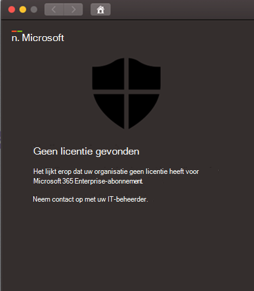

# Problemen met licenties oplossen voor Microsoft Defender voor Eindpunt op macOSTroubleshoot license issues for Microsoft Defender for Endpoint on macOS

[!INCLUDE [Microsoft 365 Defender rebranding](../../includes/microsoft-defender.md)]

**Van toepassing op:****Applies to:**

- [Microsoft Defender voor Eindpunt op macOSMicrosoft Defender for Endpoint on macOS](microsoft-defender-endpoint-mac.md)
- [Microsoft Defender voor EindpuntMicrosoft Defender for Endpoint](https://go.microsoft.com/fwlink/p/?linkid=2154037)
- [Microsoft 365 DefenderMicrosoft 365 Defender](https://go.microsoft.com/fwlink/?linkid=2118804)

> Wilt u Microsoft Defender voor Eindpunt ervaren?Want to experience Microsoft Defender for Endpoint? [Meld u aan voor een gratis proefabonnement.Sign up for a free trial.](https://www.microsoft.com/microsoft-365/windows/microsoft-defender-atp?ocid=docs-wdatp-exposedapis-abovefoldlink)

Terwijl u door Microsoft Defender voor Eindpunt  op [macOS](microsoft-defender-endpoint-mac.md) en Handmatige implementatietests of een Proof Of Concept (PoC) gaat, krijgt u mogelijk de volgende foutmelding:While you are going through [Microsoft Defender for Endpoint on macOS](microsoft-defender-endpoint-mac.md) and [Manual deployment](mac-install-manually.md) testing or a Proof Of Concept (PoC), you might get the following error:

**Bericht:****Message:** 

Geen licentie gevondenNo license found

Het lijkt erop dat uw organisatie geen licentie heeft voor Microsoft 365 Enterprise abonnement.Looks like your organization does not have a license for Microsoft 365 Enterprise subscription.

Neem contact op met uw beheerder voor hulp.Contact your administrator for help.

**Oorzaak:****Cause:** 

U hebt het Microsoft Defender voor Eindpunt voor macOS-pakket ('Installatiepakket downloaden') geïmplementeerd en/of geïnstalleerd, maar u hebt mogelijk het configuratiescript ("Onboarding-pakket downloaden" uitgevoerd), of u hebt geen licentie toegewezen aan de gebruiker.You deployed and/or installed the Microsoft Defender for Endpoint for macOS package ("Download installation package"), but you might have run the configuration script ("Download onboarding package"), or you have not assigned a license to the user.

**Oplossing:****Solution:**

Volg de MicrosoftDefenderATPOnboardingMacOs.py instructies die hier worden beschreven: [Clientconfiguratie](mac-install-manually.md#client-configuration)Follow the MicrosoftDefenderATPOnboardingMacOs.py instructions documented here: [Client configuration](mac-install-manually.md#client-configuration)
