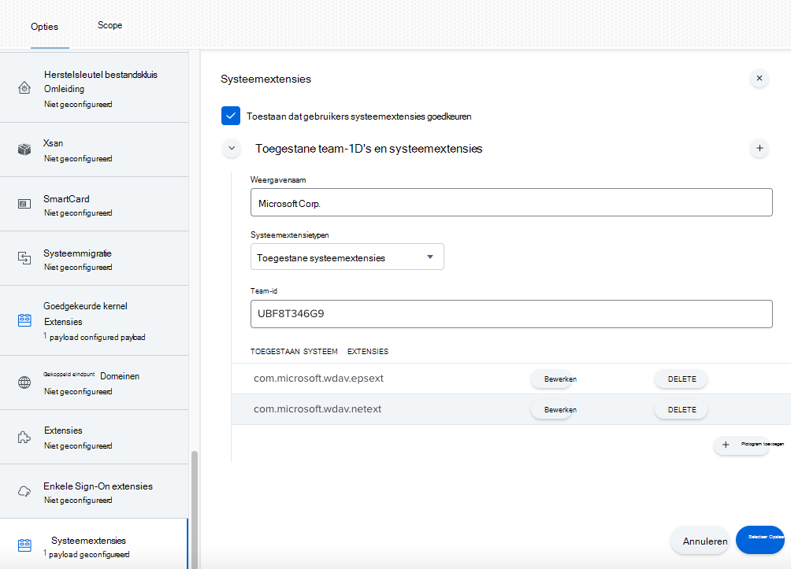
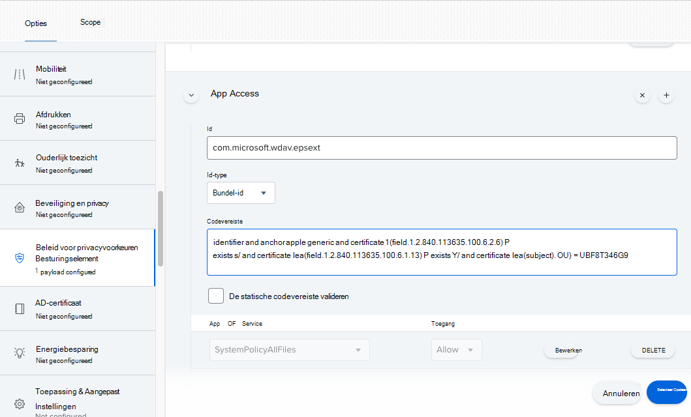
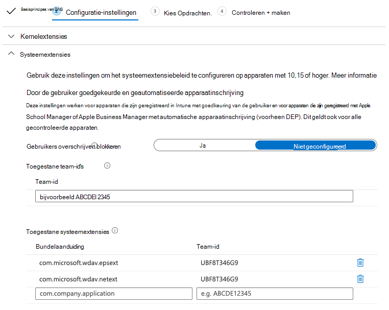
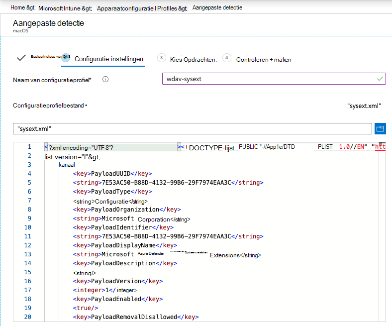

# <a name="new-configuration-profiles-for-macos-catalina-and-newer-versions-of-macos"></a>Nieuwe configuratieprofielen voor macOS Catalina en nieuwere versies van macOS

[!INCLUDE [Microsoft 365 Defender rebranding](../../includes/microsoft-defender.md)]

**Van toepassing op:**
- [Microsoft Defender voor Endpoint](https://go.microsoft.com/fwlink/p/?linkid=2146631)
- [Microsoft 365 Defender](https://go.microsoft.com/fwlink/?linkid=2118804)

> Wilt u Microsoft Defender voor Eindpunt ervaren? [Meld u aan voor een gratis proefabonnement.](https://www.microsoft.com/microsoft-365/windows/microsoft-defender-atp?ocid=docs-wdatp-exposedapis-abovefoldlink)

In overeenstemming met de ontwikkeling van macOS bereiden we een Update van Microsoft Defender voor Eindpunt voor Mac voor die gebruik maakt van systeemextensies in plaats van kernelextensies. Deze update is alleen van toepassing op macOS Catalina (10.15.4) en nieuwere versies van macOS.

Als u Microsoft Defender voor Eindpunt voor Mac hebt geïmplementeerd in een beheerde omgeving (via JAMF, Intune of een andere MDM-oplossing), moet u nieuwe configuratieprofielen implementeren. Als u deze stappen niet doet, krijgen gebruikers goedkeuringsprompts om deze nieuwe onderdelen uit te voeren.

## <a name="jamf"></a>JAMF

### <a name="system-extensions-policy"></a>Systeemextensiesbeleid

Als u de systeemextensies wilt goedkeuren, maakt u de volgende payload:

1. In **Computers > configuratieprofielen selecteert** **u Opties > Systeemextensies.**
2. Selecteer **Toegestane systeemextensies** in de vervolgkeuzelijst Systeemextensietypen. 
3. Gebruik **UBF8T346G9** voor Team-id.
4. Voeg de volgende bundelaanduidingen toe aan de **lijst Toegestane systeemextensies:**

    - **com.microsoft.wdav.epsext**
    - **com.microsoft.wdav.netext**

    

### <a name="privacy-preferences-policy-control"></a>Beleidsbesturingselement privacyvoorkeuren

Voeg de volgende JAMF-payload toe om Volledige schijftoegang toe te staan aan de Microsoft Defender for Endpoint Endpoint Security Extension. Dit beleid is een vereiste voor het uitvoeren van de extensie op uw apparaat.

1. Selecteer **Opties**  >  **Privacyvoorkeuren Beleidsbesturingselement**.
2. Gebruik `com.microsoft.wdav.epsext` dit als id **en** `Bundle ID` als **bundeltype.**
3. Codevereiste instellen op `identifier "com.microsoft.wdav.epsext" and anchor apple generic and certificate 1[field.1.2.840.113635.100.6.2.6] /* exists */ and certificate leaf[field.1.2.840.113635.100.6.1.13] /* exists */ and certificate leaf[subject.OU] = UBF8T346G9`
4. App **of service instellen** op **SystemPolicyAllFiles en** toegang tot **Toestaan.**

    

### <a name="network-extension-policy"></a>Netwerkextensiebeleid

Als onderdeel van de mogelijkheden voor endpointdetectie en -reactie controleert Microsoft Defender voor Endpoint voor Mac socketverkeer en rapporteert deze informatie aan de microsoft Defender-beveiligingscentrumportal. Met het volgende beleid kan de netwerkextensie deze functionaliteit uitvoeren.

>[!NOTE]
>JAMF heeft geen ingebouwde ondersteuning voor inhoudsfilterbeleid, wat een vereiste is voor het inschakelen van de netwerkextensies die Microsoft Defender voor Eindpunt voor Mac op het apparaat installeert. Bovendien verandert JAMF soms de inhoud van het beleid dat wordt geïmplementeerd.
>Als zodanig bieden de volgende stappen een tijdelijke oplossing voor het ondertekenen van het configuratieprofiel.

1. Sla de volgende inhoud op uw apparaat op als `com.microsoft.network-extension.mobileconfig` een teksteditor:

    ```xml
    <?xml version="1.0" encoding="UTF-8"?><!DOCTYPE plist PUBLIC "-//Apple//DTD PLIST 1.0//EN" "http://www.apple.com/DTDs/PropertyList-1.0.dtd">
    <plist version="1">
        <dict>
            <key>PayloadUUID</key>
            <string>DA2CC794-488B-4AFF-89F7-6686A7E7B8AB</string>
            <key>PayloadType</key>
            <string>Configuration</string>
            <key>PayloadOrganization</key>
            <string>Microsoft Corporation</string>
            <key>PayloadIdentifier</key>
            <string>DA2CC794-488B-4AFF-89F7-6686A7E7B8AB</string>
            <key>PayloadDisplayName</key>
            <string>Microsoft Defender ATP Network Extension</string>
            <key>PayloadDescription</key>
            <string/>
            <key>PayloadVersion</key>
            <integer>1</integer>
            <key>PayloadEnabled</key>
            <true/>
            <key>PayloadRemovalDisallowed</key>
            <true/>
            <key>PayloadScope</key>
            <string>System</string>
            <key>PayloadContent</key>
            <array>
                <dict>
                    <key>PayloadUUID</key>
                    <string>2BA070D9-2233-4827-AFC1-1F44C8C8E527</string>
                    <key>PayloadType</key>
                    <string>com.apple.webcontent-filter</string>
                    <key>PayloadOrganization</key>
                    <string>Microsoft Corporation</string>
                    <key>PayloadIdentifier</key>
                    <string>CEBF7A71-D9A1-48BD-8CCF-BD9D18EC155A</string>
                    <key>PayloadDisplayName</key>
                    <string>Approved Network Extension</string>
                    <key>PayloadDescription</key>
                    <string/>
                    <key>PayloadVersion</key>
                    <integer>1</integer>
                    <key>PayloadEnabled</key>
                    <true/>
                    <key>FilterType</key>
                    <string>Plugin</string>
                    <key>UserDefinedName</key>
                    <string>Microsoft Defender ATP Network Extension</string>
                    <key>PluginBundleID</key>
                    <string>com.microsoft.wdav</string>
                    <key>FilterSockets</key>
                    <true/>
                    <key>FilterDataProviderBundleIdentifier</key>
                    <string>com.microsoft.wdav.netext</string>
                    <key>FilterDataProviderDesignatedRequirement</key>
                    <string>identifier "com.microsoft.wdav.netext" and anchor apple generic and certificate 1[field.1.2.840.113635.100.6.2.6] /* exists */ and certificate leaf[field.1.2.840.113635.100.6.1.13] /* exists */ and certificate leaf[subject.OU] = UBF8T346G9</string>
                </dict>
            </array>
        </dict>
    </plist>
    ```

2. Controleer of het bovenstaande bestand correct is gekopieerd door het hulpprogramma in de `plutil` Terminal uit te werken:

    ```bash
    $ plutil -lint <PathToFile>/com.microsoft.network-extension.mobileconfig
    ```

    Als het bestand bijvoorbeeld is opgeslagen in Documenten:

    ```bash
    $ plutil -lint ~/Documents/com.microsoft.network-extension.mobileconfig
    ```
    
    Controleer of de opdracht wordt `OK` uitgevoerd.
        
    ```bash
    <PathToFile>/com.microsoft.network-extension.mobileconfig: OK
    ```
    
3. Volg de instructies op [deze pagina om](https://www.jamf.com/jamf-nation/articles/649/creating-a-signing-certificate-using-jamf-pro-s-built-in-certificate-authority) een handtekeningcertificaat te maken met de ingebouwde certificeringsinstantie van JAMF.

4. Nadat het certificaat is gemaakt en geïnstalleerd op uw apparaat, voer u de volgende opdracht uit vanaf de terminal om het bestand te ondertekenen:

    ```bash
    $ security cms -S -N "<CertificateName>" -i <PathToFile>/com.microsoft.network-extension.mobileconfig -o <PathToSignedFile>/com.microsoft.network-extension.signed.mobileconfig
    ```
    
    Als de certificaatnaam bijvoorbeeld **SignCertificate** is en het ondertekende bestand wordt opgeslagen in Documenten:
    
    ```bash
    $ security cms -S -N "SigningCertificate" -i ~/Documents/com.microsoft.network-extension.mobileconfig -o ~/Documents/com.microsoft.network-extension.signed.mobileconfig
    ```
    
5. Ga vanuit de JAMF-portal naar **Configuratieprofielen** en klik op de **knop** Uploaden. Selecteer `com.microsoft.network-extension.signed.mobileconfig` wanneer u om het bestand wordt gevraagd.

## <a name="intune"></a>Intune

### <a name="system-extensions-policy"></a>Systeemextensiesbeleid

De systeemextensies goedkeuren:

1. Open in Intune   >  **Apparaatconfiguratie beheren.** Selecteer **Profielen beheren**  >  **Profiel**  >  **maken.**
2. Kies een naam voor het profiel. **Platform=macOS wijzigen** in **Profieltype=Extensies**. Selecteer **Maken**. 
3. Geef op `Basics` het tabblad een naam aan dit nieuwe profiel.
4. Voeg op `Configuration settings` het tabblad de volgende vermeldingen toe in de `Allowed system extensions` sectie:

    Bundelaanduiding         | Team-id
    --------------------------|----------------
    com.microsoft.wdav.epsext | UBF8T346G9
    com.microsoft.wdav.netext | UBF8T346G9

    

5. Wijs dit profiel op het tabblad toe `Assignments` aan alle gebruikers & alle **apparaten.**
6. Controleer en maak dit configuratieprofiel.

### <a name="create-and-deploy-the-custom-configuration-profile"></a>Het aangepaste configuratieprofiel maken en implementeren

Het volgende configuratieprofiel maakt de netwerkextensie mogelijk en verleent volledige schijftoegang aan de systeemextensie Endpoint Security. 

Sla de volgende inhoud op in een bestand met **desysext.xml:**

```xml
<?xml version="1.0" encoding="UTF-8"?><!DOCTYPE plist PUBLIC "-//Apple//DTD PLIST 1.0//EN" "http://www.apple.com/DTDs/PropertyList-1.0.dtd">
<plist version="1">
    <dict>
        <key>PayloadUUID</key>
        <string>7E53AC50-B88D-4132-99B6-29F7974EAA3C</string>
        <key>PayloadType</key>
        <string>Configuration</string>
        <key>PayloadOrganization</key>
        <string>Microsoft Corporation</string>
        <key>PayloadIdentifier</key>
        <string>7E53AC50-B88D-4132-99B6-29F7974EAA3C</string>
        <key>PayloadDisplayName</key>
        <string>Microsoft Defender ATP System Extensions</string>
        <key>PayloadDescription</key>
        <string/>
        <key>PayloadVersion</key>
        <integer>1</integer>
        <key>PayloadEnabled</key>
        <true/>
        <key>PayloadRemovalDisallowed</key>
        <true/>
        <key>PayloadScope</key>
        <string>System</string>
        <key>PayloadContent</key>
        <array>
            <dict>
                <key>PayloadUUID</key>
                <string>2BA070D9-2233-4827-AFC1-1F44C8C8E527</string>
                <key>PayloadType</key>
                <string>com.apple.webcontent-filter</string>
                <key>PayloadOrganization</key>
                <string>Microsoft Corporation</string>
                <key>PayloadIdentifier</key>
                <string>CEBF7A71-D9A1-48BD-8CCF-BD9D18EC155A</string>
                <key>PayloadDisplayName</key>
                <string>Approved Network Extension</string>
                <key>PayloadDescription</key>
                <string/>
                <key>PayloadVersion</key>
                <integer>1</integer>
                <key>PayloadEnabled</key>
                <true/>
                <key>FilterType</key>
                <string>Plugin</string>
                <key>UserDefinedName</key>
                <string>Microsoft Defender ATP Network Extension</string>
                <key>PluginBundleID</key>
                <string>com.microsoft.wdav</string>
                <key>FilterSockets</key>
                <true/>
                <key>FilterDataProviderBundleIdentifier</key>
                <string>com.microsoft.wdav.netext</string>
                <key>FilterDataProviderDesignatedRequirement</key>
                <string>identifier &quot;com.microsoft.wdav.netext&quot; and anchor apple generic and certificate 1[field.1.2.840.113635.100.6.2.6] /* exists */ and certificate leaf[field.1.2.840.113635.100.6.1.13] /* exists */ and certificate leaf[subject.OU] = UBF8T346G9</string>
            </dict>
            <dict>
                <key>PayloadUUID</key>
                <string>56105E89-C7C8-4A95-AEE6-E11B8BEA0366</string>
                <key>PayloadType</key>
                <string>com.apple.TCC.configuration-profile-policy</string>
                <key>PayloadOrganization</key>
                <string>Microsoft Corporation</string>
                <key>PayloadIdentifier</key>
                <string>56105E89-C7C8-4A95-AEE6-E11B8BEA0366</string>
                <key>PayloadDisplayName</key>
                <string>Privacy Preferences Policy Control</string>
                <key>PayloadDescription</key>
                <string/>
                <key>PayloadVersion</key>
                <integer>1</integer>
                <key>PayloadEnabled</key>
                <true/>
                <key>Services</key>
                <dict>
                    <key>SystemPolicyAllFiles</key>
                    <array>
                        <dict>
                            <key>Identifier</key>
                            <string>com.microsoft.wdav.epsext</string>
                            <key>CodeRequirement</key>
                            <string>identifier "com.microsoft.wdav.epsext" and anchor apple generic and certificate 1[field.1.2.840.113635.100.6.2.6] /* exists */ and certificate leaf[field.1.2.840.113635.100.6.1.13] /* exists */ and certificate leaf[subject.OU] = UBF8T346G9</string>
                            <key>IdentifierType</key>
                            <string>bundleID</string>
                            <key>StaticCode</key>
                            <integer>0</integer>
                            <key>Allowed</key>
                            <integer>1</integer>
                        </dict>
                    </array>
                </dict>
            </dict>
        </array>
    </dict>
</plist>
```

Controleer of het bovenstaande bestand correct is gekopieerd. Voer vanuit de Terminal de volgende opdracht uit en controleer of deze wordt `OK` uitgevoerd:

```bash
$ plutil -lint sysext.xml
sysext.xml: OK
```

Dit aangepaste configuratieprofiel implementeren:

1.  Open in Intune   >  **Apparaatconfiguratie beheren.** Selecteer **Profielen beheren**  >  **Profiel**  >  **maken.**
2. Kies een naam voor het profiel. **Platform=macOS en** **Profieltype=Aangepast wijzigen.** Selecteer **Configureren**.
3.  Open het configuratieprofiel en upload **sysext.xml.** Dit bestand is gemaakt in de vorige stap.
4.  Kies **OK**.

    

5. Wijs dit profiel op het tabblad toe `Assignments` aan alle gebruikers & alle **apparaten.**
6. Controleer en maak dit configuratieprofiel.
