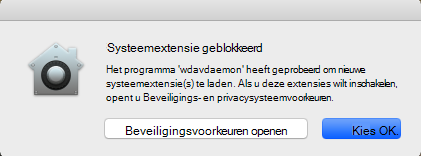
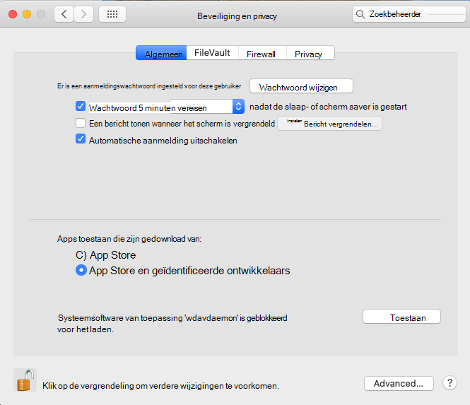
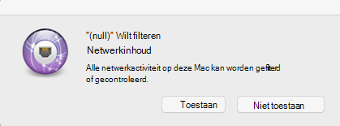
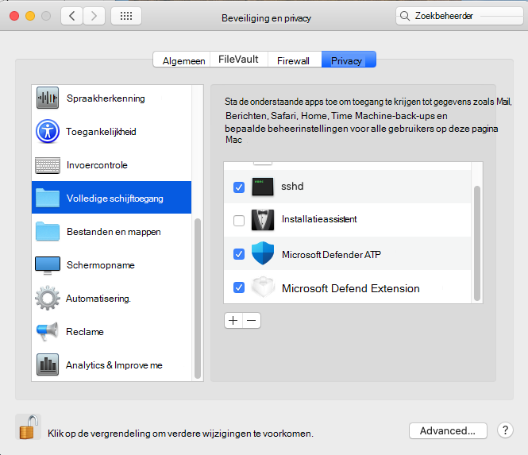

# <a name="microsoft-defender-for-endpoint-on-macos---system-extensions-public-preview"></a><span data-ttu-id="525aa-105">Microsoft Defender for Endpoint on macOS - system extensions public preview)</span><span class="sxs-lookup"><span data-stu-id="525aa-105">Microsoft Defender for Endpoint on macOS - system extensions public preview)</span></span>

<span data-ttu-id="525aa-106">**Van toepassing op:**</span><span class="sxs-lookup"><span data-stu-id="525aa-106">**Applies to:**</span></span>
- [<span data-ttu-id="525aa-107">Microsoft Defender voor Eindpunt</span><span class="sxs-lookup"><span data-stu-id="525aa-107">Microsoft Defender for Endpoint</span></span>](https://go.microsoft.com/fwlink/p/?linkid=2154037)
- [<span data-ttu-id="525aa-108">Microsoft 365 Defender</span><span class="sxs-lookup"><span data-stu-id="525aa-108">Microsoft 365 Defender</span></span>](https://go.microsoft.com/fwlink/?linkid=2118804)

> <span data-ttu-id="525aa-109">Wilt u Microsoft Defender voor Eindpunt ervaren?</span><span class="sxs-lookup"><span data-stu-id="525aa-109">Want to experience Microsoft Defender for Endpoint?</span></span> [<span data-ttu-id="525aa-110">Meld u aan voor een gratis proefabonnement.</span><span class="sxs-lookup"><span data-stu-id="525aa-110">Sign up for a free trial.</span></span>](https://www.microsoft.com/microsoft-365/windows/microsoft-defender-atp?ocid=docs-wdatp-exposedapis-abovefoldlink)

<span data-ttu-id="525aa-111">In overeenstemming met de ontwikkeling van macOS bereiden we een Defender voor Endpoint voor Mac-update voor die gebruik maakt van systeemextensies in plaats van kernelextensies.</span><span class="sxs-lookup"><span data-stu-id="525aa-111">In alignment with macOS evolution, we are preparing a Defender for Endpoint for Mac update that leverages system extensions instead of kernel extensions.</span></span> <span data-ttu-id="525aa-112">Deze update is alleen van toepassing op macOS Catalina (10.15.4) en latere versies van macOS.</span><span class="sxs-lookup"><span data-stu-id="525aa-112">This update will only apply to macOS Catalina (10.15.4) and later versions of macOS.</span></span>

<span data-ttu-id="525aa-113">Deze functionaliteit is momenteel beschikbaar in een openbaar voorbeeld.</span><span class="sxs-lookup"><span data-stu-id="525aa-113">This functionality is currently in public preview.</span></span> <span data-ttu-id="525aa-114">In dit artikel wordt beschreven hoe u deze functionaliteit op uw apparaat kunt inschakelen.</span><span class="sxs-lookup"><span data-stu-id="525aa-114">This article describes how to enable this functionality on your device.</span></span> <span data-ttu-id="525aa-115">U kunt deze functie lokaal uitproberen op uw eigen apparaat of op afstand configureren via een beheerhulpmiddel.</span><span class="sxs-lookup"><span data-stu-id="525aa-115">You can try out this feature locally on your own device or configure it remotely through a management tool.</span></span>

<span data-ttu-id="525aa-116">In deze stappen wordt ervan uitgenomen dat Defender for Endpoint al op uw apparaat wordt uitgevoerd.</span><span class="sxs-lookup"><span data-stu-id="525aa-116">These steps assume you already have Defender for Endpoint running on your device.</span></span> <span data-ttu-id="525aa-117">Zie deze pagina voor [meer informatie.](microsoft-defender-endpoint-mac.md)</span><span class="sxs-lookup"><span data-stu-id="525aa-117">For more information, see [this page](microsoft-defender-endpoint-mac.md).</span></span>

## <a name="known-issues"></a><span data-ttu-id="525aa-118">Bekende problemen</span><span class="sxs-lookup"><span data-stu-id="525aa-118">Known issues</span></span>

- <span data-ttu-id="525aa-119">We hebben rapporten ontvangen over de netwerkextensie die de Apple SSO Kerberos-extensie verstoort.</span><span class="sxs-lookup"><span data-stu-id="525aa-119">We’ve received reports of the network extension interfering with the Apple SSO Kerberos extension.</span></span>
- <span data-ttu-id="525aa-120">De huidige versie van het product installeert nog steeds een kernelextensie.</span><span class="sxs-lookup"><span data-stu-id="525aa-120">The current version of the product still installs a kernel extension.</span></span> <span data-ttu-id="525aa-121">De kernelextensie wordt alleen gebruikt als een fallback-mechanisme en wordt verwijderd voordat deze functie een openbare preview bereikt.</span><span class="sxs-lookup"><span data-stu-id="525aa-121">The kernel extension is only used as a fallback mechanism and will be removed before this feature reaches public preview.</span></span>
- <span data-ttu-id="525aa-122">We werken nog steeds aan een productversie die correct wordt geïmplementeerd en werkt op macOS 11 Big Sur.</span><span class="sxs-lookup"><span data-stu-id="525aa-122">We're still working on a product version that deploys and functions properly on macOS 11 Big Sur.</span></span>

## <a name="deployment-prerequisites"></a><span data-ttu-id="525aa-123">Implementatie-vereisten</span><span class="sxs-lookup"><span data-stu-id="525aa-123">Deployment prerequisites</span></span>

- <span data-ttu-id="525aa-124">Minimale macOS-besturingssysteemversie: **10.15.4**</span><span class="sxs-lookup"><span data-stu-id="525aa-124">Minimum macOS operating system version: **10.15.4**</span></span>
- <span data-ttu-id="525aa-125">Minimale productversie: **101.03.73**</span><span class="sxs-lookup"><span data-stu-id="525aa-125">Minimum product version: **101.03.73**</span></span>
- <span data-ttu-id="525aa-126">Uw apparaat moet zich in het **Insider Fast-updatekanaal hebben.**</span><span class="sxs-lookup"><span data-stu-id="525aa-126">Your device must be in the **Insider Fast update channel**.</span></span> <span data-ttu-id="525aa-127">U kunt het updatekanaal controleren met de volgende opdracht:</span><span class="sxs-lookup"><span data-stu-id="525aa-127">You can check the update channel by using the following command:</span></span>

  ```bash
  mdatp health --field release_ring
  ```

  <span data-ttu-id="525aa-128">Als uw apparaat zich nog niet in het Insider Fast-updatekanaal heeft, voert u de volgende opdracht uit vanuit de Terminal.</span><span class="sxs-lookup"><span data-stu-id="525aa-128">If your device isn't already in the Insider Fast update channel, execute the following command from the Terminal.</span></span> <span data-ttu-id="525aa-129">De kanaalupdate wordt van kracht wanneer het product de volgende keer wordt gestart (wanneer de volgende productupdate is geïnstalleerd of wanneer het apparaat opnieuw wordt opgestart).</span><span class="sxs-lookup"><span data-stu-id="525aa-129">The channel update takes effect the next time the product starts (when the next product update is installed, or when the device is rebooted).</span></span>

  ```bash
  defaults write com.microsoft.autoupdate2 ChannelName -string Beta
  ```

  <span data-ttu-id="525aa-130">Als u zich in een beheerde omgeving (JAMF of Intune) hebt, kunt u het updatekanaal ook op afstand configureren.</span><span class="sxs-lookup"><span data-stu-id="525aa-130">Alternatively, if you're in a managed environment (JAMF or Intune), you can configure the update channel remotely.</span></span> <span data-ttu-id="525aa-131">Zie Updates implementeren voor Microsoft Defender voor Eindpunt voor Mac voor meer [informatie: De kanaalnaam instellen.](mac-updates.md#set-the-channel-name)</span><span class="sxs-lookup"><span data-stu-id="525aa-131">For more information, see [Deploy updates for Microsoft Defender for Endpoint for Mac: Set the channel name](mac-updates.md#set-the-channel-name).</span></span>

## <a name="deployment-steps"></a><span data-ttu-id="525aa-132">Implementatiestappen</span><span class="sxs-lookup"><span data-stu-id="525aa-132">Deployment steps</span></span>

<span data-ttu-id="525aa-133">Volg de implementatiestappen die overeenkomen met uw omgeving en de gewenste methode om deze functie uit te proberen.</span><span class="sxs-lookup"><span data-stu-id="525aa-133">Follow the deployment steps that correspond to your environment and your preferred method of trying out this feature.</span></span>

### <a name="manual-deployment"></a><span data-ttu-id="525aa-134">Handmatige implementatie</span><span class="sxs-lookup"><span data-stu-id="525aa-134">Manual deployment</span></span>

#### <a name="approve-the-system-extensions-and-enable-the-network-extension"></a><span data-ttu-id="525aa-135">De systeemextensies goedkeuren en de netwerkextensie inschakelen</span><span class="sxs-lookup"><span data-stu-id="525aa-135">Approve the system extensions and enable the network extension</span></span>

1. <span data-ttu-id="525aa-136">Nadat aan alle implementatievoorwaarden is voldaan, start u het apparaat opnieuw op om de goedkeuring en activering van de systeemextensie te starten.</span><span class="sxs-lookup"><span data-stu-id="525aa-136">After all deployment prerequisites are met, restart your device to launch the system extension approval and activation process.</span></span>

   <span data-ttu-id="525aa-137">U ziet een reeks systeemprompts om de systeemextensies van Defender voor Eindpunt goed te keuren.</span><span class="sxs-lookup"><span data-stu-id="525aa-137">You'll see a series of system prompts to approve the Defender for Endpoint system extensions.</span></span> <span data-ttu-id="525aa-138">U moet alle **aanwijzingen** uit de reeks goedkeuren, omdat voor macOS een expliciete goedkeuring is vereist voor elke extensie die Defender voor Eindpunt voor Mac op het apparaat installeert.</span><span class="sxs-lookup"><span data-stu-id="525aa-138">You must approve **all** prompts from the series, because macOS requires an explicit approval for each extension that Defender for Endpoint for Mac installs on the device.</span></span>
   
   <span data-ttu-id="525aa-139">Voor elke goedkeuring selecteert u **Beveiligingsvoorkeuren** openen en **selecteert** u Toestaan dat de systeemextensie wordt uitgevoerd.</span><span class="sxs-lookup"><span data-stu-id="525aa-139">For each approval, select **Open Security Preferences** and then select **Allow** to allow the system extension to run.</span></span>

   > [!IMPORTANT]
   > <span data-ttu-id="525aa-140">U moet het beveiligingsvenster voor **systeemvoorkeuren**& tussen de volgende goedkeuringen sluiten en  >   opnieuw openen.</span><span class="sxs-lookup"><span data-stu-id="525aa-140">You must close and reopen the **System Preferences** > **Security & Privacy** window between subsequent approvals.</span></span> <span data-ttu-id="525aa-141">Anders wordt de volgende goedkeuring niet weergegeven in MacOS.</span><span class="sxs-lookup"><span data-stu-id="525aa-141">Otherwise, macOS will not display the next approval.</span></span>

   > [!IMPORTANT]
   > <span data-ttu-id="525aa-142">Er is een time-out van één minuut voordat het product terugvalt naar de kernelextensie.</span><span class="sxs-lookup"><span data-stu-id="525aa-142">There is a one-minute timeout before the product falls back to the kernel extension.</span></span> <span data-ttu-id="525aa-143">Dit zorgt ervoor dat het apparaat is beveiligd.</span><span class="sxs-lookup"><span data-stu-id="525aa-143">This ensures that the device is protected.</span></span>
   >
   > <span data-ttu-id="525aa-144">Als er meer dan één minuut verstreken is, start u de daemon opnieuw op door het apparaat opnieuw op te starten of door de goedkeuringsstroom opnieuw `sudo killall -9 wdavdaemon` te activeren.</span><span class="sxs-lookup"><span data-stu-id="525aa-144">If more than one minute elapses, restart the daemon by rebooting the device or by using `sudo killall -9 wdavdaemon` to trigger the approval flow again.</span></span>

   

   

1. <span data-ttu-id="525aa-147">Nadat de systeemextensies zijn goedgekeurd, wordt in MacOS gevraagd of het netwerkverkeer moet worden gefilterd.</span><span class="sxs-lookup"><span data-stu-id="525aa-147">After the system extensions are approved, macOS prompts for an approval to allow network traffic to be filtered.</span></span> <span data-ttu-id="525aa-148">Klik **op Toestaan.**</span><span class="sxs-lookup"><span data-stu-id="525aa-148">Click **Allow**.</span></span>

   

#### <a name="grant-full-disk-access-to-the-endpoint-security-system-extension"></a><span data-ttu-id="525aa-150">Volledige schijftoegang verlenen aan de systeemextensie Endpoint Security</span><span class="sxs-lookup"><span data-stu-id="525aa-150">Grant Full Disk Access to the Endpoint Security system extension</span></span>

<span data-ttu-id="525aa-151">Open het **tabblad Privacy** privacy & systeemvoorkeuren en verleen volledige schijftoegang aan de  >    >   Microsoft Defender **Endpoint-beveiligingsextensie.** </span><span class="sxs-lookup"><span data-stu-id="525aa-151">Open the **System Preferences** > **Security & Privacy** > **Privacy** tab and grant **Full Disk Access** to the **Microsoft Defender Endpoint Security Extension**.</span></span>



#### <a name="reboot-your-device"></a><span data-ttu-id="525aa-153">Uw apparaat opnieuw opstarten</span><span class="sxs-lookup"><span data-stu-id="525aa-153">Reboot your device</span></span>

<span data-ttu-id="525aa-154">Om de wijzigingen van kracht te laten worden, moet u het apparaat opnieuw opstarten.</span><span class="sxs-lookup"><span data-stu-id="525aa-154">In order for the changes to take effect, you must reboot your device.</span></span>

#### <a name="verify-that-the-system-extensions-are-running"></a><span data-ttu-id="525aa-155">Controleren of de systeemextensies worden uitgevoerd</span><span class="sxs-lookup"><span data-stu-id="525aa-155">Verify that the system extensions are running</span></span>

<span data-ttu-id="525aa-156">Voer vanuit de Terminal de volgende opdracht uit:</span><span class="sxs-lookup"><span data-stu-id="525aa-156">From the Terminal, run the following command:</span></span>

```bash
mdatp health --field real_time_protection_subsystem
```

<span data-ttu-id="525aa-157">`endpoint_security_extension`Terminaluitvoer geeft aan dat het product de functionaliteit voor systeemextensies gebruikt.</span><span class="sxs-lookup"><span data-stu-id="525aa-157">Terminal output `endpoint_security_extension` indicates the product is using the system extensions functionality.</span></span>

### <a name="managed-deployment"></a><span data-ttu-id="525aa-158">Beheerde implementatie</span><span class="sxs-lookup"><span data-stu-id="525aa-158">Managed deployment</span></span>

<span data-ttu-id="525aa-159">Raadpleeg [Nieuwe configuratieprofielen voor macOS Catalina](mac-sysext-policies.md#jamf) en nieuwere versies van macOS: JAMF voor de nieuwe configuratieprofielen die u moet implementeren voor deze nieuwe functie.</span><span class="sxs-lookup"><span data-stu-id="525aa-159">Refer to [New configuration profiles for macOS Catalina and newer versions of macOS: JAMF](mac-sysext-policies.md#jamf) for the new configuration profiles you must deploy for this new feature.</span></span>

<span data-ttu-id="525aa-160">Naast deze profielen moet u de doelapparaten configureren in het Insider Fast-updatekanaal, zoals wordt beschreven in [implementatievoorwaarden.](#deployment-prerequisites)</span><span class="sxs-lookup"><span data-stu-id="525aa-160">In addition to those profiles, make sure to configure the target devices to be in the Insider Fast update channel, as described in [Deployment prerequisites](#deployment-prerequisites).</span></span>

<span data-ttu-id="525aa-161">Voer de volgende opdracht uit op een apparaat waar aan alle vereisten is voldaan en de nieuwe configuratieprofielen zijn geïmplementeerd:</span><span class="sxs-lookup"><span data-stu-id="525aa-161">On a device where all prerequisites are met and the new configuration profiles have been deployed, run the following command:</span></span>

```bash
$ mdatp health --field real_time_protection_subsystem
```

<span data-ttu-id="525aa-162">Als deze opdracht wordt `endpoint_security_extension` afgedrukt, gebruikt het product de systeemextensiesfunctionaliteit.</span><span class="sxs-lookup"><span data-stu-id="525aa-162">If this command prints `endpoint_security_extension`, the product is using the system extensions functionality.</span></span>

## <a name="validate-basic-scenarios"></a><span data-ttu-id="525aa-163">Basisscenario's valideren</span><span class="sxs-lookup"><span data-stu-id="525aa-163">Validate basic scenarios</span></span>

1. <span data-ttu-id="525aa-164">Test de EICAR-detectie (European Institute for Computer Antivirus Research).</span><span class="sxs-lookup"><span data-stu-id="525aa-164">Test European Institute for Computer Antivirus Research (EICAR) detection.</span></span> <span data-ttu-id="525aa-165">Voer vanuit een terminalvenster de volgende opdracht uit:</span><span class="sxs-lookup"><span data-stu-id="525aa-165">From a Terminal window, run the following command:</span></span>

   ```bash
   curl -o eicar.txt https://secure.eicar.org/eicar.com.txt
   ```

   <span data-ttu-id="525aa-166">Controleer of het EICAR-bestand in quarantaine is geplaatst.</span><span class="sxs-lookup"><span data-stu-id="525aa-166">Verify that the EICAR file is quarantined.</span></span> <span data-ttu-id="525aa-167">U kunt de status van het bestand controleren op de pagina Beschermingsgeschiedenis in de gebruikersinterface of vanaf een opdrachtregel met de volgende opdracht:</span><span class="sxs-lookup"><span data-stu-id="525aa-167">You can verify the file's status on the Protection History page in the user interface, or from a command line by using the following command:</span></span>

    ```bash
    mdatp threat list
    ```

2. <span data-ttu-id="525aa-168">Test het scenario Endpoint Detection and Response (EDR).</span><span class="sxs-lookup"><span data-stu-id="525aa-168">Test the Endpoint Detection and Response (EDR) DIY scenario.</span></span> <span data-ttu-id="525aa-169">Voer vanuit een terminalvenster de volgende opdracht uit:</span><span class="sxs-lookup"><span data-stu-id="525aa-169">From a terminal window, run the following command:</span></span>

   ```bash
   curl -o "MDATP MacOS DIY.zip" https://aka.ms/mdatpmacosdiy
   ```

   <span data-ttu-id="525aa-170">Controleer of er twee waarschuwingen zijn weergegeven in de portal op de computerpagina voor EICAR- en EDR-doe-het-zelfscenario's.</span><span class="sxs-lookup"><span data-stu-id="525aa-170">Validate that two alerts popped up in the portal on the machine page for EICAR and EDR DIY scenarios.</span></span>

## <a name="frequently-asked-questions"></a><span data-ttu-id="525aa-171">Veelgestelde vragen</span><span class="sxs-lookup"><span data-stu-id="525aa-171">Frequently asked questions</span></span>

- <span data-ttu-id="525aa-172">V: Waarom zie ik nog steeds `kernel_extension` wanneer ik `mdatp health --field real_time_protection_subsystem` voer?</span><span class="sxs-lookup"><span data-stu-id="525aa-172">Q: Why am I still seeing `kernel_extension` when I run `mdatp health --field real_time_protection_subsystem`?</span></span>

    <span data-ttu-id="525aa-173">A: Ga terug naar de sectie [Implementatie-vereisten](#deployment-prerequisites) en controleer of aan alle vereisten is voldaan.</span><span class="sxs-lookup"><span data-stu-id="525aa-173">A: Refer back to the [Deployment prerequisites](#deployment-prerequisites) section and double-check that all prerequisites are met.</span></span> <span data-ttu-id="525aa-174">Als aan alle vereisten is voldaan, start u het apparaat opnieuw op en controleert u het opnieuw.</span><span class="sxs-lookup"><span data-stu-id="525aa-174">If all prerequisites are met, restart your device and check again.</span></span>

- <span data-ttu-id="525aa-175">V: Wanneer wordt macOS 11 Big Sur ondersteund?</span><span class="sxs-lookup"><span data-stu-id="525aa-175">Q: When will macOS 11 Big Sur be supported?</span></span>

    <span data-ttu-id="525aa-176">A: We werken actief aan het toevoegen van ondersteuning voor macOS 11.</span><span class="sxs-lookup"><span data-stu-id="525aa-176">A: We are actively working on adding support for macOS 11.</span></span> <span data-ttu-id="525aa-177">We plaatsen meer informatie op de nieuwe pagina Wat [is er](mac-whatsnew.md) nieuw.</span><span class="sxs-lookup"><span data-stu-id="525aa-177">We will post more information to the [What's new](mac-whatsnew.md) page.</span></span>
