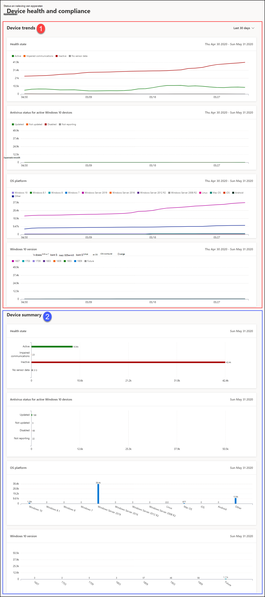

# Rapport over apparaattoestand en naleving in Microsoft Defender voor EindpuntDevice health and compliance report in Microsoft Defender for Endpoint

[!INCLUDE [Microsoft 365 Defender rebranding](../../includes/microsoft-defender.md)]

**Van toepassing op:****Applies to:**
- [Microsoft Defender voor EndpointMicrosoft Defender for Endpoint](https://go.microsoft.com/fwlink/p/?linkid=2146631)
- [Microsoft 365 DefenderMicrosoft 365 Defender](https://go.microsoft.com/fwlink/?linkid=2118804)

> Wilt u Microsoft Defender voor Eindpunt ervaren?Want to experience Microsoft Defender for Endpoint? [Meld u aan voor een gratis proefabonnement.Sign up for a free trial.](https://www.microsoft.com/microsoft-365/windows/microsoft-defender-atp?ocid=docs-wdatp-exposedapis-abovefoldlink)

Het statusrapport apparaten bevat informatie op hoog niveau over de apparaten in uw organisatie.The devices status report provides high-level information about the devices in your organization. Het rapport bevat trending-informatie over de status van de sensorstatus, antivirusstatus, besturingssysteemplatforms en Windows 10-versies.The report includes trending information showing the sensor health state, antivirus status, OS platforms, and Windows 10 versions.

Het dashboard is gestructureerd in twee secties: The dashboard is structured into two sections: 
 
SectieSection | BeschrijvingDescription
:---|:---
11 | ApparaattrendsDevice trends
22 | Apparaatoverzicht (huidige dag)Device summary (current day)
 
 
## ApparaattrendsDevice trends 
De apparaattrends geven standaard apparaatgegevens weer uit de periode van 30 dagen die eindigt op de laatste volledige dag.By default, the device trends displays device information from the 30-day period ending in the latest full day. Als u meer inzicht wilt krijgen in trends in uw organisatie, kunt u de rapportageperiode aanpassen door de weergegeven periode aan te passen.To gain better perspective on trends occurring in your organization, you can fine-tune the reporting period by adjusting the time period shown. Als u de periode wilt aanpassen, selecteert u een tijdsbereik in de vervolgkeuzeopties:To adjust the time period, select a time range from the drop-down options:
 
- 30 dagen30 days
- 3 maanden3 months
- 6 maanden6 months
- AangepastCustom

>[!NOTE]
>Deze filters worden alleen toegepast op de sectie Apparaattrends.These filters are only applied on the device trends section. Dit heeft geen invloed op de sectie Apparaatoverzicht.It doesn't affect the device summary section.

## ApparaatoverzichtDevice summary 
Terwijl de apparatentrends trending apparaatgegevens laten zien, wordt in het apparaatoverzicht de apparaatgegevens tot op de huidige dag gebruikt.While the devices trends shows trending device information, the device summary shows device information scoped to the current day. 

>[!NOTE]
>De gegevens die in de samenvattingssectie worden weergegeven, hebben een bereik van 180 dagen vóór de huidige datum.The data reflected in the summary section is scoped to 180 days prior to the current date. Als de datum van vandaag bijvoorbeeld 27 maart 2019 is, worden de gegevens in de samenvattingssectie weergegeven met getallen die beginnen van 28 september 2018 tot en met 27 maart 2019.For example if today's date is March 27, 2019, the data on the summary section will reflect numbers starting from September 28, 2018 to March 27, 2019. 
> Het filter dat is toegepast op de sectie Trends, wordt niet toegepast op de samenvattingssectie.The filter applied on the trends section is not applied on the summary section. 
 
In de sectie Apparaattrends kunt u inzoomen op de lijst met apparaten met het bijbehorende filter dat op het apparaat is toegepast.The device trends section allows you to drill down to the devices list with the corresponding filter applied to it. Als u bijvoorbeeld op de inactieve balk in de statuskaart voor sensorstatus klikt, wordt de lijst met apparaten weergegeven met alleen apparaten waarvan de sensorstatus inactief is.For example, clicking on the Inactive bar in the Sensor health state card will bring you the devices list with results showing only devices whose sensor status is inactive. 
 
 
 
## ApparaatkenmerkenDevice attributes
Het rapport bestaat uit kaarten met de volgende apparaatkenmerken:The report is made up of cards that display the following device attributes:
 
- **Gezondheidstoestand:** geeft informatie weer over de sensortoestand op apparaten, met een samengevoegde weergave van apparaten die actief zijn, communicatiesproblemen ondervinden, inactief zijn of waar geen sensorgegevens worden gezien.**Health state**: shows information about the sensor state on devices, providing an aggregated view of devices that are active, experiencing impaired communications, inactive, or where no sensor data is seen.
  
- **Antivirusstatus voor actieve Windows 10-apparaten:** toont het aantal apparaten en de status van Microsoft Defender Antivirus.**Antivirus status for active Windows 10 devices**: shows the number of devices and status of Microsoft Defender Antivirus.
    
- **BESTURINGSSYSTEEM-platforms:** toont de distributie van besturingssysteemplatforms die binnen uw organisatie aanwezig zijn.**OS platforms**: shows the distribution of OS platforms that exists within your organization. 
 
- **Windows 10-versies:** toont de distributie van Windows 10-apparaten en hun versies in uw organisatie.**Windows 10 versions**: shows the distribution of Windows 10 devices and their versions in your organization.
 
 
 
## Gegevens filterenFilter data
 
Gebruik de meegeleverde filters om apparaten met bepaalde kenmerken op te nemen of uit te sluiten.Use the provided filters to include or exclude devices with certain attributes.

U kunt meerdere filters selecteren die u wilt toepassen op de apparaatkenmerken.You can select multiple filters to apply from the device attributes. 
 
>[!NOTE]
>Deze filters zijn van **toepassing op alle** kaarten in het rapport.These filters apply to **all** the cards in the report.
 
Als u bijvoorbeeld gegevens wilt tonen over Windows 10-apparaten met de status actieve sensor:For example, to show data about Windows 10 devices with Active sensor health state:
 
1. Onder **Filters > status van de sensor > Actief**.Under **Filters > Sensor health state > Active**.
2. Selecteer vervolgens **BE-platforms > Windows 10**.Then select **OS platforms > Windows 10**.
3. Selecteer **Toepassen.**Select **Apply**.

## Gerelateerd onderwerpRelated topic
- [Rapport over bedreigingsbeveiligingThreat protection report](threat-protection-reports.md)
