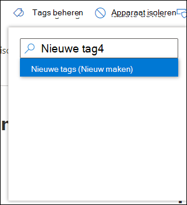
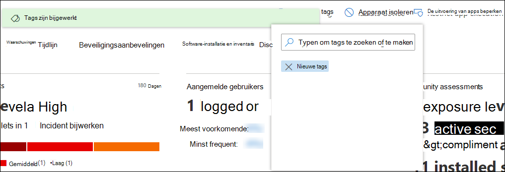

# Apparaatlabels maken en beherenCreate and manage device tags

[!INCLUDE [Microsoft 365 Defender rebranding](../../includes/microsoft-defender.md)]

**Van toepassing op:****Applies to:**
- [Microsoft Defender voor EndpointMicrosoft Defender for Endpoint](https://go.microsoft.com/fwlink/p/?linkid=2146631)
- [Microsoft 365 DefenderMicrosoft 365 Defender](https://go.microsoft.com/fwlink/?linkid=2118804)

> Wilt u Microsoft Defender voor Eindpunt ervaren?Want to experience Microsoft Defender for Endpoint? [Meld u aan voor een gratis proefabonnement.Sign up for a free trial.](https://www.microsoft.com/microsoft-365/windows/microsoft-defender-atp?ocid=docs-wdatp-exposedapis-abovefoldlink)

Voeg tags toe aan apparaten om een logische groep te maken.Add tags on devices to create a logical group affiliation. Apparaatlabels ondersteunen de juiste toewijzing van het netwerk, zodat u verschillende tags kunt koppelen om context vast te leggen en dynamische lijstcreatie als onderdeel van een incident kunt inschakelen.Device tags support proper mapping of the network, enabling you to attach different tags to capture context and to enable dynamic list creation as part of an incident. Tags kunnen worden gebruikt als filter in de lijstweergave **Apparaten** of om apparaten te groeperen.Tags can be used as a filter in **Devices list** view, or to group devices. Zie Apparaatgroepen maken en beheren voor meer informatie over [apparaatgroepering.](machine-groups.md)For more information on device grouping, see [Create and manage device groups](machine-groups.md).

U kunt op de volgende manieren tags toevoegen op apparaten:You can add tags on devices using the following ways:

- De portal gebruikenUsing the portal
- Een registersleutelwaarde instellenSetting a registry key value

> [!NOTE]
> Er kan enige latentie zijn tussen het moment dat een tag wordt toegevoegd aan een apparaat en de beschikbaarheid ervan in de lijst met apparaten en de pagina met apparaten.There may be some latency between the time a tag is added to a device and its availability in the devices list and device page.  

Zie Api voor apparaatlabels toevoegen of verwijderen als u apparaatlabels wilt toevoegen met [API.](add-or-remove-machine-tags.md)To add device tags using API, see [Add or remove device tags API](add-or-remove-machine-tags.md).

## Apparaatlabels toevoegen en beheren met de portalAdd and manage device tags using the portal

1. Selecteer het apparaat waar u tags op wilt beheren.Select the device that you want to manage tags on. U kunt een apparaat selecteren of zoeken in een van de volgende weergaven:You can select or search for a device from any of the following views:

   - **Dashboard Beveiligingsbewerkingen:** selecteer de naam van het apparaat in de sectie Topapparaten met actieve waarschuwingen.**Security operations dashboard** - Select the device name from the Top devices with active alerts section.
   - **Waarschuwingenwachtrij:** selecteer de naam van het apparaat naast het apparaatpictogram in de waarschuwingenwachtrij.**Alerts queue** - Select the device name beside the device icon from the alerts queue.
   - **Lijst met** apparaten: selecteer de naam van het apparaat in de lijst met apparaten.**Devices list** - Select the device name from the list of devices.
   - **Zoekvak:** selecteer Apparaat in de vervolgkeuzelijst en voer de naam van het apparaat in.**Search box** - Select Device from the drop-down menu and enter the device name.

     U kunt ook naar de waarschuwingspagina gaan via de bestands- en IP-weergaven.You can also get to the alert page through the file and IP views.

2. Selecteer **Tags beheren** in de rij met antwoordacties.Select **Manage Tags** from the row of Response actions.

    

3. Typen om tags te zoeken of te makenType to find or create tags

    

Tags worden toegevoegd aan de apparaatweergave en worden ook weergegeven in de **lijstweergave** Apparaten.Tags are added to the device view and will also be reflected on the **Devices list** view. Vervolgens kunt u het filter **Tags gebruiken** om de relevante lijst met apparaten te bekijken.You can then use the **Tags** filter to see the relevant list of devices.

>[!NOTE]
> Filteren werkt mogelijk niet op tagnamen die haakjes bevatten.Filtering might not work on tag names that contain parenthesis. 
> Wanneer u een nieuwe tag maakt, wordt een lijst met bestaande tags weergegeven.When you create a new tag, a list of existing tags are displayed. In de lijst worden alleen tags weergegeven die zijn gemaakt via de portal.The list only shows tags created through the portal. Bestaande tags die zijn gemaakt op clientapparaten, worden niet weergegeven.Existing tags created from client devices will not be displayed.

U kunt ook tags uit deze weergave verwijderen.You can also delete tags from this view.

## Apparaatlabels toevoegen door een registersleutelwaarde in te stellenAdd device tags by setting a registry key value

>[!NOTE]
> Alleen van toepassing op de volgende apparaten:Applicable only on the following devices:
>- Windows 10, versie 1709 of hogerWindows 10, version 1709 or later
>- Windows Server, versie 1803 of hogerWindows Server, version 1803 or later
>- Windows Server 2016Windows Server 2016
>- Windows Server 2012 R2Windows Server 2012 R2
>- Windows Server 2008 R2 SP1Windows Server 2008 R2 SP1
>- Windows 8.1Windows 8.1
>- Windows 7 SP1Windows 7 SP1

> [!NOTE] 
> Het maximum aantal tekens dat in een tag kan worden ingesteld, is 200.The maximum number of characters that can be set in a tag is 200.

Apparaten met vergelijkbare tags kunnen handig zijn wanneer u contextuele actie moet toepassen op een specifieke lijst met apparaten.Devices with similar tags can be handy when you need to apply contextual action on a specific list of devices.

Gebruik de volgende registersleutelinvoer om een tag toe te voegen op een apparaat:Use the following registry key entry to add a tag on a device:

- Registersleutel: `HKEY_LOCAL_MACHINE\SOFTWARE\Policies\Microsoft\Windows Advanced Threat Protection\DeviceTagging\`Registry key: `HKEY_LOCAL_MACHINE\SOFTWARE\Policies\Microsoft\Windows Advanced Threat Protection\DeviceTagging\`
- Registersleutelwaarde (REG_SZ): `Group`Registry key value (REG_SZ): `Group`
- Registersleutelgegevens: `Name of the tag you want to set`Registry key data: `Name of the tag you want to set`

>[!NOTE]
>De apparaattag maakt deel uit van het apparaatinformatierapport dat eenmaal per dag wordt gegenereerd.The device tag is part of the device information report that's generated once a day. Als alternatief kunt u ervoor kiezen om het eindpunt opnieuw op te starten dat een nieuw apparaatinformatierapport zou overbrengen.As an alternative, you may choose to restart the endpoint that would transfer a new device information report.
> 
> Als u een tag wilt verwijderen die is toegevoegd met de bovenstaande registersleutel, verwijdert u de inhoud van de registersleutelgegevens in plaats van de 'Groep'-toets te verwijderen.If you need to remove a tag that was added using the above Registry key, clear the contents of the Registry key data instead of removing the 'Group' key.
