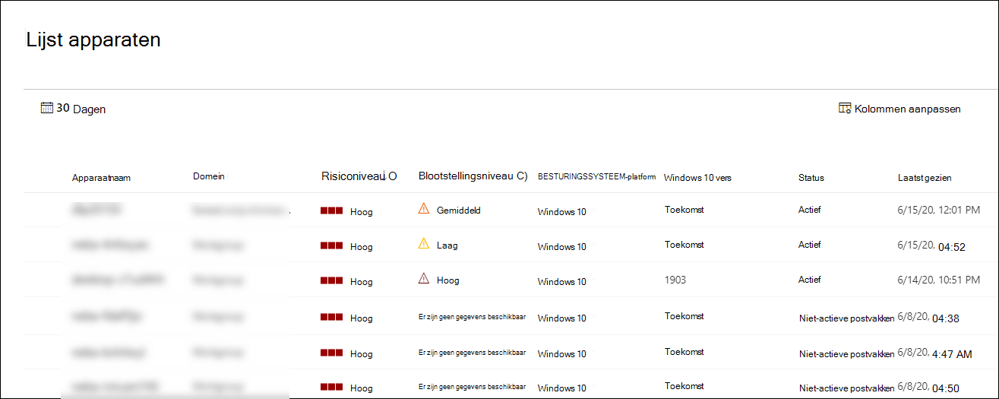

# De lijst Met Microsoft Defender voor eindpuntapparaten weergeven en organiserenView and organize the Microsoft Defender for Endpoint Devices list

[!INCLUDE [Microsoft 365 Defender rebranding](../../includes/microsoft-defender.md)]

**Van toepassing op:****Applies to:**
- [Microsoft Defender voor EndpointMicrosoft Defender for Endpoint](https://go.microsoft.com/fwlink/p/?linkid=2154037)
- [Microsoft 365 DefenderMicrosoft 365 Defender](https://go.microsoft.com/fwlink/?linkid=2118804)

> Wilt u Defender voor Eindpunt ervaren?Want to experience Defender for Endpoint? [Meld u aan voor een gratis proefabonnement.Sign up for a free trial.](https://www.microsoft.com/microsoft-365/windows/microsoft-defender-atp?ocid=docs-wdatp-machinesview-abovefoldlink)

In **de lijst Apparaten** ziet u een lijst met de apparaten in uw netwerk waar waarschuwingen zijn gegenereerd.The **Devices list** shows a list of the devices in your network where alerts were generated. Standaard worden in de wachtrij apparaten weergegeven die de afgelopen 30 dagen zijn weergegeven.By default, the queue displays devices seen in the last 30 days.  

In één oogopslag ziet u informatie zoals domein, risiconiveau, besturingssysteemplatform en andere details voor eenvoudige identificatie van apparaten die het meest risico lopen.At a glance you'll see information such as domain, risk level, OS platform, and other details for easy identification of devices most at risk.

Er zijn verschillende opties waar u uit kunt kiezen om de lijstweergave voor apparaten aan te passen.There are several options you can choose from to customize the devices list view. Op de bovenste navigatie kunt u:On the top navigation you can:

- Kolommen toevoegen of verwijderenAdd or remove columns
- De hele lijst exporteren in CSV-indelingExport the entire list in CSV format
- Het aantal items selecteren dat per pagina moet worden weergegevenSelect the number of items to show per page
- Filters toepassenApply filters

Tijdens het onboardingproces wordt de lijst **Apparaten** geleidelijk gevuld met apparaten terwijl ze sensorgegevens beginnen te rapporteren.During the onboarding process, the **Devices list** is gradually populated with devices as they begin to report sensor data. Gebruik deze weergave om uw ingebouwde eindpunten bij te houden wanneer ze online komen, of download de volledige lijst met eindpunten als een CSV-bestand voor offlineanalyse.Use this view to track your onboarded endpoints as they come online, or download the complete endpoint list as a CSV file for offline analysis.

>[!NOTE]
> Als u de lijst met apparaten exporteert, bevat deze elk apparaat in uw organisatie.If you export the device list, it will contain every device in your organization. Het kan een aanzienlijke hoeveelheid tijd duren om te downloaden, afhankelijk van hoe groot uw organisatie is.It might take a significant amount of time to download, depending on how large your organization is. Als u de lijst exporteert in CSV-indeling, worden de gegevens op een ongefilterde manier weergegeven.Exporting the list in CSV format displays the data in an unfiltered manner. Het CSV-bestand bevat alle apparaten in de organisatie, ongeacht de filters die in de weergave zelf worden toegepast.The CSV file will include all devices in the organization, regardless of any filtering applied in the view itself.

## De lijst met apparaten sorteren en filterenSort and filter the device list

U kunt de volgende filters toepassen om de lijst met waarschuwingen te beperken en een meer gerichte weergave te krijgen.You can apply the following filters to limit the list of alerts and get a more focused view.

### RisiconiveauRisk level

Het risiconiveau weerspiegelt de algemene risicobeoordeling van het apparaat op basis van een combinatie van factoren, waaronder het type en de ernst van actieve waarschuwingen op het apparaat.The risk level reflects the overall risk assessment of the device based on a combination of factors, including the types and severity of active alerts on the device. Door actieve waarschuwingen op te lossen, herstelactiviteiten goed te keuren en volgende waarschuwingen te onderdrukken, kan het risiconiveau worden verlaagd.Resolving active alerts, approving remediation activities, and suppressing subsequent alerts can lower the risk level.

### BlootstellingsniveauExposure level

Het blootstellingsniveau weerspiegelt de huidige blootstelling van het apparaat op basis van de cumulatieve impact van de beveiligingsaanbevelingen in behandeling.The exposure level reflects the current exposure of the device based on the cumulative impact of its pending security recommendations. De mogelijke niveaus zijn laag, gemiddeld en hoog.The possible levels are low, medium, and high. Lage blootstelling betekent dat uw apparaten minder kwetsbaar zijn voor gebruik.Low exposure means your devices are less vulnerable from exploitation.

Als op het blootstellingsniveau 'Geen gegevens beschikbaar' staat, zijn er een paar redenen waarom dit het geval kan zijn:If the exposure level says "No data available," there are a few reasons why this may be the case:

- De rapportage van het apparaat is langer dan 30 dagen gestopt, in dat geval wordt het als inactief beschouwd en wordt de blootstelling niet berekendDevice stopped reporting for more than 30 days – in that case it is considered inactive, and the exposure isn't computed
- Apparaat os niet ondersteund - zie [minimumvereisten voor Microsoft Defender voor Eindpunt](minimum-requirements.md)Device OS not supported - see [minimum requirements for Microsoft Defender for Endpoint](minimum-requirements.md)
- Apparaat met verouderde agent (zeer onwaarschijnlijk)Device with stale agent (very unlikely)

### BesturingssysteemplatformOS Platform

Selecteer alleen de besturingssysteemplatforms die u wilt onderzoeken.Select only the OS platforms you're interested in investigating.

### StatusHealth state

Filteren op de volgende statussen van apparaten:Filter by the following device health states:

- **Actief:** apparaten die sensorgegevens actief aan de service rapporteren.**Active** – Devices that are actively reporting sensor data to the service.
- **Inactief:** apparaten die al meer dan 7 dagen geen signalen meer verzenden.**Inactive** – Devices that have completely stopped sending signals for more than 7 days.
- **Verkeerd geconfigureerd: apparaten** die communicatie met de service hebben beschadigd of die geen sensorgegevens kunnen verzenden.**Misconfigured** – Devices that have impaired communications with service or are unable to send sensor data. Verkeerd geconfigureerde apparaten kunnen verder worden geclassificeerd als:Misconfigured devices can further be classified to:
  - Geen sensorgegevensNo sensor data
  - Communicatie met verminderde werkingImpaired communications

  Zie Ongezonde sensoren oplossen voor meer informatie over het oplossen van problemen op verkeerd [geconfigureerde apparaten.](fix-unhealthy-sensors.md)For more information on how to address issues on misconfigured devices see, [Fix unhealthy sensors](fix-unhealthy-sensors.md).

### AntivirusstatusAntivirus status

Apparaten filteren op antivirusstatus.Filter devices by antivirus status. Is alleen van toepassing op actieve Windows 10-apparaten.Applies to active Windows 10 devices only.

- **Uitgeschakeld-** Virusbeveiliging & is uitgeschakeld.**Disabled** - Virus & threat protection is turned off.
- **Niet rapporteren:** virusbeveiliging & geen rapportage.**Not reporting** - Virus & threat protection is not reporting.
- **Niet bijgewerkt-** Virusbeveiliging & is niet up-to-date.**Not updated** - Virus & threat protection is not up to date.

Zie Het dashboard [Threat & Vulnerability Management weergeven voor meer informatie.](tvm-dashboard-insights.md)For more information, see [View the Threat & Vulnerability Management dashboard](tvm-dashboard-insights.md).

### Status van bedreigingsbeperkingThreat mitigation status

Als u apparaten wilt weergeven die mogelijk worden beïnvloed door een bepaalde bedreiging, selecteert u de bedreiging in de vervolgkeuzelijst en selecteert u vervolgens welk beveiligingsaspect moet worden beperkt.To view devices that may be affected by a certain threat, select the threat from the dropdown menu, and then select what vulnerability aspect needs to be mitigated.

Zie Bedreigingsanalyse voor meer [informatie over bepaalde bedreigingen.](threat-analytics.md)To learn more about certain threats, see [Threat analytics](threat-analytics.md). Zie Threat [& Vulnerability Management voor](next-gen-threat-and-vuln-mgt.md)informatie over risicobeperking.For mitigation information, see [Threat & Vulnerability Management](next-gen-threat-and-vuln-mgt.md).

### Windows 10-versieWindows 10 version

Selecteer alleen de Windows 10-versies die u wilt onderzoeken.Select only the Windows 10 versions you're interested in investigating.

### Tags & GroepenTags & Groups

Filter de lijst op basis van de groepering en labeling die u aan afzonderlijke apparaten hebt toegevoegd.Filter the list based on the grouping and tagging that you've added to individual devices. Zie [Apparaatlabels maken en beheren](machine-tags.md) en [Apparaatgroepen maken en beheren.](machine-groups.md)See [Create and manage device tags](machine-tags.md) and [Create and manage device groups](machine-groups.md).

## Verwante onderwerpenRelated topics

- [Apparaten onderzoeken in de lijst Microsoft Defender voor eindpuntapparatenInvestigate devices in the Microsoft Defender for Endpoint Devices list](investigate-machines.md)
