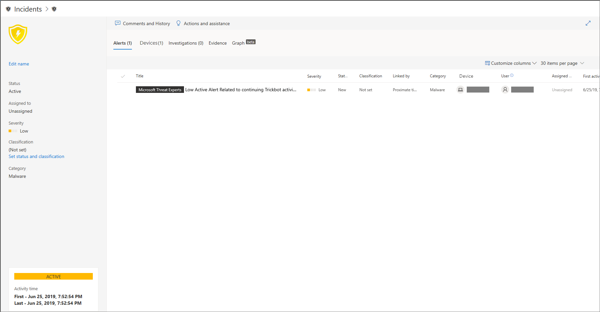

# Microsoft Defender voor eindpuntincidenten beherenManage Microsoft Defender for Endpoint incidents

[!INCLUDE [Microsoft 365 Defender rebranding](../../includes/microsoft-defender.md)]

**Van toepassing op:****Applies to:**
- [Microsoft Defender voor EndpointMicrosoft Defender for Endpoint](https://go.microsoft.com/fwlink/p/?linkid=2146631)
- [Microsoft 365 DefenderMicrosoft 365 Defender](https://go.microsoft.com/fwlink/?linkid=2118804)

> Wilt u Microsoft Defender voor Eindpunt ervaren?Want to experience Microsoft Defender for Endpoint? [Meld u aan voor een gratis proefabonnement.Sign up for a free trial.](https://www.microsoft.com/microsoft-365/windows/microsoft-defender-atp?ocid=docs-wdatp-exposedapis-abovefoldlink)

Het beheren van incidenten is een belangrijk onderdeel van elke cyberbeveiligingsactie.Managing incidents is an important part of every cybersecurity operation. U kunt incidenten beheren door een incident te selecteren in **de** wachtrij Incidenten of in het **deelvenster Incidentenbeheer.**You can manage incidents by selecting an incident from the **Incidents queue** or the **Incidents management pane**. 

Als u een incident selecteert in **de wachtrij Incidenten,** wordt het **deelvenster Incidentbeheer** weergegeven, waar u de incidentpagina kunt openen voor meer informatie.Selecting an incident from the **Incidents queue** brings up the **Incident management pane** where you can open the incident page for details.

U kunt incidenten aan uzelf toewijzen, de status en classificatie wijzigen, de naam ervan wijzigen of opmerkingen maken om de voortgang bij te houden.You can assign incidents to yourself, change the status and classification, rename, or comment on them to keep track of their progress.

> [!TIP]
> Voor meer zichtbaarheid in één oogopslag worden incidentnamen automatisch gegenereerd op basis van waarschuwingskenmerken, zoals het aantal getroffen eindpunten, beïnvloede gebruikers, detectiebronnen of categorieën.For additional visibility at a glance, incident names are automatically generated based on alert attributes such as the number of endpoints affected, users affected, detection sources or categories. Hierdoor kunt u snel inzicht krijgen in het bereik van het incident.This allows you to quickly understand the scope of the incident.
>
> Bijvoorbeeld: *incident met meerdere fases op meerdere eindpunten die door meerdere bronnen zijn gerapporteerd.*For example: *Multi-stage incident on multiple endpoints reported by multiple sources.*
>
> Incidenten die vóór de implementatie van automatische naamgeving voor incidenten hebben bestaan, behouden hun namen.Incidents that existed prior the rollout of automatic incident naming will retain their names.
>

## Incidenten toewijzenAssign incidents
Als er nog geen incident is toegewezen, kunt u Toewijzen aan **mij** selecteren om het incident aan uzelf toe te wijzen.If an incident has not been assigned yet, you can select **Assign to me** to assign the incident to yourself. Als u dit doet, wordt ervan uit gegaan dat u niet alleen eigenaar bent van het incident, maar ook van alle waarschuwingen die aan het incident zijn gekoppeld.Doing so assumes ownership of not just the incident, but also all the alerts associated with it.

## Status en classificatie instellenSet status and classification
### IncidentstatusIncident status
U kunt incidenten categoriseren (als **Actief** of **Opgelost)** door hun status te wijzigen naarmate het onderzoek vordert.You can categorize incidents (as **Active**, or **Resolved**) by changing their status as your investigation progresses. Op deze manier kunt u organiseren en beheren hoe uw team kan reageren op incidenten.This helps you organize and manage how your team can respond to incidents.

Uw soc-analist kan bijvoorbeeld de urgente **Actieve** incidenten van vandaag bekijken en besluiten deze aan zichzelf toe te wijzen voor onderzoek.For example, your SoC analyst can review the urgent **Active** incidents for the day, and decide to assign them to himself for investigation.

Uw soc-analist kan het incident ook instellen als **Opgelost** als het incident is opgelost.Alternatively, your SoC analyst might set the incident as **Resolved** if the incident has been remediated. 

### ClassificatieClassification
U kunt ervoor kiezen geen classificatie in te stellen of te bepalen of een incident waar of onwaar is.You can choose not to set a classification, or decide to specify whether an incident is true or false. Als u dit doet, kan het team patronen zien en er van leren.Doing so helps the team see patterns and learn from them.

### Opmerkingen toevoegenAdd comments
U kunt opmerkingen toevoegen en historische gebeurtenissen over een incident bekijken om eerdere wijzigingen in het incident weer te geven.You can add comments and view historical events about an incident to see previous changes made to it.

Wanneer een wijziging of opmerking wordt aangebracht in een waarschuwing, wordt deze opgenomen in de sectie Opmerkingen en geschiedenis.Whenever a change or comment is made to an alert, it is recorded in the Comments and history section.

Toegevoegde opmerkingen worden direct weergegeven in het deelvenster.Added comments instantly appear on the pane.

## Verwante onderwerpenRelated topics
- [Wachtrij incidentenIncidents queue](https://docs.microsoft.com/microsoft-365/security/defender-endpoint/view-incidents-queue)
- [De wachtrij Incidenten weergeven en ordenenView and organize the Incidents queue](view-incidents-queue.md)
- [Incidenten onderzoekenInvestigate incidents](investigate-incidents.md)
