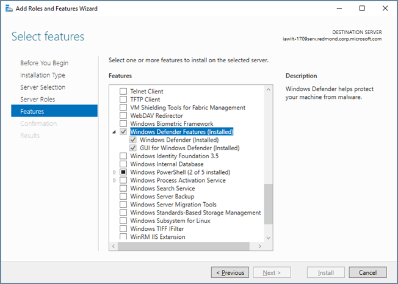

# <a name="microsoft-defender-antivirus-on-windows-server"></a>Microsoft Defender Antivirus op Windows Server

[!INCLUDE [Microsoft 365 Defender rebranding](../../includes/microsoft-defender.md)]

**Van toepassing op:**

- [Microsoft Defender voor Eindpunt](/microsoft-365/security/defender-endpoint/)

Microsoft Defender Antivirus is beschikbaar in de volgende versies/versies van Windows Server:
- Windows Server 2019
- Windows Server, versie 1803 of hoger
- Windows Server 2016. 

In sommige gevallen wordt Microsoft Defender Antivirus ook wel *Endpoint Protection genoemd;* De protection engine is echter hetzelfde. Hoewel de functionaliteit, configuratie en beheer grotendeels hetzelfde zijn voor Microsoft Defender Antivirus in [Windows 10,](microsoft-defender-antivirus-in-windows-10.md)zijn er een paar belangrijke verschillen op Windows Server:

- Op Windows Server worden [automatische uitsluitingen](configure-server-exclusions-microsoft-defender-antivirus.md) toegepast op basis van uw gedefinieerde serverrol.
 
- Als u op Windows Server een niet-Microsoft-antivirus-/antimalware-oplossing gebruikt, gaat Microsoft Defender Antivirus niet automatisch in de passieve modus of in de uitgeschakelde modus. U kunt Microsoft Defender Antivirus echter handmatig instellen op passieve of uitgeschakelde modus.

## <a name="setting-up-microsoft-defender-antivirus-on-windows-server"></a>Microsoft Defender Antivirus instellen op Windows Server

Het proces van het instellen en uitvoeren van Microsoft Defender Antivirus op een serverplatform bevat verschillende stappen:

1. [Schakel de interface in.](#enable-the-user-interface-on-windows-server)
2. [Microsoft Defender Antivirus installeren.](#install-microsoft-defender-antivirus-on-windows-server)
3. [Controleer of Microsoft Defender Antivirus wordt uitgevoerd.](#verify-microsoft-defender-antivirus-is-running)
4. [Werk uw antimalwarebeveiligingsinformatie bij.](#update-antimalware-security-intelligence)
5. (Indien nodig) [Steekproeven indienen](#submit-samples).
6. (Indien nodig) [Automatische uitsluitingen configureren.](#configure-automatic-exclusions)
7. (Alleen indien nodig) [Stel Microsoft Defender Antivirus in op passieve modus.](#need-to-set-microsoft-defender-antivirus-to-passive-mode)

## <a name="enable-the-user-interface-on-windows-server"></a>De gebruikersinterface inschakelen op Windows Server

Microsoft Defender Antivirus is standaard geïnstalleerd en werkt op Windows Server. Soms is de gebruikersinterface (GUI) standaard geïnstalleerd, maar is de GUI niet vereist. U kunt PowerShell, Groepsbeleid of andere methoden gebruiken om Microsoft Defender Antivirus te beheren. 

Als de GUI niet is geïnstalleerd op uw server en u deze wilt installeren, kunt u de **wizard** Rollen en functies toevoegen of PowerShell-cmdlets gebruiken.

### <a name="turn-on-the-gui-using-the-add-roles-and-features-wizard"></a>De GUI in- of uit te zetten met de wizard Rollen en functies toevoegen

1. Zie [Rollen, rollenservices](/windows-server/administration/server-manager/install-or-uninstall-roles-role-services-or-features#install-roles-role-services-and-features-by-using-the-add-roles-and-features-wizard)en functies installeren met de wizard Rollen en functies toevoegen en gebruik de wizard Rollen **en functies toevoegen.**

2. Wanneer u bij de stap **Functies** van de wizard komt, selecteert u onder **Windows Defender-functies** de optie **GUI voor Windows Defender.**

   In Windows Server 2016 ziet de wizard Rollen **en** functies toevoegen er als volgende uit:

   

   In Windows Server 2019 is de wizard Rollen **en functies** toevoegen vergelijkbaar.

### <a name="turn-on-the-gui-using-powershell"></a>De GUI in-en-uit met PowerShell

Met de volgende PowerShell-cmdlet wordt de interface ingeschakeld: 

```PowerShell
Install-WindowsFeature -Name Windows-Defender-GUI
```

## <a name="install-microsoft-defender-antivirus-on-windows-server"></a>Microsoft Defender Antivirus installeren op Windows Server

Als u Microsoft Defender Antivirus op Windows Server wilt installeren of opnieuw wilt installeren, kunt u dat doen met de wizard Rollen en functies toevoegen **of** PowerShell.

### <a name="use-the-add-roles-and-features-wizard-to-install-microsoft-defender-antivirus"></a>De wizard Rollen en functies toevoegen gebruiken om Microsoft Defender Antivirus te installeren

1. Raadpleeg dit [artikel en](/windows-server/administration/server-manager/install-or-uninstall-roles-role-services-or-features#install-roles-role-services-and-features-by-using-the-add-roles-and-features-wizard)gebruik de wizard Rollen en **functies toevoegen.**

2. Wanneer u bij de stap **Functies** van de wizard komt, selecteert u de optie Microsoft Defender Antivirus. Selecteer ook de **optie GUI voor Windows Defender.**

### <a name="use-powershell-to-install-microsoft-defender-antivirus"></a>PowerShell gebruiken om Microsoft Defender Antivirus te installeren

Voer de volgende cmdlet uit als u PowerShell wilt gebruiken om Microsoft Defender Antivirus te installeren:

```PowerShell
Install-WindowsFeature -Name Windows-Defender
```

Gebeurtenisberichten voor de antimalware-engine die is inbegrepen bij Microsoft Defender Antivirus vindt u in [Microsoft Defender AV Events.](troubleshoot-microsoft-defender-antivirus.md)


## <a name="verify-microsoft-defender-antivirus-is-running"></a>Controleren of Microsoft Defender Antivirus wordt uitgevoerd

Nadat Microsoft Defender Antivirus is geïnstalleerd, moet u controleren of het programma wordt uitgevoerd. Voer op uw Windows Server-eindpunt de volgende PowerShell-cmdlet uit:

```PowerShell
Get-Service -Name windefend
```

Voer de volgende PowerShell-cmdlet uit om te controleren of firewallbeveiliging is ingeschakeld:

```PowerShell 
Get-Service -Name mpssvc
```

Als alternatief voor PowerShell kunt u opdrachtprompt gebruiken om te controleren of Microsoft Defender Antivirus wordt uitgevoerd. Voer de volgende opdracht uit vanuit een opdrachtprompt: 

```console
sc query Windefend
```

De `sc query` opdracht retourneert informatie over de Microsoft Defender Antivirus-service. Wanneer Microsoft Defender Antivirus wordt uitgevoerd, wordt de `STATE` waarde `RUNNING` weergegeven.

## <a name="update-antimalware-security-intelligence"></a>Antimalware-beveiligingsinformatie bijwerken 

Als u bijgewerkte beveiligingsinformatie voor antimalware wilt downloaden, moet de Windows Update-service zijn uitgevoerd. Als u een updatebeheerservice gebruikt, zoals Windows Server Update Services (WSUS), moet u ervoor zorgen dat updates voor Microsoft Defender Antivirus Security Intelligence worden goedgekeurd voor de computers die u beheert.

Standaard worden updates niet automatisch gedownload en geïnstalleerd op Windows Server 2019 of Windows Server 2016. U kunt deze configuratie wijzigen met behulp van een van de volgende methoden:


|Methode  |Omschrijving  |
|---------|---------|
|**Windows Update** in configuratiescherm     |- **Als u updates installeert,** worden alle updates automatisch geïnstalleerd, inclusief beveiligingsinformatie-updates van Windows Defender. <br/>- **Updates downloaden, maar laat me kiezen of** ik ze wil installeren, kan Windows Defender automatisch beveiligingsinformatie-updates downloaden en installeren, maar andere updates worden niet automatisch geïnstalleerd.       |
|**Groepsbeleid**     | U kunt Windows Update instellen en beheren met behulp van de instellingen die beschikbaar zijn in groepsbeleid, in het volgende pad: **Beheersjablonen\Windows-onderdelen\Windows Update\Automatische updates configureren**         |
|De **AUOptions-registersleutel**     |Met de volgende twee waarden kan Windows Update updates voor beveiligingsinformatie automatisch downloaden en installeren: <br/>- **4**  -  **Updates automatisch installeren.** Met deze waarde worden alle updates automatisch geïnstalleerd, inclusief beveiligingsinformatie-updates van Windows Defender. <br/>- **3**  -  **Download updates, maar laat me kiezen of ik ze wil installeren.**  Met deze waarde kan Windows Defender updates voor beveiligingsinformatie automatisch downloaden en installeren, maar andere updates worden niet automatisch geïnstalleerd.         |

Om ervoor te zorgen dat de beveiliging tegen malware wordt gehandhaafd, raden we u aan de volgende services in te stellen:

- Windows Error Reporting-service

- Windows Update-service

De volgende tabel bevat de services voor Microsoft Defender Antivirus en de afhankelijke services.

|Servicenaam|Bestandslocatie|Omschrijving|
|--------|---------|--------|
|Windows Defender Service (WinDefend)|`C:\Program Files\Windows Defender\MsMpEng.exe`|Dit is de belangrijkste Microsoft Defender Antivirus-service die altijd moet worden uitgevoerd.|
|Windows Error Reporting Service (Wersvc)|`C:\WINDOWS\System32\svchost.exe -k WerSvcGroup`|Deze service stuurt foutrapporten terug naar Microsoft.|
|Windows Defender Firewall (MpsSvc)|`C:\WINDOWS\system32\svchost.exe -k LocalServiceNoNetwork`|Het is raadzaam om de Windows Defender Firewall-service ingeschakeld te laten.|
|Windows Update (Wuauserv)|`C:\WINDOWS\system32\svchost.exe -k netsvcs`|Windows Update is nodig om beveiligingsintelligentie-updates en antimalware-engine-updates te krijgen|

## <a name="submit-samples"></a>Voorbeelden verzenden

Met voorbeeldinzending kan Microsoft voorbeelden van mogelijk schadelijke software verzamelen. Microsoft-onderzoekers gebruiken deze voorbeelden om verdachte activiteiten te analyseren en bijgewerkte antimalwarebeveiligingsinformatie te produceren om de beveiliging voortdurend en up-to-date te houden. We verzamelen uitvoerbare programmabestanden, zoals .exe bestanden en .dll bestanden. We verzamelen geen bestanden die persoonlijke gegevens bevatten, zoals Microsoft Word-documenten en PDF-bestanden.

### <a name="submit-a-file"></a>Een bestand verzenden

1. Bekijk de [inzendingshandleiding.](/windows/security/threat-protection/intelligence/submission-guide)

2. Ga naar [de voorbeeldportal](https://www.microsoft.com/wdsi/filesubmission)voor inzending en verzend uw bestand.


### <a name="enable-automatic-sample-submission"></a>Automatische voorbeeldinzending inschakelen

Als u automatische voorbeeldinzending wilt inschakelen, start u een Windows PowerShell-console als beheerder en stelt u de **waardegegevens van SubmitSamplesConsent** in op een van de volgende instellingen:

|Instelling  |Beschrijving  |
|---------|---------|
|**0**  -  **Altijd vragen**     |De Microsoft Defender Antivirus-service vraagt u om te bevestigen dat u alle vereiste bestanden hebt ingediend. Dit is de standaardinstelling voor Microsoft Defender Antivirus, maar wordt niet aanbevolen voor installaties op Windows Server 2016 of 2019 zonder gui.         |
|**1**   -  **Veilige steekproeven automatisch verzenden**     |De Microsoft Defender Antivirus-service verzendt alle bestanden die zijn gemarkeerd als 'veilig' en vraagt om de rest van de bestanden.         |
|**2**  -  **Nooit verzenden**      |De Microsoft Defender Antivirus-service wordt niet gevraagd en verzendt geen bestanden.         |
|**3**  -  **Alle voorbeelden automatisch verzenden**     |De Microsoft Defender Antivirus-service verzendt alle bestanden zonder een bevestigingsprompt.         |

## <a name="configure-automatic-exclusions"></a>Automatische uitsluitingen configureren

Om de beveiliging en prestaties te waarborgen, worden bepaalde uitsluitingen automatisch toegevoegd op basis van de rollen en functies die u installeert bij het gebruik van Microsoft Defender Antivirus op Windows Server 2016 of 2019.

Zie [Uitsluitingen configureren in Microsoft Defender Antivirus op Windows Server](configure-server-exclusions-microsoft-defender-antivirus.md). 

## <a name="need-to-set-microsoft-defender-antivirus-to-passive-mode"></a>Wilt u Microsoft Defender Antivirus instellen op passieve modus?

Als u een niet-Microsoft-antivirusproduct gebruikt als uw primaire antivirusoplossing op Windows Server, moet u Microsoft Defender Antivirus instellen op passieve modus of uitgeschakelde modus.

- Op Windows Server, versie 1803 of hoger of Windows Server 2019, kunt u Microsoft Defender Antivirus instellen op passieve modus.  

- In Windows Server 2016 wordt Microsoft Defender Antivirus niet ondersteund naast een niet-Microsoft antivirus/antimalware-product. In deze gevallen moet u Microsoft Defender Antivirus instellen op uitgeschakelde modus.

### <a name="set-microsoft-defender-antivirus-to-passive-mode-using-powershell"></a>Microsoft Defender Antivirus instellen op passieve modus met PowerShell

Als u Windows Server, versie 1803 of Windows Server 2019 gebruikt, kunt u Microsoft Defender Antivirus instellen op passieve modus met behulp van de volgende PowerShell-cmdlet:

`CMDLET NEEDED`

### <a name="set-microsoft-defender-antivirus-to-passive-mode-using-group-policy"></a>Microsoft Defender Antivirus instellen op passieve modus met groepsbeleid

PROCEDURE VEREIST

### <a name="set-microsoft-defender-antivirus-to-passive-mode-using-a-registry-key"></a>Microsoft Defender Antivirus instellen op passieve modus met een registersleutel

Als u Windows Server, versie 1803 of Windows Server 2019 gebruikt, kunt u Microsoft Defender Antivirus instellen op passieve modus door de volgende registersleutel in te stellen:
- Pad: `HKLM\SOFTWARE\Policies\Microsoft\Windows Advanced Threat Protection`
- Naam: `ForceDefenderPassiveMode`
- Typ: `REG_DWORD`
- Waarde: `1`

### <a name="disable-microsoft-defender-antivirus-using-the-remove-roles-and-features-wizard"></a>Microsoft Defender Antivirus uitschakelen met de wizard Rollen en functies verwijderen

1. Zie [Rollen, rollen, rollenservices](/windows-server/administration/server-manager/install-or-uninstall-roles-role-services-or-features#remove-roles-role-services-and-features-by-using-the-remove-roles-and-features-wizard)of functies installeren of verwijderen en gebruik de wizard Rollen **en functies verwijderen.** 

2. Wanneer u bij de stap **Functies** van de wizard bent, kunt u de **optie Windows Defender-functies** uit. 

    Als u **Windows Defender zelf** verwijdert onder de sectie Windows **Defender-functies,** wordt u gevraagd de interfaceoptie GUI voor **Windows Defender te verwijderen.** 
    
    Microsoft Defender Antivirus wordt nog steeds normaal uitgevoerd zonder de gebruikersinterface, maar de gebruikersinterface kan niet worden ingeschakeld als u de belangrijkste **Windows Defender-functie** uit schakelt.

### <a name="turn-off-the-microsoft-defender-antivirus-user-interface-using-powershell"></a>De gebruikersinterface van Microsoft Defender Antivirus uitschakelen met PowerShell

Als u de Antivirus-GUI van Microsoft Defender wilt uitschakelen, gebruikt u de volgende PowerShell-cmdlet:

```PowerShell
Uninstall-WindowsFeature -Name Windows-Defender-GUI
```

### <a name="are-you-using-windows-server-2016"></a>Gebruikt u Windows Server 2016?

Als u Windows Server 2016 en een antimalware/antivirusproduct van derden gebruikt dat niet wordt aangeboden of ontwikkeld door Microsoft, moet u Microsoft Defender Antivirus uitschakelen/verwijderen. 

> [!NOTE]
> U kunt de Windows Security-app niet verwijderen, maar u kunt de interface wel uitschakelen met deze instructies.

Met de volgende PowerShell-cmdlet verwijdert u Microsoft Defender Antivirus op Windows Server 2016:

```PowerShell
Uninstall-WindowsFeature -Name Windows-Defender
```

Als u Microsoft Defender Antivirus wilt uitschakelen op Windows Server 2016, gebruikt u de volgende PowerShell-cmdlet:

```PowerShell
Set-MpPreference -DisableRealtimeMonitoring $true
```

## <a name="see-also"></a>Zie ook

- [Microsoft Defender Antivirus in Windows 10](microsoft-defender-antivirus-in-windows-10.md)
- [Microsoft Defender Antiviruscompatibiliteit](microsoft-defender-antivirus-compatibility.md)
