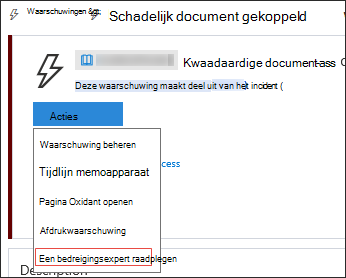
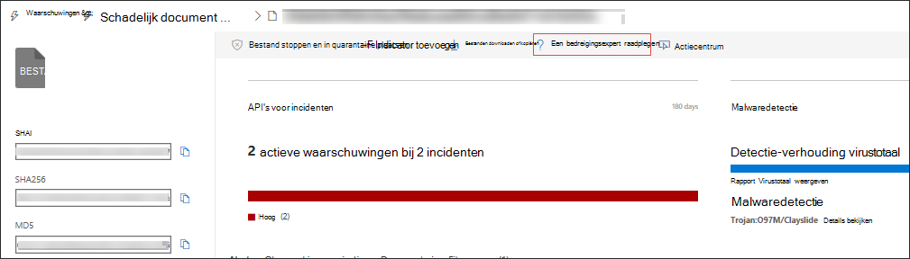

# Microsoft Threat ExpertsMicrosoft Threat Experts

[!INCLUDE [Microsoft 365 Defender rebranding](../../includes/microsoft-defender.md)]

**Van toepassing op:****Applies to:**
- [Microsoft Defender voor EindpuntMicrosoft Defender for Endpoint](https://go.microsoft.com/fwlink/p/?linkid=2154037)
- [Microsoft 365 DefenderMicrosoft 365 Defender](https://go.microsoft.com/fwlink/?linkid=2118804)

> Wilt u Microsoft Defender voor Eindpunt ervaren?Want to experience Microsoft Defender for Endpoint? [Meld u aan voor een gratis proefabonnement.Sign up for a free trial.](https://www.microsoft.com/microsoft-365/windows/microsoft-defender-atp?ocid=docs-wdatp-exposedapis-abovefoldlink)

Microsoft Threat Experts is een beheerde bedreigingsjachtservice die uw Beveiligingscentrums (SOC's) voorziet van monitoring en analyse op expertniveau om ervoor te zorgen dat kritieke bedreigingen in uw unieke omgevingen niet worden gemist.Microsoft Threat Experts is a managed threat hunting service that provides your Security Operation Centers (SOCs) with expert level monitoring and analysis to help them ensure that critical threats in your unique environments don’t get missed.
  
Deze beheerde bedreigingsjachtservice biedt op experts gebaseerde inzichten en gegevens via deze twee mogelijkheden: gerichte aanvalsmelding en toegang tot experts op aanvraag.This managed threat hunting service provides expert-driven insights and data through these two capabilities: targeted attack notification and access to experts on demand.

## Voordat u begintBefore you begin 
> [!NOTE]
> Bespreek de geschiktheidsvereisten met uw Microsoft Technical Service-provider en -accountteam voordat u een aanvraag voor de beheerde bedreigingsjachtservice gaat indienen.Discuss the eligibility requirements with your Microsoft Technical Service provider and account team before you apply to the managed threat hunting service.

Als u een klant van Microsoft Defender voor Eindpunt bent, moet u **Microsoft Threat Experts - Targeted Attack Notifications** aanvragen om speciale inzichten en analyses te krijgen die u helpen bij het identificeren van de meest kritieke bedreigingen in uw omgeving, zodat u er snel op kunt reageren.If you're a Microsoft Defender for Endpoint customer, you need to apply for **Microsoft Threat Experts - Targeted Attack Notifications** to get special insights and analysis that help identify the most critical threats in your environment so you can respond to them quickly.

Als u zich wilt Microsoft Threat Experts - Voordelen voor gerichte aanvalsmeldingen, gaat u naar Instellingen  >  **Endpoints**  >  **General**  >  **Advanced-functies**  >  **Microsoft Threat Experts - Targeted Attack Notifications** om toe te passen.To enroll to Microsoft Threat Experts - Targeted Attack Notifications benefits, go to **Settings** > **Endpoints** > **General** > **Advanced features** > **Microsoft Threat Experts - Targeted Attack Notifications** to apply. Zodra deze is geaccepteerd, krijgt u de voordelen van Meldingen voor gerichte aanvallen.Once accepted, you will get the benefits of Targeted Attack Notifications.

Neem contact op met uw accountteam of Microsoft-vertegenwoordiger om u te abonneren op **Microsoft Threat Experts - Experts op** aanvraag om contact op te nemen met onze bedreigingsexperts over relevante detecties en tegenstand die uw organisatie te maken heeft.Contact your account team or Microsoft representative to subscribe to **Microsoft Threat Experts - Experts on Demand** to consult with our threat experts on relevant detections and adversaries that your organization is facing.

Zie [De Microsoft Threat Experts configureren voor](/microsoft-365/security/defender-endpoint/configure-microsoft-threat-experts#before-you-begin) meer informatie.See [Configure Microsoft Threat Experts capabilities](/microsoft-365/security/defender-endpoint/configure-microsoft-threat-experts#before-you-begin) for details. 

## Microsoft Threat Experts - Melding van gerichte aanvalMicrosoft Threat Experts - Targeted attack notification 
Microsoft Threat Experts- Gerichte aanvalsmelding biedt proactief zoeken naar de belangrijkste bedreigingen voor uw netwerk, zoals inbraken door menselijke tegenpartij, hands-on-keyboard-aanvallen of geavanceerde aanvallen, zoals cyberspionage.Microsoft Threat Experts - Targeted attack notification provides proactive hunting for the most important threats to your network, including human adversary intrusions, hands-on-keyboard attacks, or advanced attacks like cyber-espionage. Deze meldingen worden als een nieuwe waarschuwing op de voormelding uitgevoerd.These notifications shows up as a new alert. De beheerde huntingservice bevat:The managed hunting service includes:  
- Bedreigingsbewaking en -analyse, waardoor de tijd en het risico voor het bedrijf worden verkleindThreat monitoring and analysis, reducing dwell time and risk to the business 
- Door de jager getrainde kunstmatige intelligentie om bekende en onbekende aanvallen te ontdekken en prioriteit te gevenHunter-trained artificial intelligence to discover and prioritize both known and unknown attacks  
- De belangrijkste risico's identificeren, soc's helpen tijd en energie te maximaliserenIdentifying the most important risks, helping SOCs maximize time and energy 
- Bereik van compromissen en zo veel context als snel kan worden geleverd om een snelle soc-reactie in te schakelen.Scope of compromise and as much context as can be quickly delivered to enable fast SOC response. 
 
## Microsoft Threat Experts - Experts op aanvraagMicrosoft Threat Experts - Experts on Demand
Klanten kunnen onze beveiligingsexperts rechtstreeks betrekken vanuit Microsoft Defender-beveiligingscentrum voor een tijdige en nauwkeurige reactie.Customers can engage our security experts directly from within Microsoft Defender Security Center for timely and accurate response. Experts bieden inzichten die nodig zijn om beter inzicht te krijgen in de complexe bedreigingen die van invloed zijn op uw organisatie, van waarschuwingsvragen, mogelijk gecompromitteerde apparaten, hoofdoorzaak van een verdachte netwerkverbinding, tot aanvullende bedreigingsinformatie over lopende geavanceerde permanente bedreigingscampagnes.Experts provide insights needed to better understand the complex threats affecting your organization, from alert inquiries, potentially compromised devices, root cause of a suspicious network connection, to additional threat intelligence regarding ongoing advanced persistent threat campaigns. Met deze mogelijkheid kunt u het volgende doen:With this capability, you can:
- Meer informatie over waarschuwingen, waaronder de hoofdoorzaak of het bereik van het incidentGet additional clarification on alerts including root cause or scope of the incident 
- Meer duidelijkheid over verdacht apparaatgedrag en de volgende stappen als u wordt geconfronteerd met een geavanceerde aanvallerGain clarity into suspicious device behavior and next steps if faced with an advanced attacker  
- Risico's en beveiliging met betrekking tot bedreigingsacacteurs, campagnes of nieuwe technieken voor aanvallers bepalenDetermine risk and protection regarding threat actors, campaigns, or emerging attacker techniques 

De optie Om **een bedreigingsdeskundige te raadplegen** is beschikbaar op verschillende plaatsen in de portal, zodat u contact kunt opnemen met experts in de context van uw onderzoek:The option to **Consult a threat expert** is available in several places in the portal so you can engage with experts in the context of your investigation:

- <i>**Help- en ondersteuningsmenu**</i><i>**Help and support menu**</i> 

- <i>**Menu Apparaatpaginaacties**</i><i>**Device page actions menu**</i> 

- <i>**Menu Waarschuwingenpaginaacties**</i><i>**Alerts page actions menu**</i> 

- <i>**Menu Bestandspaginaacties**</i><i>**File page actions menu**</i> 

> [!NOTE]
> Als u de status van uw Experts on Demand-zaken wilt bijhouden via Microsoft Services Hub, kunt u contact op nemen met uw Technical Account Manager.If you would like to track the status of your Experts on Demand cases through Microsoft Services Hub, reach out to your Technical Account Manager. 

Bekijk deze video voor een kort overzicht van de Microsoft Services Hub.Watch this video for a quick overview of the Microsoft Services Hub.

>[!VIDEO https://www.microsoft.com/videoplayer/embed/RE4pk9f] 

   
## Verwant onderwerpRelated topic
- [De Microsoft Threat Experts configurerenConfigure Microsoft Threat Experts capabilities](configure-microsoft-threat-experts.md)
