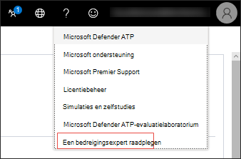

# Microsoft Threat Experts

[!INCLUDE [Microsoft 365 Defender rebranding](../../includes/microsoft-defender.md)]

**Van toepassing op:**
- [Microsoft Defender voor Endpoint](https://go.microsoft.com/fwlink/p/?linkid=2146631)
- [Microsoft 365 Defender](https://go.microsoft.com/fwlink/?linkid=2118804)

> Wilt u Microsoft Defender voor Eindpunt ervaren? [Meld u aan voor een gratis proefabonnement.](https://www.microsoft.com/microsoft-365/windows/microsoft-defender-atp?ocid=docs-wdatp-exposedapis-abovefoldlink)

Microsoft Threat Experts is een beheerde bedreigingsjachtservice die uw Beveiligingscentrums (SOC's) voorziet van monitoring en analyse op expertniveau om ervoor te zorgen dat kritieke bedreigingen in uw unieke omgevingen niet worden gemist.
  
Deze beheerde bedreigingsjachtservice biedt op experts gebaseerde inzichten en gegevens via deze twee mogelijkheden: gerichte aanvalsmelding en toegang tot experts op aanvraag.

## Voordat u begint 
> [!NOTE]
> Bespreek de geschiktheidsvereisten met uw Microsoft Technical Service-provider en -accountteam voordat u een aanvraag voor de beheerde bedreigingsjachtservice gaat indienen.

Als u een klant van Microsoft Defender voor Eindpunt bent, moet u **Microsoft Threat Experts - Targeted Attack Notifications** aanvragen om speciale inzichten en analyses te krijgen die helpen bij het identificeren van de meest kritieke bedreigingen in uw omgeving, zodat u snel op deze bedreigingen kunt reageren

Als u zich wilt registreren bij Microsoft Threat Experts - Voordelen voor gerichte aanvalsmeldingen, gaat u naar Instellingen Algemene geavanceerde functies  >    >    >  **Microsoft Threat Experts - Targeted Attack Notifications** om toe te passen. Zodra deze is geaccepteerd, krijgt u de voordelen van Meldingen voor gerichte aanvallen.

Neem contact op met uw accountteam of microsoft-vertegenwoordiger om u te abonneren op **Microsoft Threat Experts - Experts op** aanvraag om contact op te nemen met onze bedreigingsexperts over relevante detecties en tegens die uw organisatie te maken heeft.

Zie [Microsoft Threat Experts configureren voor](https://docs.microsoft.com/microsoft-365/security/defender-endpoint/configure-microsoft-threat-experts#before-you-begin) meer informatie. 

## Microsoft Threat Experts - Melding van gerichte aanval 
Microsoft Threat Experts: gerichte aanvalsmelding biedt proactief zoeken naar de belangrijkste bedreigingen voor uw netwerk, zoals inbraken door menselijke tegenpartij, hands-on-keyboard-aanvallen of geavanceerde aanvallen, zoals cyberspionage. Deze meldingen worden als een nieuwe waarschuwing op de voormelding uitgevoerd. De beheerde huntingservice bevat:  
- Bedreigingsbewaking en -analyse, waardoor de tijd en het risico voor het bedrijf worden verkleind 
- Door de jager getrainde kunstmatige intelligentie om bekende en onbekende aanvallen te ontdekken en prioriteit te geven  
- De belangrijkste risico's identificeren, soc's helpen tijd en energie te maximaliseren 
- Bereik van compromissen en zo veel context als snel kan worden geleverd om een snelle soc-reactie in te schakelen. 
 
## Microsoft Threat Experts - Experts on Demand
Klanten kunnen onze beveiligingsexperts rechtstreeks vanuit het Microsoft Defender-beveiligingscentrum betrekken voor een tijdige en nauwkeurige reactie. Experts bieden inzichten die nodig zijn om beter inzicht te krijgen in de complexe bedreigingen die van invloed zijn op uw organisatie, van waarschuwingsvragen, mogelijk gecompromitteerde apparaten, hoofdoorzaak van een verdachte netwerkverbinding, tot aanvullende bedreigingsinformatie over lopende geavanceerde permanente bedreigingscampagnes. Met deze mogelijkheid kunt u het volgende doen:
- Meer informatie over waarschuwingen, waaronder de hoofdoorzaak of het bereik van het incident 
- Meer duidelijkheid over verdacht apparaatgedrag en de volgende stappen als u wordt geconfronteerd met een geavanceerde aanvaller  
- Risico's en beveiliging met betrekking tot bedreigingsacacteurs, campagnes of nieuwe technieken voor aanvallers bepalen 

De optie Om **een bedreigingsdeskundige te raadplegen** is beschikbaar op verschillende plaatsen in de portal, zodat u contact kunt opnemen met experts in de context van uw onderzoek:

- <i>**Help- en ondersteuningsmenu**</i> 

- <i>**Menu Apparaatpaginaacties**</i> 

- <i>**Menu Waarschuwingenpaginaacties**</i> 

- <i>**Menu Bestandspaginaacties**</i> 

> [!NOTE]
> Als u de status van uw Experts on Demand-zaken wilt bijhouden via Microsoft Services Hub, kunt u contact op nemen met uw Technical Account Manager. 

Bekijk deze video voor een kort overzicht van de Microsoft Services Hub.

>[!VIDEO https://www.microsoft.com/videoplayer/embed/RE4pk9f] 

   
## Gerelateerd onderwerp
- [Microsoft Threat Experts-mogelijkheden configureren](configure-microsoft-threat-experts.md)
