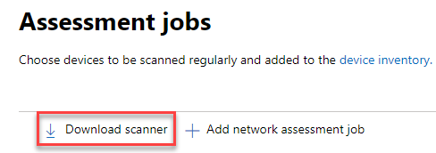
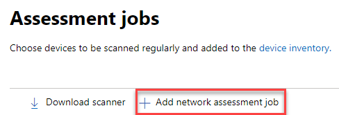

# Netwerkapparaatdetectie en beveiligingsprobleembeheer

[!INCLUDE [Microsoft 365 Defender rebranding](../../includes/microsoft-defender.md)]

**Van toepassing op:**

- [Microsoft Defender voor Eindpunt](https://go.microsoft.com/fwlink/?linkid=2154037)
- [Bedreigings- en kwetsbaarheidsbeheer](next-gen-threat-and-vuln-mgt.md)
- [Microsoft 365 Defender](https://go.microsoft.com/fwlink/?linkid=2118804)

> [!IMPORTANT]
> **Het scannen en beheren van netwerkapparaten wordt momenteel in een openbaar voorbeeld weergegeven** 
> Deze preview-versie wordt geleverd zonder serviceovereenkomst en wordt niet aanbevolen voor productiebelastingen. Bepaalde functies worden mogelijk niet ondersteund of hebben mogelijk beperkte mogelijkheden.
> Zie De preview-functies [van Microsoft Defender voor Eindpunt voor meer informatie.](preview.md)

>Wilt u Microsoft Defender voor Eindpunt ervaren? [Meld u aan voor een gratis proefabonnement.](https://www.microsoft.com/microsoft-365/windows/microsoft-defender-atp?ocid=docs-wdatp-portaloverview-abovefoldlink)

Mogelijkheden voor netwerkdetectie zijn beschikbaar in de sectie **Apparaatvoorraad** van het Microsoft 365-beveiligingscentrum en de consoles van het Microsoft Defender-beveiligingscentrum.  

Een aangewezen Microsoft Defender voor Eindpunt-apparaat wordt in elk netwerksegment gebruikt om periodieke geverifieerde scans van vooraf geconfigureerde netwerkapparaten uit te voeren. Nadat deze zijn ontdekt, bieden de mogelijkheden voor bedreigings- en kwetsbaarheidsbeheer van Defender voor Eindpunt geïntegreerde werkstromen voor het beveiligen van gevonden schakelopties, routers, WLAN-controllers, firewalls en VPN-gateways.  

Zodra de netwerkapparaten zijn gevonden en geclassificeerd, kunnen beveiligingsbeheerders de meest recente beveiligingsaanbevelingen ontvangen en onlangs ontdekte beveiligingsproblemen bekijken op netwerkapparaten die in hun organisatie zijn geïmplementeerd.

## Benadering

Netwerkapparaten worden niet beheerd als standaard eindpunten, omdat Defender voor Eindpunt geen sensor heeft ingebouwd in de netwerkapparaten zelf. Voor deze typen apparaten is een agentloze benadering vereist waarbij een externe scan de benodigde informatie van de apparaten haalt. Afhankelijk van de netwerktopologie en -kenmerken worden met één apparaat of een paar apparaten die zijn aan boord van Microsoft Defender voor Eindpunt geverifieerde scans uitgevoerd van netwerkapparaten met SNMP (alleen-lezen).

Er zijn twee typen apparaten waar u rekening mee moet houden:

- **Evaluatieapparaat:** een apparaat dat al is aan boord dat u gebruikt om de netwerkapparaten te scannen.
- **Netwerkapparaten:** de netwerkapparaten die u wilt scannen en aan boord gaan.

### Beveiligingsprobleembeheer voor netwerkapparaten 

Zodra de netwerkapparaten zijn gevonden en geclassificeerd, kunnen beveiligingsbeheerders de meest recente beveiligingsaanbevelingen ontvangen en onlangs ontdekte beveiligingsproblemen bekijken op netwerkapparaten die in hun organisatie zijn geïmplementeerd.  

## Besturingssystemen die worden ondersteund

De volgende besturingssystemen worden momenteel ondersteund:

- Cisco IOS, IOS-XE, NX-OS
- Juniper JUNOS
- HPE ArubaOS, Procurve Switch Software
- Palo Alto Networks PAN-OS

In de tijd worden er meer netwerkleveranciers en besturingssysteem toegevoegd, op basis van gegevens die afkomstig zijn van klantgebruik. Daarom wordt u aangeraden om al uw netwerkapparaten te configureren, zelfs als ze niet zijn opgegeven in deze lijst.

## Aan de slag

De eerste stap is het selecteren van een apparaat dat de geverifieerde netwerkscans gaat uitvoeren.

1. Beslis over een aan boord van Defender voor Endpoint-apparaat (client of server) dat een netwerkverbinding met de beheerpoort heeft voor de netwerkapparaten die u wilt scannen. 

2. SNMP-verkeer tussen het Defender for Endpoint-evaluatieapparaat en de beoogde netwerkapparaten moet zijn toegestaan (bijvoorbeeld door de Firewall).

3. Bepaal welke netwerkapparaten worden beoordeeld op beveiligingsproblemen (bijvoorbeeld een Cisco-switch of een Firewall van Palo Alto Networks).  

4. Zorg ervoor dat alleen-lezen SNMP is ingeschakeld op alle geconfigureerde netwerkapparaten, zodat het defender for Endpoint-beoordelingsapparaat de geconfigureerde netwerkapparaten kan query's uitvoeren. 'SNMP write' is niet nodig voor de juiste functionaliteit van deze functie.

5. Verkrijg de IP-adressen van de netwerkapparaten die moeten worden gescand (of de subnetten waar deze apparaten worden geïmplementeerd).

6. Verkrijg de SNMP-referenties van de netwerkapparaten (bijvoorbeeld: Community String, noAuthNoPriv, authNoPriv, authPriv). U moet de referenties verstrekken bij het configureren van een nieuwe beoordelingsbaan.  

7. Configuratie van proxyclient: Er is geen extra configuratie vereist, anders dan de proxyvereisten voor defender voor eindpuntapparaat.

8. Als u wilt toestaan dat de netwerkscanner wordt geverifieerd en correct werkt, is het essentieel dat u de volgende domeinen/URL's toevoegt:

    - login.windows.net  
    - *.securitycenter.windows.com
    - login.microsoftonline.com
    - *.blob.core.windows.net/networkscannerstable/ *

    Opmerking: Niet alle URL's worden opgegeven in de lijst met gedocumenteerde gegevensverzamelingen van Defender voor Eindpunt.

## Machtigingen

Als u evaluatietaken wilt configureren, is de volgende optie voor gebruikersmachtiging vereist: **Beveiligingsinstellingen beheren in het Beveiligingscentrum.** U kunt de machtiging vinden door naar Instellingen Rollen  >  **te gaan.** Zie Rollen maken en beheren voor op rollen [gebaseerd toegangsbeheer](user-roles.md) voor meer informatie.

## De netwerkscanner installeren

1. Ga naar **Microsoft 365 security**  >  **Settings**  >  **Endpoints**  >  **Assessment jobs** (under 'Network assessments').
    1. Ga in het Microsoft Defender-beveiligingscentrum naar de pagina Instellingen > Evaluatietaken.

2. Download de netwerkscanner en installeer deze op het aangewezen defender voor eindpuntbeoordelingsapparaat.

## Installatie van netwerkscanners & registratie

Het aanmeldingsproces kan worden voltooid op het aangewezen beoordelingsapparaat zelf of op een ander apparaat (bijvoorbeeld uw persoonlijke clientapparaat).

Het registratieproces van de netwerkscanner voltooien:

1. Kopieer en volg de URL die op de opdrachtregel wordt weergegeven en gebruik de meegeleverde installatiecode om het registratieproces te voltooien.
    - Opmerking: Mogelijk moet u de instellingen voor opdrachtprompt wijzigen om de URL te kunnen kopiëren.

2. Voer de code in en meld u aan met een Microsoft-account met de machtiging Defender voor eindpunt genaamd 'Beveiligingsinstellingen beheren in beveiligingscentrum'.

3. Wanneer u klaar bent, ziet u een bericht waarin wordt bevestigd dat u zich hebt aangemeld.

## Een nieuwe evaluatieklus configureren  

Selecteer op de pagina Evaluatietaken in **Instellingen** de optie **Netwerkbeoordelingstaken toevoegen.** Volg het set-upproces om netwerkapparaten te kiezen die regelmatig moeten worden gescand en toegevoegd aan de apparaatvoorraad.

Als u duplicatie van apparaten in de netwerkapparaatvoorraad wilt voorkomen, moet u ervoor zorgen dat elk IP-adres slechts eenmaal is geconfigureerd op meerdere beoordelingsapparaten.

Een netwerkbeoordelingsbaan toevoegen:

1. Kies de naam 'Beoordelingsbaan' en het 'Assessment-apparaat' waarop de netwerkscanner is geïnstalleerd. Dit apparaat voert de periodieke geverifieerde scans uit. 
2. Voeg IP-adressen toe van doelnetwerkapparaten die moeten worden gescand (of de subnetten waar deze apparaten worden geïmplementeerd). 
3. Voeg vereiste SNMP-referenties van de doelnetwerkapparaten toe. 
4. Sla de nieuw geconfigureerde netwerkbeoordelings taak op om de periodieke netwerkscan te starten. 

### Netwerkapparaten scannen en toevoegen

Tijdens het instellen kunt u een een keer testen om te controleren of:

- Er is verbinding tussen het defender voor eindpuntbeoordelingsapparaat en de geconfigureerde doelnetwerkapparaten.
- De geconfigureerde SNMP-referenties zijn correct.

Elk beoordelingsapparaat kan maximaal 1500 geslaagde IP-adressen scannen. Als u bijvoorbeeld 10 verschillende subnetten scant waarbij slechts 100 IP-adressen succesvolle resultaten opleveren, kunt u 1.400 EXTRA IP-adressen scannen van andere subnetten op hetzelfde beoordelingsapparaat.  

Als er meerdere IP-adresbereiken/subnetten moeten worden gescand, duurt het enkele minuten voordat de testresultaten worden uitgevoerd. Er is een testscan beschikbaar voor maximaal 1.024 adressen.

Wanneer de resultaten worden vermeld, kunt u kiezen welke apparaten worden opgenomen in de periodieke scan. Als u het weergeven van de scanresultaten overslaat, worden alle geconfigureerde IP-adressen toegevoegd aan de netwerkbeoordelings taak (ongeacht de reactie van het apparaat). De scanresultaten kunnen ook worden geëxporteerd.

## Apparaatvoorraad

Nieuw ontdekte apparaten worden weergegeven onder het nieuwe tabblad **Netwerkapparaten** op de **pagina Apparaatvoorraad.** Het kan maximaal twee uur duren nadat u een beoordelings taak hebt toegevoegd totdat de apparaten zijn bijgewerkt.

## Problemen oplossen

### Installatie van netwerkscanner is mislukt

Controleer of de vereiste URL's zijn toegevoegd aan de toegestane domeinen in uw firewallinstellingen. Zorg er ook voor dat proxy-instellingen zijn geconfigureerd zoals beschreven in Instellingen voor [apparaatproxy en internetverbinding configureren](configure-proxy-internet.md)

### De Microsoft.com/devicelogin webpagina is niet weergegeven

Controleer of de vereiste URL's zijn toegevoegd aan de toegestane domeinen in uw firewall. Zorg er ook voor dat proxy-instellingen zijn geconfigureerd zoals beschreven in Instellingen voor [apparaatproxy en internetverbinding configureren.](configure-proxy-internet.md)

### Netwerkapparaten worden na enkele uren niet weergegeven in de apparaatvoorraad

De scanresultaten moeten enkele uren na de eerste scan worden bijgewerkt na het voltooien van de configuratie van de beoordelingsbaan.

Als apparaten nog steeds niet worden weergegeven, controleert u of de service 'MdatpNetworkScanService' wordt uitgevoerd op uw beoordelingsapparaten, waarop u de netwerkscanner hebt geïnstalleerd, en voert u een 'Scan uitvoeren' uit in de desbetreffende configuratie van de beoordelingsbaan.  

Als u na 5 minuten nog steeds geen resultaten krijgt, start u de service opnieuw.  

### Apparaten die voor het laatst zijn gezien, zijn langer dan 24 uur

Controleer of de scanner correct wordt uitgevoerd. Ga vervolgens naar de scandefinitie en selecteer 'Test uitvoeren'. Controleer welke foutberichten van de betreffende IP-adressen worden verzonden.

### Vereiste gebruikersmachtigingen voor bedreigings- en kwetsbaarheidsbeheer

Registratie is voltooid met een fout: 'Het lijkt erop dat u niet over voldoende machtigingen voor het toevoegen van een nieuwe agent hebt. De vereiste machtiging is 'Beveiligingsinstellingen beheren in het Beveiligingscentrum'.

Druk op een toets om af te sluiten.

Vraag de systeembeheerder u de vereiste machtigingen toe te wijzen. U kunt ook een ander relevant lid vragen u te helpen bij het aanmeldingsproces door hen de aanmeldingscode en koppeling te geven.

### Registratieproces mislukt met behulp van de opgegeven koppeling in de opdrachtregel in het registratieproces

Probeer een andere browser of kopieer de aanmeldingskoppeling en -code naar een ander apparaat.

### Tekst te klein of kan geen tekst uit opdrachtregel kopiëren

Wijzig de instellingen voor de opdrachtregel op uw apparaat om het kopiëren en wijzigen van de tekstgrootte toe te staan.

## Verwante artikelen

- [Apparaatvoorraad](machines-view-overview.md)
- [Geavanceerde functies configureren](advanced-features.md)
