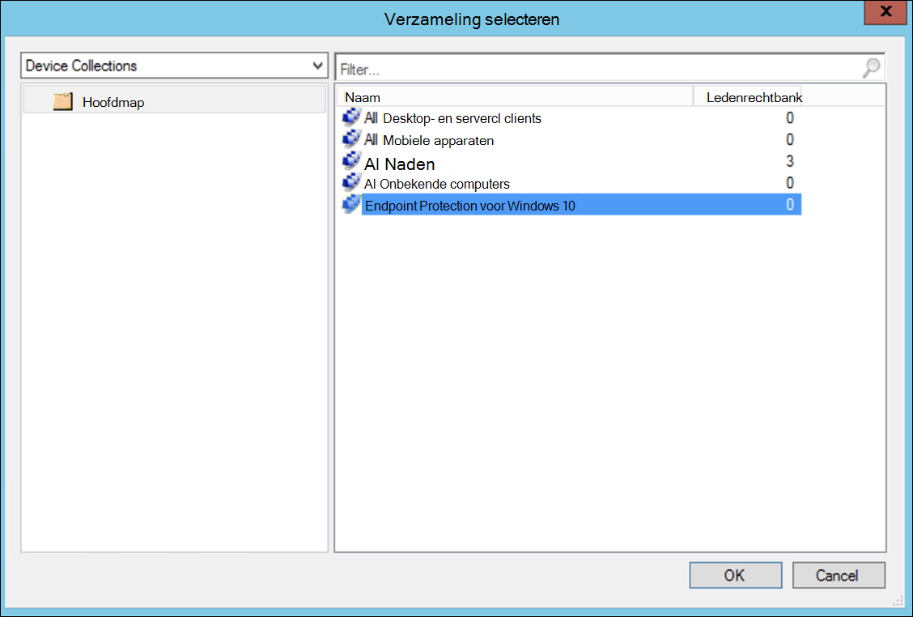
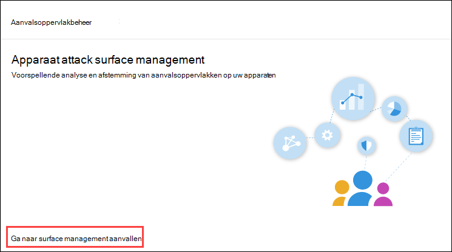

# Onboarden met behulp van Microsoft Endpoint Configuration ManagerOnboarding using Microsoft Endpoint Configuration Manager

[!INCLUDE [Microsoft 365 Defender rebranding](../../includes/microsoft-defender.md)]

**Van toepassing op:****Applies to:**
- [Microsoft Defender voor EindpuntMicrosoft Defender for Endpoint](https://go.microsoft.com/fwlink/p/?linkid=2154037)
- [Microsoft 365 DefenderMicrosoft 365 Defender](https://go.microsoft.com/fwlink/?linkid=2118804)

> Wilt u Microsoft Defender voor Eindpunt ervaren?Want to experience Microsoft Defender for Endpoint? [Meld u aan voor een gratis proefabonnement.Sign up for a free trial.](https://www.microsoft.com/microsoft-365/windows/microsoft-defender-atp?ocid=docs-wdatp-exposedapis-abovefoldlink)

Dit artikel maakt deel uit van de implementatiehandleiding en fungeert als voorbeeld voor onboarding.This article is part of the Deployment guide and acts as an example onboarding method. 

In het [onderwerp Planning](deployment-strategy.md) zijn verschillende methoden beschikbaar gesteld voor onboard-apparaten voor de service.In the [Planning](deployment-strategy.md) topic, there were several methods provided to onboard devices to the service. In dit onderwerp wordt de architectuur voor comanagement besproken.This topic covers the co-management architecture. 

 *Diagram van omgevingsarchitectuur*
*Diagram of environment architectures*

Hoewel Defender voor Eindpunt ondersteuning biedt voor onboarding van verschillende eindpunten en hulpprogramma's, worden deze niet in dit artikel beschreven.While Defender for Endpoint supports onboarding of various endpoints and tools, this article does not cover them. Zie Onboarding overview (Overzicht van onboarding) voor informatie over algemene onboarding met behulp van andere ondersteunde implementatiehulpmiddelen en [-methoden.](onboarding.md)For information on general onboarding using other supported deployment tools and methods, see [Onboarding overview](onboarding.md).

In dit onderwerp worden gebruikers begeleid in:This topic guides users in:
- Stap 1: Onboarding Windows apparaten aan de serviceStep 1: Onboarding Windows devices to the service 
- Stap 2: Defender configureren voor endpoint-mogelijkhedenStep 2: Configuring Defender for Endpoint capabilities

In deze onboarding-richtlijnen wordt u begeleid door de volgende basisstappen die u moet nemen bij het gebruik van Microsoft Endpoint Configuration Manager:This onboarding guidance will walk you through the following basic steps that you need to take when using Microsoft Endpoint Configuration Manager:
- **Een verzameling maken in Microsoft Endpoint Configuration Manager****Creating a collection in Microsoft Endpoint Configuration Manager**
- **Microsoft Defender configureren voor endpoint-mogelijkheden met Microsoft Endpoint Configuration Manager****Configuring Microsoft Defender for Endpoint capabilities using Microsoft Endpoint Configuration Manager**

>[!NOTE]
>Alleen Windows apparaten worden in dit voorbeeld geïmplementeerd.Only Windows devices are covered in this example deployment. 

## Stap 1: Onboard Windows apparaten met Microsoft Endpoint Configuration ManagerStep 1: Onboard Windows devices using Microsoft Endpoint Configuration Manager

### Verzameling makenCollection creation
Als u Windows 10 apparaten met Microsoft Endpoint Configuration Manager wilt gebruiken, kan de implementatie gericht zijn op een bestaande verzameling of kan er een nieuwe verzameling worden gemaakt om te testen.To onboard Windows 10 devices with Microsoft Endpoint Configuration Manager, the deployment can target an existing collection or a new collection can be created for testing. 

Onboarding met behulp van hulpmiddelen, zoals groepsbeleid of handmatige methode, installeert geen agent op het systeem.Onboarding using tools such as Group policy or manual method does not install any agent on the system. 

Binnen de Microsoft Endpoint Configuration Manager console wordt het onboardingproces geconfigureerd als onderdeel van de nalevingsinstellingen binnen de console.Within the Microsoft Endpoint Configuration Manager console the onboarding process will be configured as part of the compliance settings within the console.

Elk systeem dat deze vereiste configuratie ontvangt, blijft die configuratie behouden zolang de Configuration Manager-client dit beleid blijft ontvangen vanaf het beheerpunt.Any system that receives this required configuration will maintain that configuration for as long as the Configuration Manager client continues to receive this policy from the management point. 

Volg de onderstaande stappen om eindpunten aan te Microsoft Endpoint Configuration Manager.Follow the steps below to onboard endpoints using Microsoft Endpoint Configuration Manager.

1. Navigeer Microsoft Endpoint Configuration Manager console naar **Apparaatverzamelingen activa en \> \> complianceoverzicht.**In Microsoft Endpoint Configuration Manager console, navigate to **Assets and Compliance \> Overview \> Device Collections**.            

    

2. Klik met de **rechtermuisknop op Apparaatverzameling** en **selecteer Apparaatverzameling maken.**Right Click **Device Collection** and select **Create Device Collection**.

    

3. Geef een **naam en** verzameling **beperken op** en selecteer vervolgens **Volgende.**Provide a **Name** and **Limiting Collection**, then select **Next**.

    

4. Selecteer **Regel toevoegen** en kies **Queryregel.**Select **Add Rule** and choose **Query Rule**.

    

5.  Klik **op Volgende** in de wizard Direct **lidmaatschap** en klik op **Queryverklaring bewerken.**Click **Next** on the **Direct Membership Wizard** and click on **Edit Query Statement**.

     

6. Selecteer **Criteria** en kies vervolgens het sterpictogram.Select **Criteria** and then choose the star icon.

     

7. Houd criteriumtype als eenvoudige **waarde,** kies waar als besturingssysteem **- buildnummer**, operator **groter dan** of gelijk aan en waarde **14393** en klik op **OK.**Keep criterion type as **simple value**, choose where as **Operating System - build number**, operator as **is greater than or equal to** and value **14393** and click on **OK**.

    

8. Selecteer **Volgende** en **Sluiten.**Select **Next** and **Close**.

    

9. Selecteer **Volgende**.Select **Next**.

    

Na het voltooien van deze taak hebt u nu een apparaatverzameling met alle Windows 10 eindpunten in de omgeving.After completing this task, you now have a device collection with all the Windows 10 endpoints in the environment. 

## Stap 2: Microsoft Defender configureren voor endpoint-mogelijkhedenStep 2: Configure Microsoft Defender for Endpoint capabilities 
In deze sectie wordt u begeleid bij het configureren van de volgende mogelijkheden met Microsoft Endpoint Configuration Manager op Windows apparaten:This section guides you in configuring the following capabilities using Microsoft Endpoint Configuration Manager on Windows devices:

- [**Detectie van en reactie op eindpunt****Endpoint detection and response**](#endpoint-detection-and-response)
- [**Beveiliging van de volgende generatie****Next-generation protection**](#next-generation-protection)
- [**Kwetsbaarheid voor aanvallen verminderen****Attack surface reduction**](#attack-surface-reduction)

### Detectie van en reactie op eindpuntEndpoint detection and response
#### Windows 10Windows 10
Vanuit de Microsoft Defender-beveiligingscentrum is het mogelijk om het '.onboarding'-beleid te downloaden dat kan worden gebruikt om het beleid in System Center Configuration Manager te maken en dat beleid te implementeren op Windows 10 apparaten.From within the Microsoft Defender Security Center it is possible to download the '.onboarding' policy that can be used to create the policy in System Center Configuration Manager and deploy that policy to Windows 10 devices.

1. Selecteer in Microsoft Defender-beveiligingscentrum portal Instellingen [en vervolgens Onboarding.](https://securitycenter.windows.com/preferences2/onboarding)From a Microsoft Defender Security Center Portal, select [Settings and then Onboarding](https://securitycenter.windows.com/preferences2/onboarding).

2. Selecteer onder Implementatiemethode de ondersteunde versie van **Microsoft Endpoint Configuration Manager.**Under Deployment method select the supported version of **Microsoft Endpoint Configuration Manager**.

    

3. Selecteer **Downloadpakket.**Select **Download package**.

    

4. Sla het pakket op een toegankelijke locatie op.Save the package to an accessible location.
5. Ga Microsoft Endpoint Configuration Manager naar: Assets **and Compliance > Overview > Endpoint Protection > Microsoft Defender ATP Policies**.In  Microsoft Endpoint Configuration Manager, navigate to: **Assets and Compliance > Overview > Endpoint Protection > Microsoft Defender ATP Policies**.

6. Klik met de **rechtermuisknop Microsoft Defender ATP beleidsregels** en selecteer **Microsoft Defender ATP maken.**Right-click **Microsoft Defender ATP Policies** and select **Create Microsoft Defender ATP Policy**.

    

7. Voer de naam en beschrijving in, controleer **of Onboarding** is geselecteerd en selecteer **volgende.**Enter the name and description, verify **Onboarding** is selected, then select **Next**.

    

8. Klik **op Bladeren**.Click **Browse**.

9. Ga vanaf stap 4 hierboven naar de locatie van het gedownloade bestand.Navigate to the location of the downloaded file from step 4 above.

10. Klik op **Volgende**.Click **Next**.
11. Configureer de Agent met de juiste steekproeven **(Geen** of **Alle bestandstypen).**Configure the Agent with the appropriate samples (**None** or **All file types**).

    

12. Selecteer de juiste telemetrie **(Normaal** of **Versneld)** en klik vervolgens op **Volgende.**Select the appropriate telemetry (**Normal** or **Expedited**) then click **Next**.

    

14. Controleer de configuratie en klik vervolgens op **Volgende.**Verify the configuration, then click **Next**.

     

15. Klik **op Sluiten** wanneer de wizard is voltooid.Click **Close** when the Wizard completes.

16.  Klik in Microsoft Endpoint Configuration Manager console met de rechtermuisknop op het Beleid van Defender voor eindpunt dat u zojuist hebt gemaakt en selecteer **Implementeren.**In the Microsoft Endpoint Configuration Manager console, right-click the Defender for Endpoint policy you just created and select **Deploy**.

     

17. Selecteer in het rechtervenster de eerder gemaakte verzameling en klik op **OK.**On the right panel, select the previously created collection and click **OK**.

    

#### Vorige versies van Windows Client (Windows 7 en Windows 8.1)Previous versions of Windows Client (Windows 7 and Windows 8.1)
Volg de onderstaande stappen om de Defender for Endpoint Workspace ID en Workspace Key te identificeren, die vereist zijn voor het onboarden van eerdere versies van Windows.Follow the steps below to identify the Defender for Endpoint Workspace ID and Workspace Key, that will be required for the onboarding of previous versions of Windows.

1. Selecteer in Microsoft Defender-beveiligingscentrum portal Instellingen > **Onboarding.**From a Microsoft Defender Security Center Portal, select **Settings > Onboarding**.

2. Kies onder besturingssysteem **Windows 7 SP1 en 8.1**.Under operating system choose **Windows 7 SP1 and 8.1**.

3. Kopieer de **werkruimte-id** en **werkruimtesleutel en** sla ze op.Copy the **Workspace ID** and **Workspace Key** and save them. Ze worden later in het proces gebruikt.They will be used later in the process.

    

4. Installeer de Microsoft Monitoring Agent (MMA).Install the Microsoft Monitoring Agent (MMA).  
    MMA wordt momenteel (vanaf januari 2019) ondersteund op de volgende Windows besturingssystemen:MMA is currently (as of January 2019) supported on the following Windows Operating Systems:

    -   Server-SKU's: Windows Server 2008 SP1 of NieuwerServer SKUs: Windows Server 2008 SP1 or Newer

    -   Client-SKU's: Windows 7 SP1 en hogerClient SKUs: Windows 7 SP1 and later

    De MMA-agent moet worden geïnstalleerd op Windows apparaten.The MMA agent will need to be installed on Windows devices. Als u de agent wilt installeren, moeten sommige systemen de update voor klantervaring en diagnostische [telemetrie](https://support.microsoft.com/help/3080149/update-for-customer-experience-and-diagnostic-telemetry) downloaden om de gegevens met MMA te verzamelen.To install the agent, some systems will need to download the [Update for customer experience and diagnostic telemetry](https://support.microsoft.com/help/3080149/update-for-customer-experience-and-diagnostic-telemetry) in order to collect the data with MMA. Deze systeemversies omvatten, maar zijn mogelijk niet beperkt tot:These system versions include but may not be limited to:

    -   Windows 8.1Windows 8.1

    -   Windows 7Windows 7

    -   Windows Server 2016Windows Server 2016

    -   Windows Server 2012 R2Windows Server 2012 R2

    -   Windows Server 2008 R2Windows Server 2008 R2

    Met name voor Windows 7 SP1 moeten de volgende patches zijn geïnstalleerd:Specifically, for Windows 7 SP1, the following patches must be installed:

    -   [KB4074598 installeren](https://support.microsoft.com/help/4074598/windows-7-update-kb4074598)Install [KB4074598](https://support.microsoft.com/help/4074598/windows-7-update-kb4074598)

    -   Installeer een [.NET Framework 4.5](https://www.microsoft.com/download/details.aspx?id=30653) (of hoger) **of** 
         [KB3154518](https://support.microsoft.com/help/3154518/support-for-tls-system-default-versions-included-in-the-net-framework).Install either [.NET Framework 4.5](https://www.microsoft.com/download/details.aspx?id=30653) (or later) **or**
        [KB3154518](https://support.microsoft.com/help/3154518/support-for-tls-system-default-versions-included-in-the-net-framework).
        Installeer beide niet op hetzelfde systeem.Do not install both on the same system.

5. Zie de sectie Proxyinstellingen configureren als u een proxy gebruikt om verbinding te maken met internet.If you're using a proxy to connect to the Internet see the Configure proxy settings section.

Wanneer u klaar bent, ziet u binnen een uur onboarded eindpunten in de portal.Once completed, you should see onboarded endpoints in the portal within an hour.

### Beveiliging van de volgende generatieNext generation protection 
Microsoft Defender Antivirus is een ingebouwde antimalwareoplossing die de volgende generatie bescherming biedt voor desktops, draagbare computers en servers.Microsoft Defender Antivirus is a built-in antimalware solution that provides next generation protection for desktops, portable computers, and servers.

1. Ga in Microsoft Endpoint Configuration Manager console naar **Assets and Compliance Overview Endpoint Protection \> \> \> Antimalware Polices** en kies **Antimalwarebeleid maken.**In the Microsoft Endpoint Configuration Manager console, navigate to **Assets and Compliance \> Overview \> Endpoint Protection \> Antimalware Polices** and choose **Create Antimalware Policy**.

    

2. Selecteer **Geplande scans**, **Scaninstellingen**, **Standaardacties**, **Realtime** beveiliging **,** **Uitsluitingsinstellingen**, **Geavanceerd**, Bedreiging overschrijven , **Cloud Protection Service** en **Beveiligingsintelligentie-updates** en kies **OK**.Select **Scheduled scans**, **Scan settings**, **Default actions**, **Real-time protection**, **Exclusion settings**, **Advanced**, **Threat overrides**, **Cloud Protection Service** and **Security intelligence   updates** and choose **OK**.

    

    In bepaalde bedrijfstakken of sommige geselecteerde zakelijke klanten hebben mogelijk specifieke behoeften voor de configuratie van Antivirus.In certain industries or some select enterprise customers might have specific needs on how Antivirus is configured.

  
    [Snelle scan versus volledige scan en aangepaste scanQuick scan versus full scan and custom scan](/windows/security/threat-protection/microsoft-defender-antivirus/scheduled-catch-up-scans-microsoft-defender-antivirus#quick-scan-versus-full-scan-and-custom-scan)

    Zie Windows-beveiliging [configuratiekader voor meer informatie.](/windows/security/threat-protection/windows-security-configuration-framework/windows-security-configuration-framework)For more details, see [Windows Security configuration framework](/windows/security/threat-protection/windows-security-configuration-framework/windows-security-configuration-framework)
  
    

    

    

    

    

    

    

    

3. Klik met de rechtermuisknop op het nieuw gemaakte antimalwarebeleid en selecteer **Implementeren.**Right-click on the newly created antimalware policy and select **Deploy**.

    

4. Richt het nieuwe antimalwarebeleid op uw Windows 10 en klik op **OK.**Target the new antimalware policy to your Windows 10 collection and click **OK**.

     

Nadat u deze taak hebt voltooid, hebt u de Windows Defender Antivirus.After completing this task, you now have successfully configured Windows Defender Antivirus.

### Kwetsbaarheid voor aanvallen verminderenAttack surface reduction
De attack surface reduction-pijler van Defender for Endpoint bevat de functieset die beschikbaar is onder Exploit Guard.The attack surface reduction pillar of Defender for Endpoint includes the feature set that is available under Exploit Guard. Asr-regels (Attack Surface Reduction), Controlled Folder Access, Network Protection en Exploit Protection.Attack surface reduction (ASR) rules, Controlled Folder Access, Network Protection and Exploit Protection. 

Al deze functies bieden een auditmodus en een blokmodus.All these features provide an audit mode and a block mode. In de auditmodus is er geen effect op de eindgebruiker.In audit mode there is no end-user impact. Het enige wat u doet, is extra telemetrie verzamelen en beschikbaar maken in de Microsoft Defender-beveiligingscentrum.All it does is collect additional telemetry and make it available in the Microsoft Defender Security Center. Het doel van een implementatie is om beveiligingsbesturingselementen stapsgewijs naar de blokmodus te verplaatsen.The goal with a deployment is to step-by-step move security controls into block mode.

Asr-regels instellen in de auditmodus:To set ASR rules in Audit mode:

1. Ga in Microsoft Endpoint Configuration Manager console naar **Assets and Compliance \> Overview Endpoint Protection Windows Defender Exploit \> \> Guard** en kies **Exploit Guard Policy maken.**In the Microsoft Endpoint Configuration Manager console, navigate to **Assets and Compliance \> Overview \> Endpoint Protection \> Windows Defender Exploit Guard** and choose **Create Exploit Guard Policy**.

   

2.  Selecteer **Attack Surface Reduction**.Select **Attack Surface Reduction**.
   

3. Stel regels in op **Controleren** en klik op **Volgende.**Set rules to **Audit** and click **Next**.

    

4. Bevestig het nieuwe beleid van Exploit Guard door op Volgende te **klikken.**Confirm the new Exploit Guard policy by clicking on **Next**.

    

    
5. Wanneer het beleid is gemaakt, klikt u op **Sluiten.**Once the policy is created click **Close**.

    

    
   

6.  Klik met de rechtermuisknop op het nieuw gemaakte beleid en kies **Implementeren.**Right-click on the newly created policy and choose **Deploy**.
    
    

7. Richt het beleid op de nieuwe Windows 10 en klik op **OK.**Target the policy to the newly created Windows 10 collection and click **OK**.

    

Nadat u deze taak hebt voltooid, hebt u nu ASR-regels geconfigureerd in de auditmodus.After completing this task, you now have successfully configured ASR rules in audit mode.  
  
Hieronder vindt u aanvullende stappen om te controleren of ASR-regels correct worden toegepast op eindpunten.Below are additional steps to verify whether ASR rules are correctly applied to endpoints. (Dit kan enkele minuten duren)(This may take few minutes)

1. Navigeer vanuit een webbrowser naar <https://securitycenter.windows.com> .From a web browser, navigate to <https://securitycenter.windows.com>.

2.  Selecteer **Configuratiebeheer** in het linkermenu.Select **Configuration management** from left side menu.

3. Klik **op Ga naar aanvallen op surface management** in het Surface Management panel van Attack.Click **Go to attack surface management** in the Attack surface management panel. 
    
    

4. Klik **op het** tabblad Configuratie in rapporten met de surface reduction rules attack.Click **Configuration** tab in Attack surface reduction rules reports. Hier ziet u het overzicht van asr-regelsconfiguratie en de status van ASR-regels op elke apparaten.It shows ASR rules configuration overview and ASR rules status on each devices.

    

5. Klik op elk apparaat met configuratiedetails van ASR-regels.Click each device shows configuration details of ASR rules.

    

Zie [Asr-regelimplementatie en -detecties optimaliseren](/microsoft-365/security/defender-endpoint/configure-machines-asr)   voor meer informatie.See [Optimize ASR rule deployment and detections](/microsoft-365/security/defender-endpoint/configure-machines-asr)   for more details.  

#### Regels voor netwerkbeveiliging instellen in de auditmodus:Set Network Protection rules in Audit mode:
1. Ga in Microsoft Endpoint Configuration Manager console naar **Assets and Compliance \> Overview Endpoint Protection Windows Defender Exploit \> \> Guard** en kies **Exploit Guard Policy maken.**In the Microsoft Endpoint Configuration Manager console, navigate to **Assets and  Compliance \> Overview \> Endpoint Protection \> Windows Defender Exploit Guard** and choose **Create Exploit Guard Policy**.

    

2. Selecteer **Netwerkbeveiliging.**Select **Network protection**.

3. Stel de instelling in op **Controleren** en klik op **Volgende.**Set the setting to **Audit** and click **Next**. 

    

4. Bevestig het nieuwe beleid voor beveiligingsbeleid door op Volgende te **klikken.**Confirm the new Exploit Guard Policy by clicking **Next**.
    
    

5. Wanneer het beleid is gemaakt, klikt u op **Sluiten.**Once the policy is created click on **Close**.

    

6. Klik met de rechtermuisknop op het nieuw gemaakte beleid en kies **Implementeren.**Right-click on the newly created policy and choose **Deploy**.

    

7. Selecteer het beleid voor de nieuwe Windows 10 en kies **OK.**Select the policy to the newly created Windows 10 collection and choose **OK**.

    

Nadat u deze taak hebt voltooid, hebt u netwerkbeveiliging nu geconfigureerd in de auditmodus.After completing this task, you now have successfully configured Network Protection in audit mode.

#### Regels voor gecontroleerde maptoegang instellen in de auditmodus:To set Controlled Folder Access rules in Audit mode:

1. Ga in Microsoft Endpoint Configuration Manager console naar **Assets and Compliance \> Overview Endpoint Protection Windows Defender Exploit \> \> Guard** en kies **Exploit Guard Policy maken.**In the Microsoft Endpoint Configuration Manager console, navigate to **Assets and Compliance \> Overview \> Endpoint Protection \> Windows Defender Exploit Guard** and choose **Create Exploit Guard Policy**.

    

2. Selecteer **Gecontroleerde maptoegang.**Select **Controlled folder access**.
    
3. Stel de configuratie in op **Controleren** en klik op **Volgende.**Set the configuration to **Audit** and click **Next**.

        
    
4. Bevestig het nieuwe beleid voor beveiligingsbeleid door op Volgende te **klikken.**Confirm the new Exploit Guard Policy by clicking on **Next**.

    

5. Wanneer het beleid is gemaakt, klikt u op **Sluiten.**Once the policy is created click on **Close**.

    

6. Klik met de rechtermuisknop op het nieuw gemaakte beleid en kies **Implementeren.**Right-click on the newly created policy and choose **Deploy**.

    

7.  Richt het beleid op de nieuwe Windows 10 en klik op **OK.**Target the policy to the newly created Windows 10 collection and click **OK**.

    

U hebt nu beheerde maptoegang geconfigureerd in de auditmodus.You have now successfully configured Controlled folder access in audit mode.

## Verwant onderwerpRelated topic
- [Onboarden met behulp van Microsoft Endpoint ManagerOnboarding using Microsoft Endpoint Manager](onboarding-endpoint-manager.md)
