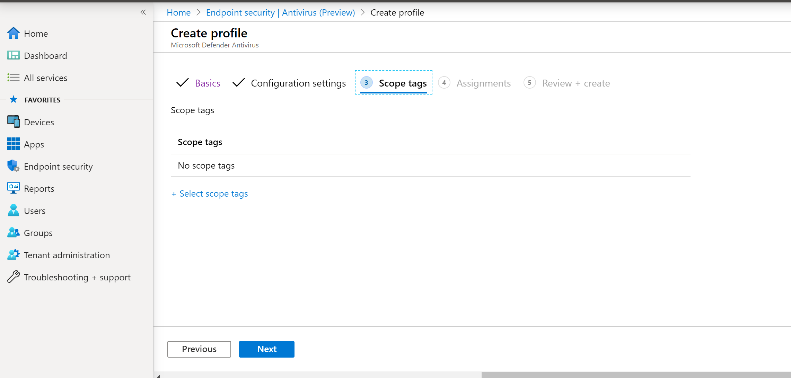

# Onboarden met behulp van Microsoft Endpoint Manager

[!INCLUDE [Microsoft 365 Defender rebranding](../../includes/microsoft-defender.md)]

**Van toepassing op:**
- [Microsoft Defender voor Eindpunt](https://go.microsoft.com/fwlink/p/?linkid=2154037)
- [Microsoft 365 Defender](https://go.microsoft.com/fwlink/?linkid=2118804)

> Wilt u Microsoft Defender voor Eindpunt ervaren? [Meld u aan voor een gratis proefabonnement.](https://www.microsoft.com/microsoft-365/windows/microsoft-defender-atp?ocid=docs-wdatp-exposedapis-abovefoldlink)

Dit artikel maakt deel uit van de implementatiehandleiding en fungeert als voorbeeld voor onboarding. 

In het [onderwerp Planning](deployment-strategy.md) zijn verschillende methoden beschikbaar gesteld voor onboard-apparaten voor de service. Dit onderwerp heeft betrekking op de cloud-native architectuur. 

 *Diagram van omgevingsarchitectuur*

Hoewel Defender voor Eindpunt ondersteuning biedt voor onboarding van verschillende eindpunten en hulpprogramma's, worden deze niet in dit artikel beschreven. Zie Onboarding overview (Overzicht van onboarding) voor informatie over algemene onboarding met behulp van andere ondersteunde implementatiehulpmiddelen en [-methoden.](onboarding.md)

[Microsoft Endpoint Manager](/mem/endpoint-manager-overview) is een oplossingsplatform waarmee verschillende services worden geseenigd. Het omvat [Microsoft Intune](/mem/intune/fundamentals/what-is-intune) voor apparaatbeheer in de cloud.

In dit onderwerp worden gebruikers begeleid in:
- Stap 1: Onboarding devices to the service by creating a group in Microsoft Endpoint Manager (MEM) to assign configurations on
- Stap 2: Defender configureren voor endpoint-mogelijkheden met Microsoft Endpoint Manager

In deze onboarding-richtlijnen wordt u begeleid door de volgende basisstappen die u moet nemen bij het gebruik van Microsoft Endpoint Manager:

-   [Doelapparaten of gebruikers identificeren](#identify-target-devices-or-users)

    -   Een groep Azure Active Directory maken (gebruiker of apparaat)

-   [Een configuratieprofiel maken](#step-2-create-configuration-policies-to-configure-microsoft-defender-for-endpoint-capabilities)

    -   In Microsoft Endpoint Manager begeleiden we u bij het maken van een afzonderlijk beleid voor elke mogelijkheid.

## Resources

Hier volgen de koppelingen die u nodig hebt voor de rest van het proces:

-   [MEM-portal](https://aka.ms/memac)

-   [Beveiligingscentrum](https://securitycenter.windows.com/)

-   [Basislijnen voor Intune-beveiliging](/mem/intune/protect/security-baseline-settings-defender-atp#microsoft-defender)

Voor meer informatie over Microsoft Endpoint Manager, raadpleegt u deze bronnen:
- [Microsoft Endpoint Manager pagina](/mem/)
- [Blogbericht over convergentie van Intune en ConfigMgr](https://www.microsoft.com/microsoft-365/blog/2019/11/04/use-the-power-of-cloud-intelligence-to-simplify-and-accelerate-it-and-the-move-to-a-modern-workplace/)
- [Inleidingsvideo over MEM](https://www.microsoft.com/microsoft-365/blog/2019/11/04/use-the-power-of-cloud-intelligence-to-simplify-and-accelerate-it-and-the-move-to-a-modern-workplace)

## Stap 1: Onboard-apparaten door een groep te maken in EENM om configuraties toe te wijzen aan
### Doelapparaten of gebruikers identificeren
In deze sectie maken we een testgroep om uw configuraties aan toe te wijzen.

>[!NOTE]
>Intune gebruikt Azure Active Directory (Azure AD) groepen om apparaten en gebruikers te beheren. Als Intune-beheerder kunt u groepen instellen die aan uw organisatiebehoeften voldoen. 
Zie Groepen toevoegen om [gebruikers en apparaten te ordenen voor meer informatie.](/mem/intune/fundamentals/groups-add)

### Een groep maken

1.  Open de MEM-portal.

2.  Open **Groepen > nieuwe groep.**

    > [!div class="mx-imgBorder"]
    > 

3.  Voer details in en maak een nieuwe groep.

    > [!div class="mx-imgBorder"]
    > 

4.  Voeg uw testgebruiker of -apparaat toe.

5.  Open de **nieuwe groep in het deelvenster Groepen >** Alle groepen.

6.  Selecteer **Leden > Leden toevoegen.**

7.  Zoek uw testgebruiker of -apparaat en selecteer deze.

    > [!div class="mx-imgBorder"]
    > 

8.  Uw testgroep heeft nu een lid om te testen.

## Stap 2: Configuratiebeleid maken om Microsoft Defender te configureren voor endpoint-mogelijkheden
In de volgende sectie maakt u een aantal configuratiebeleidsregels.

Ten eerste is er een configuratiebeleid om te selecteren welke groepen gebruikers of apparaten worden onboarded bij Defender for Endpoint:

- [Detectie van en reactie op eindpunt](#endpoint-detection-and-response) 

Vervolgens gaat u door met het maken van verschillende typen eindpuntbeveiligingsbeleid:

- [Beveiliging van de volgende generatie](#next-generation-protection)
- [Kwetsbaarheid voor aanvallen verminderen](#attack-surface-reduction--attack-surface-reduction-rules)

### Detectie van en reactie op eindpunt

1.  Open de MEM-portal.

2.  **Navigeer naar endpointbeveiliging > endpointdetectie en -antwoord.** Klik op **Profiel maken.**

    > [!div class="mx-imgBorder"]
    > 

3.  Selecteer **onder Platform de Windows 10 en Hoger, Profiel - Eindpuntdetectie en -antwoord > Maken.**

4.  Voer een naam en beschrijving in en selecteer **Volgende.**

    > [!div class="mx-imgBorder"]
    > 

5.  Selecteer zo nodig instellingen en selecteer  **vervolgens Volgende**.

    > [!div class="mx-imgBorder"]
    > 

    > [!NOTE]
    > In dit geval is dit automatisch ingevuld omdat Defender voor Eindpunt al is geïntegreerd met Intune. Zie Microsoft Defender voor eindpunt inschakelen [in Intune](/mem/intune/protect/advanced-threat-protection-configure#to-enable-microsoft-defender-atp)voor meer informatie over de integratie.
    > 
    > De volgende afbeelding is een voorbeeld van wat u ziet wanneer Microsoft Defender voor Eindpunt NIET is geïntegreerd met Intune:
    >
    > 

6.  Voeg indien nodig bereiklabels toe en selecteer **Volgende.**

    > [!div class="mx-imgBorder"]
    > 

7.  Voeg de testgroep toe door op Groepen **selecteren te klikken om uw** groep op te nemen en te kiezen en selecteer vervolgens **Volgende.**

    > [!div class="mx-imgBorder"]
    > 

8.  Controleer en accepteer en selecteer vervolgens **Maken.**

    > [!div class="mx-imgBorder"]
    > 

9.  U kunt uw voltooide beleid bekijken.

    > [!div class="mx-imgBorder"]
    > 

### Beveiliging van de volgende generatie

1.  Open de MEM-portal.

2.  Ga naar **Endpoint-beveiligingsprogramma'> Antivirus > Beleid maken.**

    > [!div class="mx-imgBorder"]
    > 

3.  Selecteer **Platform - Windows 10 en Hoger - Windows en Profiel - Microsoft Defender Antivirus > Maken.**

4.  Voer naam en beschrijving in en selecteer **Volgende.**

    > [!div class="mx-imgBorder"]
    > 

5.  Op de **pagina Configuratie-instellingen:** Stel de configuraties in die u nodig hebt voor Microsoft Defender Antivirus (Cloudbeveiliging, Uitsluitingen, Real-Time Beveiliging en Herstel).

    > [!div class="mx-imgBorder"]
    > 

6.  Voeg indien nodig bereiklabels toe en selecteer **Volgende.**

    > [!div class="mx-imgBorder"]
    > 

7.  Selecteer groepen die u wilt opnemen, wijs deze toe aan uw testgroep en  **selecteer** Volgende.

    > [!div class="mx-imgBorder"]
    > 

8.  Controleer en maak en selecteer vervolgens **Maken.**

    > [!div class="mx-imgBorder"]
    > 

9.  U ziet het configuratiebeleid dat u hebt gemaakt.

    > [!div class="mx-imgBorder"]
    > 

### Attack Surface Reduction – Attack surface reduction rules

1.  Open de MEM-portal.

2.  **Navigeer naar endpointbeveiliging > Attack surface reduction**.

3.  Selecteer **Beleid maken.**

4.  Selecteer **Platform - Windows 10 en Hoger - Profiel - Attack surface reduction rules > Create**.

    > [!div class="mx-imgBorder"]
    > 

5.  Voer een naam en beschrijving in en selecteer **Volgende.**

    > [!div class="mx-imgBorder"]
    > 

6.  Op de **pagina Configuratie-instellingen:** Stel de configuraties in die u nodig hebt voor De surface reduction-regels van Attack en selecteer vervolgens  **Volgende**.

    > [!NOTE]
    > We configureren alle regels voor het verlagen van de Surface Attack in Audit.
    > 
    > Zie Surface [Reduction Rules attack (Surface Reduction Rules) voor meer informatie.](attack-surface-reduction.md)

    > [!div class="mx-imgBorder"]
    > 

7.  Voeg zo nodig bereiklabels toe en selecteer **Volgende.**

    > [!div class="mx-imgBorder"]
    > 

8.  Selecteer groepen die u wilt opnemen en toewijzen aan de testgroep en selecteer vervolgens **Volgende.**

    > [!div class="mx-imgBorder"]
    > 

9. Bekijk de details en selecteer vervolgens **Maken.**

    > [!div class="mx-imgBorder"]
    > 

10. Bekijk het beleid.

    > [!div class="mx-imgBorder"]
    > 

### Attack Surface Reduction – Web Protection

1.  Open de MEM-portal.

2.  **Navigeer naar endpointbeveiliging > Attack surface reduction**.

3.  Selecteer **Beleid maken.**

4.  Selecteer **Windows 10 en Hoger : webbeveiliging > Maken.**

    > [!div class="mx-imgBorder"]
    > 

5.  Voer een naam en beschrijving in en selecteer **Volgende.**

    > [!div class="mx-imgBorder"]
    > 

6.  Op de **pagina Configuratie-instellingen:** Stel de configuraties in die u nodig hebt voor webbeveiliging en selecteer vervolgens **Volgende.**

    > [!NOTE]
    > We configureren Webbeveiliging op Blokkeren.
    > 
    > Zie Webbeveiliging voor [meer informatie.](web-protection-overview.md)

    > [!div class="mx-imgBorder"]
    > 

7.  Voeg **zo nodig bereiklabels > Volgende.**

    > [!div class="mx-imgBorder"]
    > 

8.  Selecteer **Toewijzen aan testgroep > Volgende**.

    > [!div class="mx-imgBorder"]
    > 

9.  Selecteer **Controleren en maken > Maken.**

    > [!div class="mx-imgBorder"]
    > 

10. Bekijk het beleid.

    > [!div class="mx-imgBorder"]
    > 

## Configuratie-instellingen valideren

### Beleid bevestigen is toegepast

Nadat het configuratiebeleid is toegewezen, duurt het enige tijd om toe te passen.

Zie Intune-configuratiegegevens voor [informatie over tijdsinstellingen.](/mem/intune/configuration/device-profile-troubleshoot#how-long-does-it-take-for-devices-to-get-a-policy-profile-or-app-after-they-are-assigned)

Als u wilt bevestigen dat het configuratiebeleid is toegepast op uw testapparaat, volgt u het volgende proces voor elk configuratiebeleid.

1.  Open de MEM-portal en ga naar het relevante beleid, zoals wordt weergegeven in de bovenstaande stappen. In het volgende voorbeeld ziet u de volgende generatie beveiligingsinstellingen.

    > [!div class="mx-imgBorder"]
    > 

2.  Selecteer het **configuratiebeleid om** de beleidsstatus weer te geven.

    > [!div class="mx-imgBorder"]
    > 

3.  Selecteer  **Apparaatstatus om** de status te zien.

    > [!div class="mx-imgBorder"]
    > 

4.  Selecteer  **Gebruikersstatus om** de status te zien.

    > [!div class="mx-imgBorder"]
    > 

5.  Selecteer  **Status per instelling om** de status te zien.

    >[!TIP]
    >Deze weergave is zeer handig om instellingen te identificeren die conflicteren met een ander beleid.

    > [!div class="mx-imgBorder"]
    > 

### Detectie van en reactie op eindpunt

1.  Voordat u de configuratie gaat toepassen, moet de Defender voor Endpoint Protection service niet worden gestart.

    > [!div class="mx-imgBorder"]
    > 

2.  Nadat de configuratie is toegepast, moet de Defender voor Endpoint Protection Service worden gestart.

    > [!div class="mx-imgBorder"]
    > 

3.  Nadat de services op het apparaat zijn uitgevoerd, wordt het apparaat weergegeven in Microsoft Defender-beveiligingscentrum.

    > [!div class="mx-imgBorder"]
    > 

### Beveiliging van de volgende generatie

1.  Voordat u het beleid op een testapparaat kunt toepassen, moet u de instellingen handmatig kunnen beheren, zoals hieronder wordt weergegeven.

    > [!div class="mx-imgBorder"]
    > 

2.  Nadat het beleid is toegepast, kunt u de instellingen niet handmatig beheren.

    > [!NOTE]
    > In de volgende afbeelding wordt Beveiliging  in de **cloud in-** en in-/uit-/in-/uit-beveiliging weergegeven als beheerd.

    > [!div class="mx-imgBorder"]
    > 

### Attack Surface Reduction – Attack surface reduction rules

1.  Voordat u het beleid op een testapparaat gaat toepassen, pent u een PowerShell-venster en typt `Get-MpPreference` u .

2.  Dit moet reageren met de volgende regels zonder inhoud:

    > AttackSurfaceReductionOnlyExclusions:
    > 
    > AttackSurfaceReductionRules_Actions:
    > 
    > AttackSurfaceReductionRules_Ids:

    

3.  Nadat u het beleid op een testapparaat hebt toegepast, opent u een PowerShell-Windows en typt `Get-MpPreference` u .

4.  Dit moet reageren met de volgende regels met inhoud zoals hieronder wordt weergegeven:

    

### Attack Surface Reduction – Web Protection

1.  Open op het testapparaat een PowerShell-Windows en typ `(Get-MpPreference).EnableNetworkProtection` .

2.  Dit moet reageren met een 0 zoals hieronder wordt weergegeven.

    

3.  Nadat u het beleid heeft toegepast, opent u een PowerShell-Windows en typt `(Get-MpPreference).EnableNetworkProtection` u .

4.  Dit moet reageren met een 1 zoals hieronder wordt weergegeven.

    
