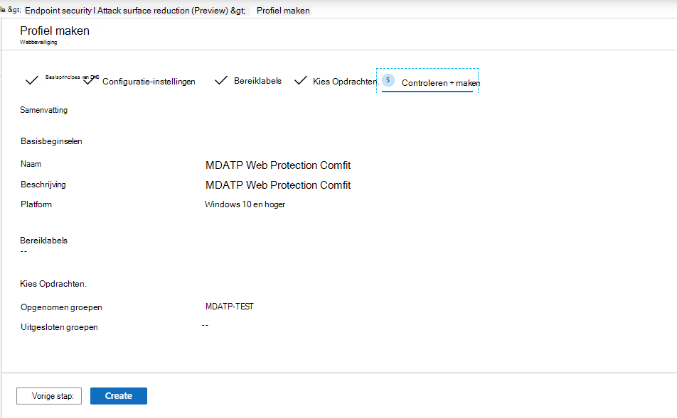

# Onboarding met Microsoft Endpoint ManagerOnboarding using Microsoft Endpoint Manager

[!INCLUDE [Microsoft 365 Defender rebranding](../../includes/microsoft-defender.md)]

**Van toepassing op:****Applies to:**
- [Microsoft Defender voor EndpointMicrosoft Defender for Endpoint](https://go.microsoft.com/fwlink/p/?linkid=2146631)
- [Microsoft 365 DefenderMicrosoft 365 Defender](https://go.microsoft.com/fwlink/?linkid=2118804)

> Wilt u Microsoft Defender voor Eindpunt ervaren?Want to experience Microsoft Defender for Endpoint? [Meld u aan voor een gratis proefabonnement.Sign up for a free trial.](https://www.microsoft.com/microsoft-365/windows/microsoft-defender-atp?ocid=docs-wdatp-exposedapis-abovefoldlink)

Dit artikel maakt deel uit van de implementatiehandleiding en fungeert als voorbeeld voor onboarding.This article is part of the Deployment guide and acts as an example onboarding method. 

In het [onderwerp Planning](deployment-strategy.md) zijn verschillende methoden beschikbaar gesteld voor onboard-apparaten voor de service.In the [Planning](deployment-strategy.md) topic, there were several methods provided to onboard devices to the service. Dit onderwerp heeft betrekking op de cloud-native architectuur.This topic covers the cloud-native architecture. 

 *Diagram van omgevingsarchitectuur*
*Diagram of environment architectures*

Hoewel Defender voor Eindpunt ondersteuning biedt voor onboarding van verschillende eindpunten en hulpprogramma's, worden deze niet in dit artikel beschreven.While Defender for Endpoint supports onboarding of various endpoints and tools, this article does not cover them. Zie Onboarding overview (Overzicht van onboarding) voor informatie over algemene onboarding met behulp van andere ondersteunde implementatiehulpmiddelen en [-methoden.](onboarding.md)For information on general onboarding using other supported deployment tools and methods, see [Onboarding overview](onboarding.md).

[Microsoft Endpoint Manager](https://docs.microsoft.com/mem/endpoint-manager-overview) is een oplossingsplatform waarmee verschillende services worden geseenigd.[Microsoft Endpoint Manager](https://docs.microsoft.com/mem/endpoint-manager-overview) is a solution platform that unifies several services. Het omvat [Microsoft Intune voor](https://docs.microsoft.com/mem/intune/fundamentals/what-is-intune) apparaatbeheer in de cloud.It includes [Microsoft Intune](https://docs.microsoft.com/mem/intune/fundamentals/what-is-intune) for cloud-based device management.

In dit onderwerp worden gebruikers begeleid in:This topic guides users in:
- Stap 1: Onboarding devices to the service by creating a group in Microsoft Endpoint Manager (MEM) to assign configurations onStep 1: Onboarding devices to the service by creating a group in Microsoft Endpoint Manager (MEM) to assign configurations on
- Stap 2: Defender configureren voor endpoint-mogelijkheden met Microsoft Endpoint ManagerStep 2: Configuring Defender for Endpoint capabilities using Microsoft Endpoint Manager

Met deze onboarding-richtlijnen wordt u begeleid door de volgende basisstappen die u moet nemen bij het gebruik van Microsoft Endpoint Manager:This onboarding guidance will walk you through the following basic steps that you need to take when using Microsoft Endpoint Manager:

-   [Doelapparaten of gebruikers identificerenIdentifying target devices or users](#identify-target-devices-or-users)

    -   Een Azure Active Directory-groep maken (gebruiker of apparaat)Creating an Azure Active Directory group (User or Device)

-   [Een configuratieprofiel makenCreating a Configuration Profile](#step-2-create-configuration-policies-to-configure-microsoft-defender-for-endpoint-capabilities)

    -   In Microsoft Endpoint Manager begeleiden we u bij het maken van een afzonderlijk beleid voor elke mogelijkheid.In Microsoft Endpoint Manager, we'll guide you in creating a separate policy for each capability.

## ResourcesResources

Hier volgen de koppelingen die u nodig hebt voor de rest van het proces:Here are the links you'll need for the rest of the process:

-   [MEM-portalMEM portal](https://aka.ms/memac)

-   [BeveiligingscentrumSecurity Center](https://securitycenter.windows.com/)

-   [Basislijnen voor Intune-beveiligingIntune Security baselines](https://docs.microsoft.com/mem/intune/protect/security-baseline-settings-defender-atp#microsoft-defender)

Zie deze bronnen voor meer informatie over Microsoft Endpoint Manager:For more information about Microsoft Endpoint Manager, check out these resources:
- [Microsoft Endpoint Manager-paginaMicrosoft Endpoint Manager page](https://docs.microsoft.com/mem/)
- [Blogbericht over convergentie van Intune en ConfigMgrBlog post on convergence of Intune and ConfigMgr](https://www.microsoft.com/microsoft-365/blog/2019/11/04/use-the-power-of-cloud-intelligence-to-simplify-and-accelerate-it-and-the-move-to-a-modern-workplace/)
- [Inleidingsvideo over MEMIntroduction video on MEM](https://www.microsoft.com/microsoft-365/blog/2019/11/04/use-the-power-of-cloud-intelligence-to-simplify-and-accelerate-it-and-the-move-to-a-modern-workplace)

## Stap 1: Onboard-apparaten door een groep te maken in EENM om configuraties toe te wijzen aanStep 1: Onboard devices by creating a group in MEM to assign configurations on
### Doelapparaten of gebruikers identificerenIdentify target devices or users
In deze sectie maken we een testgroep om uw configuraties aan toe te wijzen.In this section, we will create a test group to assign your configurations on.

>[!NOTE]
>Intune gebruikt Azure Active Directory -groepen (Azure AD) om apparaten en gebruikers te beheren.Intune uses Azure Active Directory (Azure AD) groups to manage devices and users. Als Intune-beheerder kunt u groepen instellen die aan uw organisatiebehoeften voldoen.As an Intune admin, you can set up groups to suit your organizational needs. 
Zie Groepen toevoegen om [gebruikers en apparaten te ordenen voor meer informatie.](https://docs.microsoft.com/mem/intune/fundamentals/groups-add)For more information, see [Add groups to organize users and devices](https://docs.microsoft.com/mem/intune/fundamentals/groups-add).

### Een groep makenCreate a group

1.  Open de MEM-portal.Open the MEM portal.

2.  Open **Groepen > nieuwe groep.**Open **Groups > New Group**.

    > [!div class="mx-imgBorder"]
    > 

3.  Voer details in en maak een nieuwe groep.Enter details and create a new group.

    > [!div class="mx-imgBorder"]
    > 

4.  Voeg uw testgebruiker of -apparaat toe.Add your test user or device.

5.  Open de **nieuwe groep in het deelvenster Groepen >** Alle groepen.From the **Groups > All groups** pane, open your new group.

6.  Selecteer **Leden > Leden toevoegen.**Select  **Members > Add members**.

7.  Zoek uw testgebruiker of -apparaat en selecteer deze.Find your test user or device and select it.

    > [!div class="mx-imgBorder"]
    > 

8.  Uw testgroep heeft nu een lid om te testen.Your testing group now has a member to test.

## Stap 2: Configuratiebeleid maken om Microsoft Defender te configureren voor endpoint-mogelijkhedenStep 2: Create configuration policies to configure Microsoft Defender for Endpoint capabilities
In de volgende sectie maakt u een aantal configuratiebeleidsregels.In the following section, you'll create a number of configuration policies.

Ten eerste is er een configuratiebeleid om te selecteren welke groepen gebruikers of apparaten worden onboarded bij Defender for Endpoint:First is a configuration policy to select which groups of users or devices will be onboarded to Defender for Endpoint:

- [Eindpuntdetectie en -antwoordEndpoint detection and response](#endpoint-detection-and-response) 

Vervolgens gaat u door met het maken van verschillende typen eindpuntbeveiligingsbeleid:Then you will continue by creating several different types of endpoint security policies:

- [Beveiliging van de volgende generatieNext-generation protection](#next-generation-protection)
- [Surface-beperking voor aanvallenAttack surface reduction](#attack-surface-reduction--attack-surface-reduction-rules)

### Eindpuntdetectie en -antwoordEndpoint detection and response

1.  Open de MEM-portal.Open the MEM portal.

2.  **Navigeer naar endpointbeveiliging > endpointdetectie en -antwoord.**Navigate to **Endpoint security > Endpoint detection and response**. Klik op **Profiel maken.**Click on **Create Profile**.

    > [!div class="mx-imgBorder"]
    > 

3.  Selecteer **onder Platform de optie Windows 10 en Hoger, Profiel - Eindpuntdetectie en -antwoord > Maken.**Under **Platform, select Windows 10 and Later, Profile - Endpoint detection and response > Create**.

4.  Voer een naam en beschrijving in en selecteer **Volgende.**Enter a name and description, then select  **Next**.

    > [!div class="mx-imgBorder"]
    > 

5.  Selecteer zo nodig instellingen en selecteer  **vervolgens Volgende**.Select settings as required, then select  **Next**.

    > [!div class="mx-imgBorder"]
    > 

    > [!NOTE]
    > In dit geval is dit automatisch ingevuld omdat Defender voor Eindpunt al is geïntegreerd met Intune.In this instance, this has been auto populated as Defender for Endpoint has already been integrated with Intune. Zie Microsoft Defender voor eindpunt inschakelen [in Intune](https://docs.microsoft.com/mem/intune/protect/advanced-threat-protection-configure#to-enable-microsoft-defender-atp)voor meer informatie over de integratie.For more information on the integration, see [Enable Microsoft Defender for Endpoint in Intune](https://docs.microsoft.com/mem/intune/protect/advanced-threat-protection-configure#to-enable-microsoft-defender-atp).
    > 
    > De volgende afbeelding is een voorbeeld van wat u ziet wanneer Microsoft Defender voor Eindpunt NIET is geïntegreerd met Intune:The following image is an example of what you'll see when Microsoft Defender for Endpoint is NOT integrated with Intune:
    >
    > 

6.  Voeg indien nodig bereiklabels toe en selecteer **Volgende.**Add scope tags if necessary, then select  **Next**.

    > [!div class="mx-imgBorder"]
    > 

7.  Voeg de testgroep toe door op Groepen **selecteren te klikken om uw** groep op te nemen en te kiezen en selecteer vervolgens **Volgende.**Add test group by clicking on **Select groups to include** and choose your group, then select  **Next**.

    > [!div class="mx-imgBorder"]
    > 

8.  Controleer en accepteer en selecteer vervolgens **Maken.**Review and accept, then select  **Create**.

    > [!div class="mx-imgBorder"]
    > 

9.  U kunt uw voltooide beleid bekijken.You can view your completed policy.

    > [!div class="mx-imgBorder"]
    > 

### Beveiliging van de volgende generatieNext-generation protection

1.  Open de MEM-portal.Open the MEM portal.

2.  Ga naar **Endpoint-beveiligingsprogramma'> Antivirus > Beleid maken.**Navigate to **Endpoint security > Antivirus > Create Policy**.

    > [!div class="mx-imgBorder"]
    > 

3.  Selecteer **Platform - Windows 10 en hoger - Windows en Profiel - Microsoft Defender Antivirus > Create**.Select **Platform - Windows 10 and Later - Windows and Profile – Microsoft Defender Antivirus > Create**.

4.  Voer naam en beschrijving in en selecteer **Volgende.**Enter name and description, then select  **Next**.

    > [!div class="mx-imgBorder"]
    > 

5.  Op de **pagina Configuratie-instellingen:** Stel de configuraties in die u nodig hebt voor Microsoft Defender Antivirus (Cloudbeveiliging, Uitsluitingen, Real-Time Beveiliging en Herstel).In the **Configuration settings page**: Set the configurations you require for Microsoft Defender Antivirus (Cloud Protection, Exclusions, Real-Time Protection, and Remediation).

    > [!div class="mx-imgBorder"]
    > 

6.  Voeg indien nodig bereiklabels toe en selecteer **Volgende.**Add scope tags if necessary, then select  **Next**.

    > [!div class="mx-imgBorder"]
    > 

7.  Selecteer groepen die u wilt opnemen, wijs deze toe aan uw testgroep en  **selecteer** Volgende.Select groups to include, assign to your test group, then select  **Next**.

    > [!div class="mx-imgBorder"]
    > 

8.  Controleer en maak en selecteer vervolgens **Maken.**Review and create, then select  **Create**.

    > [!div class="mx-imgBorder"]
    > 

9.  U ziet het configuratiebeleid dat u hebt gemaakt.You'll see the configuration policy you created.

    > [!div class="mx-imgBorder"]
    > 

### Attack Surface Reduction – Attack surface reduction rulesAttack Surface Reduction – Attack surface reduction rules

1.  Open de MEM-portal.Open the MEM portal.

2.  **Navigeer naar endpointbeveiliging > Attack surface reduction**.Navigate to **Endpoint security > Attack surface reduction**.

3.  Selecteer **Beleid maken.**Select  **Create Policy**.

4.  Selecteer **Platform - Windows 10 en Hoger - Profiel - Attack surface reduction rules > Create**.Select **Platform - Windows 10 and Later – Profile - Attack surface reduction rules > Create**.

    > [!div class="mx-imgBorder"]
    > 

5.  Voer een naam en beschrijving in en selecteer **Volgende.**Enter a name and description, then select  **Next**.

    > [!div class="mx-imgBorder"]
    > 

6.  Op de **pagina Configuratie-instellingen:** Stel de configuraties in die u nodig hebt voor De surface reduction-regels van Attack en selecteer vervolgens  **Volgende**.In the **Configuration settings page**: Set the configurations you require for Attack surface reduction rules, then select  **Next**.

    > [!NOTE]
    > We configureren alle regels voor het verlagen van de Surface Attack in Audit.We will be configuring all of the Attack surface reduction rules to Audit.
    > 
    > Zie Surface [Reduction Rules attack (Surface Reduction Rules) voor meer informatie.](attack-surface-reduction.md)For more information, see [Attack surface reduction rules](attack-surface-reduction.md).

    > [!div class="mx-imgBorder"]
    > 

7.  Voeg zo nodig bereiklabels toe en selecteer **Volgende.**Add Scope Tags as required, then select  **Next**.

    > [!div class="mx-imgBorder"]
    > 

8.  Selecteer groepen die u wilt opnemen en toewijzen aan de testgroep en selecteer vervolgens **Volgende.**Select groups to include and assign to test group, then select  **Next**.

    > [!div class="mx-imgBorder"]
    > 

9. Bekijk de details en selecteer vervolgens **Maken.**Review the details, then select  **Create**.

    > [!div class="mx-imgBorder"]
    > 

10. Bekijk het beleid.View the policy.

    > [!div class="mx-imgBorder"]
    > 

### Attack Surface Reduction – Web ProtectionAttack Surface Reduction – Web Protection

1.  Open de MEM-portal.Open the MEM portal.

2.  **Navigeer naar endpointbeveiliging > Attack surface reduction**.Navigate to **Endpoint security > Attack surface reduction**.

3.  Selecteer **Beleid maken.**Select  **Create Policy**.

4.  Selecteer **Windows 10 en Hoger : webbeveiliging > Maken.**Select **Windows 10 and Later – Web protection > Create**.

    > [!div class="mx-imgBorder"]
    > 

5.  Voer een naam en beschrijving in en selecteer **Volgende.**Enter a name and description, then select  **Next**.

    > [!div class="mx-imgBorder"]
    > 

6.  Op de **pagina Configuratie-instellingen:** Stel de configuraties in die u nodig hebt voor webbeveiliging en selecteer vervolgens **Volgende.**In the **Configuration settings page**: Set the configurations you require for Web Protection, then select  **Next**.

    > [!NOTE]
    > We configureren Webbeveiliging op Blokkeren.We are configuring Web Protection to Block.
    > 
    > Zie Webbeveiliging voor [meer informatie.](web-protection-overview.md)For more information, see [Web Protection](web-protection-overview.md).

    > [!div class="mx-imgBorder"]
    > 

7.  Voeg **zo nodig bereiklabels > Volgende.**Add **Scope Tags as required > Next**.

    > [!div class="mx-imgBorder"]
    > 

8.  Selecteer **Toewijzen aan testgroep > Volgende**.Select **Assign to test group > Next**.

    > [!div class="mx-imgBorder"]
    > 

9.  Selecteer **Controleren en maken > Maken.**Select **Review and Create > Create**.

    > [!div class="mx-imgBorder"]
    > 

10. Bekijk het beleid.View the policy.

    > [!div class="mx-imgBorder"]
    > 

## Configuratie-instellingen validerenValidate configuration settings

### Beleid bevestigen is toegepastConfirm Policies have been applied

Nadat het configuratiebeleid is toegewezen, duurt het enige tijd om toe te passen.Once the Configuration policy has been assigned, it will take some time to apply.

Zie Intune-configuratiegegevens voor [informatie over tijdsinstellingen.](https://docs.microsoft.com/mem/intune/configuration/device-profile-troubleshoot#how-long-does-it-take-for-devices-to-get-a-policy-profile-or-app-after-they-are-assigned)For information on timing, see [Intune configuration information](https://docs.microsoft.com/mem/intune/configuration/device-profile-troubleshoot#how-long-does-it-take-for-devices-to-get-a-policy-profile-or-app-after-they-are-assigned).

Als u wilt bevestigen dat het configuratiebeleid is toegepast op uw testapparaat, volgt u het volgende proces voor elk configuratiebeleid.To confirm that the configuration policy has been applied to your test device, follow the following process for each configuration policy.

1.  Open de MEM-portal en ga naar het relevante beleid, zoals wordt weergegeven in de bovenstaande stappen.Open the MEM portal and navigate to the relevant policy as shown in the steps above. In het volgende voorbeeld ziet u de volgende generatie beveiligingsinstellingen.The following example shows the next generation protection settings.

    > [!div class="mx-imgBorder"]
    > 

2.  Selecteer het **configuratiebeleid om** de beleidsstatus weer te geven.Select  the **Configuration Policy** to view the policy status.

    > [!div class="mx-imgBorder"]
    > 

3.  Selecteer  **Apparaatstatus om** de status te zien.Select  **Device Status** to see the status.

    > [!div class="mx-imgBorder"]
    > 

4.  Selecteer  **Gebruikersstatus om** de status te zien.Select  **User Status** to see the status.

    > [!div class="mx-imgBorder"]
    > 

5.  Selecteer  **Status per instelling om** de status te zien.Select  **Per-setting status** to see the status.

    >[!TIP]
    >Deze weergave is zeer handig om instellingen te identificeren die conflicteren met een ander beleid.This view is very useful to identify any settings that conflict with another policy.

    > [!div class="mx-imgBorder"]
    > 

### Eindpuntdetectie en -antwoordEndpoint detection and response

1.  Voordat u de configuratie gaat toepassen, moet de Defender voor Endpoint Protection-service niet worden gestart.Before applying the configuration, the Defender for Endpoint Protection service should not be started.

    > [!div class="mx-imgBorder"]
    > 

2.  Nadat de configuratie is toegepast, moet de Defender for Endpoint Protection Service worden gestart.After the configuration has been applied, the Defender for Endpoint Protection Service should be started.

    > [!div class="mx-imgBorder"]
    > 

3.  Nadat de services op het apparaat zijn uitgevoerd, wordt het apparaat weergegeven in het Microsoft Defender-beveiligingscentrum.After the services are running on the device, the device appears in Microsoft Defender Security Center.

    > [!div class="mx-imgBorder"]
    > 

### Beveiliging van de volgende generatieNext-generation protection

1.  Voordat u het beleid op een testapparaat kunt toepassen, moet u de instellingen handmatig kunnen beheren, zoals hieronder wordt weergegeven.Before applying the policy on a test device, you should be able to manually manage the settings as shown below.

    > [!div class="mx-imgBorder"]
    > 

2.  Nadat het beleid is toegepast, kunt u de instellingen niet handmatig beheren.After the policy has been applied, you should not be able to manually manage the settings.

    > [!NOTE]
    > In de volgende afbeelding wordt Beveiliging  in de **cloud in-** en in-/uit-/in-/uit-beveiliging weergegeven als beheerd.In the following image **Turn on cloud-delivered protection** and **Turn on real-time protection** are being shown as managed.

    > [!div class="mx-imgBorder"]
    > 

### Attack Surface Reduction – Attack surface reduction rulesAttack Surface Reduction – Attack surface reduction rules

1.  Voordat u het beleid op een testapparaat gaat toepassen, pent u een PowerShell-venster en typt `Get-MpPreference` u .Before applying the policy on a test device, pen a PowerShell Window and type `Get-MpPreference`.

2.  Dit moet reageren met de volgende regels zonder inhoud:This should respond with the following lines with no content:

    > AttackSurfaceReductionOnlyExclusions:AttackSurfaceReductionOnlyExclusions:
    > 
    > AttackSurfaceReductionRules_Actions:AttackSurfaceReductionRules_Actions:
    > 
    > AttackSurfaceReductionRules_Ids:AttackSurfaceReductionRules_Ids:

    

3.  Nadat u het beleid op een testapparaat hebt toegepast, opent u een PowerShell Windows en typt `Get-MpPreference` u .After applying the policy on a test device, open a PowerShell Windows and type `Get-MpPreference`.

4.  Dit moet reageren met de volgende regels met inhoud zoals hieronder wordt weergegeven:This should respond with the following lines with content as shown below:

    

### Attack Surface Reduction – Web ProtectionAttack Surface Reduction – Web Protection

1.  Open op het testapparaat een PowerShell Windows en typ `(Get-MpPreference).EnableNetworkProtection` .On the test device, open a PowerShell Windows and type `(Get-MpPreference).EnableNetworkProtection`.

2.  Dit moet reageren met een 0 zoals hieronder wordt weergegeven.This should respond with a 0 as shown below.

    

3.  Nadat u het beleid heeft toegepast, opent u een PowerShell Windows en typt `(Get-MpPreference).EnableNetworkProtection` u .After applying the policy, open a PowerShell Windows and type `(Get-MpPreference).EnableNetworkProtection`.

4.  Dit moet reageren met een 1 zoals hieronder wordt weergegeven.This should respond with a 1 as shown below.

    
