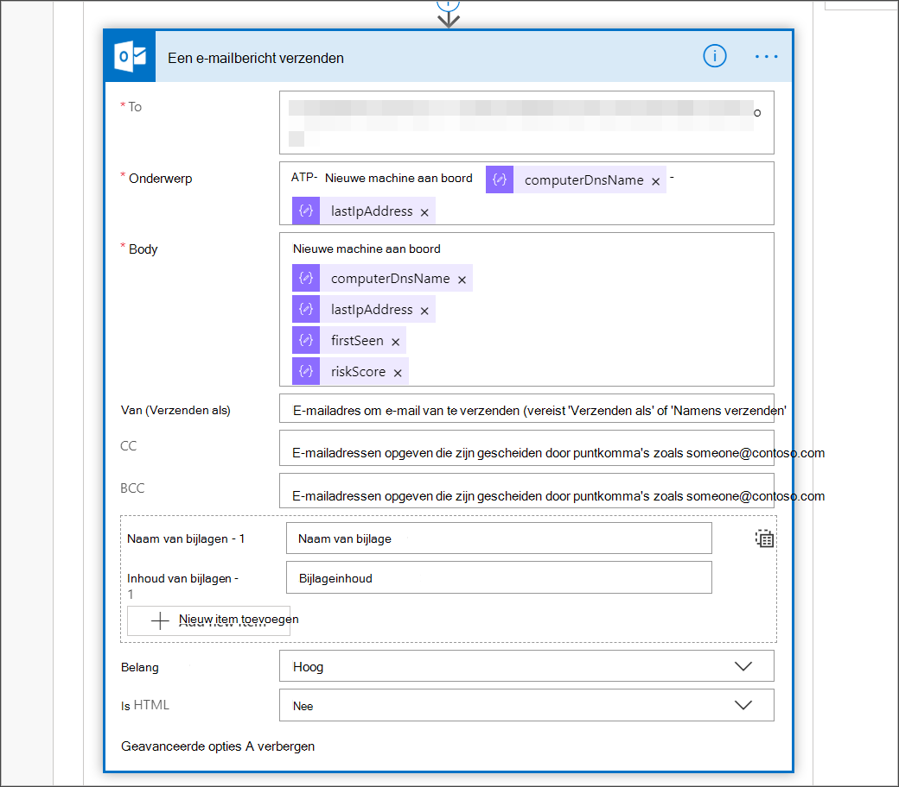

# <a name="create-a-notification-rule-when-a-local-onboarding-or-offboarding-script-is-used"></a><span data-ttu-id="861ae-104">Een meldingsregel maken wanneer een lokaal onboarding- of offboarding-script wordt gebruikt</span><span class="sxs-lookup"><span data-stu-id="861ae-104">Create a notification rule when a local onboarding or offboarding script is used</span></span>

[!INCLUDE [Microsoft 365 Defender rebranding](../../includes/microsoft-defender.md)]


<span data-ttu-id="861ae-105">**Van toepassing op:**</span><span class="sxs-lookup"><span data-stu-id="861ae-105">**Applies to:**</span></span>
- [<span data-ttu-id="861ae-106">Microsoft Defender voor Eindpunt</span><span class="sxs-lookup"><span data-stu-id="861ae-106">Microsoft Defender for Endpoint</span></span>](https://go.microsoft.com/fwlink/p/?linkid=2154037)
- [<span data-ttu-id="861ae-107">Microsoft 365 Defender</span><span class="sxs-lookup"><span data-stu-id="861ae-107">Microsoft 365 Defender</span></span>](https://go.microsoft.com/fwlink/?linkid=2118804)


> <span data-ttu-id="861ae-108">Wilt u Microsoft Defender voor Eindpunt ervaren?</span><span class="sxs-lookup"><span data-stu-id="861ae-108">Want to experience Microsoft Defender for Endpoint?</span></span> [<span data-ttu-id="861ae-109">Meld u aan voor een gratis proefabonnement.</span><span class="sxs-lookup"><span data-stu-id="861ae-109">Sign up for a free trial.</span></span>](https://www.microsoft.com/microsoft-365/windows/microsoft-defender-atp?ocid=docs-wdatp-exposedapis-abovefoldlink)

[!include[Microsoft Defender for Endpoint API URIs for US Government](../../includes/microsoft-defender-api-usgov.md)]

[!include[Improve request performance](../../includes/improve-request-performance.md)]


<span data-ttu-id="861ae-110">Maak een meldingsregel zodat wanneer een lokaal onboarding- of offboarding-script wordt gebruikt, u hiervan op de hoogte wordt gesteld.</span><span class="sxs-lookup"><span data-stu-id="861ae-110">Create a notification rule so that when a local onboarding or offboarding script is used, you'll be notified.</span></span> 

## <a name="before-you-begin"></a><span data-ttu-id="861ae-111">Voordat u begint</span><span class="sxs-lookup"><span data-stu-id="861ae-111">Before you begin</span></span>
<span data-ttu-id="861ae-112">U moet toegang hebben tot:</span><span class="sxs-lookup"><span data-stu-id="861ae-112">You'll need to have access to:</span></span>
 - <span data-ttu-id="861ae-113">Microsoft Flow (Flow minimaal abonnement 1).</span><span class="sxs-lookup"><span data-stu-id="861ae-113">Microsoft Flow (Flow Plan 1 at a minimum).</span></span> <span data-ttu-id="861ae-114">Zie de pagina prijzen [Flow meer informatie.](https://flow.microsoft.com/pricing/)</span><span class="sxs-lookup"><span data-stu-id="861ae-114">For more information, see [Flow pricing page](https://flow.microsoft.com/pricing/).</span></span>
 - <span data-ttu-id="861ae-115">Azure Table of SharePoint List or Library /SQL DB</span><span class="sxs-lookup"><span data-stu-id="861ae-115">Azure Table or SharePoint List or Library / SQL DB</span></span>

## <a name="create-the-notification-flow"></a><span data-ttu-id="861ae-116">De meldingsstroom maken</span><span class="sxs-lookup"><span data-stu-id="861ae-116">Create the notification flow</span></span>

1. <span data-ttu-id="861ae-117">In [flow.microsoft.com](https://flow.microsoft.com/).</span><span class="sxs-lookup"><span data-stu-id="861ae-117">In [flow.microsoft.com](https://flow.microsoft.com/).</span></span>

2. <span data-ttu-id="861ae-118">Ga naar **Mijn stromen > Nieuwe > Gepland - van leeg**.</span><span class="sxs-lookup"><span data-stu-id="861ae-118">Navigate to **My flows > New > Scheduled - from blank**.</span></span> 

    


3. <span data-ttu-id="861ae-120">Een geplande stroom maken.</span><span class="sxs-lookup"><span data-stu-id="861ae-120">Build a scheduled flow.</span></span>
   1. <span data-ttu-id="861ae-121">Voer een stroomnaam in.</span><span class="sxs-lookup"><span data-stu-id="861ae-121">Enter a flow name.</span></span>
   2. <span data-ttu-id="861ae-122">Geef het begin en de tijd op.</span><span class="sxs-lookup"><span data-stu-id="861ae-122">Specify the start and time.</span></span>
   3. <span data-ttu-id="861ae-123">Geef de frequentie op.</span><span class="sxs-lookup"><span data-stu-id="861ae-123">Specify the frequency.</span></span> <span data-ttu-id="861ae-124">Bijvoorbeeld om de 5 minuten.</span><span class="sxs-lookup"><span data-stu-id="861ae-124">For example, every 5 minutes.</span></span>

    

4. <span data-ttu-id="861ae-126">Selecteer de knop + om een nieuwe actie toe te voegen.</span><span class="sxs-lookup"><span data-stu-id="861ae-126">Select the + button to add a new action.</span></span> <span data-ttu-id="861ae-127">De nieuwe actie is een HTTP-aanvraag voor de Defender for Endpoint security center device(s) API(s).</span><span class="sxs-lookup"><span data-stu-id="861ae-127">The new action will be an HTTP request to the Defender for Endpoint security center device(s) API.</span></span> <span data-ttu-id="861ae-128">U kunt deze ook vervangen door de out-of-the-box 'WDATP Connector' (actie: 'Machines - Lijst met machines krijgen').</span><span class="sxs-lookup"><span data-stu-id="861ae-128">You can also replace it with the out-of-the-box "WDATP Connector" (action: "Machines - Get list of machines").</span></span> 

    


5. <span data-ttu-id="861ae-130">Voer de volgende HTTP-velden in:</span><span class="sxs-lookup"><span data-stu-id="861ae-130">Enter the following HTTP fields:</span></span>

   - <span data-ttu-id="861ae-131">Methode: 'GET' als een waarde om de lijst met apparaten te krijgen.</span><span class="sxs-lookup"><span data-stu-id="861ae-131">Method: "GET" as a value to get the list of devices.</span></span>
   - <span data-ttu-id="861ae-132">URI: Enter `https://api.securitycenter.microsoft.com/api/machines` .</span><span class="sxs-lookup"><span data-stu-id="861ae-132">URI: Enter `https://api.securitycenter.microsoft.com/api/machines`.</span></span>
   - <span data-ttu-id="861ae-133">Verificatie: Selecteer 'Active Directory OAuth'.</span><span class="sxs-lookup"><span data-stu-id="861ae-133">Authentication: Select "Active Directory OAuth".</span></span>
   - <span data-ttu-id="861ae-134">Tenant: Meld u aan bij https://portal.azure.com en navigeer naar Azure Active Directory > **app-registraties** en krijg de tenant-id-waarde.</span><span class="sxs-lookup"><span data-stu-id="861ae-134">Tenant: Sign-in to https://portal.azure.com and navigate to **Azure Active Directory > App Registrations** and get the Tenant ID value.</span></span>
   - <span data-ttu-id="861ae-135">Doelgroep: `https://securitycenter.onmicrosoft.com/windowsatpservice\`</span><span class="sxs-lookup"><span data-stu-id="861ae-135">Audience: `https://securitycenter.onmicrosoft.com/windowsatpservice\`</span></span>
   - <span data-ttu-id="861ae-136">Client-id: Meld u aan bij https://portal.azure.com en navigeer naar **Azure Active Directory > app-registraties** en ontvang de waarde Client-id.</span><span class="sxs-lookup"><span data-stu-id="861ae-136">Client ID: Sign-in to https://portal.azure.com and navigate to **Azure Active Directory > App Registrations** and  get the Client ID value.</span></span>
   - <span data-ttu-id="861ae-137">Referentietype: Selecteer 'Geheim'.</span><span class="sxs-lookup"><span data-stu-id="861ae-137">Credential Type: Select "Secret".</span></span>
   - <span data-ttu-id="861ae-138">Geheim: Meld u aan bij https://portal.azure.com en navigeer naar Azure Active Directory > **app-registraties** en ontvang de tenant-id-waarde.</span><span class="sxs-lookup"><span data-stu-id="861ae-138">Secret: Sign-in to https://portal.azure.com and navigate to **Azure Active Directory > App Registrations** and get the Tenant ID value.</span></span>

    


6. <span data-ttu-id="861ae-140">Voeg een nieuwe stap toe door **Nieuwe actie toevoegen te selecteren** en vervolgens gegevensbewerkingen te **zoeken** en **Parse JSON te selecteren.**</span><span class="sxs-lookup"><span data-stu-id="861ae-140">Add a new step by selecting **Add new action** then search for **Data Operations** and select **Parse JSON**.</span></span>

    

7. <span data-ttu-id="861ae-142">Voeg Body toe in het **veld** Inhoud.</span><span class="sxs-lookup"><span data-stu-id="861ae-142">Add Body in the **Content** field.</span></span>

    

8. <span data-ttu-id="861ae-144">Selecteer de **voorbeeldlading gebruiken om een schemakoppeling te** genereren.</span><span class="sxs-lookup"><span data-stu-id="861ae-144">Select the **Use sample payload to generate schema** link.</span></span>

    

9. <span data-ttu-id="861ae-146">Kopieer en plak het volgende JSON-fragment:</span><span class="sxs-lookup"><span data-stu-id="861ae-146">Copy and paste the following JSON snippet:</span></span>

    ```
    {
        "type": "object",
        "properties": {
            "@@odata.context": {
                "type": "string"
            },
            "value": {
                "type": "array",
                "items": {
                    "type": "object",
                    "properties": {
                        "id": {
                            "type": "string"
                        },
                        "computerDnsName": {
                            "type": "string"
                        },
                        "firstSeen": {
                            "type": "string"
                        },
                        "lastSeen": {
                            "type": "string"
                        },
                        "osPlatform": {
                            "type": "string"
                        },
                        "osVersion": {},
                        "lastIpAddress": {
                            "type": "string"
                        },
                        "lastExternalIpAddress": {
                            "type": "string"
                        },
                        "agentVersion": {
                            "type": "string"
                        },
                        "osBuild": {
                            "type": "integer"
                        },
                        "healthStatus": {
                            "type": "string"
                        },
                        "riskScore": {
                            "type": "string"
                        },
                        "exposureScore": {
                            "type": "string"
                        },
                        "aadDeviceId": {},
                        "machineTags": {
                            "type": "array"
                        }
                    },
                    "required": [
                        "id",
                        "computerDnsName",
                        "firstSeen",
                        "lastSeen",
                        "osPlatform",
                        "osVersion",
                        "lastIpAddress",
                        "lastExternalIpAddress",
                        "agentVersion",
                        "osBuild",
                        "healthStatus",
                        "rbacGroupId",
                        "rbacGroupName",
                        "riskScore",
                        "exposureScore",
                        "aadDeviceId",
                        "machineTags"
                    ]
                }
            }
        }
    }

    ```

10.  <span data-ttu-id="861ae-147">Haal de waarden op uit de JSON-oproep en controleer of het onboarded-apparaat(en) al is geregistreerd in de lijst SharePoint als voorbeeld:</span><span class="sxs-lookup"><span data-stu-id="861ae-147">Extract the values from the JSON call and check if the onboarded device(s) is / are already registered at the SharePoint list as an example:</span></span>
- <span data-ttu-id="861ae-148">Zo ja, dan wordt er geen melding geactiveerd</span><span class="sxs-lookup"><span data-stu-id="861ae-148">If yes, no notification will be triggered</span></span>
- <span data-ttu-id="861ae-149">Als dit niet het probleem is, worden de nieuwe onboarded device(s) geregistreerd in de SharePoint lijst en wordt er een melding verzonden naar de Defender for Endpoint-beheerder</span><span class="sxs-lookup"><span data-stu-id="861ae-149">If no, will register the new onboarded device(s) in the SharePoint list and a notification will be sent to the Defender for Endpoint admin</span></span>

    

    

11. <span data-ttu-id="861ae-152">Voeg **onder** Voorwaarde de volgende expressie toe: 'lengte(body('Get_items')?[' waarde'])' en stelt u de voorwaarde in op gelijk aan 0.</span><span class="sxs-lookup"><span data-stu-id="861ae-152">Under **Condition**, add the following expression: "length(body('Get_items')?['value'])" and set the condition to equal to 0.</span></span>

    <span data-ttu-id="861ae-153"></span><span class="sxs-lookup"><span data-stu-id="861ae-153"></span></span>  
    <span data-ttu-id="861ae-154"> 
     </span><span class="sxs-lookup"><span data-stu-id="861ae-154"> 
    </span></span>  
<span data-ttu-id="861ae-155"></span><span class="sxs-lookup"><span data-stu-id="861ae-155"></span></span>

## <a name="alert-notification"></a><span data-ttu-id="861ae-156">Waarschuwingsmelding</span><span class="sxs-lookup"><span data-stu-id="861ae-156">Alert notification</span></span>
<span data-ttu-id="861ae-157">De volgende afbeelding is een voorbeeld van een e-mailmelding.</span><span class="sxs-lookup"><span data-stu-id="861ae-157">The following image is an example of an email notification.</span></span>


## <a name="tips"></a><span data-ttu-id="861ae-159">Tips</span><span class="sxs-lookup"><span data-stu-id="861ae-159">Tips</span></span>

- <span data-ttu-id="861ae-160">U kunt hier filteren met alleen lastSeen:</span><span class="sxs-lookup"><span data-stu-id="861ae-160">You can filter here using lastSeen only:</span></span>
    - <span data-ttu-id="861ae-161">Elke 60 minuten:</span><span class="sxs-lookup"><span data-stu-id="861ae-161">Every 60 min:</span></span>
      - <span data-ttu-id="861ae-162">Neem alle apparaten die de afgelopen 7 dagen voor het laatst zijn gezien.</span><span class="sxs-lookup"><span data-stu-id="861ae-162">Take all devices last seen in the past 7 days.</span></span> 

- <span data-ttu-id="861ae-163">Voor elk apparaat:</span><span class="sxs-lookup"><span data-stu-id="861ae-163">For each device:</span></span> 
    - <span data-ttu-id="861ae-164">Als de laatst gezien eigenschap zich op het interval van één uur van [-7 dagen, -7 dagen + 60 minuten ] -> Waarschuwing voor offboarding mogelijkheid.</span><span class="sxs-lookup"><span data-stu-id="861ae-164">If last seen property is on the one hour interval of [-7 days, -7days + 60 minutes ] -> Alert for offboarding possibility.</span></span>
    - <span data-ttu-id="861ae-165">Als de eerste keer wordt gezien op het afgelopen uur -> Waarschuwing voor onboarding.</span><span class="sxs-lookup"><span data-stu-id="861ae-165">If first seen is on the past hour -> Alert for onboarding.</span></span>

<span data-ttu-id="861ae-166">In deze oplossing hebt u geen dubbele waarschuwingen: Er zijn tenants die meerdere apparaten hebben.</span><span class="sxs-lookup"><span data-stu-id="861ae-166">In this solution you will not have duplicate alerts: There are tenants that have numerous devices.</span></span> <span data-ttu-id="861ae-167">Het verkrijgen van al deze apparaten kan erg duur zijn en kan paging vereisen.</span><span class="sxs-lookup"><span data-stu-id="861ae-167">Getting all those devices might be very expensive and might require paging.</span></span>

<span data-ttu-id="861ae-168">U kunt de query splitsen in twee query's:</span><span class="sxs-lookup"><span data-stu-id="861ae-168">You can split it to two queries:</span></span> 
1.  <span data-ttu-id="861ae-169">Voor offboarding neemt u alleen dit interval met behulp van de OData-$filter en meldt u alleen of aan de voorwaarden wordt voldaan.</span><span class="sxs-lookup"><span data-stu-id="861ae-169">For offboarding take only this interval using the OData $filter and only notify if the conditions are met.</span></span>
2.  <span data-ttu-id="861ae-170">Neem alle apparaten die het laatst zijn gezien in het afgelopen uur en controleer de eigenschap die het eerst is gezien (als de eerste gezien eigenschap zich op het afgelopen uur heeft voor het laatst gezien, moet de laatst geziene eigenschap er ook zijn).</span><span class="sxs-lookup"><span data-stu-id="861ae-170">Take all devices last seen in the past hour and check first seen property for them (if the first seen property is on the past hour, the last seen must be there too).</span></span> 

