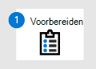
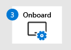

# Onboard to the Microsoft Defender for Endpoint serviceOnboard to the Microsoft Defender for Endpoint service

[!INCLUDE [Microsoft 365 Defender rebranding](../../includes/microsoft-defender.md)]

**Van toepassing op:****Applies to:**
- [Microsoft Defender voor EindpuntMicrosoft Defender for Endpoint](https://go.microsoft.com/fwlink/p/?linkid=2154037)
- [Microsoft 365 DefenderMicrosoft 365 Defender](https://go.microsoft.com/fwlink/?linkid=2118804)

> Wilt u Microsoft Defender voor Eindpunt ervaren?Want to experience Microsoft Defender for Endpoint? [Meld u aan voor een gratis proefabonnement.Sign up for a free trial.](https://www.microsoft.com/microsoft-365/windows/microsoft-defender-atp?ocid=docs-wdatp-exposedapis-abovefoldlink)

Meer informatie over de verschillende fasen van de implementatie van Microsoft Defender voor Eindpunt en hoe u de mogelijkheden binnen de oplossing configureert.Learn about the various phases of deploying Microsoft Defender for Endpoint and how to configure the capabilities within the solution. 

Het implementeren van Defender voor Eindpunt is een proces in drie fasen:Deploying Defender for Endpoint is a three-phase process:

|  [Fase 1: VoorbereidenPhase 1: Prepare](prepare-deployment.md) |  [Fase 2: InstellenPhase 2: Setup](production-deployment.md) |  Fase 3: OnboardenPhase 3: Onboard |
| ----- | ----- | ----- |
| | |*U bent er!**You are here!*|

U bent momenteel bezig met de onboardingfase.You are currently in the onboarding phase.

Dit zijn de stappen die u moet ondernemen om Defender voor Eindpunt te implementeren:These are the steps you need to take to deploy Defender for Endpoint:

- Stap 1: Eindpunten aan boord van de serviceStep 1: Onboard endpoints to the service 
- Stap 2: Mogelijkheden configurerenStep 2: Configure capabilities 

## Stap 1: Onboard-eindpunten met behulp van een van de ondersteunde beheerhulpmiddelenStep 1: Onboard endpoints using any of the supported management tools
Het [implementatieonderwerp](deployment-strategy.md) Plannen bevat een overzicht van de algemene stappen die u moet ondernemen om Defender voor Eindpunt te implementeren.The [Plan deployment](deployment-strategy.md) topic outlines the general steps you need to take to deploy Defender for Endpoint.  

Bekijk deze video voor een kort overzicht van het onboardingproces en lees meer over de beschikbare hulpprogramma's en methoden.Watch this video for a quick overview of the onboarding process and learn about the available tools and methods.
 
 

> [!VIDEO https://www.microsoft.com/en-us/videoplayer/embed/RE4bGqr]

Nadat u de architectuur hebt identificeren, moet u bepalen welke implementatiemethode u wilt gebruiken.After identifying your architecture, you'll need to decide which deployment method to use. Het implementatieprogramma dat u kiest, is van invloed op de manier waarop u eindpunten aan boord van de service inwerkt.The deployment tool you choose influences how you onboard endpoints to the service. 

### Opties voor onboarding-hulpprogramma'sOnboarding tool options

In de volgende tabel ziet u de beschikbare hulpprogramma's op basis van het eindpunt dat u nodig hebt om aan boord te gaan.The following table lists the available tools based on the endpoint that you need to onboard.

| EindpuntEndpoint     | Opties voor hulpprogramma'sTool options                       |
|--------------|------------------------------------------|
| **Windows****Windows**  |  [Lokaal script (maximaal 10 apparaten)Local script (up to 10 devices)](configure-endpoints-script.md)    [GroepsbeleidGroup Policy](configure-endpoints-gp.md)    [Microsoft Endpoint Manager/ Mobile Device ManagerMicrosoft Endpoint Manager/ Mobile Device Manager](configure-endpoints-mdm.md)   [Microsoft Endpoint Configuration ManagerMicrosoft Endpoint Configuration Manager](configure-endpoints-sccm.md)   [VDI-scriptsVDI scripts](configure-endpoints-vdi.md)   [Azure Security CenterAzure Security Center](configure-server-endpoints.md#integration-with-azure-security-center) |
| **macOS****macOS**    | [Lokale scriptsLocal scripts](mac-install-manually.md)   [Microsoft Endpoint ManagerMicrosoft Endpoint Manager](mac-install-with-intune.md)   [JAMF ProJAMF Pro](mac-install-with-jamf.md)   [Mobile Device ManagementMobile Device Management](mac-install-with-other-mdm.md) |
| **Linux Server****Linux Server** | [Lokaal scriptLocal script](linux-install-manually.md)   [PoppopPuppet](linux-install-with-puppet.md)   [AnsibleAnsible](linux-install-with-ansible.md)|
| **iOS****iOS**      | [App-gebaseerdeApp-based](ios-install.md)                                |
| **Android****Android**  | [Microsoft Endpoint ManagerMicrosoft Endpoint Manager](android-intune.md)               | 

## Stap 2: Mogelijkheden configurerenStep 2: Configure capabilities
Nadat u de eindpunten hebt onboarding, configureert u vervolgens de verschillende mogelijkheden, zoals eindpuntdetectie en -reactie, beveiliging van de volgende generatie en de beperking van het oppervlak van de aanval.After onboarding the endpoints, you'll then configure the various capabilities such as endpoint detection and response, next-generation protection, and attack surface reduction. 

## VoorbeeldimplementatiesExample deployments
In deze implementatiehandleiding begeleiden we u bij het gebruik van twee implementatiehulpmiddelen voor het onboarden van eindpunten en het configureren van mogelijkheden.In this deployment guide, we'll guide you through using two deployment tools to onboard endpoints and how to configure capabilities.

De hulpprogramma's in de voorbeeldimplementaties zijn:The tools in the example deployments are:
- [Onboarden met behulp van Microsoft Endpoint Configuration ManagerOnboarding using Microsoft Endpoint Configuration Manager](onboarding-endpoint-configuration-manager.md)
- [Onboarden met behulp van Microsoft Endpoint ManagerOnboarding using Microsoft Endpoint Manager](onboarding-endpoint-manager.md)

Met behulp van de bovenstaande implementatiehulpmiddelen wordt u begeleid bij het configureren van de volgende Mogelijkheden van Defender voor Eindpunt:Using the mentioned deployment tools above, you'll then be guided in configuring the following Defender for Endpoint capabilities:
- Configuratie van eindpuntdetectie en -antwoordEndpoint detection and response configuration
- Beveiligingsconfiguratie van de volgende generatieNext-generation protection configuration
- Surface Reduction-configuratie voor aanvallenAttack surface reduction configuration

## Verwante onderwerpenRelated topics
- [Onboarden met behulp van Microsoft Endpoint Configuration ManagerOnboarding using Microsoft Endpoint Configuration Manager](onboarding-endpoint-configuration-manager.md)
- [Onboarden met behulp van Microsoft Endpoint ManagerOnboarding using Microsoft Endpoint Manager](onboarding-endpoint-manager.md)
- [Veilige documenten in Microsoft 365 E5Safe Documents in Microsoft 365 E5](../office-365-security/safe-docs.md)
