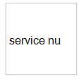

# Partnertoepassingen in Microsoft Defender voor Eindpunt 

[!INCLUDE [Microsoft 365 Defender rebranding](../../includes/microsoft-defender.md)]

**Van toepassing op:**
- [Microsoft Defender voor Endpoint](https://go.microsoft.com/fwlink/p/?linkid=2146631)
- [Microsoft 365 Defender](https://go.microsoft.com/fwlink/?linkid=2118804)

> Wilt u Microsoft Defender voor Eindpunt ervaren? [Meld u aan voor een gratis proefabonnement.](https://www.microsoft.com/microsoft-365/windows/microsoft-defender-atp?ocid=docs-wdatp-exposedapis-abovefoldlink)

Defender voor Eindpunt ondersteunt toepassingen van derden om de mogelijkheden voor detectie, onderzoek en bedreigingsinformatie van het platform te verbeteren.

De ondersteuning voor oplossingen van derden helpt bij het verder stroomlijnen, integreren en organiseren van verdedigingen van andere leveranciers met Microsoft Defender voor Eindpunt; beveiligingsteams in staat stellen beter te reageren op moderne bedreigingen.

Microsoft Defender voor Eindpunt integreert naadloos met bestaande beveiligingsoplossingen. De integratie biedt integratie met de volgende oplossingen, zoals:

- SIEM
- Oplossingen voor ticketing en IT-servicebeheer
- Beheerde beveiligingsserviceproviders (MSSP)
- IoC-indicatoren ingesties en matching
- Automatisch apparaatonderzoek en -herstel op basis van externe waarschuwingen
- Integratie met soar-systemen (Security Orchestration and Automation Response)

## Ondersteunde toepassingen

### Beveiligingsgegevens en -analyses

Logo |Partnernaam   | Beschrijving 
:---|:---|:---
| [AttackIQ-platform](https://go.microsoft.com/fwlink/?linkid=2103502) | AttackIQ-platform valideert Dat Defender voor Eindpunt correct is geconfigureerd door continue aanvallen veilig op productieactiva te starten
| [AzureSentinel](https://go.microsoft.com/fwlink/?linkid=2135705) | Waarschuwingen van Microsoft Defender voor Eindpunt streamen naar Azure Sentinel 
 | [Cymulate](https://go.microsoft.com/fwlink/?linkid=2135574)| Gegevens van Defender voor eindpunten correleren met gesimuleerde aanvallen om nauwkeurige detectie en effectieve reactieacties te valideren
 | [Elastische beveiliging](https://go.microsoft.com/fwlink/?linkid=2139303) | Elastic Security is een gratis en open oplossing voor het voorkomen, detecteren en beantwoorden van bedreigingen
 | [IBM QRadar](https://go.microsoft.com/fwlink/?linkid=2113903) | IBM QRadar configureren om detecties van Defender voor Eindpunt te verzamelen 
 | [MicroFocus ArcSight](https://go.microsoft.com/fwlink/?linkid=2113548) | MicroFocus ArcSight gebruiken om Defender voor eindpuntdetecties te trekken
 | [RSA NetWitness](https://go.microsoft.com/fwlink/?linkid=2118566) | Stream Defender for Endpoint Alerts to RSA NetWitness using Microsoft Graph Security API
 | [SafeBreach](https://go.microsoft.com/fwlink/?linkid=2114114)| Zichtbaarheid krijgen in beveiligingsgebeurtenissen van Defender voor eindpunten die automatisch worden gecorreleerd met SafeBreach-simulaties
 | [Skybox Vulnerability Control](https://go.microsoft.com/fwlink/?linkid=2127467) | Skybox Vulnerability Control doorsnijdt het geluid van kwetsbaarheidsbeheer, correlerende context voor bedrijven, netwerken en bedreigingen om uw meest risicovolle beveiligingslekken aan het licht te brengen
 | [Splunk](https://go.microsoft.com/fwlink/?linkid=2129805) | Met de invoeging defender voor eindpunt kunnen Splunk-gebruikers alle waarschuwingen en ondersteunende informatie opnemen in hun Splunk
 | [XM Cyber](https://go.microsoft.com/fwlink/?linkid=2136700) | Prioriteit geven aan uw antwoord op een waarschuwing op basis van risicofactoren en activa met een hoge waarde

### Georkestreerde en automatisering

Logo |Partnernaam   | Beschrijving 
:---|:---|:---
 | [CyberSponse CyOps](https://go.microsoft.com/fwlink/?linkid=2115943) | CyOps integreert met Defender for Endpoint om de snel reagerende playbooks voor incidenten van klanten te automatiseren
 | [Delta Risk ActiveEye](https://go.microsoft.com/fwlink/?linkid=2127468) | Delta Risk, een toonaangevende provider van SOC-as-a-Service en beveiligingsservices, integreert Defender for Endpoint met het cloud-native SOAR-platform ActiveEye.
 | [Demisto, een Palo Alto Networks Company](https://go.microsoft.com/fwlink/?linkid=2108414) | Demisto wordt geïntegreerd met Defender voor Endpoint om beveiligingsteams in staat te stellen beveiligingscontrole, verrijking en reactie van eindpunten te orden en te automatiseren
 | [Microsoft Flow & Azure-functies](https://go.microsoft.com/fwlink/?linkid=2114300) | Gebruik de Defender voor Eindpunt-connectors voor Azure Logic Apps & Microsoft Flow om beveiligingsprocedures te automatiseren
 | [Rapid7 InsightConnect](https://go.microsoft.com/fwlink/?linkid=2116040) | InsightConnect integreert met Defender voor Endpoint om uw tijdintensieve beveiligingsprocessen te versnellen, stroomlijnen en integreren
 | [ServiceNow](https://go.microsoft.com/fwlink/?linkid=2135621) | Waarschuwingen opnemen in serviceNow-beveiligingsbewerkingsoplossing op basis van Microsoft Graph API-integratie
 | [Zwembaan](https://go.microsoft.com/fwlink/?linkid=2113902) | Mogelijkheden voor incidentrespons maximaliseren met Swimlane en Defender voor eindpunten

### Bedreigingsinformatie

Logo |Partnernaam   | Beschrijving 
:---|:---|:---
 | [MISP (Platform voor het delen van malwaregegevens)](https://go.microsoft.com/fwlink/?linkid=2127543) | Bedreigingsindicatoren van het Open Source Threat Intelligence Sharing Platform integreren in uw Defender for Endpoint-omgeving
 | [Palo Alto Networks](https://go.microsoft.com/fwlink/?linkid=2099582) | Verrijk uw eindpuntbeveiliging door Autofocus en andere bedreigingsfeeds uit te breiden naar Defender voor Eindpunt met MineMeld
 | [ThreatConnect](https://go.microsoft.com/fwlink/?linkid=2114115) | Waarschuwing en/of blokkeren op aangepaste bedreigingsinformatie uit ThreatConnect Playbooks met Defender voor eindpuntindicatoren

### Netwerkbeveiliging
Logo |Partnernaam   | Beschrijving 
:---|:---|:---
 | [Aruba ClearPass Policy Manager](https://go.microsoft.com/fwlink/?linkid=2127544) | Ervoor zorgen dat Defender voor Eindpunt is geïnstalleerd en bijgewerkt op elk eindpunt voordat u toegang tot het netwerk toestaat
 | [Blue Hexagon voor Network](https://go.microsoft.com/fwlink/?linkid=2104613) | Blue Hexagon heeft het eerste realtime deep learning-platform voor netwerkbedreigingen ontwikkeld
 | [CyberMDX](https://go.microsoft.com/fwlink/?linkid=2135620) | Cyber MDX integreert uitgebreide zichtbaarheid van gezondheidsactiva, bedreigingspreventie en repose in uw Defender for Endpoint-omgeving
 |[Vectra Network Detection and Response (NDR)](https://go.microsoft.com/fwlink/?linkid=866934)| Vectra past AI-& beveiligingsonderzoek toe om cyberaanvallen in realtime te detecteren en te beantwoorden

### Platform kruisen
Logo |Partnernaam   | Beschrijving 
:---|:---|:---
| [Bitdefender](https://go.microsoft.com/fwlink/?linkid=860032)| Bitdefender Ernstzone is een gelaagd platform voor de beveiliging van eindpunten van de volgende generatie dat uitgebreide bescherming biedt tegen het volledige spectrum van geavanceerde cyberbedreigingen
 | [Betere mobiele telefoon](https://go.microsoft.com/fwlink/?linkid=2086214)| OP AI gebaseerde MTD-oplossing om mobiele bedreigingen tegen te & phishing. Privé surfen op internet om de privacy van gebruikers te beschermen 
| [Corrata](https://go.microsoft.com/fwlink/?linkid=2081148) | Mobiele oplossing: bescherm uw mobiele apparaten met gedetailleerde zichtbaarheid en controle vanuit Corrata 
| [Lookout](https://go.microsoft.com/fwlink/?linkid=866935)| Telemetrie van Lookout Mobile Threat Protection downloaden voor mobiele android- en iOS-apparaten
 | [Symantec Endpoint Protection Mobile](https://go.microsoft.com/fwlink/?linkid=2090992)| SEP Mobile helpt bedrijven bij het voorspellen, detecteren en voorkomen van beveiligingsrisico's en beveiligingsproblemen op mobiele apparaten 
| [Zimperium](https://go.microsoft.com/fwlink/?linkid=2118044)|Uw Defender voor Eindpunt uitbreiden naar iOS en Android met mobiele bedreigingsdefensie op basis van Machine Learning

## Andere integraties

Logo |Partnernaam   | Beschrijving 
:---|:---|:---
| [Cyren-webfilter](https://go.microsoft.com/fwlink/?linkid=2108221)| Uw Defender voor eindpunt verbeteren met geavanceerde webfilters
| [Morphisec](https://go.microsoft.com/fwlink/?linkid=2086215)| Biedt geavanceerde preventie van bedreigingen door bewegend doelverdediging. Integreert gegevens uit het onderzoek rechtstreeks in WD-beveiligingscentrumdashboards om waarschuwingen prioriteit te geven, de risicoscore van het apparaat te bepalen en de tijdlijn van de volledige aanval te visualiseren, inclusief interne geheugengegevens
| [THOR Cloud](https://go.microsoft.com/fwlink/?linkid=862988)| Biedt op aanvraag live-technische scans met behulp van een handtekeningbasis met de focus op permanente bedreigingen

## SIEM-integratie
Defender for Endpoint ondersteunt SIEM-integratie via verschillende methoden. Dit kunnen gespecialiseerde SIEM-systeeminterfaces zijn met out-of-the-box-connectors, een algemene waarschuwings-API die aangepaste implementaties mogelijk maakt en een actie-API waarmee statusbeheer van waarschuwingen kan worden uitgevoerd.  Zie [SiEM-integratie inschakelen](enable-siem-integration.md)voor meer informatie.

## Ticketing en IT-servicebeheer 
Integratie van ticketing-oplossingen helpt bij het implementeren van handmatige en automatische antwoordprocessen. Defender voor Eindpunt kan u helpen om automatisch tickets te maken wanneer er een waarschuwing wordt gegenereerd en om de waarschuwingen op te lossen wanneer tickets worden gesloten met de api waarschuwingen. 

## Integratie van beveiligingsorkestratie en automatiseringsreactie (SOAR) 
Met deze oplossingen kunt u playbooks maken en het uitgebreide gegevensmodel en de acties integreren die door Defender for Endpoint-API's worden gebruikt om antwoorden te vermenigvuldigen, zoals query's voor apparaatgegevens, apparaatisolatie activeren, blokkeren/toestaan, waarschuwingen en andere oplossingen oplossen. 

## Externe waarschuwingscorrelatie en Geautomatiseerd onderzoek en herstel  
Defender voor Eindpunt biedt unieke geautomatiseerde onderzoeks- en herstelmogelijkheden om incidentrespons op schaal te krijgen.
  
Door de geautomatiseerde onderzoeks- en antwoordfunctie te integreren met andere oplossingen, zoals IDS en firewalls, kunnen waarschuwingen worden aangepakt en worden de complexiteit rond netwerk- en apparaatsignaalcorrelatie geminimaliseerd, wat het onderzoek en de herstelacties voor bedreigingen op apparaten effectief stroomlijnen.  

Externe waarschuwingen kunnen worden doorverded naar Defender voor Eindpunt. Deze waarschuwingen worden naast elkaar weergegeven met aanvullende waarschuwingen op apparaatbasis van Defender voor Eindpunt. Deze weergave biedt een volledige context van de waarschuwing en kan het volledige verhaal van een aanval weergeven.  

## Indicatoren die overeenkomen
U kunt bedreigingsinformatie van providers en aggregators gebruiken om compromisindicatoren (IOC's) te behouden en te gebruiken.

Met Defender voor Eindpunt kunt u integreren met deze oplossingen en op Ioc's reageren door uitgebreide telemetrie te correleren om waarschuwingen te maken.  U kunt ook preventie- en geautomatiseerde reactiemogelijkheden gebruiken om uitvoering te blokkeren en herstelacties uit te voeren wanneer er een overeenkomst is.

Defender voor Eindpunt ondersteunt momenteel IOC-matching en herstel voor bestands- en netwerkindicatoren. Blokkeren wordt ondersteund voor bestandsindicatoren.  

## Ondersteuning voor niet-Windows-platforms
Defender voor Eindpunt biedt een gecentraliseerde beveiligingsbewerkingservaring voor Windows- en niet-Windows-platforms, inclusief mobiele apparaten. U kunt waarschuwingen van verschillende ondersteunde besturingssystemen (OS) in de portal zien en het netwerk van uw organisatie beter beveiligen. 
