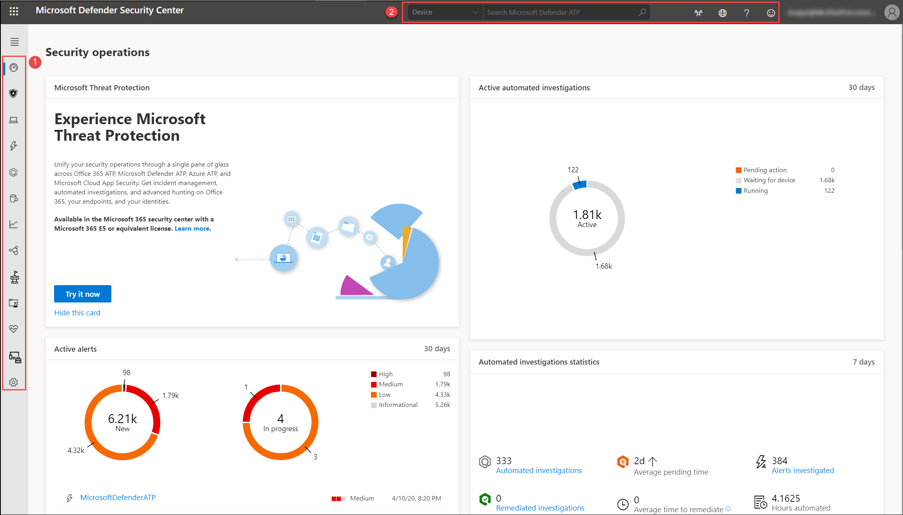

# Portaloverzicht van Microsoft Defender-beveiligingscentrumMicrosoft Defender Security Center portal overview

[!INCLUDE [Microsoft 365 Defender rebranding](../../includes/microsoft-defender.md)]

**Van toepassing op:****Applies to:**
- [Microsoft Defender voor EindpuntMicrosoft Defender for Endpoint](https://go.microsoft.com/fwlink/p/?linkid=2154037)
- [Microsoft 365 DefenderMicrosoft 365 Defender](https://go.microsoft.com/fwlink/?linkid=2118804)

>Wilt u Defender voor Eindpunt ervaren?Want to experience Defender for Endpoint? [Meld u aan voor een gratis proefabonnement.Sign up for a free trial.](https://www.microsoft.com/microsoft-365/windows/microsoft-defender-atp?ocid=docs-wdatp-portaloverview-abovefoldlink) 

Beveiligingsteams in het bedrijf kunnen Microsoft Defender-beveiligingscentrum om te controleren en te helpen bij het reageren op waarschuwingen van mogelijke geavanceerde permanente bedreigingsactiviteit of gegevensinbreuken.Enterprise security teams can use Microsoft Defender Security Center to monitor and assist in responding to alerts of potential advanced persistent threat activity or data breaches.

U kunt de volgende [Microsoft Defender-beveiligingscentrum](https://securitycenter.windows.com/) gebruiken:You can use [Microsoft Defender Security Center](https://securitycenter.windows.com/) to:

- Waarschuwingen weergeven, sorteren en triagen vanaf uw eindpuntenView, sort, and triage alerts from your endpoints
- Meer informatie zoeken over waargenomen indicatoren, zoals bestanden en IP-adressenSearch for more information on observed indicators such as files and IP Addresses
- Instellingen voor Microsoft Defender voor eindpunten wijzigen, inclusief tijdzone en licentiegegevens controlerenChange Microsoft Defender for Endpoint settings, including time zone and review licensing information

## Microsoft Defender-beveiligingscentrumMicrosoft Defender Security Center

Wanneer u de portal opent, ziet u:When you open the portal, you'll see:

- (1) Navigatiedeelvenster (selecteer de horizontale lijnen boven aan het navigatiedeelvenster om het weer te geven of te verbergen)(1) Navigation pane (select the horizontal lines at the top of the navigation pane to show or hide it)
- (2) Zoeken, Communitycentrum, Lokalisatie, Help en ondersteuning, Feedback(2) Search, Community center, Localization, Help and support, Feedback

 

> [!NOTE]
> Malwaregerelateerde detecties worden alleen weergegeven als uw apparaten Microsoft Defender Antivirus als het standaard antimalware-product voor realtimebeveiliging.Malware related detections will only appear if your devices are using Microsoft Defender Antivirus as the default real-time protection antimalware product.

U kunt door de portal navigeren met de menuopties die beschikbaar zijn in alle secties.You can navigate through the portal using the menu options available in all sections. Raadpleeg de volgende tabel voor een beschrijving van elke sectie.Refer to the following table for a description of each section.

GebiedArea | BeschrijvingDescription
:---|:---
**(1) Navigatiedeelvenster****(1) Navigation pane** | Gebruik het navigatiedeelvenster om te navigeren tussen **Dashboards** **,** Incidenten **,** Lijst apparaten **,** **Waarschuwingenwachtrij**, Geautomatiseerde onderzoeken **,** Geavanceerd zoeken **,** Rapporten , Partners & **API's**, **Threat & Vulnerability Management**, Evaluatie en **zelfstudies**, **Service health**, **Configuratiebeheer** en **Instellingen**.Use the navigation pane to move between **Dashboards**, **Incidents**, **Devices list**, **Alerts queue**, **Automated investigations**, **Advanced hunting**, **Reports**, **Partners & APIs**, **Threat & Vulnerability Management**, **Evaluation and tutorials**, **Service health**, **Configuration management**, and **Settings**. Selecteer de horizontale lijnen boven aan het navigatiedeelvenster om deze weer te geven of te verbergen.Select the horizontal lines at the top of the navigation pane to show or hide it.
**Dashboards****Dashboards** | Krijg toegang tot actieve geautomatiseerde onderzoeken, actieve waarschuwingen, statistieken van geautomatiseerde onderzoeken, apparaten met risico's, risicogebruikers, apparaten met sensorproblemen, servicetoestand, detectiebronnen en dashboards voor dagelijkse apparatenrapportage.Access the active automated investigations, active alerts, automated investigations statistics, devices at risk, users at risk, devices with sensor issues, service health, detection sources, and daily devices reporting dashboards.
**Incidenten****Incidents** | Waarschuwingen weergeven die zijn samengevoegd als incidenten.View alerts that have been aggregated as incidents.
**Lijst met apparaten****Devices list** | Hiermee wordt de lijst weergegeven met apparaten die zijn onboarded bij Defender for Endpoint, wat informatie over de apparaten en de blootstellings- en risiconiveaus.Displays the list of devices that are onboarded to Defender for Endpoint, some information about them, and their exposure and risk levels.
**Waarschuwingenwachtrij****Alerts queue** | Waarschuwingen weergeven die zijn gegenereerd op apparaten in uw organisatie.View alerts generated from devices in your organizations.
**Geautomatiseerde onderzoeken****Automated investigations** | Hiermee worden geautomatiseerde onderzoeken weergegeven die zijn uitgevoerd in het netwerk, met een waarschuwing, de status van elk onderzoek en andere details, zoals wanneer het onderzoek is gestart en de duur van het onderzoek.Displays automated investigations that have been conducted in the network, triggering alert, the status of each investigation and other details such as when the investigation started and the duration of the investigation.
**Geavanceerd opsporen****Advanced hunting** | Met geavanceerd zoeken kunt u proactief zoeken en onderzoeken in uw organisatie met behulp van een krachtig zoek- en queryhulpmiddel.Advanced hunting allows you to proactively hunt and investigate across your organization using a powerful search and query tool.
**Rapporten****Reports** | Bekijk grafieken met informatie over bedreigingsbeveiliging, apparaattoestand en -naleving, webbeveiliging en kwetsbaarheid.View graphs detailing threat protection, device health and compliance, web protection, and vulnerability.
**Partners en API's****Partners & APIs** | Ondersteunde partnerverbindingen weergeven, waarmee de mogelijkheden voor detectie, onderzoek en bedreigingsinformatie van het platform worden verbeterd.View supported partner connections, which enhance the detection, investigation, and threat intelligence capabilities of the platform. U kunt ook verbonden toepassingen, de API-verkenner, het API-gebruiksoverzicht en de instellingen voor gegevensexport bekijken.You can also view connected applications, the API explorer, API usage overview, and data export settings.
**Bedreiging & beveiligingsprobleembeheer****Threat & Vulnerability management** | Bekijk uw Microsoft Secure Score voor apparaten, blootstellingsscore, blootgestelde apparaten, kwetsbare software en onderneemt actie op de belangrijkste beveiligingsaanbevelingen.View your Microsoft Secure Score for Devices, exposure score, exposed devices, vulnerable software, and take action on top security recommendations.
**Evaluatie en zelfstudies****Evaluation and tutorials** | Testapparaten, aanvalssimulaties en rapporten beheren.Manage test devices, attack simulations, and reports. Leer en ervaar de mogelijkheden van Defender voor eindpunten tijdens een begeleide rondleiding in een proefomgeving.Learn and experience the Defender for Endpoint capabilities through a guided walk-through in a trial environment.
**Servicestatus****Service health** | Geeft informatie over de huidige status van de Defender for Endpoint-service.Provides information on the current status of the Defender for Endpoint service. U kunt controleren of de service-status gezond is of dat er actuele problemen zijn.You'll be able to verify that the service health is healthy or if there are current issues.
**Configuratiebeheer****Configuration management** | Hiermee worden on-boarded apparaten, de beveiligingslijn van uw organisatie, voorspellende analyse, webbeveiligingsdekking weergegeven en kunt u surfacebeheer voor aanvallen uitvoeren op uw apparaten.Displays on-boarded devices, your organizations' security baseline, predictive analysis, web protection coverage, and allows you to perform attack surface management on your devices.
**Instellingen****Settings** | Hier ziet u de instellingen die u hebt geselecteerd tijdens onboarding en kunt u uw branchevoorkeuren en bewaarbeleidsperiode bijwerken.Shows the settings you selected during onboarding and lets you update your industry preferences and retention policy period. U kunt ook andere configuratie-instellingen instellen, zoals machtigingen, API's, regels, apparaatbeheer, IT-servicebeheer en netwerkbeoordelingen.You can also set other configuration settings such as permissions, APIs, rules, device management, IT service management, and network assessments.
**(2) Zoeken, Communitycentrum, Lokalisatie, Help en ondersteuning, Feedback****(2) Search, Community center, Localization,  Help and support, Feedback** | **Zoeken:** zoeken op apparaat, bestand, gebruiker, URL, IP, kwetsbaarheid, software en aanbeveling.**Search** - search by device, file, user, URL, IP, vulnerability, software, and recommendation.    **Communitycentrum:** toegang tot het Communitycentrum om te leren, samen te werken en ervaringen over het product te delen.**Community center** - Access the Community center to learn, collaborate, and share experiences about the product.     **Lokalisatie:** tijdzones instellen.**Localization** - Set time zones.     **Help en ondersteuning:** raadpleeg de Defender for Endpoint-handleiding, ondersteuning van Microsoft en Microsoft Premier, licentiegegevens, simulaties & zelfstudies, Het evaluatielaboratorium van Defender voor eindpunten en raadpleeg een bedreigingsexpert.**Help and support** - Access the Defender for Endpoint guide, Microsoft and Microsoft Premier support, license information, simulations & tutorials, Defender for Endpoint evaluation lab, consult a threat expert.   **Feedback:** geef opmerkingen over wat u leuk vindt of wat we beter kunnen doen.**Feedback** - Provide comments about what you like or what we can do better.

> [!NOTE]
> Voor apparaten met hoge resolutie DPI-schaalproblemen raadpleegt u Windows schaalproblemen voor [high-DPI-apparaten](https://support.microsoft.com/help/3025083/windows-scaling-issues-for-high-dpi-devices) voor mogelijke oplossingen.For devices with high resolution DPI scaling issues, please see [Windows scaling issues for high-DPI devices](https://support.microsoft.com/help/3025083/windows-scaling-issues-for-high-dpi-devices) for possible solutions.

## Pictogrammen voor Microsoft Defender voor eindpuntenMicrosoft Defender for Endpoint icons

De volgende tabel bevat informatie over de pictogrammen die overal in de portal worden gebruikt:The following table provides information on the icons used all throughout the portal:

PictogramIcon | BeschrijvingDescription
:---|:---
| Microsoft Defender voor endpoint-logoMicrosoft Defender for Endpoint logo
| Waarschuwing: een indicatie van een activiteit die is gerelateerd aan geavanceerde aanvallen.Alert – Indication of an activity correlated with advanced attacks.
| Detectie: een indicatie van een detectie van malwaredreigingen.Detection – Indication of a malware threat detection.
| Actieve bedreiging: bedreigingen die actief worden uitgevoerd op het moment van detectie.Active threat – Threats actively executing at the time of detection.
| Gesaneerd: bedreiging verwijderd van het apparaat.Remediated – Threat removed from the device.
| Niet gesaneerd: bedreiging wordt niet van het apparaat verwijderd.Not remediated – Threat not removed from the device.
| Geeft gebeurtenissen aan die een waarschuwing hebben geactiveerd in de **processtructuur Waarschuwing.**Indicates events that triggered an alert in the **Alert process tree**.
| ApparaatpictogramDevice icon
| Microsoft Defender Antivirus gebeurtenissenMicrosoft Defender Antivirus events
| Windows Defender Application Guard gebeurtenissenWindows Defender Application Guard events
| Windows Defender Device Guard gebeurtenissenWindows Defender Device Guard events
| Windows Defender Gebeurtenissen van Guard uitbuitenWindows Defender Exploit Guard events
| Windows Defender SmartScreen-gebeurtenissenWindows Defender SmartScreen events
| Windows FirewallgebeurtenissenWindows Firewall events
| ReactieactieResponse action
| ProcesgebeurtenissenProcess events
| NetwerkgebeurtenissenNetwork events
| BestandsgebeurtenissenFile  events
| RegistergebeurtenissenRegistry events
| DLL-gebeurtenissen ladenLoad DLL events
| Andere gebeurtenissenOther events
| Wijziging van Access-tokenAccess token modification
| BestandscreatieFile creation
| OndertekenaarSigner
| BestandspadFile path
| OpdrachtregelCommand line
| Niet-ondertekend bestandUnsigned file
| ProcesstructuurProcess tree
| GeheugentoewijzingMemory allocation
| ProcesinjectieProcess injection
| Powershell-opdracht uitvoerenPowershell command run
 | CommunitycentrumCommunity center
 | MeldingenNotifications
 | Geautomatiseerd onderzoek: er zijn geen bedreigingen gevondenAutomated investigation - no threats found
 | Geautomatiseerd onderzoek - misluktAutomated investigation - failed
 | Geautomatiseerd onderzoek - gedeeltelijk onderzochtAutomated investigation - partially investigated
 | Geautomatiseerd onderzoek - beëindigd per systeemAutomated investigation - terminated by system
 | Geautomatiseerd onderzoek - in behandelingAutomated investigation - pending
 | Geautomatiseerd onderzoek - uitgevoerdAutomated investigation - running
 | Geautomatiseerd onderzoek - gesaneerdAutomated investigation - remediated
 | Geautomatiseerd onderzoek - gedeeltelijk gesaneerdAutomated investigation - partially remediated
 | Threat & Vulnerability Management - threat insightsThreat & Vulnerability Management - threat insights
 | Threat & Vulnerability Management - mogelijke actieve waarschuwingThreat & Vulnerability Management - possible active alert
 | Threat & Vulnerability Management - recommendation insightsThreat & Vulnerability Management - recommendation insights

## Verwante onderwerpenRelated topics

- [Overzicht van Microsoft Defender-beveiligingscentrumOverview of Microsoft Defender Security Center](use.md)
- [Het dashboard Beveiligingsbewerkingen weergevenView the Security operations dashboard](security-operations-dashboard.md)
- [Het dashboard Threat & Vulnerability Management weergevenView the Threat & Vulnerability Management dashboard](tvm-dashboard-insights.md)
- [Het dashboard Bedreigingsanalyse bekijken en aanbevolen mitigatieacties uitvoerenView the Threat analytics dashboard and take recommended mitigation actions](threat-analytics.md)
