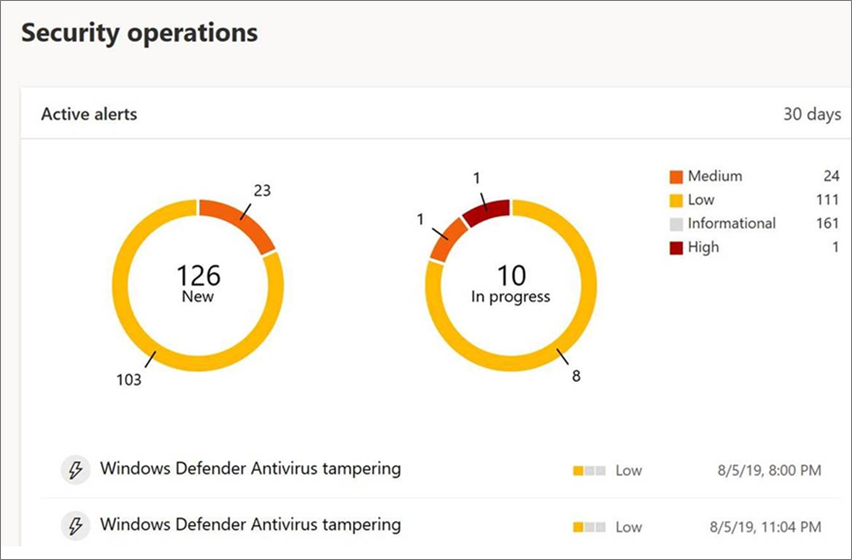

# Beveiligingsinstellingen beveiligen tegen onrechtmatig wijzigen

[!INCLUDE [Microsoft 365 Defender rebranding](../../includes/microsoft-defender.md)]

**Van toepassing op:**

- [Microsoft Defender voor Eindpunt](/microsoft-365/security/defender-endpoint/)

Beveiligingsbeveiliging voor tamper is beschikbaar voor apparaten met een van de volgende versies van Windows:

- Windows 10
- Windows Server 2019
- Windows Server, versie 1803 of hoger
- Windows Server 2016

## Overzicht

Tijdens sommige soorten cyberaanvallen proberen slechte spelers beveiligingsfuncties, zoals antivirusbeveiliging, uit te schakelen op uw machines. Slechte spelers willen uw beveiligingsfuncties uitschakelen om gemakkelijker toegang te krijgen tot uw gegevens, om malware te installeren of om op een andere manier uw gegevens, identiteit en apparaten te misbruiken. Met tamperbeveiliging kunt u voorkomen dat dit soort dingen voorkomen.

Met de beveiliging van fraude kunnen schadelijke apps geen acties uitvoeren, zoals:

- Virus- en bedreigingsbeveiliging uitschakelen
- Realtime beveiliging uitschakelen
- Gedragscontrole uitschakelen
- Antivirusprogramma's uitschakelen (zoals IOfficeAntivirus (IOAV))
- Beveiliging in de cloud uitschakelen
- Beveiligingsinformatie-updates verwijderen

### Hoe het werkt

Beveiliging tegen geknoei blokkeert Microsoft Defender Antivirus en voorkomt dat uw beveiligingsinstellingen worden gewijzigd via apps en methoden, zoals:

- Instellingen configureren in registereditor op uw Windows-apparaat
- Instellingen wijzigen via PowerShell-cmdlets
- Beveiligingsinstellingen bewerken of verwijderen via groepsbeleid

Beveiliging van tamper voorkomt niet dat u uw beveiligingsinstellingen kunt bekijken. En tamperbeveiliging heeft geen invloed op de manier waarop antivirus-apps van derden zich registreren met de Windows Security-app. Als uw organisatie Windows 10 Enterprise E5 gebruikt, kunnen afzonderlijke gebruikers de beveiligingsinstelling voor tamper niet wijzigen. in die gevallen wordt de beveiliging van de tamper beheerd door uw beveiligingsteam.

### Wat wilt u doen?

| Als u deze taak wilt uitvoeren... | Zie deze sectie... |
|:---|:---|
| Beveiligingsbeveiliging voor geknoei in- of uitschakelen in het Microsoft Defender-beveiligingscentrum 
Beveiliging van manipulaties in uw tenant beheren | [Beveiligingsbeveiliging voor uw organisatie beheren met behulp van het Microsoft Defender-beveiligingscentrum](#manage-tamper-protection-for-your-organization-using-the-microsoft-defender-security-center) |
| Beveiligingsbeveiliging voor tamper in- of uitschakelen voor uw hele organisatie of een deel van uw organisatie met Intune 
Beveiligingsinstellingen voor tampers in uw organisatie aanpassen | [Beveiliging van fraude voor uw organisatie beheren met Intune](#manage-tamper-protection-for-your-organization-using-intune) |
| Beveiligingsbeveiliging voor tamper in- of uitschakelen voor uw organisatie met Configuration Manager | [Beveiliging van fraude voor uw organisatie beheren met tenant attach met Configuration Manager, versie 2006](#manage-tamper-protection-for-your-organization-with-configuration-manager-version-2006) |
| Beveiligingsbeveiliging voor een afzonderlijk apparaat in- of uitschakelen | [Beveiliging van manipulaties beheren op een afzonderlijk apparaat](#manage-tamper-protection-on-an-individual-device) |
| Details weergeven over pogingen tot geknoei op apparaten | [Informatie weergeven over pogingen tot geknoei](#view-information-about-tampering-attempts) |
| Uw beveiligingsaanbevelingen bekijken | [Beveiligingsaanbevelingen controleren](#review-your-security-recommendations) |
| Bekijk de lijst met veelgestelde vragen (veelgestelde vragen) | [Door de veelgestelde vragen bladeren](#view-information-about-tampering-attempts) |

## Beveiligingsbeveiliging voor uw organisatie beheren met behulp van het Microsoft Defender-beveiligingscentrum

Beveiliging tegen geknoei kan worden ingeschakeld of uitgeschakeld voor uw tenant met behulp van het Microsoft Defender-beveiligingscentrum ( [https://securitycenter.windows.com](https://securitycenter.windows.com) ). Hier zijn een paar punten waar u rekening mee moet houden:

- Op dit moment is de optie voor het beheren van beveiligingsbeveiliging voor fraude in het Microsoft Defender-beveiligingscentrum standaard ingeschakeld voor nieuwe implementaties. Voor bestaande implementaties is tamperbeveiliging beschikbaar op basis van een opt-in, met plannen om dit in de nabije toekomst de standaardmethode te maken. (Als u zich wilt opgeven, kiest u instellingen in het Microsoft **Defender-beveiligingscentrum**  >  **Geavanceerde functies**  >  **Tamper-beveiliging**.) 

- Wanneer u het Microsoft Defender-beveiligingscentrum gebruikt voor het beheren van de beveiligingsbeveiliging voor geknoei, hoeft u Intune of de tenant attach-methode niet te gebruiken.

- Wanneer u de beveiligingsbeveiliging voor geknoeidheid beheert in het Microsoft Defender-beveiligingscentrum, wordt de instelling toegepast op tenants, die van invloed zijn op al uw apparaten waarop Windows 10, Windows Server 2016 of Windows Server 2019 wordt uitgevoerd. Gebruik [Intune](#manage-tamper-protection-for-your-organization-using-intune) of Configuration Manager met tenant attach om de beveiliging van de manipulaties (zoals het hebben van beveiliging tegen geknoei op sommige apparaten, maar voor andere apparaten) te [finetunen.](#manage-tamper-protection-for-your-organization-with-configuration-manager-version-2006)

- Als u een hybride omgeving hebt, hebben beveiligingsinstellingen die zijn geconfigureerd in Intune voorrang op instellingen die zijn geconfigureerd in het Microsoft Defender-beveiligingscentrum. 

### Vereisten voor het beheren van beveiliging tegen fraude in het Microsoft Defender-beveiligingscentrum

- U moet over de juiste [machtigingen zijn,](/microsoft-365/security/defender-endpoint/assign-portal-access)zoals globale beheerder, beveiligingsbeheerder of beveiligingsbewerkingen.

- Op uw Windows-apparaten moet een van de volgende versies van Windows worden uitgevoerd:
   - Windows 10
   - [Windows Server 2019](/windows-server/get-started-19/whats-new-19)
   - Windows Server, versie [1803](/windows/release-health/status-windows-10-1803) of hoger
   - [Windows Server 2016](/windows-server/get-started/whats-new-in-windows-server-2016)
   - Zie Releasegegevens van [Windows 10](/windows/release-health/release-information)voor meer informatie over releases.

- Uw apparaten moeten zijn [onboarded bij Microsoft Defender voor Eindpunt.](/microsoft-365/security/defender-endpoint/onboarding)

- Uw apparaten moeten versie 4.18.2010.7 (of hoger) en anti-malware-engine versie 1.1.17600.5 (of hoger) gebruiken. ([Microsoft Defender Antivirus-updates beheren en basislijnen toepassen](manage-updates-baselines-microsoft-defender-antivirus.md).)

- [Beveiliging in de cloud](enable-cloud-protection-microsoft-defender-antivirus.md) moet zijn ingeschakeld.

### Beveiligingsbeveiliging voor geknoei in- of uitschakelen in het Microsoft Defender-beveiligingscentrum 

1. Ga naar het Microsoft Defender-beveiligingscentrum [https://securitycenter.windows.com](https://securitycenter.windows.com) () en meld u aan.

2. Kies **Instellingen**.

3. Ga naar **Algemene**  >  **geavanceerde functies** en schakel de beveiliging van de tamper in.

## Beveiliging van fraude voor uw organisatie beheren met Intune

Als u deel uitmaakt van het beveiligingsteam van uw organisatie en uw abonnement [Intune](/intune/fundamentals/what-is-intune)bevat, kunt u tamperbeveiliging in- of uitschakelen voor uw organisatie in de [microsoft Endpoint Manager-beheercentrumportal.](https://endpoint.microsoft.com) Gebruik Intune als u de beveiligingsinstellingen voor geknoeidheid wilt aanpassen. Als u bijvoorbeeld de beveiliging van manipulaties op sommige apparaten wilt inschakelen, maar niet alle apparaten, gebruikt u Intune.

### Vereisten voor het beheren van beveiliging tegen geknoei in Intune

- U moet over de juiste [machtigingen zijn,](/microsoft-365/security/defender-endpoint/assign-portal-access)zoals globale beheerder, beveiligingsbeheerder of beveiligingsbewerkingen.

- Uw organisatie gebruikt [Intune om apparaten te beheren.](/intune/fundamentals/what-is-device-management) ([Intune-licenties](/intune/fundamentals/licenses) zijn vereist; Intune is opgenomen in Microsoft 365 E5.)

- Op uw Windows-apparaten moet Windows 10 OS [1709,](/windows/release-health/status-windows-10-1709) [1803,](/windows/release-health/status-windows-10-1803) [1809](/windows/release-health/status-windows-10-1809-and-windows-server-2019) of hoger worden uitgevoerd. (Zie Releasegegevens voor [Windows 10](/windows/release-health/release-information)voor meer informatie over releases .)

- U moet Windows-beveiliging gebruiken met [beveiligingsinformatie](https://www.microsoft.com/wdsi/definitions) die is bijgewerkt naar versie 1.287.60.0 (of hoger).

- Uw apparaten moeten versie 4.18.1906.3 (of hoger) en anti-malware-engine versie 1.1.15500.X (of hoger) gebruiken. ([Microsoft Defender Antivirus-updates beheren en basislijnen toepassen](manage-updates-baselines-microsoft-defender-antivirus.md).)

### Beveiliging voor geknoei in -of uitschakelen in Intune

1. Ga naar het [Microsoft Endpoint Manager-beheercentrum](https://endpoint.microsoft.com) en meld u aan met uw werk- of schoolaccount.

2. Selecteer   >  **Configuratieprofielen voor apparaten.**

3. Maak een profiel met de volgende instellingen:
    - **Platform: Windows 10 en hoger**
    - **Profieltype: Endpoint-beveiliging**
    - **Categorie: Microsoft Defender Security Center**
    - **Beveiliging van tamper: ingeschakeld**

4. Wijs het profiel toe aan een of meer groepen.

### Gebruikt u Windows OS 1709, 1803 of 1809?

Als u Windows 10 OS [1709,](/windows/release-health/status-windows-10-1709) [1803](/windows/release-health/status-windows-10-1803)of [1809](/windows/release-health/status-windows-10-1809-and-windows-server-2019)gebruikt, ziet u Tamper **Protection** niet in de Windows Security-app. In plaats daarvan kunt u PowerShell gebruiken om te bepalen of beveiliging van een tamper is ingeschakeld.

#### PowerShell gebruiken om te bepalen of tamperbeveiliging is ingeschakeld

1. Open de Windows PowerShell-app.

2. Gebruik de [Get-MpComputerStatus](/powershell/module/defender/get-mpcomputerstatus?preserve-view=true&view=win10-ps) PowerShell-cmdlet.

3. Zoek in de lijst met resultaten `IsTamperProtected` naar . (Een waarde van *waar betekent* dat tamperbeveiliging is ingeschakeld.)

## Beveiliging van fraude voor uw organisatie beheren met Configuration Manager, versie 2006

Als u versie [2006](/mem/configmgr/core/plan-design/changes/whats-new-in-version-2006)van Configuration Manager gebruikt, kunt u beveiligingsinstellingen voor geknoeid beheren in Windows 10, Windows Server 2016 en Windows Server 2019 met behulp van een methode genaamd *tenant attach*. Met Tenant attach kunt u uw on-premises Configuration Manager-apparaten synchroniseren met het Microsoft Endpoint Manager-beheercentrum en vervolgens beveiligingsconfiguratiebeleid voor eindpunten leveren aan on-premises verzamelingen & apparaten.

> [!NOTE]
> De procedure kan worden gebruikt om de beveiliging van tamper uit te breiden naar apparaten met Windows 10 en Windows Server 2019. Controleer de vereisten en andere informatie in de bronnen die in deze procedure worden vermeld.

1. Tenant attach instellen. Zie Microsoft [Endpoint Manager tenant attach: Device sync and device actions (Apparaatsynchronisatie](/mem/configmgr/tenant-attach/device-sync-actions)en apparaatacties) voor hulp hierbij.

2. Ga in [het Microsoft Endpoint Manager-beheercentrum](https://go.microsoft.com/fwlink/?linkid=2109431)naar **Endpoint Security**  >  **Antivirus** en kies + **Beleid maken.**  
   - Selecteer windows **10 en Windows Server (ConfigMgr)** in de **lijst** Platform.  
   - Selecteer in **de** lijst Profiel **de optie Windows-beveiligingservaring (voorbeeld)**.  

3. Implementeer het beleid naar uw apparaatverzameling.

### Hulp nodig bij deze methode? 

Zie de volgende bronnen:

- [Instellingen voor het Windows-beveiligingservaringsprofiel in Microsoft Intune](/mem/intune/protect/antivirus-security-experience-windows-settings)
- [Tech Community Blog: Tamper Protection aankondigen voor Configuration Manager Tenant Attach clients](https://techcommunity.microsoft.com/t5/microsoft-endpoint-manager-blog/announcing-tamper-protection-for-configuration-manager-tenant/ba-p/1700246#.X3QLR5Ziqq8.linkedin)

## Beveiliging van manipulaties beheren op een afzonderlijk apparaat

> [!NOTE]
> Beveiligingsblokken voor geknoei proberen de antivirusinstellingen van Microsoft Defender via het register te wijzigen.
>
> Ga naar **Windows-beveiliging** en werk beveiligingsinformatie bij naar versie 1.287.60.0 of hoger om ervoor te zorgen dat beveiligingsbeveiliging geen invloed heeft op beveiligingsproducten van derden of bedrijfsinstallatiescripts die deze instellingen wijzigen.  (Zie [Beveiligingsinformatieupdates](https://www.microsoft.com/wdsi/definitions).)
>
> Nadat u deze update hebt uitgebracht, blijft de beveiliging van de tamper uw registerinstellingen beveiligen en worden logboeken geprobeerd deze te wijzigen zonder fouten te retourneren.

Als u een thuisgebruiker bent of als u niet onderworpen bent aan instellingen die worden beheerd door een beveiligingsteam, kunt u de Windows-beveiligingsapp gebruiken om de beveiliging van de beveiliging van een beveiligingsbedrijf te beheren. U moet over de juiste beheerdersmachtigingen op uw apparaat zijn om de beveiligingsinstellingen te kunnen wijzigen, zoals beveiliging tegen geknoei.

Dit ziet u in de Windows Security-app:

1. Selecteer **Start** en begin beveiliging te *typen.* Selecteer windows-beveiliging in **de zoekresultaten.**

2. Selecteer **Virusbeveiliging &**  >  **bedreigingsbeveiliging & beveiligingsinstellingen voor bedreigingen.**

3. Beveiligingsbeveiliging **voor Tamper instellen** op **Aan** of **Uit.**

## Informatie weergeven over pogingen tot geknoei

Pogingen tot geknoei geven meestal grotere cyberaanvallen aan. Slechte actors proberen de beveiligingsinstellingen te wijzigen als een manier om te blijven bestaan en niet te worden gedetecteerd. Als u deel uitmaakt van het beveiligingsteam van uw organisatie, kunt u informatie over dergelijke pogingen bekijken en vervolgens passende acties ondernemen om bedreigingen te beperken.

Wanneer er een poging tot geknoei wordt gedetecteerd, wordt er een waarschuwing in het [Microsoft Defender-beveiligingscentrum](/microsoft-365/security/defender-endpoint/portal-overview) [https://securitycenter.windows.com](https://securitycenter.windows.com) () gesteld.

Met [behulp van eindpuntdetectie en -reactie](/microsoft-365/security/defender-endpoint/overview-endpoint-detection-response) en geavanceerde [zoekmogelijkheden](/microsoft-365/security/defender-endpoint/advanced-hunting-overview) in Microsoft Defender voor Eindpunt, kan uw beveiligingsteam dergelijke pogingen onderzoeken en aanpakken.

## Uw beveiligingsaanbevelingen bekijken

Tamperbeveiliging is geïntegreerd met [de mogelijkheden & Beveiligingsprobleembeheer.](/microsoft-365/security/defender-endpoint/next-gen-threat-and-vuln-mgt) [Beveiligingsaanbevelingen](/microsoft-365/security/defender-endpoint/tvm-security-recommendation) zijn onder andere om ervoor te zorgen dat de beveiliging van de tamper is ingeschakeld. U kunt bijvoorbeeld zoeken in *tamper,* zoals wordt weergegeven in de volgende afbeelding:

In de resultaten kunt u Beveiliging voor **geknoeid in-** en uit- en in-/uit-/uit- of in- of uit- en uit- of uit- of uit- en

Zie Threat & Vulnerability Management in Microsoft Defender Security Center voor meer & [beveiligingsprobleembeheer.](/microsoft-365/security/defender-endpoint/tvm-dashboard-insights#threat--vulnerability-management-in-microsoft-defender-security-center)

## Veelgestelde vragen

### Op welke Windows OS-versies is het configureren van beveiliging tegen geknoei van toepassing?

Windows 10 OS [1709](/windows/release-health/status-windows-10-1709), [1803](/windows/release-health/status-windows-10-1803), [1809](/windows/release-health/status-windows-10-1809-and-windows-server-2019)of hoger samen met [Microsoft Defender voor Eindpunt](/microsoft-365/security/defender-endpoint).

Als u Configuration Manager, versie 2006, met tenant attach gebruikt, kan de beveiliging van de tamper worden uitgebreid naar Windows Server 2019. Zie [Tenant attach: Create and deploy endpoint security Antivirus policy from the admin center (preview)](/mem/configmgr/tenant-attach/deploy-antivirus-policy).

### Heeft fraudebeveiliging invloed op de registratie van antivirussoftware van derden?

Nee. Antivirusaanbiedingen van derden blijven zich registreren bij de Windows-beveiligingstoepassing.

### Wat gebeurt er als Microsoft Defender Antivirus niet actief is op een apparaat?

Apparaten die zijn aan boord van Microsoft Defender voor Eindpunt, hebben Microsoft Defender Antivirus uitgevoerd in de passieve modus. De beveiliging van tamper blijft de service en de functies ervan beschermen. 

### Hoe kan ik de beveiliging van tamper in-/uitschakelen?

Als u een thuisgebruiker bent, zie [Beveiligingsbeveiliging voor geknoeid beheren op een afzonderlijk apparaat.](#manage-tamper-protection-on-an-individual-device)

Als u een organisatie bent die [Microsoft Defender](/microsoft-365/security/defender-endpoint)voor Eindpunt gebruikt, kunt u de beveiliging van manipulaties in Intune beheren, vergelijkbaar met de manier waarop u andere functies voor eindpuntbeveiliging beheert. Zie de volgende secties van dit artikel: 

- [Beveiliging van fraude beheren met Intune](#manage-tamper-protection-for-your-organization-using-intune)
- [Beveiliging van fraude beheren met Configuration Manager, versie 2006](#manage-tamper-protection-for-your-organization-with-configuration-manager-version-2006)
- [Beveiliging van fraude beheren met behulp van het Microsoft Defender-beveiligingscentrum](#manage-tamper-protection-for-your-organization-using-the-microsoft-defender-security-center) (momenteel in preview)

### Hoe beïnvloedt het configureren van beveiliging tegen geknoei in Intune de manier waarop ik Microsoft Defender Antivirus beheer via mijn groepsbeleid?

Uw normale groepsbeleid is niet van toepassing op beveiliging tegen geknoei en wijzigingen in de antivirusinstellingen van Microsoft Defender worden genegeerd wanneer de beveiligingsbeveiliging voor geknoeid is. 

### Voor Microsoft Defender voor Eindpunt is het configureren van beveiliging tegen geknoei in Intune alleen bedoeld voor de hele organisatie?

Het configureren van beveiliging tegen fraude in Intune of Microsoft Endpoint Manager kan worden gericht op uw hele organisatie en op specifieke apparaten en gebruikersgroepen.

### Kan ik Tamper Protection configureren in Microsoft Endpoint Configuration Manager?

Als u tenant attach gebruikt, kunt u Microsoft Endpoint Configuration Manager gebruiken. Zie de volgende bronnen:
- [Beveiliging van fraude voor uw organisatie beheren met Configuration Manager, versie 2006](#manage-tamper-protection-for-your-organization-with-configuration-manager-version-2006)
- [Tech Community-blog: Tamper Protection for Configuration Manager Tenant Attach clients aankondigen](https://techcommunity.microsoft.com/t5/microsoft-endpoint-manager-blog/announcing-tamper-protection-for-configuration-manager-tenant/ba-p/1700246#.X3QLR5Ziqq8.linkedin)

### Ik heb de Windows E3-inschrijving. Kan ik in Intune de beveiligingsbeveiliging voor geknoeid configureren?

Op dit moment is het configureren van beveiliging tegen geknoei in Intune alleen beschikbaar voor klanten met [Microsoft Defender voor Eindpunt.](/microsoft-365/security/defender-endpoint)

### Wat gebeurt er als ik microsoft Defender voor eindpuntinstellingen probeer te wijzigen in Intune, Microsoft Endpoint Configuration Manager en Windows Management Instrumentation wanneer Tamper Protection is ingeschakeld op een apparaat?

U kunt de functies die zijn beveiligd door beveiligingsfuncties voor geknoeid, niet wijzigen. dergelijke wijzigingsaanvragen worden genegeerd.

### Ik ben een zakelijke klant. Kunnen lokale beheerders de beveiliging van tamper op hun apparaten wijzigen?

Nee. Lokale beheerders kunnen de beveiligingsinstellingen voor manipulaties niet wijzigen of wijzigen.

### Wat gebeurt er als mijn apparaat is onboarded met Microsoft Defender voor Endpoint en vervolgens in een niet-boarded toestand wordt gebruikt?

Als een apparaat is uitgeschakeld vanuit Microsoft Defender voor Eindpunt, is de beveiliging van de tamper ingeschakeld, wat de standaardtoestand is voor niet-bemande apparaten. 

### Wordt er een waarschuwing ontvangen over het wijzigen van de status van de beveiligingsstatus van tamper in het Microsoft Defender-beveiligingscentrum?

Ja. De waarschuwing wordt weergegeven onder [https://securitycenter.microsoft.com](https://securitycenter.microsoft.com) **Waarschuwingen.**

Uw beveiligingsteam kan ook query's voor het zoeken gebruiken, zoals het volgende voorbeeld:

`DeviceAlertEvents | where Title == "Tamper Protection bypass"`

[Informatie weergeven over pogingen tot geknoei.](#view-information-about-tampering-attempts)

## Zie ook

[Windows-pc's beveiligen met Endpoint Protection voor Microsoft Intune](/intune/help-secure-windows-pcs-with-endpoint-protection-for-microsoft-intune)

[Een overzicht krijgen van Microsoft Defender voor Eindpunt](/microsoft-365/security/defender-endpoint)

[Samen beter: Microsoft Defender Antivirus en Microsoft Defender voor Eindpunt](why-use-microsoft-defender-antivirus.md)