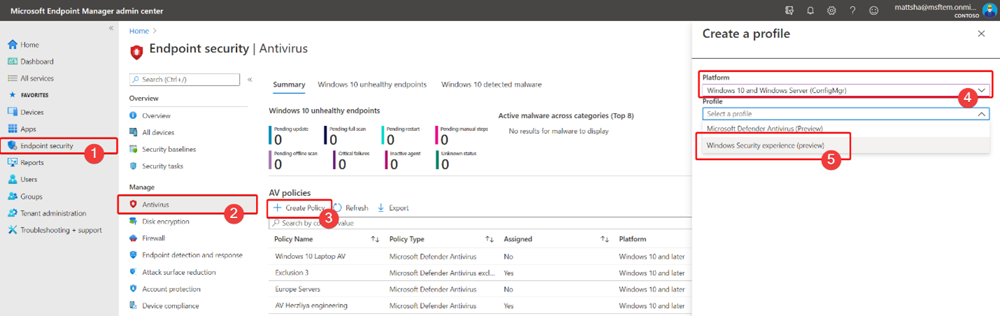

# Beveiligingsinstellingen beveiligen tegen onrechtmatig wijzigenProtect security settings with tamper protection

[!INCLUDE [Microsoft 365 Defender rebranding](../../includes/microsoft-defender.md)]

**Van toepassing op:****Applies to:**

- [Microsoft Defender voor EindpuntMicrosoft Defender for Endpoint](/microsoft-365/security/defender-endpoint/)

Beveiligingsbeveiliging voor tamper is beschikbaar voor apparaten met een van de volgende versies van Windows:Tamper protection is available for devices that are running one of the following versions of Windows:

- Windows 10Windows 10
- Windows Server 2019Windows Server 2019
- Windows Server, versie 1803 of hogerWindows Server, version 1803 or later
- Windows Server 2016Windows Server 2016

## OverzichtOverview

Tijdens sommige soorten cyberaanvallen proberen slechte spelers beveiligingsfuncties, zoals antivirusbeveiliging, uit te schakelen op uw machines.During some kinds of cyber attacks, bad actors try to disable security features, such as anti-virus protection, on your machines. Slechte spelers willen uw beveiligingsfuncties uitschakelen om gemakkelijker toegang te krijgen tot uw gegevens, om malware te installeren of om op een andere manier uw gegevens, identiteit en apparaten te misbruiken.Bad actors like to disable your security features to get easier access to your data, to install malware, or to otherwise exploit your data, identity, and devices. Met tamperbeveiliging kunt u voorkomen dat dit soort dingen voorkomen.Tamper protection helps prevent these kinds of things from occurring.

Met de beveiliging van fraude kunnen schadelijke apps geen acties uitvoeren, zoals:With tamper protection, malicious apps are prevented from taking actions such as:

- Virus- en bedreigingsbeveiliging uitschakelenDisabling virus and threat protection
- Realtime beveiliging uitschakelenDisabling real-time protection
- Gedragscontrole uitschakelenTurning off behavior monitoring
- Antivirusprogramma's uitschakelen (zoals IOfficeAntivirus (IOAV))Disabling antivirus (such as IOfficeAntivirus (IOAV))
- Beveiliging in de cloud uitschakelenDisabling cloud-delivered protection
- Beveiligingsinformatie-updates verwijderenRemoving security intelligence updates

### Hoe het werktHow it works

Beveiliging tegen geknoei blokkeert Microsoft Defender Antivirus en voorkomt dat uw beveiligingsinstellingen worden gewijzigd via apps en methoden, zoals:Tamper protection essentially locks Microsoft Defender Antivirus and prevents your security settings from being changed through apps and methods such as:

- Instellingen configureren in registereditor op uw Windows-apparaatConfiguring settings in Registry Editor on your Windows device
- Instellingen wijzigen via PowerShell-cmdletsChanging settings through PowerShell cmdlets
- Beveiligingsinstellingen bewerken of verwijderen via groepsbeleidEditing or removing security settings through group policies

Beveiliging van tamper voorkomt niet dat u uw beveiligingsinstellingen kunt bekijken.Tamper protection doesn't prevent you from viewing your security settings. En tamperbeveiliging heeft geen invloed op de manier waarop antivirus-apps van derden zich registreren met de Windows Security-app.And, tamper protection doesn't affect how third-party antivirus apps register with the Windows Security app. Als uw organisatie Windows 10 Enterprise E5 gebruikt, kunnen afzonderlijke gebruikers de beveiligingsinstelling voor tamper niet wijzigen. in die gevallen wordt de beveiliging van de tamper beheerd door uw beveiligingsteam.If your organization is using Windows 10 Enterprise E5, individual users can't change the tamper protection setting; in those cases, tamper protection is managed by your security team.

### Wat wilt u doen?What do you want to do?

| Als u deze taak wilt uitvoeren...To perform this task... | Zie deze sectie...See this section... |
|:---|:---|
| Beveiligingsbeveiliging voor geknoei in- of uitschakelen in het Microsoft Defender-beveiligingscentrumTurn tamper protection on (or off) in the Microsoft Defender Security Center 
Beveiliging van manipulaties in uw tenant beherenManage tamper protection across your tenant | [Beveiligingsbeveiliging voor uw organisatie beheren met behulp van het Microsoft Defender-beveiligingscentrumManage tamper protection for your organization using the Microsoft Defender Security Center](#manage-tamper-protection-for-your-organization-using-the-microsoft-defender-security-center) |
| Beveiligingsbeveiliging voor tamper in- of uitschakelen voor uw hele organisatie of een deel van uw organisatie met IntuneTurn tamper protection on (or off) for all or part of your organization using Intune 
Beveiligingsinstellingen voor tampers in uw organisatie aanpassenFine-tune tamper protection settings in your organization | [Beveiliging van fraude voor uw organisatie beheren met IntuneManage tamper protection for your organization using Intune](#manage-tamper-protection-for-your-organization-using-intune) |
| Beveiligingsbeveiliging voor tamper in- of uitschakelen voor uw organisatie met Configuration ManagerTurn tamper protection on (or off) for your organization with Configuration Manager | [Beveiliging van fraude voor uw organisatie beheren met tenant attach met Configuration Manager, versie 2006Manage tamper protection for your organization using tenant attach with Configuration Manager, version 2006](#manage-tamper-protection-for-your-organization-with-configuration-manager-version-2006) |
| Beveiligingsbeveiliging voor een afzonderlijk apparaat in- of uitschakelenTurn tamper protection on (or off) for an individual device | [Beveiliging van manipulaties beheren op een afzonderlijk apparaatManage tamper protection on an individual device](#manage-tamper-protection-on-an-individual-device) |
| Details weergeven over pogingen tot geknoei op apparatenView details about tampering attempts on devices | [Informatie weergeven over pogingen tot geknoeiView information about tampering attempts](#view-information-about-tampering-attempts) |
| Uw beveiligingsaanbevelingen bekijkenReview your security recommendations | [Beveiligingsaanbevelingen controlerenReview security recommendations](#review-your-security-recommendations) |
| Bekijk de lijst met veelgestelde vragen (veelgestelde vragen)Review the list of frequently asked questions (FAQs) | [Door de veelgestelde vragen bladerenBrowse the FAQs](#view-information-about-tampering-attempts) |

Afhankelijk van de methode of het beheerprogramma dat u gebruikt om tamper-beveiliging in te stellen, is er mogelijk een afhankelijkheid van KAARTEN (beveiliging in de cloud).Depending on the method or management tool you use to enable Tamper protection, there may be a dependency on MAPS (cloud-delivered protection). 

In de volgende tabel vindt u informatie over de methoden, hulpmiddelen en afhankelijkheden.The following table provides details on the methods, tools, and dependencies.

|     De manier waarop beveiliging van Tamper is ingeschakeldHow Tamper protection is enabled                                         |     Afhankelijkheid van KAARTEN (beveiliging in de cloud)Dependency on MAPS (cloud-delivered protection)    |
|------------------------------------------------------------------------------|--------------------------------------------------------|
|     Microsoft IntuneMicrosoft Intune                                                         |     NeeNo                                                 |
| Microsoft Endpoint Configuration Manager + Tenant AttachMicrosoft Endpoint Configuration Manager + Tenant Attach                     |     NeeNo                                                 |
|     Microsoft Defender for Endpoint portal (securitycenter.microsoft.com)Microsoft Defender for Endpoint portal (securitycenter.microsoft.com)    |     JaYes                                                |
|     Microsoft 365 Defender-portal (security.microsoft.com)Microsoft 365 Defender portal (security.microsoft.com)                   |     JaYes                                                |

## Beveiligingsbeveiliging voor uw organisatie beheren met behulp van het Microsoft Defender-beveiligingscentrumManage tamper protection for your organization using the Microsoft Defender Security Center

Beveiliging tegen geknoei kan worden ingeschakeld of uitgeschakeld voor uw tenant met behulp van het Microsoft Defender-beveiligingscentrum ( [https://securitycenter.windows.com](https://securitycenter.windows.com) ).Tamper protection can be turned on or off for your tenant using the Microsoft Defender Security Center ([https://securitycenter.windows.com](https://securitycenter.windows.com)). Hier zijn een paar punten waar u rekening mee moet houden:Here are a few points to keep in mind:

- Op dit moment is de optie voor het beheren van beveiligingsbeveiliging voor fraude in het Microsoft Defender-beveiligingscentrum standaard ingeschakeld voor nieuwe implementaties.Currently, the option to manage tamper protection in the Microsoft Defender Security Center is on by default for new deployments. Voor bestaande implementaties is tamperbeveiliging beschikbaar op basis van een opt-in, met plannen om dit in de nabije toekomst de standaardmethode te maken.For existing deployments, tamper protection is available on an opt-in basis, with plans to make this the default method in the near future. (Als u zich wilt opgeven, kiest u instellingen in het Microsoft **Defender-beveiligingscentrum**  >  **Geavanceerde functies**  >  **Tamper-beveiliging**.)(To opt in, in the Microsoft Defender Security Center, choose **Settings** > **Advanced features** > **Tamper protection**.) 

- Wanneer u het Microsoft Defender-beveiligingscentrum gebruikt voor het beheren van de beveiligingsbeveiliging voor geknoei, hoeft u Intune of de tenant attach-methode niet te gebruiken.When you use the Microsoft Defender Security Center to manage tamper protection, you do not have to use Intune or the tenant attach method.

- Wanneer u de beveiligingsbeveiliging voor geknoeidheid beheert in het Microsoft Defender-beveiligingscentrum, wordt de instelling toegepast op tenants, die van invloed zijn op al uw apparaten waarop Windows 10, Windows Server 2016 of Windows Server 2019 wordt uitgevoerd.When you manage tamper protection in the Microsoft Defender Security Center, the setting is applied tenant wide, affecting all of your devices that are running Windows 10, Windows Server 2016, or Windows Server 2019. Gebruik [Intune](#manage-tamper-protection-for-your-organization-using-intune) of Configuration Manager met tenant attach om de beveiliging van de manipulaties (zoals het hebben van beveiliging tegen geknoei op sommige apparaten, maar voor andere apparaten) te [finetunen.](#manage-tamper-protection-for-your-organization-with-configuration-manager-version-2006)To fine-tune tamper protection (such as having tamper protection on for some devices but off for others), use either [Intune](#manage-tamper-protection-for-your-organization-using-intune) or [Configuration Manager with tenant attach](#manage-tamper-protection-for-your-organization-with-configuration-manager-version-2006).

- Als u een hybride omgeving hebt, hebben beveiligingsinstellingen die zijn geconfigureerd in Intune voorrang op instellingen die zijn geconfigureerd in het Microsoft Defender-beveiligingscentrum.If you have a hybrid environment, tamper protection settings configured in Intune take precedence over settings configured in the Microsoft Defender Security Center. 

### Vereisten voor het beheren van beveiliging tegen fraude in het Microsoft Defender-beveiligingscentrumRequirements for managing tamper protection in the Microsoft Defender Security Center

- U moet over de juiste [machtigingen zijn,](/microsoft-365/security/defender-endpoint/assign-portal-access)zoals globale beheerder, beveiligingsbeheerder of beveiligingsbewerkingen.You must have appropriate [permissions](/microsoft-365/security/defender-endpoint/assign-portal-access), such as global admin, security admin, or security operations.

- Op uw Windows-apparaten moet een van de volgende versies van Windows worden uitgevoerd:Your Windows devices must be running one of the following versions of Windows:
   - Windows 10Windows 10
   - [Windows Server 2019Windows Server 2019](/windows-server/get-started-19/whats-new-19)
   - Windows Server, versie [1803](/windows/release-health/status-windows-10-1803) of hogerWindows Server, version [1803](/windows/release-health/status-windows-10-1803) or later
   - [Windows Server 2016Windows Server 2016](/windows-server/get-started/whats-new-in-windows-server-2016)
   - Zie Releasegegevens van [Windows 10](/windows/release-health/release-information)voor meer informatie over releases.For more information about releases, see [Windows 10 release information](/windows/release-health/release-information).

- Uw apparaten moeten zijn [onboarded bij Microsoft Defender voor Eindpunt.](/microsoft-365/security/defender-endpoint/onboarding)Your devices must be [onboarded to Microsoft Defender for Endpoint](/microsoft-365/security/defender-endpoint/onboarding).

- Uw apparaten moeten versie 4.18.2010.7 (of hoger) en anti-malware-engine versie 1.1.17600.5 (of hoger) gebruiken.Your devices must be using anti-malware platform version 4.18.2010.7 (or above) and anti-malware engine version 1.1.17600.5 (or above). ([Microsoft Defender Antivirus-updates beheren en basislijnen toepassen](manage-updates-baselines-microsoft-defender-antivirus.md).)([Manage Microsoft Defender Antivirus updates and apply baselines](manage-updates-baselines-microsoft-defender-antivirus.md).)

- [Beveiliging in de cloud](enable-cloud-protection-microsoft-defender-antivirus.md) moet zijn ingeschakeld.[Cloud-delivered protection](enable-cloud-protection-microsoft-defender-antivirus.md) must be turned on.

### Beveiligingsbeveiliging voor geknoei in- of uitschakelen in het Microsoft Defender-beveiligingscentrumTurn tamper protection on (or off) in the Microsoft Defender Security Center 

1. Ga naar het Microsoft Defender-beveiligingscentrum [https://securitycenter.windows.com](https://securitycenter.windows.com) () en meld u aan.Go to the Microsoft Defender Security Center ([https://securitycenter.windows.com](https://securitycenter.windows.com)) and sign in.

2. Kies **Instellingen**.Choose **Settings**.

3. Ga naar **Algemene**  >  **geavanceerde functies** en schakel de beveiliging van de tamper in.Go to **General** > **Advanced features**, and then turn tamper protection on.

## Beveiliging van fraude voor uw organisatie beheren met IntuneManage tamper protection for your organization using Intune

Als u deel uitmaakt van het beveiligingsteam van uw organisatie en uw abonnement [Intune](/intune/fundamentals/what-is-intune)bevat, kunt u tamperbeveiliging in- of uitschakelen voor uw organisatie in de [microsoft Endpoint Manager-beheercentrumportal.](https://endpoint.microsoft.com)If you are part of your organization's security team, and your subscription includes [Intune](/intune/fundamentals/what-is-intune), you can turn tamper protection on (or off) for your organization in the [Microsoft Endpoint Manager admin center](https://endpoint.microsoft.com) portal. Gebruik Intune als u de beveiligingsinstellingen voor geknoeidheid wilt aanpassen.Use Intune when you want to fine-tune tamper protection settings. Als u bijvoorbeeld de beveiliging van manipulaties op sommige apparaten wilt inschakelen, maar niet alle apparaten, gebruikt u Intune.For example, if you want to enable tamper protection on some devices, but not all, use Intune.

### Vereisten voor het beheren van beveiliging tegen geknoei in IntuneRequirements for managing tamper protection in Intune

- U moet over de juiste [machtigingen zijn,](/microsoft-365/security/defender-endpoint/assign-portal-access)zoals globale beheerder, beveiligingsbeheerder of beveiligingsbewerkingen.You must have appropriate [permissions](/microsoft-365/security/defender-endpoint/assign-portal-access), such as global admin, security admin, or security operations.

- Uw organisatie gebruikt [Intune om apparaten te beheren.](/intune/fundamentals/what-is-device-management)Your organization uses [Intune to manage devices](/intune/fundamentals/what-is-device-management). ([Intune-licenties](/intune/fundamentals/licenses) zijn vereist; Intune is opgenomen in Microsoft 365 E5.)([Intune licenses](/intune/fundamentals/licenses) are required; Intune is included in Microsoft 365 E5.)

- Op uw Windows-apparaten moet Windows 10 OS [1709,](/windows/release-health/status-windows-10-1709) [1803,](/windows/release-health/status-windows-10-1803) [1809](/windows/release-health/status-windows-10-1809-and-windows-server-2019) of hoger worden uitgevoerd.Your Windows devices must be running Windows 10 OS [1709](/windows/release-health/status-windows-10-1709), [1803](/windows/release-health/status-windows-10-1803), [1809](/windows/release-health/status-windows-10-1809-and-windows-server-2019) or later. (Zie Releasegegevens voor [Windows 10](/windows/release-health/release-information)voor meer informatie over releases .)(For more information about releases, see [Windows 10 release information](/windows/release-health/release-information).)

- U moet Windows-beveiliging gebruiken met [beveiligingsinformatie](https://www.microsoft.com/wdsi/definitions) die is bijgewerkt naar versie 1.287.60.0 (of hoger).You must be using Windows security with [security intelligence](https://www.microsoft.com/wdsi/definitions) updated to version 1.287.60.0 (or above).

- Uw apparaten moeten versie 4.18.1906.3 (of hoger) en anti-malware-engine versie 1.1.15500.X (of hoger) gebruiken.Your devices must be using anti-malware platform version 4.18.1906.3 (or above) and anti-malware engine version 1.1.15500.X (or above). ([Microsoft Defender Antivirus-updates beheren en basislijnen toepassen](manage-updates-baselines-microsoft-defender-antivirus.md).)([Manage Microsoft Defender Antivirus updates and apply baselines](manage-updates-baselines-microsoft-defender-antivirus.md).)

### Beveiliging voor geknoei in -of uitschakelen in IntuneTurn tamper protection on (or off) in Intune

1. Ga naar het [Microsoft Endpoint Manager-beheercentrum](https://endpoint.microsoft.com) en meld u aan met uw werk- of schoolaccount.Go to the [Microsoft Endpoint Manager admin center](https://endpoint.microsoft.com) and sign in with your work or school account.

2. Selecteer   >  **Configuratieprofielen voor apparaten.**Select **Devices** > **Configuration Profiles**.

3. Maak een profiel met de volgende instellingen:Create a profile that includes the following settings:
    - **Platform: Windows 10 en hoger****Platform: Windows 10 and later**
    - **Profieltype: Endpoint-beveiliging****Profile type: Endpoint protection**
    - **Categorie: Microsoft Defender Security Center****Category: Microsoft Defender Security Center**
    - **Beveiliging van tamper: ingeschakeld****Tamper Protection: Enabled**

4. Wijs het profiel toe aan een of meer groepen.Assign the profile to one or more groups.

### Gebruikt u Windows OS 1709, 1803 of 1809?Are you using Windows OS 1709, 1803, or 1809?

Als u Windows 10 OS [1709,](/windows/release-health/status-windows-10-1709) [1803](/windows/release-health/status-windows-10-1803)of [1809](/windows/release-health/status-windows-10-1809-and-windows-server-2019)gebruikt, ziet u Tamper **Protection** niet in de Windows Security-app.If you are using Windows 10 OS [1709](/windows/release-health/status-windows-10-1709), [1803](/windows/release-health/status-windows-10-1803), or [1809](/windows/release-health/status-windows-10-1809-and-windows-server-2019), you won't see **Tamper Protection** in the Windows Security app. In plaats daarvan kunt u PowerShell gebruiken om te bepalen of beveiliging van een tamper is ingeschakeld.Instead, you can use PowerShell to determine whether tamper protection is enabled.

#### PowerShell gebruiken om te bepalen of tamperbeveiliging is ingeschakeldUse PowerShell to determine whether tamper protection is turned on

1. Open de Windows PowerShell-app.Open the Windows PowerShell app.

2. Gebruik de [Get-MpComputerStatus](/powershell/module/defender/get-mpcomputerstatus?preserve-view=true&view=win10-ps) PowerShell-cmdlet.Use the [Get-MpComputerStatus](/powershell/module/defender/get-mpcomputerstatus?preserve-view=true&view=win10-ps) PowerShell cmdlet.

3. Zoek in de lijst met resultaten `IsTamperProtected` naar .In the list of results, look for `IsTamperProtected`. (Een waarde van *waar betekent* dat tamperbeveiliging is ingeschakeld.)(A value of *true* means tamper protection is enabled.)

## Beveiliging van fraude voor uw organisatie beheren met Configuration Manager, versie 2006Manage tamper protection for your organization with Configuration Manager, version 2006

Als u versie [2006](/mem/configmgr/core/plan-design/changes/whats-new-in-version-2006)van Configuration Manager gebruikt, kunt u beveiligingsinstellingen voor geknoeid beheren in Windows 10, Windows Server 2016 en Windows Server 2019 met behulp van een methode genaamd *tenant attach*.If you're using [version 2006 of Configuration Manager](/mem/configmgr/core/plan-design/changes/whats-new-in-version-2006), you can manage tamper protection settings on Windows 10, Windows Server 2016, and Windows Server 2019 by using a method called *tenant attach*. Met Tenant attach kunt u uw on-premises Configuration Manager-apparaten synchroniseren met het Microsoft Endpoint Manager-beheercentrum en vervolgens beveiligingsconfiguratiebeleid voor eindpunten leveren aan on-premises verzamelingen & apparaten.Tenant attach enables you to sync your on-premises-only Configuration Manager devices into the Microsoft Endpoint Manager admin center, and then deliver endpoint security configuration policies to on-premises collections & devices.

> [!NOTE]
> De procedure kan worden gebruikt om de beveiliging van tamper uit te breiden naar apparaten met Windows 10 en Windows Server 2019.The procedure can be used to extend tamper protection to devices running Windows 10 and Windows Server 2019. Controleer de vereisten en andere informatie in de bronnen die in deze procedure worden vermeld.Make sure to review the prerequisites and other information in the resources mentioned in this procedure.

1. Tenant attach instellen.Set up tenant attach. Zie Microsoft [Endpoint Manager tenant attach: Device sync and device actions (Apparaatsynchronisatie](/mem/configmgr/tenant-attach/device-sync-actions)en apparaatacties) voor hulp hierbij.To get help with this, see [Microsoft Endpoint Manager tenant attach: Device sync and device actions](/mem/configmgr/tenant-attach/device-sync-actions).

2. Ga in [het Microsoft Endpoint Manager-beheercentrum](https://go.microsoft.com/fwlink/?linkid=2109431)naar **Endpoint Security**  >  **Antivirus** en kies + **Beleid maken.**In the [Microsoft Endpoint Manager admin center](https://go.microsoft.com/fwlink/?linkid=2109431), go to **Endpoint security** > **Antivirus**, and then choose **+ Create Policy**.  
   - Selecteer windows **10 en Windows Server (ConfigMgr)** in de **lijst** Platform.In the **Platform** list, select **Windows 10 and Windows Server (ConfigMgr)**.  
   - Selecteer in **de** lijst Profiel **de optie Windows-beveiligingservaring (voorbeeld)**.In the **Profile** list, select **Windows Security experience (preview)**.  

3. Implementeer het beleid naar uw apparaatverzameling.Deploy the policy to your device collection.

### Hulp nodig bij deze methode?Need help with this method? 

Zie de volgende bronnen:See the following resources:

- [Instellingen voor het Windows-beveiligingservaringsprofiel in Microsoft IntuneSettings for the Windows Security experience profile in Microsoft Intune](/mem/intune/protect/antivirus-security-experience-windows-settings)
- [Tech Community Blog: Tamper Protection aankondigen voor Configuration Manager Tenant Attach clientsTech Community Blog: Announcing Tamper Protection for Configuration Manager Tenant Attach clients](https://techcommunity.microsoft.com/t5/microsoft-endpoint-manager-blog/announcing-tamper-protection-for-configuration-manager-tenant/ba-p/1700246#.X3QLR5Ziqq8.linkedin)

## Beveiliging van manipulaties beheren op een afzonderlijk apparaatManage tamper protection on an individual device

> [!NOTE]
> Beveiligingsblokken voor geknoei proberen de antivirusinstellingen van Microsoft Defender via het register te wijzigen.Tamper protection blocks attempts to modify Microsoft Defender Antivirus settings through the registry.
>
> Ga naar **Windows-beveiliging** en werk beveiligingsinformatie bij naar versie 1.287.60.0 of hoger om ervoor te zorgen dat beveiligingsbeveiliging geen invloed heeft op beveiligingsproducten van derden of bedrijfsinstallatiescripts die deze instellingen wijzigen. To help ensure that tamper protection doesn’t interfere with third-party security products or enterprise installation scripts that modify these settings, go to **Windows Security** and update **Security intelligence** to version 1.287.60.0 or later. (Zie [Beveiligingsinformatieupdates](https://www.microsoft.com/wdsi/definitions).)(See [Security intelligence updates](https://www.microsoft.com/wdsi/definitions).)
>
> Nadat u deze update hebt uitgebracht, blijft de beveiliging van de tamper uw registerinstellingen beveiligen en worden logboeken geprobeerd deze te wijzigen zonder fouten te retourneren.Once you’ve made this update, tamper protection continues to protect your registry settings, and logs attempts to modify them without returning errors.

Als u een thuisgebruiker bent of als u niet onderworpen bent aan instellingen die worden beheerd door een beveiligingsteam, kunt u de Windows-beveiligingsapp gebruiken om de beveiliging van de beveiliging van een beveiligingsbedrijf te beheren.If you are a home user, or you are not subject to settings managed by a security team, you can use the Windows Security app to manage tamper protection. U moet over de juiste beheerdersmachtigingen op uw apparaat zijn om de beveiligingsinstellingen te kunnen wijzigen, zoals beveiliging tegen geknoei.You must have appropriate admin permissions on your device to do change security settings, such as tamper protection.

Dit ziet u in de Windows Security-app:Here's what you see in the Windows Security app:

1. Selecteer **Start** en begin beveiliging te *typen.*Select **Start**, and start typing *Security*. Selecteer windows-beveiliging in **de zoekresultaten.**In the search results, select **Windows Security**.

2. Selecteer **Virusbeveiliging &**  >  **bedreigingsbeveiliging & beveiligingsinstellingen voor bedreigingen.**Select **Virus & threat protection** > **Virus & threat protection settings**.

3. Beveiligingsbeveiliging **voor Tamper instellen** op **Aan** of **Uit.**Set **Tamper Protection** to **On** or **Off**.

## Informatie weergeven over pogingen tot geknoeiView information about tampering attempts

Pogingen tot geknoei geven meestal grotere cyberaanvallen aan.Tampering attempts typically indicate bigger cyberattacks. Slechte actors proberen de beveiligingsinstellingen te wijzigen als een manier om te blijven bestaan en niet te worden gedetecteerd.Bad actors try to change security settings as a way to persist and stay undetected. Als u deel uitmaakt van het beveiligingsteam van uw organisatie, kunt u informatie over dergelijke pogingen bekijken en vervolgens passende acties ondernemen om bedreigingen te beperken.If you're part of your organization's security team, you can view information about such attempts, and then take appropriate actions to mitigate threats.

Wanneer er een poging tot geknoei wordt gedetecteerd, wordt er een waarschuwing in het [Microsoft Defender-beveiligingscentrum](/microsoft-365/security/defender-endpoint/portal-overview) [https://securitycenter.windows.com](https://securitycenter.windows.com) () gesteld.When a tampering attempt is detected, an alert is raised in the [Microsoft Defender Security Center](/microsoft-365/security/defender-endpoint/portal-overview) ([https://securitycenter.windows.com](https://securitycenter.windows.com)).

Met [behulp van eindpuntdetectie en -reactie](/microsoft-365/security/defender-endpoint/overview-endpoint-detection-response) en geavanceerde [zoekmogelijkheden](/microsoft-365/security/defender-endpoint/advanced-hunting-overview) in Microsoft Defender voor Eindpunt, kan uw beveiligingsteam dergelijke pogingen onderzoeken en aanpakken.Using [endpoint detection and response](/microsoft-365/security/defender-endpoint/overview-endpoint-detection-response) and [advanced hunting](/microsoft-365/security/defender-endpoint/advanced-hunting-overview) capabilities in Microsoft Defender for Endpoint, your security operations team can investigate and address such attempts.

## Uw beveiligingsaanbevelingen bekijkenReview your security recommendations

Tamperbeveiliging is geïntegreerd met [de mogelijkheden & Beveiligingsprobleembeheer.](/microsoft-365/security/defender-endpoint/next-gen-threat-and-vuln-mgt)Tamper protection integrates with [Threat & Vulnerability Management](/microsoft-365/security/defender-endpoint/next-gen-threat-and-vuln-mgt) capabilities. [Beveiligingsaanbevelingen](/microsoft-365/security/defender-endpoint/tvm-security-recommendation) zijn onder andere om ervoor te zorgen dat de beveiliging van de tamper is ingeschakeld.[Security recommendations](/microsoft-365/security/defender-endpoint/tvm-security-recommendation) include making sure tamper protection is turned on. U kunt bijvoorbeeld zoeken in *tamper,* zoals wordt weergegeven in de volgende afbeelding:For example, you can search on *tamper*, as shown in the following image:

In de resultaten kunt u Beveiliging voor **geknoeid in-** en uit- en in-/uit-/uit- of in- of uit- en uit- of uit- of uit- enIn the results, you can select **Turn on Tamper Protection** to learn more and turn it on.

Zie Threat & Vulnerability Management in Microsoft Defender Security Center voor meer & [beveiligingsprobleembeheer.](/microsoft-365/security/defender-endpoint/tvm-dashboard-insights#threat--vulnerability-management-in-microsoft-defender-security-center)To learn more about Threat & Vulnerability Management, see [Threat & Vulnerability Management in Microsoft Defender Security Center](/microsoft-365/security/defender-endpoint/tvm-dashboard-insights#threat--vulnerability-management-in-microsoft-defender-security-center).

## Veelgestelde vragenFrequently asked questions

### Op welke Windows OS-versies is het configureren van beveiliging tegen geknoei van toepassing?To which Windows OS versions is configuring tamper protection is applicable?

Windows 10 OS [1709](/windows/release-health/status-windows-10-1709), [1803](/windows/release-health/status-windows-10-1803), [1809](/windows/release-health/status-windows-10-1809-and-windows-server-2019)of hoger samen met [Microsoft Defender voor Eindpunt](/microsoft-365/security/defender-endpoint).Windows 10 OS [1709](/windows/release-health/status-windows-10-1709), [1803](/windows/release-health/status-windows-10-1803), [1809](/windows/release-health/status-windows-10-1809-and-windows-server-2019), or later together with [Microsoft Defender for Endpoint](/microsoft-365/security/defender-endpoint).

Als u Configuration Manager, versie 2006, met tenant attach gebruikt, kan de beveiliging van de tamper worden uitgebreid naar Windows Server 2019.If you are using Configuration Manager, version 2006, with tenant attach, tamper protection can be extended to Windows Server 2019. Zie [Tenant attach: Create and deploy endpoint security Antivirus policy from the admin center (preview)](/mem/configmgr/tenant-attach/deploy-antivirus-policy).See [Tenant attach: Create and deploy endpoint security Antivirus policy from the admin center (preview)](/mem/configmgr/tenant-attach/deploy-antivirus-policy).

### Heeft fraudebeveiliging invloed op de registratie van antivirussoftware van derden?Will tamper protection have any impact on third-party antivirus registration?

Nee.No. Antivirusaanbiedingen van derden blijven zich registreren bij de Windows-beveiligingstoepassing.Third-party antivirus offerings will continue to register with the Windows Security application.

### Wat gebeurt er als Microsoft Defender Antivirus niet actief is op een apparaat?What happens if Microsoft Defender Antivirus is not active on a device?

Apparaten die zijn aan boord van Microsoft Defender voor Eindpunt, hebben Microsoft Defender Antivirus uitgevoerd in de passieve modus.Devices that are onboarded to Microsoft Defender for Endpoint will have Microsoft Defender Antivirus running in passive mode. De beveiliging van tamper blijft de service en de functies ervan beschermen.Tamper protection will continue to protect the service and its features. 

### Hoe kan ik de beveiliging van tamper in-/uitschakelen?How can I turn tamper protection on/off?

Als u een thuisgebruiker bent, zie [Beveiligingsbeveiliging voor geknoeid beheren op een afzonderlijk apparaat.](#manage-tamper-protection-on-an-individual-device)If you are a home user, see [Manage tamper protection on an individual device](#manage-tamper-protection-on-an-individual-device).

Als u een organisatie bent die [Microsoft Defender](/microsoft-365/security/defender-endpoint)voor Eindpunt gebruikt, kunt u de beveiliging van manipulaties in Intune beheren, vergelijkbaar met de manier waarop u andere functies voor eindpuntbeveiliging beheert.If you are an organization using [Microsoft Defender for Endpoint](/microsoft-365/security/defender-endpoint), you should be able to manage tamper protection in Intune similar to how you manage other endpoint protection features. Zie de volgende secties van dit artikel:See the following sections of this article: 

- [Beveiliging van fraude beheren met IntuneManage tamper protection using Intune](#manage-tamper-protection-for-your-organization-using-intune)
- [Beveiliging van fraude beheren met Configuration Manager, versie 2006Manage tamper protection using Configuration Manager, version 2006](#manage-tamper-protection-for-your-organization-with-configuration-manager-version-2006)
- [Beveiliging van fraude beheren met behulp van het Microsoft Defender-beveiligingscentrum](#manage-tamper-protection-for-your-organization-using-the-microsoft-defender-security-center) (momenteel in preview)[Manage tamper protection using the Microsoft Defender Security Center](#manage-tamper-protection-for-your-organization-using-the-microsoft-defender-security-center) (currently in preview)

### Hoe beïnvloedt het configureren van beveiliging tegen geknoei in Intune de manier waarop ik Microsoft Defender Antivirus beheer via mijn groepsbeleid?How does configuring tamper protection in Intune affect how I manage Microsoft Defender Antivirus through my group policy?

Uw normale groepsbeleid is niet van toepassing op beveiliging tegen geknoei en wijzigingen in de antivirusinstellingen van Microsoft Defender worden genegeerd wanneer de beveiligingsbeveiliging voor geknoeid is.Your regular group policy doesn’t apply to tamper protection, and changes to Microsoft Defender Antivirus settings are ignored when tamper protection is on. 

### Voor Microsoft Defender voor Eindpunt is het configureren van beveiliging tegen geknoei in Intune alleen bedoeld voor de hele organisatie?For Microsoft Defender for Endpoint, is configuring tamper protection in Intune targeted to the entire organization only?

Het configureren van beveiliging tegen fraude in Intune of Microsoft Endpoint Manager kan worden gericht op uw hele organisatie en op specifieke apparaten en gebruikersgroepen.Configuring tamper protection in Intune or Microsoft Endpoint Manager can be targeted to your entire organization and to specific devices and user groups.

### Kan ik Tamper Protection configureren in Microsoft Endpoint Configuration Manager?Can I configure Tamper Protection in Microsoft Endpoint Configuration Manager?

Als u tenant attach gebruikt, kunt u Microsoft Endpoint Configuration Manager gebruiken.If you are using tenant attach, you can use Microsoft Endpoint Configuration Manager. Zie de volgende bronnen:See the following resources:
- [Beveiliging van fraude voor uw organisatie beheren met Configuration Manager, versie 2006Manage tamper protection for your organization with Configuration Manager, version 2006](#manage-tamper-protection-for-your-organization-with-configuration-manager-version-2006)
- [Tech Community-blog: Tamper Protection for Configuration Manager Tenant Attach clients aankondigenTech Community blog: Announcing Tamper Protection for Configuration Manager Tenant Attach clients](https://techcommunity.microsoft.com/t5/microsoft-endpoint-manager-blog/announcing-tamper-protection-for-configuration-manager-tenant/ba-p/1700246#.X3QLR5Ziqq8.linkedin)

### Ik heb de Windows E3-inschrijving.I have the Windows E3 enrollment. Kan ik in Intune de beveiligingsbeveiliging voor geknoeid configureren?Can I use configuring tamper protection in Intune?

Op dit moment is het configureren van beveiliging tegen geknoei in Intune alleen beschikbaar voor klanten met [Microsoft Defender voor Eindpunt.](/microsoft-365/security/defender-endpoint)Currently, configuring tamper protection in Intune is only available for customers who have [Microsoft Defender for Endpoint](/microsoft-365/security/defender-endpoint).

### Wat gebeurt er als ik microsoft Defender voor eindpuntinstellingen probeer te wijzigen in Intune, Microsoft Endpoint Configuration Manager en Windows Management Instrumentation wanneer Tamper Protection is ingeschakeld op een apparaat?What happens if I try to change Microsoft Defender for Endpoint settings in Intune, Microsoft Endpoint Configuration Manager, and Windows Management Instrumentation when Tamper Protection is enabled on a device?

U kunt de functies die zijn beveiligd door beveiligingsfuncties voor geknoeid, niet wijzigen. dergelijke wijzigingsaanvragen worden genegeerd.You won’t be able to change the features that are protected by tamper protection; such change requests are ignored.

### Ik ben een zakelijke klant.I’m an enterprise customer. Kunnen lokale beheerders de beveiliging van tamper op hun apparaten wijzigen?Can local admins change tamper protection on their devices?

Nee.No. Lokale beheerders kunnen de beveiligingsinstellingen voor manipulaties niet wijzigen of wijzigen.Local admins cannot change or modify tamper protection settings.

### Wat gebeurt er als mijn apparaat is onboarded met Microsoft Defender voor Endpoint en vervolgens in een niet-boarded toestand wordt gebruikt?What happens if my device is onboarded with Microsoft Defender for Endpoint and then goes into an off-boarded state?

Als een apparaat is uitgeschakeld vanuit Microsoft Defender voor Eindpunt, is de beveiliging van de tamper ingeschakeld, wat de standaardtoestand is voor niet-bemande apparaten.If a device is off-boarded from Microsoft Defender for Endpoint, tamper protection is turned on, which is the default state for unmanaged devices. 

### Wordt er een waarschuwing ontvangen over het wijzigen van de status van de beveiligingsstatus van tamper in het Microsoft Defender-beveiligingscentrum?Will there be an alert about tamper protection status changing in the Microsoft Defender Security Center?

Ja.Yes. De waarschuwing wordt weergegeven onder [https://securitycenter.microsoft.com](https://securitycenter.microsoft.com) **Waarschuwingen.**The alert is shown in [https://securitycenter.microsoft.com](https://securitycenter.microsoft.com) under **Alerts**.

Uw beveiligingsteam kan ook query's voor het zoeken gebruiken, zoals het volgende voorbeeld:Your security operations team can also use hunting queries, such as the following example:

`DeviceAlertEvents | where Title == "Tamper Protection bypass"`

[Informatie weergeven over pogingen tot geknoei.](#view-information-about-tampering-attempts)[View information about tampering attempts](#view-information-about-tampering-attempts).

## Zie ookSee also

[Windows-pc's beveiligen met Endpoint Protection voor Microsoft IntuneHelp secure Windows PCs with Endpoint Protection for Microsoft Intune](/intune/help-secure-windows-pcs-with-endpoint-protection-for-microsoft-intune)

[Een overzicht krijgen van Microsoft Defender voor EindpuntGet an overview of Microsoft Defender for Endpoint](/microsoft-365/security/defender-endpoint)

[Samen beter: Microsoft Defender Antivirus en Microsoft Defender voor EindpuntBetter together: Microsoft Defender Antivirus and Microsoft Defender for Endpoint](why-use-microsoft-defender-antivirus.md)