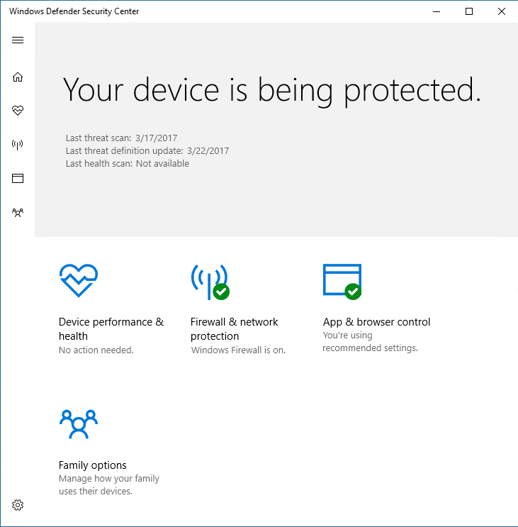

# Voorkomen dat gebruikers de gebruikersinterface van Microsoft Defender Antivirus kunnen zien of gebruikenPrevent users from seeing or interacting with the Microsoft Defender Antivirus user interface

[!INCLUDE [Microsoft 365 Defender rebranding](../../includes/microsoft-defender.md)]

**Van toepassing op:****Applies to:**

- [Microsoft Defender voor EindpuntMicrosoft Defender for Endpoint](/microsoft-365/security/defender-endpoint/)

U kunt groepsbeleid gebruiken om te voorkomen dat gebruikers op eindpunten de Microsoft Defender Antivirus-interface zien.You can use Group Policy to prevent users on endpoints from seeing the Microsoft Defender Antivirus interface. U kunt ook voorkomen dat ze scans onderbreken.You can also prevent them from pausing scans.

## De Microsoft Defender Antivirus-interface verbergenHide the Microsoft Defender Antivirus interface

In Windows 10, versie 1703, worden microsoft Defender Antivirusmeldingen verborgen door de interface te verbergen en wordt voorkomen dat de tegel Virus & bedreigingsbeveiliging wordt weergegeven in de Windows Security-app.In Windows 10, versions 1703, hiding the interface will hide Microsoft Defender Antivirus notifications and prevent the Virus & threat protection tile from appearing in the Windows Security app.

Met de instelling ingesteld op **Ingeschakeld:**With the setting set to **Enabled**:

Met de instelling ingesteld op **Uitgeschakeld of** niet geconfigureerd:With the setting set to **Disabled** or not configured:

>[!NOTE]
>Als u de interface verbergt, worden er ook geen meldingen van Microsoft Defender Antivirus weergegeven op het eindpunt.Hiding the interface will also prevent Microsoft Defender Antivirus notifications from appearing on the endpoint. Microsoft Defender voor eindpuntmeldingen wordt nog steeds weergegeven.Microsoft Defender for Endpoint notifications will still appear. U kunt de meldingen die op eindpunten worden weergegeven, ook [afzonderlijk configureren](configure-notifications-microsoft-defender-antivirus.md)You can also individually [configure the notifications that appear on endpoints](configure-notifications-microsoft-defender-antivirus.md)

In eerdere versies van Windows 10 verbergt de instelling de Windows Defender-clientinterface.In earlier versions of Windows 10, the setting will hide the Windows Defender client interface. Als de gebruiker probeert deze te openen, ontvangt deze een waarschuwing met de melding 'Uw systeembeheerder heeft beperkte toegang tot deze app'.If the user attempts to open it, they will receive a warning that says, "Your system administrator has restricted access to this app."

## Groepsbeleid gebruiken om de AV-interface van Microsoft Defender te verbergen voor gebruikersUse Group Policy to hide the Microsoft Defender AV interface from users

1. Open op uw groepsbeleidsbeheercomputer de [console](/previous-versions/windows/desktop/gpmc/group-policy-management-console-portal)Groepsbeleidsbeheer, klik met de rechtermuisknop op het groepsbeleidsobject dat u wilt configureren en klik op **Bewerken.**On your Group Policy management machine, open the [Group Policy Management Console](/previous-versions/windows/desktop/gpmc/group-policy-management-console-portal), right-click the Group Policy Object you want to configure and click **Edit**.

2. Ga met **de Editor voor groepsbeleidsbeheer** naar **Computerconfiguratie.**Using the **Group Policy Management Editor** go to **Computer configuration**.

3. Klik **op Beheersjablonen.**Click **Administrative templates**.

4. Vouw de structuur uit naar **Windows-onderdelen > Microsoft Defender Antivirus > clientinterface.**Expand the tree to **Windows components > Microsoft Defender Antivirus > Client interface**.

5. Dubbelklik op de instelling voor de modus Gebruikersinterface zonder hoofd **inschakelen** en stel de optie in op **Ingeschakeld.**Double-click the **Enable headless UI mode** setting and set the option to **Enabled**. Klik op **OK**.Click **OK**. 

Zie [Voorkomen dat gebruikers beleidsinstellingen](configure-local-policy-overrides-microsoft-defender-antivirus.md) lokaal wijzigen voor meer opties om te voorkomen dat gebruikers de beveiliging op hun pc wijzigen.See [Prevent users from locally modifying policy settings](configure-local-policy-overrides-microsoft-defender-antivirus.md) for more options on preventing users form modifying protection on their PCs.

## Voorkomen dat gebruikers een scan onderbrekenPrevent users from pausing a scan

U kunt voorkomen dat gebruikers scans onderbreken, wat handig kan zijn om ervoor te zorgen dat geplande of on-demand scans niet worden onderbroken door gebruikers.You can prevent users from pausing scans, which can be helpful to ensure scheduled or on-demand scans are not interrupted by users.

> [!NOTE]
> Deze instelling wordt niet ondersteund in Windows 10.This setting is not supported on Windows 10.

### Groepsbeleid gebruiken om te voorkomen dat gebruikers een scan onderbrekenUse Group Policy to prevent users from pausing a scan

1. Open op uw groepsbeleidsbeheercomputer de [console](/previous-versions/windows/desktop/gpmc/group-policy-management-console-portal)Groepsbeleidsbeheer, klik met de rechtermuisknop op het groepsbeleidsobject dat u wilt configureren en klik op **Bewerken.**On your Group Policy management machine, open the [Group Policy Management Console](/previous-versions/windows/desktop/gpmc/group-policy-management-console-portal), right-click the Group Policy Object you want to configure and click **Edit**.

2. Ga met **de Editor voor groepsbeleidsbeheer** naar **Computerconfiguratie.**Using the **Group Policy Management Editor** go to **Computer configuration**.

3. Klik **op Beheersjablonen.**Click **Administrative templates**.

4. Vouw de boom uit naar **Windows-onderdelen**  >  **Microsoft Defender Antivirus**  >  **Scan.**Expand the tree to **Windows components** > **Microsoft Defender Antivirus** > **Scan**.

5. Dubbelklik op de **instelling Toestaan dat gebruikers de scan onderbreken** en stel de optie in op **Uitgeschakeld.**Double-click the **Allow users to pause scan** setting and set the option to **Disabled**. Klik op **OK**.Click **OK**. 

## Verwante artikelenRelated articles

- [De meldingen configureren die op eindpunten worden weergegevenConfigure the notifications that appear on endpoints](configure-notifications-microsoft-defender-antivirus.md)

- [Interactie tussen eindgebruikers configureren met Microsoft Defender AntivirusConfigure end-user interaction with Microsoft Defender Antivirus](configure-end-user-interaction-microsoft-defender-antivirus.md)

- [Microsoft Defender Antivirus in Windows 10Microsoft Defender Antivirus in Windows 10](microsoft-defender-antivirus-in-windows-10.md)