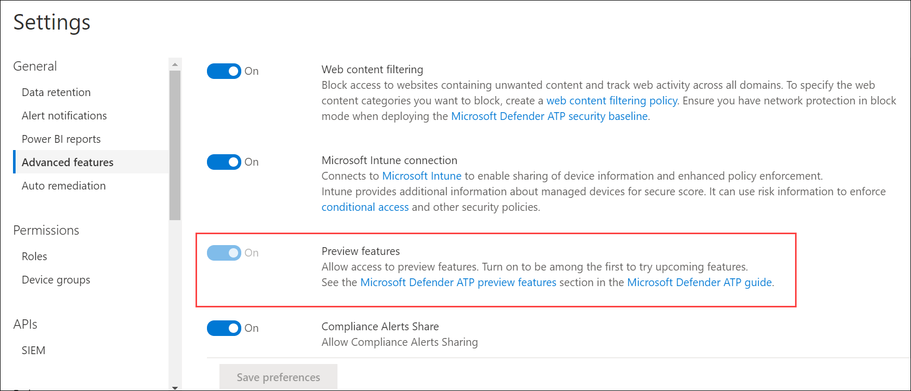

# De preview-ervaring in Microsoft Defender voor Eindpunt in-

[!INCLUDE [Microsoft 365 Defender rebranding](../../includes/microsoft-defender.md)]

**Van toepassing op:**
- [Microsoft Defender voor Endpoint](https://go.microsoft.com/fwlink/p/?linkid=2154037)
- [Microsoft 365 Defender](https://go.microsoft.com/fwlink/?linkid=2118804)

>Wilt u Defender voor Eindpunt ervaren? [Meld u aan voor een gratis proefabonnement.](https://www.microsoft.com/microsoft-365/windows/microsoft-defender-atp?ocid=docs-wdatp-previewsettings-abovefoldlink)

Schakel de preview-ervaringsinstelling in om een van de eersten te zijn om nieuwe functies uit te proberen.

1. Selecteer in het navigatiedeelvenster **Instellingen**  >  **Geavanceerde functies.**

    

2. Schakel de instelling in tussen **Aan** en **Uit** en selecteer **Voorkeuren opslaan.**

## Verwante onderwerpen
- [Algemene instellingen bijwerken in Microsoft Defender voor Eindpunt](data-retention-settings.md)
- [Geavanceerde functies in microsoft Defender voor eindpunt in- en uit-](advanced-features.md)
- [E-mailmeldingen configureren in Microsoft Defender voor Eindpunt](configure-email-notifications.md)
- [SIEM-integratie inschakelen in Microsoft Defender voor Eindpunt](enable-siem-integration.md)

