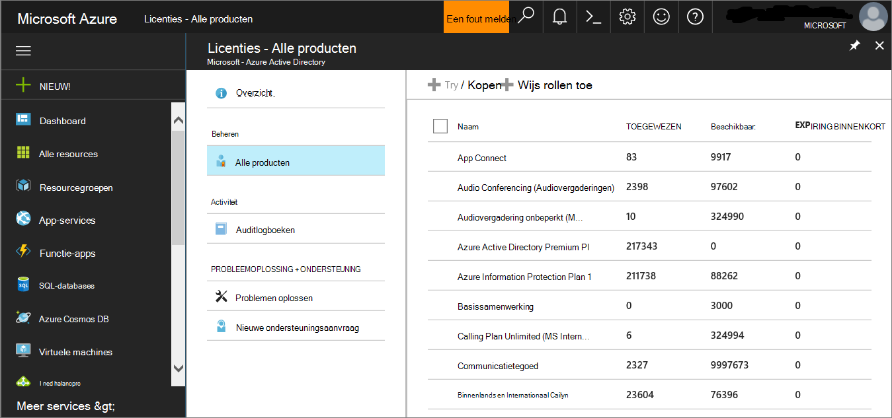
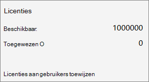
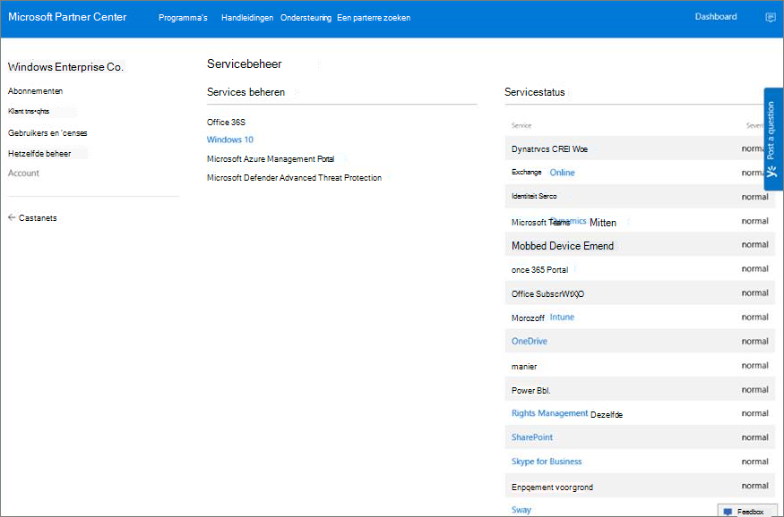
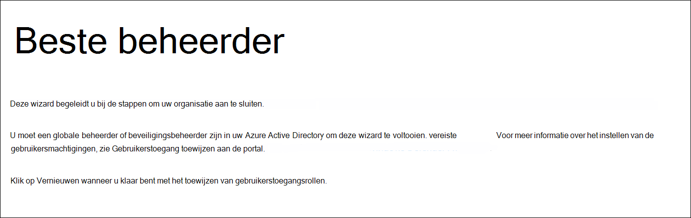
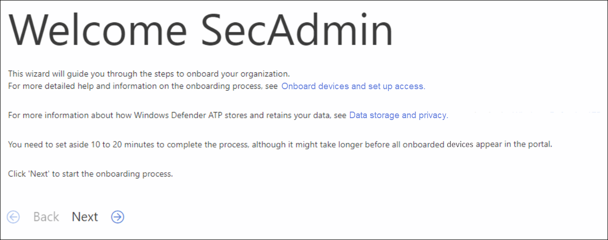
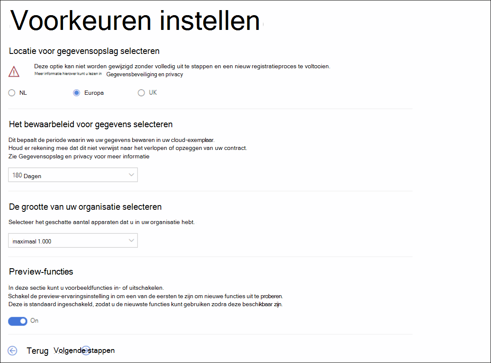
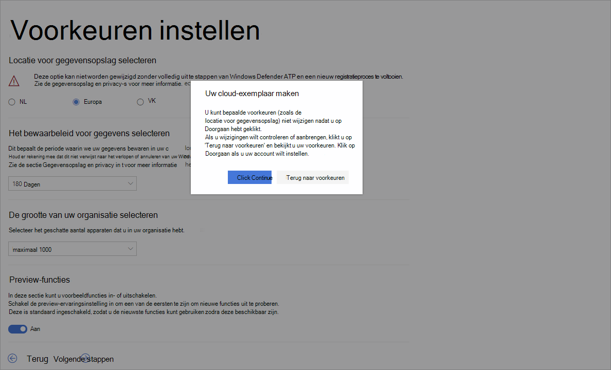

# <a name="set-up-microsoft-defender-for-endpoint-deployment"></a><span data-ttu-id="b9b13-104">Microsoft Defender instellen voor endpoint-implementatie</span><span class="sxs-lookup"><span data-stu-id="b9b13-104">Set up Microsoft Defender for Endpoint deployment</span></span>

[!INCLUDE [Microsoft 365 Defender rebranding](../../includes/microsoft-defender.md)]


<span data-ttu-id="b9b13-105">**Van toepassing op:**</span><span class="sxs-lookup"><span data-stu-id="b9b13-105">**Applies to:**</span></span>
- [<span data-ttu-id="b9b13-106">Microsoft Defender voor Endpoint</span><span class="sxs-lookup"><span data-stu-id="b9b13-106">Microsoft Defender for Endpoint</span></span>](https://go.microsoft.com/fwlink/p/?linkid=2154037)
- [<span data-ttu-id="b9b13-107">Microsoft 365 Defender</span><span class="sxs-lookup"><span data-stu-id="b9b13-107">Microsoft 365 Defender</span></span>](https://go.microsoft.com/fwlink/?linkid=2118804)

> <span data-ttu-id="b9b13-108">Wilt u Microsoft Defender voor Eindpunt ervaren?</span><span class="sxs-lookup"><span data-stu-id="b9b13-108">Want to experience Microsoft Defender for Endpoint?</span></span> [<span data-ttu-id="b9b13-109">Meld u aan voor een gratis proefabonnement.</span><span class="sxs-lookup"><span data-stu-id="b9b13-109">Sign up for a free trial.</span></span>](https://www.microsoft.com/microsoft-365/windows/microsoft-defender-atp?ocid=docs-wdatp-exposedapis-abovefoldlink)

<span data-ttu-id="b9b13-110">Het implementeren van Defender voor Eindpunt is een proces in drie fasen:</span><span class="sxs-lookup"><span data-stu-id="b9b13-110">Deploying Defender for Endpoint is a three-phase process:</span></span>

| <span data-ttu-id="b9b13-111">[](prepare-deployment.md)</span><span class="sxs-lookup"><span data-stu-id="b9b13-111">[](prepare-deployment.md)</span></span><br>[<span data-ttu-id="b9b13-112">Fase 1: Voorbereiden</span><span class="sxs-lookup"><span data-stu-id="b9b13-112">Phase 1: Prepare</span></span>](prepare-deployment.md) | <br><span data-ttu-id="b9b13-114">Fase 2: Setup</span><span class="sxs-lookup"><span data-stu-id="b9b13-114">Phase 2: Setup</span></span> | <span data-ttu-id="b9b13-115">[](onboarding.md)</span><span class="sxs-lookup"><span data-stu-id="b9b13-115">[](onboarding.md)</span></span><br>[<span data-ttu-id="b9b13-116">Fase 3: Onboard</span><span class="sxs-lookup"><span data-stu-id="b9b13-116">Phase 3: Onboard</span></span>](onboarding.md) |
| ----- | ----- | ----- |
| | <span data-ttu-id="b9b13-117">*U bent er!*</span><span class="sxs-lookup"><span data-stu-id="b9b13-117">*You are here!*</span></span>||

<span data-ttu-id="b9b13-118">U bent momenteel bezig met de in te stellen fase.</span><span class="sxs-lookup"><span data-stu-id="b9b13-118">You are currently in the set-up phase.</span></span>

<span data-ttu-id="b9b13-119">In dit implementatiescenario wordt u begeleid door de stappen op:</span><span class="sxs-lookup"><span data-stu-id="b9b13-119">In this deployment scenario, you'll be guided through the steps on:</span></span>
- <span data-ttu-id="b9b13-120">Validatie van licenties</span><span class="sxs-lookup"><span data-stu-id="b9b13-120">Licensing validation</span></span>
- <span data-ttu-id="b9b13-121">Tenantconfiguratie</span><span class="sxs-lookup"><span data-stu-id="b9b13-121">Tenant configuration</span></span>
- <span data-ttu-id="b9b13-122">Netwerkconfiguratie</span><span class="sxs-lookup"><span data-stu-id="b9b13-122">Network configuration</span></span>


>[!NOTE]
><span data-ttu-id="b9b13-123">Dit scenario heeft alleen betrekking op het gebruik van Microsoft Endpoint Configuration Manager om u te begeleiden bij een normale implementatie.</span><span class="sxs-lookup"><span data-stu-id="b9b13-123">For the purpose of guiding you through a typical deployment, this scenario will only cover the use of Microsoft Endpoint Configuration Manager.</span></span> <span data-ttu-id="b9b13-124">Defender voor Eindpunt ondersteunt het gebruik van andere onboarding-hulpprogramma's, maar deze scenario's worden niet in de implementatiehandleiding bestrijken.</span><span class="sxs-lookup"><span data-stu-id="b9b13-124">Defender for Endpoint supports the use of other onboarding tools but won't cover those scenarios in the deployment guide.</span></span> <span data-ttu-id="b9b13-125">Zie Onboard devices to Microsoft Defender for Endpoint (Onboard [devices to Microsoft Defender for Endpoint) voor meer informatie.](onboard-configure.md)</span><span class="sxs-lookup"><span data-stu-id="b9b13-125">For more information, see [Onboard devices to Microsoft Defender for Endpoint](onboard-configure.md).</span></span>

## <a name="check-license-state"></a><span data-ttu-id="b9b13-126">Licentiestaat controleren</span><span class="sxs-lookup"><span data-stu-id="b9b13-126">Check license state</span></span>

<span data-ttu-id="b9b13-127">Controleren op de licentiestaat en of deze correct is ingericht, kan via het beheercentrum of via de **Microsoft Azure-portal.**</span><span class="sxs-lookup"><span data-stu-id="b9b13-127">Checking for the license state and whether it got properly provisioned, can be done through the admin center or through the **Microsoft Azure portal**.</span></span>

1. <span data-ttu-id="b9b13-128">Als u uw licenties wilt bekijken, gaat u naar de **Microsoft Azure-portal** en gaat u naar de sectie Licentie van [de Microsoft Azure-portal.](https://portal.azure.com/#blade/Microsoft_AAD_IAM/LicensesMenuBlade/Products)</span><span class="sxs-lookup"><span data-stu-id="b9b13-128">To view your licenses, go to the **Microsoft Azure portal** and navigate to the [Microsoft Azure portal license section](https://portal.azure.com/#blade/Microsoft_AAD_IAM/LicensesMenuBlade/Products).</span></span>

   

1. <span data-ttu-id="b9b13-130">U kunt ook in het beheercentrum naar  >  **Factureringsabonnementen gaan.**</span><span class="sxs-lookup"><span data-stu-id="b9b13-130">Alternately, in the admin center, navigate to **Billing** > **Subscriptions**.</span></span>

    <span data-ttu-id="b9b13-131">Op het scherm ziet u alle inrichtende licenties en de huidige **status.**</span><span class="sxs-lookup"><span data-stu-id="b9b13-131">On the screen, you'll see all the provisioned licenses and their current **Status**.</span></span>

    


## <a name="cloud-service-provider-validation"></a><span data-ttu-id="b9b13-133">Validatie van cloudserviceprovider</span><span class="sxs-lookup"><span data-stu-id="b9b13-133">Cloud Service Provider validation</span></span>

<span data-ttu-id="b9b13-134">Als u toegang wilt krijgen tot welke licenties aan uw bedrijf zijn ingericht en om de status van de licenties te controleren, gaat u naar het beheercentrum.</span><span class="sxs-lookup"><span data-stu-id="b9b13-134">To gain access into which licenses are provisioned to your company, and to check the state of the licenses, go to the admin center.</span></span>

1. <span data-ttu-id="b9b13-135">Selecteer services beheren in de **partnerportal** **> Office 365.**</span><span class="sxs-lookup"><span data-stu-id="b9b13-135">From the **Partner portal**, select **Administer services > Office 365**.</span></span>

2. <span data-ttu-id="b9b13-136">Als u op de **koppeling Partnerportal** klikt, wordt de optie Beheerder **namens** geopend en hebt u toegang tot het klantbeheerdercentrum.</span><span class="sxs-lookup"><span data-stu-id="b9b13-136">Clicking on the **Partner portal** link will open the **Admin on behalf** option and will give you access to the customer admin center.</span></span>

   


## <a name="tenant-configuration"></a><span data-ttu-id="b9b13-138">Tenantconfiguratie</span><span class="sxs-lookup"><span data-stu-id="b9b13-138">Tenant Configuration</span></span>

<span data-ttu-id="b9b13-139">Wanneer u het Microsoft Defender-beveiligingscentrum voor het eerst gebruikt, wordt u door een wizard begeleid door enkele eerste stappen.</span><span class="sxs-lookup"><span data-stu-id="b9b13-139">When accessing Microsoft Defender Security Center for the first time, a wizard that will guide you through some initial steps.</span></span> <span data-ttu-id="b9b13-140">Aan het einde van de installatiewizard wordt een speciaal cloud-exemplaar van Defender voor Eindpunt gemaakt.</span><span class="sxs-lookup"><span data-stu-id="b9b13-140">At the end of the setup wizard, there will be a dedicated cloud instance of Defender for Endpoint created.</span></span> <span data-ttu-id="b9b13-141">De eenvoudigste methode is om deze stappen uit te voeren vanaf een Windows 10-clientapparaat.</span><span class="sxs-lookup"><span data-stu-id="b9b13-141">The easiest method is to perform these steps from a Windows 10 client device.</span></span>

1. <span data-ttu-id="b9b13-142">Navigeer vanuit een webbrowser naar <https://securitycenter.windows.com> .</span><span class="sxs-lookup"><span data-stu-id="b9b13-142">From a web browser, navigate to <https://securitycenter.windows.com>.</span></span>

    

2. <span data-ttu-id="b9b13-144">Als u een proefabonnement hebt, gaat u naar de koppeling ( <https://signup.microsoft.com/Signup?OfferId=6033e4b5-c320-4008-a936-909c2825d83c&dl=WIN_DEF_ATP&pc=xxxxxxx-xxxxxx-xxx-x> )</span><span class="sxs-lookup"><span data-stu-id="b9b13-144">If going through a TRIAL license, go to the link (<https://signup.microsoft.com/Signup?OfferId=6033e4b5-c320-4008-a936-909c2825d83c&dl=WIN_DEF_ATP&pc=xxxxxxx-xxxxxx-xxx-x>)</span></span>

    <span data-ttu-id="b9b13-145">Zodra de autorisatiestap is voltooid, wordt het **welkomstscherm** weergegeven.</span><span class="sxs-lookup"><span data-stu-id="b9b13-145">Once the authorization step is completed, the **Welcome** screen will be displayed.</span></span>
3. <span data-ttu-id="b9b13-146">Ga door de autorisatiestappen.</span><span class="sxs-lookup"><span data-stu-id="b9b13-146">Go through the authorization steps.</span></span>

    

4. <span data-ttu-id="b9b13-148">Voorkeuren instellen.</span><span class="sxs-lookup"><span data-stu-id="b9b13-148">Set up preferences.</span></span>

   <span data-ttu-id="b9b13-149">**Locatie voor gegevensopslag:** het is belangrijk om dit correct in te stellen.</span><span class="sxs-lookup"><span data-stu-id="b9b13-149">**Data storage location** - It's important to set this up correctly.</span></span> <span data-ttu-id="b9b13-150">Bepaal waar de klant hoofdzakelijk gehost wil worden: VS, EU of Verenigd Koninkrijk.</span><span class="sxs-lookup"><span data-stu-id="b9b13-150">Determine where the customer wants to be primarily hosted: US, EU, or UK.</span></span> <span data-ttu-id="b9b13-151">U kunt de locatie na deze set niet wijzigen en Microsoft zal de gegevens niet overbrengen vanuit de opgegeven geolocatie.</span><span class="sxs-lookup"><span data-stu-id="b9b13-151">You can't change the location after this set up and Microsoft won't transfer the data from the specified geolocation.</span></span> 

    <span data-ttu-id="b9b13-152">**Gegevensretentie:** de standaardwaarde is zes maanden.</span><span class="sxs-lookup"><span data-stu-id="b9b13-152">**Data retention** - The default is six months.</span></span>

    <span data-ttu-id="b9b13-153">**Preview-functies inschakelen:** de standaardinstelling is ingeschakeld en kan later worden gewijzigd.</span><span class="sxs-lookup"><span data-stu-id="b9b13-153">**Enable preview features** - The default is on, can be changed later.</span></span>

    

5. <span data-ttu-id="b9b13-155">Selecteer **Volgende**.</span><span class="sxs-lookup"><span data-stu-id="b9b13-155">Select **Next**.</span></span>

     

6. <span data-ttu-id="b9b13-157">Selecteer **Doorgaan**.</span><span class="sxs-lookup"><span data-stu-id="b9b13-157">Select **Continue**.</span></span>


## <a name="network-configuration"></a><span data-ttu-id="b9b13-158">Netwerkconfiguratie</span><span class="sxs-lookup"><span data-stu-id="b9b13-158">Network configuration</span></span>
<span data-ttu-id="b9b13-159">Als de organisatie de eindpunten niet nodig heeft om een proxy te gebruiken voor toegang tot internet, slaat u deze sectie over.</span><span class="sxs-lookup"><span data-stu-id="b9b13-159">If the organization doesn't require the endpoints to use a Proxy to access the Internet, skip this section.</span></span>

<span data-ttu-id="b9b13-160">Voor de Microsoft Defender voor eindpunten-sensor moet Microsoft Windows HTTP (WinHTTP) sensorgegevens rapporteren en communiceren met de Microsoft Defender voor Eindpunt-service.</span><span class="sxs-lookup"><span data-stu-id="b9b13-160">The Microsoft Defender for Endpoint sensor requires Microsoft Windows HTTP (WinHTTP) to report sensor data and communicate with the Microsoft Defender for Endpoint service.</span></span> <span data-ttu-id="b9b13-161">De ingesloten Microsoft Defender voor Eindpunt-sensor wordt uitgevoerd in de systeemcontext met behulp van het LocalSystem-account.</span><span class="sxs-lookup"><span data-stu-id="b9b13-161">The embedded Microsoft Defender for Endpoint sensor runs in the system context using the LocalSystem account.</span></span> <span data-ttu-id="b9b13-162">De sensor gebruikt Microsoft Windows HTTP Services (WinHTTP) om communicatie met de Microsoft Defender for Endpoint-cloudservice in te stellen.</span><span class="sxs-lookup"><span data-stu-id="b9b13-162">The sensor uses Microsoft Windows HTTP Services (WinHTTP) to enable communication with the Microsoft Defender for Endpoint cloud service.</span></span> <span data-ttu-id="b9b13-163">De configuratie-instelling WinHTTP is onafhankelijk van de instellingen voor Windows Internet (WinINet) voor internetbrowsingsproxy en kan alleen een proxyserver vinden met behulp van de volgende detectiemethoden:</span><span class="sxs-lookup"><span data-stu-id="b9b13-163">The WinHTTP configuration setting is independent of the Windows Internet (WinINet) internet browsing proxy settings and can only discover a proxy server by using the following discovery methods:</span></span>

<span data-ttu-id="b9b13-164">**Autodiscovery-methoden:**</span><span class="sxs-lookup"><span data-stu-id="b9b13-164">**Autodiscovery methods:**</span></span>

-   <span data-ttu-id="b9b13-165">Transparante proxy</span><span class="sxs-lookup"><span data-stu-id="b9b13-165">Transparent proxy</span></span>

-   <span data-ttu-id="b9b13-166">Web proxy Autodiscovery Protocol (WPAD)</span><span class="sxs-lookup"><span data-stu-id="b9b13-166">Web Proxy Autodiscovery Protocol (WPAD)</span></span>

<span data-ttu-id="b9b13-167">Als een transparante proxy of WPAD is geïmplementeerd in de netwerktopologie, is er geen speciale configuratie-instellingen nodig.</span><span class="sxs-lookup"><span data-stu-id="b9b13-167">If a Transparent proxy or WPAD has been implemented in the network topology, there is no need for special configuration settings.</span></span> <span data-ttu-id="b9b13-168">Zie de sectie [URL's proxyservice](production-deployment.md#proxy-service-urls) in dit document voor de URL's allowlist of op Apparaatproxy- en internetverbindingsinstellingen [configureren](configure-proxy-internet.md#enable-access-to-microsoft-defender-for-endpoint-service-urls-in-the-proxy-server)voor meer informatie over url-uitsluitingen van Microsoft Defender voor eindpunten in de proxy.</span><span class="sxs-lookup"><span data-stu-id="b9b13-168">For more information on Microsoft Defender for Endpoint URL exclusions in the proxy, see the [Proxy Service URLs](production-deployment.md#proxy-service-urls) section in this document for the URLs allowlist or on [Configure device proxy and Internet connectivity settings](configure-proxy-internet.md#enable-access-to-microsoft-defender-for-endpoint-service-urls-in-the-proxy-server).</span></span>

<span data-ttu-id="b9b13-169">**Handmatige statische proxyconfiguratie:**</span><span class="sxs-lookup"><span data-stu-id="b9b13-169">**Manual static proxy configuration:**</span></span>

-   <span data-ttu-id="b9b13-170">Configuratie op basis van register</span><span class="sxs-lookup"><span data-stu-id="b9b13-170">Registry-based configuration</span></span>

-   <span data-ttu-id="b9b13-171">WinHTTP geconfigureerd met de opdracht Netsh</span><span class="sxs-lookup"><span data-stu-id="b9b13-171">WinHTTP configured using netsh command</span></span> <br> <span data-ttu-id="b9b13-172">Alleen geschikt voor desktops in een stabiele topologie (bijvoorbeeld: een bureaublad in een bedrijfsnetwerk achter dezelfde proxy)</span><span class="sxs-lookup"><span data-stu-id="b9b13-172">Suitable only for desktops in a stable topology (for example: a desktop in a corporate network behind the same proxy)</span></span>

### <a name="configure-the-proxy-server-manually-using-a-registry-based-static-proxy"></a><span data-ttu-id="b9b13-173">De proxyserver handmatig configureren met behulp van een statische proxy op basis van het register</span><span class="sxs-lookup"><span data-stu-id="b9b13-173">Configure the proxy server manually using a registry-based static proxy</span></span>

<span data-ttu-id="b9b13-174">Configureer een statische proxy op basis van het register zodat alleen de Sensor voor Eindpunten van Microsoft Defender diagnostische gegevens kan rapporteren en kan communiceren met Microsoft Defender voor endpoint-services als een computer geen verbinding mag maken met internet.</span><span class="sxs-lookup"><span data-stu-id="b9b13-174">Configure a registry-based static proxy to allow only Microsoft Defender for Endpoint sensor to report diagnostic data and communicate with Microsoft Defender for Endpoint services if a computer isn't permitted to connect to the Internet.</span></span> <span data-ttu-id="b9b13-175">De statische proxy kan worden geconfigureerd via Groepsbeleid (GP).</span><span class="sxs-lookup"><span data-stu-id="b9b13-175">The static proxy is configurable through Group Policy (GP).</span></span> <span data-ttu-id="b9b13-176">Het groepsbeleid vindt u onder:</span><span class="sxs-lookup"><span data-stu-id="b9b13-176">The group policy can be found under:</span></span>

 - <span data-ttu-id="b9b13-177">Beheersjablonen \> Windows Components Data Collection and Preview Builds Configure \> \> Authenticated Proxy usage for the Connected User Experience and Telemetry Service</span><span class="sxs-lookup"><span data-stu-id="b9b13-177">Administrative Templates \> Windows Components \> Data Collection and Preview Builds \> Configure Authenticated Proxy usage for the Connected User Experience and Telemetry Service</span></span>
     - <span data-ttu-id="b9b13-178">Stel deze in **op Ingeschakeld en** selecteer Geverifieerd **proxygebruik uitschakelen**</span><span class="sxs-lookup"><span data-stu-id="b9b13-178">Set it to **Enabled** and select **Disable Authenticated Proxy usage**</span></span>

1. <span data-ttu-id="b9b13-179">Open de console Groepsbeleidsbeheer.</span><span class="sxs-lookup"><span data-stu-id="b9b13-179">Open the Group Policy Management Console.</span></span>
2. <span data-ttu-id="b9b13-180">Maak een beleid of bewerk een bestaand beleid op basis van de organisatiepraktijken.</span><span class="sxs-lookup"><span data-stu-id="b9b13-180">Create a policy or edit an existing policy based off the organizational practices.</span></span>
3. <span data-ttu-id="b9b13-181">Bewerk het groepsbeleid en ga naar **Beheersjablonen \> Windows Components Data Collection and Preview Builds Configure \> \> Authenticated Proxy usage for the Connected User Experience and Telemetry Service**.</span><span class="sxs-lookup"><span data-stu-id="b9b13-181">Edit the Group Policy and navigate to **Administrative Templates \> Windows Components \> Data Collection and Preview Builds \> Configure Authenticated Proxy usage for the Connected User Experience and Telemetry Service**.</span></span> 
    <span data-ttu-id="b9b13-182"></span><span class="sxs-lookup"><span data-stu-id="b9b13-182"></span></span>

4. <span data-ttu-id="b9b13-183">Selecteer **Ingeschakeld.**</span><span class="sxs-lookup"><span data-stu-id="b9b13-183">Select **Enabled**.</span></span>
5. <span data-ttu-id="b9b13-184">Selecteer **Geverifieerd proxygebruik uitschakelen.**</span><span class="sxs-lookup"><span data-stu-id="b9b13-184">Select **Disable Authenticated Proxy usage**.</span></span>
   
6. <span data-ttu-id="b9b13-185">**Navigeer naar beheersjablonen \> Windows Components Data Collection en Preview Builds Configure connected user experiences and \> \> telemetry**.</span><span class="sxs-lookup"><span data-stu-id="b9b13-185">Navigate to **Administrative Templates \> Windows Components \> Data Collection and Preview Builds \> Configure connected user experiences and telemetry**.</span></span>
    <span data-ttu-id="b9b13-186"></span><span class="sxs-lookup"><span data-stu-id="b9b13-186"></span></span>
7. <span data-ttu-id="b9b13-187">Selecteer **Ingeschakeld.**</span><span class="sxs-lookup"><span data-stu-id="b9b13-187">Select **Enabled**.</span></span>
8. <span data-ttu-id="b9b13-188">Voer de **naam van de proxyserver in.**</span><span class="sxs-lookup"><span data-stu-id="b9b13-188">Enter the **Proxy Server Name**.</span></span>

<span data-ttu-id="b9b13-189">Met het beleid worden twee `TelemetryProxyServer` registerwaarden REG_SZ en `DisableEnterpriseAuthProxy` REG_DWORD onder de `HKLM\Software\Policies\Microsoft\Windows\DataCollection` registersleutel.</span><span class="sxs-lookup"><span data-stu-id="b9b13-189">The policy sets two registry values `TelemetryProxyServer` as REG_SZ and `DisableEnterpriseAuthProxy` as REG_DWORD under the registry key `HKLM\Software\Policies\Microsoft\Windows\DataCollection`.</span></span>

<span data-ttu-id="b9b13-190">De registerwaarde `TelemetryProxyServer` heeft de volgende tekenreeksindeling:</span><span class="sxs-lookup"><span data-stu-id="b9b13-190">The registry value `TelemetryProxyServer` takes the following string format:</span></span>

```text
<server name or ip>:<port>
```

<span data-ttu-id="b9b13-191">Bijvoorbeeld: 10.0.0.6:8080</span><span class="sxs-lookup"><span data-stu-id="b9b13-191">For example: 10.0.0.6:8080</span></span>

<span data-ttu-id="b9b13-192">De registerwaarde `DisableEnterpriseAuthProxy` moet worden ingesteld op 1.</span><span class="sxs-lookup"><span data-stu-id="b9b13-192">The registry value `DisableEnterpriseAuthProxy` should be set to 1.</span></span>

###  <a name="configure-the-proxy-server-manually-using-netsh-command"></a><span data-ttu-id="b9b13-193">De proxyserver handmatig configureren met de opdracht Netsh</span><span class="sxs-lookup"><span data-stu-id="b9b13-193">Configure the proxy server manually using netsh command</span></span>

<span data-ttu-id="b9b13-194">Gebruik netsh om een statische proxy voor het hele systeem te configureren.</span><span class="sxs-lookup"><span data-stu-id="b9b13-194">Use netsh to configure a system-wide static proxy.</span></span>

> [!NOTE]
> - <span data-ttu-id="b9b13-195">Dit is van invloed op alle toepassingen, inclusief Windows-services die WinHTTP met standaardproxy gebruiken.</span><span class="sxs-lookup"><span data-stu-id="b9b13-195">This will affect all applications including Windows services which use WinHTTP with default proxy.</span></span></br>
> - <span data-ttu-id="b9b13-196">Laptops die de topologie wijzigen (bijvoorbeeld van kantoor naar thuis) werken niet goed met netsh.</span><span class="sxs-lookup"><span data-stu-id="b9b13-196">Laptops that are changing topology (for example: from office to home) will malfunction with netsh.</span></span> <span data-ttu-id="b9b13-197">Gebruik de statische proxyconfiguratie op basis van het register.</span><span class="sxs-lookup"><span data-stu-id="b9b13-197">Use the registry-based static proxy configuration.</span></span>

1. <span data-ttu-id="b9b13-198">Open een verhoogde opdrachtregel:</span><span class="sxs-lookup"><span data-stu-id="b9b13-198">Open an elevated command line:</span></span>

    1. <span data-ttu-id="b9b13-199">Ga naar **Start** en typ **cmd.**</span><span class="sxs-lookup"><span data-stu-id="b9b13-199">Go to **Start** and type **cmd**.</span></span>

    1. <span data-ttu-id="b9b13-200">Klik met de rechtermuisknop **op Opdrachtprompt** en selecteer **Uitvoeren als beheerder.**</span><span class="sxs-lookup"><span data-stu-id="b9b13-200">Right-click **Command prompt** and select **Run as administrator**.</span></span>

2. <span data-ttu-id="b9b13-201">Voer de volgende opdracht in en druk op **Enter:**</span><span class="sxs-lookup"><span data-stu-id="b9b13-201">Enter the following command and press **Enter**:</span></span>

   ```PowerShell
   netsh winhttp set proxy <proxy>:<port>
   ```

   <span data-ttu-id="b9b13-202">Bijvoorbeeld: netsh winhttp set proxy 10.0.0.6:8080</span><span class="sxs-lookup"><span data-stu-id="b9b13-202">For example: netsh winhttp set proxy 10.0.0.6:8080</span></span>


###  <a name="proxy-configuration-for-down-level-devices"></a><span data-ttu-id="b9b13-203">Proxyconfiguratie voor apparaten met een laag niveau</span><span class="sxs-lookup"><span data-stu-id="b9b13-203">Proxy Configuration for down-level devices</span></span>

<span data-ttu-id="b9b13-204">Down-Level apparaten zijn Windows 7 SP1 en Windows 8.1-werkstations, evenals Windows Server 2008 R2, Windows Server 2012, Windows Server 2012 R2 en versies van Windows Server 2016 vóór Windows Server CB 1803.</span><span class="sxs-lookup"><span data-stu-id="b9b13-204">Down-Level devices include Windows 7 SP1 and Windows 8.1 workstations as well as Windows Server 2008 R2, Windows Server 2012, Windows Server 2012 R2, and versions of Windows Server 2016 prior to Windows Server CB 1803.</span></span> <span data-ttu-id="b9b13-205">Deze besturingssystemen hebben de proxy geconfigureerd als onderdeel van de Microsoft Management Agent voor het verwerken van communicatie van het eindpunt naar Azure.</span><span class="sxs-lookup"><span data-stu-id="b9b13-205">These operating systems will have the proxy configured as part of the Microsoft Management Agent to handle communication from the endpoint to Azure.</span></span> <span data-ttu-id="b9b13-206">Raadpleeg de Microsoft Management Agent Fast Deployment Guide voor informatie over de configuratie van een proxy op deze apparaten.</span><span class="sxs-lookup"><span data-stu-id="b9b13-206">Refer to the Microsoft Management Agent Fast Deployment Guide for information on how a proxy is configured on these devices.</span></span>

### <a name="proxy-service-urls"></a><span data-ttu-id="b9b13-207">URL's voor proxyservice</span><span class="sxs-lookup"><span data-stu-id="b9b13-207">Proxy Service URLs</span></span>
<span data-ttu-id="b9b13-208">URL's die v20 bevatten, zijn alleen nodig als u Windows 10, versie 1803 of hoger hebt.</span><span class="sxs-lookup"><span data-stu-id="b9b13-208">URLs that include v20 in them are only needed if you have Windows 10, version 1803 or later devices.</span></span> <span data-ttu-id="b9b13-209">Is bijvoorbeeld alleen ```us-v20.events.data.microsoft.com``` nodig als het apparaat zich op Windows 10, versie 1803 of hoger heeft geïnstalleerd.</span><span class="sxs-lookup"><span data-stu-id="b9b13-209">For example, ```us-v20.events.data.microsoft.com``` is only needed if the device is on Windows 10, version 1803 or later.</span></span>
 

<span data-ttu-id="b9b13-210">Als een proxy of firewall anoniem verkeer blokkeert, aangezien microsoft Defender voor eindpunten-sensor verbinding maakt vanuit de systeemcontext, moet u ervoor zorgen dat anoniem verkeer is toegestaan in de vermelde URL's.</span><span class="sxs-lookup"><span data-stu-id="b9b13-210">If a proxy or firewall is blocking anonymous traffic, as Microsoft Defender for Endpoint sensor is connecting from system context, make sure anonymous traffic is permitted in the listed URLs.</span></span>

<span data-ttu-id="b9b13-211">In de volgende downloadbare spreadsheet vindt u de services en bijbehorende URL's waar uw netwerk verbinding mee moet kunnen maken.</span><span class="sxs-lookup"><span data-stu-id="b9b13-211">The following downloadable spreadsheet lists the services and their associated URLs that your network must be able to connect to.</span></span> <span data-ttu-id="b9b13-212">Zorg ervoor dat er geen firewall- of netwerkfilterregels zijn die de toegang tot deze URL's weigeren, of u moet mogelijk een regel voor toestaan *speciaal* voor deze url's maken.</span><span class="sxs-lookup"><span data-stu-id="b9b13-212">Ensure there are no firewall or network filtering rules that would deny access to these URLs, or you may need to create an *allow* rule specifically for them.</span></span>

|<span data-ttu-id="b9b13-213">**Spreadsheet met domeinenlijst**</span><span class="sxs-lookup"><span data-stu-id="b9b13-213">**Spreadsheet of domains list**</span></span>|<span data-ttu-id="b9b13-214">**Beschrijving**</span><span class="sxs-lookup"><span data-stu-id="b9b13-214">**Description**</span></span>|
|:-----|:-----|
|<br/>  | <span data-ttu-id="b9b13-216">Spreadsheet met specifieke DNS-records voor servicelocaties, geografische locaties en besturingssysteem.</span><span class="sxs-lookup"><span data-stu-id="b9b13-216">Spreadsheet of specific DNS records for service locations, geographic locations, and OS.</span></span> <br><br>[<span data-ttu-id="b9b13-217">Download de spreadsheet hier.</span><span class="sxs-lookup"><span data-stu-id="b9b13-217">Download the spreadsheet here.</span></span>](https://download.microsoft.com/download/8/a/5/8a51eee5-cd02-431c-9d78-a58b7f77c070/mde-urls.xlsx) 


###  <a name="microsoft-defender-for-endpoint-service-backend-ip-ranges"></a><span data-ttu-id="b9b13-218">Back-end IP-bereik van Microsoft Defender for Endpoint-service</span><span class="sxs-lookup"><span data-stu-id="b9b13-218">Microsoft Defender for Endpoint service backend IP ranges</span></span>

<span data-ttu-id="b9b13-219">Als uw netwerkapparaten geen DNS-regels ondersteunen, gebruikt u in plaats daarvan IP-bereik.</span><span class="sxs-lookup"><span data-stu-id="b9b13-219">If your network devices don't support DNS-based rules, use IP ranges instead.</span></span>

<span data-ttu-id="b9b13-220">Defender for Endpoint is gebouwd in azure cloud, geïmplementeerd in de volgende regio's:</span><span class="sxs-lookup"><span data-stu-id="b9b13-220">Defender for Endpoint is built in Azure cloud, deployed in the following regions:</span></span>

- <span data-ttu-id="b9b13-221">AzureCloud.eastus</span><span class="sxs-lookup"><span data-stu-id="b9b13-221">AzureCloud.eastus</span></span>
- <span data-ttu-id="b9b13-222">AzureCloud.eastus2</span><span class="sxs-lookup"><span data-stu-id="b9b13-222">AzureCloud.eastus2</span></span>
- <span data-ttu-id="b9b13-223">AzureCloud.westcentralus</span><span class="sxs-lookup"><span data-stu-id="b9b13-223">AzureCloud.westcentralus</span></span>
- <span data-ttu-id="b9b13-224">AzureCloud.northeurope</span><span class="sxs-lookup"><span data-stu-id="b9b13-224">AzureCloud.northeurope</span></span>
- <span data-ttu-id="b9b13-225">AzureCloud.westeurope</span><span class="sxs-lookup"><span data-stu-id="b9b13-225">AzureCloud.westeurope</span></span>
- <span data-ttu-id="b9b13-226">AzureCloud.uksouth</span><span class="sxs-lookup"><span data-stu-id="b9b13-226">AzureCloud.uksouth</span></span>
- <span data-ttu-id="b9b13-227">AzureCloud.ukwest</span><span class="sxs-lookup"><span data-stu-id="b9b13-227">AzureCloud.ukwest</span></span>

<span data-ttu-id="b9b13-228">U kunt de Azure IP-bereik vinden in [Azure IP-bereik en Servicetags – Public Cloud.](https://www.microsoft.com/download/details.aspx?id=56519)</span><span class="sxs-lookup"><span data-stu-id="b9b13-228">You can find the Azure IP ranges in [Azure IP Ranges and Service Tags – Public Cloud](https://www.microsoft.com/download/details.aspx?id=56519).</span></span>

> [!NOTE]
> <span data-ttu-id="b9b13-229">Als cloudoplossing kunnen de IP-adresbereiken worden gewijzigd.</span><span class="sxs-lookup"><span data-stu-id="b9b13-229">As a cloud-based solution, the IP address ranges can change.</span></span> <span data-ttu-id="b9b13-230">U wordt aangeraden over te gaan op regels op basis van DNS.</span><span class="sxs-lookup"><span data-stu-id="b9b13-230">It's recommended you move to DNS-based rules.</span></span>

> [!NOTE]
> <span data-ttu-id="b9b13-231">Als u een klant van de Amerikaanse overheid bent, raadpleegt u de bijbehorende sectie op de [pagina Defender for Endpoint for US Government.](gov.md#service-backend-ip-ranges)</span><span class="sxs-lookup"><span data-stu-id="b9b13-231">If you are a US Government customer, please see the corresponding section in the [Defender for Endpoint for US Government](gov.md#service-backend-ip-ranges) page.</span></span>

## <a name="next-step"></a><span data-ttu-id="b9b13-232">Volgende stap</span><span class="sxs-lookup"><span data-stu-id="b9b13-232">Next step</span></span>

<span data-ttu-id="b9b13-233"></span><span class="sxs-lookup"><span data-stu-id="b9b13-233"></span></span> <br><span data-ttu-id="b9b13-234">[Fase 3: Onboard:](onboarding.md)Apparaten aan boord van de service, zodat de Microsoft Defender voor Eindpunt-service sensorgegevens van deze apparaten kan krijgen.</span><span class="sxs-lookup"><span data-stu-id="b9b13-234">[Phase 3: Onboard](onboarding.md): Onboard devices to the service so that the Microsoft Defender for Endpoint service can get sensor data from them.</span></span> 
