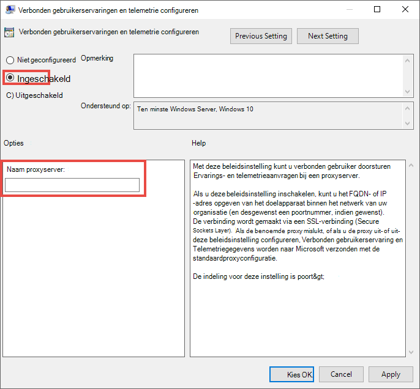

# <a name="set-up-microsoft-defender-for-endpoint-deployment"></a>Microsoft Defender instellen voor endpoint-implementatie

[!INCLUDE [Microsoft 365 Defender rebranding](../../includes/microsoft-defender.md)]


**Van toepassing op:**
- [Microsoft Defender voor Eindpunt](https://go.microsoft.com/fwlink/p/?linkid=2154037)
- [Microsoft 365 Defender](https://go.microsoft.com/fwlink/?linkid=2118804)

> Wilt u Microsoft Defender voor Eindpunt ervaren? [Meld u aan voor een gratis proefabonnement.](https://www.microsoft.com/microsoft-365/windows/microsoft-defender-atp?ocid=docs-wdatp-exposedapis-abovefoldlink)

Het implementeren van Defender voor Eindpunt is een proces in drie fasen:

| [](prepare-deployment.md)<br>[Fase 1: Voorbereiden](prepare-deployment.md) | <br>Fase 2: Instellen | [](onboarding.md)<br>[Fase 3: Onboarden](onboarding.md) |
| ----- | ----- | ----- |
| | *U bent er!*||

U bent momenteel bezig met de in te stellen fase.

In dit implementatiescenario wordt u begeleid door de stappen op:
- Validatie van licenties
- Tenantconfiguratie
- Netwerkconfiguratie


>[!NOTE]
>Dit scenario heeft alleen betrekking op het gebruik van Microsoft Endpoint Configuration Manager om u te begeleiden bij een normale implementatie. Defender voor Eindpunt ondersteunt het gebruik van andere onboarding-hulpprogramma's, maar deze scenario's worden niet in de implementatiehandleiding bestrijken. Zie Onboard devices to Microsoft Defender for Endpoint (Onboard [devices to Microsoft Defender for Endpoint) voor meer informatie.](onboard-configure.md)

## <a name="check-license-state"></a>Licentiestaat controleren

Controleren op de licentiestaat en of deze correct is ingericht, kan via het beheercentrum of via de **Microsoft Azure-portal.**

1. Als u uw licenties wilt bekijken, gaat u naar de **Microsoft Azure-portal** en gaat u naar de sectie Licentie van [de Microsoft Azure-portal.](https://portal.azure.com/#blade/Microsoft_AAD_IAM/LicensesMenuBlade/Products)

   

1. U kunt ook in het beheercentrum naar  >  **Factureringsabonnementen gaan.**

    Op het scherm ziet u alle inrichtende licenties en de huidige **status.**

    


## <a name="cloud-service-provider-validation"></a>Validatie van cloudserviceprovider

Als u toegang wilt krijgen tot welke licenties aan uw bedrijf zijn ingericht en om de status van de licenties te controleren, gaat u naar het beheercentrum.

1. Selecteer services beheren in de **partnerportal** **> Office 365.**

2. Als u op de **koppeling Partnerportal** klikt, wordt de optie Beheerder **namens** geopend en hebt u toegang tot het klantbeheerdercentrum.

   


## <a name="tenant-configuration"></a>Tenantconfiguratie

Wanneer u het Microsoft Defender-beveiligingscentrum voor het eerst gebruikt, wordt u door een wizard begeleid door enkele eerste stappen. Aan het einde van de installatiewizard wordt een speciaal cloud-exemplaar van Defender voor Eindpunt gemaakt. De eenvoudigste methode is om deze stappen uit te voeren vanaf een Windows 10-clientapparaat.

1. Navigeer vanuit een webbrowser naar <https://securitycenter.windows.com> .

    

2. Als u een proefabonnement hebt, gaat u naar de koppeling ( <https://signup.microsoft.com/Signup?OfferId=6033e4b5-c320-4008-a936-909c2825d83c&dl=WIN_DEF_ATP&pc=xxxxxxx-xxxxxx-xxx-x> )

    Zodra de autorisatiestap is voltooid, wordt het **welkomstscherm** weergegeven.
3. Ga door de autorisatiestappen.

    

4. Voorkeuren instellen.

   **Locatie voor gegevensopslag:** het is belangrijk om dit correct in te stellen. Bepaal waar de klant hoofdzakelijk gehost wil worden: VS, EU of Verenigd Koninkrijk. U kunt de locatie na deze set niet wijzigen en Microsoft zal de gegevens niet overbrengen vanuit de opgegeven geolocatie. 

    **Gegevensretentie:** de standaardwaarde is zes maanden.

    **Preview-functies inschakelen:** de standaardinstelling is ingeschakeld en kan later worden gewijzigd.

    

5. Selecteer **Volgende**.

     

6. Selecteer **Doorgaan**.


## <a name="network-configuration"></a>Netwerkconfiguratie
Als de organisatie de eindpunten niet nodig heeft om een proxy te gebruiken voor toegang tot internet, slaat u deze sectie over.

Voor de Microsoft Defender voor eindpunten-sensor moet Microsoft Windows HTTP (WinHTTP) sensorgegevens rapporteren en communiceren met de Microsoft Defender voor Eindpunt-service. De ingesloten Microsoft Defender voor Eindpunt-sensor wordt uitgevoerd in de systeemcontext met behulp van het LocalSystem-account. De sensor gebruikt Microsoft Windows HTTP Services (WinHTTP) om communicatie met de Microsoft Defender for Endpoint-cloudservice in te stellen. De configuratie-instelling WinHTTP is onafhankelijk van de instellingen voor Windows Internet (WinINet) voor internetbrowsingsproxy en kan alleen een proxyserver vinden met behulp van de volgende detectiemethoden:

**Autodiscovery-methoden:**

-   Transparante proxy

-   Web proxy Autodiscovery Protocol (WPAD)

Als een transparante proxy of WPAD is geïmplementeerd in de netwerktopologie, is er geen speciale configuratie-instellingen nodig. Zie de sectie [URL's](production-deployment.md#proxy-service-urls) proxyservice in dit document voor de lijst URL's voor URL's toestaan of op Apparaatproxy- en internetverbindingsinstellingen [configureren](configure-proxy-internet.md#enable-access-to-microsoft-defender-for-endpoint-service-urls-in-the-proxy-server)voor meer informatie over url-uitsluitingen van Microsoft Defender voor eindpunten in de proxy.

**Handmatige statische proxyconfiguratie:**

-   Configuratie op basis van register

-   WinHTTP geconfigureerd met de opdracht Netsh <br> Alleen geschikt voor desktops in een stabiele topologie (bijvoorbeeld: een bureaublad in een bedrijfsnetwerk achter dezelfde proxy)

### <a name="configure-the-proxy-server-manually-using-a-registry-based-static-proxy"></a>De proxyserver handmatig configureren met behulp van een statische proxy op basis van het register

Configureer een statische proxy op basis van het register zodat alleen de Sensor voor Eindpunten van Microsoft Defender diagnostische gegevens kan rapporteren en kan communiceren met Microsoft Defender voor endpoint-services als een computer geen verbinding mag maken met internet. De statische proxy kan worden geconfigureerd via Groepsbeleid (GP). Het groepsbeleid vindt u onder:

 - Beheersjablonen \> Windows Components Data Collection and Preview Builds Configure \> \> Authenticated Proxy usage for the Connected User Experience and Telemetry Service
     - Stel deze in **op Ingeschakeld en** selecteer Geverifieerd **proxygebruik uitschakelen**

1. Open de console Groepsbeleidsbeheer.
2. Maak een beleid of bewerk een bestaand beleid op basis van de organisatiepraktijken.
3. Bewerk het groepsbeleid en ga naar **Beheersjablonen \> Windows Components Data Collection and Preview Builds Configure \> \> Authenticated Proxy usage for the Connected User Experience and Telemetry Service**. 
    

4. Selecteer **Ingeschakeld.**
5. Selecteer **Geverifieerd proxygebruik uitschakelen.**
   
6. **Navigeer naar beheersjablonen \> Windows Components Data Collection en Preview Builds Configure connected user experiences and \> \> telemetry**.
    
7. Selecteer **Ingeschakeld.**
8. Voer de **naam van de proxyserver in.**

Met het beleid worden twee `TelemetryProxyServer` registerwaarden REG_SZ en `DisableEnterpriseAuthProxy` REG_DWORD onder de `HKLM\Software\Policies\Microsoft\Windows\DataCollection` registersleutel.

De registerwaarde `TelemetryProxyServer` heeft de volgende tekenreeksindeling:

```text
<server name or ip>:<port>
```

Bijvoorbeeld: 10.0.0.6:8080

De registerwaarde `DisableEnterpriseAuthProxy` moet worden ingesteld op 1.

###  <a name="configure-the-proxy-server-manually-using-netsh-command"></a>De proxyserver handmatig configureren met de opdracht Netsh

Gebruik netsh om een statische proxy voor het hele systeem te configureren.

> [!NOTE]
> - Dit is van invloed op alle toepassingen, inclusief Windows-services die WinHTTP met standaardproxy gebruiken.</br>
> - Laptops die de topologie wijzigen (bijvoorbeeld van kantoor naar thuis) werken niet goed met netsh. Gebruik de statische proxyconfiguratie op basis van het register.

1. Open een verhoogde opdrachtregel:

    1. Ga naar **Start** en typ **cmd.**

    1. Klik met de rechtermuisknop **op Opdrachtprompt** en selecteer **Uitvoeren als beheerder.**

2. Voer de volgende opdracht in en druk op **Enter:**

   ```PowerShell
   netsh winhttp set proxy <proxy>:<port>
   ```

   Bijvoorbeeld: netsh winhttp set proxy 10.0.0.6:8080


###  <a name="proxy-configuration-for-down-level-devices"></a>Proxyconfiguratie voor apparaten met een laag niveau

Down-Level apparaten zijn Windows 7 SP1 en Windows 8.1-werkstations, evenals Windows Server 2008 R2, Windows Server 2012, Windows Server 2012 R2 en versies van Windows Server 2016 vóór Windows Server CB 1803. Deze besturingssystemen hebben de proxy geconfigureerd als onderdeel van de Microsoft Management Agent voor het verwerken van communicatie van het eindpunt naar Azure. Raadpleeg de Microsoft Management Agent Fast Deployment Guide voor informatie over de configuratie van een proxy op deze apparaten.

### <a name="proxy-service-urls"></a>URL's voor proxyservice
URL's die v20 bevatten, zijn alleen nodig als u Windows 10, versie 1803 of hoger hebt. Is bijvoorbeeld alleen ```us-v20.events.data.microsoft.com``` nodig als het apparaat zich op Windows 10, versie 1803 of hoger heeft geïnstalleerd.
 

Als een proxy of firewall anoniem verkeer blokkeert, aangezien microsoft Defender voor eindpunten-sensor verbinding maakt vanuit de systeemcontext, moet u ervoor zorgen dat anoniem verkeer is toegestaan in de vermelde URL's.

In de volgende downloadbare spreadsheet vindt u de services en bijbehorende URL's waar uw netwerk verbinding mee moet kunnen maken. Zorg ervoor dat er geen firewall- of netwerkfilterregels zijn die de toegang tot deze URL's weigeren, of u moet mogelijk een regel voor toestaan *speciaal* voor deze url's maken.

|**Spreadsheet met domeinenlijst**|**Beschrijving**|
|:-----|:-----|
|<br/>  | Spreadsheet met specifieke DNS-records voor servicelocaties, geografische locaties en besturingssysteem. <br><br>[Download de spreadsheet hier.](https://download.microsoft.com/download/8/a/5/8a51eee5-cd02-431c-9d78-a58b7f77c070/mde-urls.xlsx) 


###  <a name="microsoft-defender-for-endpoint-service-backend-ip-ranges"></a>Back-end IP-bereik van Microsoft Defender for Endpoint-service

Als uw netwerkapparaten geen DNS-regels ondersteunen, gebruikt u in plaats daarvan IP-bereik.

Defender for Endpoint is gebouwd in azure cloud, geïmplementeerd in de volgende regio's:

- AzureCloud.eastus
- AzureCloud.eastus2
- AzureCloud.westcentralus
- AzureCloud.northeurope
- AzureCloud.westeurope
- AzureCloud.uksouth
- AzureCloud.ukwest

U kunt de Azure IP-bereik vinden in [Azure IP-bereik en Servicetags – Public Cloud.](https://www.microsoft.com/download/details.aspx?id=56519)

> [!NOTE]
> Als cloudoplossing kunnen de IP-adresbereiken worden gewijzigd. U wordt aangeraden over te gaan op regels op basis van DNS.

> [!NOTE]
> Als u een klant van de Amerikaanse overheid bent, raadpleegt u de bijbehorende sectie op de [pagina Defender for Endpoint for US Government.](gov.md#service-backend-ip-ranges)

## <a name="next-step"></a>Volgende stap

 <br>[Fase 3: Onboard:](onboarding.md)Apparaten aan boord van de service, zodat de Microsoft Defender voor Eindpunt-service sensorgegevens van deze apparaten kan krijgen. 
