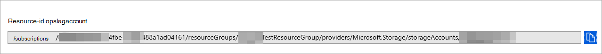

# <a name="configure-microsoft-defender-for-endpoint-to-stream-advanced-hunting-events-to-your-storage-account"></a><span data-ttu-id="ed62e-104">Microsoft Defender voor Eindpunt configureren om geavanceerde gebeurtenissen voor het zoeken naar uw Storage streamen</span><span class="sxs-lookup"><span data-stu-id="ed62e-104">Configure Microsoft Defender for Endpoint to stream Advanced Hunting events to your Storage account</span></span>

[!INCLUDE [Microsoft 365 Defender rebranding](../../includes/microsoft-defender.md)]


<span data-ttu-id="ed62e-105">**Van toepassing op:**</span><span class="sxs-lookup"><span data-stu-id="ed62e-105">**Applies to:**</span></span>
- [<span data-ttu-id="ed62e-106">Microsoft Defender voor Eindpunt</span><span class="sxs-lookup"><span data-stu-id="ed62e-106">Microsoft Defender for Endpoint</span></span>](https://go.microsoft.com/fwlink/?linkid=2154037)

> <span data-ttu-id="ed62e-107">Wilt u Defender voor Eindpunt ervaren?</span><span class="sxs-lookup"><span data-stu-id="ed62e-107">Want to experience Defender for Endpoint?</span></span> [<span data-ttu-id="ed62e-108">Meld u aan voor een gratis proefabonnement.</span><span class="sxs-lookup"><span data-stu-id="ed62e-108">Sign up for a free trial.</span></span>](https://www.microsoft.com/microsoft-365/windows/microsoft-defender-atp?ocid=docs-wdatp-configuresiem-abovefoldlink) 

## <a name="before-you-begin"></a><span data-ttu-id="ed62e-109">Voordat u begint</span><span class="sxs-lookup"><span data-stu-id="ed62e-109">Before you begin</span></span>

1. <span data-ttu-id="ed62e-110">Maak een [Storage account](/azure/storage/common/storage-account-overview) in uw tenant.</span><span class="sxs-lookup"><span data-stu-id="ed62e-110">Create a [Storage account](/azure/storage/common/storage-account-overview) in your tenant.</span></span>

2. <span data-ttu-id="ed62e-111">Meld u aan bij [uw Azure-tenant](https://ms.portal.azure.com/), ga naar Abonnementen > Uw abonnement > **Resource Providers > Registreren bij Microsoft.insights.**</span><span class="sxs-lookup"><span data-stu-id="ed62e-111">Log in to your [Azure tenant](https://ms.portal.azure.com/), go to **Subscriptions > Your subscription > Resource Providers > Register to Microsoft.insights**.</span></span>

## <a name="enable-raw-data-streaming"></a><span data-ttu-id="ed62e-112">Onbewerkte gegevensstreaming inschakelen</span><span class="sxs-lookup"><span data-stu-id="ed62e-112">Enable raw data streaming</span></span>

1. <span data-ttu-id="ed62e-113">Meld u aan bij [de Microsoft Defender for Endpoint-portal](https://securitycenter.windows.com) als een \* Globale **beheerder** _ of _\*_Beveiligingsbeheerder_\*\*.</span><span class="sxs-lookup"><span data-stu-id="ed62e-113">Log in to [Microsoft Defender for Endpoint portal](https://securitycenter.windows.com) as a ***Global Administrator** _ or _*_Security Administrator_\*\*.</span></span>

2. <span data-ttu-id="ed62e-114">Ga naar [de pagina Instellingen voor gegevensexport](https://securitycenter.windows.com/interoperability/dataexport) op Microsoft Defender-beveiligingscentrum.</span><span class="sxs-lookup"><span data-stu-id="ed62e-114">Go to [Data export settings page](https://securitycenter.windows.com/interoperability/dataexport) on Microsoft Defender Security Center.</span></span>

3. <span data-ttu-id="ed62e-115">Klik op **Instellingen voor gegevensexport toevoegen.**</span><span class="sxs-lookup"><span data-stu-id="ed62e-115">Click on **Add data export settings**.</span></span>

4. <span data-ttu-id="ed62e-116">Kies een naam voor uw nieuwe instellingen.</span><span class="sxs-lookup"><span data-stu-id="ed62e-116">Choose a name for your new settings.</span></span>

5. <span data-ttu-id="ed62e-117">Kies **Gebeurtenissen doorsturen om te Azure Storage.**</span><span class="sxs-lookup"><span data-stu-id="ed62e-117">Choose **Forward events to Azure Storage**.</span></span>

6. <span data-ttu-id="ed62e-118">Typ uw **Storage accountresource-id**.</span><span class="sxs-lookup"><span data-stu-id="ed62e-118">Type your **Storage Account Resource ID**.</span></span> <span data-ttu-id="ed62e-119">Als u uw Storage **Account Resource-id** wilt downloaden, gaat u naar de pagina met Storage-account op het tabblad Eigenschappen van [azure portal](https://ms.portal.azure.com/) > > kopieert u de tekst onder Storage **accountresource-id:**</span><span class="sxs-lookup"><span data-stu-id="ed62e-119">In order to get your **Storage Account Resource ID**, go to your Storage account page on [Azure portal](https://ms.portal.azure.com/) > properties tab > copy the text under **Storage account resource ID**:</span></span>

   

7. <span data-ttu-id="ed62e-121">Kies de gebeurtenissen die u wilt streamen en klik op **Opslaan.**</span><span class="sxs-lookup"><span data-stu-id="ed62e-121">Choose the events you want to stream and click **Save**.</span></span>

## <a name="the-schema-of-the-events-in-the-storage-account"></a><span data-ttu-id="ed62e-122">Het schema van de gebeurtenissen in het Storage account</span><span class="sxs-lookup"><span data-stu-id="ed62e-122">The schema of the events in the Storage account</span></span>

- <span data-ttu-id="ed62e-123">Er wordt een blobcontainer gemaakt voor elk gebeurtenistype:</span><span class="sxs-lookup"><span data-stu-id="ed62e-123">A blob container will be created for each event type:</span></span> 

  

- <span data-ttu-id="ed62e-125">Het schema van elke rij in een blob is het volgende JSON:</span><span class="sxs-lookup"><span data-stu-id="ed62e-125">The schema of each row in a blob is the following JSON:</span></span> 

  ```
  {
          "time": "<The time WDATP received the event>"
          "tenantId": "<Your tenant ID>"
          "category": "<The Advanced Hunting table name with 'AdvancedHunting-' prefix>"
          "properties": { <WDATP Advanced Hunting event as Json> }
  }               
  ```

- <span data-ttu-id="ed62e-126">Elke blob bevat meerdere rijen.</span><span class="sxs-lookup"><span data-stu-id="ed62e-126">Each blob contains multiple rows.</span></span>

- <span data-ttu-id="ed62e-127">Elke rij bevat de naam van de gebeurtenis, de tijd dat Defender voor Eindpunt de gebeurtenis heeft ontvangen, de tenant waar deze deel van uitmaken (u ontvangt alleen gebeurtenissen van uw tenant) en de gebeurtenis in JSON-indeling in een eigenschap genaamd 'eigenschappen'.</span><span class="sxs-lookup"><span data-stu-id="ed62e-127">Each row contains the event name, the time Defender for Endpoint received the event, the tenant it belongs (you will only get events from your tenant), and the event in JSON format in a property called "properties".</span></span>

- <span data-ttu-id="ed62e-128">Zie Geavanceerd overzicht van jagen voor meer informatie over het schema van Microsoft Defender voor [eindpuntgebeurtenissen.](advanced-hunting-overview.md)</span><span class="sxs-lookup"><span data-stu-id="ed62e-128">For more information about the schema of Microsoft Defender for Endpoint events, see [Advanced Hunting overview](advanced-hunting-overview.md).</span></span>

- <span data-ttu-id="ed62e-129">In Advanced Hunting heeft de **tabel DeviceInfo** een kolom met de naam **MachineGroep** die de groep van het apparaat bevat.</span><span class="sxs-lookup"><span data-stu-id="ed62e-129">In Advanced Hunting, the **DeviceInfo** table has a column named **MachineGroup** which contains the group of the device.</span></span> <span data-ttu-id="ed62e-130">Hier wordt elke gebeurtenis ook gedecoreerd met deze kolom.</span><span class="sxs-lookup"><span data-stu-id="ed62e-130">Here every event will be decorated with this column as well.</span></span> <span data-ttu-id="ed62e-131">Zie [Apparaatgroepen voor](machine-groups.md) meer informatie.</span><span class="sxs-lookup"><span data-stu-id="ed62e-131">See [Device Groups](machine-groups.md) for more information.</span></span>

## <a name="data-types-mapping"></a><span data-ttu-id="ed62e-132">Gegevenstypen toewijzen</span><span class="sxs-lookup"><span data-stu-id="ed62e-132">Data types mapping</span></span>

<span data-ttu-id="ed62e-133">Ga als volgt te werk om de gegevenstypen voor onze gebeurteniseigenschappen op te halen:</span><span class="sxs-lookup"><span data-stu-id="ed62e-133">In order to get the data types for our events properties do the following:</span></span>

1. <span data-ttu-id="ed62e-134">Meld u aan [bij Microsoft Defender-beveiligingscentrum](https://securitycenter.windows.com) en ga naar de pagina [Geavanceerd zoeken.](https://securitycenter.windows.com/hunting-package)</span><span class="sxs-lookup"><span data-stu-id="ed62e-134">Log in to [Microsoft Defender Security Center](https://securitycenter.windows.com) and go to [Advanced Hunting page](https://securitycenter.windows.com/hunting-package).</span></span>

2. <span data-ttu-id="ed62e-135">Voer de volgende query uit om de gegevenstypentoewijzing voor elke gebeurtenis te krijgen:</span><span class="sxs-lookup"><span data-stu-id="ed62e-135">Run the following query to get the data types mapping for each event:</span></span> 

   ```
   {EventType}
   | getschema
   | project ColumnName, ColumnType 
   ```

- <span data-ttu-id="ed62e-136">Hier volgt een voorbeeld voor apparaatgegevensgebeurtenis:</span><span class="sxs-lookup"><span data-stu-id="ed62e-136">Here is an example for Device Info event:</span></span> 

  

## <a name="related-topics"></a><span data-ttu-id="ed62e-138">Verwante onderwerpen</span><span class="sxs-lookup"><span data-stu-id="ed62e-138">Related topics</span></span>
- [<span data-ttu-id="ed62e-139">Overzicht van geavanceerd jagen</span><span class="sxs-lookup"><span data-stu-id="ed62e-139">Overview of Advanced Hunting</span></span>](advanced-hunting-overview.md)
- [<span data-ttu-id="ed62e-140">Microsoft Defender voor Endpoint Streaming API</span><span class="sxs-lookup"><span data-stu-id="ed62e-140">Microsoft Defender for Endpoint Streaming API</span></span>](raw-data-export.md)
- [<span data-ttu-id="ed62e-141">Microsoft Defender voor eindpuntgebeurtenissen streamen naar uw Azure-opslagaccount</span><span class="sxs-lookup"><span data-stu-id="ed62e-141">Stream Microsoft Defender for Endpoint events to your Azure storage account</span></span>](raw-data-export-storage.md)
- [<span data-ttu-id="ed62e-142">Azure Storage Accountdocumentatie</span><span class="sxs-lookup"><span data-stu-id="ed62e-142">Azure Storage Account documentation</span></span>](/azure/storage/common/storage-account-overview)