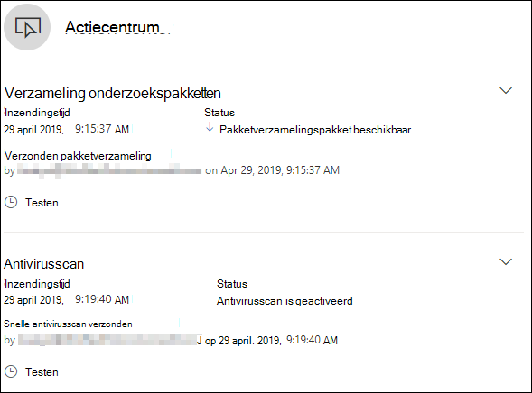

# <a name="take-response-actions-on-a-file"></a><span data-ttu-id="64209-104">Acties ondernemen op een bestand</span><span class="sxs-lookup"><span data-stu-id="64209-104">Take response actions on a file</span></span>

[!INCLUDE [Microsoft 365 Defender rebranding](../../includes/microsoft-defender.md)]


<span data-ttu-id="64209-105">**Van toepassing op:**</span><span class="sxs-lookup"><span data-stu-id="64209-105">**Applies to:**</span></span>
- [<span data-ttu-id="64209-106">Microsoft Defender voor Eindpunt</span><span class="sxs-lookup"><span data-stu-id="64209-106">Microsoft Defender for Endpoint</span></span>](https://go.microsoft.com/fwlink/?linkid=2154037)

[!include[Prerelease information](../../includes/prerelease.md)]

> <span data-ttu-id="64209-107">Wilt u Defender voor Eindpunt ervaren?</span><span class="sxs-lookup"><span data-stu-id="64209-107">Want to experience Defender for Endpoint?</span></span> [<span data-ttu-id="64209-108">Meld u aan voor een gratis proefabonnement.</span><span class="sxs-lookup"><span data-stu-id="64209-108">Sign up for a free trial.</span></span>](https://www.microsoft.com/microsoft-365/windows/microsoft-defender-atp?ocid=docs-wdatp-responddile-abovefoldlink)

<span data-ttu-id="64209-109">Reageer snel op gedetecteerde aanvallen door bestanden te stoppen en te kwaalen of een bestand te blokkeren.</span><span class="sxs-lookup"><span data-stu-id="64209-109">Quickly respond to detected attacks by stopping and quarantining files or blocking a file.</span></span> <span data-ttu-id="64209-110">Nadat u actie hebt ondernomen voor bestanden, kunt u activiteitsgegevens controleren in het Actiecentrum.</span><span class="sxs-lookup"><span data-stu-id="64209-110">After taking action on files, you can check on activity details in the Action center.</span></span>

<span data-ttu-id="64209-111">Reactieacties zijn beschikbaar op de gedetailleerde profielpagina van een bestand.</span><span class="sxs-lookup"><span data-stu-id="64209-111">Response actions are available on a file's detailed profile page.</span></span> <span data-ttu-id="64209-112">Eenmaal op deze pagina kunt u schakelen tussen de nieuwe en oude pagina-indelingen door de nieuwe **pagina Bestand te wijzigen.**</span><span class="sxs-lookup"><span data-stu-id="64209-112">Once on this page, you can switch between the new and old page layouts by toggling **new File page**.</span></span> <span data-ttu-id="64209-113">In de rest van dit artikel wordt de nieuwere pagina-indeling beschreven.</span><span class="sxs-lookup"><span data-stu-id="64209-113">The rest of this article describes the newer page layout.</span></span>

<span data-ttu-id="64209-114">Antwoordacties worden uitgevoerd boven aan de bestandspagina en bevatten:</span><span class="sxs-lookup"><span data-stu-id="64209-114">Response actions run along the top of the file page, and include:</span></span>

- <span data-ttu-id="64209-115">Bestand stoppen en in quarantaine plaatsen</span><span class="sxs-lookup"><span data-stu-id="64209-115">Stop and Quarantine File</span></span>
- <span data-ttu-id="64209-116">Indicator toevoegen</span><span class="sxs-lookup"><span data-stu-id="64209-116">Add Indicator</span></span>
- <span data-ttu-id="64209-117">Downloadbestand</span><span class="sxs-lookup"><span data-stu-id="64209-117">Download file</span></span>
- <span data-ttu-id="64209-118">Contact opnemen met een risicodeskundige</span><span class="sxs-lookup"><span data-stu-id="64209-118">Consult a threat expert</span></span>
- <span data-ttu-id="64209-119">Actiecentrum</span><span class="sxs-lookup"><span data-stu-id="64209-119">Action center</span></span>

<span data-ttu-id="64209-120">U kunt ook bestanden indienen voor uitgebreide analyse, om het bestand uit te voeren in een beveiligde cloudsandbox.</span><span class="sxs-lookup"><span data-stu-id="64209-120">You can also submit files for deep analysis, to run the file in a secure cloud sandbox.</span></span> <span data-ttu-id="64209-121">Wanneer de analyse is voltooid, krijgt u een gedetailleerd rapport met informatie over het gedrag van het bestand.</span><span class="sxs-lookup"><span data-stu-id="64209-121">When the analysis is complete, you'll get a detailed report that provides information about the behavior of the file.</span></span> <span data-ttu-id="64209-122">U kunt bestanden indienen voor uitgebreide analyse en eerdere rapporten lezen door het **tabblad Diepe analyse te** selecteren. Deze bevindt zich onder de bestandsgegevenskaarten.</span><span class="sxs-lookup"><span data-stu-id="64209-122">You can submit files for deep analysis and read past reports by selecting the **Deep analysis** tab. It's located below the file information cards.</span></span>

<span data-ttu-id="64209-123">Voor sommige acties zijn bepaalde machtigingen vereist.</span><span class="sxs-lookup"><span data-stu-id="64209-123">Some actions require certain permissions.</span></span> <span data-ttu-id="64209-124">In de volgende tabel wordt beschreven welke actie bepaalde machtigingen kunnen ondernemen voor draagbare uitvoerbare (PE) en niet-PE-bestanden:</span><span class="sxs-lookup"><span data-stu-id="64209-124">The following table describes what action certain permissions can take on portable executable (PE) and non-PE files:</span></span>

| <span data-ttu-id="64209-125">Machtiging</span><span class="sxs-lookup"><span data-stu-id="64209-125">Permission</span></span>             | <span data-ttu-id="64209-126">PE-bestanden</span><span class="sxs-lookup"><span data-stu-id="64209-126">PE files</span></span> | <span data-ttu-id="64209-127">Niet-PE-bestanden</span><span class="sxs-lookup"><span data-stu-id="64209-127">Non-PE files</span></span> |
| :--------------------- | :------: | :----------: |
| <span data-ttu-id="64209-128">Gegevens weergeven</span><span class="sxs-lookup"><span data-stu-id="64209-128">View data</span></span>              |     <span data-ttu-id="64209-129">X</span><span class="sxs-lookup"><span data-stu-id="64209-129">X</span></span>    |       <span data-ttu-id="64209-130">X</span><span class="sxs-lookup"><span data-stu-id="64209-130">X</span></span>      |
| <span data-ttu-id="64209-131">Onderzoek naar waarschuwingen</span><span class="sxs-lookup"><span data-stu-id="64209-131">Alerts investigation</span></span>   | <span data-ttu-id="64209-132">&#x2611;</span><span class="sxs-lookup"><span data-stu-id="64209-132">&#x2611;</span></span> |       <span data-ttu-id="64209-133">X</span><span class="sxs-lookup"><span data-stu-id="64209-133">X</span></span>      |
| <span data-ttu-id="64209-134">Live response basic</span><span class="sxs-lookup"><span data-stu-id="64209-134">Live response basic</span></span>    |     <span data-ttu-id="64209-135">X</span><span class="sxs-lookup"><span data-stu-id="64209-135">X</span></span>    |       <span data-ttu-id="64209-136">X</span><span class="sxs-lookup"><span data-stu-id="64209-136">X</span></span>      |
| <span data-ttu-id="64209-137">Live response advanced</span><span class="sxs-lookup"><span data-stu-id="64209-137">Live response advanced</span></span> | <span data-ttu-id="64209-138">&#x2611;</span><span class="sxs-lookup"><span data-stu-id="64209-138">&#x2611;</span></span> |   <span data-ttu-id="64209-139">&#x2611;</span><span class="sxs-lookup"><span data-stu-id="64209-139">&#x2611;</span></span>   |

<span data-ttu-id="64209-140">Zie Rollen maken en beheren voor toegangsbeheer op basis van rollen voor meer informatie over [rollen.](user-roles.md)</span><span class="sxs-lookup"><span data-stu-id="64209-140">For more information on roles, see [Create and manage roles for role-based access control](user-roles.md).</span></span>

## <a name="stop-and-quarantine-files-in-your-network"></a><span data-ttu-id="64209-141">Bestanden in uw netwerk stoppen en in quarantaine plaatsen</span><span class="sxs-lookup"><span data-stu-id="64209-141">Stop and quarantine files in your network</span></span>

<span data-ttu-id="64209-142">U kunt een aanval in uw organisatie bevatten door het schadelijke proces te stoppen en het bestand te kwaalen waar het is waargenomen.</span><span class="sxs-lookup"><span data-stu-id="64209-142">You can contain an attack in your organization by stopping the malicious process and quarantining the file where it was observed.</span></span>

> [!IMPORTANT]
> <span data-ttu-id="64209-143">U kunt deze actie alleen ondernemen als:</span><span class="sxs-lookup"><span data-stu-id="64209-143">You can only take this action if:</span></span>
>
> - <span data-ttu-id="64209-144">Het apparaat waar u de actie op onderneemt, wordt uitgevoerd Windows 10 versie 1703 of hoger</span><span class="sxs-lookup"><span data-stu-id="64209-144">The device you're taking the action on is running Windows 10, version 1703 or later</span></span>
> - <span data-ttu-id="64209-145">Het bestand is niet eigendom van vertrouwde uitgevers van derden of is niet ondertekend door Microsoft</span><span class="sxs-lookup"><span data-stu-id="64209-145">The file does not belong to trusted third-party publishers or is not signed by Microsoft</span></span>
> - <span data-ttu-id="64209-146">Microsoft Defender Antivirus moet ten minste actief zijn in de passieve modus.</span><span class="sxs-lookup"><span data-stu-id="64209-146">Microsoft Defender Antivirus must at least be running on Passive mode.</span></span> <span data-ttu-id="64209-147">Zie Microsoft Defender Antivirus [compatibiliteit voor meer informatie.](/windows/security/threat-protection/microsoft-defender-antivirus/microsoft-defender-antivirus-compatibility)</span><span class="sxs-lookup"><span data-stu-id="64209-147">For more information, see [Microsoft Defender Antivirus compatibility](/windows/security/threat-protection/microsoft-defender-antivirus/microsoft-defender-antivirus-compatibility).</span></span>

<span data-ttu-id="64209-148">De **actie Bestand stoppen en quarantaine** omvat het stoppen van lopende processen, het quarantineren van de bestanden en het verwijderen van permanente gegevens, zoals registersleutels.</span><span class="sxs-lookup"><span data-stu-id="64209-148">The **Stop and Quarantine File** action includes stopping running processes, quarantining the files, and deleting persistent data such as registry keys.</span></span>

<span data-ttu-id="64209-149">Deze actie wordt van kracht op apparaten Windows 10, versie 1703 of hoger, waar het bestand de afgelopen 30 dagen is waargenomen.</span><span class="sxs-lookup"><span data-stu-id="64209-149">This action takes effect on devices with Windows 10, version 1703 or later, where the file was observed in the last 30 days.</span></span>

> [!NOTE]
> <span data-ttu-id="64209-150">U kunt het bestand op elk moment vanuit quarantaine herstellen.</span><span class="sxs-lookup"><span data-stu-id="64209-150">You’ll be able to restore the file from quarantine at any time.</span></span>

### <a name="stop-and-quarantine-files"></a><span data-ttu-id="64209-151">Bestanden stoppen en in quarantaine plaatsen</span><span class="sxs-lookup"><span data-stu-id="64209-151">Stop and quarantine files</span></span>

1. <span data-ttu-id="64209-152">Selecteer het bestand dat u wilt stoppen en in quarantaine plaatsen.</span><span class="sxs-lookup"><span data-stu-id="64209-152">Select the file you want to stop and quarantine.</span></span> <span data-ttu-id="64209-153">U kunt een bestand selecteren in een van de volgende weergaven of het vak Zoeken gebruiken:</span><span class="sxs-lookup"><span data-stu-id="64209-153">You can select a file from any of the following views or use the Search box:</span></span>

   - <span data-ttu-id="64209-154">**Waarschuwingen:** klik op de bijbehorende koppelingen van de beschrijving of details in de tijdlijn Waarschuwingsverhaal</span><span class="sxs-lookup"><span data-stu-id="64209-154">**Alerts** - click the corresponding links from the Description or Details in the Alert Story timeline</span></span>
   - <span data-ttu-id="64209-155">**Zoekvak:** selecteer **Bestand** in de vervolgkeuzelijst en voer de bestandsnaam in</span><span class="sxs-lookup"><span data-stu-id="64209-155">**Search box** - select **File** from the drop–down menu and enter the file name</span></span>

   > [!NOTE]
   > <span data-ttu-id="64209-156">De actie stop- en quarantainebestand is beperkt tot maximaal 1000 apparaten.</span><span class="sxs-lookup"><span data-stu-id="64209-156">The stop and quarantine file action is limited to a maximum of 1000 devices.</span></span> <span data-ttu-id="64209-157">Zie Indicator toevoegen om bestand te blokkeren of toe te staan als u een bestand op een groter aantal apparaten [wilt stoppen.](#add-indicator-to-block-or-allow-a-file)</span><span class="sxs-lookup"><span data-stu-id="64209-157">To stop a file on a larger number of devices, see [Add indicator to block or allow file](#add-indicator-to-block-or-allow-a-file).</span></span>

2. <span data-ttu-id="64209-158">Ga naar de bovenste balk en selecteer **Bestand stoppen en quarantaine**.</span><span class="sxs-lookup"><span data-stu-id="64209-158">Go to the top bar and select **Stop and Quarantine File**.</span></span>

   

3. <span data-ttu-id="64209-160">Geef een reden op en selecteer **vervolgens Bevestigen**.</span><span class="sxs-lookup"><span data-stu-id="64209-160">Specify a reason, then select **Confirm**.</span></span>

   

   <span data-ttu-id="64209-162">Het actiecentrum toont de inzendingsgegevens:</span><span class="sxs-lookup"><span data-stu-id="64209-162">The Action center shows the submission information:</span></span>
   
   

   - <span data-ttu-id="64209-164">**Inzendingstijd:** geeft aan wanneer de actie is verzonden.</span><span class="sxs-lookup"><span data-stu-id="64209-164">**Submission time** - Shows when the action was submitted.</span></span>
   - <span data-ttu-id="64209-165">**Succes:** geeft het aantal apparaten weer waarop het bestand is gestopt en in quarantaine is geplaatst.</span><span class="sxs-lookup"><span data-stu-id="64209-165">**Success** - Shows the number of devices where the file has been stopped and quarantined.</span></span>
   - <span data-ttu-id="64209-166">**Mislukt:** geeft het aantal apparaten weer waarop de actie is mislukt en details over de fout.</span><span class="sxs-lookup"><span data-stu-id="64209-166">**Failed** - Shows the number of devices where the action failed and details about the failure.</span></span>
   - <span data-ttu-id="64209-167">**In** behandeling: toont het aantal apparaten waar het bestand nog moet worden gestopt en in quarantaine moet worden geplaatst.</span><span class="sxs-lookup"><span data-stu-id="64209-167">**Pending** - Shows the number of devices where the file is yet to be stopped and quarantined from.</span></span> <span data-ttu-id="64209-168">Dit kan tijd duren voor gevallen waarin het apparaat offline is of niet is verbonden met het netwerk.</span><span class="sxs-lookup"><span data-stu-id="64209-168">This can take time for cases when the device is offline or not connected to the network.</span></span>

4. <span data-ttu-id="64209-169">Selecteer een van de statusindicatoren om meer informatie over de actie weer te geven.</span><span class="sxs-lookup"><span data-stu-id="64209-169">Select any of the status indicators to view more information about the action.</span></span> <span data-ttu-id="64209-170">Selecteer bijvoorbeeld Mislukt **om te** zien waar de actie is mislukt.</span><span class="sxs-lookup"><span data-stu-id="64209-170">For example, select **Failed** to see where the action failed.</span></span>

<span data-ttu-id="64209-171">**Melding op apparaatgebruiker:**</span><span class="sxs-lookup"><span data-stu-id="64209-171">**Notification on device user**:</span></span></br>
<span data-ttu-id="64209-172">Wanneer het bestand van een apparaat wordt verwijderd, wordt de volgende melding weergegeven:</span><span class="sxs-lookup"><span data-stu-id="64209-172">When the file is being removed from a device, the following notification is shown:</span></span>


<span data-ttu-id="64209-174">In de apparaattijdlijn wordt een nieuwe gebeurtenis toegevoegd voor elk apparaat waarop een bestand is gestopt en in quarantaine is geplaatst.</span><span class="sxs-lookup"><span data-stu-id="64209-174">In the device timeline, a new event is added for each device where a file was stopped and quarantined.</span></span>

<span data-ttu-id="64209-175">Er wordt een waarschuwing weergegeven voordat de actie wordt geïmplementeerd voor bestanden die op grote schaal in een organisatie worden gebruikt.</span><span class="sxs-lookup"><span data-stu-id="64209-175">A warning is shown before the action is implemented for files widely used throughout an organization.</span></span> <span data-ttu-id="64209-176">Het is om te valideren dat de bewerking is bedoeld.</span><span class="sxs-lookup"><span data-stu-id="64209-176">It's to validate that the operation is intended.</span></span>

## <a name="restore-file-from-quarantine"></a><span data-ttu-id="64209-177">Bestand in quarantaine herstellen</span><span class="sxs-lookup"><span data-stu-id="64209-177">Restore file from quarantine</span></span>

<span data-ttu-id="64209-178">U kunt een bestand terugdraaien en verwijderen uit quarantaine als u na een onderzoek hebt vastgesteld dat het bestand schoon is.</span><span class="sxs-lookup"><span data-stu-id="64209-178">You can roll back and remove a file from quarantine if you’ve determined that it’s clean after an investigation.</span></span> <span data-ttu-id="64209-179">Voer de volgende opdracht uit op elk apparaat waarop het bestand in quarantaine is geplaatst.</span><span class="sxs-lookup"><span data-stu-id="64209-179">Run the following command on each device where the file was quarantined.</span></span>

1. <span data-ttu-id="64209-180">Open een opdrachtregelprompt met verhoogde opdracht op het apparaat:</span><span class="sxs-lookup"><span data-stu-id="64209-180">Open an elevated command–line prompt on the device:</span></span>

   1. <span data-ttu-id="64209-181">Go to **Start** and type _cmd_.</span><span class="sxs-lookup"><span data-stu-id="64209-181">Go to **Start** and type _cmd_.</span></span>

   1. <span data-ttu-id="64209-182">Klik met de rechtermuisknop **op Opdrachtprompt** en selecteer **Uitvoeren als beheerder.**</span><span class="sxs-lookup"><span data-stu-id="64209-182">Right–click **Command prompt** and select **Run as administrator**.</span></span>

2. <span data-ttu-id="64209-183">Voer de volgende opdracht in en druk op **Enter:**</span><span class="sxs-lookup"><span data-stu-id="64209-183">Enter the following command, and press **Enter**:</span></span>

   ```console
   “%ProgramFiles%\Windows Defender\MpCmdRun.exe” –Restore –Name EUS:Win32/CustomEnterpriseBlock –All
   ```

   > [!NOTE]
   > <span data-ttu-id="64209-184">In sommige scenario's kan **threatname** worden weergegeven als: EUS:Win32/CustomEnterpriseBlock!cl.</span><span class="sxs-lookup"><span data-stu-id="64209-184">In some scenarios, the **ThreatName** may appear as: EUS:Win32/CustomEnterpriseBlock!cl.</span></span>
   >
   > <span data-ttu-id="64209-185">Defender voor Eindpunt herstelt alle aangepaste geblokkeerde bestanden die in quarantaine zijn geplaatst op dit apparaat in de afgelopen 30 dagen.</span><span class="sxs-lookup"><span data-stu-id="64209-185">Defender for Endpoint will restore all custom blocked files that were quarantined on this device in the last 30 days.</span></span>

> [!IMPORTANT]
> <span data-ttu-id="64209-186">Een bestand dat in quarantaine is geplaatst als een potentiële netwerkdreiging, kan mogelijk niet worden hersteld.</span><span class="sxs-lookup"><span data-stu-id="64209-186">A file that was quarantined as a potential network threat might not be recoverable.</span></span> <span data-ttu-id="64209-187">Als een gebruiker het bestand na quarantaine probeert te herstellen, is dat bestand mogelijk niet toegankelijk.</span><span class="sxs-lookup"><span data-stu-id="64209-187">If a user attempts to restore the file after quarantine, that file might not be accessible.</span></span> <span data-ttu-id="64209-188">Dit kan worden veroorzaakt doordat het systeem geen netwerkreferenties meer heeft om toegang te krijgen tot het bestand.</span><span class="sxs-lookup"><span data-stu-id="64209-188">This can be due to the system no longer having network credentials to access the file.</span></span> <span data-ttu-id="64209-189">Dit is meestal het gevolg van een tijdelijk aanmelden bij een systeem of gedeelde map en de toegangstokens zijn verlopen.</span><span class="sxs-lookup"><span data-stu-id="64209-189">Typically, this is a result of a temporary log on to a system or shared folder and the access tokens expired.</span></span>

## <a name="download-or-collect-file"></a><span data-ttu-id="64209-190">Bestand downloaden of verzamelen</span><span class="sxs-lookup"><span data-stu-id="64209-190">Download or collect file</span></span>

<span data-ttu-id="64209-191">Als **u Bestand downloaden** selecteert in de antwoordacties, kunt u een lokaal, met een wachtwoord beveiligd archief .zip met uw bestand downloaden.</span><span class="sxs-lookup"><span data-stu-id="64209-191">Selecting **Download file** from the response actions allows you to download a local, password-protected .zip archive containing your file.</span></span> <span data-ttu-id="64209-192">Er wordt een flyout weergegeven waarin u een reden voor het downloaden van het bestand kunt opnemen en een wachtwoord kunt instellen.</span><span class="sxs-lookup"><span data-stu-id="64209-192">A flyout will appear where you can record a reason for downloading the file, and set a password.</span></span>

<span data-ttu-id="64209-193">Standaard kunt u geen bestanden downloaden die in quarantaine staan.</span><span class="sxs-lookup"><span data-stu-id="64209-193">By default, you will not be able to download files that are in quarantine.</span></span>


### <a name="collect-files"></a><span data-ttu-id="64209-195">Bestanden verzamelen</span><span class="sxs-lookup"><span data-stu-id="64209-195">Collect files</span></span>

<span data-ttu-id="64209-196">Als een bestand nog niet is opgeslagen door Microsoft Defender voor Eindpunt, kunt u het niet downloaden.</span><span class="sxs-lookup"><span data-stu-id="64209-196">If a file is not already stored by Microsoft Defender for Endpoint, you can't download it.</span></span> <span data-ttu-id="64209-197">In plaats daarvan ziet u een knop **Bestand verzamelen** op dezelfde locatie.</span><span class="sxs-lookup"><span data-stu-id="64209-197">Instead, you'll see a **Collect file** button in the same location.</span></span> <span data-ttu-id="64209-198">Als een bestand de afgelopen 30 dagen niet is gezien in de **organisatie,** wordt Bestand verzamelen uitgeschakeld.</span><span class="sxs-lookup"><span data-stu-id="64209-198">If a file hasn't been seen in the organization in the past 30 days, **Collect file** will be disabled.</span></span>
> [!Important]
> <span data-ttu-id="64209-199">Een bestand dat in quarantaine is geplaatst als een potentiële netwerkdreiging, kan mogelijk niet worden hersteld.</span><span class="sxs-lookup"><span data-stu-id="64209-199">A file that was quarantined as a potential network threat might not be recoverable.</span></span> <span data-ttu-id="64209-200">Als een gebruiker het bestand na quarantaine probeert te herstellen, is dat bestand mogelijk niet toegankelijk.</span><span class="sxs-lookup"><span data-stu-id="64209-200">If a user attempts to restore the file after quarantine, that file might not be accessible.</span></span> <span data-ttu-id="64209-201">Dit kan worden veroorzaakt doordat het systeem geen netwerkreferenties meer heeft om toegang te krijgen tot het bestand.</span><span class="sxs-lookup"><span data-stu-id="64209-201">This can be due to the system no longer having network credentials to access the file.</span></span> <span data-ttu-id="64209-202">Dit is meestal het gevolg van een tijdelijk aanmelden bij een systeem of gedeelde map en de toegangstokens zijn verlopen.</span><span class="sxs-lookup"><span data-stu-id="64209-202">Typically, this is a result of a temporary log on to a system or shared folder and the access tokens expired.</span></span>

## <a name="add-indicator-to-block-or-allow-a-file"></a><span data-ttu-id="64209-203">Indicator toevoegen om een bestand te blokkeren of toe te staan</span><span class="sxs-lookup"><span data-stu-id="64209-203">Add indicator to block or allow a file</span></span>

<span data-ttu-id="64209-204">Voorkom verdere verspreiding van een aanval in uw organisatie door potentieel schadelijke bestanden of vermoedelijke malware te verbieden.</span><span class="sxs-lookup"><span data-stu-id="64209-204">Prevent further propagation of an attack in your organization by banning potentially malicious files or suspected malware.</span></span> <span data-ttu-id="64209-205">Als u een potentieel schadelijk bestand voor draagbaar uitvoerbaar (PE) kent, kunt u dit blokkeren.</span><span class="sxs-lookup"><span data-stu-id="64209-205">If you know a potentially malicious portable executable (PE) file, you can block it.</span></span> <span data-ttu-id="64209-206">Deze bewerking voorkomt dat deze wordt gelezen, geschreven of uitgevoerd op apparaten in uw organisatie.</span><span class="sxs-lookup"><span data-stu-id="64209-206">This operation will prevent it from being read, written, or executed on devices in your organization.</span></span>

> [!IMPORTANT]
>
> - <span data-ttu-id="64209-207">Deze functie is beschikbaar als uw organisatie gebruikmaakt van Microsoft Defender Antivirus cloudbeveiliging is ingeschakeld.</span><span class="sxs-lookup"><span data-stu-id="64209-207">This feature is available if your organization uses Microsoft Defender Antivirus and Cloud–delivered protection is enabled.</span></span> <span data-ttu-id="64209-208">Zie Beveiliging in de cloud beheren [voor meer informatie.](/windows/security/threat-protection/microsoft-defender-antivirus/deploy-manage-report-microsoft-defender-antivirus)</span><span class="sxs-lookup"><span data-stu-id="64209-208">For more information, see [Manage cloud–delivered protection](/windows/security/threat-protection/microsoft-defender-antivirus/deploy-manage-report-microsoft-defender-antivirus).</span></span>
>
> - <span data-ttu-id="64209-209">De versie van de Antimalware-client moet 4.18.1901.x of hoger zijn.</span><span class="sxs-lookup"><span data-stu-id="64209-209">The Antimalware client version must be 4.18.1901.x or later.</span></span>
> - <span data-ttu-id="64209-210">Deze functie is ontworpen om te voorkomen dat verdachte malware (of mogelijk schadelijke bestanden) van internet wordt gedownload.</span><span class="sxs-lookup"><span data-stu-id="64209-210">This feature is designed to prevent suspected malware (or potentially malicious files) from being downloaded from the web.</span></span> <span data-ttu-id="64209-211">Het ondersteunt momenteel draagbare uitvoerbare (PE)-bestanden, _.exe_ en _.dll_ bestanden.</span><span class="sxs-lookup"><span data-stu-id="64209-211">It currently supports portable executable (PE) files, including _.exe_ and _.dll_ files.</span></span> <span data-ttu-id="64209-212">De dekking wordt in de tijd uitgebreid.</span><span class="sxs-lookup"><span data-stu-id="64209-212">The coverage will be extended over time.</span></span>
> - <span data-ttu-id="64209-213">Deze reactieactie is beschikbaar voor apparaten Windows 10, versie 1703 of hoger.</span><span class="sxs-lookup"><span data-stu-id="64209-213">This response action is available for devices on Windows 10, version 1703 or later.</span></span>
> - <span data-ttu-id="64209-214">De functie Toestaan of blokkeren kan niet worden uitgevoerd op bestanden als de classificatie van het bestand aanwezig is in de cache van het apparaat vóór de actie toestaan of blokkeren.</span><span class="sxs-lookup"><span data-stu-id="64209-214">The allow or block function cannot be done on files if the file's classification exists on the device's cache prior to the allow or block action.</span></span>

> [!NOTE]
> <span data-ttu-id="64209-215">Het PE-bestand moet zich in de tijdlijn van het apparaat plaatsen om deze actie te kunnen ondernemen.</span><span class="sxs-lookup"><span data-stu-id="64209-215">The PE file needs to be in the device timeline for you to be able to take this action.</span></span>
>
> <span data-ttu-id="64209-216">Er kan een paar minuten latentie zijn tussen het moment dat de actie wordt ondernomen en het werkelijke bestand dat wordt geblokkeerd.</span><span class="sxs-lookup"><span data-stu-id="64209-216">There may be a couple of minutes of latency between the time the action is taken and the actual file being blocked.</span></span>

### <a name="enable-the-block-file-feature"></a><span data-ttu-id="64209-217">De functie Blokbestand inschakelen</span><span class="sxs-lookup"><span data-stu-id="64209-217">Enable the block file feature</span></span>

<span data-ttu-id="64209-218">Als u bestanden wilt blokkeren, moet u eerst [de  ](advanced-features.md) functie Blokkeren of toestaan in Instellingen.</span><span class="sxs-lookup"><span data-stu-id="64209-218">To start blocking files, you first need to [turn the **Block or allow** feature on](advanced-features.md) in Settings.</span></span>
### <a name="allow-or-block-file"></a><span data-ttu-id="64209-219">Bestand toestaan of blokkeren</span><span class="sxs-lookup"><span data-stu-id="64209-219">Allow or block file</span></span>

<span data-ttu-id="64209-220">Wanneer u een indicatorhash voor een bestand toevoegt, kunt u ervoor kiezen om een waarschuwing te verhogen en het bestand te blokkeren wanneer een apparaat in uw organisatie dit probeert uit te voeren.</span><span class="sxs-lookup"><span data-stu-id="64209-220">When you add an indicator hash for a file, you can choose to raise an alert and block the file whenever a device in your organization attempts to run it.</span></span>

<span data-ttu-id="64209-221">Bestanden die automatisch worden geblokkeerd door een indicator, worden niet weergegeven in het actiecentrum van het bestand, maar de waarschuwingen blijven wel zichtbaar in de wachtrij Waarschuwingen.</span><span class="sxs-lookup"><span data-stu-id="64209-221">Files automatically blocked by an indicator won't show up in the file's Action center, but the alerts will still be visible in the Alerts queue.</span></span>

<span data-ttu-id="64209-222">Zie [Indicatoren beheren voor](manage-indicators.md) meer informatie over het blokkeren en verhogen van waarschuwingen voor bestanden.</span><span class="sxs-lookup"><span data-stu-id="64209-222">See [manage indicators](manage-indicators.md) for more details on blocking and raising alerts on files.</span></span>

<span data-ttu-id="64209-223">Als u het blokkeren van een bestand wilt stoppen, verwijdert u de indicator.</span><span class="sxs-lookup"><span data-stu-id="64209-223">To stop blocking a file, remove the indicator.</span></span> <span data-ttu-id="64209-224">U kunt dit doen via de **actie Indicator bewerken** op de profielpagina van het bestand.</span><span class="sxs-lookup"><span data-stu-id="64209-224">You can do so via the **Edit Indicator** action on the file's profile page.</span></span> <span data-ttu-id="64209-225">Deze actie is zichtbaar op dezelfde positie als de actie **Indicator** toevoegen, voordat u de indicator toevoegt.</span><span class="sxs-lookup"><span data-stu-id="64209-225">This action will be visible in the same position as the **Add Indicator** action, before you added the indicator.</span></span>

<span data-ttu-id="64209-226">U kunt ook indicatoren bewerken vanaf de **Instellingen** pagina onder   >  **Regelsindicatoren.**</span><span class="sxs-lookup"><span data-stu-id="64209-226">You can also edit indicators from  the **Settings** page, under **Rules** > **Indicators**.</span></span> <span data-ttu-id="64209-227">Indicatoren worden in dit gebied weergegeven door de hash van het bestand.</span><span class="sxs-lookup"><span data-stu-id="64209-227">Indicators are listed in this area by their file's hash.</span></span>

## <a name="consult-a-threat-expert"></a><span data-ttu-id="64209-228">Contact opnemen met een risicodeskundige</span><span class="sxs-lookup"><span data-stu-id="64209-228">Consult a threat expert</span></span>

<span data-ttu-id="64209-229">Raadpleeg een Bedreigingsexpert van Microsoft voor meer informatie over een mogelijk gecompromitteerd apparaat of al gecompromitteerde apparaten.</span><span class="sxs-lookup"><span data-stu-id="64209-229">Consult a Microsoft threat expert for more insights on a potentially compromised device, or already compromised devices.</span></span> <span data-ttu-id="64209-230">Microsoft Threat Experts rechtstreeks vanuit de Microsoft Defender-beveiligingscentrum voor een tijdige en nauwkeurige reactie.</span><span class="sxs-lookup"><span data-stu-id="64209-230">Microsoft Threat Experts are engaged directly from within the Microsoft Defender Security Center for timely and accurate response.</span></span> <span data-ttu-id="64209-231">Experts bieden inzichten over een mogelijk gecompromitteerd apparaat en helpen u inzicht te krijgen in complexe bedreigingen en gerichte aanvalsmeldingen.</span><span class="sxs-lookup"><span data-stu-id="64209-231">Experts provide insights on a potentially compromised device and help you understand complex threats and targeted attack notifications.</span></span> <span data-ttu-id="64209-232">Ze kunnen ook informatie verstrekken over de waarschuwingen of een context met bedreigingsinformatie die u op uw portaldashboard ziet.</span><span class="sxs-lookup"><span data-stu-id="64209-232">They can also provide information about the alerts or a threat intelligence context that you see on your portal dashboard.</span></span>

<span data-ttu-id="64209-233">Zie [Een Microsoft Threat Expert raadplegen](/microsoft-365/security/defender-endpoint/configure-microsoft-threat-experts#consult-a-microsoft-threat-expert-about-suspicious-cybersecurity-activities-in-your-organization) voor meer informatie.</span><span class="sxs-lookup"><span data-stu-id="64209-233">See [Consult a Microsoft Threat Expert](/microsoft-365/security/defender-endpoint/configure-microsoft-threat-experts#consult-a-microsoft-threat-expert-about-suspicious-cybersecurity-activities-in-your-organization) for details.</span></span>

## <a name="check-activity-details-in-action-center"></a><span data-ttu-id="64209-234">Activiteitsdetails controleren in Actiecentrum</span><span class="sxs-lookup"><span data-stu-id="64209-234">Check activity details in Action center</span></span>

<span data-ttu-id="64209-235">Het **Actiecentrum** bevat informatie over acties die zijn ondernomen op een apparaat of bestand.</span><span class="sxs-lookup"><span data-stu-id="64209-235">The **Action center** provides information on actions that were taken on a device or file.</span></span> <span data-ttu-id="64209-236">U kunt de volgende details bekijken:</span><span class="sxs-lookup"><span data-stu-id="64209-236">You can view the following details:</span></span>

- <span data-ttu-id="64209-237">Verzameling onderzoekspakketten</span><span class="sxs-lookup"><span data-stu-id="64209-237">Investigation package collection</span></span>
- <span data-ttu-id="64209-238">Antivirusscan</span><span class="sxs-lookup"><span data-stu-id="64209-238">Antivirus scan</span></span>
- <span data-ttu-id="64209-239">App-beperking</span><span class="sxs-lookup"><span data-stu-id="64209-239">App restriction</span></span>
- <span data-ttu-id="64209-240">Apparaatisolatie</span><span class="sxs-lookup"><span data-stu-id="64209-240">Device isolation</span></span>

<span data-ttu-id="64209-241">Alle andere gerelateerde details worden ook weergegeven, zoals inzendingsdatum/-tijd, het indienen van gebruiker en of de actie is geslaagd of mislukt.</span><span class="sxs-lookup"><span data-stu-id="64209-241">All other related details are also shown, such as submission date/time, submitting user, and if the action succeeded or failed.</span></span>



## <a name="deep-analysis"></a><span data-ttu-id="64209-243">Uitgebreide analyse</span><span class="sxs-lookup"><span data-stu-id="64209-243">Deep analysis</span></span>

<span data-ttu-id="64209-244">Cyberbeveiligingsonderzoeken worden meestal geactiveerd door een waarschuwing.</span><span class="sxs-lookup"><span data-stu-id="64209-244">Cyber security investigations are typically triggered by an alert.</span></span> <span data-ttu-id="64209-245">Waarschuwingen zijn gerelateerd aan een of meer waargenomen bestanden die vaak nieuw of onbekend zijn.</span><span class="sxs-lookup"><span data-stu-id="64209-245">Alerts are related to one or more observed files that are often new or unknown.</span></span> <span data-ttu-id="64209-246">Als u een bestand selecteert, gaat u naar de bestandsweergave waar u de metagegevens van het bestand kunt zien.</span><span class="sxs-lookup"><span data-stu-id="64209-246">Selecting a file takes you to the file view where you can see the file's metadata.</span></span> <span data-ttu-id="64209-247">Als u de gegevens met betrekking tot het bestand wilt verrijken, kunt u het bestand indienen voor uitgebreide analyse.</span><span class="sxs-lookup"><span data-stu-id="64209-247">To enrich the data related to the file, you can submit the file for deep analysis.</span></span>

<span data-ttu-id="64209-248">Met de functie Deep Analysis wordt een bestand uitgevoerd in een beveiligde, volledig geinstrumenteerde cloudomgeving.</span><span class="sxs-lookup"><span data-stu-id="64209-248">The Deep analysis feature executes a file in a secure, fully instrumented cloud environment.</span></span> <span data-ttu-id="64209-249">Uitgebreide analyseresultaten tonen de activiteiten, waargenomen gedragingen en bijbehorende artefacten van het bestand, zoals verwijderde bestanden, registerwijzigingen en communicatie met IPs.</span><span class="sxs-lookup"><span data-stu-id="64209-249">Deep analysis results show the file's activities, observed behaviors, and associated artifacts, such as dropped files, registry modifications, and communication with IPs.</span></span>
<span data-ttu-id="64209-250">Deep Analysis ondersteunt momenteel uitgebreide analyse van draagbare uitvoerbare (PE)-bestanden _(waaronder.exe_ en _.dll_ bestanden).</span><span class="sxs-lookup"><span data-stu-id="64209-250">Deep analysis currently supports extensive analysis of portable executable (PE) files (including _.exe_ and _.dll_ files).</span></span>

<span data-ttu-id="64209-251">Een uitgebreide analyse van een bestand duurt enkele minuten.</span><span class="sxs-lookup"><span data-stu-id="64209-251">Deep analysis of a file takes several minutes.</span></span> <span data-ttu-id="64209-252">Wanneer de bestandsanalyse is voltooid, wordt het tabblad Diepe analyse bijgewerkt om een overzicht weer te geven en de datum en tijd van de meest recente beschikbare resultaten.</span><span class="sxs-lookup"><span data-stu-id="64209-252">Once the file analysis is complete, the Deep Analysis tab will update to display a summary and the date and time of the latest available results.</span></span>

<span data-ttu-id="64209-253">De uitgebreide analysesamenvatting bevat een lijst met waargenomen *gedragingen*, waarvan sommige schadelijke activiteiten kunnen aangeven, en waarneembare *gegevens,* inclusief gecontacteerde IPs en bestanden die op de schijf zijn gemaakt.</span><span class="sxs-lookup"><span data-stu-id="64209-253">The deep analysis summary includes a list of observed *behaviors*, some of which can indicate malicious activity, and *observables*, including contacted IPs and files created on the disk.</span></span> <span data-ttu-id="64209-254">Als er niets is gevonden, wordt in deze secties een kort bericht weergegeven.</span><span class="sxs-lookup"><span data-stu-id="64209-254">If nothing was found, these sections will display a brief message.</span></span>

<span data-ttu-id="64209-255">Resultaten van een grondige analyse worden afgestemd op bedreigingsinformatie en eventuele overeenkomsten genereren de juiste waarschuwingen.</span><span class="sxs-lookup"><span data-stu-id="64209-255">Results of deep analysis are matched against threat intelligence and any matches will generate appropriate alerts.</span></span>

<span data-ttu-id="64209-256">Gebruik de functie voor uitgebreide analyse om de details van een bestand te onderzoeken, meestal tijdens een onderzoek naar een waarschuwing of om een andere reden waarbij u vermoedt dat er kwaadwillend gedrag is.</span><span class="sxs-lookup"><span data-stu-id="64209-256">Use the deep analysis feature to investigate the details of any file, usually during an investigation of an alert or for any other reason where you suspect malicious behavior.</span></span> <span data-ttu-id="64209-257">Deze functie is beschikbaar op het **tabblad Diepe analyse** op de profielpagina van het bestand.</span><span class="sxs-lookup"><span data-stu-id="64209-257">This feature is available within the **Deep analysis** tab, on the file's profile page.</span></span><br/>
<br/>

> [!VIDEO https://www.microsoft.com/en-us/videoplayer/embed/RE4aAYy?rel=0]

<span data-ttu-id="64209-258">**Verzenden** voor uitgebreide analyse is ingeschakeld wanneer het bestand beschikbaar is in de back-endpoint-backend-verzameling van Defender for Endpoint of als het is waargenomen op een Windows 10-apparaat dat ondersteuning biedt voor het indienen van een uitgebreide analyse.</span><span class="sxs-lookup"><span data-stu-id="64209-258">**Submit for deep analysis** is enabled when the file is available in the Defender for Endpoint backend sample collection, or if it was observed on a Windows 10 device that supports submitting to deep analysis.</span></span>

> [!NOTE]
> <span data-ttu-id="64209-259">Alleen bestanden uit Windows 10 kunnen automatisch worden verzameld.</span><span class="sxs-lookup"><span data-stu-id="64209-259">Only files from Windows 10 can be automatically collected.</span></span>

<span data-ttu-id="64209-260">U kunt ook een voorbeeld indienen via de [Microsoft Security Center Portal](https://www.microsoft.com/security/portal/submission/submit.aspx) als het bestand niet is waargenomen op een Windows 10-apparaat en wacht totdat **de** knop Verzenden voor uitgebreide analyse beschikbaar is.</span><span class="sxs-lookup"><span data-stu-id="64209-260">You can also submit a sample through the [Microsoft Security Center Portal](https://www.microsoft.com/security/portal/submission/submit.aspx) if the file wasn't observed on a Windows 10 device, and wait for **Submit for deep analysis** button to become available.</span></span>

> [!NOTE]
> <span data-ttu-id="64209-261">Als gevolg van back-endverwerkingsstromen in de Microsoft Security Center Portal, kan er tot 10 minuten latentie zijn tussen bestandsinzending en beschikbaarheid van de deep analysis-functie in Defender voor Eindpunt.</span><span class="sxs-lookup"><span data-stu-id="64209-261">Due to backend processing flows in the Microsoft Security Center Portal, there could be up to 10 minutes of latency between file submission and availability of the deep analysis feature in Defender for Endpoint.</span></span>

### <a name="submit-files-for-deep-analysis"></a><span data-ttu-id="64209-262">Bestanden verzenden voor uitgebreide analyse</span><span class="sxs-lookup"><span data-stu-id="64209-262">Submit files for deep analysis</span></span>

1. <span data-ttu-id="64209-263">Selecteer het bestand dat u wilt verzenden voor uitgebreide analyse.</span><span class="sxs-lookup"><span data-stu-id="64209-263">Select the file that you want to submit for deep analysis.</span></span> <span data-ttu-id="64209-264">U kunt een bestand in een van de volgende weergaven selecteren of doorzoeken:</span><span class="sxs-lookup"><span data-stu-id="64209-264">You can select or search a file from any of the following views:</span></span>

    - <span data-ttu-id="64209-265">**Waarschuwingen:** selecteer de bestandskoppelingen in **de beschrijving** of **details** in de tijdlijn Waarschuwingsverhaal</span><span class="sxs-lookup"><span data-stu-id="64209-265">**Alerts** - select the file links from the **Description** or **Details** in the Alert Story timeline</span></span>
    - <span data-ttu-id="64209-266">**Lijst Apparaten:** selecteer de bestandskoppelingen in **de sectie Beschrijving** of **Details** in de sectie **Apparaat in** organisatie</span><span class="sxs-lookup"><span data-stu-id="64209-266">**Devices list** - select the file links from the **Description** or **Details** in the **Device in organization** section</span></span>
    - <span data-ttu-id="64209-267">**Zoekvak:** selecteer **Bestand** in de vervolgkeuzelijst en voer de bestandsnaam in</span><span class="sxs-lookup"><span data-stu-id="64209-267">**Search box** - select **File** from the drop–down menu and enter the file name</span></span>

2. <span data-ttu-id="64209-268">Selecteer verzenden **op het tabblad** Diepe analyse van de bestandsweergave. </span><span class="sxs-lookup"><span data-stu-id="64209-268">In the **Deep analysis** tab of the file view, select **Submit**.</span></span>

   

   > [!NOTE]
   > <span data-ttu-id="64209-270">Alleen PE-bestanden worden ondersteund, _.exe_ en _.dll_ bestanden.</span><span class="sxs-lookup"><span data-stu-id="64209-270">Only PE files are supported, including _.exe_ and _.dll_ files.</span></span>

   <span data-ttu-id="64209-271">Er wordt een voortgangsbalk weergegeven en informatie over de verschillende stadia van de analyse.</span><span class="sxs-lookup"><span data-stu-id="64209-271">A progress bar is displayed and provides information on the different stages of the analysis.</span></span> <span data-ttu-id="64209-272">U kunt het rapport vervolgens bekijken wanneer de analyse is uitgevoerd.</span><span class="sxs-lookup"><span data-stu-id="64209-272">You can then view the report when the analysis is done.</span></span>

> [!NOTE]
> <span data-ttu-id="64209-273">Afhankelijk van de beschikbaarheid van het apparaat, kan de tijd van de steekproefverzameling variëren.</span><span class="sxs-lookup"><span data-stu-id="64209-273">Depending on device availability, sample collection time can vary.</span></span> <span data-ttu-id="64209-274">Er is een time-out van 3 uur voor voorbeeldverzameling.</span><span class="sxs-lookup"><span data-stu-id="64209-274">There is a 3–hour timeout for sample collection.</span></span> <span data-ttu-id="64209-275">De verzameling mislukt en de bewerking wordt afgebroken als er op dat moment geen online Windows 10 is.</span><span class="sxs-lookup"><span data-stu-id="64209-275">The collection will fail and the operation will abort if there is no online Windows 10 device reporting at that time.</span></span> <span data-ttu-id="64209-276">U kunt bestanden opnieuw indienen voor uitgebreide analyse om nieuwe gegevens in het bestand op te halen.</span><span class="sxs-lookup"><span data-stu-id="64209-276">You can re–submit files for deep analysis to get fresh data on the file.</span></span>

### <a name="view-deep-analysis-reports"></a><span data-ttu-id="64209-277">Uitgebreide analyserapporten weergeven</span><span class="sxs-lookup"><span data-stu-id="64209-277">View deep analysis reports</span></span>

<span data-ttu-id="64209-278">Bekijk het uitgebreide analyserapport voor uitgebreidere inzichten over het bestand dat u hebt ingediend.</span><span class="sxs-lookup"><span data-stu-id="64209-278">View the provided deep analysis report to see more in-depth insights on the file you submitted.</span></span> <span data-ttu-id="64209-279">Deze functie is beschikbaar in de context van de bestandsweergave.</span><span class="sxs-lookup"><span data-stu-id="64209-279">This feature is available in the file view context.</span></span>

<span data-ttu-id="64209-280">U kunt het uitgebreide rapport bekijken met informatie over de volgende secties:</span><span class="sxs-lookup"><span data-stu-id="64209-280">You can view the comprehensive report that provides details on the following sections:</span></span>

- <span data-ttu-id="64209-281">Gedrag</span><span class="sxs-lookup"><span data-stu-id="64209-281">Behaviors</span></span>
- <span data-ttu-id="64209-282">Waarneembare</span><span class="sxs-lookup"><span data-stu-id="64209-282">Observables</span></span>

<span data-ttu-id="64209-283">Met de details kunt u onderzoeken of er aanwijzingen zijn voor een mogelijke aanval.</span><span class="sxs-lookup"><span data-stu-id="64209-283">The details provided can help you investigate if there are indications of a potential attack.</span></span>

1. <span data-ttu-id="64209-284">Selecteer het bestand dat u hebt ingediend voor uitgebreide analyse.</span><span class="sxs-lookup"><span data-stu-id="64209-284">Select the file you submitted for deep analysis.</span></span>
2. <span data-ttu-id="64209-285">Selecteer het **tabblad Diepe** analyse. Als er eerdere rapporten zijn, wordt het rapportoverzicht weergegeven op dit tabblad.</span><span class="sxs-lookup"><span data-stu-id="64209-285">Select the **Deep analysis** tab. If there are any previous reports, the report summary will appear in this tab.</span></span>

    

#### <a name="troubleshoot-deep-analysis"></a><span data-ttu-id="64209-287">Problemen met diepgaande analyse oplossen</span><span class="sxs-lookup"><span data-stu-id="64209-287">Troubleshoot deep analysis</span></span>

<span data-ttu-id="64209-288">Als u een probleem tegenkomt bij het indienen van een bestand, probeert u de volgende stappen voor het oplossen van problemen.</span><span class="sxs-lookup"><span data-stu-id="64209-288">If you come across a problem when trying to submit a file, try each of the following troubleshooting steps.</span></span>

1. <span data-ttu-id="64209-289">Controleer of het bestand in kwestie een PE-bestand is.</span><span class="sxs-lookup"><span data-stu-id="64209-289">Ensure that the file in question is a PE file.</span></span> <span data-ttu-id="64209-290">PE-bestanden hebben meestal _.exe_ of _.dll_ extensies (uitvoerbare programma's of toepassingen).</span><span class="sxs-lookup"><span data-stu-id="64209-290">PE files typically have _.exe_ or _.dll_ extensions (executable programs or applications).</span></span>

2. <span data-ttu-id="64209-291">Zorg ervoor dat de service toegang heeft tot het bestand, dat het nog steeds bestaat en niet beschadigd of gewijzigd is.</span><span class="sxs-lookup"><span data-stu-id="64209-291">Ensure the service has access to the file, that it still exists, and hasn't been corrupted or modified.</span></span>

3. <span data-ttu-id="64209-292">Wacht even en probeer het bestand opnieuw in te dienen.</span><span class="sxs-lookup"><span data-stu-id="64209-292">Wait a short while and try to submit the file again.</span></span> <span data-ttu-id="64209-293">De wachtrij kan vol zijn of er is een tijdelijke verbinding of communicatiefout opgetreden.</span><span class="sxs-lookup"><span data-stu-id="64209-293">The queue may be full, or there was a temporary connection or communication error.</span></span>

4. <span data-ttu-id="64209-294">Als het voorbeeldverzamelingsbeleid niet is geconfigureerd, is het standaardgedrag om voorbeeldverzameling toe te staan.</span><span class="sxs-lookup"><span data-stu-id="64209-294">If the sample collection policy isn't configured, then the default behavior is to allow sample collection.</span></span> <span data-ttu-id="64209-295">Als het bestand is geconfigureerd, controleert u of de beleidsinstelling voorbeeldverzameling toestaat voordat u het bestand opnieuw indient.</span><span class="sxs-lookup"><span data-stu-id="64209-295">If it's configured, then verify the policy setting allows sample collection before submitting the file again.</span></span> <span data-ttu-id="64209-296">Wanneer voorbeeldverzameling is geconfigureerd, controleert u de volgende registerwaarde:</span><span class="sxs-lookup"><span data-stu-id="64209-296">When sample collection is configured, then check the following registry value:</span></span>

    ```console
    Path: HKLM\SOFTWARE\Policies\Microsoft\Windows Advanced Threat Protection
    Name: AllowSampleCollection
    Type: DWORD
    Hexadecimal value :
      Value = 0 – block sample collection
      Value = 1 – allow sample collection
    ```

1. <span data-ttu-id="64209-297">Wijzig de organisatie-eenheid via het groepsbeleid.</span><span class="sxs-lookup"><span data-stu-id="64209-297">Change the organizational unit through the Group Policy.</span></span> <span data-ttu-id="64209-298">Zie Configureren [met groepsbeleid voor meer informatie.](configure-endpoints-gp.md)</span><span class="sxs-lookup"><span data-stu-id="64209-298">For more information, see [Configure with Group Policy](configure-endpoints-gp.md).</span></span>

1. <span data-ttu-id="64209-299">Als het probleem niet wordt opgelost met deze stappen, neemt u contact [op met winatp@microsoft.com.](mailto:winatp@microsoft.com)</span><span class="sxs-lookup"><span data-stu-id="64209-299">If these steps do not resolve the issue, contact [winatp@microsoft.com](mailto:winatp@microsoft.com).</span></span>

## <a name="related-topics"></a><span data-ttu-id="64209-300">Verwante onderwerpen</span><span class="sxs-lookup"><span data-stu-id="64209-300">Related topics</span></span>

- [<span data-ttu-id="64209-301">Acties ondernemen op een apparaat</span><span class="sxs-lookup"><span data-stu-id="64209-301">Take response actions on a device</span></span>](respond-machine-alerts.md)
- [<span data-ttu-id="64209-302">Bestanden onderzoeken</span><span class="sxs-lookup"><span data-stu-id="64209-302">Investigate files</span></span>](investigate-files.md)
