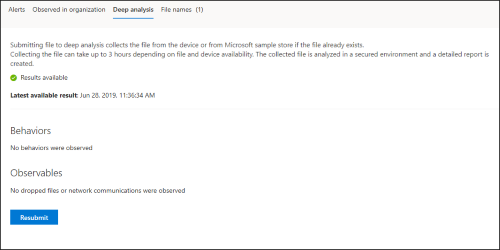

# <a name="take-response-actions-on-a-file"></a>Antwoordacties uitvoeren op een bestand

[!INCLUDE [Microsoft 365 Defender rebranding](../../includes/microsoft-defender.md)]


**Van toepassing op:**
- [Microsoft Defender voor Endpoint](https://go.microsoft.com/fwlink/?linkid=2154037)

[!include[Prerelease information](../../includes/prerelease.md)]

> Wilt u Defender voor Eindpunt ervaren? [Meld u aan voor een gratis proefabonnement.](https://www.microsoft.com/microsoft-365/windows/microsoft-defender-atp?ocid=docs-wdatp-responddile-abovefoldlink)

Reageer snel op gedetecteerde aanvallen door bestanden te stoppen en te kwaalen of een bestand te blokkeren. Nadat u actie hebt ondernomen voor bestanden, kunt u activiteitsgegevens controleren in het Actiecentrum.

Reactieacties zijn beschikbaar op de gedetailleerde profielpagina van een bestand. Eenmaal op deze pagina kunt u schakelen tussen de nieuwe en oude pagina-indelingen door de nieuwe **pagina Bestand te wijzigen.** In de rest van dit artikel wordt de nieuwere pagina-indeling beschreven.

Antwoordacties worden uitgevoerd boven aan de bestandspagina en bevatten:

- Bestand stoppen en in quarantaine plaatsen
- Indicator toevoegen
- Downloadbestand
- Een bedreigingsexpert raadplegen
- Actiecentrum

U kunt ook bestanden indienen voor uitgebreide analyse, om het bestand uit te voeren in een beveiligde cloudsandbox. Wanneer de analyse is voltooid, krijgt u een gedetailleerd rapport met informatie over het gedrag van het bestand. U kunt bestanden indienen voor uitgebreide analyse en eerdere rapporten lezen door het **tabblad Diepe analyse te** selecteren. Deze bevindt zich onder de bestandsgegevenskaarten.

Voor sommige acties zijn bepaalde machtigingen vereist. In de volgende tabel wordt beschreven welke actie bepaalde machtigingen kunnen ondernemen voor draagbare uitvoerbare (PE) en niet-PE-bestanden:

| Machtiging             | PE-bestanden | Niet-PE-bestanden |
| :--------------------- | :------: | :----------: |
| Gegevens weergeven              |     X    |       X      |
| Onderzoek naar waarschuwingen   | &#x2611; |       X      |
| Live response basic    |     X    |       X      |
| Live response advanced | &#x2611; |   &#x2611;   |

Zie Rollen maken en beheren voor toegangsbeheer op basis van rollen voor meer informatie over [rollen.](user-roles.md)

## <a name="stop-and-quarantine-files-in-your-network"></a>Bestanden in uw netwerk stoppen en in quarantaine plaatsen

U kunt een aanval in uw organisatie bevatten door het schadelijke proces te stoppen en het bestand te kwaalen waar het is waargenomen.

> [!IMPORTANT]
> U kunt deze actie alleen ondernemen als:
>
> - Op het apparaat waar u de actie op onderneemt, wordt Windows 10, versie 1703 of hoger uitgevoerd
> - Het bestand is niet eigendom van vertrouwde uitgevers van derden of niet ondertekend door Microsoft
> - Microsoft Defender Antivirus moet ten minste actief zijn in de passieve modus. Zie Compatibiliteit met Microsoft Defender Antivirus voor meer [informatie.](https://docs.microsoft.com/windows/security/threat-protection/microsoft-defender-antivirus/microsoft-defender-antivirus-compatibility)

De **actie Bestand stoppen en quarantaine** omvat het stoppen van lopende processen, het quarantineren van de bestanden en het verwijderen van permanente gegevens, zoals registersleutels.

Deze actie wordt van kracht op apparaten met Windows 10, versie 1703 of hoger, waar het bestand de afgelopen 30 dagen is waargenomen.

> [!NOTE]
> U kunt het bestand op elk moment vanuit quarantaine herstellen.

### <a name="stop-and-quarantine-files"></a>Bestanden stoppen en in quarantaine plaatsen

1. Selecteer het bestand dat u wilt stoppen en in quarantaine plaatsen. U kunt een bestand selecteren in een van de volgende weergaven of het vak Zoeken gebruiken:

   - **Waarschuwingen:** klik op de bijbehorende koppelingen van de beschrijving of details in de artefacttijdlijn
   - **Zoekvak:** selecteer **Bestand** in de vervolgkeuzelijst en voer de bestandsnaam in

   > [!NOTE]
   > De actie stop- en quarantainebestand is beperkt tot maximaal 1000 apparaten. Zie Indicator toevoegen om bestand te blokkeren of toe te staan als u een bestand op een groter aantal apparaten [wilt stoppen.](#add-indicator-to-block-or-allow-a-file)

2. Ga naar de bovenste balk en selecteer **Bestand stoppen en quarantaine**.

   

3. Geef een reden op en selecteer **vervolgens Bevestigen**.

   

   Het actiecentrum toont de inzendingsgegevens:
   
   

   - **Inzendingstijd:** geeft aan wanneer de actie is verzonden.
   - **Succes:** geeft het aantal apparaten weer waarop het bestand is gestopt en in quarantaine is geplaatst.
   - **Mislukt:** geeft het aantal apparaten weer waarop de actie is mislukt en details over de fout.
   - **In** behandeling: toont het aantal apparaten waar het bestand nog moet worden gestopt en in quarantaine moet worden geplaatst. Dit kan tijd duren voor gevallen waarin het apparaat offline is of niet is verbonden met het netwerk.

4. Selecteer een van de statusindicatoren om meer informatie over de actie weer te geven. Selecteer bijvoorbeeld Mislukt **om te** zien waar de actie is mislukt.

**Melding op apparaatgebruiker:**</br>
Wanneer het bestand van een apparaat wordt verwijderd, wordt de volgende melding weergegeven:


In de apparaattijdlijn wordt een nieuwe gebeurtenis toegevoegd voor elk apparaat waarop een bestand is gestopt en in quarantaine is geplaatst.

Er wordt een waarschuwing weergegeven voordat de actie wordt geïmplementeerd voor bestanden die op grote schaal in een organisatie worden gebruikt. Het is om te valideren dat de bewerking is bedoeld.

## <a name="restore-file-from-quarantine"></a>Bestand uit quarantaine herstellen

U kunt een bestand terugdraaien en verwijderen uit quarantaine als u na een onderzoek hebt vastgesteld dat het bestand schoon is. Voer de volgende opdracht uit op elk apparaat waarop het bestand in quarantaine is geplaatst.

1. Open een opdrachtregelprompt met verhoogde opdracht op het apparaat:

   1. Ga naar **Start** en typ _cmd._

   1. Klik met de rechtermuisknop **op Opdrachtprompt** en selecteer **Uitvoeren als beheerder.**

2. Voer de volgende opdracht in en druk op **Enter:**

   ```powershell
   “%ProgramFiles%\Windows Defender\MpCmdRun.exe” –Restore –Name EUS:Win32/CustomEnterpriseBlock –All
   ```

> [!NOTE]
> In sommige scenario's kan **threatname** worden weergegeven als: EUS:Win32/CustomEnterpriseBlock!cl.
>
> Defender voor Eindpunt herstelt alle aangepaste geblokkeerde bestanden die in quarantaine zijn geplaatst op dit apparaat in de afgelopen 30 dagen.

> [!IMPORTANT]
> Een bestand dat in quarantaine is geplaatst als een potentiële netwerkdreiging, kan mogelijk niet worden hersteld. Als een gebruiker het bestand na quarantaine probeert te herstellen, is dat bestand mogelijk niet toegankelijk. Dit kan worden veroorzaakt doordat het systeem geen netwerkreferenties meer heeft om toegang te krijgen tot het bestand. Dit is meestal het gevolg van een tijdelijk aanmelden bij een systeem of gedeelde map en de toegangstokens zijn verlopen.

## <a name="download-or-collect-file"></a>Bestand downloaden of verzamelen

Als **u Bestand downloaden** selecteert in de antwoordacties, kunt u een lokaal zip-archief met een wachtwoord downloaden dat uw bestand bevat. Er wordt een flyout weergegeven waarin u een reden voor het downloaden van het bestand kunt opnemen en een wachtwoord kunt instellen.

Standaard kunt u geen bestanden downloaden die in quarantaine staan.


### <a name="collect-files"></a>Bestanden verzamelen

Als een bestand nog niet is opgeslagen door Microsoft Defender voor Eindpunt, kunt u het niet downloaden. In plaats daarvan ziet u een knop **Bestand verzamelen** op dezelfde locatie. Als een bestand de afgelopen 30 dagen niet is gezien in de **organisatie,** wordt Bestand verzamelen uitgeschakeld.
> [!Important]
> Een bestand dat in quarantaine is geplaatst als een potentiële netwerkdreiging, kan mogelijk niet worden hersteld. Als een gebruiker het bestand na quarantaine probeert te herstellen, is dat bestand mogelijk niet toegankelijk. Dit kan worden veroorzaakt doordat het systeem geen netwerkreferenties meer heeft om toegang te krijgen tot het bestand. Dit is meestal het gevolg van een tijdelijk aanmelden bij een systeem of gedeelde map en de toegangstokens zijn verlopen.

## <a name="add-indicator-to-block-or-allow-a-file"></a>Indicator toevoegen om een bestand te blokkeren of toe te staan

Voorkom verdere verspreiding van een aanval in uw organisatie door potentieel schadelijke bestanden of vermoedelijke malware te verbieden. Als u een potentieel schadelijk bestand voor draagbaar uitvoerbaar (PE) kent, kunt u dit blokkeren. Deze bewerking voorkomt dat deze wordt gelezen, geschreven of uitgevoerd op apparaten in uw organisatie.

> [!IMPORTANT]
>
> - Deze functie is beschikbaar als uw organisatie Microsoft Defender Antivirus gebruikt en beveiliging die door de cloud is geleverd, is ingeschakeld. Zie Beveiliging in de cloud beheren [voor meer informatie.](https://docs.microsoft.com/windows/security/threat-protection/microsoft-defender-antivirus/deploy-manage-report-microsoft-defender-antivirus)
>
> - De versie van de Antimalware-client moet 4.18.1901.x of hoger zijn.
> - Deze functie is ontworpen om te voorkomen dat verdachte malware (of mogelijk schadelijke bestanden) van internet wordt gedownload. Het ondersteunt momenteel draagbare uitvoerbare (PE)-bestanden, waaronder _.exe-_ en _.dll-bestanden._ De dekking wordt in de tijd uitgebreid.
> - Deze reactieactie is beschikbaar voor apparaten op Windows 10, versie 1703 of hoger.
> - De functie Toestaan of blokkeren kan niet worden uitgevoerd op bestanden als de classificatie van het bestand aanwezig is in de cache van het apparaat vóór de actie toestaan of blokkeren.

> [!NOTE]
> Het PE-bestand moet zich in de tijdlijn van het apparaat plaatsen om deze actie te kunnen ondernemen.
>
> Er kan een paar minuten latentie zijn tussen het moment dat de actie wordt ondernomen en het werkelijke bestand dat wordt geblokkeerd.

### <a name="enable-the-block-file-feature"></a>De functie Blokbestand inschakelen

Als u bestanden wilt blokkeren, moet u eerst de functie Blokkeren of toestaan [in-/uitschakelen  ](advanced-features.md) in Instellingen.
### <a name="allow-or-block-file"></a>Bestand toestaan of blokkeren

Wanneer u een indicatorhash voor een bestand toevoegt, kunt u ervoor kiezen om een waarschuwing te verhogen en het bestand te blokkeren wanneer een apparaat in uw organisatie dit probeert uit te voeren.

Bestanden die automatisch worden geblokkeerd door een indicator, worden niet weergegeven in het actiecentrum van het bestand, maar de waarschuwingen blijven wel zichtbaar in de wachtrij Waarschuwingen.

Zie [Indicatoren beheren voor](manage-indicators.md) meer informatie over het blokkeren en verhogen van waarschuwingen voor bestanden.

Als u het blokkeren van een bestand wilt stoppen, verwijdert u de indicator. U kunt dit doen via de **actie Indicator bewerken** op de profielpagina van het bestand. Deze actie is zichtbaar op dezelfde positie als de actie **Indicator** toevoegen, voordat u de indicator toevoegt.

U kunt ook indicatoren bewerken op de pagina **Instellingen,** onder   >  **Regelsindicatoren.** Indicatoren worden in dit gebied weergegeven door de hash van het bestand.

## <a name="consult-a-threat-expert"></a>Een bedreigingsexpert raadplegen

Raadpleeg een Bedreigingsexpert van Microsoft voor meer informatie over een mogelijk gecompromitteerd apparaat of al gecompromitteerde apparaten. Microsoft Threat Experts zijn rechtstreeks vanuit het Microsoft Defender-beveiligingscentrum betrokken voor een tijdige en nauwkeurige reactie. Experts bieden inzichten over een mogelijk gecompromitteerd apparaat en helpen u inzicht te krijgen in complexe bedreigingen en gerichte aanvalsmeldingen. Ze kunnen ook informatie verstrekken over de waarschuwingen of een context met bedreigingsinformatie die u op uw portaldashboard ziet.

Zie [Een Microsoft Threat Expert raadplegen](https://docs.microsoft.com/microsoft-365/security/defender-endpoint/configure-microsoft-threat-experts#consult-a-microsoft-threat-expert-about-suspicious-cybersecurity-activities-in-your-organization) voor meer informatie.

## <a name="check-activity-details-in-action-center"></a>Activiteitsdetails controleren in het Actiecentrum

Het **Actiecentrum** bevat informatie over acties die zijn ondernomen op een apparaat of bestand. U kunt de volgende details bekijken:

- Verzameling onderzoekspakketten
- Antivirusscan
- App-beperking
- Apparaatisolatie

Alle andere gerelateerde details worden ook weergegeven, zoals inzendingsdatum/-tijd, het indienen van gebruiker en of de actie is geslaagd of mislukt.


## <a name="deep-analysis"></a>Uitgebreide analyse

Cyberbeveiligingsonderzoeken worden meestal geactiveerd door een waarschuwing. Waarschuwingen zijn gerelateerd aan een of meer waargenomen bestanden die vaak nieuw of onbekend zijn. Als u een bestand selecteert, gaat u naar de bestandsweergave waar u de metagegevens van het bestand kunt zien. Als u de gegevens met betrekking tot het bestand wilt verrijken, kunt u het bestand indienen voor uitgebreide analyse.

Met de functie Deep Analysis wordt een bestand uitgevoerd in een beveiligde, volledig geinstrumenteerde cloudomgeving. Uitgebreide analyseresultaten tonen de activiteiten, waargenomen gedragingen en bijbehorende artefacten van het bestand, zoals verwijderde bestanden, registerwijzigingen en communicatie met IPs.
Deep Analysis ondersteunt momenteel uitgebreide analyse van draagbare uitvoerbare (PE)-bestanden (waaronder _.exe-_ en _.dll-bestanden)._

Een uitgebreide analyse van een bestand duurt enkele minuten. Wanneer de bestandsanalyse is voltooid, wordt het tabblad Diepe analyse bijgewerkt om een overzicht weer te geven en de datum en tijd van de meest recente beschikbare resultaten.

De uitgebreide analysesamenvatting bevat een lijst met waargenomen *gedragingen*, waarvan sommige schadelijke activiteiten kunnen aangeven, en waarneembare *gegevens,* inclusief gecontacteerde IPs en bestanden die op de schijf zijn gemaakt. Als er niets is gevonden, wordt in deze secties een kort bericht weergegeven.

Resultaten van een grondige analyse worden afgestemd op bedreigingsinformatie en eventuele overeenkomsten genereren de juiste waarschuwingen.

Gebruik de functie voor uitgebreide analyse om de details van een bestand te onderzoeken, meestal tijdens een onderzoek naar een waarschuwing of om een andere reden waarbij u vermoedt dat er kwaadwillend gedrag is. Deze functie is beschikbaar op het **tabblad Diepe analyse** op de profielpagina van het bestand.<br/>
<br/>

> [!VIDEO https://www.microsoft.com/en-us/videoplayer/embed/RE4aAYy?rel=0]

**Verzenden** voor uitgebreide analyse is ingeschakeld wanneer het bestand beschikbaar is in de back-endpoint-back-endpoint-verzameling van Defender of als het is waargenomen op een Windows 10-apparaat dat ondersteuning biedt voor het indienen van uitgebreide analyses.

> [!NOTE]
> Alleen bestanden uit Windows 10 kunnen automatisch worden verzameld.

U kunt ook een voorbeeld indienen via de [Microsoft Security Center Portal](https://www.microsoft.com/security/portal/submission/submit.aspx) als het bestand niet is waargenomen op een Windows 10-apparaat en wacht totdat **de** knop Verzenden voor uitgebreide analyse beschikbaar is.

> [!NOTE]
> Als gevolg van back-endverwerkingsstromen in de Microsoft Security Center Portal, kan er tot 10 minuten latentie zijn tussen bestandsinzending en beschikbaarheid van de deep analysis-functie in Defender voor Eindpunt.

Wanneer het voorbeeld wordt verzameld, wordt het bestand in Defender voor Eindpunt uitgevoerd in een beveiligde omgeving. Vervolgens wordt een gedetailleerd rapport gemaakt van waargenomen gedragingen en bijbehorende artefacten, zoals bestanden die op apparaten zijn gedropt, communicatie met IPs en registerwijzigingen.

### <a name="submit-files-for-deep-analysis"></a>Bestanden verzenden voor uitgebreide analyse

1. Selecteer het bestand dat u wilt verzenden voor uitgebreide analyse. U kunt een bestand in een van de volgende weergaven selecteren of doorzoeken:

    - Waarschuwingen: selecteer de bestandskoppelingen in **de beschrijving of** **details** in de artefacttijdlijn
    - **Lijst Apparaten:** selecteer de bestandskoppelingen in **de sectie Beschrijving** of **Details** in de sectie **Apparaat in** organisatie
    - Zoekvak: selecteer **Bestand** in de vervolgkeuzelijst en voer de bestandsnaam in

2. Selecteer verzenden **op het tabblad** Diepe analyse van de bestandsweergave. 

   

   > [!NOTE]
   > Alleen PE-bestanden worden ondersteund, waaronder _.exe-_ en _.dll-bestanden._

Er wordt een voortgangsbalk weergegeven en informatie over de verschillende stadia van de analyse. U kunt het rapport vervolgens bekijken wanneer de analyse is uitgevoerd.

> [!NOTE]
> Afhankelijk van de beschikbaarheid van het apparaat, kan de tijd van de steekproefverzameling variëren. Er is een time-out van 3 uur voor voorbeeldverzameling. De verzameling mislukt en de bewerking wordt afgebroken als er op dat moment geen online windows 10-apparaatrapportage is. U kunt bestanden opnieuw indienen voor uitgebreide analyse om nieuwe gegevens in het bestand op te halen.

### <a name="view-deep-analysis-reports"></a>Uitgebreide analyserapporten weergeven

Bekijk het uitgebreide analyserapport voor uitgebreidere inzichten over het bestand dat u hebt ingediend. Deze functie is beschikbaar in de context van de bestandsweergave.

U kunt het uitgebreide rapport bekijken met informatie over de volgende secties:

- Gedrag
- Waarneembare

Met de details kunt u onderzoeken of er aanwijzingen zijn voor een mogelijke aanval.

1. Selecteer het bestand dat u hebt ingediend voor uitgebreide analyse.
2. Selecteer het **tabblad Diepe** analyse. Als er eerdere rapporten zijn, wordt het rapportoverzicht weergegeven op dit tabblad.

    

#### <a name="troubleshoot-deep-analysis"></a>Problemen met diepgaande analyse oplossen

Als u een probleem tegenkomt bij het indienen van een bestand, probeert u de volgende stappen voor het oplossen van problemen.

1. Controleer of het bestand in kwestie een PE-bestand is. PE-bestanden hebben meestal _.exe-_ of _.dll-extensies_ (uitvoerbare programma's of toepassingen).
2. Zorg ervoor dat de service toegang heeft tot het bestand, dat het nog steeds bestaat en niet beschadigd of gewijzigd is.
3. Wacht even en probeer het bestand opnieuw in te dienen. De wachtrij kan vol zijn of er is een tijdelijke verbinding of communicatiefout opgetreden.
4. Als het voorbeeldverzamelingsbeleid niet is geconfigureerd, is het standaardgedrag om voorbeeldverzameling toe te staan. Als het bestand is geconfigureerd, controleert u of de beleidsinstelling voorbeeldverzameling toestaat voordat u het bestand opnieuw indient. Wanneer voorbeeldverzameling is geconfigureerd, controleert u de volgende registerwaarde:

    ```powershell
    Path: HKLM\SOFTWARE\Policies\Microsoft\Windows Advanced Threat Protection
    Name: AllowSampleCollection
    Type: DWORD
    Hexadecimal value :
      Value = 0 – block sample collection
      Value = 1 – allow sample collection
    ```

1. Wijzig de organisatie-eenheid via het groepsbeleid. Zie Configureren [met groepsbeleid voor meer informatie.](configure-endpoints-gp.md)
1. Als het probleem niet wordt opgelost met deze stappen, neemt u contact [op met winatp@microsoft.com.](mailto:winatp@microsoft.com)

## <a name="related-topics"></a>Verwante onderwerpen

- [Antwoordacties uitvoeren op een apparaat](respond-machine-alerts.md)
- [Bestanden onderzoeken](investigate-files.md)
