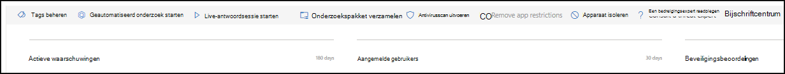
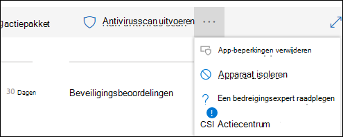
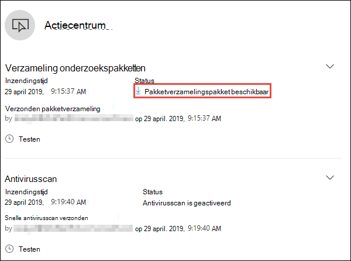
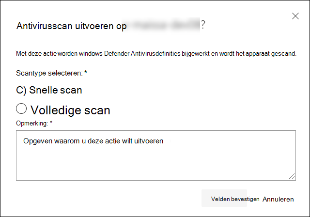
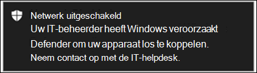

# Acties ondernemen op een apparaatTake response actions on a device

[!INCLUDE [Microsoft 365 Defender rebranding](../../includes/microsoft-defender.md)]

**Van toepassing op:****Applies to:**
- [Microsoft Defender voor EindpuntMicrosoft Defender for Endpoint](https://go.microsoft.com/fwlink/?linkid=2154037)

>Wilt u Defender voor Eindpunt ervaren?Want to experience Defender for Endpoint? [Meld u aan voor een gratis proefabonnement.Sign up for a free trial.](https://www.microsoft.com/microsoft-365/windows/microsoft-defender-atp?ocid=docs-wdatp-respondmachine-abovefoldlink) 

Reageer snel op gedetecteerde aanvallen door apparaten te isoleren of een onderzoekspakket te verzamelen.Quickly respond to detected attacks by isolating devices or collecting an investigation package. Nadat u actie hebt ondernomen op apparaten, kunt u activiteitsgegevens controleren in het Actiecentrum.After taking action on devices, you can check activity details on the Action center.

Antwoordacties worden uitgevoerd boven aan een specifieke apparaatpagina en bevatten:Response actions run along the top of a specific device page and include:

- Tags beherenManage tags
- Geautomatiseerd onderzoek startenInitiate Automated Investigation
- Live-antwoordsessie startenInitiate Live Response Session
- Onderzoekspakket verzamelenCollect investigation package
- Antivirusscan uitvoerenRun antivirus scan
- Het uitvoeren van apps beperkenRestrict app execution
- Apparaat isolerenIsolate device
- Contact opnemen met een risicodeskundigeConsult a threat expert
- ActiecentrumAction center

 U kunt apparaatpagina's vinden in een van de volgende weergaven:You can find device pages from any of the following views:

- **Dashboard Beveiligingsbewerkingen:** selecteer een apparaatnaam op de kaart Apparaten met risico.**Security operations dashboard** - Select a device name from the Devices at risk card.
- **Waarschuwingenwachtrij:** selecteer de naam van het apparaat naast het apparaatpictogram in de waarschuwingenwachtrij.**Alerts queue** - Select the device name beside the device icon from the alerts queue.
- **Lijst apparaten:** selecteer de kop van de naam van het apparaat in de lijst met apparaten.**Devices list** - Select the heading of the device name from the devices list.
- **Zoekvak:** selecteer Apparaat in de vervolgkeuzelijst en voer de naam van het apparaat in.**Search box** - Select Device from the drop-down menu and enter the device name.

>[!IMPORTANT]
> - Deze antwoordacties zijn alleen beschikbaar voor apparaten Windows 10, versie 1703 of hoger.These response actions are only available for devices on Windows 10, version  1703 or later. 
> - Voor niet-Windows platforms zijn reactiemogelijkheden (zoals apparaatisolatie) afhankelijk van de mogelijkheden van derden.For non-Windows platforms, response capabilities (such as Device isolation) are dependent on the third-party capabilities.

## Tags beherenManage tags

Voeg tags toe of beheer deze om een logische groep te maken.Add or manage tags to create a logical group affiliation. Apparaatlabels ondersteunen de juiste toewijzing van het netwerk, zodat u verschillende tags kunt koppelen om context vast te leggen en dynamische lijstcreatie als onderdeel van een incident kunt inschakelen.Device tags support proper mapping of the network, enabling you to attach different tags to capture context and to enable dynamic list creation as part of an incident.

Zie Apparaatlabels maken en beheren voor meer informatie over [apparaatlabels.](machine-tags.md)For more information on device tagging, see [Create and manage device tags](machine-tags.md).

## Geautomatiseerd onderzoek startenInitiate Automated Investigation

U kunt indien nodig een nieuw geautomatiseerd algemeen onderzoek op het apparaat starten.You can start a new general purpose automated investigation on the device if needed. Terwijl een onderzoek wordt uitgevoerd, wordt elke andere waarschuwing die van het apparaat wordt gegenereerd, toegevoegd aan een lopend geautomatiseerd onderzoek totdat dat onderzoek is voltooid.While an investigation is running, any other alert generated from the device will be added to an ongoing Automated investigation until that investigation is completed. Bovendien worden deze apparaten toegevoegd aan het onderzoek als dezelfde bedreiging op andere apparaten wordt gezien.In addition, if the same threat is seen on other devices, those devices are added to the investigation.

Zie Overzicht van geautomatiseerde onderzoeken voor meer informatie over [geautomatiseerde onderzoeken.](automated-investigations.md)For more information on automated investigations, see [Overview of Automated investigations](automated-investigations.md).

## Live-antwoordsessie startenInitiate Live Response Session

Live response is een mogelijkheid die u direct toegang geeft tot een apparaat met behulp van een externe shell-verbinding.Live response is a capability that gives you instantaneous access to a device by using a remote shell connection. Dit geeft u de macht om uitgebreid onderzoek te doen en direct actie te ondernemen om snel geïdentificeerde bedreigingen in realtime te bevatten.This gives you the power to do in-depth investigative work and take immediate response actions to promptly contain identified threats — real time.

Live response is ontworpen om onderzoeken te verbeteren door u in staat te stellen om gerechtelijke gegevens te verzamelen, scripts uit te voeren, verdachte entiteiten te verzenden voor analyse, bedreigingen te corrigeren en proactief te zoeken naar nieuwe bedreigingen.Live response is designed to enhance investigations by enabling you to collect forensic data, run scripts, send suspicious entities for analysis, remediate threats, and proactively hunt for emerging threats.

Zie Entiteiten onderzoeken op apparaten met livereactie voor [meer informatie over livereactie.](live-response.md)For more information on live response, see [Investigate entities on devices using live response](live-response.md).

## Onderzoekspakket verzamelen van apparatenCollect investigation package from devices

Als onderdeel van het onderzoek- of antwoordproces kunt u een onderzoekspakket verzamelen vanaf een apparaat.As part of the investigation or response process, you can collect an investigation package from a device. Door het onderzoekspakket te verzamelen, kunt u de huidige status van het apparaat identificeren en meer inzicht krijgen in de hulpprogramma's en technieken die door de aanvaller worden gebruikt.By collecting the investigation package, you can identify the current state of the device and further understand the tools and techniques used by the attacker.

Het pakket (Zip-bestand) downloaden en de gebeurtenissen op een apparaat onderzoekenTo download the package (Zip file) and investigate the events that occurred on a device

1. Selecteer **Onderzoekspakket verzamelen** in de rij met antwoordacties boven aan de apparaatpagina.Select **Collect investigation package** from the row of response actions at the top of the device page.
2. Geef in het tekstvak op waarom u deze actie wilt uitvoeren.Specify in the text box why you want to perform this action. Selecteer **Bevestigen**.Select **Confirm**.
3. Het zip-bestand wordt gedownloadThe zip file will download

Alternatieve manier:Alternate way:

1. Selecteer **Actiecentrum** in de sectie Reactieacties van de apparaatpagina.Select **Action center** from the response actions section of the device page.

    

3. Selecteer in de fly-out actiecentrum de optie **Pakketverzamelingspakket dat beschikbaar is** om het zip-bestand te downloaden.In the Action center fly-out, select **Package collection package available** to download the zip file.
  
    

Het pakket bevat de volgende mappen:The package contains the following folders:

| MapFolder | BeschrijvingDescription |
|:---|:---------|
|AutorunsAutoruns | Bevat een set bestanden die elk de inhoud vertegenwoordigen van het register van een bekend autostartinvoerpunt (ASEP) om de persistentie van de aanvaller op het apparaat te identificeren.Contains a set of files that each represent the content of the registry of a known auto start entry point (ASEP) to help identify attacker’s persistency on the device.    
<b>OPMERKING:</b> Als de registersleutel niet wordt gevonden, bevat het bestand het volgende bericht: 'FOUT: Het systeem kon de opgegeven registersleutel of -waarde niet vinden'.<b>NOTE:</b> If the registry key is not found, the file will contain the following message: “ERROR: The system was unable to find the specified registry key or value.”
                                                                                                                                |
|Geïnstalleerde programma'sInstalled programs | Dit .CSV bevat de lijst met geïnstalleerde programma's die kunnen helpen bepalen wat er momenteel op het apparaat is geïnstalleerd.This .CSV file contains the list of installed programs that can help identify what is currently installed on the device. Zie voor meer informatie [Win32_Product klas.](https://go.microsoft.com/fwlink/?linkid=841509)For more information, see [Win32_Product class](https://go.microsoft.com/fwlink/?linkid=841509).                                                                                  |
|NetwerkverbindingenNetwork connections | Deze map bevat een set gegevenspunten die betrekking hebben op de connectiviteitsgegevens die kunnen helpen bij het identificeren van de connectiviteit met verdachte URL's, de command and control-infrastructuur (C&C) van de aanvaller, eventuele zijbewegingen of externe verbindingen.This folder contains a set of data points related to the connectivity information which can help in identifying connectivity to suspicious URLs, attacker’s command and control (C&C) infrastructure, any lateral movement, or remote connections.   - ActiveNetConnections.txt: hiermee worden protocolstatistieken en huidige TCP-/IP-netwerkverbindingen weergegeven.- ActiveNetConnections.txt – Displays protocol statistics and current TCP/IP network connections. Biedt de mogelijkheid om te zoeken naar verdachte connectiviteit die is gemaakt door een proces.Provides the ability to look for suspicious connectivity made by a process.    - Arp.txt: hiermee wordt het huidige ARP-cachetabellen (Address Resolution Protocol) voor alle interfaces weergegeven.- Arp.txt – Displays the current address resolution protocol (ARP) cache tables for all interfaces.    ARP-cache kan extra hosts op een netwerk onthullen die zijn gehackt of verdachte systemen in het netwerk die mogelijk zijn gebruikt om een interne aanval uit te voeren.ARP cache can reveal additional hosts on a network that have been compromised or suspicious systems on the network that might have been used to run an internal attack.   - DnsCache.txt- Geeft de inhoud weer van de cache met dns-client resolver, die zowel items bevat die vooraf zijn geladen vanuit het lokale hosts-bestand als alle recent verkregen resourcerecords voor naamquery's die door de computer zijn opgelost.- DnsCache.txt - Displays the contents of the DNS client resolver cache, which includes both entries preloaded from the local Hosts file and any recently obtained resource records for name queries resolved by the computer. Dit kan helpen bij het identificeren van verdachte verbindingen.This can help in identifying suspicious connections.    - IpConfig.txt: hiermee wordt de volledige TCP/IP-configuratie voor alle adapters weergegeven.- IpConfig.txt – Displays the full TCP/IP configuration for all adapters. Adapters kunnen fysieke interfaces vertegenwoordigen, zoals geïnstalleerde netwerkadapters of logische interfaces, zoals inbelverbindingen.Adapters can represent physical interfaces, such as installed network adapters, or logical interfaces, such as dial-up connections.    - FirewallExecutionLog.txt en pfirewall.log- FirewallExecutionLog.txt and pfirewall.log                                                                                  |
| Prefetch-bestandenPrefetch files| Windows Prefetch-bestanden zijn ontworpen om het opstarten van toepassingen te versnellen.Windows Prefetch files are designed to speed up the application startup process. Het kan worden gebruikt om alle bestanden bij te houden die onlangs in het systeem zijn gebruikt en om sporen te vinden voor toepassingen die mogelijk zijn verwijderd, maar nog steeds in de lijst met prefetch-bestanden kunnen worden gevonden.It can be used to track all the files recently used in the system and find traces for applications that might have been deleted but can still be found in the prefetch file list.    - Map Prefetch: bevat een kopie van de prefetch-bestanden van `%SystemRoot%\Prefetch` .- Prefetch folder –  Contains a copy of the prefetch files from `%SystemRoot%\Prefetch`. OPMERKING: Het wordt voorgesteld om een prefetch-bestandsviewer te downloaden om de prefetch-bestanden te bekijken.NOTE: It is suggested to download a prefetch file viewer to view the prefetch files.    - PrefetchFilesList.txt: bevat de lijst met alle gekopieerde bestanden die kunnen worden gebruikt om bij te houden of er sprake was van kopiefouten in de map prefetch.- PrefetchFilesList.txt – Contains the list of all the copied files which can be used to track if there were any copy failures to the prefetch folder.                                                                                                      |
| ProcessenProcesses| Bevat een .CSV met de lopende processen, waarmee u de huidige processen kunt identificeren die op het apparaat worden uitgevoerd.Contains a .CSV file listing the running processes, which provides the ability to identify current processes running on the device. Dit kan handig zijn bij het identificeren van een verdacht proces en de status ervan.This can be useful when identifying a suspicious process and its state.                                                                                                                                                                                                       |
| Geplande takenScheduled tasks| Bevat een .CSV met de geplande taken, die kunnen worden gebruikt om routines te identificeren die automatisch worden uitgevoerd op een gekozen apparaat om te zoeken naar verdachte code die is ingesteld om automatisch uit te voeren.Contains a .CSV file listing the scheduled tasks, which can be used to identify routines performed automatically on a chosen device to look for suspicious code which was set to run automatically.                                                                                                                                                                                                      |
| BeveiligingsgebeurtenislogboekSecurity event log| Bevat het beveiligingsgebeurtenislogboek, dat records bevat van aanmeldings- of aanmeldingsactiviteit of andere beveiligingsgerelateerde gebeurtenissen die zijn opgegeven in het auditbeleid van het systeem.Contains the security event log, which contains records of login or logout activity, or other security-related events specified by the system's audit policy.   
<b>OPMERKING:</b> Open het gebeurtenislogboekbestand met Behulp van Gebeurtenisviewer.<b>NOTE:</b> Open the event log file using Event viewer.
                                                                                    |
| ServicesServices| Bevat een .CSV met services en hun staten.Contains a .CSV file that lists services and their states.                                                                                      |
| Windows Server Message Block (SMB) sessiesWindows Server Message Block (SMB) sessions | Hiermee worden gedeelde toegang tot bestanden, printers en seriële poorten en diverse communicatie tussen knooppunten in een netwerk vermeld.Lists shared access to files, printers, and serial ports and miscellaneous communications between nodes on a network. Dit kan helpen bij het identificeren van gegevens exfiltratie of zijverbeweging.This can help identify data exfiltration or lateral movement.    Bevat bestanden voor SMBInboundSessions en SMBOutboundSession.Contains files for SMBInboundSessions and SMBOutboundSession.    
<b>OPMERKING:</b> Als er geen sessies zijn (binnenkomende of uitgaande sessies), krijgt u een tekstbestand waarin wordt gezegd dat er geen SMB-sessies zijn gevonden.<b>NOTE:</b> If there are no sessions (inbound or outbound), you'll get a text file which tell you that there are no SMB sessions found.
                                                                                                                          |
| SysteeminformatieSystem Information| Bevat een SystemInformation.txt met systeemgegevens, zoals versie van het besturingssysteem en netwerkkaarten.Contains a SystemInformation.txt file which lists system information such as OS version and network cards.                                                                                     |
| Temp DirectoriesTemp Directories| Bevat een set tekstbestanden met de bestanden in %Temp% voor elke gebruiker in het systeem.Contains a set of text files that lists the files located in %Temp% for every user in the system.    Dit kan helpen bij het bijhouden van verdachte bestanden die een aanvaller mogelijk op het systeem heeft laten vallen.This can help to track suspicious files that an attacker may have dropped on the system.    
<b>OPMERKING:</b> Als het bestand het volgende bericht bevat: 'Het systeem kan het opgegeven pad niet vinden', betekent dit dat er geen tijdelijke adreslijst voor deze gebruiker is en dat de gebruiker zich mogelijk niet heeft aanmelden bij het systeem.<b>NOTE:</b> If the file contains the following message: “The system cannot find the path specified”, it means that there is no temp directory for this user, and might be because the user didn’t log in to the system.
                                                                                                                                         |
| Gebruikers en groepenUsers and Groups| Bevat een lijst met bestanden die elk een groep en de leden vertegenwoordigen.Provides a list of files that each represent a group and its members.                                                                                                                   |
|WdSupportLogsWdSupportLogs| Biedt de MpCmdRunLog.txt en MPSupportFiles.cabProvides the MpCmdRunLog.txt and MPSupportFiles.cab     
<b>OPMERKING:</b> Deze map wordt alleen gemaakt op Windows 10, versie 1709 of hoger met update-rollup van februari 2020 of recenter geïnstalleerd:<b>NOTE:</b> This folder will only be created on Windows 10, version 1709 or later with February 2020 update rollup or more recent installed:  Win10 1709 (RS3) Build 16299.1717 : [KB4537816](https://support.microsoft.com/en-us/help/4537816/windows-10-update-kb4537816)Win10 1709 (RS3) Build 16299.1717 : [KB4537816](https://support.microsoft.com/en-us/help/4537816/windows-10-update-kb4537816)   Win10 1803 (RS4) Build 17134.1345 : [KB4537795](https://support.microsoft.com/en-us/help/4537795/windows-10-update-kb4537795)Win10 1803 (RS4) Build 17134.1345 : [KB4537795](https://support.microsoft.com/en-us/help/4537795/windows-10-update-kb4537795)   Win10 1809 (RS5) Build 17763.1075 : [KB4537818](https://support.microsoft.com/en-us/help/4537818/windows-10-update-kb4537818)Win10 1809 (RS5) Build 17763.1075 : [KB4537818](https://support.microsoft.com/en-us/help/4537818/windows-10-update-kb4537818)   Win10 1903/1909 (19h1/19h2) Builds 18362.693 en 18363.693 : [KB4535996](https://support.microsoft.com/en-us/help/4535996/windows-10-update-kb4535996)Win10 1903/1909 (19h1/19h2) Builds 18362.693 and 18363.693 : [KB4535996](https://support.microsoft.com/en-us/help/4535996/windows-10-update-kb4535996) 
                                                                                                                    |
| CollectionSummaryReport.xlsCollectionSummaryReport.xls| Dit bestand is een samenvatting van de verzameling onderzoekspakketten, het bevat de lijst met gegevenspunten, de opdracht die wordt gebruikt om de gegevens op te halen, de uitvoeringsstatus en de foutcode in geval van een fout.This file is a summary of the investigation package collection, it contains the list of data points, the command used to extract the data, the execution status, and the error code in case of failure. U kunt dit rapport gebruiken om bij te houden of het pakket alle verwachte gegevens bevat en te bepalen of er fouten zijn.You can use this report to track if the package includes all the expected data and identify if there were any errors. |

## Een Microsoft Defender Antivirus uitvoeren op apparatenRun Microsoft Defender Antivirus scan on devices

Als onderdeel van het onderzoek- of antwoordproces kunt u op afstand een antivirusscan starten om malware te identificeren en te herstellen die mogelijk aanwezig is op een gecompromitteerd apparaat.As part of the investigation or response process, you can remotely initiate an antivirus scan to help identify and remediate malware that might be present on a compromised device.

>[!IMPORTANT]
>- Deze actie is beschikbaar voor apparaten op Windows 10, versie 1709 of hoger.This action is available for devices on Windows 10, version  1709 or later.
>- Een Microsoft Defender Antivirus (Microsoft Defender AV) kan worden uitgevoerd naast andere antivirusoplossingen, ongeacht of Microsoft Defender AV de actieve antivirusoplossing is of niet.A Microsoft Defender Antivirus (Microsoft Defender AV) scan can run alongside other antivirus solutions, whether Microsoft Defender AV is the active antivirus solution or not. Microsoft Defender AV kan in de passieve modus staan.Microsoft Defender AV can be in Passive mode. Zie Microsoft Defender Antivirus [compatibiliteit voor meer informatie.](/windows/security/threat-protection/microsoft-defender-antivirus/microsoft-defender-antivirus-compatibility.md)For more information, see [Microsoft Defender Antivirus compatibility](/windows/security/threat-protection/microsoft-defender-antivirus/microsoft-defender-antivirus-compatibility.md).

Als u Antivirusscan uitvoeren hebt **geselecteerd,** selecteert u het scantype dat u wilt uitvoeren (snel of vol) en voegt u een opmerking toe voordat u de scan bevestigt.One you have selected **Run antivirus scan**, select the scan type that you'd like to run (quick or full) and add a comment before confirming the scan.

In het Actiecentrum worden de scangegevens weergegeven en de tijdlijn van het apparaat bevat een nieuwe gebeurtenis, waarin wordt weerspiegeld dat er een scanactie is verzonden op het apparaat.The Action center will show the scan information and the device timeline will include a new event, reflecting that a scan action was submitted on the device. Microsoft Defender AV-waarschuwingen geven alle detecties weer die tijdens de scan zijn opgedoken.Microsoft Defender AV alerts will reflect any detections that surfaced during the scan.

>[!NOTE]
>Wanneer u een scan activeert met de actie Defender voor eindpuntreactie, is de waarde scanAvgCPULoadFactor van Microsoft Defender antivirus nog steeds van toepassing en wordt de CPU-impact van de scan beperkt.When triggering a scan using Defender for Endpoint response action, Microsoft Defender antivirus 'ScanAvgCPULoadFactor' value still applies and limits the CPU impact of the scan.  Als ScanAvgCPULoadFactor niet is geconfigureerd, is de standaardwaarde een limiet van 50% maximale CPU-belasting tijdens een scan.If ScanAvgCPULoadFactor is not configured, the default value is a limit of 50% maximum CPU load during a scan. 
>Zie [Configure-advanced-scan-types-microsoft-defender-antivirus](/windows/security/threat-protection/microsoft-defender-antivirus/configure-advanced-scan-types-microsoft-defender-antivirus)voor meer informatie.For more information, see [configure-advanced-scan-types-microsoft-defender-antivirus](/windows/security/threat-protection/microsoft-defender-antivirus/configure-advanced-scan-types-microsoft-defender-antivirus).

## Het uitvoeren van apps beperkenRestrict app execution

Naast het bevatten van een aanval door schadelijke processen te stoppen, kunt u ook een apparaat vergrendelen en voorkomen dat volgende pogingen van potentieel schadelijke programma's worden uitgevoerd.In addition to containing an attack by stopping malicious processes, you can also lock down a device and prevent subsequent attempts of potentially malicious programs from running.

>[!IMPORTANT]
> - Deze actie is beschikbaar voor apparaten op Windows 10, versie 1709 of hoger.This action is available for devices on Windows 10, version  1709 or later.
> - Deze functie is beschikbaar als uw organisatie gebruikmaakt van Microsoft Defender Antivirus.This feature is available if your organization uses Microsoft Defender Antivirus.
> - Deze actie moet voldoen aan de Windows Defender de codeintegriteitsbeleidsindelingen en -ondertekeningsvereisten voor Toepassingsbeheer.This action needs to meet the Windows Defender Application Control code integrity policy formats and signing requirements. Zie Code [integrity policy formats and signing (Code integrity policy formats and signing) voor meer informatie.](/windows/device-security/device-guard/requirements-and-deployment-planning-guidelines-for-device-guard#code-integrity-policy-formats-and-signing)For more information, see [Code integrity policy formats and signing](/windows/device-security/device-guard/requirements-and-deployment-planning-guidelines-for-device-guard#code-integrity-policy-formats-and-signing).

Als u wilt voorkomen dat een toepassing wordt uitgevoerd, wordt een codeintegriteitsbeleid toegepast waarmee bestanden alleen kunnen worden uitgevoerd als ze zijn ondertekend door een door Microsoft uitgegeven certificaat.To restrict an application from running, a code integrity policy is applied that only allows files to run if they are signed by a Microsoft issued certificate. Deze beperkingsmethode kan voorkomen dat een aanvaller gecompromitteerde apparaten kan beheren en verdere schadelijke activiteiten kan uitvoeren.This method of restriction can help prevent an attacker from controlling compromised devices and performing further malicious activities.

>[!NOTE]
>U kunt de beperking voor toepassingen op elk moment ongedaan maken.You’ll be able to reverse the restriction of applications from running at any time. De knop op de apparaatpagina wordt gewijzigd in **app-beperkingen** verwijderen en u ondernomen dezelfde stappen als het beperken van de uitvoering van apps.The button on the device page will change to say **Remove app restrictions**, and then you take the same steps as restricting app execution.

Nadat u De uitvoering van **apps beperken op** de apparaatpagina hebt geselecteerd, typt u een opmerking en selecteert u **Bevestigen**.Once you have selected **Restrict app execution** on the device page, type a comment and select **Confirm**. In het Actiecentrum worden de scangegevens weergegeven en de tijdlijn van het apparaat bevat een nieuwe gebeurtenis.The Action center will show the scan information and the device timeline will include a new event.

**Melding op apparaatgebruiker:****Notification on device user**: 
Wanneer een app is beperkt, wordt de volgende melding weergegeven om de gebruiker te informeren dat een app niet kan worden uitgevoerd:When an app is restricted, the following notification is displayed to inform the user that an app is being restricted from running:

## Apparaten isoleren van het netwerkIsolate devices from the network

Afhankelijk van de ernst van de aanval en de gevoeligheid van het apparaat, kunt u het apparaat isoleren van het netwerk.Depending on the severity of the attack and the sensitivity of the device, you might want to isolate the device from the network. Met deze actie kunt u voorkomen dat de aanvaller het gecompromitteerde apparaat kan beheren en verdere activiteiten kan uitvoeren, zoals gegevens exfiltreren en zijbewegingen.This action can help prevent the attacker from controlling the compromised device and performing further activities such as data exfiltration and lateral movement.

>[!IMPORTANT]
>- Volledige isolatie is beschikbaar voor apparaten op Windows 10, versie 1703.Full isolation is available for devices on Windows 10, version 1703.
>- Selectieve isolatie is beschikbaar voor apparaten op Windows 10, versie 1709 of hoger.Selective isolation is available for devices on Windows 10, version 1709 or later.
>- Bij het isoleren van een apparaat zijn alleen bepaalde processen en bestemmingen toegestaan.When isolating a device, only certain processes and destinations are allowed. Daarom kunnen apparaten die zich achter een volledige VPN-tunnel hebben geplaatst, de cloudservice van Microsoft Defender voor Eindpunt niet meer bereiken nadat het apparaat is geïsoleerd.Therefore, devices that are behind a full VPN tunnel won't be able to reach the Microsoft Defender for Endpoint cloud service after the device is isolated. We raden u aan een VPN voor gesplitste tunneling te gebruiken voor Microsoft Defender voor eindpunten en Microsoft Defender Antivirus cloudbeveiligingsverkeer te gebruiken.We recommend using a split-tunneling VPN for Microsoft Defender for Endpoint and Microsoft Defender Antivirus cloud-based protection-related traffic.

Met deze functie voor apparaatisolatie wordt het gecompromitteerde apparaat losgekoppeld van het netwerk en blijft de verbinding met de Defender voor Eindpunt-service behouden, waardoor het apparaat nog steeds wordt gecontroleerd.This device isolation feature disconnects the compromised device from the network while retaining connectivity to the Defender for Endpoint service, which continues to monitor the device.

Op Windows 10 versie 1709 of hoger hebt u extra controle over het isolatieniveau van het netwerk.On Windows 10, version 1709 or later, you'll have additional control over the network isolation level. U kunt er ook voor kiezen om Outlook, Microsoft Teams en Skype voor Bedrijven in te stellen (ook wel 'Selectief isolement' genoemd).You can also choose to enable Outlook, Microsoft Teams, and Skype for Business connectivity (a.k.a 'Selective Isolation').

>[!NOTE]
>U kunt het apparaat op elk moment opnieuw verbinden met het netwerk.You’ll be able to reconnect the device back to the network at any time. De knop op de apparaatpagina wordt gewijzigd in **'Los** van isolatie' en u doet dezelfde stappen als het apparaat isoleren.The button on the device page will change to say **Release from isolation**, and then you take the same steps as isolating the device.

Nadat u **Isoleert apparaat op** de apparaatpagina hebt geselecteerd, typt u een opmerking en selecteert u **Bevestigen**.Once you have selected **Isolate device** on the device page, type a comment and select **Confirm**. In het Actiecentrum worden de scangegevens weergegeven en de tijdlijn van het apparaat bevat een nieuwe gebeurtenis.The Action center will show the scan information and the device timeline will include a new event.

>[!NOTE]
>Het apparaat blijft verbonden met de Defender for Endpoint-service, zelfs als het is geïsoleerd van het netwerk.The device will remain connected to the Defender for Endpoint service even if it is isolated from the network. Als u ervoor hebt gekozen om Outlook en Skype voor Bedrijven in te stellen, kunt u communiceren met de gebruiker terwijl het apparaat is geïsoleerd.If you've chosen to enable Outlook and Skype for Business communication, then you'll be able to communicate to the user while the device is isolated.

**Melding op apparaatgebruiker:****Notification on device user**: 
Wanneer een apparaat wordt geïsoleerd, wordt de volgende melding weergegeven om de gebruiker te informeren dat het apparaat wordt geïsoleerd van het netwerk:When a device is being isolated, the following notification is displayed to inform the user that the device is being isolated from the network:

## Contact opnemen met een risicodeskundigeConsult a threat expert

U kunt een Bedreigingsexpert van Microsoft raadplegen voor meer inzichten over een mogelijk gecompromitteerd apparaat of al gecompromitteerde apparaten.You can consult a Microsoft threat expert for more insights regarding a potentially compromised device or already compromised ones. Microsoft Threat Experts kan rechtstreeks vanuit het Microsoft Defender-beveiligingscentrum worden ingeschakeld voor een tijdige en nauwkeurige reactie.Microsoft Threat Experts can be engaged directly from within the Microsoft Defender Security Center for timely and accurate response. Experts bieden inzichten, niet alleen met betrekking tot een mogelijk gecompromitteerd apparaat, maar ook om meer inzicht te krijgen in complexe bedreigingen, gerichte aanvalsmeldingen die u ontvangt, of als u meer informatie nodig hebt over de waarschuwingen of een context voor bedreigingsinformatie die u ziet op uw portaldashboard.Experts provide insights not just regarding a potentially compromised device, but also to better understand complex threats, targeted attack notifications that you get, or if you need more information about the alerts, or a threat intelligence context that you see on your portal dashboard.

Zie [Een Microsoft Threat Expert raadplegen](/microsoft-365/security/defender-endpoint/configure-microsoft-threat-experts#consult-a-microsoft-threat-expert-about-suspicious-cybersecurity-activities-in-your-organization) voor meer informatie.See [Consult a Microsoft Threat Expert](/microsoft-365/security/defender-endpoint/configure-microsoft-threat-experts#consult-a-microsoft-threat-expert-about-suspicious-cybersecurity-activities-in-your-organization) for details.

## Activiteitsdetails controleren in ActiecentrumCheck activity details in Action center

Het **Actiecentrum** bevat informatie over acties die zijn ondernomen op een apparaat of bestand.The **Action center** provides information on actions that were taken on a device or file. U kunt de volgende details bekijken:You’ll be able to view the following details:

- Verzameling onderzoekspakkettenInvestigation package collection
- AntivirusscanAntivirus scan
- App-beperkingApp restriction
- ApparaatisolatieDevice isolation

Alle andere gerelateerde details worden ook weergegeven, bijvoorbeeld inzendingsdatum/-tijd, gebruiker indienen en als de actie is geslaagd of mislukt.All other related details are also shown, for example, submission date/time, submitting user, and if the action succeeded or failed.

## Verwant onderwerpRelated topic
- [Acties ondernemen op een bestandTake response actions on a file](respond-file-alerts.md)
- [Onnauwkeurigheid van rapportReport inaccuracy](/microsoft-365/security/defender-endpoint/tvm-security-recommendation#report-inaccuracy)
