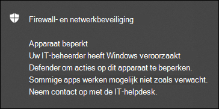

# Acties ondernemen op een apparaat

[!INCLUDE [Microsoft 365 Defender rebranding](../../includes/microsoft-defender.md)]

**Van toepassing op:**
- [Microsoft Defender voor Eindpunt](https://go.microsoft.com/fwlink/?linkid=2154037)

>Wilt u Defender voor Eindpunt ervaren? [Meld u aan voor een gratis proefabonnement.](https://www.microsoft.com/microsoft-365/windows/microsoft-defender-atp?ocid=docs-wdatp-respondmachine-abovefoldlink) 

Reageer snel op gedetecteerde aanvallen door apparaten te isoleren of een onderzoekspakket te verzamelen. Nadat u actie hebt ondernomen op apparaten, kunt u activiteitsgegevens controleren in het Actiecentrum.

Antwoordacties worden uitgevoerd boven aan een specifieke apparaatpagina en bevatten:

- Tags beheren
- Geautomatiseerd onderzoek starten
- Live-antwoordsessie starten
- Onderzoekspakket verzamelen
- Antivirusscan uitvoeren
- Het uitvoeren van apps beperken
- Apparaat isoleren
- Contact opnemen met een risicodeskundige
- Actiecentrum

 U kunt apparaatpagina's vinden in een van de volgende weergaven:

- **Dashboard Beveiligingsbewerkingen:** selecteer een apparaatnaam op de kaart Apparaten met risico.
- **Waarschuwingenwachtrij:** selecteer de naam van het apparaat naast het apparaatpictogram in de waarschuwingenwachtrij.
- **Lijst apparaten:** selecteer de kop van de naam van het apparaat in de lijst met apparaten.
- **Zoekvak:** selecteer Apparaat in de vervolgkeuzelijst en voer de naam van het apparaat in.

>[!IMPORTANT]
> - Deze antwoordacties zijn alleen beschikbaar voor apparaten Windows 10, versie 1703 of hoger. 
> - Voor niet-Windows platforms zijn reactiemogelijkheden (zoals apparaatisolatie) afhankelijk van de mogelijkheden van derden.

## Tags beheren

Voeg tags toe of beheer deze om een logische groep te maken. Apparaatlabels ondersteunen de juiste toewijzing van het netwerk, zodat u verschillende tags kunt koppelen om context vast te leggen en dynamische lijstcreatie als onderdeel van een incident kunt inschakelen.

Zie Apparaatlabels maken en beheren voor meer informatie over [apparaatlabels.](machine-tags.md)

## Geautomatiseerd onderzoek starten

U kunt indien nodig een nieuw geautomatiseerd algemeen onderzoek op het apparaat starten. Terwijl een onderzoek wordt uitgevoerd, wordt elke andere waarschuwing die van het apparaat wordt gegenereerd, toegevoegd aan een lopend geautomatiseerd onderzoek totdat dat onderzoek is voltooid. Bovendien worden deze apparaten toegevoegd aan het onderzoek als dezelfde bedreiging op andere apparaten wordt gezien.

Zie Overzicht van geautomatiseerde onderzoeken voor meer informatie over [geautomatiseerde onderzoeken.](automated-investigations.md)

## Live-antwoordsessie starten

Live response is een mogelijkheid die u direct toegang geeft tot een apparaat met behulp van een externe shell-verbinding. Dit geeft u de macht om uitgebreid onderzoek te doen en direct actie te ondernemen om snel geïdentificeerde bedreigingen in realtime te bevatten.

Live response is ontworpen om onderzoeken te verbeteren door u in staat te stellen om gerechtelijke gegevens te verzamelen, scripts uit te voeren, verdachte entiteiten te verzenden voor analyse, bedreigingen te corrigeren en proactief te zoeken naar nieuwe bedreigingen.

Zie Entiteiten onderzoeken op apparaten met livereactie voor [meer informatie over livereactie.](live-response.md)

## Onderzoekspakket verzamelen van apparaten

Als onderdeel van het onderzoek- of antwoordproces kunt u een onderzoekspakket verzamelen vanaf een apparaat. Door het onderzoekspakket te verzamelen, kunt u de huidige status van het apparaat identificeren en meer inzicht krijgen in de hulpprogramma's en technieken die door de aanvaller worden gebruikt.

Het pakket (Zip-bestand) downloaden en de gebeurtenissen op een apparaat onderzoeken

1. Selecteer **Onderzoekspakket verzamelen** in de rij met antwoordacties boven aan de apparaatpagina.
2. Geef in het tekstvak op waarom u deze actie wilt uitvoeren. Selecteer **Bevestigen**.
3. Het zip-bestand wordt gedownload

Alternatieve manier:

1. Selecteer **Actiecentrum** in de sectie Reactieacties van de apparaatpagina.

    

3. Selecteer in de fly-out actiecentrum de optie **Pakketverzamelingspakket dat beschikbaar is** om het zip-bestand te downloaden.
  
    

Het pakket bevat de volgende mappen:

| Map | Beschrijving |
|:---|:---------|
|Autoruns | Bevat een set bestanden die elk de inhoud vertegenwoordigen van het register van een bekend autostartinvoerpunt (ASEP) om de persistentie van de aanvaller op het apparaat te identificeren.    
<b>OPMERKING:</b> Als de registersleutel niet wordt gevonden, bevat het bestand het volgende bericht: 'FOUT: Het systeem kon de opgegeven registersleutel of -waarde niet vinden'.
                                                                                                                                |
|Geïnstalleerde programma's | Dit .CSV bevat de lijst met geïnstalleerde programma's die kunnen helpen bepalen wat er momenteel op het apparaat is geïnstalleerd. Zie voor meer informatie [Win32_Product klas.](https://go.microsoft.com/fwlink/?linkid=841509)                                                                                  |
|Netwerkverbindingen | Deze map bevat een set gegevenspunten die betrekking hebben op de connectiviteitsgegevens die kunnen helpen bij het identificeren van de connectiviteit met verdachte URL's, de command and control-infrastructuur (C&C) van de aanvaller, eventuele zijbewegingen of externe verbindingen.   - ActiveNetConnections.txt: hiermee worden protocolstatistieken en huidige TCP-/IP-netwerkverbindingen weergegeven. Biedt de mogelijkheid om te zoeken naar verdachte connectiviteit die is gemaakt door een proces.    - Arp.txt: hiermee wordt het huidige ARP-cachetabellen (Address Resolution Protocol) voor alle interfaces weergegeven.    ARP-cache kan extra hosts op een netwerk onthullen die zijn gehackt of verdachte systemen in het netwerk die mogelijk zijn gebruikt om een interne aanval uit te voeren.   - DnsCache.txt- Geeft de inhoud weer van de cache met dns-client resolver, die zowel items bevat die vooraf zijn geladen vanuit het lokale hosts-bestand als alle recent verkregen resourcerecords voor naamquery's die door de computer zijn opgelost. Dit kan helpen bij het identificeren van verdachte verbindingen.    - IpConfig.txt: hiermee wordt de volledige TCP/IP-configuratie voor alle adapters weergegeven. Adapters kunnen fysieke interfaces vertegenwoordigen, zoals geïnstalleerde netwerkadapters of logische interfaces, zoals inbelverbindingen.    - FirewallExecutionLog.txt en pfirewall.log                                                                                  |
| Prefetch-bestanden| Windows Prefetch-bestanden zijn ontworpen om het opstarten van toepassingen te versnellen. Het kan worden gebruikt om alle bestanden bij te houden die onlangs in het systeem zijn gebruikt en om sporen te vinden voor toepassingen die mogelijk zijn verwijderd, maar nog steeds in de lijst met prefetch-bestanden kunnen worden gevonden.    - Map Prefetch: bevat een kopie van de prefetch-bestanden van `%SystemRoot%\Prefetch` . OPMERKING: Het wordt voorgesteld om een prefetch-bestandsviewer te downloaden om de prefetch-bestanden te bekijken.    - PrefetchFilesList.txt: bevat de lijst met alle gekopieerde bestanden die kunnen worden gebruikt om bij te houden of er sprake was van kopiefouten in de map prefetch.                                                                                                      |
| Processen| Bevat een .CSV met de lopende processen, waarmee u de huidige processen kunt identificeren die op het apparaat worden uitgevoerd. Dit kan handig zijn bij het identificeren van een verdacht proces en de status ervan.                                                                                                                                                                                                       |
| Geplande taken| Bevat een .CSV met de geplande taken, die kunnen worden gebruikt om routines te identificeren die automatisch worden uitgevoerd op een gekozen apparaat om te zoeken naar verdachte code die is ingesteld om automatisch uit te voeren.                                                                                                                                                                                                      |
| Beveiligingsgebeurtenislogboek| Bevat het beveiligingsgebeurtenislogboek, dat records bevat van aanmeldings- of aanmeldingsactiviteit of andere beveiligingsgerelateerde gebeurtenissen die zijn opgegeven in het auditbeleid van het systeem.   
<b>OPMERKING:</b> Open het gebeurtenislogboekbestand met Behulp van Gebeurtenisviewer.
                                                                                    |
| Services| Bevat een .CSV met services en hun staten.                                                                                      |
| Windows Server Message Block (SMB) sessies | Hiermee worden gedeelde toegang tot bestanden, printers en seriële poorten en diverse communicatie tussen knooppunten in een netwerk vermeld. Dit kan helpen bij het identificeren van gegevens exfiltratie of zijverbeweging.    Bevat bestanden voor SMBInboundSessions en SMBOutboundSession.    
<b>OPMERKING:</b> Als er geen sessies zijn (binnenkomende of uitgaande sessies), krijgt u een tekstbestand waarin wordt gezegd dat er geen SMB-sessies zijn gevonden.
                                                                                                                          |
| Systeeminformatie| Bevat een SystemInformation.txt met systeemgegevens, zoals versie van het besturingssysteem en netwerkkaarten.                                                                                     |
| Temp Directories| Bevat een set tekstbestanden met de bestanden in %Temp% voor elke gebruiker in het systeem.    Dit kan helpen bij het bijhouden van verdachte bestanden die een aanvaller mogelijk op het systeem heeft laten vallen.    
<b>OPMERKING:</b> Als het bestand het volgende bericht bevat: 'Het systeem kan het opgegeven pad niet vinden', betekent dit dat er geen tijdelijke adreslijst voor deze gebruiker is en dat de gebruiker zich mogelijk niet heeft aanmelden bij het systeem.
                                                                                                                                         |
| Gebruikers en groepen| Bevat een lijst met bestanden die elk een groep en de leden vertegenwoordigen.                                                                                                                   |
|WdSupportLogs| Biedt de MpCmdRunLog.txt en MPSupportFiles.cab     
<b>OPMERKING:</b> Deze map wordt alleen gemaakt op Windows 10, versie 1709 of hoger met update-rollup van februari 2020 of recenter geïnstalleerd:  Win10 1709 (RS3) Build 16299.1717 : [KB4537816](https://support.microsoft.com/en-us/help/4537816/windows-10-update-kb4537816)   Win10 1803 (RS4) Build 17134.1345 : [KB4537795](https://support.microsoft.com/en-us/help/4537795/windows-10-update-kb4537795)   Win10 1809 (RS5) Build 17763.1075 : [KB4537818](https://support.microsoft.com/en-us/help/4537818/windows-10-update-kb4537818)   Win10 1903/1909 (19h1/19h2) Builds 18362.693 en 18363.693 : [KB4535996](https://support.microsoft.com/en-us/help/4535996/windows-10-update-kb4535996) 
                                                                                                                    |
| CollectionSummaryReport.xls| Dit bestand is een samenvatting van de verzameling onderzoekspakketten, het bevat de lijst met gegevenspunten, de opdracht die wordt gebruikt om de gegevens op te halen, de uitvoeringsstatus en de foutcode in geval van een fout. U kunt dit rapport gebruiken om bij te houden of het pakket alle verwachte gegevens bevat en te bepalen of er fouten zijn. |

## Een Microsoft Defender Antivirus uitvoeren op apparaten

Als onderdeel van het onderzoek- of antwoordproces kunt u op afstand een antivirusscan starten om malware te identificeren en te herstellen die mogelijk aanwezig is op een gecompromitteerd apparaat.

>[!IMPORTANT]
>- Deze actie is beschikbaar voor apparaten op Windows 10, versie 1709 of hoger.
>- Een Microsoft Defender Antivirus (Microsoft Defender AV) kan worden uitgevoerd naast andere antivirusoplossingen, ongeacht of Microsoft Defender AV de actieve antivirusoplossing is of niet. Microsoft Defender AV kan in de passieve modus staan. Zie Microsoft Defender Antivirus [compatibiliteit voor meer informatie.](https://docs.microsoft.com/windows/security/threat-protection/microsoft-defender-antivirus/microsoft-defender-antivirus-compatibility.md)

Als u Antivirusscan uitvoeren hebt **geselecteerd,** selecteert u het scantype dat u wilt uitvoeren (snel of vol) en voegt u een opmerking toe voordat u de scan bevestigt.

In het Actiecentrum worden de scangegevens weergegeven en de tijdlijn van het apparaat bevat een nieuwe gebeurtenis, waarin wordt weerspiegeld dat er een scanactie is verzonden op het apparaat. Microsoft Defender AV-waarschuwingen geven alle detecties weer die tijdens de scan zijn opgedoken.

>[!NOTE]
>Wanneer u een scan activeert met de actie Defender voor eindpuntreactie, is de waarde scanAvgCPULoadFactor van Microsoft Defender antivirus nog steeds van toepassing en wordt de CPU-impact van de scan beperkt.  Als ScanAvgCPULoadFactor niet is geconfigureerd, is de standaardwaarde een limiet van 50% maximale CPU-belasting tijdens een scan. 
>Zie [Configure-advanced-scan-types-microsoft-defender-antivirus](https://docs.microsoft.com/windows/security/threat-protection/microsoft-defender-antivirus/configure-advanced-scan-types-microsoft-defender-antivirus)voor meer informatie.

## Het uitvoeren van apps beperken

Naast het bevatten van een aanval door schadelijke processen te stoppen, kunt u ook een apparaat vergrendelen en voorkomen dat volgende pogingen van potentieel schadelijke programma's worden uitgevoerd.

>[!IMPORTANT]
> - Deze actie is beschikbaar voor apparaten op Windows 10, versie 1709 of hoger.
> - Deze functie is beschikbaar als uw organisatie gebruikmaakt van Microsoft Defender Antivirus.
> - Deze actie moet voldoen aan de Windows Defender de codeintegriteitsbeleidsindelingen en -ondertekeningsvereisten voor Toepassingsbeheer. Zie Code [integrity policy formats and signing (Code integrity policy formats and signing) voor meer informatie.](https://docs.microsoft.com/windows/device-security/device-guard/requirements-and-deployment-planning-guidelines-for-device-guard#code-integrity-policy-formats-and-signing)

Als u wilt voorkomen dat een toepassing wordt uitgevoerd, wordt een codeintegriteitsbeleid toegepast waarmee bestanden alleen kunnen worden uitgevoerd als ze zijn ondertekend door een door Microsoft uitgegeven certificaat. Deze beperkingsmethode kan voorkomen dat een aanvaller gecompromitteerde apparaten kan beheren en verdere schadelijke activiteiten kan uitvoeren.

>[!NOTE]
>U kunt de beperking voor toepassingen op elk moment ongedaan maken. De knop op de apparaatpagina wordt gewijzigd in **app-beperkingen** verwijderen en u ondernomen dezelfde stappen als het beperken van de uitvoering van apps.

Nadat u De uitvoering van **apps beperken op** de apparaatpagina hebt geselecteerd, typt u een opmerking en selecteert u **Bevestigen**. In het Actiecentrum worden de scangegevens weergegeven en de tijdlijn van het apparaat bevat een nieuwe gebeurtenis.

**Melding op apparaatgebruiker:** 
Wanneer een app is beperkt, wordt de volgende melding weergegeven om de gebruiker te informeren dat een app niet kan worden uitgevoerd:

## Apparaten isoleren van het netwerk

Afhankelijk van de ernst van de aanval en de gevoeligheid van het apparaat, kunt u het apparaat isoleren van het netwerk. Met deze actie kunt u voorkomen dat de aanvaller het gecompromitteerde apparaat kan beheren en verdere activiteiten kan uitvoeren, zoals gegevens exfiltreren en zijbewegingen.

>[!IMPORTANT]
>- Volledige isolatie is beschikbaar voor apparaten op Windows 10, versie 1703.
>- Selectieve isolatie is beschikbaar voor apparaten op Windows 10, versie 1709 of hoger.
>- Bij het isoleren van een apparaat zijn alleen bepaalde processen en bestemmingen toegestaan. Daarom kunnen apparaten die zich achter een volledige VPN-tunnel hebben geplaatst, de cloudservice van Microsoft Defender voor Eindpunt niet meer bereiken nadat het apparaat is geïsoleerd. We raden u aan een VPN voor gesplitste tunneling te gebruiken voor Microsoft Defender voor eindpunten en Microsoft Defender Antivirus cloudbeveiligingsverkeer te gebruiken.

Met deze functie voor apparaatisolatie wordt het gecompromitteerde apparaat losgekoppeld van het netwerk en blijft de verbinding met de Defender voor Eindpunt-service behouden, waardoor het apparaat nog steeds wordt gecontroleerd.

Op Windows 10 versie 1709 of hoger hebt u extra controle over het isolatieniveau van het netwerk. U kunt er ook voor kiezen om Outlook, Microsoft Teams en Skype voor Bedrijven in te stellen (ook wel 'Selectief isolement' genoemd).

>[!NOTE]
>U kunt het apparaat op elk moment opnieuw verbinden met het netwerk. De knop op de apparaatpagina wordt gewijzigd in **'Los** van isolatie' en u doet dezelfde stappen als het apparaat isoleren.

Nadat u **Isoleert apparaat op** de apparaatpagina hebt geselecteerd, typt u een opmerking en selecteert u **Bevestigen**. In het Actiecentrum worden de scangegevens weergegeven en de tijdlijn van het apparaat bevat een nieuwe gebeurtenis.

>[!NOTE]
>Het apparaat blijft verbonden met de Defender for Endpoint-service, zelfs als het is geïsoleerd van het netwerk. Als u ervoor hebt gekozen om Outlook en Skype voor Bedrijven in te stellen, kunt u communiceren met de gebruiker terwijl het apparaat is geïsoleerd.

**Melding op apparaatgebruiker:** 
Wanneer een apparaat wordt geïsoleerd, wordt de volgende melding weergegeven om de gebruiker te informeren dat het apparaat wordt geïsoleerd van het netwerk:

## Contact opnemen met een risicodeskundige

U kunt een Bedreigingsexpert van Microsoft raadplegen voor meer inzichten over een mogelijk gecompromitteerd apparaat of al gecompromitteerde apparaten. Microsoft Threat Experts kan rechtstreeks vanuit het Microsoft Defender-beveiligingscentrum worden ingeschakeld voor een tijdige en nauwkeurige reactie. Experts bieden inzichten, niet alleen met betrekking tot een mogelijk gecompromitteerd apparaat, maar ook om meer inzicht te krijgen in complexe bedreigingen, gerichte aanvalsmeldingen die u ontvangt, of als u meer informatie nodig hebt over de waarschuwingen of een context voor bedreigingsinformatie die u ziet op uw portaldashboard.

Zie [Een Microsoft Threat Expert raadplegen](https://docs.microsoft.com/microsoft-365/security/defender-endpoint/configure-microsoft-threat-experts#consult-a-microsoft-threat-expert-about-suspicious-cybersecurity-activities-in-your-organization) voor meer informatie.

## Activiteitsdetails controleren in Actiecentrum

Het **Actiecentrum** bevat informatie over acties die zijn ondernomen op een apparaat of bestand. U kunt de volgende details bekijken:

- Verzameling onderzoekspakketten
- Antivirusscan
- App-beperking
- Apparaatisolatie

Alle andere gerelateerde details worden ook weergegeven, bijvoorbeeld inzendingsdatum/-tijd, gebruiker indienen en als de actie is geslaagd of mislukt.

## Verwant onderwerp
- [Acties ondernemen op een bestand](respond-file-alerts.md)
- [Onnauwkeurigheid van rapport](https://docs.microsoft.com/microsoft-365/security/defender-endpoint/tvm-security-recommendation#report-inaccuracy)
